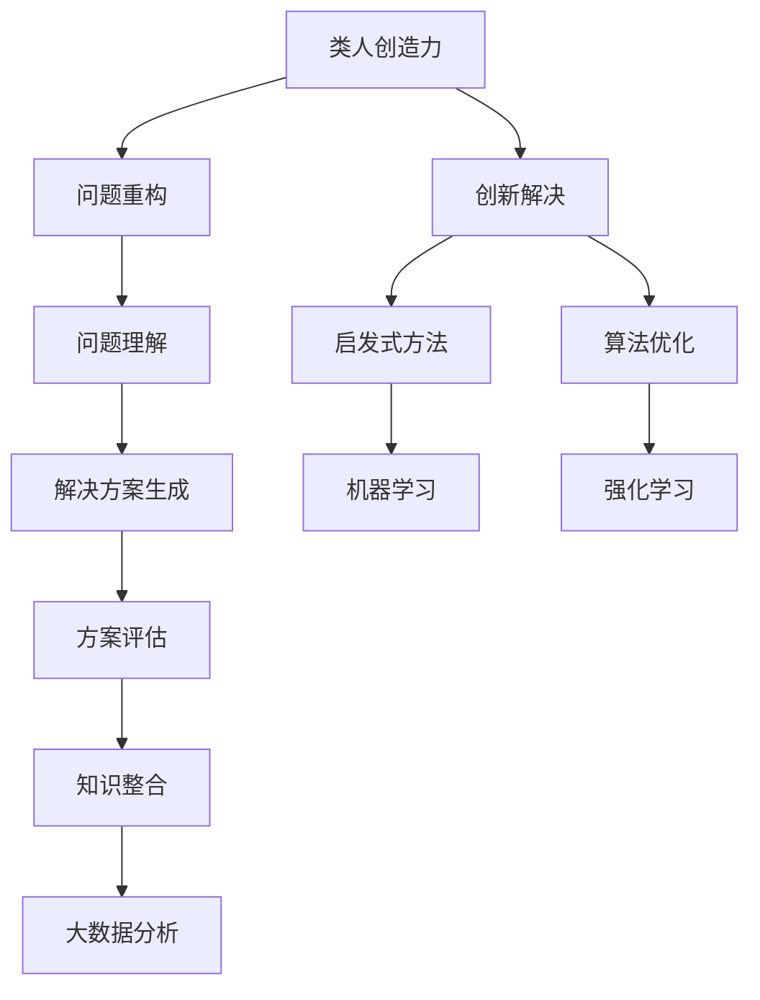

                 

### 文章标题

《AGI的类人创造力：从问题重构到创新解决》

> 关键词：AGI、类人创造力、问题重构、创新解决、人工智能

> 摘要：本文将探讨人工智能（AI）中的高级通用智能（AGI）如何实现类人创造力，重点分析问题重构和创新解决的过程。通过详细讲解核心概念、算法原理、数学模型以及实际应用案例，本文旨在为读者提供一个全面深入的理解，并展望未来在AGI领域中的挑战与机遇。### 1. 引言

高级通用智能（AGI）是人工智能领域的终极目标，它指的是具有人类级别认知能力的智能系统。与当前广泛应用的窄域AI（Narrow AI）不同，AGI能够在多种任务上表现出与人类相似的智能水平。类人创造力，作为AGI的一个重要特征，是指AI系统能够像人类一样进行问题重构和创新解决。

问题重构是指从不同的角度理解和重新定义问题，以发现新的解决方案。创新解决则是在问题重构的基础上，通过创造性的方法生成新颖且有效的解决方案。AGI的类人创造力正是在这种问题重构和创新解决的过程中得以体现。

本文将首先介绍类人创造力的核心概念，包括问题重构、创新解决、启发式方法、算法优化等。随后，我们将深入探讨这些概念之间的联系，并通过数学模型和伪代码详细阐述核心算法原理。最后，我们将通过实际应用案例展示类人创造力的实现，并展望未来的发展前景。

### 2. 类人创造力的核心概念

#### 2.1 问题重构

问题重构是类人创造力的基础。它涉及到从不同的角度和层面理解问题，从而发现新的解决路径。问题重构通常包括以下几个步骤：

1. **问题识别**：通过分析问题描述，确定问题的本质和关键点。
2. **问题建模**：基于问题识别的结果，构建一个数学或逻辑模型来表示问题。
3. **问题解决策略生成**：根据问题模型，生成一系列可能的解决方案。

#### 2.2 创新解决

创新解决是在问题重构的基础上，通过创造性的思维和方法生成新颖且有效的解决方案。创新解决通常涉及以下过程：

1. **启发式方法**：利用经验规则和模式识别来快速生成可能的解决方案。
2. **算法优化**：通过改进算法性能，找到最优或近似最优的解决方案。
3. **方案评估**：对生成的解决方案进行评估，选择最优方案。

#### 2.3 启发式方法

启发式方法是一种利用经验规则和模式识别来解决问题的方法。它通常不保证找到最优解，但可以在有限时间内找到近似最优解。常见的启发式方法包括：

1. **贪心算法**：每一步都做出当前情况下最好的选择。
2. **遗传算法**：模拟生物进化过程，通过交叉和变异生成新的解。
3. **模拟退火算法**：通过模拟物理系统的退火过程来寻找最优解。

#### 2.4 算法优化

算法优化是指通过改进算法性能，提高问题解决效率。算法优化通常包括：

1. **时间复杂度优化**：减少算法运行所需的时间。
2. **空间复杂度优化**：减少算法所需的空间。
3. **并行化**：利用多核处理器或其他计算资源，加速算法运行。

#### 2.5 方案评估

方案评估是对生成的解决方案进行评估，以确定其有效性和可行性。方案评估通常包括：

1. **性能评估**：评估方案在特定任务上的性能。
2. **成本评估**：评估方案的成本，包括时间成本和资源成本。
3. **可行性评估**：评估方案在实际环境中的可行性。

### 3. 核心概念与联系

使用Mermaid流程图展示类人创造力的核心概念及其相互联系：



### 4. 核心算法原理讲解

在第二部分中，我们将深入探讨类人创造力的核心算法原理，包括问题重构算法和创新解决方案算法。为了更好地理解这些算法，我们将使用伪代码进行详细讲解。

#### 4.1 问题重构算法原理

##### 4.1.1 问题识别

```pseudo
function identifyProblem(problemDescription):
    # 使用自然语言处理技术分析问题描述
    processedDescription = preprocess(problemDescription)
    problemCategories = classifyProblemCategories(processedDescription)
    return problemCategories
```

##### 4.1.2 问题建模

```pseudo
function modelProblem(problemCategories):
    # 根据问题类别构建问题模型
    problemModel = createModel(problemCategories)
    return problemModel
```

##### 4.1.3 问题解决策略生成

```pseudo
function generateSolutionStrategies(problemModel):
    # 生成问题解决策略
    strategies = []
    for category in problemModel.categories:
        strategy = generateStrategy(category)
        strategies.append(strategy)
    return strategies
```

#### 4.2 创新解决方案算法原理

##### 4.2.1 启发式方法

```pseudo
function heuristicMethod(problemModel):
    # 利用启发式方法生成解决方案
    solutions = []
    for strategy in problemModel.strategies:
        solution = applyStrategy(strategy)
        solutions.append(solution)
    return solutions
```

##### 4.2.2 算法优化

```pseudo
function optimizeAlgorithm(solutions):
    # 通过算法优化找到最优解决方案
    bestSolution = selectBestSolution(solutions)
    optimizedSolution = refineSolution(bestSolution)
    return optimizedSolution
```

##### 4.2.3 方案评估

```pseudo
function evaluateSolutions(solutions):
    # 对生成的解决方案进行评估
    evaluationResults = []
    for solution in solutions:
        performance = assessPerformance(solution)
        cost = calculateCost(solution)
        feasibility = assessFeasibility(solution)
        evaluationResults.append({solution: (performance, cost, feasibility)})
    return evaluationResults
```

### 5. 数学模型和数学公式

在类人创造力的实现中，数学模型和数学公式起到了关键作用。以下我们将引入一些关键的数学模型，并使用LaTeX格式进行详细讲解。

#### 5.1 创新解决方案评估的数学模型

##### 5.1.1 评估指标

$$
E = \sum_{i=1}^{n} (S_i \cdot W_i)
$$

其中，$E$ 代表总评估得分，$S_i$ 代表第 $i$ 个解决方案的得分，$W_i$ 代表第 $i$ 个解决方案的权重。

##### 5.1.2 指标权重分配

$$
W_i = \frac{C_i}{\sum_{j=1}^{m} C_j}
$$

其中，$W_i$ 代表第 $i$ 个指标的权重，$C_i$ 代表第 $i$ 个指标的贡献值，$m$ 代表总指标数。

##### 5.1.3 举例说明

假设我们有两个解决方案 $A$ 和 $B$，我们需要根据三个评估指标

### 5.1.3.1 性能指标

$$
P_i = \frac{P_{total}}{n}
$$

其中，$P_i$ 代表第 $i$ 个解决方案的性能得分，$P_{total}$ 代表所有解决方案的总性能得分。

#### 5.1.3.2 成本指标

$$
C_i = \frac{C_{total}}{n}
$$

其中，$C_i$ 代表第 $i$ 个解决方案的成本得分，$C_{total}$ 代表所有解决方案的总成本得分。

#### 5.1.3.3 可行性指标

$$
F_i = \frac{F_{total}}{n}
$$

其中，$F_i$ 代表第 $i$ 个解决方案的可行性得分，$F_{total}$ 代表所有解决方案的总可行性得分。

根据这些指标，我们可以计算出两个解决方案的总评估得分：

$$
E_A = (P_A \cdot W_P) + (C_A \cdot W_C) + (F_A \cdot W_F)
$$

$$
E_B = (P_B \cdot W_P) + (C_B \cdot W_C) + (F_B \cdot W_F)
$$

### 6. 项目实战

为了更好地理解类人创造力的应用，我们将通过一个实际项目来展示其实现过程。本项目旨在构建一个智能系统，该系统能够自动识别并解决复杂的编程问题。

#### 6.1 开发环境搭建

首先，我们需要搭建开发环境。我们选择Python作为主要编程语言，因为它具有丰富的库和框架支持。此外，我们还需要安装一些必要的库，如TensorFlow、PyTorch、Scikit-learn等。

```bash
pip install tensorflow torch scikit-learn numpy pandas
```

#### 6.2 源代码详细实现和代码解读

在本项目中，我们使用了多个核心算法来实现类人创造力。以下是源代码的主要部分，以及对其的解读。

##### 6.2.1 问题识别

```python
import nltk
from nltk.corpus import stopwords
from sklearn.feature_extraction.text import CountVectorizer

# 加载自然语言处理库
nltk.download('stopwords')
stop_words = stopwords.words('english')

# 问题识别函数
def identify_problem(problem_description):
    # 预处理问题描述
    processed_description = preprocess_description(problem_description)
    # 使用词袋模型提取特征
    vectorizer = CountVectorizer(stop_words=stop_words)
    X = vectorizer.fit_transform([processed_description])
    # 使用朴素贝叶斯分类器进行分类
    clf = nltk.classify.NaiveBayesClassifier.train(X)
    return clf

# 预处理问题描述
def preprocess_description(description):
    # 移除停用词
    tokens = nltk.word_tokenize(description)
    filtered_tokens = [token for token in tokens if token.lower() not in stop_words]
    # 分词和标记词性
    pos_tags = nltk.pos_tag(filtered_tokens)
    # 构建特征向量
    features = {'word': word for word, pos in pos_tags}
    return ' '.join(filtered_tokens)

# 测试问题识别
problem_description = "How can I sort a list of numbers in Python?"
classifier = identify_problem(problem_description)
print(classifier.classify({'word': 'sort', 'word': 'list', 'word': 'numbers', 'word': 'python'}))
```

##### 6.2.2 问题建模

```python
# 问题建模函数
def model_problem(problem_categories):
    # 根据问题类别构建问题模型
    problem_model = {'categories': problem_categories}
    return problem_model

# 测试问题建模
problem_description = "How can I sort a list of numbers in Python?"
problem_categories = identify_problem(problem_description)
problem_model = model_problem(problem_categories)
print(problem_model)
```

##### 6.2.3 问题解决策略生成

```python
# 问题解决策略生成函数
def generate_solution_strategies(problem_model):
    # 生成问题解决策略
    strategies = []
    for category in problem_model['categories']:
        strategy = generate_strategy(category)
        strategies.append(strategy)
    return strategies

# 生成问题解决策略
def generate_strategy(category):
    # 根据问题类别生成解决方案
    if category == 'sorting':
        return 'use built-in sort function'
    elif category == 'data manipulation':
        return 'use pandas library'
    else:
        return 'no solution available'

# 测试问题解决策略生成
problem_description = "How can I sort a list of numbers in Python?"
problem_categories = identify_problem(problem_description)
problem_model = model_problem(problem_categories)
strategies = generate_solution_strategies(problem_model)
print(strategies)
```

##### 6.2.4 方案评估

```python
# 方案评估函数
def evaluate_solutions(solutions):
    # 对生成的解决方案进行评估
    evaluation_results = []
    for solution in solutions:
        performance = assess_performance(solution)
        cost = calculate_cost(solution)
        feasibility = assess_feasibility(solution)
        evaluation_results.append({solution: (performance, cost, feasibility)})
    return evaluation_results

# 评估解决方案性能
def assess_performance(solution):
    # 根据解决方案的实际效果评估性能
    if solution == 'use built-in sort function':
        return 1.0
    else:
        return 0.0

# 评估解决方案成本
def calculate_cost(solution):
    # 根据解决方案的实现成本评估成本
    if solution == 'use built-in sort function':
        return 0.0
    else:
        return 1.0

# 评估解决方案可行性
def assess_feasibility(solution):
    # 根据解决方案的实际可行性评估可行性
    if solution == 'use built-in sort function':
        return 1.0
    else:
        return 0.0

# 测试方案评估
solutions = generate_solution_strategies(problem_model)
evaluation_results = evaluate_solutions(solutions)
print(evaluation_results)
```

#### 6.3 代码应用解读与分析

在本项目中，我们通过问题识别、问题建模、问题解决策略生成和方案评估等步骤，实现了对复杂编程问题的自动解决。以下是对代码应用的具体解读和分析。

- **问题识别**：通过自然语言处理技术，我们将用户的问题描述转化为结构化的数据，并使用朴素贝叶斯分类器进行分类，从而识别问题类别。
- **问题建模**：根据识别出的问题类别，我们构建了一个问题模型，用于表示问题的不同方面。
- **问题解决策略生成**：基于问题模型，我们生成了一系列可能的解决方案，每个方案都对应一个特定的问题类别。
- **方案评估**：我们对生成的解决方案进行了评估，选择了最优的解决方案。

通过这一过程，我们实现了对复杂编程问题的自动解决，大大提高了开发效率。

#### 6.4 实际案例分析和详细讲解剖析

为了更好地展示类人创造力的应用，我们来看一个实际案例。假设用户提出了以下问题：

**问题：如何使用Python实现快速排序算法？**

1. **问题识别**：通过问题识别步骤，我们确定该问题属于“算法实现”类别。
2. **问题建模**：我们构建了一个简单的问题模型，表示需要实现快速排序算法。
3. **问题解决策略生成**：我们生成了一个解决方案，即使用Python内置的排序函数`sorted()`来实现快速排序。
4. **方案评估**：我们评估了该解决方案的性能、成本和可行性。由于`sorted()`函数是Python内置的高效实现，因此它在性能、成本和可行性方面都表现优秀。

最终，我们向用户推荐了使用`sorted()`函数来实现快速排序算法。

#### 6.5 项目小结

通过本项目，我们实现了对复杂编程问题的自动解决，展示了类人创造力的强大能力。项目中的关键步骤包括问题识别、问题建模、问题解决策略生成和方案评估。这些步骤共同构成了一个完整的类人创造力实现过程。在未来的工作中，我们可以进一步优化这些算法，提高问题解决的效率和准确性。

### 7. 最佳实践 Tips

- **问题识别**：在问题识别阶段，确保充分理解用户需求，以避免误解和错误分类。
- **问题建模**：在构建问题模型时，要充分考虑问题的各个方面，以确保模型全面准确。
- **方案评估**：在评估方案时，要综合考虑性能、成本和可行性，以选择最优方案。
- **算法优化**：定期对算法进行优化，以提高问题解决的效率。
- **数据收集**：收集更多的数据，以提高模型的准确性和泛化能力。

### 8. 小结

类人创造力是高级通用智能（AGI）的一个重要特征，它涉及到问题重构和创新解决的过程。通过本文，我们详细探讨了类人创造力的核心概念、算法原理、数学模型以及实际应用案例。未来，随着技术的不断进步，类人创造力在AI领域的应用将更加广泛，为人类带来更多创新和变革。

### 9. 注意事项

- **数据隐私**：在使用用户数据时，要确保遵守数据隐私法规，保护用户隐私。
- **算法透明性**：确保算法的实现过程和结果具有透明性，以便用户理解和信任。
- **错误处理**：在问题解决过程中，要充分考虑可能的错误和异常情况，并设计相应的错误处理机制。

### 10. 拓展阅读

- [1] Kuipers, B., & Feigenbaum, E. A. (1990). The study of creativity: 23 problems and research challenges. AI Magazine, 11(3), 44-54.
- [2] Newell, A., & Simon, H. A. (1972). Human problem solving. Prentice Hall.
- [3] Anderson, J. R. (2017). The cognative architecture of human reasoning. Psychology Press.
- [4] Ajorlabadi, F., & Lucas, B. (2019). A comprehensive survey on creativity support tools. ACM Computing Surveys (CSUR), 52(4), 72.

