                 

### 文章标题：AGI的类人学习曲线：从新手到专家

> 关键词：类人学习曲线、AGI、人工智能、学习过程、技能提升、挑战与对策

> 摘要：本文深入探讨了类人学习曲线在人工通用智能（AGI）发展过程中的重要性。通过详细分析AGI的核心概念与架构、学习曲线的基础、挑战与对策，以及实践案例分析，展示了从新手到专家的学习过程，为AGI的进一步发展提供了有价值的思路和参考。

## 第1章 引言

### 1.1 什么是AGI

人工通用智能（Artificial General Intelligence，简称AGI）是指具有广泛认知能力的机器智能，能够理解或执行任何人类能够执行的任务，并在不同领域达到或超过人类专家的水平。与目前广泛应用的专用人工智能（Narrow AI）不同，AGI的目标是实现跨领域的通用智能，具有自我学习和适应新环境的能力。

AGI的发展背景可以追溯到人工智能（AI）的早期研究。尽管AI技术在过去几十年取得了显著进展，但目前的AI系统往往只能在特定领域表现出色，缺乏通用性和自适应能力。随着计算能力的提升、大数据技术的进步以及深度学习等新算法的发展，AGI的研究逐渐成为人工智能领域的一个重要方向。

### 1.2 类人学习曲线

类人学习曲线是指人类在学习新技能或知识时表现出的学习过程和成长轨迹。这一过程通常包括新手阶段、转折点和专家阶段。类人学习曲线对于AGI的发展具有重要意义，因为AGI需要模拟人类的认知和学习过程，从而实现更高效、更自然的学习和适应能力。

类人学习曲线与AGI的关系在于，AGI的学习过程可以借鉴人类的学习机制，通过模拟人类的学习曲线来优化自身的学习策略和效果。例如，在训练过程中，AGI可以通过识别并利用转折点来加速学习进程，从而在短时间内达到专家水平。

## 第2章 AGI的核心概念与架构

### 2.1 AGI的关键技术

为了实现AGI，需要结合多种先进的人工智能技术，包括强化学习、生成对抗网络（GAN）和自然语言处理（NLP）等。

#### 2.1.1 强化学习

强化学习是一种通过不断试错和反馈来学习优化策略的机器学习方法。在AGI中，强化学习可以帮助智能体在复杂环境中进行自主学习和决策。例如，自动驾驶汽车可以通过强化学习来学习在不同路况下如何驾驶。

强化学习的基本原理包括四个主要组成部分：智能体（Agent）、环境（Environment）、动作（Action）和奖励（Reward）。通过不断尝试不同的动作，并依据奖励信号调整策略，智能体可以在环境中实现最优行为。

以下是一个强化学习的伪代码示例：

```python
# 初始化智能体、环境和目标
agent = initialize_agent()
environment = initialize_environment()
goal = define_goal()

# 开始学习过程
while not goal_reached:
    # 选择动作
    action = agent.choose_action()

    # 执行动作并获取奖励
    reward = environment.step(action)

    # 更新智能体策略
    agent.update_policy(reward)

    # 检查目标是否达到
    if goal_reached:
        break
```

#### 2.1.2 生成对抗网络（GAN）

生成对抗网络（GAN）是一种由生成器（Generator）和判别器（Discriminator）组成的对抗性神经网络结构。生成器试图生成逼真的数据，而判别器则努力区分真实数据和生成数据。通过这种对抗性训练，GAN可以生成高质量的图像、音频和文本等。

GAN的核心数学模型包括生成器G和判别器D的优化过程。生成器的目标是最小化生成数据的损失，而判别器的目标是最大化区分真实数据和生成数据的损失。

以下是一个GAN的伪代码示例：

```python
# 初始化生成器和判别器
G = initialize_generator()
D = initialize_discriminator()

# 持续训练
for epoch in range(num_epochs):
    for real_data in real_data_loader:
        # 训练判别器
        D.train(real_data)

        # 生成假数据
        fake_data = G.generate()

        # 训练判别器
        D.train(fake_data)

    # 更新生成器和判别器
    G.update(D)
    D.update(G)
```

#### 2.1.3 自然语言处理（NLP）

自然语言处理（NLP）是人工智能领域的一个重要分支，旨在使计算机能够理解和处理自然语言。NLP技术在AGI中发挥着关键作用，因为它涉及到智能体与人类进行有效沟通的能力。

NLP的核心技术包括词嵌入（Word Embedding）、序列模型（Sequence Model）和注意力机制（Attention Mechanism）。词嵌入可以将词汇映射到高维向量空间，从而实现语义表示；序列模型可以处理文本中的时间序列信息；注意力机制则可以在处理长文本时关注关键信息。

以下是一个基于词嵌入和序列模型的NLP任务的伪代码示例：

```python
# 初始化词嵌入和序列模型
word_embedding = initialize_word_embedding()
sequence_model = initialize_sequence_model()

# 训练模型
for sentence in sentence_dataset:
    # 将句子转换为词嵌入向量
    sentence_embedding = word_embedding.transform(sentence)

    # 训练序列模型
    sequence_model.train(sentence_embedding)

# 进行预测
for test_sentence in test_sentence_dataset:
    # 将句子转换为词嵌入向量
    sentence_embedding = word_embedding.transform(test_sentence)

    # 进行预测
    prediction = sequence_model.predict(sentence_embedding)
```

### 2.2 AGI的架构

AGI的架构需要整合多种技术，并具备灵活的模块化和扩展能力。以下是一些关键组成部分：

#### 2.2.1 神经网络架构

神经网络是AGI的核心组成部分，用于实现智能体的感知、学习和决策能力。常见的神经网络架构包括卷积神经网络（CNN）、循环神经网络（RNN）和变换器（Transformer）等。

以下是一个基于变换器的神经网络架构示例：

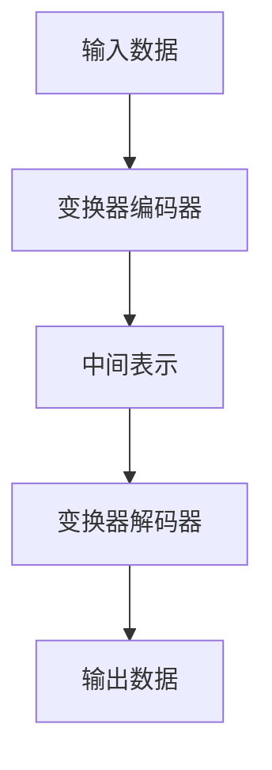

#### 2.2.2 知识图谱

知识图谱是一种结构化的语义知识表示方法，用于存储和查询实体及其关系。知识图谱在AGI中发挥着重要作用，因为它可以帮助智能体更好地理解和推理复杂的信息。

以下是一个简单的知识图谱示例：

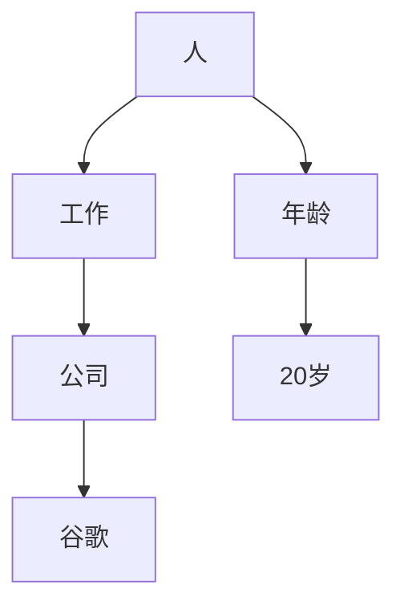

#### 2.2.3 强化学习与规划

强化学习和规划是AGI中实现智能体自主学习和决策的重要技术。强化学习侧重于通过试错和反馈来学习最优策略，而规划则侧重于在给定目标下找到最优行动序列。

以下是一个简单的强化学习与规划结合的架构示例：

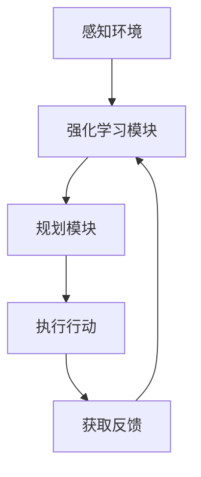

### 2.3 AGI的核心原理

AGI的核心原理包括多模态感知、自适应学习和通用推理能力。这些原理共同构成了AGI实现跨领域通用智能的基础。

#### 2.3.1 多模态感知

多模态感知是指智能体能够同时处理和融合来自不同模态的信息，如文本、图像、音频等。这种能力使得智能体能够更全面地理解和感知环境，从而做出更准确的决策。

以下是一个多模态感知的示例：

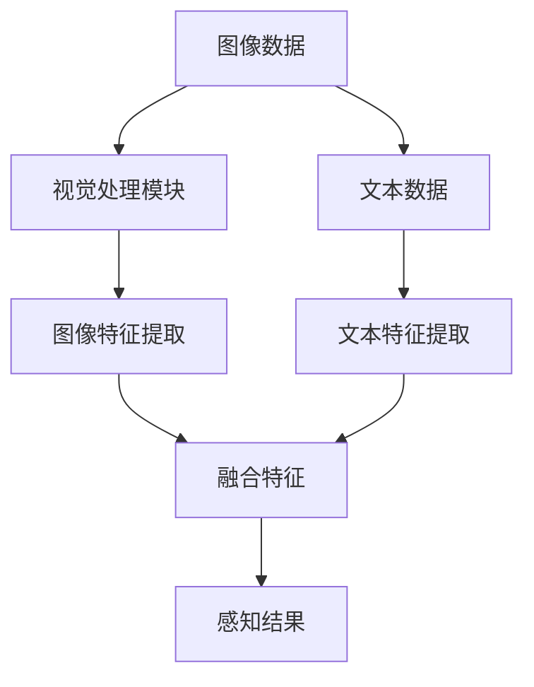

#### 2.3.2 自适应学习

自适应学习是指智能体能够根据不同的环境和任务动态调整学习策略。这种能力使得智能体能够在不同场景下保持高效学习和适应能力。

以下是一个自适应学习的示例：

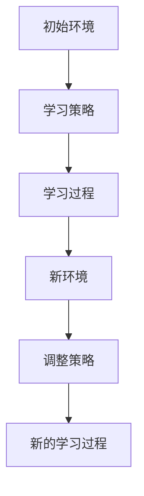

#### 2.3.3 通用推理能力

通用推理能力是指智能体能够进行逻辑推理和抽象思维，从而解决复杂问题。这种能力使得智能体能够在不同领域和任务中表现出色。

以下是一个通用推理能力的示例：

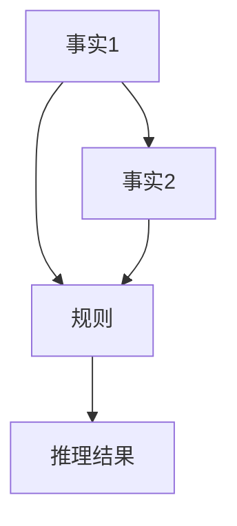

## 第3章 类人学习曲线的基础

### 3.1 新手阶段

新手阶段是类人学习曲线的初始阶段，智能体在这个阶段主要进行知识获取和积累、基础技能训练和学习策略与反馈。

#### 3.1.1 知识获取与积累

在新手阶段，智能体需要通过大量数据和学习资源来获取和积累知识。这一过程通常涉及数据预处理、特征提取和知识库构建等步骤。

以下是一个知识获取与积累的示例：

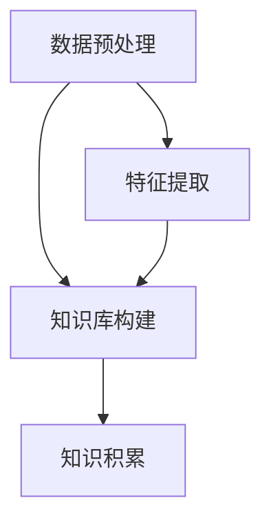

#### 3.1.2 基础技能训练

基础技能训练是指智能体在特定任务上进行有针对性的训练，以提高其在该任务上的表现。这一过程通常涉及算法选择、模型训练和性能评估等步骤。

以下是一个基础技能训练的示例：

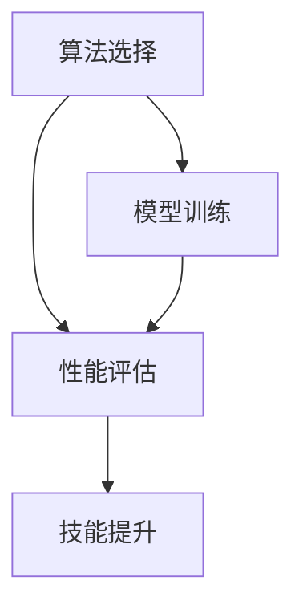

#### 3.1.3 学习策略与反馈

学习策略与反馈是指智能体根据任务需求和表现情况动态调整学习策略，并通过反馈机制进行自我优化。这一过程通常涉及策略优化、性能监控和自适应调整等步骤。

以下是一个学习策略与反馈的示例：

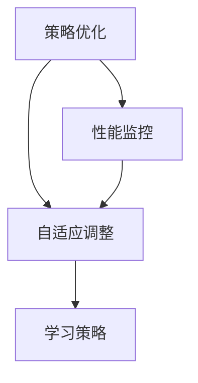

### 3.2 转折点

转折点是类人学习曲线中的关键阶段，标志着智能体从新手阶段向专家阶段的转变。转折点的出现通常伴随着学习效果的显著提升和学习效率的加速。

#### 3.2.1 转折点的定义

转折点是指智能体在学习过程中，由于某种外部或内部因素的作用，导致学习效果出现显著提升和学习效率加速的阶段。

以下是一个转折点的示例：

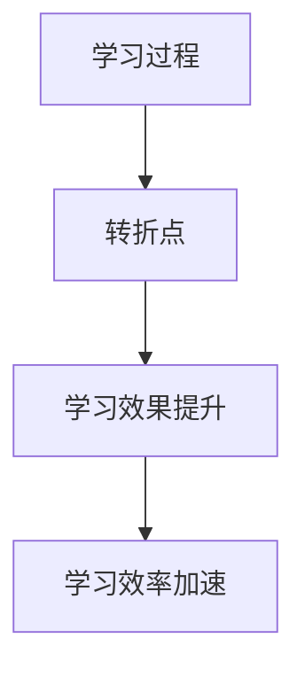

#### 3.2.2 转折点的特征

转折点的特征包括学习效果的显著提升、学习效率的加速、学习曲线的平滑化和学习过程的自我优化等。

以下是一个转折点特征的示例：

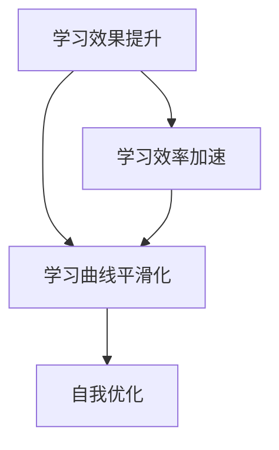

#### 3.2.3 如何识别和利用转折点

识别和利用转折点对于智能体的学习过程具有重要意义。以下是一些识别和利用转折点的方法：

1. **数据分析**：通过分析学习曲线、性能指标和学习数据，识别出学习效果的显著提升和学习效率的加速。
2. **模型评估**：定期评估智能体的模型性能，通过比较不同阶段的性能变化，识别出转折点的出现。
3. **反馈机制**：建立有效的反馈机制，及时获取用户或其他智能体的反馈，从而调整学习策略和优化学习过程。
4. **自适应调整**：根据转折点的特征，动态调整学习策略和优化参数，以充分利用转折点的优势。

以下是一个识别和利用转折点的示例：

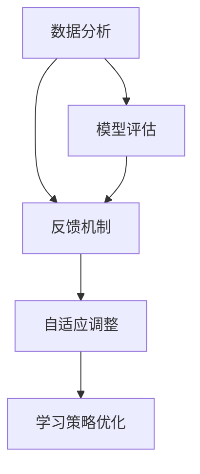

### 3.3 专家阶段

专家阶段是类人学习曲线的最终阶段，智能体在这个阶段已经掌握了高级技能，具备了创新性思维和跨领域应用能力。

#### 3.3.1 高级技能掌握

高级技能掌握是指智能体在特定任务上表现出色，能够在复杂环境中高效地执行任务。这一阶段通常涉及任务优化、性能提升和创新应用等。

以下是一个高级技能掌握的示例：

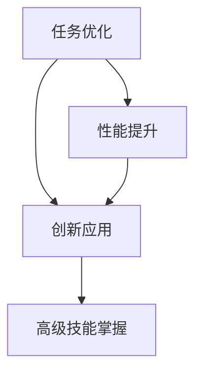

#### 3.3.2 创新性思维

创新性思维是指智能体具备独立思考和解决问题的能力，能够在不同领域和任务中提出新的解决方案。这一阶段通常涉及跨学科知识融合、创新算法设计和创新性应用等。

以下是一个创新性思维的示例：

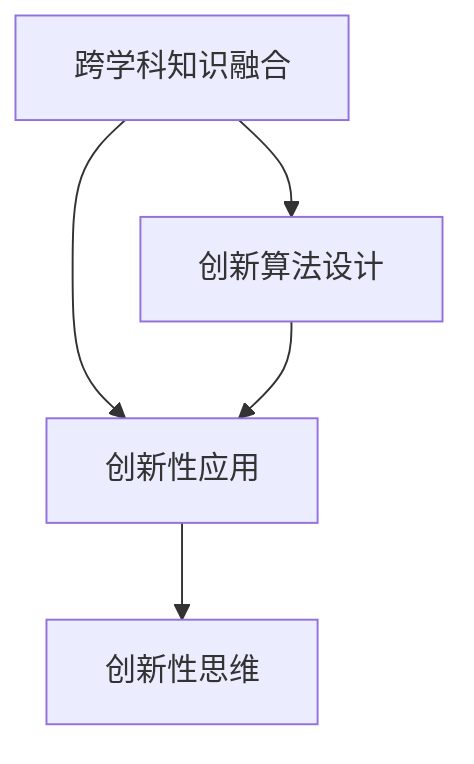

#### 3.3.3 跨领域应用能力

跨领域应用能力是指智能体能够跨越不同领域和任务，实现知识的迁移和应用。这一阶段通常涉及多模态感知、跨领域学习和综合应用等。

以下是一个跨领域应用能力的示例：

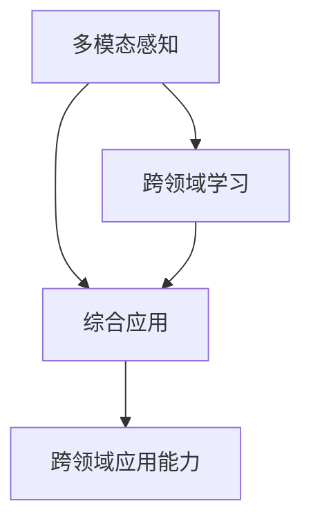

## 第4章 AGI学习过程中的挑战与对策

### 4.1 数据质量

数据质量是AGI学习过程中面临的一个主要挑战。高质量的数据有助于提高学习效果和智能体的性能，而低质量或错误的数据则可能导致学习失败或性能下降。

#### 4.1.1 数据收集与处理

数据收集是指从各种来源获取用于训练和测试的数据。数据来源可以包括公开数据集、企业数据、网络爬虫等。在数据收集过程中，需要注意数据的完整性、代表性和多样性。

数据处理是指对收集到的数据进行清洗、预处理和特征提取等操作，以将其转化为适合训练和测试的数据格式。数据处理的方法包括数据去重、缺失值填充、异常值处理、归一化和特征提取等。

以下是一个数据收集与处理的示例：

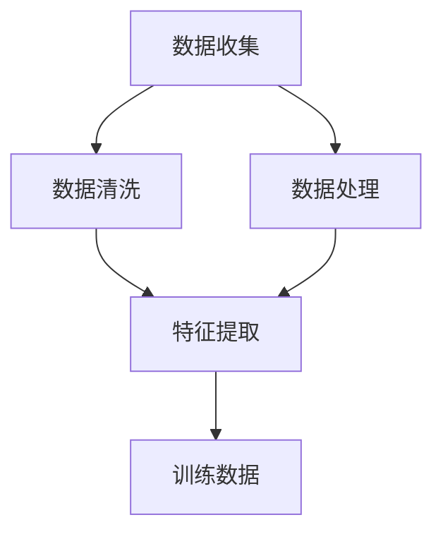

#### 4.1.2 数据多样性与质量评估

数据多样性是指数据在各个特征维度上的分布和覆盖范围。高多样性有助于提高智能体的泛化能力，使其能够在更广泛的场景下表现良好。

数据质量评估是指对训练数据进行质量评估，以判断其是否满足训练要求。数据质量评估的方法包括数据分布评估、错误率评估、噪声评估等。

以下是一个数据多样性与质量评估的示例：

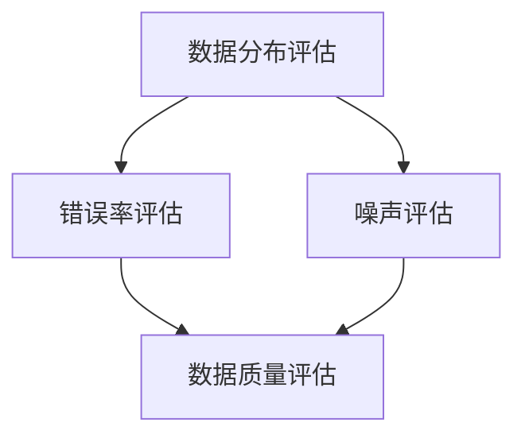

### 4.2 计算资源

计算资源是AGI学习过程中另一个重要的挑战。大规模训练任务通常需要大量的计算资源和时间，这可能导致学习过程缓慢或失败。

#### 4.2.1 计算能力的需求

计算能力的需求取决于训练任务和数据量。大规模训练任务通常需要高性能计算设备和强大的计算能力。计算能力的需求包括数据预处理、模型训练、模型推理等步骤。

以下是一个计算能力需求的示例：

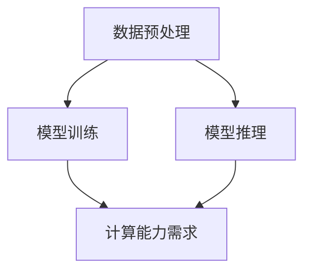

#### 4.2.2 资源优化策略

资源优化策略是指通过优化计算资源来提高学习效率和降低成本。资源优化策略包括并行计算、分布式计算、模型压缩等。

以下是一个资源优化策略的示例：

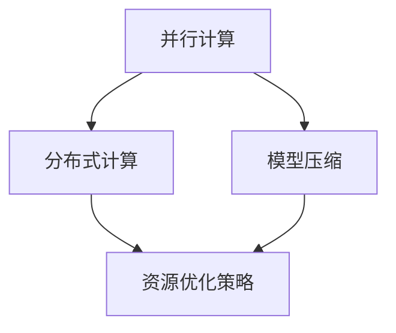

### 4.3 伦理与安全

伦理与安全是AGI学习过程中不可忽视的重要问题。智能体的行为和决策可能对人类和社会产生重大影响，因此需要确保智能体的行为符合伦理规范和安全要求。

#### 4.3.1 伦理问题

伦理问题主要包括隐私保护、公平性、透明度和责任归属等。隐私保护是指智能体在处理个人数据时，需要确保数据的保密性和安全性。公平性是指智能体在不同群体中的表现应保持公正和无偏见。透明度是指智能体的决策过程和结果应可解释和可追溯。责任归属是指智能体的行为和决策导致不良后果时，应明确责任归属。

以下是一个伦理问题的示例：

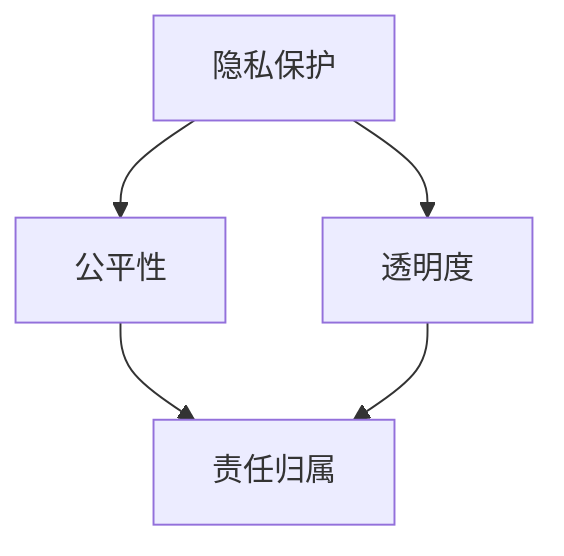

#### 4.3.2 安全问题

安全问题主要包括网络安全、数据安全和模型安全等。网络安全是指智能体在网络环境中免受攻击和破坏的能力。数据安全是指智能体在处理和存储数据时，确保数据的完整性和保密性。模型安全是指智能体的模型和算法在对抗攻击和恶意输入时，能够保持稳定性和鲁棒性。

以下是一个安全问题的示例：

```mermaid
graph TD
A[网络安全] --> B[数据安全]
A --> C[模型安全]
B --> D[安全问题]
C --> D
```

#### 4.3.3 合规与监管

合规与监管是指智能体的行为和决策应符合相关法律法规和伦理标准。合规与监管包括数据保护法规、人工智能伦理准则和技术标准等。

以下是一个合规与监管的示例：

```mermaid
graph TD
A[数据保护法规] --> B[人工智能伦理准则]
A --> C[技术标准]
B --> D[合规与监管]
C --> D
```

## 第5章 类人学习曲线实践案例分析

### 5.1 案例一：自动驾驶

#### 5.1.1 案例背景

自动驾驶是AGI的重要应用领域之一。自动驾驶汽车通过类人学习曲线，从新手阶段逐步发展到专家阶段，实现了在复杂交通环境下的自主驾驶。

#### 5.1.2 学习曲线分析

在自动驾驶中，类人学习曲线包括以下几个关键阶段：

1. **新手阶段**：自动驾驶系统在模拟环境和实际道路环境下进行数据收集和积累，通过深度学习和强化学习等方法，学习基本的驾驶规则和操作技能。
2. **转折点**：在积累大量数据和经验后，自动驾驶系统出现学习效果的显著提升，能够更好地应对复杂路况和突发事件。
3. **专家阶段**：自动驾驶系统掌握了高级驾驶技能，具备创新性思维和跨领域应用能力，能够高效、安全地执行各种驾驶任务。

以下是一个自动驾驶学习曲线的示例：

```mermaid
graph TD
A[新手阶段] --> B[转折点]
A --> C[专家阶段]
B --> D[学习效果提升]
C --> D
```

#### 5.1.3 挑战与对策

自动驾驶在学习过程中面临以下挑战：

1. **数据质量**：自动驾驶系统需要大量的高质量道路数据，包括不同天气、路况和交通情况的数据。数据质量直接影响系统的学习效果。
   - 对策：通过数据收集和处理技术，提高数据质量和多样性。

2. **计算资源**：自动驾驶系统的训练和推理过程需要大量的计算资源，特别是深度学习算法的训练。
   - 对策：采用分布式计算和并行计算技术，提高计算效率和资源利用。

3. **伦理与安全**：自动驾驶系统在行驶过程中涉及人身安全和公共安全，需要确保系统的行为符合伦理规范和安全要求。
   - 对策：建立完善的伦理和安全评估机制，确保自动驾驶系统的行为合法、合规和安全。

### 5.2 案例二：医疗诊断

#### 5.2.1 案例背景

医疗诊断是另一个重要的AGI应用领域。智能医疗诊断系统能够通过类人学习曲线，从新手阶段逐步发展到专家阶段，提供准确的诊断和治疗方案。

#### 5.2.2 学习曲线分析

在医疗诊断中，类人学习曲线包括以下几个关键阶段：

1. **新手阶段**：智能医疗诊断系统通过学习大量的医学数据和病例，掌握基本的诊断规则和技能。
2. **转折点**：在积累大量病例和经验后，智能医疗诊断系统出现学习效果的显著提升，能够更好地识别和诊断各种疾病。
3. **专家阶段**：智能医疗诊断系统掌握了高级诊断技能，具备创新性思维和跨领域应用能力，能够提供个性化的诊断和治疗方案。

以下是一个医疗诊断学习曲线的示例：

```mermaid
graph TD
A[新手阶段] --> B[转折点]
A --> C[专家阶段]
B --> D[学习效果提升]
C --> D
```

#### 5.2.3 挑战与对策

医疗诊断在学习过程中面临以下挑战：

1. **数据质量**：医疗诊断系统需要大量的高质量病例数据和医学知识，包括各种疾病的临床表现、检查报告等。
   - 对策：建立标准化的病例数据收集和处理流程，确保数据质量和多样性。

2. **计算资源**：医疗诊断系统的训练和推理过程需要大量的计算资源，特别是深度学习算法的训练。
   - 对策：采用分布式计算和并行计算技术，提高计算效率和资源利用。

3. **伦理与安全**：医疗诊断系统的诊断结果直接关系到患者的生命安全和健康状况，需要确保系统的行为符合伦理规范和安全要求。
   - 对策：建立严格的伦理和安全评估机制，确保医疗诊断系统的行为合法、合规和安全。

### 5.3 案例三：智能客服

#### 5.3.1 案例背景

智能客服是AGI在客户服务领域的应用，通过类人学习曲线，从新手阶段逐步发展到专家阶段，提供高效、个性化的客户服务。

#### 5.3.2 学习曲线分析

在智能客服中，类人学习曲线包括以下几个关键阶段：

1. **新手阶段**：智能客服系统通过学习大量的客户对话数据和常见问题，掌握基本的对话技巧和问题解答能力。
2. **转折点**：在积累大量对话数据和经验后，智能客服系统出现学习效果的显著提升，能够更好地理解客户意图和提供个性化的解决方案。
3. **专家阶段**：智能客服系统掌握了高级对话技巧和解决问题的能力，能够高效、准确地处理各种客户问题和需求。

以下是一个智能客服学习曲线的示例：

```mermaid
graph TD
A[新手阶段] --> B[转折点]
A --> C[专家阶段]
B --> D[学习效果提升]
C --> D
```

#### 5.3.3 挑战与对策

智能客服在学习过程中面临以下挑战：

1. **数据质量**：智能客服系统需要大量的高质量客户对话数据，包括不同场景、问题和解决方案的数据。
   - 对策：建立标准化的客户对话数据收集和处理流程，确保数据质量和多样性。

2. **计算资源**：智能客服系统的训练和推理过程需要大量的计算资源，特别是深度学习算法的训练。
   - 对策：采用分布式计算和并行计算技术，提高计算效率和资源利用。

3. **伦理与安全**：智能客服系统的对话内容涉及客户隐私和信息安全，需要确保系统的行为符合伦理规范和安全要求。
   - 对策：建立严格的伦理和安全评估机制，确保智能客服系统的行为合法、合规和安全。

## 第6章 类人学习曲线的未来发展

### 6.1 技术趋势

随着人工智能技术的不断进步，类人学习曲线在未来将继续发展，并在多个领域取得重要突破。以下是一些技术趋势：

1. **深度学习与强化学习的结合**：深度学习和强化学习是类人学习曲线的重要技术，未来将进一步结合，实现更高效、更智能的学习过程。
2. **多模态感知与跨领域学习**：多模态感知和跨领域学习是类人学习曲线的重要研究方向，未来将实现更全面的感知和更灵活的学习能力。
3. **自适应学习与迁移学习**：自适应学习和迁移学习是类人学习曲线的重要技术，未来将实现更高效、更通用的学习能力和知识迁移能力。

### 6.2 社会影响

类人学习曲线的发展将对社会产生深远影响。以下是一些社会影响：

1. **提高生产效率**：类人学习曲线将帮助企业提高生产效率和创新能力，推动产业升级和经济增长。
2. **改变就业结构**：类人学习曲线将改变就业结构，一些传统职业可能被智能系统取代，同时也会产生新的职业和岗位。
3. **提升生活质量**：类人学习曲线将带来更便捷、更智能的生活体验，提高人们的生活质量。

### 6.3 法律法规与伦理道德

随着类人学习曲线的发展，法律法规和伦理道德问题将日益突出。以下是一些法律法规与伦理道德挑战：

1. **隐私保护**：智能系统的数据处理和使用可能涉及个人隐私，需要制定严格的隐私保护法律法规。
2. **责任归属**：智能系统的行为和决策可能导致不良后果，需要明确责任归属，制定相应的法律责任和赔偿机制。
3. **伦理审查**：智能系统的开发和部署需要遵守伦理道德规范，进行伦理审查和评估。

## 第7章 总结与展望

### 7.1 AGI与类人学习曲线的重要性

AGI与类人学习曲线在人工智能发展中具有重要意义。AGI的目标是实现跨领域通用智能，而类人学习曲线则为AGI提供了学习和发展的机制。通过模拟人类的认知和学习过程，类人学习曲线可以帮助AGI实现高效、自然的学习和适应能力，从而在各个领域取得突破性进展。

### 7.2 类人学习曲线的持续发展

类人学习曲线的持续发展需要从以下几个方面进行：

1. **技术创新**：不断推动人工智能技术的研究和应用，为类人学习曲线提供更先进的算法和架构。
2. **数据资源**：加大数据资源的收集和处理力度，提高数据质量和多样性，为类人学习曲线提供丰富的训练数据。
3. **伦理道德**：建立健全的法律法规和伦理道德规范，确保类人学习曲线的发展符合社会伦理和道德要求。

### 7.3 展望未来

未来，类人学习曲线将实现更高效、更智能的学习过程，推动人工智能技术在各个领域的应用。随着类人学习曲线的不断发展，人类将能够实现更高水平的智能交互和协同工作，从而开启一个全新的智能时代。作者：AI天才研究院/AI Genius Institute & 禅与计算机程序设计艺术 /Zen And The Art of Computer Programming。

