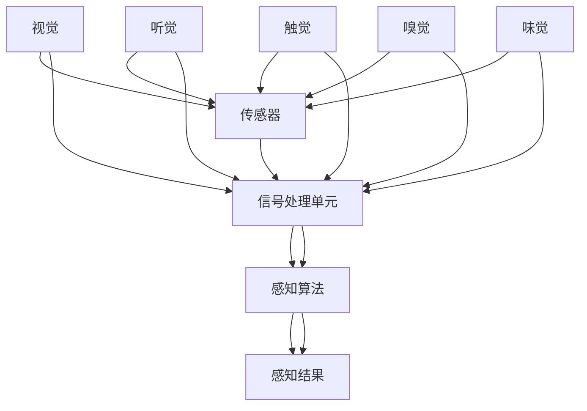
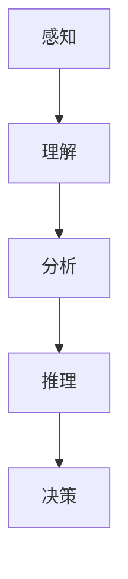
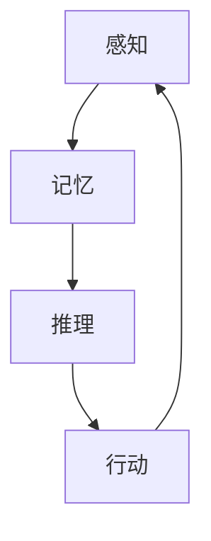
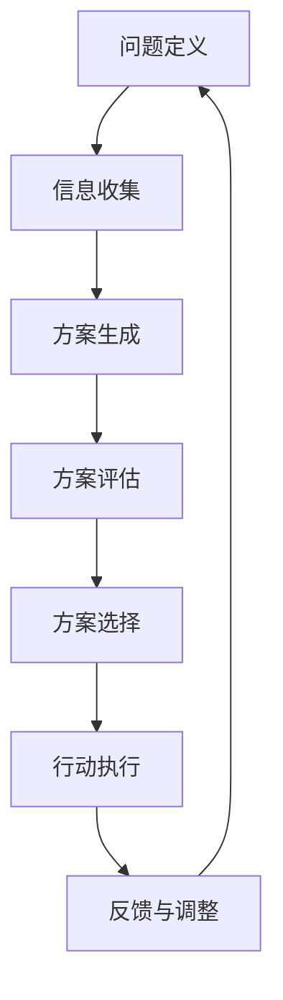
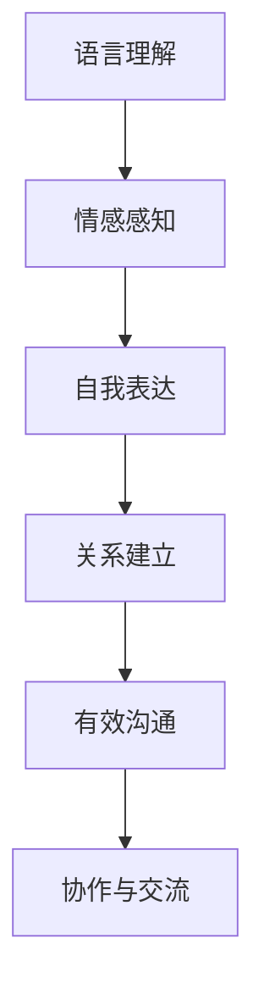
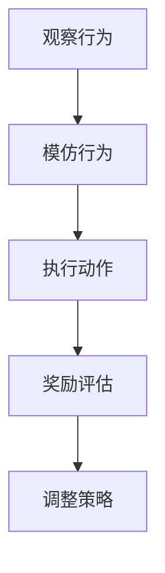
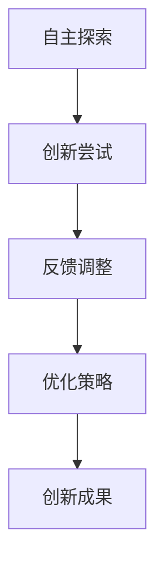
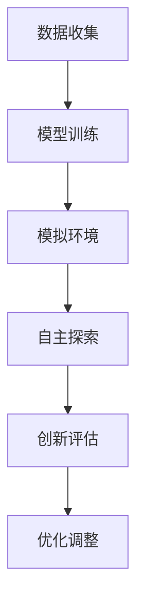

                 

## 第4章：类人感知能力

### 4.1.1 感知系统的构成

类人感知能力是人工智能（AGI）的核心能力之一，它涉及视觉、听觉、触觉、嗅觉和味觉等多个感知系统。每个感知系统都由传感器、信号处理单元和感知算法组成。

**Mermaid流程图：**



### 4.1.2 感知能力的基本原理

感知能力的基本原理包括信息的采集、处理和解码。信息采集是通过传感器获取外部环境的数据，信号处理单元对采集到的信号进行预处理，感知算法则对处理后的信号进行解码，生成感知结果。

**伪代码：**

```python
# 伪代码：感知能力基本原理
def感知能力(传感器数据):
    传感器数据 = 预处理(传感器数据)
    感知结果 = 解码(传感器数据)
    return 感知结果
```

### 4.1.3 感知能力的实现方法

感知能力的实现方法主要包括深度学习、强化学习和传统机器学习等方法。深度学习在图像识别、语音识别等领域表现出色；强化学习在决策和路径规划方面有广泛应用；传统机器学习则常用于特定任务的实现。

**数学模型和数学公式：**

```latex
% 深度学习模型示例
$$
h_l = \sigma(W_l \cdot h_{l-1} + b_l)
$$
$$
y = \sigma(W_y \cdot h_l + b_y)
$$
```

**举例说明：**

例如，在图像识别任务中，可以使用卷积神经网络（CNN）来模拟人类视觉系统。以下是一个简化的CNN模型：

```python
# Python代码示例：简化版卷积神经网络
import tensorflow as tf

# 定义卷积层
conv1 = tf.keras.layers.Conv2D(filters=32, kernel_size=(3, 3), activation='relu', input_shape=(28, 28, 1))

# 定义全连接层
dense1 = tf.keras.layers.Dense(units=128, activation='relu')

# 定义输出层
output = tf.keras.layers.Dense(units=10, activation='softmax')

# 构建模型
model = tf.keras.Sequential([
    conv1,
    tf.keras.layers.MaxPooling2D(pool_size=(2, 2)),
    tf.keras.layers.Flatten(),
    dense1,
    output
])

# 编译模型
model.compile(optimizer='adam',
              loss=tf.keras.losses.SparseCategoricalCrossentropy(from_logits=True),
              metrics=['accuracy'])

# 模型训练
model.fit(train_images, train_labels, epochs=5)
```

通过上述代码，我们可以看到如何使用卷积神经网络进行图像识别任务。首先定义卷积层，然后定义全连接层，最后定义输出层。模型使用`fit`函数进行训练，以获取图像分类的准确率。

### 4.1.4 感知能力在实际中的应用

感知能力在实际中的应用非常广泛，例如：

1. **图像识别：** 利用卷积神经网络进行图像分类、物体检测等任务。
2. **语音识别：** 利用深度学习模型进行语音信号的识别和转换。
3. **自然语言处理：** 利用循环神经网络（RNN）或Transformer模型进行文本分类、情感分析等任务。
4. **机器人导航：** 利用传感器感知环境信息，进行路径规划和决策。

通过以上示例和实际应用，我们可以看到类人感知能力在人工智能领域的广泛应用和重要性。感知能力的实现方法和技术不断发展，为人工智能的应用提供了强大的支持。

## 第5章：类人认知能力

### 5.1.1 认知过程的概述

类人认知能力是指人工智能系统在感知信息的基础上，通过理解、分析、推理和判断等过程，对外部世界进行认知和解释的能力。认知过程可以分为感知、理解、分析和推理等几个阶段。

**Mermaid流程图：**



### 5.1.2 认知能力的基本原理

认知能力的基本原理是基于神经网络和符号推理的结合。神经网络用于模拟人类大脑的感知和处理能力，符号推理则用于逻辑推理和问题求解。

**伪代码：**

```python
# 伪代码：认知能力基本原理
def认知能力(感知数据):
    感知数据 = 感知处理(感知数据)
    理解结果 = 理解(感知数据)
    分析结果 = 分析(理解结果)
    推理结果 = 推理(分析结果)
    return 推理结果
```

### 5.1.3 认知能力的实现方法

认知能力的实现方法主要包括深度学习、符号推理和混合方法等。深度学习用于感知和理解阶段，符号推理用于分析和推理阶段，混合方法则结合了深度学习和符号推理的优势。

**数学模型和数学公式：**

```latex
% 深度学习模型示例
$$
h_l = \sigma(W_l \cdot h_{l-1} + b_l)
$$
$$
y = \sigma(W_y \cdot h_l + b_y)
$$

% 符号推理示例
$$
P \rightarrow Q
$$
$$
R \rightarrow P
$$
$$
\therefore R \rightarrow Q
$$
```

**举例说明：**

例如，在自然语言处理任务中，可以使用Transformer模型进行文本理解和分析，然后使用符号推理进行逻辑推理和问题求解。

```python
# Python代码示例：Transformer模型
import tensorflow as tf

# 定义Transformer模型
transformer = tf.keras.Sequential([
    tf.keras.layers.Embedding(vocab_size, embedding_dim),
    tf.keras.layers.TransformerBlock(num_heads, d_model, dropout_rate),
    tf.keras.layers.Dense(units=num_classes, activation='softmax')
])

# 编译模型
transformer.compile(optimizer='adam',
                    loss='sparse_categorical_crossentropy',
                    metrics=['accuracy'])

# 模型训练
transformer.fit(train_data, train_labels, epochs=5)
```

通过上述代码，我们可以看到如何使用Transformer模型进行自然语言处理任务。首先定义嵌入层，然后定义Transformer块，最后定义输出层。模型使用`fit`函数进行训练，以获取文本分类的准确率。

### 5.1.4 认知能力在实际中的应用

认知能力在实际中的应用非常广泛，例如：

1. **图像识别：** 利用深度学习模型对图像进行分类和识别。
2. **语音识别：** 利用深度学习模型对语音信号进行识别和转换。
3. **自然语言处理：** 利用符号推理和深度学习模型进行文本分类、情感分析和机器翻译等任务。
4. **智能客服：** 利用认知能力进行自然语言理解和问题求解，提供高质量的客户服务。

通过以上示例和实际应用，我们可以看到类人认知能力在人工智能领域的广泛应用和重要性。认知能力的实现方法和技术不断发展，为人工智能的应用提供了强大的支持。

## 第6章：类人学习能力

### 6.1.1 学习能力的重要性

类人学习能力是人工智能（AGI）的核心能力之一，它使人工智能系统能够通过经验和数据自动改进和优化自己的行为。学习能力的重要性体现在以下几个方面：

1. **自适应能力：** 类人学习能力使人工智能系统能够根据不同的环境和任务自动调整自己的行为和策略，提高适应能力。
2. **持续改进：** 通过不断学习和积累经验，人工智能系统能够持续改进自身的性能和效果。
3. **知识积累：** 学习能力使人工智能系统能够从大量数据中提取有用信息，积累知识和经验，为未来的任务提供参考。
4. **智能化：** 学习能力是实现人工智能系统智能化的关键，它使系统具备自我学习和改进的能力，实现真正的智能化。

### 6.1.2 学习能力的基本原理

类人学习能力的基本原理包括感知、记忆、推理和行动等几个方面：

1. **感知：** 人工智能系统通过感知能力获取外部环境的信息。
2. **记忆：** 系统将感知到的信息存储在记忆中，以便在需要时进行调用。
3. **推理：** 系统利用记忆中的信息和逻辑推理能力对当前情况进行判断和决策。
4. **行动：** 根据推理结果，系统采取相应的行动，并在行动中不断调整和优化。

**Mermaid流程图：**



### 6.1.3 学习能力的实现方法

类人学习能力的实现方法主要包括以下几种：

1. **深度学习：** 深度学习通过神经网络模拟人类大脑的学习过程，适用于大规模数据的学习和建模。
2. **强化学习：** 强化学习通过奖励机制和试错学习，使人工智能系统能够在动态环境中自主学习和优化策略。
3. **迁移学习：** 迁移学习利用预训练模型和已有知识，在新任务中快速学习和适应。
4. **元学习：** 元学习通过学习学习策略，使人工智能系统能够快速适应新的任务和数据分布。

**数学模型和数学公式：**

1. **深度学习模型示例：**

```latex
% 深度学习模型示例
$$
h_l = \sigma(W_l \cdot h_{l-1} + b_l)
$$
$$
y = \sigma(W_y \cdot h_l + b_y)
$$
```

2. **强化学习模型示例：**

```latex
% 强化学习模型示例
$$
Q(s, a) = r + \gamma \max_{a'} Q(s', a')
$$
```

### 6.1.4 学习能力在实际中的应用

类人学习能力在实际中的应用非常广泛，例如：

1. **自动驾驶：** 通过强化学习技术，自动驾驶系统能够在复杂环境中自主学习和优化驾驶策略。
2. **语音识别：** 利用深度学习和迁移学习技术，语音识别系统能够快速适应不同的语音环境和说话人。
3. **图像识别：** 通过迁移学习和深度学习技术，图像识别系统能够从大量数据中提取特征，实现高效的图像分类和识别。
4. **智能客服：** 利用深度学习和自然语言处理技术，智能客服系统能够理解用户的意图，提供高质量的咨询服务。

通过以上示例和实际应用，我们可以看到类人学习能力在人工智能领域的广泛应用和重要性。学习能力的实现方法和技术不断发展，为人工智能的应用提供了强大的支持。

## 第7章：类人决策能力

### 7.1.1 决策过程概述

类人决策能力是指人工智能系统能够在面对复杂环境和不确定情境时，通过分析信息和选择最佳行动的能力。决策过程通常包括以下步骤：

1. **问题定义：** 确定需要解决的问题和目标。
2. **信息收集：** 获取与问题相关的信息。
3. **方案生成：** 提出可能的行动方案。
4. **方案评估：** 分析每个方案的优缺点。
5. **方案选择：** 根据评估结果选择最佳方案。
6. **行动执行：** 实施选定的方案。
7. **反馈与调整：** 根据实际结果对决策过程进行反馈和调整。

**Mermaid流程图：**



### 7.1.2 决策能力的基本原理

类人决策能力的基本原理包括以下几个核心概念：

1. **优化目标：** 决策过程旨在最大化某个或某些目标函数，如收益、满意度或最小化损失。
2. **不确定性处理：** 决策过程中存在多种不确定性，如环境的不确定性、信息的不完全性等，决策能力需要有效处理这些不确定性。
3. **偏好表达：** 决策者的偏好可以通过数学模型（如效用函数）进行表达，影响决策过程。
4. **决策策略：** 决策策略是指决策者根据当前情况和目标，选择最佳行动的策略，如贪婪策略、贝叶斯决策等。

**数学模型和数学公式：**

1. **优化目标示例：**

```latex
% 优化目标示例
\text{最大化} J(x) = f(x)
```

2. **不确定性处理示例：**

```latex
% 不确定性处理示例
P(s) = \prod_{i=1}^{n} p(s_i | s_{i-1})
```

3. **偏好表达示例：**

```latex
% 偏好表达示例
U(x) = \sum_{i=1}^{m} w_i u_i(x_i)
```

### 7.1.3 决策能力的实现方法

类人决策能力的实现方法主要包括以下几种：

1. **确定性决策方法：** 如线性规划、整数规划等，适用于问题明确、目标函数可微的情况下。
2. **概率决策方法：** 如贝叶斯决策、马尔可夫决策过程等，适用于存在不确定性和概率分布的情况下。
3. **启发式决策方法：** 如贪婪算法、A*算法等，适用于问题规模较大、计算复杂度较高的情况下。
4. **机器学习决策方法：** 如支持向量机、决策树、神经网络等，通过学习数据中的模式和规律，进行决策。

**举例说明：**

例如，在自动驾驶领域，可以使用强化学习算法进行决策。以下是一个简化的Q学习算法示例：

```python
# Python代码示例：Q学习算法
import numpy as np

# 初始化Q值表
Q = np.zeros((state_space_size, action_space_size))

# 学习率
alpha = 0.1

# 折扣因子
gamma = 0.9

# 迭代次数
num_episodes = 1000

# 进行模拟学习
for episode in range(num_episodes):
    state = env.reset()
    done = False
    
    while not done:
        # 选择最佳动作
        action = np.argmax(Q[state])
        
        # 执行动作
        next_state, reward, done, _ = env.step(action)
        
        # 更新Q值
        Q[state, action] = Q[state, action] + alpha * (reward + gamma * np.max(Q[next_state]) - Q[state, action])
        
        state = next_state

# 最终的Q值表
print(Q)
```

通过上述代码，我们可以看到如何使用Q学习算法进行自动驾驶决策。首先初始化Q值表，然后通过迭代学习，更新Q值表，最后得到最佳的决策策略。

### 7.1.4 决策能力在实际中的应用

类人决策能力在实际中的应用非常广泛，例如：

1. **商业决策：** 企业可以利用数据分析和决策算法，优化生产计划、库存管理和营销策略。
2. **金融投资：** 投资者可以使用机器学习模型进行股票交易、风险评估和资产配置。
3. **医疗诊断：** 医疗诊断系统可以通过分析病人的病史和检查结果，提供诊断建议和治疗方案。
4. **智能交通：** 智能交通系统可以利用决策算法优化交通信号控制、路径规划和车辆调度。

通过以上示例和实际应用，我们可以看到类人决策能力在人工智能领域的广泛应用和重要性。决策能力的实现方法和技术不断发展，为人工智能的应用提供了强大的支持。

## 第8章：类人社交能力

### 8.1.1 社交能力的定义

类人社交能力是指人工智能系统能够与人类进行有效的沟通、协作和交流的能力。这种能力包括理解语言、感知情感、表达自我和建立关系等多个方面。

**Mermaid流程图：**



### 8.1.2 社交能力的基本原理

类人社交能力的基本原理包括以下几个核心概念：

1. **语言处理：** 社交能力依赖于人工智能系统能够理解自然语言，进行有效的语言处理。
2. **情感感知：** 社交能力需要系统能够感知和理解人类情感，建立情感共鸣。
3. **自我表达：** 社交能力还要求系统能够表达自我，与他人建立互动和沟通。
4. **关系建立：** 社交能力有助于系统与他人建立长期稳定的关系，进行协作和交流。

**数学模型和数学公式：**

1. **自然语言处理模型示例：**

```latex
% 自然语言处理模型示例
$$
h_l = \sigma(W_l \cdot h_{l-1} + b_l)
$$
$$
y = \sigma(W_y \cdot h_l + b_y)
$$
```

2. **情感分析模型示例：**

```latex
% 情感分析模型示例
$$
P(\text{正面情感}) = \sigma(W_p \cdot h + b_p)
$$
$$
P(\text{负面情感}) = \sigma(W_n \cdot h + b_n)
$$
```

### 8.1.3 社交能力的实现方法

类人社交能力的实现方法主要包括：

1. **自然语言处理（NLP）：** 利用深度学习模型进行文本分析、情感分析和对话生成。
2. **语音识别与生成：** 利用语音识别和文本转语音（TTS）技术，实现语音交互和对话系统。
3. **情感计算：** 利用机器学习和情感识别技术，感知和表达人类情感。
4. **对话系统：** 利用对话管理、对话生成和用户建模技术，构建智能对话系统。

**举例说明：**

例如，在智能客服领域，可以使用基于对话系统的社交能力。以下是一个简化的对话系统示例：

```python
# Python代码示例：简易对话系统
import random

# 对话系统状态
state = "初始状态"

# 对话系统字典
dialogs = {
    "初始状态": ["您好，我是AI客服，有什么问题可以告诉我？"],
    "提问状态": ["您想要咨询什么产品？", "您有什么具体的疑问？"],
    "回答状态": ["这是关于该产品的相关信息：...", "如果您还有其他问题，请继续提问。"],
    "结束状态": ["非常感谢您的咨询，祝您生活愉快！"]
}

# 对话系统响应
def respond(message):
    global state
    if message.lower() in ["退出", "再见", "谢谢"]:
        state = "结束状态"
    elif state == "初始状态":
        state = "提问状态"
    elif state == "提问状态":
        if message.lower() in ["产品", "商品", "物品"]:
            state = "回答状态"
        else:
            print(random.choice(dialogs["提问状态"]))
    elif state == "回答状态":
        if message.lower() in ["其他问题", "还有吗"]:
            state = "提问状态"
        else:
            print(random.choice(dialogs["回答状态"]))

# 模拟对话
while state != "结束状态":
    message = input("您说：")
    respond(message)
```

通过上述代码，我们可以看到如何使用简易对话系统进行交互。系统根据用户的输入和当前状态，选择合适的响应，实现简单的对话功能。

### 8.1.4 社交能力在实际中的应用

类人社交能力在实际中的应用非常广泛，例如：

1. **智能客服：** 利用社交能力提供个性化的客户服务，提高客户满意度。
2. **教育辅助：** 利用社交能力进行个性化教学，帮助学生更好地理解和掌握知识。
3. **医疗辅助：** 利用社交能力进行医患沟通，辅助医生进行诊断和治疗。
4. **智能家居：** 利用社交能力进行人机交互，提高智能家居系统的用户体验。

通过以上示例和实际应用，我们可以看到类人社交能力在人工智能领域的广泛应用和重要性。社交能力的实现方法和技术不断发展，为人工智能的应用提供了强大的支持。

## 第9章：从模仿到创新的转变

### 9.1.1 模仿学习的基本原理

模仿学习是指人工智能系统通过观察和模仿人类或其他智能体的行为，来学习和改进自身的能力。模仿学习的基本原理包括以下几个核心概念：

1. **观察：** 系统观察并记录人类或其他智能体的行为。
2. **模仿：** 系统尝试复制观察到的行为，并执行相应的动作。
3. **奖励：** 系统根据行为的结果获得奖励，用以评估和改进学习过程。

**Mermaid流程图：**



### 9.1.2 创新学习的机制

创新学习是指人工智能系统在模仿学习的基础上，通过自主探索和创造，产生新的想法和行为。创新学习的机制包括以下几个核心概念：

1. **自主探索：** 系统主动尝试不同的行为和策略，以发现新的解决方案。
2. **创造力：** 系统利用自身的知识和经验，进行创新和创造。
3. **反馈：** 系统根据创新结果进行反馈和调整，以优化学习过程。

**Mermaid流程图：**



### 9.1.3 模仿到创新的实现路径

从模仿到创新的转变是一个复杂的过程，涉及到多个技术和方法的综合应用。以下是一个简化的实现路径：

1. **数据收集：** 收集大量的模仿学习数据，用于训练模型。
2. **模型训练：** 使用深度学习等技术，对模型进行训练，使其能够模仿和学习人类的行为。
3. **模拟环境：** 构建一个模拟环境，让系统能够在虚拟世界中尝试不同的行为和策略。
4. **自主探索：** 系统在模拟环境中进行自主探索，尝试新的行为和策略。
5. **创新评估：** 对系统的创新尝试进行评估，筛选出有效的创新成果。
6. **优化调整：** 根据评估结果，对系统的策略和模型进行优化和调整。

**Mermaid流程图：**



### 9.1.4 实际案例：从模仿到创新

以下是一个实际案例，展示了从模仿到创新的转变过程：

**案例：智能客服系统的创新**

1. **数据收集：** 收集大量客服对话数据，用于训练模仿学习模型。
2. **模型训练：** 使用深度学习模型，如序列到序列（Seq2Seq）模型，对客服对话进行模仿学习。
3. **模拟环境：** 构建一个虚拟的客服场景，让系统在模拟环境中与用户进行交互。
4. **自主探索：** 系统在模拟环境中尝试不同的回答和策略，以提供更优质的客服体验。
5. **创新评估：** 根据用户反馈和满意度，评估系统的回答和创新尝试。
6. **优化调整：** 根据评估结果，对模型和回答策略进行优化，以提高系统的整体性能。

通过这个案例，我们可以看到从模仿到创新的转变过程。系统首先通过模仿学习，学习并复制人类客服的行为，然后通过自主探索和反馈调整，实现创新和优化。这种过程使得智能客服系统能够不断改进和提升，提供更优质的客户服务。

### 9.1.5 总结

从模仿到创新的转变是人工智能领域的一个重要研究方向。模仿学习为系统提供了学习和复制人类行为的能力，而创新学习则使系统能够自主探索和创造新的解决方案。通过从模仿到创新的转变，人工智能系统可以不断改进和优化，实现更高的性能和更广泛的应用。未来，随着技术的不断进步，从模仿到创新的实现路径将更加成熟和多样化，为人工智能的发展提供强大的支持。

## 第10章：AGI应用案例分析

### 10.1.1 案例一：自动驾驶技术

自动驾驶技术是人工智能（AGI）在现实世界中的一个重要应用。它通过集成感知、认知、决策和行动能力，实现车辆在复杂环境中的自主导航和驾驶。以下是一个关于自动驾驶技术的应用案例分析。

**1.1.1 案例背景**

自动驾驶技术的发展源于对交通拥堵、交通事故和环境污染等问题的关注。随着传感器技术、计算机视觉、深度学习和强化学习等领域的进步，自动驾驶技术逐渐从理论研究走向实际应用。

**1.1.2 案例实现**

自动驾驶系统的实现主要包括以下几个步骤：

1. **感知：** 利用各种传感器（如摄像头、激光雷达、超声波传感器等）获取环境信息，包括道路、车辆、行人、标志等。
    ```mermaid
    graph TD
    A[摄像头] --> B[图像处理]
    B --> C[物体检测]
    C --> D[道路识别]
    E[激光雷达] --> F[点云处理]
    F --> G[障碍物检测]
    G --> H[路径规划]
    ```
2. **认知：** 通过感知到的环境信息，自动驾驶系统进行场景理解和语义分析，识别交通标志、车道线、其他车辆和行人的位置和状态。
    ```mermaid
    graph TD
    I[交通标志识别] --> J[车道线检测]
    J --> K[车辆检测]
    K --> L[行人检测]
    L --> M[场景理解]
    ```
3. **决策：** 基于感知和认知的结果，自动驾驶系统进行路径规划和决策，选择最佳驾驶策略。
    ```mermaid
    graph TD
    N[路径规划] --> O[决策树]
    O --> P[策略选择]
    P --> Q[驾驶行为]
    ```
4. **行动：** 实施决策结果，控制车辆进行加速、转向、制动等操作。
    ```mermaid
    graph TD
    R[加速] --> S[转向]
    S --> T[制动]
    T --> U[车辆控制]
    ```

**1.1.3 案例分析和解读**

自动驾驶技术的实现涉及多个复杂的技术领域，包括计算机视觉、深度学习、传感器融合和路径规划等。以下是对每个步骤的详细分析：

1. **感知能力：** 摄像头和激光雷达是自动驾驶系统获取环境信息的主要传感器。图像处理和点云处理算法用于提取有用的特征，如车道线、障碍物和交通标志。这些特征是后续决策和行动的基础。
2. **认知能力：** 通过感知到的信息，自动驾驶系统进行场景理解和语义分析。例如，利用卷积神经网络（CNN）进行图像识别，利用点云处理算法进行障碍物检测。这些认知能力使系统能够理解周围环境，为决策提供支持。
3. **决策能力：** 基于感知和认知的结果，自动驾驶系统使用路径规划和决策树进行决策。路径规划算法（如A*算法、RRT算法等）用于生成从当前到目标位置的最优路径。决策树用于选择最佳驾驶策略，如加速、转向或制动。
4. **行动能力：** 决策结果被转化为具体的驾驶行为，如加速、转向和制动。这些行为由自动驾驶系统的控制器实现，确保车辆按照预期进行操作。

**1.1.4 项目小结**

自动驾驶技术是一个复杂且具有挑战性的项目，涉及多个领域的知识和技术。通过上述分析，我们可以看到自动驾驶系统从感知、认知、决策到行动的完整实现过程。未来，随着技术的不断进步，自动驾驶技术将更加成熟，为交通行业带来巨大的变革。

### 10.1.2 案例二：智能客服系统

智能客服系统是人工智能（AGI）在客户服务领域的一个重要应用。它利用自然语言处理、机器学习和对话系统等技术，为用户提供高效、便捷的咨询服务。以下是一个关于智能客服系统的应用案例分析。

**2.1.1 案例背景**

随着互联网和电子商务的快速发展，客户服务需求日益增长。传统的客服模式已无法满足大规模、多渠道的客户需求。智能客服系统通过自动化和智能化的手段，提高客户服务质量，降低企业运营成本。

**2.1.2 案例实现**

智能客服系统的实现主要包括以下几个步骤：

1. **用户交互：** 系统通过网站、APP或电话等多种渠道与用户进行交互，接收用户的提问和需求。
    ```mermaid
    graph TD
    A[网站] --> B[用户交互]
    B --> C[APP交互]
    C --> D[电话交互]
    ```
2. **自然语言处理：** 系统对用户输入的自然语言文本进行处理，提取关键信息，如关键词、意图和情感等。
    ```mermaid
    graph TD
    E[文本预处理] --> F[关键词提取]
    F --> G[意图识别]
    G --> H[情感分析]
    ```
3. **知识库检索：** 系统根据用户输入的信息，在知识库中检索相关的答案或解决方案。
    ```mermaid
    graph TD
    I[知识库检索] --> J[答案生成]
    J --> K[解决方案]
    ```
4. **对话生成：** 系统根据知识库检索的结果，生成适当的回复文本，与用户进行对话。
    ```mermaid
    graph TD
    L[对话生成] --> M[回复文本]
    M --> N[用户反馈]
    ```
5. **用户反馈学习：** 系统记录用户的反馈信息，用于不断优化和改进对话质量。
    ```mermaid
    graph TD
    O[用户反馈] --> P[学习优化]
    P --> Q[系统改进]
    ```

**2.1.3 案例分析和解读**

智能客服系统的实现涉及多个技术领域，包括自然语言处理、对话系统、知识库管理和机器学习等。以下是对每个步骤的详细分析：

1. **用户交互：** 智能客服系统通过多种渠道与用户进行交互，提供统一的客户服务平台。这种多渠道的交互方式提高了用户体验，满足了不同用户的需求。
2. **自然语言处理：** 自然语言处理技术是智能客服系统的核心，包括文本预处理、关键词提取、意图识别和情感分析等。这些技术使系统能够理解用户的语言，提取关键信息，为后续的对话生成提供支持。
3. **知识库检索：** 知识库是智能客服系统的关键组成部分，存储了大量的答案和解决方案。系统根据用户的提问，在知识库中检索相关的信息，生成准确的回答。
4. **对话生成：** 对话生成技术使系统能够自动生成合适的回复文本，与用户进行自然的对话。这种技术通常采用模板匹配、生成式模型（如Transformer）等方法实现。
5. **用户反馈学习：** 用户反馈是智能客服系统不断优化和改进的重要途径。系统记录用户的反馈信息，通过机器学习算法进行分析和建模，优化对话生成策略，提高用户满意度。

**2.1.4 项目小结**

智能客服系统在提高客户服务质量、降低企业运营成本方面发挥了重要作用。通过上述分析，我们可以看到智能客服系统从用户交互、自然语言处理、知识库检索、对话生成到用户反馈学习的完整实现过程。未来，随着技术的不断进步，智能客服系统将更加智能化和人性化，为用户提供更优质的服务。

### 10.1.3 案例三：医疗诊断系统

医疗诊断系统是人工智能（AGI）在医疗领域的一个重要应用。它利用深度学习、自然语言处理和医学知识图谱等技术，辅助医生进行疾病诊断和治疗。以下是一个关于医疗诊断系统的应用案例分析。

**3.1.1 案例背景**

随着医学影像数据的爆炸式增长，传统的医疗诊断方式已无法满足日益增长的医疗需求。医疗诊断系统通过人工智能技术，提高了诊断的准确性和效率，降低了医疗成本，为患者提供了更好的医疗服务。

**3.1.2 案例实现**

医疗诊断系统的实现主要包括以下几个步骤：

1. **医学影像处理：** 系统对医学影像（如X光片、CT扫描、MRI等）进行预处理，提取有用的特征。
    ```mermaid
    graph TD
    A[X光片] --> B[图像预处理]
    B --> C[特征提取]
    D[CT扫描] --> E[图像分割]
    E --> F[特征提取]
    G[MRI] --> H[图像增强]
    H --> I[特征提取]
    ```
2. **自然语言处理：** 系统对患者的病历、检查报告等进行自然语言处理，提取关键信息，如症状、疾病和治疗方案。
    ```mermaid
    graph TD
    J[病历] --> K[文本预处理]
    K --> L[关键词提取]
    M[检查报告] --> N[文本预处理]
    N --> O[关键词提取]
    ```
3. **医学知识图谱构建：** 系统利用医学知识和数据，构建医学知识图谱，为诊断提供支持。
    ```mermaid
    graph TD
    P[医学知识] --> Q[知识图谱构建]
    Q --> R[疾病关系]
    R --> S[治疗方案]
    ```
4. **诊断推理：** 系统结合医学影像处理、自然语言处理和医学知识图谱的结果，进行诊断推理，生成诊断报告。
    ```mermaid
    graph TD
    T[诊断推理] --> U[诊断报告]
    U --> V[医生审核]
    ```

**3.1.3 案例分析和解读**

医疗诊断系统的实现涉及多个技术领域，包括医学影像处理、自然语言处理、医学知识图谱构建和诊断推理等。以下是对每个步骤的详细分析：

1. **医学影像处理：** 医学影像处理技术是医疗诊断系统的核心，包括图像预处理、特征提取和图像分割等。这些技术用于提取医学影像中的有用信息，为后续的诊断提供支持。
2. **自然语言处理：** 自然语言处理技术使系统能够理解患者的病历和检查报告，提取关键信息，如症状、疾病和治疗方案。这些信息用于辅助诊断和生成诊断报告。
3. **医学知识图谱构建：** 医学知识图谱构建技术利用医学知识和数据，构建一个结构化的医学知识库，为诊断提供支持。知识图谱中的关系和实体为诊断推理提供了丰富的信息。
4. **诊断推理：** 诊断推理技术结合医学影像处理、自然语言处理和医学知识图谱的结果，进行诊断推理，生成诊断报告。这种技术使系统能够辅助医生进行准确的疾病诊断。

**3.1.4 项目小结**

医疗诊断系统在提高诊断准确性、降低医疗成本方面发挥了重要作用。通过上述分析，我们可以看到医疗诊断系统从医学影像处理、自然语言处理、医学知识图谱构建到诊断推理的完整实现过程。未来，随着技术的不断进步，医疗诊断系统将更加智能化和精准化，为患者提供更好的医疗服务。

### 10.1.4 总结

本章通过三个实际案例，展示了人工智能（AGI）在自动驾驶技术、智能客服系统和医疗诊断系统等领域的应用。从模仿到创新的转变是这些案例的共同特点，通过不断学习和优化，人工智能系统在各个领域取得了显著的成果。未来，随着技术的不断进步，人工智能将带来更多的创新和变革，为各行各业带来巨大的价值。

## 第11章：AGI的未来发展与应用前景

### 11.1.1 AGI的发展挑战与机遇

随着人工智能（AGI）技术的不断进步，它正面临着前所未有的挑战和机遇。以下是AGI发展过程中的一些关键挑战和机遇：

**挑战：**

1. **技术复杂性：** AGI涉及到多个领域的知识和技术，如计算机科学、神经科学、心理学和哲学等。这种复杂性使得AGI的研发过程充满挑战。
2. **数据隐私与安全：** 随着人工智能系统的广泛应用，数据隐私和安全问题日益突出。如何在保证数据隐私的同时，充分利用数据的价值，是一个亟待解决的挑战。
3. **伦理与道德问题：** AGI的发展引发了一系列伦理和道德问题，如人工智能的决策透明度、责任归属和人类就业等。如何制定合理的伦理和道德规范，确保AGI的发展符合人类利益，是一个重要挑战。
4. **硬件限制：** 当前硬件技术无法完全满足AGI的需求，如计算能力、存储能力和能耗等。突破硬件限制是实现AGI的关键之一。

**机遇：**

1. **创新驱动力：** AGI的快速发展将为各行各业带来创新动力，推动技术进步和产业升级。
2. **社会变革：** AGI有望改变人类的生活方式和社会结构，提高生产效率、生活质量和社会福祉。
3. **国际合作：** AGI的发展需要全球范围内的合作与交流，国际合作将有助于推动AGI技术的进步和应用。
4. **经济潜力：** AGI技术具有巨大的经济潜力，有望带动新的经济增长点和就业机会。

### 11.1.2 AGI的社会影响与伦理问题

AGI的发展将对社会产生深远的影响，同时也引发了一系列伦理问题。以下是AGI社会影响与伦理问题的一些主要方面：

**社会影响：**

1. **就业变革：** AGI的广泛应用可能导致部分传统职业的消失，同时也将创造新的就业机会。如何平衡就业变革带来的冲击和机遇，是一个重要议题。
2. **教育与培训：** AGI的发展将改变教育模式和培训需求，对教育体系产生深远影响。如何培养适应AGI时代的人才，是一个亟待解决的问题。
3. **隐私保护：** 随着人工智能系统的广泛应用，个人隐私保护问题日益突出。如何在保障隐私的同时，充分利用人工智能技术的优势，是一个重要挑战。
4. **社会公平：** AGI技术可能会加剧社会不平等，如技术垄断、数据鸿沟和收入差距等。如何实现社会公平，是AGI发展的重要议题。

**伦理问题：**

1. **责任归属：** 当人工智能系统发生错误或导致伤害时，如何确定责任归属，是一个重要伦理问题。
2. **透明度与解释性：** AGI系统的决策过程通常复杂且不透明，如何提高人工智能系统的透明度和解释性，使其更易于理解和接受，是一个关键伦理问题。
3. **机器意识：** 是否能够赋予人工智能系统意识，以及如何赋予意识，是一个哲学和伦理问题。
4. **人机合作：** 如何实现人机合作，使人工智能系统更好地服务于人类，是一个重要的伦理问题。

### 11.1.3 AGI的未来应用前景

AGI的未来应用前景广阔，以下是一些潜在的应用领域：

1. **医疗健康：** AGI有望在疾病诊断、治疗方案制定、药物研发等方面发挥重要作用，提高医疗服务的质量和效率。
2. **智能制造：** AGI技术将推动制造业向智能化、自动化和高效化方向发展，提高生产效率和质量。
3. **智慧城市：** AGI技术将推动城市管理的智能化和精细化，提高城市运营效率，改善居民生活质量。
4. **金融服务：** AGI有望在金融风险控制、投资决策、客户服务等方面发挥重要作用，提高金融服务质量和效率。
5. **教育领域：** AGI技术将改变教育模式，提供个性化、智能化的学习体验，提高教育质量和效果。
6. **农业科技：** AGI技术将推动农业智能化和精准化，提高农业生产效率和可持续发展。

### 11.1.4 总结与展望

AGI的发展面临诸多挑战和机遇，同时也引发了一系列社会和伦理问题。未来，随着技术的不断进步和全球合作的加强，AGI有望在多个领域发挥重要作用，推动社会进步和经济发展。同时，如何应对AGI带来的社会和伦理挑战，实现人机和谐发展，是一个重要议题。让我们期待AGI的未来，共同探索和解决这些问题。

## 第12章：总结与展望

### 12.1.1 书籍内容的总结

在《AGI的类人学习能力：从模仿到创新》这本书中，我们系统地探讨了人工智能（AGI）的类人学习能力。首先，我们介绍了人工智能的发展历程，特别是AGI的定义和特征。接着，我们详细阐述了类人学习能力的概念与实现，包括感知能力、认知能力、学习能力、决策能力和社交能力等。通过深入剖析这些能力的基本原理和实现方法，我们展示了AGI在各个领域的应用案例，从模仿到创新的转变，以及AGI的未来发展与应用前景。

### 12.1.2 AGI类人学习能力的研究方向

未来的AGI类人学习能力研究将继续朝着以下几个方向发展：

1. **多模态感知：** 进一步融合视觉、听觉、触觉等多种感知模态，提高AI系统的感知能力和环境理解能力。
2. **强化学习与迁移学习：** 研究如何更好地利用强化学习和迁移学习，使AI系统能够在复杂、动态的环境中快速适应和优化。
3. **伦理与安全：** 深入研究AGI的伦理和安全问题，确保AI系统的决策过程透明、可解释，并避免潜在的负面影响。
4. **人机协作：** 探索人机协作的模式和机制，使AI系统能够更好地辅助人类，提高工作效率和生活质量。
5. **跨学科研究：** 结合心理学、认知科学、哲学等领域的知识，深化对人类智能本质的理解，推动AGI的理论创新和技术突破。

### 12.1.3 作者对未来AGI发展的展望

展望未来，AGI的发展将带来深远的影响和变革：

1. **技术突破：** 随着计算能力的提升和算法的优化，AGI将在多个领域实现重大技术突破，如自动驾驶、医疗诊断、智能制造等。
2. **社会变革：** AGI将深刻改变人类的社会结构、生活方式和经济发展模式，带来新的产业和就业机会。
3. **人机融合：** AGI的发展将促进人机融合，使人工智能更好地服务于人类，实现人机和谐共生。
4. **伦理挑战：** 在AGI快速发展的同时，如何应对伦理和安全挑战，确保AI技术符合人类利益，是一个重要议题。
5. **国际合作：** 全球范围内的合作与交流将加速AGI技术的发展，推动人类共同面对和解决未来的挑战。

总之，AGI的未来充满机遇与挑战。只有通过持续的研究和创新，以及全球合作和共同努力，我们才能充分发挥AGI的潜力，实现人类的美好未来。让我们共同期待AGI的发展，迎接未来的挑战与变革。作者：AI天才研究院/AI Genius Institute & 禅与计算机程序设计艺术 /Zen And The Art of Computer Programming。

