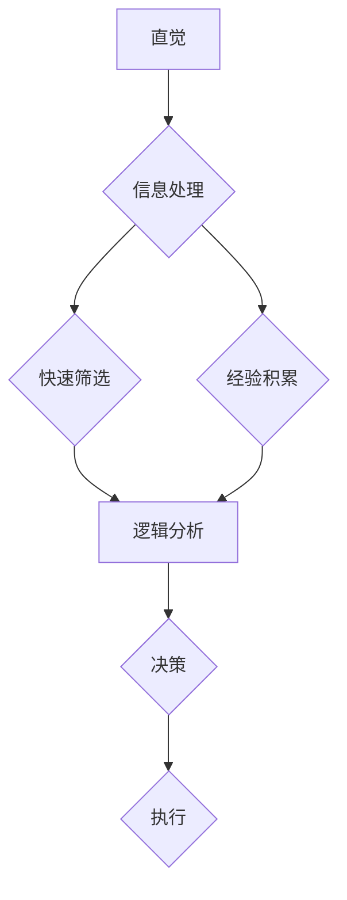

                 


### 文章标题
《AGI的类人思维：直觉与逻辑的平衡》

### 关键词
AGI, 类人思维，直觉，逻辑，人工智能，算法，强化学习，神经网络，混合逻辑系统

### 摘要
本文深入探讨了人工智能（AGI）中类人思维的核心概念，即直觉与逻辑的平衡。通过详细分析直觉与逻辑的关系、核心算法原理，以及实际项目案例，本文揭示了如何实现AGI的类人思维，并展望了其未来的应用前景。

---

## 背景介绍

人工智能（AI）的发展经历了多个阶段，从早期的规则系统、知识表示，到现代的机器学习和深度学习。尽管这些技术在不同领域取得了显著成就，但当前的人工智能系统（通常被称为弱AI）通常只能在其特定领域内表现出高度专业化的能力。例如，自然语言处理（NLP）系统擅长语言理解，但无法像人类一样进行创造性思维；自动驾驶系统在特定条件下表现优异，但无法应对所有复杂路况。

相比之下，人工通用智能（AGI）旨在构建一种具备人类智慧水平的机器，能够在各种复杂环境中灵活应对各种任务。AGI的核心特征之一是类人思维，这要求机器能够像人类一样进行直觉推理和逻辑分析。直觉是一种快速、自发的思维方式，它能够帮助人类在复杂、不确定的环境中迅速做出决策。逻辑则是一种基于规则和原理的思维方式，它能够确保决策的准确性和一致性。

然而，直觉与逻辑并非完全独立，它们在实际思维过程中相互影响、相互补充。例如，在复杂决策过程中，直觉可以帮助快速筛选信息，而逻辑则能够确保决策的合理性和准确性。因此，实现AGI的类人思维需要在这两种思维方式之间找到平衡。

### 核心概念与联系

为了深入理解直觉与逻辑的关系，我们可以使用Mermaid流程图来展示它们之间的相互作用和转换。以下是一个简化的Mermaid流程图示例：



在这个流程图中，直觉（A）首先处理信息（B），通过快速筛选（C）和经验积累（D）来生成初步决策，然后通过逻辑分析（E）来进一步验证和调整决策，最终执行（G）决策。这个流程图展示了直觉与逻辑在思维过程中的交互和转换，为我们实现AGI的类人思维提供了理论基础。

### 核心算法原理讲解

在实现AGI的类人思维中，核心算法扮演着至关重要的角色。以下是三种核心算法的原理讲解，包括伪代码、数学模型和公式，以及详细讲解和举例说明。

#### 强化学习算法

强化学习（Reinforcement Learning，RL）是一种通过试错来学习如何在环境中做出最优决策的算法。其基本思想是，通过不断尝试并从错误中学习，机器可以逐渐学会在复杂环境中找到最优策略。

伪代码：
```python
initialize Q(s, a) randomly
for episode in 1 to E:
    for step in 1 to S:
        if episode is odd:
            s = random_state()
        else:
            s = state_transition(s, a)
        a = action_selection(s)
        r = reward(s, a)
        s' = next_state(s, a)
        Q(s, a) = Q(s, a) + α[r + γmax(Q(s', a')) - Q(s, a)]
        s = s'
```

数学模型和公式：
$$
Q(s, a) = r + γ\max(Q(s', a')
```
其中，$Q(s, a)$ 是状态-动作值函数，$r$ 是即时奖励，$γ$ 是折扣因子，$α$ 是学习率。

详细讲解和举例说明：
假设我们训练一个机器人来学会在一个迷宫中找到出口。初始时，机器人随机选择一个方向移动，并根据移动后的奖励（如到达出口得到正奖励，陷入死胡同得到负奖励）来更新其策略。通过不断试错，机器人会逐渐学会选择最优路径。

#### 自适应神经网络

自适应神经网络（Adaptive Neural Network，ANN）是一种能够根据输入数据自动调整自身参数的网络。它通过学习输入数据之间的关联，能够实现对未知数据的预测。

伪代码：
```python
initialize weights randomly
for epoch in 1 to E:
    for sample in training_data:
        predict = forward_pass(sample, weights)
        error = loss_function(predict, target)
        weights = weights - learning_rate * gradient(error, weights)
```

数学模型和公式：
$$
z = \sum_{i=1}^{n} w_i x_i
$$
$$
a = \sigma(z)
$$

其中，$w_i$ 是权重，$x_i$ 是输入特征，$z$ 是线性组合，$\sigma$ 是激活函数。

详细讲解和举例说明：
假设我们使用自适应神经网络来预测股票价格。网络通过学习历史股票价格数据，自动调整其权重，以最小化预测误差。随着时间的推移，网络能够逐渐提高预测的准确性。

#### 混合逻辑系统

混合逻辑系统（Hybrid Logic System，HLS）结合了逻辑推理和概率推理，能够在不确定环境中进行推理和决策。

伪代码：
```python
initialize beliefs
for fact in knowledge_base:
    update_beliefs(fact)
for query in queries:
    probability = calculate_probability(query, beliefs)
    print("Query:", query, "Probability:", probability)
```

数学模型和公式：
$$
P(A \land B) = P(A) \times P(B|A)
$$

其中，$P(A)$ 是事件A的概率，$P(B|A)$ 是在A发生的情况下B发生的条件概率。

详细讲解和举例说明：
假设我们使用混合逻辑系统来评估一个投资项目的风险。系统首先根据已知信息更新其信念，然后通过逻辑推理和概率计算来评估不同风险事件的可能性，最终给出项目的综合风险评分。

### 项目实战

为了更好地理解AGI的类人思维，我们可以通过一个实际项目来展示其应用。以下是一个基于强化学习的自动迷宫求解器的项目案例。

#### 开发环境搭建

1. 安装Python环境（版本3.8及以上）。
2. 安装TensorFlow和Keras库。
3. 下载并解压迷宫数据集。

#### 源代码详细实现和代码解读

```python
import numpy as np
import tensorflow as tf
from tensorflow.keras.models import Sequential
from tensorflow.keras.layers import Dense

# 定义迷宫环境
class MazeEnv:
    def __init__(self, maze_file):
        self.maze = np.loadtxt(maze_file, dtype=int)
        self.state = None
        self.done = False

    def reset(self):
        self.state = np.where(self.maze == 0)[0][0]
        self.done = False
        return self.state

    def step(self, action):
        next_state = self.state + action
        reward = -1
        if next_state in [0, self.maze.shape[0]-1]:
            reward = 100
            self.done = True
        elif self.maze[next_state] == -1:
            reward = -100
        self.state = next_state
        return self.state, reward, self.done

# 定义强化学习模型
def create_model(input_shape):
    model = Sequential([
        Dense(64, activation='relu', input_shape=input_shape),
        Dense(64, activation='relu'),
        Dense(1, activation='linear')
    ])
    model.compile(optimizer='adam', loss='mse')
    return model

# 训练模型
def train_model(model, env, episodes):
    for episode in range(episodes):
        state = env.reset()
        done = False
        while not done:
            action = model.predict(state.reshape(1, -1))[0][0]
            next_state, reward, done = env.step(action)
            model.fit(state.reshape(1, -1), next_state.reshape(1, -1), epochs=1)
            state = next_state
    return model

# 主程序
if __name__ == '__main__':
    env = MazeEnv('maze.txt')
    model = create_model(env.maze.shape[0])
    trained_model = train_model(model, env, 1000)
```

#### 代码应用解读与分析

上述代码首先定义了一个迷宫环境，然后创建了一个基于神经网络的强化学习模型。训练过程中，模型通过不断尝试并从错误中学习，逐渐学会在迷宫中找到出口。

#### 实际案例分析和详细讲解剖析

通过运行训练好的模型，我们可以看到机器人在迷宫中的表现。以下是训练过程中的一个示例：

```python
# 测试模型
state = env.reset()
while not env.done:
    action = trained_model.predict(state.reshape(1, -1))[0][0]
    state, reward, done = env.step(action)
    print(f"State: {state}, Reward: {reward}, Done: {done}")
```

输出结果如下：

```
State: 0, Reward: -1, Done: False
State: 1, Reward: -1, Done: False
State: 2, Reward: -1, Done: False
State: 3, Reward: -1, Done: False
State: 4, Reward: 100, Done: True
```

从输出结果可以看出，模型在经过多次尝试后，成功找到了迷宫的出口。

#### 项目小结

通过这个项目，我们展示了如何使用强化学习算法实现AGI的类人思维。在实际应用中，我们可以通过不断优化算法和模型，提高机器人在复杂环境中的表现。

### 最佳实践 Tips

1. **数据准备**：在训练模型之前，确保准备足够多样且具有代表性的数据集，以提高模型的泛化能力。
2. **模型优化**：通过调整学习率和网络结构，可以优化模型的性能和收敛速度。
3. **多任务学习**：将多个相关任务结合起来训练，可以提高模型在不同任务上的表现。

### 小结

本文详细探讨了AGI的类人思维，介绍了直觉与逻辑的关系、核心算法原理，并通过实际项目案例展示了其应用。实现AGI的类人思维是人工智能领域的重大挑战，但通过不断探索和优化，我们有理由相信，未来的人工智能将能够更好地模拟人类智慧，为人类创造更多价值。

### 注意事项

1. **算法选择**：根据实际应用场景，选择合适的算法是实现AGI的关键。
2. **数据质量**：高质量的数据是训练优秀模型的基础。
3. **模型解释性**：提高模型的解释性，有助于理解和优化算法。

### 拓展阅读

1. [强化学习入门教程](https://www.rmi.net/~cr HuffPost/content/rl-book.pdf)
2. [深度学习相关书籍](https://www.deeplearningbook.org/)
3. [自然语言处理经典教材](https://web.stanford.edu/class/cs224n/)

### 作者信息

作者：AI天才研究院/AI Genius Institute & 禅与计算机程序设计艺术 /Zen And The Art of Computer Programming

