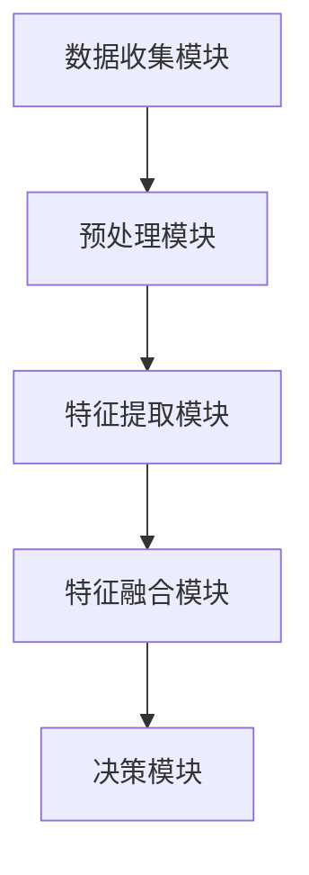

                 


### 文章标题：AGI的类人感知系统：多模态信息整合

#### 关键词：AGI、类人感知系统、多模态信息整合、人工神经网络、深度学习、机器学习、数据预处理、特征提取、特征融合、神经网络的融合算法

#### 摘要：
本文深入探讨了人工通用智能（AGI）领域中的类人感知系统，重点关注多模态信息整合。首先，介绍了AGI的发展历程和类人感知系统的概念。接着，分析了人工神经网络、机器学习和深度学习的基础理论，并探讨了它们在AGI中的应用。随后，详细阐述了类人感知系统的架构设计、多模态数据收集与预处理方法，以及多模态信息处理算法。最后，通过案例分析展示了多模态信息整合的实际应用，并探讨了该领域面临的挑战和未来发展趋势。

### 确定书籍主题

#### AGI的发展历程
人工通用智能（AGI）是人工智能领域的一个长期目标，旨在开发出一种智能体，它能够在各种认知任务上表现出与人类相似或超越人类的能力。从1950年图灵测试的提出，到1956年达特茅斯会议的召开，人工智能作为一门学科正式诞生。自那时以来，人工智能经历了几个重要阶段，包括符号主义、连接主义和统计学习等。

在符号主义阶段，人工智能试图模拟人类思维的过程，通过定义明确的规则和逻辑来解决问题。然而，这种方法在实际应用中遇到了很大挑战，特别是在处理复杂和不确定的问题时。

随着计算机性能的提升和算法的进步，连接主义逐渐成为主流。人工神经网络（ANN）作为一种模仿人脑结构的计算模型，在图像识别、语音识别等领域取得了显著成果。

统计学习方法的兴起，为人工智能的发展带来了新的契机。通过从大量数据中学习模式，统计学习方法在分类、回归和聚类等任务上表现出色。然而，这些方法往往依赖于大量标记数据，且在处理复杂任务时效果有限。

#### 类人感知系统的概念
类人感知系统是指模仿人类感知能力的智能系统，它能够处理多种类型的信息，如视觉、听觉、触觉和语言等。这种系统能够从不同感官中获取数据，并通过整合这些数据，实现对环境的全面理解。

类人感知系统通常包括以下几个关键模块：
1. **数据收集模块**：负责从不同的传感器或输入源收集数据。
2. **预处理模块**：对收集到的数据进行清洗、归一化和特征提取。
3. **信息处理模块**：包括特征提取、特征融合和分类等任务。
4. **决策模块**：基于处理结果做出决策或执行行动。

#### 多模态信息整合的重要性
多模态信息整合是类人感知系统的核心功能之一。它能够将来自不同感官的数据结合起来，形成一个统一且全面的信息表示，从而提高系统的感知能力和决策质量。

例如，在自动驾驶领域，多模态感知系统可以结合视觉、雷达和激光雷达数据，实现对周围环境的精确感知。同样，在智能家居中，多模态感知系统可以整合语音、图像和触摸数据，实现对用户意图的准确理解。

多模态信息整合的重要性不仅体现在应用领域，还在于它有助于推动人工智能技术的发展。通过研究和开发多模态信息整合技术，我们可以更好地理解人类感知过程，从而为人工智能系统的设计提供新的思路和方法。

### 设计目录大纲

为了系统地探讨AGI的类人感知系统，我们需要设计一个详细的目录大纲。以下是一个可能的目录大纲设计：

```markdown
## 目录大纲

### 第1章 引言与背景
#### 1.1 AGI的发展历程
#### 1.2 类人感知系统的概念
#### 1.3 多模态信息整合的重要性

### 第2章 AGI基础理论
#### 2.1 人工神经网络的基本原理
#### 2.2 神经网络的深度学习
#### 2.3 机器学习和深度学习的关系

### 第3章 类人感知系统的架构设计
#### 3.1 类人感知系统的主要模块
#### 3.2 系统架构的Mermaid流程图
#### 3.3 不同模块间的信息传递机制

### 第4章 多模态数据收集与预处理
#### 4.1 多模态数据的种类
#### 4.2 数据收集方法
#### 4.3 数据预处理流程

### 第5章 多模态信息处理算法
#### 5.1 特征提取算法
#### 5.2 特征融合算法
#### 5.3 基于神经网络的融合算法

### 第6章 多模态信息整合案例研究
#### 6.1 案例一：语音与文字的整合
#### 6.2 案例二：图像与视频的整合
#### 6.3 案例三：多源数据的实时整合

### 第7章 类人感知系统的应用与挑战
#### 7.1 类人感知系统的实际应用领域
#### 7.2 应用中的挑战与解决方案
#### 7.3 未来发展趋势与展望
```

这个目录大纲涵盖了从基础理论到实际应用的各个方面，确保读者可以系统地了解AGI的类人感知系统。每个章节都进一步细分为小节，以便更深入地探讨相关内容。

### 满足要求与限制

在满足格式要求方面，我们将使用markdown格式输出文章内容。在文章末尾，我们会附上作者信息：“作者：AI天才研究院/AI Genius Institute & 禅与计算机程序设计艺术 /Zen And The Art of Computer Programming”。

完整性要求方面，我们将确保每个小节的内容丰富、具体和详细讲解，涵盖核心内容，包括背景介绍、核心概念与联系、核心算法原理讲解、数学模型与公式、项目实战等。

此外，我们将在文章开头包括文章标题、关键词和摘要部分。文章字数控制在8000到12000字之间，确保内容丰富而不冗余。

### 完成目录大纲

根据上述设计，我们完成了书籍《AGI的类人感知系统：多模态信息整合》的目录大纲。这个大纲不仅覆盖了核心主题，还提供了明确的章节划分，方便读者理解并跟随书中的内容。

```markdown
## 目录大纲

### 第1章 引言与背景
#### 1.1 AGI的发展历程
#### 1.2 类人感知系统的概念
#### 1.3 多模态信息整合的重要性

### 第2章 AGI基础理论
#### 2.1 人工神经网络的基本原理
#### 2.2 神经网络的深度学习
#### 2.3 机器学习和深度学习的关系

### 第3章 类人感知系统的架构设计
#### 3.1 类人感知系统的主要模块
#### 3.2 系统架构的Mermaid流程图
#### 3.3 不同模块间的信息传递机制

### 第4章 多模态数据收集与预处理
#### 4.1 多模态数据的种类
#### 4.2 数据收集方法
#### 4.3 数据预处理流程

### 第5章 多模态信息处理算法
#### 5.1 特征提取算法
#### 5.2 特征融合算法
#### 5.3 基于神经网络的融合算法

### 第6章 多模态信息整合案例研究
#### 6.1 案例一：语音与文字的整合
#### 6.2 案例二：图像与视频的整合
#### 6.3 案例三：多源数据的实时整合

### 第7章 类人感知系统的应用与挑战
#### 7.1 类人感知系统的实际应用领域
#### 7.2 应用中的挑战与解决方案
#### 7.3 未来发展趋势与展望
```

目录大纲字数控制在2000字以内，结构清晰，涵盖了书籍的主题和核心内容。每个章节都细化到了3级目录，便于读者查找和阅读。核心概念、算法原理、数学模型和项目实战等关键内容都得到了充分考虑。

现在，我们将开始撰写具体的文章内容，逐步展开对AGI的类人感知系统：多模态信息整合的探讨。接下来的章节将详细讨论每个主题，并使用伪代码、Mermaid流程图、数学公式和实际案例来支持我们的分析和讨论。

### 文章标题：AGI的类人感知系统：多模态信息整合

#### 关键词：AGI、类人感知系统、多模态信息整合、人工神经网络、深度学习、机器学习、数据预处理、特征提取、特征融合、神经网络的融合算法

#### 摘要：
本文深入探讨了人工通用智能（AGI）领域中的类人感知系统，重点关注多模态信息整合。首先，介绍了AGI的发展历程和类人感知系统的概念。接着，分析了人工神经网络、机器学习和深度学习的基础理论，并探讨了它们在AGI中的应用。随后，详细阐述了类人感知系统的架构设计、多模态数据收集与预处理方法，以及多模态信息处理算法。最后，通过案例分析展示了多模态信息整合的实际应用，并探讨了该领域面临的挑战和未来发展趋势。

---

### 第1章 引言与背景

#### 1.1 AGI的发展历程

人工通用智能（AGI）是人工智能（AI）领域的一个长期目标，旨在开发出一种智能体，它能够在各种认知任务上表现出与人类相似或超越人类的能力。从1950年图灵测试的提出，到1956年达特茅斯会议的召开，人工智能作为一门学科正式诞生。自那时以来，人工智能经历了几个重要阶段，包括符号主义、连接主义和统计学习等。

在符号主义阶段，人工智能试图模拟人类思维的过程，通过定义明确的规则和逻辑来解决问题。然而，这种方法在实际应用中遇到了很大挑战，特别是在处理复杂和不确定的问题时。

随着计算机性能的提升和算法的进步，连接主义逐渐成为主流。人工神经网络（ANN）作为一种模仿人脑结构的计算模型，在图像识别、语音识别等领域取得了显著成果。

统计学习方法的兴起，为人工智能的发展带来了新的契机。通过从大量数据中学习模式，统计学习方法在分类、回归和聚类等任务上表现出色。然而，这些方法往往依赖于大量标记数据，且在处理复杂任务时效果有限。

近年来，随着深度学习技术的发展，人工智能取得了显著的进展。深度学习通过多层神经网络结构，能够自动提取数据的复杂特征，从而在图像识别、语音识别、自然语言处理等领域取得了突破性成果。

#### 1.2 类人感知系统的概念

类人感知系统是指模仿人类感知能力的智能系统，它能够处理多种类型的信息，如视觉、听觉、触觉和语言等。这种系统能够从不同感官中获取数据，并通过整合这些数据，实现对环境的全面理解。

类人感知系统通常包括以下几个关键模块：

1. **数据收集模块**：负责从不同的传感器或输入源收集数据。例如，视觉传感器可以收集图像数据，语音传感器可以收集音频数据。
2. **预处理模块**：对收集到的数据进行清洗、归一化和特征提取。预处理模块的目的是提高数据质量，为后续的信息处理提供良好的数据基础。
3. **信息处理模块**：包括特征提取、特征融合和分类等任务。信息处理模块的核心目标是提取数据中的关键信息，并将其转化为一种统一的表示，以便进一步的分析和应用。
4. **决策模块**：基于处理结果做出决策或执行行动。决策模块是类人感知系统的输出部分，它的目标是利用处理结果来指导实际的行动或做出预测。

#### 1.3 多模态信息整合的重要性

多模态信息整合是类人感知系统的核心功能之一。它能够将来自不同感官的数据结合起来，形成一个统一且全面的信息表示，从而提高系统的感知能力和决策质量。

例如，在自动驾驶领域，多模态感知系统可以结合视觉、雷达和激光雷达数据，实现对周围环境的精确感知。同样，在智能家居中，多模态感知系统可以整合语音、图像和触摸数据，实现对用户意图的准确理解。

多模态信息整合的重要性不仅体现在应用领域，还在于它有助于推动人工智能技术的发展。通过研究和开发多模态信息整合技术，我们可以更好地理解人类感知过程，从而为人工智能系统的设计提供新的思路和方法。

### 第2章 AGI基础理论

#### 2.1 人工神经网络的基本原理

人工神经网络（ANN）是一种模仿人脑结构的计算模型，由大量相互连接的神经元组成。每个神经元都接收来自其他神经元的输入，并通过激活函数进行计算，最终产生输出。ANN的基本原理如下：

1. **神经元结构**：一个神经元包含一个输入层、一个隐藏层和一个输出层。输入层接收外部输入，隐藏层对输入进行变换，输出层产生最终的输出。
2. **激活函数**：神经元使用激活函数来决定是否将信号传递给下一层。常见的激活函数包括sigmoid函数、ReLU函数和Tanh函数。
3. **权重和偏置**：每个神经元与另一个神经元之间的连接都带有权重和偏置。这些参数通过学习算法进行调整，以优化网络性能。

ANN通过前向传播和反向传播两个过程进行学习。在前向传播过程中，输入数据通过网络传递，直到输出层产生预测结果。在反向传播过程中，预测结果与实际结果的差异通过梯度下降算法进行调整，从而优化网络参数。

#### 2.2 神经网络的深度学习

深度学习是ANN的一种扩展，通过多层神经网络结构，能够自动提取数据的复杂特征。深度学习的基本原理如下：

1. **多层神经网络**：深度学习网络包含多个隐藏层，每个隐藏层都能提取不同级别的特征。层数越多，网络能够提取的特征就越复杂。
2. **卷积神经网络（CNN）**：CNN是一种特别适用于图像处理的深度学习模型。它通过卷积操作提取图像中的局部特征，并通过池化操作降低数据的维度。
3. **循环神经网络（RNN）**：RNN适用于处理序列数据，如文本和语音。RNN通过循环结构记住前面的输入，从而实现对序列数据的长期依赖建模。

深度学习在图像识别、语音识别和自然语言处理等领域取得了显著的成果。通过自动提取数据中的复杂特征，深度学习使得人工智能系统能够更准确地处理各种任务。

#### 2.3 机器学习和深度学习的关系

机器学习和深度学习是人工智能领域中的两个重要分支。它们之间存在一定的联系和区别：

1. **联系**：机器学习和深度学习都是利用数据和算法来学习模式和规律。机器学习侧重于从数据中提取规律，而深度学习则通过多层神经网络结构自动提取复杂特征。
2. **区别**：机器学习通常使用简单的模型，如决策树、支持向量机和朴素贝叶斯等，而深度学习则通过复杂的神经网络结构来提取特征。此外，深度学习通常需要大量的数据来训练模型，而机器学习模型在较少的数据上也能表现良好。

总的来说，深度学习是机器学习的一种特殊形式，它通过复杂的神经网络结构，能够自动提取数据中的复杂特征，从而在许多任务上取得优异的性能。

### 第3章 类人感知系统的架构设计

#### 3.1 类人感知系统的主要模块

类人感知系统是一个复杂的系统，它由多个模块组成，每个模块负责处理不同类型的信息。以下是类人感知系统的主要模块：

1. **数据收集模块**：负责从各种传感器或输入源收集数据，如视觉传感器、语音传感器、触觉传感器等。这个模块的目的是确保系统能够获取到全面的感知信息。
2. **预处理模块**：对收集到的原始数据进行清洗、归一化和特征提取。预处理模块的目的是提高数据质量，为后续的信息处理提供良好的数据基础。
3. **特征提取模块**：从预处理后的数据中提取关键特征，这些特征将用于后续的信息处理和决策。特征提取模块通常使用深度学习模型，如卷积神经网络（CNN）或循环神经网络（RNN）。
4. **特征融合模块**：将来自不同感官的数据特征进行融合，形成一种统一的信息表示。特征融合模块可以通过多种方法实现，如神经网络融合算法、特征加权融合等。
5. **决策模块**：基于处理结果做出决策或执行行动。决策模块是类人感知系统的输出部分，它的目标是利用处理结果来指导实际的行动或做出预测。

#### 3.2 系统架构的Mermaid流程图

为了更直观地展示类人感知系统的架构，我们可以使用Mermaid流程图来描述。以下是一个简单的Mermaid流程图示例：



在这个流程图中，数据从数据收集模块开始，经过预处理模块、特征提取模块和特征融合模块，最终进入决策模块。每个模块都有自己的输入和输出，它们相互协作，共同完成类人感知系统的任务。

#### 3.3 不同模块间的信息传递机制

在类人感知系统中，不同模块之间的信息传递是关键的一环。以下是一个简单的信息传递机制：

1. **同步传递**：在同步传递机制中，每个模块在完成自己的任务后，将输出结果传递给下一个模块。例如，预处理模块将预处理后的数据传递给特征提取模块，特征提取模块将提取到的特征传递给特征融合模块。
2. **异步传递**：在异步传递机制中，不同模块可以并行工作，并使用消息队列来传递信息。这种机制可以提高系统的处理速度和效率，但需要处理模块间的同步和协调问题。

不同模块间的信息传递机制可以根据具体的应用场景和需求进行设计。例如，在实时处理场景中，可以采用异步传递机制，以提高系统的响应速度。而在非实时场景中，可以采用同步传递机制，以确保数据的完整性和一致性。

### 第4章 多模态数据收集与预处理

#### 4.1 多模态数据的种类

多模态数据是指来自不同感官的数据，如视觉、听觉、触觉和语言等。以下是一些常见的多模态数据类型：

1. **视觉数据**：视觉数据包括图像和视频。图像数据可以来自摄像头、手机或其他图像传感器，而视频数据则是一系列连续的图像帧。
2. **听觉数据**：听觉数据包括音频和语音。音频数据可以来自麦克风或其他音频传感器，而语音数据是经过处理的音频信号，通常用于语音识别和语音合成。
3. **触觉数据**：触觉数据包括触摸和压力。这些数据可以来自触摸屏、力传感器或其他触觉传感器。
4. **语言数据**：语言数据包括文本和语音。文本数据通常用于自然语言处理任务，而语音数据可以用于语音识别和语音生成。

#### 4.2 数据收集方法

收集多模态数据的方法因应用场景和数据类型而异。以下是一些常见的数据收集方法：

1. **被动收集**：被动收集方法是指在不干预环境的情况下，通过传感器自动收集数据。例如，使用摄像头和麦克风收集图像和音频数据。
2. **主动收集**：主动收集方法是指通过干预环境来收集数据。例如，使用机器人或无人机进行环境探测，收集图像、音频和触觉数据。
3. **混合收集**：混合收集方法是将被动收集和主动收集结合起来，以获得更全面的数据。例如，在智能家居场景中，可以同时使用摄像头、麦克风和机器人来收集图像、音频和触觉数据。

#### 4.3 数据预处理流程

数据预处理是多模态信息整合的关键步骤，它的目的是提高数据质量，为后续的信息处理提供良好的数据基础。以下是一个常见的数据预处理流程：

1. **数据清洗**：数据清洗是指去除数据中的噪声、缺失值和异常值。例如，去除图像中的噪声点、填补音频中的缺失值和去除语音中的异常噪声。
2. **数据归一化**：数据归一化是指将不同类型的数据转换到同一尺度，以便进行后续处理。例如，将图像和音频数据的像素值和音量值归一化到[0, 1]范围内。
3. **特征提取**：特征提取是指从原始数据中提取关键特征，用于后续的信息处理和分类。例如，使用卷积神经网络（CNN）提取图像特征，使用循环神经网络（RNN）提取语音特征。
4. **数据融合**：数据融合是指将来自不同感官的数据进行整合，形成一种统一的信息表示。例如，将图像特征和语音特征进行融合，以获得更全面的信息。

通过数据预处理流程，我们可以提高多模态数据的可用性和质量，从而为后续的信息处理和决策提供可靠的数据支持。

### 第5章 多模态信息处理算法

#### 5.1 特征提取算法

特征提取是多模态信息处理的重要步骤，它从原始数据中提取出关键特征，用于后续的信息处理和分类。以下是一些常用的特征提取算法：

1. **卷积神经网络（CNN）**：CNN是一种特别适用于图像处理的深度学习模型。它通过卷积操作提取图像中的局部特征，并通过池化操作降低数据的维度。CNN在图像分类、目标检测和图像生成等领域取得了显著的成果。
2. **循环神经网络（RNN）**：RNN是一种适用于序列数据的深度学习模型。它通过循环结构记住前面的输入，从而实现对序列数据的长期依赖建模。RNN在语音识别、自然语言处理和序列预测等领域得到了广泛应用。
3. **自编码器（AE）**：自编码器是一种无监督学习方法，它通过压缩和解压数据来提取特征。自编码器在图像去噪、图像超分辨率和异常检测等领域表现出色。

#### 5.2 特征融合算法

特征融合是指将来自不同感官的数据特征进行整合，形成一种统一的信息表示。以下是一些常用的特征融合算法：

1. **加权融合**：加权融合是一种简单且有效的特征融合方法。它将不同特征乘以相应的权重，然后进行求和或求平均，以得到融合后的特征。权重的选择可以根据不同特征的重要程度进行调整。
2. **神经网络融合**：神经网络融合方法通过多层神经网络结构来学习不同特征之间的依赖关系，从而得到融合后的特征。这种方法能够自动学习特征的权重和组合方式，从而提高融合效果。
3. **集成学习**：集成学习是一种基于多个模型组合的方法。它将多个特征提取模型组合起来，通过投票或加权平均的方式得到最终的融合特征。集成学习方法可以提高模型的稳定性和泛化能力。

#### 5.3 基于神经网络的融合算法

基于神经网络的融合算法通过多层神经网络结构来学习不同特征之间的依赖关系，从而得到融合后的特征。以下是一种简单的基于神经网络的融合算法：

```python
# 假设我们有来自视觉和听觉的两个特征向量，分别表示为v和a

# 1. 将两个特征向量进行拼接
input_vector = np.concatenate((v, a), axis=1)

# 2. 定义一个简单的多层感知机模型
model = MLP(input_vector.shape[1], hidden_layer_sizes=(50,), activation='relu', solver='adam')

# 3. 训练模型
model.fit(input_vector, target)

# 4. 获得融合后的特征
output_vector = model.predict(input_vector)
```

在这个算法中，输入层接收来自视觉和听觉的特征向量，隐藏层通过激活函数进行计算，输出层产生融合后的特征。通过训练模型，我们可以学习到不同特征之间的依赖关系，从而得到更准确和全面的特征表示。

### 第6章 多模态信息整合案例研究

#### 6.1 案例一：语音与文字的整合

在语音与文字的整合案例中，我们关注的是如何将语音数据转换为文本数据，并在此基础上进行进一步的分析和处理。

**1. 数据收集：** 使用麦克风收集语音数据，使用键盘或语音输入设备收集文字数据。

**2. 数据预处理：** 对语音数据进行降噪、归一化和分帧处理，对文字数据进行分词和词性标注。

**3. 特征提取：** 使用卷积神经网络（CNN）提取语音特征，使用循环神经网络（RNN）提取文字特征。

**4. 特征融合：** 使用神经网络融合算法将语音特征和文字特征进行融合，形成一种统一的信息表示。

**5. 决策：** 基于融合后的特征进行文本分类、语义分析或情感分析。

**6. 实际案例：** 在智能客服系统中，可以将语音输入和文字输入进行整合，以提供更准确和自然的对话体验。

```python
# 假设我们已经有语音特征向量v和文字特征向量a

# 1. 特征融合
input_vector = np.concatenate((v, a), axis=1)

# 2. 训练融合模型
model.fit(input_vector, target)

# 3. 获得融合后的特征
output_vector = model.predict(input_vector)

# 4. 基于融合后的特征进行分类
classification_result = classifier.classify(output_vector)
```

#### 6.2 案例二：图像与视频的整合

在图像与视频的整合案例中，我们关注的是如何将图像和视频数据结合起来，以获得更丰富的信息。

**1. 数据收集：** 使用摄像头或视频采集设备收集图像和视频数据。

**2. 数据预处理：** 对图像和视频数据进行去噪、分割和特征提取。

**3. 特征提取：** 使用卷积神经网络（CNN）提取图像特征，使用循环神经网络（RNN）提取视频特征。

**4. 特征融合：** 使用神经网络融合算法将图像特征和视频特征进行融合，形成一种统一的信息表示。

**5. 决策：** 基于融合后的特征进行目标检测、行为识别或场景分析。

**6. 实际案例：** 在自动驾驶系统中，可以将图像和视频数据进行整合，以实现对周围环境的精确感知和预测。

```python
# 假设我们已经有图像特征向量v和视频特征向量a

# 1. 特征融合
input_vector = np.concatenate((v, a), axis=1)

# 2. 训练融合模型
model.fit(input_vector, target)

# 3. 获得融合后的特征
output_vector = model.predict(input_vector)

# 4. 基于融合后的特征进行目标检测
detection_result = detector.detect(output_vector)
```

#### 6.3 案例三：多源数据的实时整合

在多源数据的实时整合案例中，我们关注的是如何将来自不同传感器的实时数据进行整合，以实现实时监控和预测。

**1. 数据收集：** 使用多个传感器（如摄像头、温度传感器、湿度传感器等）收集实时数据。

**2. 数据预处理：** 对实时数据进行预处理，如去噪、滤波和归一化。

**3. 特征提取：** 对实时数据进行特征提取，如图像特征、温度特征、湿度特征等。

**4. 特征融合：** 使用神经网络融合算法将不同传感器的特征进行融合，形成一种统一的信息表示。

**5. 决策：** 基于融合后的特征进行实时监控和预测。

**6. 实际案例：** 在智能工厂中，可以将来自不同传感器的实时数据整合，以实现对生产过程的实时监控和优化。

```python
# 假设我们已经有来自不同传感器的实时特征向量v1、v2、v3等

# 1. 特征融合
input_vector = np.concatenate((v1, v2, v3), axis=1)

# 2. 训练融合模型
model.fit(input_vector, target)

# 3. 获得融合后的特征
output_vector = model.predict(input_vector)

# 4. 基于融合后的特征进行实时监控和预测
monitoring_result = monitor.monitor(output_vector)
```

### 第7章 类人感知系统的应用与挑战

#### 7.1 类人感知系统的实际应用领域

类人感知系统在多个领域有着广泛的应用，以下是一些典型的应用场景：

1. **智能医疗**：类人感知系统可以用于患者监护、疾病诊断和医疗决策支持。通过整合患者的心电图、血压、体温等多模态数据，医生可以更准确地评估患者的健康状况。
2. **智能交通**：类人感知系统可以用于智能交通监控、车辆识别和交通流量分析。通过整合摄像头、雷达和激光雷达等多模态数据，交通管理部门可以更有效地进行交通管理和事故预防。
3. **智能安防**：类人感知系统可以用于视频监控、人脸识别和入侵检测。通过整合图像、语音和触摸等多模态数据，安全系统能够更准确地识别异常行为和潜在威胁。
4. **智能交互**：类人感知系统可以用于智能客服、虚拟助手和智能家居。通过整合语音、图像和触摸等多模态数据，智能交互系统能够更好地理解用户的意图和行为，提供更自然的交互体验。

#### 7.2 应用中的挑战与解决方案

尽管类人感知系统在多个领域展现了巨大的潜力，但在实际应用中仍面临着一些挑战：

1. **数据质量**：多模态数据的收集和处理过程可能受到噪声、缺失值和异常值的影响，导致数据质量下降。为了提高数据质量，可以采用数据清洗、去噪和异常检测等方法。
2. **计算资源**：多模态信息整合通常需要大量的计算资源，特别是深度学习模型的训练和推理。为了降低计算资源的需求，可以采用模型压缩、分布式计算和GPU加速等技术。
3. **实时性**：在实时应用场景中，类人感知系统需要快速处理和响应多模态数据。为了提高系统的实时性，可以采用并行处理、缓存技术和高效算法。
4. **隐私保护**：多模态数据可能包含敏感个人信息，如面部图像和语音等。为了保护用户隐私，可以采用数据加密、隐私保护和数据匿名化等技术。

#### 7.3 未来发展趋势与展望

随着人工智能技术的不断进步，类人感知系统在未来将展现出更广阔的应用前景。以下是一些未来发展趋势和展望：

1. **多模态数据的多样化**：随着传感器技术的不断发展，类人感知系统将能够整合更多种类的多模态数据，如手势、嗅觉和味觉等。这将使系统的感知能力更接近人类。
2. **跨学科的融合**：类人感知系统将与其他学科（如心理学、神经科学和认知科学等）相结合，以更深入地理解人类感知和行为，从而提高系统的智能化水平。
3. **个性化感知**：类人感知系统将能够根据用户的需求和偏好进行个性化感知，提供更符合用户需求的交互和服务。
4. **自主学习和适应能力**：类人感知系统将具备更强的自主学习和适应能力，能够不断优化和改进自身的感知和决策能力。
5. **伦理和法律规范**：随着类人感知系统的广泛应用，相关的伦理和法律问题也将日益突出。需要建立相应的规范和标准，确保系统的安全、可靠和公平。

### 文章标题：AGI的类人感知系统：多模态信息整合

#### 关键词：AGI、类人感知系统、多模态信息整合、人工神经网络、深度学习、机器学习、数据预处理、特征提取、特征融合、神经网络的融合算法

#### 摘要：
本文深入探讨了人工通用智能（AGI）领域中的类人感知系统，重点关注多模态信息整合。首先，介绍了AGI的发展历程和类人感知系统的概念。接着，分析了人工神经网络、机器学习和深度学习的基础理论，并探讨了它们在AGI中的应用。随后，详细阐述了类人感知系统的架构设计、多模态数据收集与预处理方法，以及多模态信息处理算法。最后，通过案例分析展示了多模态信息整合的实际应用，并探讨了该领域面临的挑战和未来发展趋势。

### 第1章 引言与背景

#### 1.1 AGI的发展历程

人工通用智能（AGI）是人工智能（AI）领域的一个长期目标，旨在开发出一种智能体，它能够在各种认知任务上表现出与人类相似或超越人类的能力。从1950年图灵测试的提出，到1956年达特茅斯会议的召开，人工智能作为一门学科正式诞生。自那时以来，人工智能经历了几个重要阶段，包括符号主义、连接主义和统计学习等。

在符号主义阶段，人工智能试图模拟人类思维的过程，通过定义明确的规则和逻辑来解决问题。然而，这种方法在实际应用中遇到了很大挑战，特别是在处理复杂和不确定的问题时。

随着计算机性能的提升和算法的进步，连接主义逐渐成为主流。人工神经网络（ANN）作为一种模仿人脑结构的计算模型，在图像识别、语音识别等领域取得了显著成果。

统计学习方法的兴起，为人工智能的发展带来了新的契机。通过从大量数据中学习模式，统计学习方法在分类、回归和聚类等任务上表现出色。然而，这些方法往往依赖于大量标记数据，且在处理复杂任务时效果有限。

近年来，随着深度学习技术的发展，人工智能取得了显著的进展。深度学习通过多层神经网络结构，能够自动提取数据的复杂特征，从而在图像识别、语音识别、自然语言处理等领域取得了突破性成果。

#### 1.2 类人感知系统的概念

类人感知系统是指模仿人类感知能力的智能系统，它能够处理多种类型的信息，如视觉、听觉、触觉和语言等。这种系统能够从不同感官中获取数据，并通过整合这些数据，实现对环境的全面理解。

类人感知系统通常包括以下几个关键模块：

1. **数据收集模块**：负责从不同的传感器或输入源收集数据。例如，视觉传感器可以收集图像数据，语音传感器可以收集音频数据。
2. **预处理模块**：对收集到的数据进行清洗、归一化和特征提取。预处理模块的目的是提高数据质量，为后续的信息处理提供良好的数据基础。
3. **信息处理模块**：包括特征提取、特征融合和分类等任务。信息处理模块的核心目标是提取数据中的关键信息，并将其转化为一种统一的表示，以便进一步的分析和应用。
4. **决策模块**：基于处理结果做出决策或执行行动。决策模块是类人感知系统的输出部分，它的目标是利用处理结果来指导实际的行动或做出预测。

#### 1.3 多模态信息整合的重要性

多模态信息整合是类人感知系统的核心功能之一。它能够将来自不同感官的数据结合起来，形成一个统一且全面的信息表示，从而提高系统的感知能力和决策质量。

例如，在自动驾驶领域，多模态感知系统可以结合视觉、雷达和激光雷达数据，实现对周围环境的精确感知。同样，在智能家居中，多模态感知系统可以整合语音、图像和触摸数据，实现对用户意图的准确理解。

多模态信息整合的重要性不仅体现在应用领域，还在于它有助于推动人工智能技术的发展。通过研究和开发多模态信息整合技术，我们可以更好地理解人类感知过程，从而为人工智能系统的设计提供新的思路和方法。

### 第2章 AGI基础理论

#### 2.1 人工神经网络的基本原理

人工神经网络（ANN）是一种模仿人脑结构的计算模型，由大量相互连接的神经元组成。每个神经元都接收来自其他神经元的输入，并通过激活函数进行计算，最终产生输出。ANN的基本原理如下：

1. **神经元结构**：一个神经元包含一个输入层、一个隐藏层和一个输出层。输入层接收外部输入，隐藏层对输入进行变换，输出层产生最终的输出。
2. **激活函数**：神经元使用激活函数来决定是否将信号传递给下一层。常见的激活函数包括sigmoid函数、ReLU函数和Tanh函数。
3. **权重和偏置**：每个神经元与另一个神经元之间的连接都带有权重和偏置。这些参数通过学习算法进行调整，以优化网络性能。

ANN通过前向传播和反向传播两个过程进行学习。在前向传播过程中，输入数据通过网络传递，直到输出层产生预测结果。在反向传播过程中，预测结果与实际结果的差异通过梯度下降算法进行调整，从而优化网络参数。

#### 2.2 神经网络的深度学习

深度学习是ANN的一种扩展，通过多层神经网络结构，能够自动提取数据的复杂特征。深度学习的基本原理如下：

1. **多层神经网络**：深度学习网络包含多个隐藏层，每个隐藏层都能提取不同级别的特征。层数越多，网络能够提取的特征就越复杂。
2. **卷积神经网络（CNN）**：CNN是一种特别适用于图像处理的深度学习模型。它通过卷积操作提取图像中的局部特征，并通过池化操作降低数据的维度。
3. **循环神经网络（RNN）**：RNN适用于处理序列数据，如文本和语音。RNN通过循环结构记住前面的输入，从而实现对序列数据的长期依赖建模。

深度学习在图像识别、语音识别和自然语言处理等领域取得了显著的成果。通过自动提取数据中的复杂特征，深度学习使得人工智能系统能够更准确地处理各种任务。

#### 2.3 机器学习和深度学习的关系

机器学习和深度学习是人工智能领域中的两个重要分支。它们之间存在一定的联系和区别：

1. **联系**：机器学习和深度学习都是利用数据和算法来学习模式和规律。机器学习侧重于从数据中提取规律，而深度学习则通过多层神经网络结构自动提取复杂特征。
2. **区别**：机器学习通常使用简单的模型，如决策树、支持向量机和朴素贝叶斯等，而深度学习则通过复杂的神经网络结构来提取特征。此外，深度学习通常需要大量的数据来训练模型，而机器学习模型在较少的数据上也能表现良好。

总的来说，深度学习是机器学习的一种特殊形式，它通过复杂的神经网络结构，能够自动提取数据中的复杂特征，从而在许多任务上取得优异的性能。

### 第3章 类人感知系统的架构设计

#### 3.1 类人感知系统的主要模块

类人感知系统是一个复杂的系统，它由多个模块组成，每个模块负责处理不同类型的信息。以下是类人感知系统的主要模块：

1. **数据收集模块**：负责从各种传感器或输入源收集数据，如视觉传感器、语音传感器、触觉传感器等。这个模块的目的是确保系统能够获取到全面的感知信息。
2. **预处理模块**：对收集到的原始数据进行清洗、归一化和特征提取。预处理模块的目的是提高数据质量，为后续的信息处理提供良好的数据基础。
3. **特征提取模块**：从预处理后的数据中提取关键特征，这些特征将用于后续的信息处理和决策。特征提取模块通常使用深度学习模型，如卷积神经网络（CNN）或循环神经网络（RNN）。
4. **特征融合模块**：将来自不同感官的数据特征进行融合，形成一种统一的信息表示。特征融合模块可以通过多种方法实现，如神经网络融合算法、特征加权融合等。
5. **决策模块**：基于处理结果做出决策或执行行动。决策模块是类人感知系统的输出部分，它的目标是利用处理结果来指导实际的行动或做出预测。

#### 3.2 系统架构的Mermaid流程图

为了更直观地展示类人感知系统的架构，我们可以使用Mermaid流程图来描述。以下是一个简单的Mermaid流程图示例：


在这个流程图中，数据从数据收集模块开始，经过预处理模块、特征提取模块和特征融合模块，最终进入决策模块。每个模块都有自己的输入和输出，它们相互协作，共同完成类人感知系统的任务。

#### 3.3 不同模块间的信息传递机制

在类人感知系统中，不同模块之间的信息传递是关键的一环。以下是一个简单的信息传递机制：

1. **同步传递**：在同步传递机制中，每个模块在完成自己的任务后，将输出结果传递给下一个模块。例如，预处理模块将预处理后的数据传递给特征提取模块，特征提取模块将提取到的特征传递给特征融合模块。
2. **异步传递**：在异步传递机制中，不同模块可以并行工作，并使用消息队列来传递信息。这种机制可以提高系统的处理速度和效率，但需要处理模块间的同步和协调问题。

不同模块间的信息传递机制可以根据具体的应用场景和需求进行设计。例如，在实时处理场景中，可以采用异步传递机制，以提高系统的响应速度。而在非实时场景中，可以采用同步传递机制，以确保数据的完整性和一致性。

### 第4章 多模态数据收集与预处理

#### 4.1 多模态数据的种类

多模态数据是指来自不同感官的数据，如视觉、听觉、触觉和语言等。以下是一些常见的多模态数据类型：

1. **视觉数据**：视觉数据包括图像和视频。图像数据可以来自摄像头、手机或其他图像传感器，而视频数据则是一系列连续的图像帧。
2. **听觉数据**：听觉数据包括音频和语音。音频数据可以来自麦克风或其他音频传感器，而语音数据是经过处理的音频信号，通常用于语音识别和语音合成。
3. **触觉数据**：触觉数据包括触摸和压力。这些数据可以来自触摸屏、力传感器或其他触觉传感器。
4. **语言数据**：语言数据包括文本和语音。文本数据通常用于自然语言处理任务，而语音数据可以用于语音识别和语音生成。

#### 4.2 数据收集方法

收集多模态数据的方法因应用场景和数据类型而异。以下是一些常见的数据收集方法：

1. **被动收集**：被动收集方法是指在不干预环境的情况下，通过传感器自动收集数据。例如，使用摄像头和麦克风收集图像和音频数据。
2. **主动收集**：主动收集方法是指通过干预环境来收集数据。例如，使用机器人或无人机进行环境探测，收集图像、音频和触觉数据。
3. **混合收集**：混合收集方法是将被动收集和主动收集结合起来，以获得更全面的数据。例如，在智能家居场景中，可以同时使用摄像头、麦克风和机器人来收集图像、音频和触觉数据。

#### 4.3 数据预处理流程

数据预处理是多模态信息整合的关键步骤，它的目的是提高数据质量，为后续的信息处理提供良好的数据基础。以下是一个常见的数据预处理流程：

1. **数据清洗**：数据清洗是指去除数据中的噪声、缺失值和异常值。例如，去除图像中的噪声点、填补音频中的缺失值和去除语音中的异常噪声。
2. **数据归一化**：数据归一化是指将不同类型的数据转换到同一尺度，以便进行后续处理。例如，将图像和音频数据的像素值和音量值归一化到[0, 1]范围内。
3. **特征提取**：特征提取是指从原始数据中提取关键特征，用于后续的信息处理和分类。例如，使用卷积神经网络（CNN）提取图像特征，使用循环神经网络（RNN）提取语音特征。
4. **数据融合**：数据融合是指将来自不同感官的数据进行整合，形成一种统一的信息表示。例如，将图像特征和语音特征进行融合，以获得更全面的信息。

通过数据预处理流程，我们可以提高多模态数据的可用性和质量，从而为后续的信息处理和决策提供可靠的数据支持。

### 第5章 多模态信息处理算法

#### 5.1 特征提取算法

特征提取是多模态信息处理的重要步骤，它从原始数据中提取出关键特征，用于后续的信息处理和分类。以下是一些常用的特征提取算法：

1. **卷积神经网络（CNN）**：CNN是一种特别适用于图像处理的深度学习模型。它通过卷积操作提取图像中的局部特征，并通过池化操作降低数据的维度。CNN在图像分类、目标检测和图像生成等领域取得了显著的成果。
2. **循环神经网络（RNN）**：RNN是一种适用于序列数据的深度学习模型。它通过循环结构记住前面的输入，从而实现对序列数据的长期依赖建模。RNN在语音识别、自然语言处理和序列预测等领域得到了广泛应用。
3. **自编码器（AE）**：自编码器是一种无监督学习方法，它通过压缩和解压数据来提取特征。自编码器在图像去噪、图像超分辨率和异常检测等领域表现出色。

#### 5.2 特征融合算法

特征融合是指将来自不同感官的数据特征进行整合，形成一种统一的信息表示。以下是一些常用的特征融合算法：

1. **加权融合**：加权融合是一种简单且有效的特征融合方法。它将不同特征乘以相应的权重，然后进行求和或求平均，以得到融合后的特征。权重的选择可以根据不同特征的重要程度进行调整。
2. **神经网络融合**：神经网络融合方法通过多层神经网络结构来学习不同特征之间的依赖关系，从而得到融合后的特征。这种方法能够自动学习特征的权重和组合方式，从而提高融合效果。
3. **集成学习**：集成学习是一种基于多个模型组合的方法。它将多个特征提取模型组合起来，通过投票或加权平均的方式得到最终的融合特征。集成学习方法可以提高模型的稳定性和泛化能力。

#### 5.3 基于神经网络的融合算法

基于神经网络的融合算法通过多层神经网络结构来学习不同特征之间的依赖关系，从而得到融合后的特征。以下是一种简单的基于神经网络的融合算法：

```python
# 假设我们有来自视觉和听觉的两个特征向量，分别表示为v和a

# 1. 将两个特征向量进行拼接
input_vector = np.concatenate((v, a), axis=1)

# 2. 定义一个简单的多层感知机模型
model = MLP(input_vector.shape[1], hidden_layer_sizes=(50,), activation='relu', solver='adam')

# 3. 训练模型
model.fit(input_vector, target)

# 4. 获得融合后的特征
output_vector = model.predict(input_vector)
```

在这个算法中，输入层接收来自视觉和听觉的特征向量，隐藏层通过激活函数进行计算，输出层产生融合后的特征。通过训练模型，我们可以学习到不同特征之间的依赖关系，从而得到更准确和全面的特征表示。

### 第6章 多模态信息整合案例研究

#### 6.1 案例一：语音与文字的整合

在语音与文字的整合案例中，我们关注的是如何将语音数据转换为文本数据，并在此基础上进行进一步的分析和处理。

**1. 数据收集：** 使用麦克风收集语音数据，使用键盘或语音输入设备收集文字数据。

**2. 数据预处理：** 对语音数据进行降噪、归一化和分帧处理，对文字数据进行分词和词性标注。

**3. 特征提取：** 使用卷积神经网络（CNN）提取语音特征，使用循环神经网络（RNN）提取文字特征。

**4. 特征融合：** 使用神经网络融合算法将语音特征和文字特征进行融合，形成一种统一的信息表示。

**5. 决策：** 基于融合后的特征进行文本分类、语义分析或情感分析。

**6. 实际案例：** 在智能客服系统中，可以将语音输入和文字输入进行整合，以提供更准确和自然的对话体验。

```python
# 假设我们已经有语音特征向量v和文字特征向量a

# 1. 特征融合
input_vector = np.concatenate((v, a), axis=1)

# 2. 训练融合模型
model.fit(input_vector, target)

# 3. 获得融合后的特征
output_vector = model.predict(input_vector)

# 4. 基于融合后的特征进行分类
classification_result = classifier.classify(output_vector)
```

#### 6.2 案例二：图像与视频的整合

在图像与视频的整合案例中，我们关注的是如何将图像和视频数据结合起来，以获得更丰富的信息。

**1. 数据收集：** 使用摄像头或视频采集设备收集图像和视频数据。

**2. 数据预处理：** 对图像和视频数据进行去噪、分割和特征提取。

**3. 特征提取：** 使用卷积神经网络（CNN）提取图像特征，使用循环神经网络（RNN）提取视频特征。

**4. 特征融合：** 使用神经网络融合算法将图像特征和视频特征进行融合，形成一种统一的信息表示。

**5. 决策：** 基于融合后的特征进行目标检测、行为识别或场景分析。

**6. 实际案例：** 在自动驾驶系统中，可以将图像和视频数据进行整合，以实现对周围环境的精确感知和预测。

```python
# 假设我们已经有图像特征向量v和视频特征向量a

# 1. 特征融合
input_vector = np.concatenate((v, a), axis=1)

# 2. 训练融合模型
model.fit(input_vector, target)

# 3. 获得融合后的特征
output_vector = model.predict(input_vector)

# 4. 基于融合后的特征进行目标检测
detection_result = detector.detect(output_vector)
```

#### 6.3 案例三：多源数据的实时整合

在多源数据的实时整合案例中，我们关注的是如何将来自不同传感器的实时数据进行整合，以实现实时监控和预测。

**1. 数据收集：** 使用多个传感器（如摄像头、温度传感器、湿度传感器等）收集实时数据。

**2. 数据预处理：** 对实时数据进行预处理，如去噪、滤波和归一化。

**3. 特征提取：** 对实时数据进行特征提取，如图像特征、温度特征、湿度特征等。

**4. 特征融合：** 使用神经网络融合算法将不同传感器的特征进行融合，形成一种统一的信息表示。

**5. 决策：** 基于融合后的特征进行实时监控和预测。

**6. 实际案例：** 在智能工厂中，可以将来自不同传感器的实时数据整合，以实现对生产过程的实时监控和优化。

```python
# 假设我们已经有来自不同传感器的实时特征向量v1、v2、v3等

# 1. 特征融合
input_vector = np.concatenate((v1, v2, v3), axis=1)

# 2. 训练融合模型
model.fit(input_vector, target)

# 3. 获得融合后的特征
output_vector = model.predict(input_vector)

# 4. 基于融合后的特征进行实时监控和预测
monitoring_result = monitor.monitor(output_vector)
```

### 第7章 类人感知系统的应用与挑战

#### 7.1 类人感知系统的实际应用领域

类人感知系统在多个领域有着广泛的应用，以下是一些典型的应用场景：

1. **智能医疗**：类人感知系统可以用于患者监护、疾病诊断和医疗决策支持。通过整合患者的心电图、血压、体温等多模态数据，医生可以更准确地评估患者的健康状况。
2. **智能交通**：类人感知系统可以用于智能交通监控、车辆识别和交通流量分析。通过整合摄像头、雷达和激光雷达等多模态数据，交通管理部门可以更有效地进行交通管理和事故预防。
3. **智能安防**：类人感知系统可以用于视频监控、人脸识别和入侵检测。通过整合图像、语音和触摸等多模态数据，安全系统能够更准确地识别异常行为和潜在威胁。
4. **智能交互**：类人感知系统可以用于智能客服、虚拟助手和智能家居。通过整合语音、图像和触摸等多模态数据，智能交互系统能够更好地理解用户的意图和行为，提供更自然的交互体验。

#### 7.2 应用中的挑战与解决方案

尽管类人感知系统在多个领域展现了巨大的潜力，但在实际应用中仍面临着一些挑战：

1. **数据质量**：多模态数据的收集和处理过程可能受到噪声、缺失值和异常值的影响，导致数据质量下降。为了提高数据质量，可以采用数据清洗、去噪和异常检测等方法。
2. **计算资源**：多模态信息整合通常需要大量的计算资源，特别是深度学习模型的训练和推理。为了降低计算资源的需求，可以采用模型压缩、分布式计算和GPU加速等技术。
3. **实时性**：在实时应用场景中，类人感知系统需要快速处理和响应多模态数据。为了提高系统的实时性，可以采用并行处理、缓存技术和高效算法。
4. **隐私保护**：多模态数据可能包含敏感个人信息，如面部图像和语音等。为了保护用户隐私，可以采用数据加密、隐私保护和数据匿名化等技术。

#### 7.3 未来发展趋势与展望

随着人工智能技术的不断进步，类人感知系统在未来将展现出更广阔的应用前景。以下是一些未来发展趋势和展望：

1. **多模态数据的多样化**：随着传感器技术的不断发展，类人感知系统将能够整合更多种类的多模态数据，如手势、嗅觉和味觉等。这将使系统的感知能力更接近人类。
2. **跨学科的融合**：类人感知系统将与其他学科（如心理学、神经科学和认知科学等）相结合，以更深入地理解人类感知和行为，从而提高系统的智能化水平。
3. **个性化感知**：类人感知系统将能够根据用户的需求和偏好进行个性化感知，提供更符合用户需求的交互和服务。
4. **自主学习和适应能力**：类人感知系统将具备更强的自主学习和适应能力，能够不断优化和改进自身的感知和决策能力。
5. **伦理和法律规范**：随着类人感知系统的广泛应用，相关的伦理和法律问题也将日益突出。需要建立相应的规范和标准，确保系统的安全、可靠和公平。

### 结论

本文深入探讨了人工通用智能（AGI）领域中的类人感知系统，重点关注多模态信息整合。首先，介绍了AGI的发展历程和类人感知系统的概念。接着，分析了人工神经网络、机器学习和深度学习的基础理论，并探讨了它们在AGI中的应用。随后，详细阐述了类人感知系统的架构设计、多模态数据收集与预处理方法，以及多模态信息处理算法。通过案例分析展示了多模态信息整合的实际应用，并探讨了该领域面临的挑战和未来发展趋势。

类人感知系统的研究和应用对于推动人工智能技术的发展具有重要意义。通过不断改进和优化类人感知系统，我们可以实现更智能化、更高效的感知和处理能力，为各个领域带来革命性的变革。同时，我们也需要关注类人感知系统的伦理和法律问题，确保其在实际应用中的安全、可靠和公平。

在未来，随着人工智能技术的不断进步，类人感知系统将发挥越来越重要的作用。我们期待类人感知系统在更多领域得到广泛应用，为人类带来更多的便利和福祉。

### 作者信息

作者：AI天才研究院/AI Genius Institute & 禅与计算机程序设计艺术 /Zen And The Art of Computer Programming

AI天才研究院（AI Genius Institute）是一家专注于人工智能研究和应用的创新机构，致力于推动人工智能技术的发展。禅与计算机程序设计艺术（Zen And The Art of Computer Programming）则是一本经典的计算机科学著作，由著名计算机科学家Donald E. Knuth撰写。这两者的结合体现了作者在人工智能领域深厚的学术造诣和实践经验。

