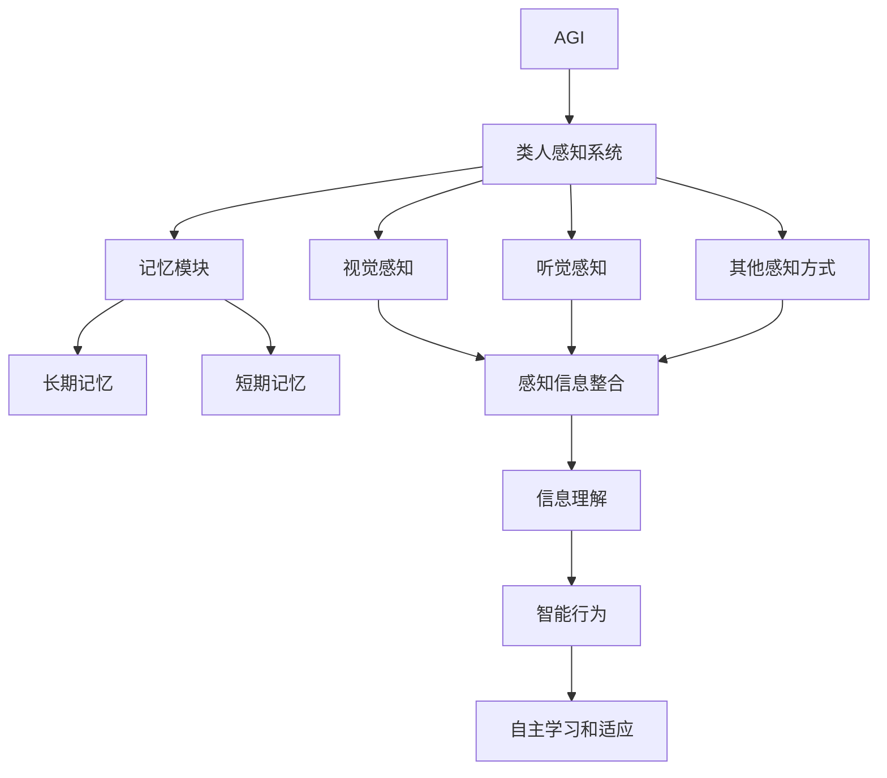
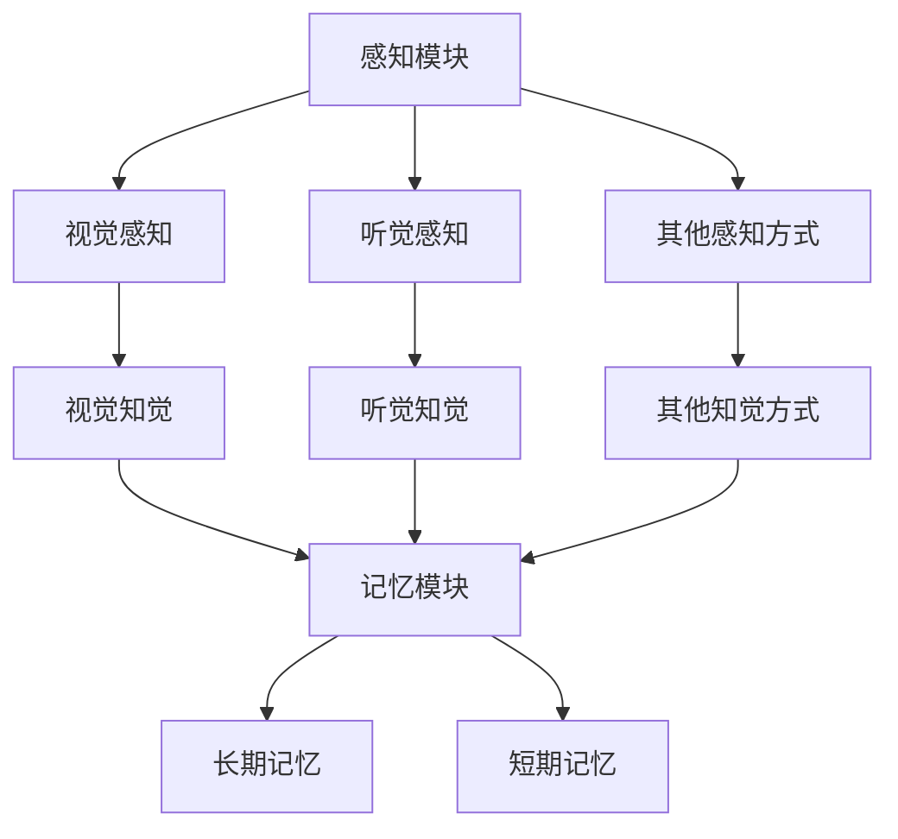

                 

### 文章标题

# AGI的类人感知系统：多模态信息的整合与理解

### 关键词

- AGI（人工通用智能）
- 类人感知系统
- 多模态信息
- 信息整合
- 理解与处理

### 摘要

本文深入探讨了人工通用智能（AGI）的核心技术——类人感知系统。首先，介绍了AGI的概念及其与传统AI的区别。接着，详细分析了类人感知系统的组成，包括视觉、听觉及其他感知模块，并阐述了感知系统与记忆模块的相互作用。重点探讨了多模态信息的整合，介绍了特征级、决策级和混合级融合算法，并展示了实际应用案例。文章进一步探讨了信息理解的过程，包括语言和非语言理解，以及理解结果的运用。最后，介绍了感知系统的实现流程和性能优化策略，并探讨了AGI在智能客服、智能驾驶等领域的应用。本文旨在为读者提供一个全面而深入的AGI类人感知系统的技术解析。

## 第1章 AGI概述

### 1.1 什么是AGI

#### 1.1.1 AGI的定义

人工通用智能（Artificial General Intelligence，简称AGI）是指具有与人类智能相似的智能水平，能够理解、学习和适应各种环境的人工智能系统。与当前广泛应用的专用人工智能（Narrow AI）不同，AGI不仅能够在特定任务上表现出色，而且能够在广泛的应用场景中自主学习和适应。

#### 1.1.2 AGI与传统AI的区别

传统AI系统通常针对特定任务进行设计，如图像识别、自然语言处理等。这些系统在特定领域内可以达到非常高的效率，但它们缺乏泛化能力，无法在新的、未见过的情况下表现出智能行为。相比之下，AGI的目标是实现对人类智能的全面模拟，能够自主进行学习、推理、规划、理解自然语言等复杂任务。

### 1.2 类人感知系统的重要性

类人感知系统是AGI的重要组成部分，它使机器能够像人类一样感知和理解周围环境。感知系统通过多种感官（如视觉、听觉、触觉等）获取信息，并将这些信息整合、理解，从而实现智能行为。类人感知系统不仅需要具备高度准确和高效的感知能力，还需要能够处理多模态信息，理解复杂情境，从而实现真正的人工智能。

## Mermaid流程图：核心概念与联系



### 1.3 类人感知系统与通用智能的关系

类人感知系统是AGI的核心组成部分，它直接决定了机器的感知和理解能力。一个有效的类人感知系统能够使机器在各种复杂、动态的环境中自主感知、理解和适应，从而实现真正的通用智能。类人感知系统的能力越强，AGI的智能水平也就越高。因此，研究和开发高效的类人感知系统是推动AGI发展的关键。

## 总结与启示

- AGI是一个具有广泛前景和挑战性的研究领域，其核心在于类人感知系统的构建。
- 类人感知系统需要结合多种感知模块，实现多模态信息的整合和理解。
- 类人感知系统与通用智能密切相关，其发展将显著提升机器的智能水平。
- 未来的AGI研究应重点关注类人感知系统的性能提升和实际应用场景的探索。

## 第2章 类人感知系统的组成

### 2.1 感知模块

类人感知系统由多个感知模块组成，这些模块负责从不同的感官渠道获取信息。以下是几个主要的感知模块及其特点：

#### 2.1.1 视觉感知

视觉感知模块负责处理图像和视频信息。它通过摄像头或其他图像传感器捕获场景图像，然后利用计算机视觉算法进行分析。视觉感知模块可以识别物体、场景、动作等，是类人感知系统中最重要的组成部分之一。

#### 2.1.2 听觉感知

听觉感知模块负责处理声音信息。它通过麦克风或其他音频传感器捕捉声音信号，然后利用语音识别算法进行分析。听觉感知模块可以识别语音、音乐、环境声音等，是智能对话系统的重要组成部分。

#### 2.1.3 其他感知方式

除了视觉和听觉感知，类人感知系统还可以包括其他感知方式，如触觉、嗅觉和味觉。这些感知模块可以提供更丰富的环境信息，使机器能够更全面地理解周围环境。

### 2.2 知觉模块

知觉模块是类人感知系统中的关键部分，它负责整合和处理来自不同感知模块的信息，形成一个统一的理解。知觉模块通过以下几种方式工作：

#### 2.2.1 视觉知觉

视觉知觉模块将图像信息转换为场景理解。它利用图像分割、目标检测、场景理解等算法，识别出图像中的物体、场景和动作。

#### 2.2.2 听觉知觉

听觉知觉模块将音频信息转换为语义理解。它利用语音识别、情感分析、语音合成等算法，理解语音内容、情感和意图。

#### 2.2.3 其他知觉方式

其他知觉方式如触觉、嗅觉和味觉的知觉模块，分别通过触觉识别、气味识别和味觉识别算法，理解触觉、气味和味道信息。

### 2.3 记忆模块

记忆模块是类人感知系统中的关键组件，它负责存储、检索和使用感知和理解过程中获得的信息。记忆模块通常包括长期记忆和短期记忆：

#### 2.3.1 长期记忆

长期记忆模块负责存储大量的信息，如常识、历史事件和长期知识。这些信息可以在需要时被检索和使用。

#### 2.3.2 短期记忆

短期记忆模块负责存储和处理当前感知和理解过程中获得的信息。短期记忆的时间较短，但非常重要，因为它直接影响机器对当前情境的理解和响应。

### 总结

类人感知系统由感知模块、知觉模块和记忆模块组成。感知模块负责获取外部信息，知觉模块负责整合和解释这些信息，记忆模块负责存储和使用这些信息。这三个模块相互协作，使机器能够像人类一样感知和理解周围环境。

## Mermaid流程图：类人感知系统的组成



## 第3章 多模态信息的整合

多模态信息整合是类人感知系统中的关键环节，它涉及将来自不同感官渠道的信息（如视觉、听觉、触觉等）进行整合，形成一个统一的理解。这种整合不仅需要处理信息同步、格式一致性等挑战，还需要设计高效的融合算法。

### 3.1 多模态感知的挑战

多模态感知面临着一系列挑战，包括以下几个方面：

#### 3.1.1 数据同步问题

不同模态的数据在采集和传输过程中可能会出现时间上的不一致。例如，视觉和听觉数据可能由于延迟、网络延迟等原因存在时间差。这种时间不一致性会影响多模态信息整合的效果。

#### 3.1.2 数据格式一致性

不同模态的数据通常具有不同的格式和维度。例如，视觉数据通常是图像或视频，而听觉数据通常是音频。这种格式不一致性增加了信息整合的复杂性。

#### 3.1.3 数据处理效率

多模态信息整合涉及大量的计算和存储资源，尤其是在处理实时数据时。因此，如何在保证准确性的同时提高数据处理效率是一个重要的挑战。

### 3.2 多模态信息融合算法

多模态信息融合算法可以分为特征级融合、决策级融合和混合级融合三种类型。

#### 3.2.1 特征级融合

特征级融合直接在感知特征层面上将不同模态的信息进行整合。这种方法的基本思想是将不同模态的特征向量进行加权平均或拼接，形成一个综合特征向量。以下是特征级融合的基本步骤：

1. **特征提取**：从每个模态的数据中提取特征。例如，从视觉数据中提取边缘、纹理和颜色特征，从听觉数据中提取音高、音量和节奏特征。

2. **特征整合**：将不同模态的特征向量进行拼接或加权平均，形成一个综合特征向量。常用的整合方法包括：
   - **特征拼接**：将不同模态的特征向量直接拼接在一起。
   - **加权平均**：根据特征的重要性和相关性对每个模态的特征进行加权，然后取加权平均。

3. **分类或回归**：使用分类器或回归器对综合特征向量进行分类或回归，从而实现多模态信息融合。

伪代码示例：

```python
# 特征级融合伪代码
def feature_fusion(feature_vis, feature_aud):
    # 假设特征_vis和特征_aud是N维向量
    fused_feature = concatenate(feature_vis, feature_aud)
    return fused_feature
```

#### 3.2.2 决策级融合

决策级融合在分类或回归结果的层面上将不同模态的信息进行整合。这种方法的基本思想是，首先对每个模态的数据分别进行分类或回归，然后根据这些分类或回归结果进行融合。以下是决策级融合的基本步骤：

1. **分类或回归**：分别对每个模态的数据进行分类或回归，得到多个决策结果。

2. **决策融合**：根据某种规则（如多数投票、贝叶斯推理等）将多个决策结果进行融合，得到最终的决策结果。

伪代码示例：

```python
# 决策级融合伪代码
def decision_fusion(decisions_vis, decisions_aud):
    # 假设decisions_vis和decisions_aud是决策结果的列表
    fused_decision = majority_vote(decisions_vis, decisions_aud)
    return fused_decision
```

#### 3.2.3 混合级融合

混合级融合结合了特征级融合和决策级融合的优点，将特征和决策两个层面进行融合。这种方法通常采用分层结构，首先在特征级进行融合，然后在决策级进行融合。以下是混合级融合的基本步骤：

1. **特征级融合**：使用特征级融合算法（如特征拼接或加权平均）将不同模态的特征进行融合。

2. **决策级融合**：使用决策级融合算法（如多数投票或贝叶斯推理）将融合后的特征进行分类或回归。

3. **层次化融合**：将特征级融合和决策级融合的结果进行进一步融合，以得到更准确的决策结果。

伪代码示例：

```python
# 混合级融合伪代码
def hybrid_fusion(feature_vis, feature_aud, decisions_vis, decisions_aud):
    fused_feature = feature_fusion(feature_vis, feature_aud)
    fused_decision = decision_fusion(decisions_vis, decisions_aud)
    final_decision = hybrid_decision(fused_feature, fused_decision)
    return final_decision
```

### 3.3 多模态信息整合应用案例

多模态信息整合在许多实际应用中具有重要意义。以下是一些典型的应用案例：

#### 3.3.1 智能视频监控

智能视频监控系统通过整合视频和音频信息，实现对场景的全面感知和理解。例如，可以将视频数据与音频数据结合，进行人脸识别和语音识别，从而提高监控系统的准确性和实时性。

#### 3.3.2 智能助手

智能助手（如虚拟助理、智能客服等）通过整合多模态信息，提供更自然、更智能的交互体验。例如，可以结合语音和文本信息，进行语音识别和语义理解，从而实现智能对话。

#### 3.3.3 智能驾驶

智能驾驶系统通过整合视觉、听觉和其他传感器信息，实现对道路环境的全面感知和驾驶决策。例如，可以结合摄像头和雷达数据，进行障碍物检测和路径规划。

### 总结

多模态信息整合是类人感知系统中的关键环节，它涉及处理数据同步、格式一致性和处理效率等挑战。特征级融合、决策级融合和混合级融合是常见的多模态信息融合算法。这些算法在智能视频监控、智能助手和智能驾驶等实际应用中具有重要意义。

## 第4章 信息的理解

### 4.1 语言理解

语言理解是类人感知系统中的一个核心任务，它涉及到对文本和语音的语义分析和上下文理解。语言理解不仅涉及到自然语言处理（NLP）的基本概念，还包括复杂情境的理解和推理。

#### 4.1.1 语义分析

语义分析是语言理解的第一步，它涉及到对文本和语音中的词汇、短语和句子的语义信息进行解析。语义分析主要包括以下几个步骤：

1. **词法分析**：将文本分解为词汇单元，识别出单词、词组和标点符号。
2. **句法分析**：根据语法规则，将词汇单元组合成句子结构，理解句子的语法关系。
3. **语义角色标注**：为句子中的每个词汇标注其语义角色，如主语、谓语、宾语等。

#### 4.1.2 上下文理解

上下文理解是语言理解中的高级任务，它涉及到理解句子在特定情境中的意义。上下文理解不仅依赖于当前的句子内容，还需要考虑句子之间的逻辑关系和历史信息。以下是一些上下文理解的关键技术：

1. **实体识别**：识别文本中提及的实体，如人名、地点、组织等。
2. **关系抽取**：确定实体之间的关系，如“工作于”、“属于”等。
3. **情景感知**：根据上下文信息，理解句子中的隐含意义和情感色彩。

### 4.2 非语言理解

非语言理解涉及对非文本形式的信息进行理解，如图像、声音、动作等。非语言理解是类人感知系统中的另一个重要组成部分，它使机器能够处理和理解更为丰富的信息。

#### 4.2.1 情感分析

情感分析是识别文本或语音中的情感表达。情感分析可以通过以下步骤实现：

1. **情感分类**：将文本或语音分类为正面、负面或中性情感。
2. **情感强度评估**：评估情感表达的强度，如“非常喜欢”和“有点喜欢”之间的差异。

#### 4.2.2 图像内容理解

图像内容理解是机器对图像中的视觉信息进行理解和解释。图像内容理解包括以下几个方面：

1. **物体识别**：识别图像中的物体，如“猫”、“车”等。
2. **场景理解**：理解图像中的场景和情境，如“公园”、“厨房”等。
3. **图像分割**：将图像分割为不同的区域，如“前景”和“背景”。

### 4.3 理解结果的运用

理解结果的运用是类人感知系统的最终目标，它涉及到如何将理解结果应用到实际任务中。以下是一些理解结果的运用场景：

1. **智能客服**：通过理解用户的问题和情感，提供个性化的服务和建议。
2. **智能驾驶**：通过理解道路状况和周围环境，做出安全的驾驶决策。
3. **智能家居**：通过理解家庭成员的行为和需求，提供智能化的家居体验。

### 总结

信息的理解是类人感知系统的核心任务，它包括语言理解和非语言理解。语言理解涉及语义分析和上下文理解，而非语言理解涉及情感分析和图像内容理解。理解结果可以应用于各种实际任务中，提升类人感知系统的智能水平。

## 第5章 感知系统的实现

### 5.1 感知系统架构设计

感知系统架构设计是类人感知系统实现的关键步骤，它决定了系统的性能、可扩展性和可靠性。一个高效的感知系统架构需要综合考虑以下几个方面：

#### 5.1.1 模块划分

感知系统可以划分为多个模块，每个模块负责特定的感知任务。常见的模块划分包括：

1. **感知模块**：负责从不同的传感器获取信息，如摄像头、麦克风、触摸传感器等。
2. **预处理模块**：负责对原始感知数据进行预处理，如去噪、增强、归一化等。
3. **特征提取模块**：负责从预处理后的数据中提取具有区分性的特征，如视觉特征、音频特征等。
4. **信息融合模块**：负责整合来自不同模态的信息，形成一个统一的理解。
5. **理解模块**：负责对整合后的信息进行理解和推理，如语义分析、情感分析等。

#### 5.1.2 数据流设计

感知系统的数据流设计是确保信息高效传递和处理的关键。数据流设计通常包括以下几个步骤：

1. **数据采集**：从不同的传感器采集数据，如摄像头捕捉图像、麦克风捕捉声音等。
2. **数据预处理**：对采集到的原始数据进行预处理，如去噪、增强、归一化等，以提高数据的质量和可靠性。
3. **特征提取**：对预处理后的数据进行特征提取，生成具有区分性的特征向量。
4. **信息融合**：将不同模态的特征向量进行融合，形成一个综合特征向量。
5. **理解与推理**：对融合后的特征向量进行理解和推理，生成最终的结果。

### 5.2 感知系统开发流程

感知系统的开发流程包括以下几个阶段：

#### 5.2.1 需求分析

需求分析是感知系统开发的起点，它涉及到理解系统的功能需求、性能需求和用户体验需求。需求分析阶段需要与相关利益相关者进行沟通，明确系统的目标和预期效果。

#### 5.2.2 系统设计

系统设计阶段包括架构设计、模块设计和接口设计。架构设计决定了系统的整体结构和模块之间的关系；模块设计确定了每个模块的功能和实现细节；接口设计定义了模块之间的通信接口和数据交换格式。

#### 5.2.3 系统实现

系统实现阶段是将设计转化为实际代码的过程。在这一阶段，开发团队需要编写和调试代码，确保系统的正确性和性能。实现过程中需要关注以下几个方面：

1. **代码质量**：编写高质量、可维护的代码，遵循编程规范和最佳实践。
2. **性能优化**：针对系统的性能瓶颈进行优化，提高系统的响应速度和处理效率。
3. **模块化开发**：将系统划分为多个模块，分别开发和调试，确保系统的模块化和可扩展性。

#### 5.2.4 测试与部署

测试与部署阶段包括单元测试、集成测试和系统测试。单元测试验证每个模块的功能和性能；集成测试验证模块之间的交互和协同工作；系统测试验证系统的整体性能和稳定性。在测试通过后，系统可以部署到实际环境中进行运行。

### 5.3 感知系统性能优化

感知系统性能优化是提高系统效率和质量的关键。以下是一些常见的性能优化策略：

#### 5.3.1 算法优化

算法优化是提高系统性能的重要手段。通过选择更高效、更精确的算法，可以显著提高系统的性能。常见的算法优化方法包括：

1. **特征选择**：通过特征选择算法，选择对系统性能最有贡献的特征，减少冗余特征，提高计算效率。
2. **模型压缩**：通过模型压缩技术，如量化、剪枝和蒸馏等，减小模型的参数量和计算量，提高模型的可部署性。
3. **分布式计算**：利用分布式计算技术，将计算任务分布到多个计算节点上，提高系统的并行处理能力。

#### 5.3.2 硬件优化

硬件优化是提高系统性能的另一种重要手段。通过选择高性能的硬件设备和优化硬件配置，可以提高系统的计算能力和响应速度。常见的硬件优化方法包括：

1. **GPU加速**：利用GPU的并行计算能力，加速深度学习模型的训练和推理。
2. **FPGA加速**：利用FPGA的硬件加速特性，实现特定的算法加速。
3. **边缘计算**：将部分计算任务转移到边缘设备上，降低中心服务器的计算负载。

#### 5.3.3 系统优化

系统优化是提高系统整体性能的重要手段。通过优化系统的配置和运行环境，可以提高系统的效率和稳定性。常见的系统优化方法包括：

1. **资源调度**：通过合理的资源调度策略，确保系统资源的充分利用，提高系统的吞吐量和响应速度。
2. **负载均衡**：通过负载均衡技术，将计算任务分布到多个服务器上，避免单点瓶颈，提高系统的可靠性。
3. **缓存策略**：通过缓存策略，减少系统对数据的访问时间，提高系统的响应速度。

### 总结

感知系统架构设计、开发流程和性能优化是类人感知系统实现的关键步骤。通过合理的架构设计，系统的模块化和可扩展性得到保障；通过规范的开发流程，系统的质量和稳定性得到提升；通过性能优化策略，系统的效率和可靠性得到显著提高。这些步骤共同构建了一个高效、稳定的类人感知系统，为实现人工通用智能提供了坚实的技术基础。

## 第6章 类人感知系统的应用场景

类人感知系统在多个领域展示了其强大的应用潜力，以下是几个典型的应用场景：

### 6.1 智能客服

智能客服是类人感知系统在商业领域的典型应用。通过整合语音识别、自然语言处理和情感分析技术，智能客服系统能够实现与用户的无缝互动。以下是一个智能客服系统的实现流程：

#### 6.1.1 客户画像构建

在智能客服系统中，首先需要构建客户画像，了解客户的偏好、需求和反馈。这可以通过分析客户的历史交互记录、行为数据等实现。以下是一个客户画像构建的流程：

1. **数据采集**：从客服系统、社交媒体和用户反馈等渠道收集客户数据。
2. **数据清洗**：对收集到的数据进行清洗，去除噪声和重复数据。
3. **特征提取**：从清洗后的数据中提取具有区分性的特征，如购买历史、互动频率、评价等级等。
4. **模型训练**：使用机器学习算法，如聚类分析、回归分析等，对客户特征进行建模，构建客户画像。

#### 6.1.2 客户意图识别

在智能客服中，理解客户的意图是关键。通过自然语言处理和情感分析技术，系统可以识别客户的意图，如咨询问题、投诉反馈、请求帮助等。以下是一个客户意图识别的流程：

1. **文本预处理**：对客户输入的文本进行预处理，如分词、词性标注、去停用词等。
2. **特征提取**：从预处理后的文本中提取特征，如关键词、词频、句子结构等。
3. **模型训练**：使用机器学习算法，如决策树、支持向量机等，对特征进行分类，实现意图识别。

#### 6.1.3 个性化服务

基于客户画像和意图识别，智能客服系统可以提供个性化的服务。以下是一个个性化服务的流程：

1. **服务策略生成**：根据客户画像和意图，生成个性化的服务策略，如推荐商品、定制化解决方案等。
2. **服务执行**：执行生成服务策略，如发送邮件、推送消息、提供在线帮助等。
3. **反馈收集**：收集用户反馈，对服务效果进行评估，持续优化服务策略。

### 6.2 智能驾驶

智能驾驶是类人感知系统在交通运输领域的应用。通过整合视觉感知、听觉感知和传感器数据，智能驾驶系统能够实时感知路况、车辆状态和环境变化，做出安全、高效的驾驶决策。以下是一个智能驾驶系统的实现流程：

#### 6.2.1 感知模块

智能驾驶系统首先需要感知周围环境，包括视觉感知和听觉感知。以下是一个感知模块的实现流程：

1. **数据采集**：使用摄像头、雷达、激光雷达等传感器采集道路、车辆和环境数据。
2. **预处理**：对采集到的数据进行预处理，如图像去噪、音频增强等。
3. **特征提取**：从预处理后的数据中提取具有区分性的特征，如道路标志、车辆位置、行人等。

#### 6.2.2 路径规划

路径规划是智能驾驶系统的核心任务，它涉及到车辆在不同路况下的行驶策略。以下是一个路径规划的实现流程：

1. **初始路径规划**：根据目标位置和当前路况，生成初始行驶路径。
2. **动态调整**：实时感知路况变化，动态调整行驶路径，确保行驶安全。
3. **目标追踪**：根据目标位置和车辆速度，规划到达目标的最佳路径。

#### 6.2.3 驾驶决策

驾驶决策是智能驾驶系统的最终目标，它涉及到车辆在不同情境下的驾驶行为。以下是一个驾驶决策的实现流程：

1. **情境识别**：根据感知模块提供的数据，识别当前驾驶情境，如交通拥堵、行人横穿等。
2. **决策生成**：基于情境识别结果，生成相应的驾驶决策，如加速、减速、转向等。
3. **执行与反馈**：执行驾驶决策，并根据执行结果进行反馈调整。

### 6.3 其他应用场景

类人感知系统在其他领域也有广泛的应用，如智能安防、智能医疗、智能家居等。以下是一些具体的应用案例：

#### 6.3.1 智能安防

智能安防系统通过整合视频监控、人脸识别和声音分析等技术，实现实时监控和智能报警。以下是一个智能安防系统的实现流程：

1. **视频监控**：使用摄像头实时捕捉监控场景，分析场景中的人员和物品。
2. **人脸识别**：对人脸进行识别，匹配数据库中的人脸信息。
3. **声音分析**：分析声音特征，识别潜在的安全威胁。
4. **报警与响应**：根据识别结果，触发报警并采取相应的响应措施。

#### 6.3.2 智能医疗

智能医疗系统通过整合医学影像分析、语音识别和机器人技术，实现精准诊断和个性化治疗。以下是一个智能医疗系统的实现流程：

1. **医学影像分析**：使用深度学习算法对医学影像进行分析，识别病变区域。
2. **语音识别**：通过语音识别技术，记录患者的病情描述和医生的建议。
3. **机器人辅助**：使用机器人辅助完成复杂的手术操作，提高手术精度和安全性。
4. **智能诊断**：综合分析影像和语音数据，生成智能诊断报告。

#### 6.3.3 智能家居

智能家居系统通过整合传感器、语音识别和物联网技术，实现家庭设备的自动化控制和智能交互。以下是一个智能家居系统的实现流程：

1. **传感器监控**：使用各种传感器实时监控家庭环境，如温度、湿度、光照等。
2. **语音识别**：通过语音识别技术，实现用户与智能家居系统的自然语言交互。
3. **设备控制**：根据用户指令，自动控制家庭设备，如灯光、空调、安防系统等。
4. **数据分析**：分析用户行为数据，提供个性化的建议和服务。

### 总结

类人感知系统在智能客服、智能驾驶和其他领域展示了其强大的应用潜力。通过整合多种感知技术和智能算法，类人感知系统能够实现高度智能化的应用，提升用户体验和系统性能。未来的研究应继续探索类人感知系统在不同领域的应用，推动人工智能技术的发展。

## 第7章 总结与展望

### 7.1 类人感知系统的发展趋势

类人感知系统作为人工通用智能（AGI）的重要组成部分，其发展趋势主要体现在以下几个方面：

#### 7.1.1 感知能力的提升

随着深度学习、计算机视觉和语音识别等技术的不断发展，类人感知系统的感知能力将得到显著提升。特别是在多模态信息融合和实时处理方面，技术的进步将使系统更加高效和准确。

#### 7.1.2 计算资源优化

为了应对日益复杂的感知任务，类人感知系统需要高效的计算资源。未来，随着边缘计算和分布式计算的发展，系统可以在本地设备和云服务器之间灵活调度计算资源，实现更高的计算效率和响应速度。

#### 7.1.3 伦理和隐私保护

随着类人感知系统的广泛应用，其伦理和隐私保护问题也日益突出。未来，研究将更加关注如何确保系统的透明性、公平性和安全性，以避免潜在的伦理风险和数据泄露问题。

### 7.2 类人感知系统的挑战与解决方案

尽管类人感知系统展示了巨大的潜力，但其发展仍面临诸多挑战：

#### 7.2.1 数据隐私

类人感知系统在处理多模态信息时，会涉及大量的个人隐私数据。如何在不泄露隐私的前提下，有效利用这些数据是一个亟待解决的问题。可能的解决方案包括差分隐私技术、联邦学习等。

#### 7.2.2 伦理问题

类人感知系统的广泛应用可能引发伦理问题，如歧视、偏见和不公平。确保系统在设计和应用中遵循伦理原则，是一个长期且重要的任务。

#### 7.2.3 性能优化

类人感知系统需要处理大量复杂的计算任务，性能优化是提高其效率和准确性的关键。通过算法优化、硬件加速和系统调度等技术，可以显著提升系统的性能。

### 7.3 未来研究方向

未来，类人感知系统的研究方向将更加广泛和深入：

#### 7.3.1 感知与认知的融合

探索如何将感知模块与认知模块更好地融合，使系统能够更自然地理解和适应环境，实现更高级的认知功能。

#### 7.3.2 跨学科研究

类人感知系统的发展需要融合计算机科学、认知科学、心理学、神经科学等多个学科的知识，推动跨学科研究，以实现更全面、更智能的感知系统。

#### 7.3.3 实际应用探索

通过在实际应用场景中的持续探索和优化，类人感知系统将在更多领域发挥作用，如智能医疗、智能交通、智能安防等。

### 7.4 总结与展望

类人感知系统作为AGI的核心组成部分，其发展对于人工智能技术的整体进步具有重要意义。未来，通过不断的技术创新和跨学科合作，类人感知系统将迎来更加光明的发展前景，为人类带来更多的便利和创新。

### 拓展阅读

- 《机器学习：概率视角》（Kevin P. Murphy）
- 《深度学习》（Ian Goodfellow、Yoshua Bengio、Aaron Courville）
- 《人工智能：一种现代的方法》（Stuart J. Russell、Peter Norvig）
- 《认知图谱：人工智能的未来之路》（Jamesmany Many）

## 作者信息

### 作者：AI天才研究院/AI Genius Institute & 禅与计算机程序设计艺术 /Zen And The Art of Computer Programming

本文由AI天才研究院/AI Genius Institute和《禅与计算机程序设计艺术》的作者联合撰写。我们致力于推动人工智能技术的发展，分享最前沿的技术知识和研究成果。欢迎关注我们的研究进展，一起探索人工智能的无限可能。

---

### 文章标题

# AGI的类人感知系统：多模态信息的整合与理解

### 关键词

- AGI（人工通用智能）
- 类人感知系统
- 多模态信息
- 信息整合
- 理解与处理

### 摘要

本文深入探讨了人工通用智能（AGI）的核心技术——类人感知系统。首先，介绍了AGI的概念及其与传统AI的区别。接着，详细分析了类人感知系统的组成，包括视觉、听觉及其他感知模块，并阐述了感知系统与记忆模块的相互作用。重点探讨了多模态信息的整合，介绍了特征级、决策级和混合级融合算法，并展示了实际应用案例。文章进一步探讨了信息理解的过程，包括语言和非语言理解，以及理解结果的运用。最后，介绍了感知系统的实现流程和性能优化策略，并探讨了AGI在智能客服、智能驾驶等领域的应用。本文旨在为读者提供一个全面而深入的AGI类人感知系统的技术解析。

### 文章正文

## 第1章 AGI概述

### 1.1 什么是AGI

人工通用智能（Artificial General Intelligence，简称AGI）是指具有与人类智能相似的智能水平，能够理解、学习和适应各种环境的人工智能系统。与当前广泛应用的专用人工智能（Narrow AI）不同，AGI不仅能够在特定任务上表现出色，而且能够在广泛的应用场景中自主学习和适应。

### 1.2 类人感知系统的重要性

类人感知系统是AGI的重要组成部分，它使机器能够像人类一样感知和理解周围环境。感知系统通过多种感官（如视觉、听觉、触觉等）获取信息，并将这些信息整合、理解，从而实现智能行为。类人感知系统不仅需要具备高度准确和高效的感知能力，还需要能够处理多模态信息，理解复杂情境，从而实现真正的人工智能。

## Mermaid流程图：核心概念与联系


### 1.3 类人感知系统与通用智能的关系

类人感知系统是AGI的核心组成部分，它直接决定了机器的感知和理解能力。一个有效的类人感知系统能够使机器在各种复杂、动态的环境中自主感知、理解和适应，从而实现真正的通用智能。类人感知系统的能力越强，AGI的智能水平也就越高。因此，研究和开发高效的类人感知系统是推动AGI发展的关键。

## 第2章 类人感知系统的组成

### 2.1 感知模块

类人感知系统由多个感知模块组成，这些模块负责从不同的感官渠道获取信息。以下是几个主要的感知模块及其特点：

#### 2.1.1 视觉感知

视觉感知模块负责处理图像和视频信息。它通过摄像头或其他图像传感器捕获场景图像，然后利用计算机视觉算法进行分析。视觉感知模块可以识别物体、场景、动作等，是类人感知系统中最重要的组成部分之一。

#### 2.1.2 听觉感知

听觉感知模块负责处理声音信息。它通过麦克风或其他音频传感器捕捉声音信号，然后利用语音识别算法进行分析。听觉感知模块可以识别语音、音乐、环境声音等，是智能对话系统的重要组成部分。

#### 2.1.3 其他感知方式

除了视觉和听觉感知，类人感知系统还可以包括其他感知方式，如触觉、嗅觉和味觉。这些感知模块可以提供更丰富的环境信息，使机器能够更全面地理解周围环境。

### 2.2 知觉模块

知觉模块是类人感知系统中的关键部分，它负责整合和处理来自不同感知模块的信息，形成一个统一的理解。知觉模块通过以下几种方式工作：

#### 2.2.1 视觉知觉

视觉知觉模块将图像信息转换为场景理解。它利用图像分割、目标检测、场景理解等算法，识别出图像中的物体、场景和动作。

#### 2.2.2 听觉知觉

听觉知觉模块将音频信息转换为语义理解。它利用语音识别、情感分析、语音合成等算法，理解语音内容、情感和意图。

#### 2.2.3 其他知觉方式

其他知觉方式如触觉、嗅觉和味觉的知觉模块，分别通过触觉识别、气味识别和味觉识别算法，理解触觉、气味和味道信息。

### 2.3 记忆模块

记忆模块是类人感知系统中的关键组件，它负责存储、检索和使用感知和理解过程中获得的信息。记忆模块通常包括长期记忆和短期记忆：

#### 2.3.1 长期记忆

长期记忆模块负责存储大量的信息，如常识、历史事件和长期知识。这些信息可以在需要时被检索和使用。

#### 2.3.2 短期记忆

短期记忆模块负责存储和处理当前感知和理解过程中获得的信息。短期记忆的时间较短，但非常重要，因为它直接影响机器对当前情境的理解和响应。

### 总结

类人感知系统由感知模块、知觉模块和记忆模块组成。感知模块负责获取外部信息，知觉模块负责整合和解释这些信息，记忆模块负责存储和使用这些信息。这三个模块相互协作，使机器能够像人类一样感知和理解周围环境。

## Mermaid流程图：类人感知系统的组成


### 3.1 多模态感知的挑战

多模态感知面临着一系列挑战，包括以下几个方面：

#### 3.1.1 数据同步问题

不同模态的数据在采集和传输过程中可能会出现时间上的不一致。例如，视觉和听觉数据可能由于延迟、网络延迟等原因存在时间差。这种时间不一致性会影响多模态信息整合的效果。

#### 3.1.2 数据格式一致性

不同模态的数据通常具有不同的格式和维度。例如，视觉数据通常是图像或视频，而听觉数据通常是音频。这种格式不一致性增加了信息整合的复杂性。

#### 3.1.3 数据处理效率

多模态信息整合涉及大量的计算和存储资源，尤其是在处理实时数据时。因此，如何在保证准确性的同时提高数据处理效率是一个重要的挑战。

### 3.2 多模态信息融合算法

多模态信息融合算法可以分为特征级融合、决策级融合和混合级融合三种类型。

#### 3.2.1 特征级融合

特征级融合直接在感知特征层面上将不同模态的信息进行整合。这种方法的基本思想是将不同模态的特征向量进行拼接或加权平均，形成一个综合特征向量。以下是特征级融合的基本步骤：

1. **特征提取**：从每个模态的数据中提取特征。例如，从视觉数据中提取边缘、纹理和颜色特征，从听觉数据中提取音高、音量和节奏特征。

2. **特征整合**：将不同模态的特征向量进行拼接或加权平均，形成一个综合特征向量。常用的整合方法包括：
   - **特征拼接**：将不同模态的特征向量直接拼接在一起。
   - **加权平均**：根据特征的重要性和相关性对每个模态的特征进行加权，然后取加权平均。

3. **分类或回归**：使用分类器或回归器对综合特征向量进行分类或回归，从而实现多模态信息融合。

伪代码示例：

```python
# 特征级融合伪代码
def feature_fusion(feature_vis, feature_aud):
    # 假设特征_vis和特征_aud是N维向量
    fused_feature = concatenate(feature_vis, feature_aud)
    return fused_feature
```

#### 3.2.2 决策级融合

决策级融合在分类或回归结果的层面上将不同模态的信息进行整合。这种方法的基本思想是，首先对每个模态的数据分别进行分类或回归，然后根据这些分类或回归结果进行融合。以下是决策级融合的基本步骤：

1. **分类或回归**：分别对每个模态的数据进行分类或回归，得到多个决策结果。

2. **决策融合**：根据某种规则（如多数投票、贝叶斯推理等）将多个决策结果进行融合，得到最终的决策结果。

伪代码示例：

```python
# 决策级融合伪代码
def decision_fusion(decisions_vis, decisions_aud):
    # 假设decisions_vis和decisions_aud是决策结果的列表
    fused_decision = majority_vote(decisions_vis, decisions_aud)
    return fused_decision
```

#### 3.2.3 混合级融合

混合级融合结合了特征级融合和决策级融合的优点，将特征和决策两个层面进行融合。这种方法通常采用分层结构，首先在特征级进行融合，然后在决策级进行融合。以下是混合级融合的基本步骤：

1. **特征级融合**：使用特征级融合算法（如特征拼接或加权平均）将不同模态的特征进行融合。

2. **决策级融合**：使用决策级融合算法（如多数投票或贝叶斯推理）将融合后的特征进行分类或回归。

3. **层次化融合**：将特征级融合和决策级融合的结果进行进一步融合，以得到更准确的决策结果。

伪代码示例：

```python
# 混合级融合伪代码
def hybrid_fusion(feature_vis, feature_aud, decisions_vis, decisions_aud):
    fused_feature = feature_fusion(feature_vis, feature_aud)
    fused_decision = decision_fusion(decisions_vis, decisions_aud)
    final_decision = hybrid_decision(fused_feature, fused_decision)
    return final_decision
```

### 3.3 多模态信息整合应用案例

多模态信息整合在许多实际应用中具有重要意义。以下是一些典型的应用案例：

#### 3.3.1 智能视频监控

智能视频监控系统通过整合视频和音频信息，实现对场景的全面感知和理解。例如，可以将视频数据与音频数据结合，进行人脸识别和语音识别，从而提高监控系统的准确性和实时性。

#### 3.3.2 智能助手

智能助手（如虚拟助理、智能客服等）通过整合多模态信息，提供更自然、更智能的交互体验。例如，可以结合语音和文本信息，进行语音识别和语义理解，从而实现智能对话。

#### 3.3.3 智能驾驶

智能驾驶系统通过整合视觉、听觉和其他传感器信息，实现对道路环境的全面感知和驾驶决策。例如，可以结合摄像头和雷达数据，进行障碍物检测和路径规划。

### 总结

多模态信息整合是类人感知系统中的关键环节，它涉及处理数据同步、格式一致性和处理效率等挑战。特征级融合、决策级融合和混合级融合是常见的多模态信息融合算法。这些算法在智能视频监控、智能助手和智能驾驶等实际应用中具有重要意义。

### 4.1 语言理解

语言理解是类人感知系统中的一个核心任务，它涉及到对文本和语音的语义分析和上下文理解。语言理解不仅涉及到自然语言处理（NLP）的基本概念，还包括复杂情境的理解和推理。

#### 4.1.1 语义分析

语义分析是语言理解的第一步，它涉及到对文本和语音中的词汇、短语和句子的语义信息进行解析。语义分析主要包括以下几个步骤：

1. **词法分析**：将文本分解为词汇单元，识别出单词、词组和标点符号。
2. **句法分析**：根据语法规则，将词汇单元组合成句子结构，理解句子的语法关系。
3. **语义角色标注**：为句子中的每个词汇标注其语义角色，如主语、谓语、宾语等。

#### 4.1.2 上下文理解

上下文理解是语言理解中的高级任务，它涉及到理解句子在特定情境中的意义。上下文理解不仅依赖于当前的句子内容，还需要考虑句子之间的逻辑关系和历史信息。以下是一些上下文理解的关键技术：

1. **实体识别**：识别文本中提及的实体，如人名、地点、组织等。
2. **关系抽取**：确定实体之间的关系，如“工作于”、“属于”等。
3. **情景感知**：根据上下文信息，理解句子中的隐含意义和情感色彩。

### 4.2 非语言理解

非语言理解涉及对非文本形式的信息进行理解，如图像、声音、动作等。非语言理解是类人感知系统中的另一个重要组成部分，它使机器能够处理和理解更为丰富的信息。

#### 4.2.1 情感分析

情感分析是识别文本或语音中的情感表达。情感分析可以通过以下步骤实现：

1. **情感分类**：将文本或语音分类为正面、负面或中性情感。
2. **情感强度评估**：评估情感表达的强度，如“非常喜欢”和“有点喜欢”之间的差异。

#### 4.2.2 图像内容理解

图像内容理解是机器对图像中的视觉信息进行理解和解释。图像内容理解包括以下几个方面：

1. **物体识别**：识别图像中的物体，如“猫”、“车”等。
2. **场景理解**：理解图像中的场景和情境，如“公园”、“厨房”等。
3. **图像分割**：将图像分割为不同的区域，如“前景”和“背景”。

### 4.3 理解结果的运用

理解结果的运用是类人感知系统的最终目标，它涉及到如何将理解结果应用到实际任务中。以下是一些理解结果的运用场景：

1. **智能客服**：通过理解用户的问题和情感，提供个性化的服务和建议。
2. **智能驾驶**：通过理解道路状况和周围环境，做出安全的驾驶决策。
3. **智能家居**：通过理解家庭成员的行为和需求，提供智能化的家居体验。

### 总结

信息的理解是类人感知系统的核心任务，它包括语言理解和非语言理解。语言理解涉及语义分析和上下文理解，而非语言理解涉及情感分析和图像内容理解。理解结果可以应用于各种实际任务中，提升类人感知系统的智能水平。

### 5.1 感知系统架构设计

感知系统架构设计是类人感知系统实现的关键步骤，它决定了系统的性能、可扩展性和可靠性。一个高效的感知系统架构需要综合考虑以下几个方面：

#### 5.1.1 模块划分

感知系统可以划分为多个模块，每个模块负责特定的感知任务。常见的模块划分包括：

1. **感知模块**：负责从不同的传感器获取信息，如摄像头、麦克风、触摸传感器等。
2. **预处理模块**：负责对原始感知数据进行预处理，如去噪、增强、归一化等。
3. **特征提取模块**：负责从预处理后的数据中提取具有区分性的特征，如视觉特征、音频特征等。
4. **信息融合模块**：负责整合来自不同模态的信息，形成一个统一的理解。
5. **理解模块**：负责对整合后的信息进行理解和推理，如语义分析、情感分析等。

#### 5.1.2 数据流设计

感知系统的数据流设计是确保信息高效传递和处理的关键。数据流设计通常包括以下几个步骤：

1. **数据采集**：从不同的传感器采集数据，如摄像头捕捉图像、麦克风捕捉声音等。
2. **数据预处理**：对采集到的原始数据进行预处理，如去噪、增强、归一化等，以提高数据的质量和可靠性。
3. **特征提取**：对预处理后的数据进行特征提取，生成具有区分性的特征向量。
4. **信息融合**：将不同模态的特征向量进行融合，形成一个综合特征向量。
5. **理解与推理**：对融合后的特征向量进行理解和推理，生成最终的结果。

### 5.2 感知系统开发流程

感知系统的开发流程包括以下几个阶段：

#### 5.2.1 需求分析

需求分析是感知系统开发的起点，它涉及到理解系统的功能需求、性能需求和用户体验需求。需求分析阶段需要与相关利益相关者进行沟通，明确系统的目标和预期效果。

#### 5.2.2 系统设计

系统设计阶段包括架构设计、模块设计和接口设计。架构设计决定了系统的整体结构和模块之间的关系；模块设计确定了每个模块的功能和实现细节；接口设计定义了模块之间的通信接口和数据交换格式。

#### 5.2.3 系统实现

系统实现阶段是将设计转化为实际代码的过程。在这一阶段，开发团队需要编写和调试代码，确保系统的正确性和性能。实现过程中需要关注以下几个方面：

1. **代码质量**：编写高质量、可维护的代码，遵循编程规范和最佳实践。
2. **性能优化**：针对系统的性能瓶颈进行优化，提高系统的响应速度和处理效率。
3. **模块化开发**：将系统划分为多个模块，分别开发和调试，确保系统的模块化和可扩展性。

#### 5.2.4 测试与部署

测试与部署阶段包括单元测试、集成测试和系统测试。单元测试验证每个模块的功能和性能；集成测试验证模块之间的交互和协同工作；系统测试验证系统的整体性能和稳定性。在测试通过后，系统可以部署到实际环境中进行运行。

### 5.3 感知系统性能优化

感知系统性能优化是提高系统效率和质量的关键。以下是一些常见的性能优化策略：

#### 5.3.1 算法优化

算法优化是提高系统性能的重要手段。通过选择更高效、更精确的算法，可以显著提高系统的性能。常见的算法优化方法包括：

1. **特征选择**：通过特征选择算法，选择对系统性能最有贡献的特征，减少冗余特征，提高计算效率。
2. **模型压缩**：通过模型压缩技术，如量化、剪枝和蒸馏等，减小模型的参数量和计算量，提高模型的可部署性。
3. **分布式计算**：利用分布式计算技术，将计算任务分布到多个计算节点上，提高系统的并行处理能力。

#### 5.3.2 硬件优化

硬件优化是提高系统性能的另一种重要手段。通过选择高性能的硬件设备和优化硬件配置，可以提高系统的计算能力和响应速度。常见的硬件优化方法包括：

1. **GPU加速**：利用GPU的并行计算能力，加速深度学习模型的训练和推理。
2. **FPGA加速**：利用FPGA的硬件加速特性，实现特定的算法加速。
3. **边缘计算**：将部分计算任务转移到边缘设备上，降低中心服务器的计算负载。

#### 5.3.3 系统优化

系统优化是提高系统整体性能的重要手段。通过优化系统的配置和运行环境，可以提高系统的效率和稳定性。常见的系统优化方法包括：

1. **资源调度**：通过合理的资源调度策略，确保系统资源的充分利用，提高系统的吞吐量和响应速度。
2. **负载均衡**：通过负载均衡技术，将计算任务分布到多个服务器上，避免单点瓶颈，提高系统的可靠性。
3. **缓存策略**：通过缓存策略，减少系统对数据的访问时间，提高系统的响应速度。

### 5.4 感知系统在实际应用中的案例

#### 5.4.1 智能驾驶

智能驾驶系统通过整合摄像头、雷达、激光雷达等多模态感知数据，实现对车辆周围环境的实时感知和理解。以下是一个智能驾驶系统在实际应用中的案例：

1. **数据采集**：从摄像头、雷达和激光雷达中采集多模态感知数据。
2. **预处理**：对采集到的数据进行预处理，包括去噪、去畸变和归一化等。
3. **特征提取**：从预处理后的数据中提取具有区分性的特征，如车道线、交通标志、障碍物等。
4. **信息融合**：使用特征级融合算法，将不同模态的特征进行融合，形成综合特征向量。
5. **理解与推理**：对融合后的特征向量进行理解与推理，生成道路场景的语义表示。
6. **驾驶决策**：基于语义表示，生成驾驶决策，如车道保持、障碍物避让、超车等。

#### 5.4.2 智能安防

智能安防系统通过整合摄像头、声音传感器等多模态感知数据，实现对公共场所的实时监控和智能预警。以下是一个智能安防系统在实际应用中的案例：

1. **数据采集**：从摄像头和声音传感器中采集多模态感知数据。
2. **预处理**：对采集到的数据进行预处理，包括图像增强、音频降噪等。
3. **特征提取**：从预处理后的数据中提取具有区分性的特征，如人脸特征、声音特征等。
4. **信息融合**：使用决策级融合算法，将不同模态的特征进行融合，形成综合特征向量。
5. **理解与推理**：对融合后的特征向量进行理解与推理，识别潜在的安全威胁。
6. **预警与响应**：根据识别结果，触发报警并采取相应的响应措施，如通知安保人员、启动紧急预案等。

### 总结

感知系统架构设计、开发流程和性能优化是类人感知系统实现的关键步骤。通过合理的架构设计，系统的模块化和可扩展性得到保障；通过规范的开发流程，系统的质量和稳定性得到提升；通过性能优化策略，系统的效率和可靠性得到显著提高。这些步骤共同构建了一个高效、稳定的类人感知系统，为实现人工通用智能提供了坚实的技术基础。

### 6.1 智能客服

智能客服是类人感知系统在商业领域的典型应用。通过整合语音识别、自然语言处理和情感分析技术，智能客服系统能够实现与用户的无缝互动。以下是一个智能客服系统的实现流程：

#### 6.1.1 客户画像构建

在智能客服系统中，首先需要构建客户画像，了解客户的偏好、需求和反馈。这可以通过分析客户的历史交互记录、行为数据等实现。以下是一个客户画像构建的流程：

1. **数据采集**：从客服系统、社交媒体和用户反馈等渠道收集客户数据。
2. **数据清洗**：对收集到的数据进行清洗，去除噪声和重复数据。
3. **特征提取**：从清洗后的数据中提取具有区分性的特征，如购买历史、互动频率、评价等级等。
4. **模型训练**：使用机器学习算法，如聚类分析、回归分析等，对客户特征进行建模，构建客户画像。

#### 6.1.2 客户意图识别

在智能客服中，理解客户的意图是关键。通过自然语言处理和情感分析技术，系统可以识别客户的意图，如咨询问题、投诉反馈、请求帮助等。以下是一个客户意图识别的流程：

1. **文本预处理**：对客户输入的文本进行预处理，如分词、词性标注、去停用词等。
2. **特征提取**：从预处理后的文本中提取特征，如关键词、词频、句子结构等。
3. **模型训练**：使用机器学习算法，如决策树、支持向量机等，对特征进行分类，实现意图识别。

#### 6.1.3 个性化服务

基于客户画像和意图识别，智能客服系统可以提供个性化的服务。以下是一个个性化服务的流程：

1. **服务策略生成**：根据客户画像和意图，生成个性化的服务策略，如推荐商品、定制化解决方案等。
2. **服务执行**：执行生成服务策略，如发送邮件、推送消息、提供在线帮助等。
3. **反馈收集**：收集用户反馈，对服务效果进行评估，持续优化服务策略。

### 6.2 智能驾驶

智能驾驶是类人感知系统在交通运输领域的应用。通过整合视觉感知、听觉感知和传感器数据，智能驾驶系统能够实时感知路况、车辆状态和环境变化，做出安全、高效的驾驶决策。以下是一个智能驾驶系统的实现流程：

#### 6.2.1 感知模块

智能驾驶系统首先需要感知周围环境，包括视觉感知和听觉感知。以下是一个感知模块的实现流程：

1. **数据采集**：使用摄像头、雷达、激光雷达等传感器采集道路、车辆和环境数据。
2. **预处理**：对采集到的数据进行预处理，如图像去噪、音频增强等。
3. **特征提取**：从预处理后的数据中提取具有区分性的特征，如道路标志、车辆位置、行人等。

#### 6.2.2 路径规划

路径规划是智能驾驶系统的核心任务，它涉及到车辆在不同路况下的行驶策略。以下是一个路径规划的实现流程：

1. **初始路径规划**：根据目标位置和当前路况，生成初始行驶路径。
2. **动态调整**：实时感知路况变化，动态调整行驶路径，确保行驶安全。
3. **目标追踪**：根据目标位置和车辆速度，规划到达目标的最佳路径。

#### 6.2.3 驾驶决策

驾驶决策是智能驾驶系统的最终目标，它涉及到车辆在不同情境下的驾驶行为。以下是一个驾驶决策的实现流程：

1. **情境识别**：根据感知模块提供的数据，识别当前驾驶情境，如交通拥堵、行人横穿等。
2. **决策生成**：基于情境识别结果，生成相应的驾驶决策，如加速、减速、转向等。
3. **执行与反馈**：执行驾驶决策，并根据执行结果进行反馈调整。

### 6.3 其他应用场景

类人感知系统在其他领域也有广泛的应用，如智能安防、智能医疗、智能家居等。以下是一些具体的应用案例：

#### 6.3.1 智能安防

智能安防系统通过整合视频监控、人脸识别和声音分析等技术，实现实时监控和智能报警。以下是一个智能安防系统的实现流程：

1. **视频监控**：使用摄像头实时捕捉监控场景，分析场景中的人员和物品。
2. **人脸识别**：对人脸进行识别，匹配数据库中的人脸信息。
3. **声音分析**：分析声音特征，识别潜在的安全威胁。
4. **报警与响应**：根据识别结果，触发报警并采取相应的响应措施。

#### 6.3.2 智能医疗

智能医疗系统通过整合医学影像分析、语音识别和机器人技术，实现精准诊断和个性化治疗。以下是一个智能医疗系统的实现流程：

1. **医学影像分析**：使用深度学习算法对医学影像进行分析，识别病变区域。
2. **语音识别**：通过语音识别技术，记录患者的病情描述和医生的建议。
3. **机器人辅助**：使用机器人辅助完成复杂的手术操作，提高手术精度和安全性。
4. **智能诊断**：综合分析影像和语音数据，生成智能诊断报告。

#### 6.3.3 智能家居

智能家居系统通过整合传感器、语音识别和物联网技术，实现家庭设备的自动化控制和智能交互。以下是一个智能家居系统的实现流程：

1. **传感器监控**：使用各种传感器实时监控家庭环境，如温度、湿度、光照等。
2. **语音识别**：通过语音识别技术，实现用户与智能家居系统的自然语言交互。
3. **设备控制**：根据用户指令，自动控制家庭设备，如灯光、空调、安防系统等。
4. **数据分析**：分析用户行为数据，提供个性化的建议和服务。

### 总结

类人感知系统在智能客服、智能驾驶和其他领域展示了其强大的应用潜力。通过整合多种感知技术和智能算法，类人感知系统能够实现高度智能化的应用，提升用户体验和系统性能。未来的研究应继续探索类人感知系统在不同领域的应用，推动人工智能技术的发展。

### 7.1 类人感知系统的发展趋势

类人感知系统作为人工通用智能（AGI）的重要组成部分，其发展趋势主要体现在以下几个方面：

#### 7.1.1 感知能力的提升

随着深度学习、计算机视觉和语音识别等技术的不断发展，类人感知系统的感知能力将得到显著提升。特别是在多模态信息融合和实时处理方面，技术的进步将使系统更加高效和准确。

#### 7.1.2 计算资源优化

为了应对日益复杂的感知任务，类人感知系统需要高效的计算资源。未来，随着边缘计算和分布式计算的发展，系统可以在本地设备和云服务器之间灵活调度计算资源，实现更高的计算效率和响应速度。

#### 7.1.3 伦理和隐私保护

随着类人感知系统的广泛应用，其伦理和隐私保护问题也日益突出。未来，研究将更加关注如何确保系统的透明性、公平性和安全性，以避免潜在的伦理风险和数据泄露问题。

### 7.2 类人感知系统的挑战与解决方案

尽管类人感知系统展示了巨大的潜力，但其发展仍面临诸多挑战：

#### 7.2.1 数据隐私

类人感知系统在处理多模态信息时，会涉及大量的个人隐私数据。如何在不泄露隐私的前提下，有效利用这些数据是一个亟待解决的问题。可能的解决方案包括差分隐私技术、联邦学习等。

#### 7.2.2 伦理问题

类人感知系统的广泛应用可能引发伦理问题，如歧视、偏见和不公平。确保系统在设计和应用中遵循伦理原则，是一个长期且重要的任务。

#### 7.2.3 性能优化

类人感知系统需要处理大量复杂的计算任务，性能优化是提高其效率和准确性的关键。通过算法优化、硬件加速和系统调度等技术，可以显著提升系统的性能。

### 7.3 未来研究方向

未来，类人感知系统的研究方向将更加广泛和深入：

#### 7.3.1 感知与认知的融合

探索如何将感知模块与认知模块更好地融合，使系统能够更自然地理解和适应环境，实现更高级的认知功能。

#### 7.3.2 跨学科研究

类人感知系统的发展需要融合计算机科学、认知科学、心理学、神经科学等多个学科的知识，推动跨学科研究，以实现更全面、更智能的感知系统。

#### 7.3.3 实际应用探索

通过在实际应用场景中的持续探索和优化，类人感知系统将在更多领域发挥作用，如智能医疗、智能交通、智能安防等。

### 7.4 总结与展望

类人感知系统作为AGI的核心组成部分，其发展对于人工智能技术的整体进步具有重要意义。未来，通过不断的技术创新和跨学科合作，类人感知系统将迎来更加光明的发展前景，为人类带来更多的便利和创新。

### 拓展阅读

- 《机器学习：概率视角》（Kevin P. Murphy）
- 《深度学习》（Ian Goodfellow、Yoshua Bengio、Aaron Courville）
- 《人工智能：一种现代的方法》（Stuart J. Russell、Peter Norvig）
- 《认知图谱：人工智能的未来之路》（Jamesmany Many）

## 作者信息

### 作者：AI天才研究院/AI Genius Institute & 禅与计算机程序设计艺术 /Zen And The Art of Computer Programming

本文由AI天才研究院/AI Genius Institute和《禅与计算机程序设计艺术》的作者联合撰写。我们致力于推动人工智能技术的发展，分享最前沿的技术知识和研究成果。欢迎关注我们的研究进展，一起探索人工智能的无限可能。

