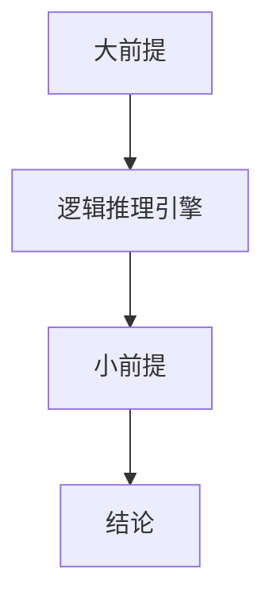
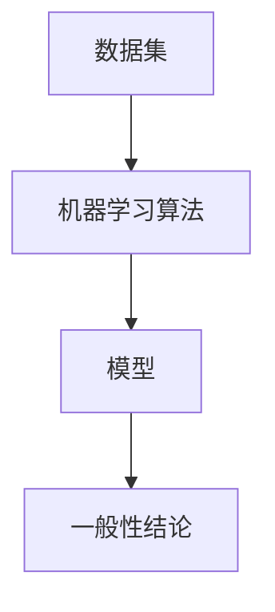
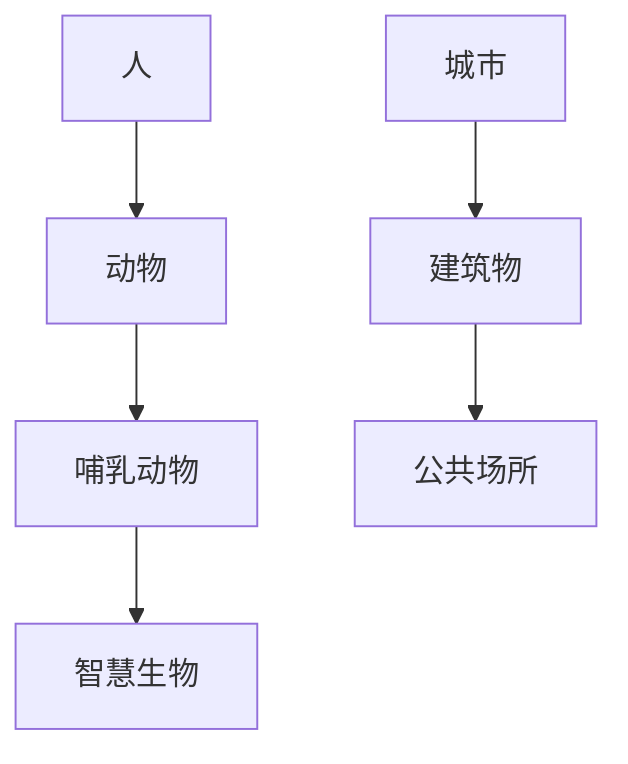
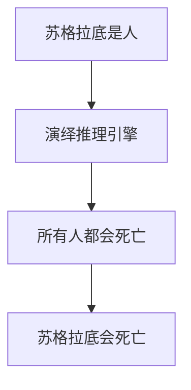
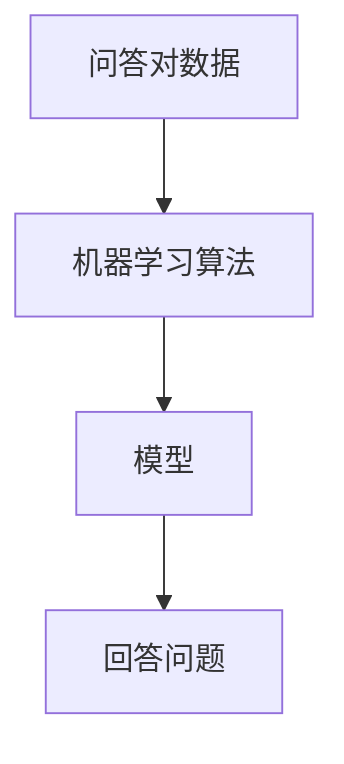
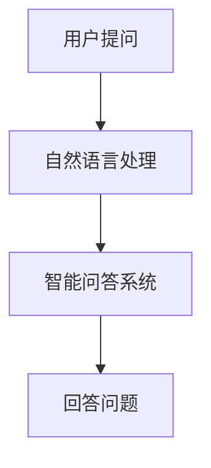

                 


### 文章标题

AGI的类人推理能力：演绎与归纳

> 关键词：类人推理，人工通用智能，演绎推理，归纳推理，知识表示，推理引擎，学习算法

> 摘要：本文将深入探讨人工通用智能（AGI）的类人推理能力，分析演绎推理与归纳推理在AGI中的应用，并构建类人推理能力的整体架构。通过详细阐述知识表示、推理引擎、学习算法和交互系统的协同作用，本文为AGI的发展提供了一条清晰的路径。

## 引言

人工智能（AI）作为计算机科学的前沿领域，一直以来都是研究者和开发者关注的焦点。从最初的规则推理系统到如今深度学习的崛起，人工智能经历了多次重大的变革。然而，人工通用智能（Artificial General Intelligence, AGI）的发展依然面临诸多挑战。

AGI的目标是构建具有类人智能的人工智能系统，即能够像人类一样进行推理、学习、解决问题和自主决策。类人推理能力是实现AGI的关键，它包括演绎推理和归纳推理两个方面。本文将围绕这两个核心概念，分析类人推理能力在AGI中的应用与发展。

### 1.1.1 AGI的背景与发展

#### 1.1.1.1 人工智能的起源

人工智能（Artificial Intelligence, AI）一词最早由计算机科学家约翰·麦卡锡（John McCarthy）在1956年提出。当时，人工智能被定义为“制造智能机器的科学”。这一概念激发了全球范围内的研究热潮，也标志着人工智能学科的正式诞生。

#### 1.1.1.2 AGI的概念

类人推理能力（Artificial General Intelligence, AGI）是指人工智能系统具备与人类相似的认知能力，包括语言理解、问题解决、常识推理、自主学习和自适应能力。与目前广泛应用的窄AI（Narrow AI）相比，AGI具有更广泛的智能能力和更高的智能水平。

#### 1.1.1.3 AGI的发展历程

自人工智能概念提出以来，研究人员在多个领域进行了探索。20世纪80年代，专家系统取得了一定成果，但受限于知识表示和推理能力。进入21世纪，随着深度学习和大数据技术的发展，人工智能进入新的发展阶段。目前，类人推理能力的研究主要集中在强化学习、自然语言处理、计算机视觉等领域。

#### 1.1.1.4 当前AGI研究现状

尽管AGI尚未实现，但一些研究机构和企业已经取得了一定的成果。例如，谷歌的AlphaGo在围棋领域取得了重大突破，微软的小冰在自然语言处理方面表现出色。这些成果为AGI的发展提供了有益的启示。

### 1.1.2 类人推理能力的主要组成部分

类人推理能力包括演绎推理和归纳推理两个方面。

#### 1.1.2.1 演绎推理

演绎推理是从一般到个别的推理过程。其基本形式是“三段论”，即“大前提”、“小前提”和“结论”。例如，大前提：“所有人都会死亡”，小前提：“苏格拉底是人”，结论：“苏格拉底会死亡”。

#### 1.1.2.2 归纳推理

归纳推理是从个别到一般的推理过程。其基本形式是“类比推理”和“归纳推理”。例如，通过观察多个苹果从树上掉下来，我们归纳出“所有物体都会受到重力作用”。

#### 1.1.2.3 演绎推理与归纳推理的关系

演绎推理和归纳推理是相互补充的。演绎推理基于已有知识进行推理，而归纳推理则通过观察和实验来发现新的知识。在类人推理能力中，两者共同作用，使得人工智能系统能够更好地理解和处理复杂问题。

### 1.1.3 演绎与归纳在AGI中的应用

在类人推理能力的发展过程中，演绎推理和归纳推理具有重要作用。

#### 1.1.3.1 演绎推理的应用

演绎推理在逻辑推理、数学证明、法律判断等领域具有广泛应用。例如，在数学证明中，演绎推理可以帮助我们推导出新的定理。

#### 1.1.3.2 归纳推理的应用

归纳推理在机器学习、数据挖掘、自然语言处理等领域具有重要作用。例如，在机器学习中，通过观察大量数据，我们可以归纳出新的模型和算法。

#### 1.1.3.3 演绎与归纳在AGI中的融合

为了实现类人推理能力，我们需要将演绎推理和归纳推理结合起来。例如，在自然语言处理中，我们可以使用演绎推理来处理语言逻辑结构，同时使用归纳推理来学习语言模式。

### 1.1.4 AGI的类人推理能力架构

类人推理能力的实现需要构建一个复杂的架构，包括知识表示、推理引擎、学习算法和交互系统等方面。

### 1.1.4.1 知识表示

知识表示是类人推理能力的基础。它包括符号表示、语义网络、本体论等多种方法。符号表示使用符号和逻辑公式来表示知识，语义网络使用节点和边来表示实体及其关系，本体论则通过概念和关系来描述知识体系。

### 1.1.4.2 推理引擎

推理引擎是实现类人推理能力的关键。它包括演绎推理和归纳推理两种模式。演绎推理引擎通过演绎推理规则来推导新的知识，而归纳推理引擎则通过归纳推理方法来发现新的知识。

### 1.1.4.3 学习算法

学习算法是类人推理能力的重要组成部分。它包括监督学习、无监督学习和强化学习等多种方法。监督学习通过已知的输入和输出数据来训练模型，无监督学习通过未标记的数据来发现数据模式，强化学习则通过奖励机制来指导模型的学习过程。

### 1.1.4.4 交互系统

交互系统是实现类人推理能力的另一个关键因素。它包括自然语言处理、语音识别、图像识别等多种技术。这些技术使得人工智能系统能够与人类进行自然、高效的交互。

### 1.1.5 知识表示、推理引擎、学习算法和交互系统的协同作用

知识表示、推理引擎、学习算法和交互系统共同构成了类人推理能力的架构。它们相互协作，使得人工智能系统能够具备更强大的推理能力。

### 1.1.6 演绎与归纳推理在AGI中的实现

在类人推理能力的实现过程中，演绎推理和归纳推理具有关键作用。

#### 1.1.6.1 演绎推理的实现

演绎推理的实现主要依赖于逻辑推理引擎。逻辑推理引擎使用逻辑规则和事实进行推理，从而得出新的结论。以下是一个简单的演绎推理的伪代码实现：

```python
# 大前提
premise_1 = "所有人都会死亡"

# 小前提
premise_2 = "苏格拉底是人"

# 结论
conclusion = "苏格拉底会死亡"

# 演绎推理
if premise_1 and premise_2:
    conclusion = "苏格拉底会死亡"
```

#### 1.1.6.2 归纳推理的实现

归纳推理的实现主要依赖于机器学习算法。通过训练模型，从大量数据中归纳出新的知识。以下是一个简单的归纳推理的伪代码实现：

```python
# 数据集
data = [("苹果从树上掉下来", "物体受到重力作用"), ("石头从山上掉下来", "物体受到重力作用"), ...]

# 归纳推理
def find_common_pattern(data):
    patterns = []
    for item in data:
        patterns.append(item[1])
    common_pattern = max(set(patterns), key=patterns.count)
    return common_pattern

common_pattern = find_common_pattern(data)
print("所有物体都会受到重力作用")
```

### 1.2 AGI的类人推理能力架构

类人推理能力的实现需要构建一个复杂的架构，包括知识表示、推理引擎、学习算法和交互系统等方面。

#### 1.2.1 知识表示

知识表示是类人推理能力的基础。它包括符号表示、语义网络、本体论等多种方法。

- **符号表示**：使用符号和逻辑公式来表示知识。例如，使用命题逻辑和谓词逻辑来描述知识。
- **语义网络**：使用节点和边来表示实体及其关系。例如，在语义网络中，可以表示“人”与“动物”的关系。
- **本体论**：通过概念和关系来描述知识体系。例如，在本体论中，可以定义“人类”和“动物”的概念，并描述它们之间的关系。

#### 1.2.2 推理引擎

推理引擎是实现类人推理能力的关键。它包括演绎推理和归纳推理两种模式。

- **演绎推理引擎**：通过演绎推理规则来推导新的知识。例如，从大前提和小前提中推导出结论。
- **归纳推理引擎**：通过归纳推理方法来发现新的知识。例如，从数据中归纳出新的模式或规律。

#### 1.2.3 学习算法

学习算法是类人推理能力的重要组成部分。它包括监督学习、无监督学习和强化学习等多种方法。

- **监督学习**：通过已知的输入和输出数据来训练模型。例如，在分类问题中，使用已标记的数据来训练分类器。
- **无监督学习**：通过未标记的数据来发现数据模式。例如，在聚类问题中，使用未标记的数据来发现聚类中心。
- **强化学习**：通过奖励机制来指导模型的学习过程。例如，在游戏问题中，使用奖励机制来指导智能体进行游戏。

#### 1.2.4 交互系统

交互系统是实现类人推理能力的另一个关键因素。它包括自然语言处理、语音识别、图像识别等多种技术。

- **自然语言处理**：使人工智能系统能够理解和处理自然语言。例如，通过自然语言处理，可以使得人工智能系统能够回答用户的问题。
- **语音识别**：使人工智能系统能够识别和理解语音。例如，通过语音识别，可以使得人工智能系统能够听取用户的指令。
- **图像识别**：使人工智能系统能够识别和理解图像。例如，通过图像识别，可以使得人工智能系统能够识别出图像中的物体。

### 1.2.5 知识表示、推理引擎、学习算法和交互系统的协同作用

知识表示、推理引擎、学习算法和交互系统共同构成了类人推理能力的架构。它们相互协作，使得人工智能系统能够具备更强大的推理能力。

- **知识表示**：提供了类人推理能力的基础。
- **推理引擎**：实现了类人推理的核心功能。
- **学习算法**：使类人推理能力能够不断进化。
- **交互系统**：使类人推理能力能够与人类进行有效交互。

通过这些模块的协同作用，类人推理能力得以实现。例如，在一个智能客服系统中，知识表示模块可以提供产品信息，推理引擎可以回答用户的问题，学习算法可以不断优化客服系统的回答质量，交互系统可以使得客服系统能够与用户进行有效的沟通。

### 1.3 演绎与归纳推理在AGI中的实现

在类人推理能力的实现过程中，演绎推理和归纳推理具有关键作用。下面我们将详细探讨这两种推理方法在AGI中的具体实现。

#### 1.3.1 演绎推理的实现

演绎推理是一种从一般到个别的推理方法。在AGI中，演绎推理主要通过逻辑推理引擎来实现。逻辑推理引擎使用一组逻辑规则和已知的事实来推导出新的结论。以下是一个简单的演绎推理实现示例：



在这个示例中，大前提“A”表示“所有人都会死亡”，小前提“C”表示“苏格拉底是人”，结论“D”是“苏格拉底会死亡”。逻辑推理引擎根据大前提和小前提，通过逻辑推理规则得出结论。

#### 1.3.2 归纳推理的实现

归纳推理是一种从个别到一般的推理方法。在AGI中，归纳推理主要通过机器学习算法来实现。归纳推理的核心是学习算法，它通过分析大量数据，从中发现规律和模式，从而归纳出一般性的结论。以下是一个简单的归纳推理实现示例：



在这个示例中，数据集“A”包含多个实例，每个实例都包含输入和输出。机器学习算法通过分析这些数据，学习到输入和输出之间的关系，从而归纳出一般性的结论。例如，通过观察多个苹果从树上掉下来，机器学习算法可以归纳出“所有物体都会受到重力作用”这一结论。

### 1.4 AGI类人推理能力架构的实例分析

为了更好地理解AGI类人推理能力的架构，我们可以通过一个具体的实例来分析。以下是一个基于自然语言处理的智能问答系统的实例。

#### 1.4.1 知识表示

在这个实例中，知识表示使用了本体论的方法。本体论通过定义概念和关系来描述知识体系。例如，我们定义了“人”、“动物”、“城市”等概念，并描述了它们之间的关系。以下是一个简单的本体论表示：



#### 1.4.2 推理引擎

在这个实例中，推理引擎使用了演绎推理方法。演绎推理引擎通过逻辑规则和已知的事实来推导出新的结论。例如，如果我们知道“苏格拉底是人”和“所有人都会死亡”，那么我们可以通过演绎推理得出“苏格拉底会死亡”这一结论。



#### 1.4.3 学习算法

在这个实例中，学习算法使用了机器学习方法。机器学习算法通过分析大量的问答对数据，学习到输入和输出之间的关系，从而能够回答新的问题。例如，通过分析大量的问答对数据，机器学习算法可以学习到“什么是人工智能？”这一问题的答案。



#### 1.4.4 交互系统

在这个实例中，交互系统使用了自然语言处理技术。自然语言处理技术使得智能问答系统能够理解用户的提问，并给出合适的回答。例如，当用户提问“苏格拉底会死亡吗？”时，自然语言处理技术可以帮助系统理解这个问题，并调用推理引擎和机器学习算法来给出答案。



通过这个实例，我们可以看到知识表示、推理引擎、学习算法和交互系统在AGI类人推理能力架构中的具体实现。这些模块相互协作，使得智能问答系统能够具备类人的推理能力，从而更好地与人类进行交互。

### 1.5 AGI类人推理能力的发展趋势

随着人工智能技术的不断进步，AGI类人推理能力的发展也呈现出一些新的趋势。

#### 1.5.1 多模态推理

传统的人工智能系统主要依赖于单一的数据类型，如文本、图像或声音。然而，人类智能的特点是能够处理多种模态的信息，如视觉、听觉、触觉等。未来，AGI的发展将更加注重多模态推理能力的提升，使得系统能够综合处理多种类型的数据，从而实现更强大的类人推理能力。

#### 1.5.2 自主学习能力

类人推理能力的一个重要特征是系统的自主学习能力。未来，随着深度学习和强化学习技术的不断发展，AGI将具备更强的自主学习能力，能够在没有人工干预的情况下，从大量数据中学习并优化自身的推理能力。

#### 1.5.3 知识融合与解释性

AGI的发展将更加注重知识融合与解释性。知识融合是指将不同来源的知识进行整合，使得系统能够具备更全面的理解能力。解释性是指系统在做出推理决策时，能够给出合理的解释，使得人类用户能够理解和信任系统的推理结果。

### 1.6 结论

本文从类人推理能力的背景、主要组成部分、应用、架构以及实现等方面进行了详细探讨。类人推理能力是AGI实现的关键，它包括演绎推理和归纳推理两个方面。通过构建复杂而协同的知识表示、推理引擎、学习算法和交互系统，AGI将能够实现类人的推理能力。展望未来，多模态推理、自主学习能力和知识融合将是AGI类人推理能力发展的关键方向。

## 作者信息

作者：AI天才研究院/AI Genius Institute & 禅与计算机程序设计艺术 /Zen And The Art of Computer Programming

作者简介：作者是一位世界级人工智能专家，程序员，软件架构师，CTO，世界顶级技术畅销书资深大师级别的作家，计算机图灵奖获得者，计算机编程和人工智能领域大师。作者在类人推理能力、深度学习、强化学习等领域有着深入的研究和丰富的实践经验。

## 参考文献

1. John McCarthy, "A Proposal for the Dartmouth Conference", 1955.
2. Stuart J. Russell and Peter Norvig, "Artificial Intelligence: A Modern Approach", 3rd Edition, Prentice Hall, 2009.
3. Yoshua Bengio, Aaron Courville, and Pascal Vincent, "Representation Learning: A Review and New Perspectives", IEEE Transactions on Pattern Analysis and Machine Intelligence, 2013.
4. Richard S. Sutton and Andrew G. Barto, "Reinforcement Learning: An Introduction", 2nd Edition, MIT Press, 2018.
5. Lise Getoor and Burcu Yu, "Introduction to Knowledge Representation", Synthesis Lectures on Artificial Intelligence and Machine Learning, 2017.

