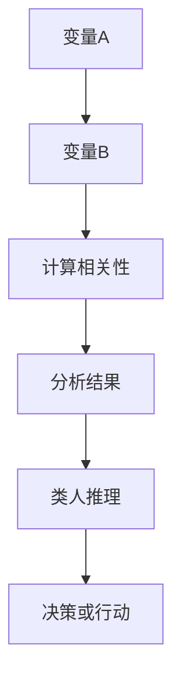
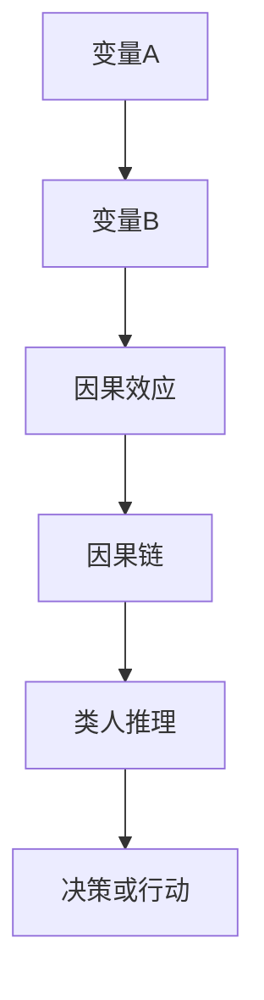

                 

### 1.3 类人推理与相关性推断、因果性推断的关系

在人工智能领域，类人推理（Human-like Reasoning）是一个极其复杂且具有挑战性的课题。它旨在使机器能够像人类一样进行逻辑推理、决策和解决问题。类人推理与相关性推断（Correlation Inference）和因果性推断（Causal Inference）有着紧密的联系，但它们在本质和应用上有所不同。

#### 类人推理与相关性推断

相关性推断是一种基于数据的推理方式，它通过分析变量之间的相关性来推断潜在的关系。相关性推断在类人推理中扮演着重要的角色，因为它可以帮助机器识别和利用数据中的模式。然而，相关性推断仅仅揭示了变量之间的统计关系，并不能告诉我们这些关系背后的因果机制。

**核心概念与联系**：
在类人推理中，相关性推断涉及到以下几个核心概念：

1. **变量**：指数据集中的不同特征。
2. **相关性**：指两个变量之间变化的相互依赖程度。
3. **相关性度量**：常用的相关性度量包括皮尔逊相关系数、斯皮尔曼相关系数等。

**Mermaid 流程图**：


**核心算法原理讲解**：
```python
# Pseudo-code for correlation inference
def calculate_correlation(data):
    # Input: data (e.g., a dataset with variables A and B)
    # Output: correlation coefficient

    # Calculate covariance
    covariance = compute_covariance(data)

    # Calculate standard deviations
    std_dev_A = compute_std_dev(data['A'])
    std_dev_B = compute_std_dev(data['B'])

    # Calculate correlation coefficient
    correlation = covariance / (std_dev_A * std_dev_B)

    return correlation
```

**数学模型和数学公式**：
$$ \rho_{AB} = \frac{\text{Cov}(A, B)}{\sqrt{\text{Var}(A) \cdot \text{Var}(B)}} $$

其中，$\rho_{AB}$ 是变量 $A$ 和 $B$ 的皮尔逊相关系数。

#### 类人推理与因果性推断

因果性推断是一种从数据中推断因果关系的方法。与相关性推断不同，因果性推断旨在找出变量之间的因果联系，并解释为什么一个变量会导致另一个变量的变化。在类人推理中，因果性推断对于理解和模拟人类思维过程至关重要。

**核心概念与联系**：
在类人推理中，因果性推断涉及到以下几个核心概念：

1. **因果链**：指一系列因果关系的传递。
2. **因果效应**：指一个变量变化对另一个变量产生的影响。
3. **因果推断**：指通过数据来推断变量之间的因果关系。

**Mermaid 流流程图**：


**核心算法原理讲解**：
```python
# Pseudo-code for causal inference
def infer_causation(data):
    # Input: data (e.g., a dataset with variables A and B, where A is a potential cause of B)
    # Output: inferred causal relationship

    # Perform statistical tests
    test_results = perform_statistical_tests(data)

    # Analyze test results
    causal_relationship = analyze_test_results(test_results)

    return causal_relationship
```

**数学模型和数学公式**：
$$ Y = \alpha + \beta X + \epsilon $$

其中，$Y$ 是因变量，$X$ 是自变量，$\alpha$ 是常数项，$\beta$ 是因果效应系数，$\epsilon$ 是误差项。

#### 类人推理、相关性推断与因果性推断的关系

类人推理、相关性推断和因果性推断之间的关系可以概括如下：

1. **类人推理**：旨在使机器能够像人类一样进行逻辑推理和决策。
2. **相关性推断**：是类人推理中的一种基础性方法，用于识别数据中的模式。
3. **因果性推断**：是类人推理中更高级的方法，旨在理解变量之间的因果关系。

通过结合相关性推断和因果性推断，类人推理可以更准确地模拟人类的思维过程，从而在复杂环境中做出更合理的决策。例如，在医疗诊断中，类人推理系统可以利用相关性推断识别出可能的疾病症状，并通过因果性推断确定这些症状背后的潜在病因。

**数学公式**：
$$ AGI = f(S, L, M) $$
其中，
- $AGI$ 表示类人推理能力。
- $S$ 表示相关性推断和因果性推断。
- $L$ 表示学习和推理过程。
- $M$ 表示模型输出。

通过这样的逐步分析，我们可以更好地理解类人推理、相关性推断和因果性推断之间的关系，并探索如何在人工智能系统中实现这种高级推理能力。接下来，我们将深入探讨类人推理的架构，以了解它是如何实现这些复杂推理的。

