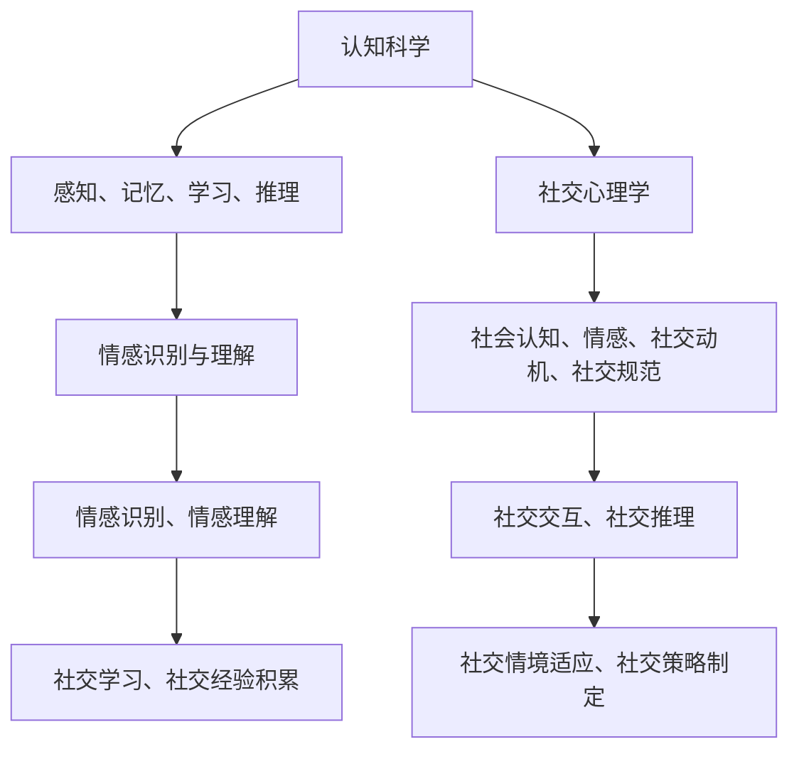
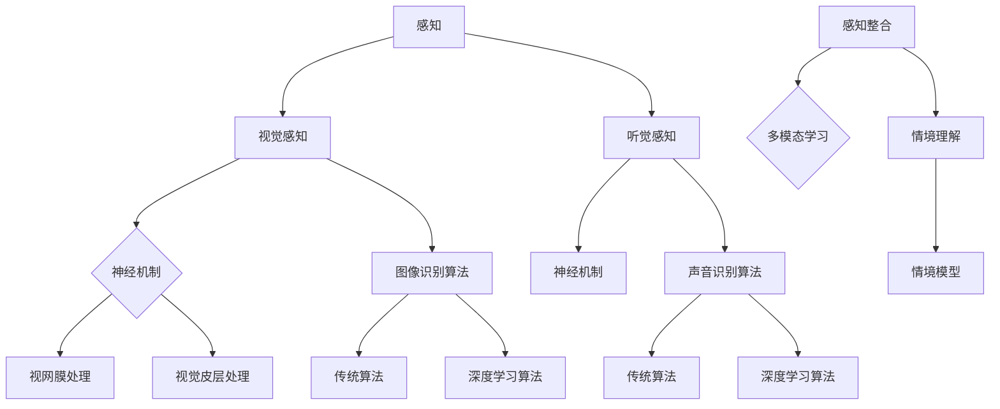
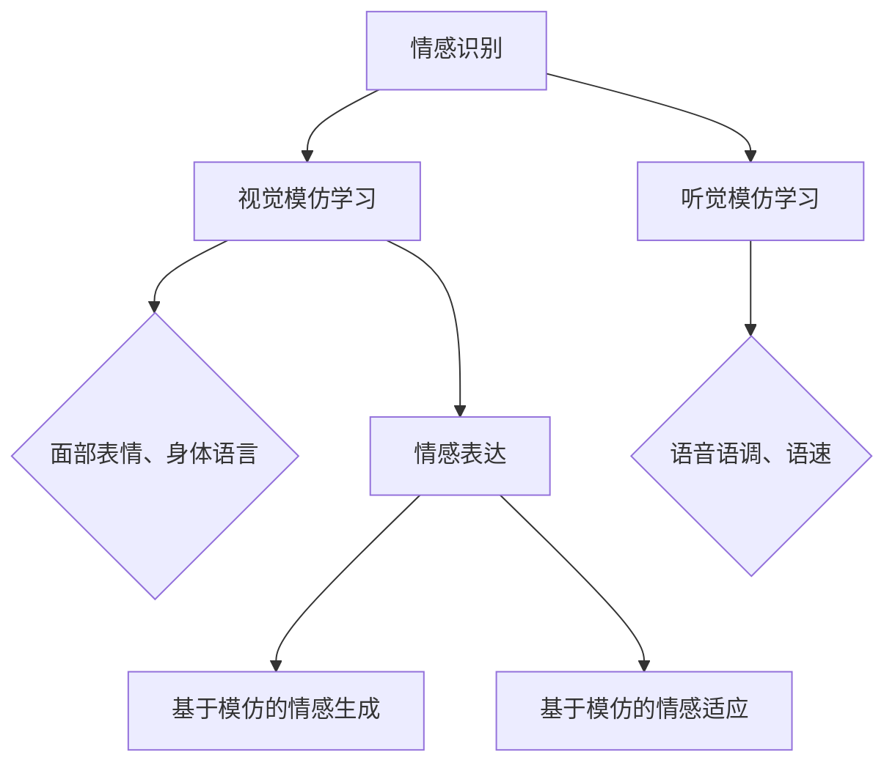
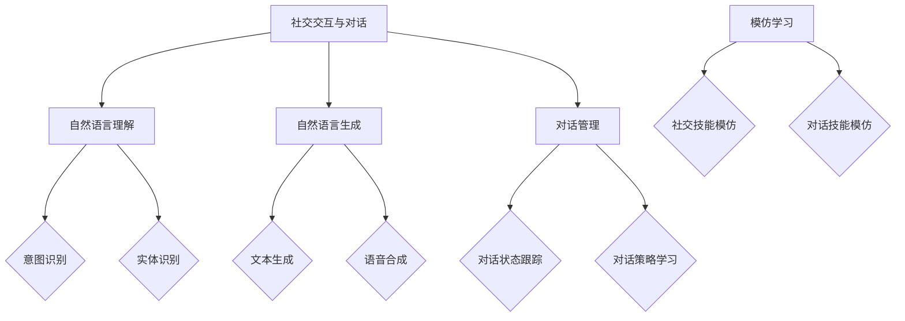
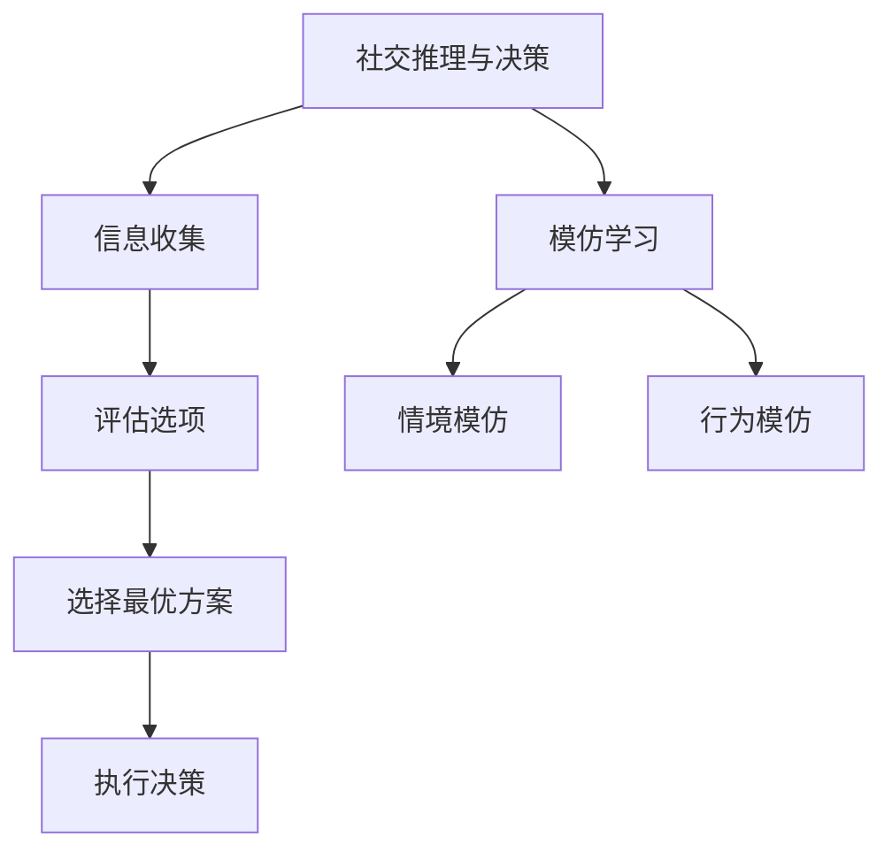
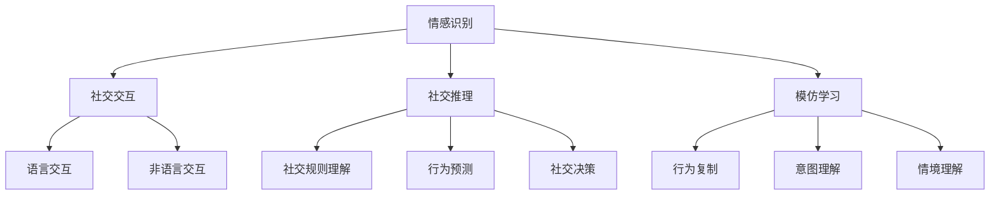

                 


### 文章标题：AGI的类人社交学习能力：从观察到模仿

#### 关键词：AGI、类人社交学习能力、观察、模仿、人工智能、认知科学、社交心理学

#### 摘要：
本文旨在深入探讨人工通用智能（AGI）的类人社交学习能力，从观察、模仿两个核心环节出发，解析AGI如何在复杂的社会环境中进行学习。文章首先介绍了AGI的概念及其在人工智能领域的重要性，随后探讨了类人社交学习能力的内涵和理论基础，最后通过具体案例展示了AGI的类人社交学习能力的实际应用和发展前景。

---

### 目录

1. 引言
   1.1 人工智能（AI）的发展历程
   1.2 人工通用智能（AGI）的定义与重要性
   1.3 类人社交学习能力的概念与意义
   1.4 本书内容结构安排与学习目标

2. AGI类人社交学习能力的理论基础
   2.1 认知科学与社交心理学基础
   2.2 感知与学习
   2.3 情感识别与表达
   2.4 社交交互与对话
   2.5 社交推理与决策

3. 案例分析与应用前景
   3.1 案例一：社交机器人开发
   3.2 案例二：虚拟客服系统设计
   3.3 案例三：智能对话平台建设

4. 总结与展望
   4.1 总结
   4.2 展望
   4.3 注意事项与最佳实践

---

### 第1章：引言

#### 1.1 人工智能（AI）的发展历程

人工智能（AI）的发展历程可以追溯到20世纪50年代，当时计算机科学家艾伦·图灵提出了“图灵测试”，这标志着人工智能概念的确立。在随后的几十年中，人工智能经历了多次起伏，从早期的符号主义、基于规则的系统，到20世纪80年代的专家系统，再到20世纪90年代的统计学习方法和深度学习技术的兴起，人工智能逐渐从理论走向实际应用。

符号主义阶段，AI的研究主要集中在如何通过逻辑推理和符号表示来模拟人类智能。这一阶段的代表性工作包括约翰·麦卡锡（John McCarthy）提出的普林斯顿机器人项目（PR2）和爱德华·阿瑟·李·福克斯（Edward A. Lee Fox）提出的普林斯顿结构化人工智能系统（PSAIS）。

专家系统阶段，AI开始尝试解决更复杂的问题，通过将人类专家的知识编码到计算机程序中，使计算机能够像专家一样进行决策。这一阶段的代表性工作包括爱德华·费根鲍姆（Edward Feigenbaum）开发的Dendral系统和肯尼斯·霍普（Kenneth Hope）开发的MYCIN系统。

统计学习方法和深度学习技术的兴起，使得人工智能在图像识别、自然语言处理等领域取得了显著的突破。统计学习方法包括支持向量机（SVM）、决策树、神经网络等，而深度学习方法则基于多层神经网络，通过训练大量数据来学习特征和模式。这一阶段的代表性工作包括李飞飞（Fei-Fei Li）的ImageNet挑战赛和谷歌的AlphaGo。

#### 1.2 人工通用智能（AGI）的定义与重要性

人工通用智能（AGI）是指一种具有广泛认知能力的智能系统，能够在各种领域表现出与人类相似的智能水平。与当前主流的人工智能（Narrow AI）相比，AGI具有更高的智能水平和更广泛的适用范围。AGI的定义可以从以下几个方面来理解：

1. **认知能力**：AGI应具备广泛的认知能力，包括感知、理解、推理、学习、规划和问题解决等。这些能力使得AGI能够在各种情境下进行有效的决策和行动。

2. **通用性**：AGI应具有通用性，能够在不同的领域和应用中表现出智能水平。这意味着AGI不应局限于某个特定的任务或领域，而应具备跨领域的适应能力。

3. **自主性**：AGI应具备自主性，能够独立地处理复杂的问题，而不需要依赖人类的指导。这种自主性使得AGI能够在动态和不确定的环境中做出有效的决策。

AGI的重要性在于它不仅能够推动人工智能技术的发展，还能够为人类社会带来深远的变革。以下是AGI可能带来的几方面重要影响：

1. **自动化**：AGI的广泛应用将极大地推动自动化技术的发展，从而提高生产效率，减少人力成本。例如，在制造业、物流、医疗等领域，AGI可以自动化完成复杂的工作任务，提高工作质量和效率。

2. **教育**：AGI可以帮助构建更加个性化和智能化的教育系统。通过理解学生的需求和知识水平，AGI可以为学生提供个性化的学习建议和指导，提高学习效果。

3. **医疗**：AGI在医疗领域的应用潜力巨大，例如在疾病诊断、治疗计划制定、药物研发等方面，AGI可以通过分析大量的医学数据，提供更加精准和有效的医疗建议。

4. **社会管理**：AGI可以帮助社会管理者更好地理解社会动态，预测社会趋势，制定更加有效的政策和策略。

5. **人机协作**：AGI的出现将推动人机协作模式的变革，使人类与机器能够更加紧密地合作，共同解决复杂的问题。

#### 1.3 类人社交学习能力的概念与意义

类人社交学习能力是指人工智能系统能够像人类一样进行社交互动、学习和适应复杂社会环境的能力。类人社交学习能力包括多个方面，如情感识别、社交交互、社交推理等。以下是类人社交学习能力的一些关键概念：

1. **情感识别**：情感识别是指AI系统能够感知和理解人类情感的能力。这包括识别面部表情、语音语调、身体语言等情感表达方式，从而更好地理解人类的情感状态。

2. **社交交互**：社交交互是指AI系统与他人进行有效沟通和合作的能力。这包括语言表达、对话管理、非语言沟通等技能，使得AI系统能够在社交环境中进行有效的交流。

3. **社交推理**：社交推理是指AI系统在社交情境中进行分析和决策的能力。这包括理解社交规则、预测他人行为、适应社交情境等，从而做出合适的社交决策。

类人社交学习能力对AGI具有重要意义。首先，类人社交学习能力可以使AGI更好地适应复杂的社会环境，提高其在实际应用中的性能和可靠性。其次，类人社交学习能力有助于AGI在人类社会中建立信任和合作，从而更好地服务于人类社会。最后，类人社交学习能力也是AGI实现自主学习和持续发展的关键因素。

#### 1.4 本书内容结构安排与学习目标

本书将围绕AGI的类人社交学习能力展开讨论，分为以下几部分：

1. **引言**：介绍人工智能（AI）的发展历程，人工通用智能（AGI）的定义与重要性，以及类人社交学习能力的概念与意义。

2. **AGI类人社交学习能力的理论基础**：探讨认知科学与社交心理学的核心概念，以及感知与学习、情感识别与表达、社交交互与对话、社交推理与决策等方面的理论基础。

3. **案例分析与应用前景**：通过具体案例展示AGI的类人社交学习能力的实际应用，分析其发展趋势和未来前景。

4. **总结与展望**：总结本书的核心内容，展望AGI类人社交学习能力的发展方向和应用前景。

学习目标：

- 理解人工通用智能（AGI）的定义与重要性。
- 掌握类人社交学习能力的核心概念和理论基础。
- 了解感知与学习、情感识别与表达、社交交互与对话、社交推理与决策等方面的关键技术。
- 分析AGI类人社交学习能力的实际应用案例。
- 探讨AGI类人社交学习能力的发展趋势和应用前景。

---

### 1.1 人工智能（AI）的发展历程

人工智能（AI）的发展历程可以追溯到20世纪50年代。当时，计算机科学家艾伦·图灵（Alan Turing）提出了著名的“图灵测试”，这一概念标志着人工智能领域正式诞生。图灵测试旨在评估计算机是否具备智能，通过人类评估者与计算机之间的对话来判断计算机是否能够模仿人类的思维。

在图灵测试的启发下，人工智能领域开始了初步的研究和探索。20世纪50年代至60年代，人工智能研究主要集中在符号主义方法，这种方法依赖于逻辑推理和符号表示，试图通过编码人类知识来模拟智能。这一阶段的代表性工作包括普林斯顿机器人项目（PR2）和普林斯顿结构化人工智能系统（PSAIS）。

进入20世纪80年代，专家系统的兴起为人工智能带来了新的发展机遇。专家系统是一种基于规则的知识表示方法，通过将专家的知识编码到计算机程序中，使计算机能够像专家一样进行决策。代表性工作包括Dendral系统和MYCIN系统，这些系统在医疗诊断和疾病治疗中取得了显著的成功。

然而，专家系统的局限性逐渐显现，无法处理复杂的、非线性的问题。随着计算机性能的提升和大数据时代的到来，20世纪90年代开始，人工智能研究转向了统计学习方法和深度学习技术。统计学习方法包括支持向量机（SVM）、决策树、神经网络等，而深度学习方法则基于多层神经网络，通过训练大量数据来学习特征和模式。

深度学习技术的出现，特别是在图像识别、自然语言处理等领域，取得了惊人的突破。2012年，李飞飞（Fei-Fei Li）发起了ImageNet挑战赛，这一比赛激发了深度学习在图像识别领域的快速发展。谷歌、微软、IBM等科技巨头纷纷投入大量资源进行深度学习研究，推出了一系列先进的深度学习模型，如卷积神经网络（CNN）和递归神经网络（RNN）。

在深度学习技术的推动下，人工智能在各个领域都取得了显著的进展。例如，在图像识别领域，深度学习模型已经超越了人类的表现；在自然语言处理领域，深度学习技术使得机器翻译、文本生成等任务变得可行；在游戏领域，深度强化学习技术使人工智能在围棋、国际象棋等游戏中取得了顶尖水平。

总的来说，人工智能的发展历程经历了从符号主义到专家系统，再到统计学习方法和深度学习技术的演变。每一次技术突破都为人工智能的应用提供了新的可能性，推动了人工智能从理论研究走向实际应用。

#### 1.2 人工通用智能（AGI）的定义与重要性

人工通用智能（Artificial General Intelligence，简称AGI）是指一种具有广泛认知能力的人工智能系统，它能够在各种不同的领域和任务中表现出与人类相似的智能水平。与当前主流的窄域人工智能（Narrow AI）不同，AGI不仅仅是针对特定任务进行优化的系统，而是具有广泛适应性和自主学习能力。

AGI的定义可以从以下几个方面来理解：

1. **广泛认知能力**：AGI应具备广泛的认知能力，包括感知、理解、推理、学习、规划、问题解决等。这些能力使得AGI能够应对各种复杂情境，进行灵活的决策和行动。

2. **通用性**：AGI应具有通用性，能够在不同的领域和应用中表现出智能水平。这意味着AGI不应局限于某个特定的任务或领域，而是能够跨领域适应。

3. **自主性**：AGI应具备自主性，能够在没有人类指导的情况下，独立处理复杂的问题。这种自主性使得AGI能够动态适应环境变化，自主学习和进化。

AGI的重要性在于其对人工智能领域和社会的深远影响：

1. **推动技术进步**：AGI的实现将推动人工智能技术的发展，使机器能够更好地模拟人类智能，解决复杂问题。

2. **提高生产效率**：AGI能够在各个领域实现自动化，提高生产效率，减少人力成本。例如，在制造业、物流、医疗等领域，AGI可以自动化完成复杂的工作任务。

3. **教育变革**：AGI可以帮助构建更加个性化和智能化的教育系统。通过理解学生的需求和知识水平，AGI可以为学生提供个性化的学习建议和指导，提高学习效果。

4. **医疗进步**：AGI在医疗领域的应用潜力巨大。通过分析大量的医学数据，AGI可以提供更加精准和有效的医疗建议，协助医生进行诊断和治疗。

5. **社会管理**：AGI可以帮助社会管理者更好地理解社会动态，预测社会趋势，制定更加有效的政策和策略。

6. **人机协作**：AGI的出现将推动人机协作模式的变革，使人类与机器能够更加紧密地合作，共同解决复杂的问题。

总的来说，AGI的实现将是人工智能领域的一次重大突破，它不仅能够推动技术进步，还能够在各个领域带来深远的变革。

#### 1.3 类人社交学习能力的概念与意义

类人社交学习能力是指人工智能系统在复杂社会环境中，通过模仿人类的学习和社交互动方式，从而获取知识、技能和经验的能力。这种能力包括对人类情感的理解、社交交互的技巧、以及社会情境的适应等方面。类人社交学习能力的重要性主要体现在以下几个方面：

1. **增强互动性**：类人社交学习能力使得人工智能系统能够更好地与人类进行交流，理解人类的需求和情感，从而提供更加个性化和贴心的服务。

2. **提升决策能力**：通过模仿人类的社交学习方式，人工智能系统可以在复杂的社交环境中，分析社交信息，理解社交规则，做出更加合理的决策。

3. **促进协作**：类人社交学习能力有助于人工智能系统在团队协作中发挥作用，理解团队成员的意图和需求，从而实现高效的合作。

4. **增强用户体验**：在消费领域，类人社交学习能力可以提升用户的体验，例如在智能客服、虚拟助手等应用中，人工智能系统能够更好地模拟人类的服务态度和沟通方式。

5. **社会适应能力**：类人社交学习能力使人工智能系统能够更好地适应社会环境的变化，理解和遵守社会规范，从而在多样化的社交场景中发挥作用。

6. **推动AI伦理**：随着人工智能在社会中的广泛应用，类人社交学习能力有助于提高人工智能的伦理水平，使人工智能系统能够更好地理解并遵守社会伦理规范。

类人社交学习能力的实现，需要人工智能系统在多个方面进行模拟和学习：

1. **情感识别与理解**：人工智能系统需要具备情感识别能力，能够通过语言、面部表情、声音等渠道感知和理解人类情感。

2. **社交交互技巧**：人工智能系统需要掌握社交交互技巧，包括语言沟通、非语言沟通（如身体语言、面部表情等），以及如何在不同的社交场合中表现出合适的社交行为。

3. **情境理解**：人工智能系统需要具备情境理解能力，能够理解社交互动发生的背景和上下文，从而做出更加合理的社交决策。

4. **自主学习和适应**：类人社交学习能力需要人工智能系统具备自主学习和适应能力，能够在不断变化的社交环境中，通过经验和反馈不断优化自身的行为和决策。

总的来说，类人社交学习能力是人工智能发展的重要方向之一，它不仅有助于提升人工智能系统的智能水平，还能够使其更好地服务于人类社会，促进人机和谐共生。

#### 1.4 本书内容结构安排与学习目标

本书旨在系统性地探讨人工通用智能（AGI）的类人社交学习能力，从理论基础到实际应用进行全方位的剖析。以下是本书的内容结构安排及学习目标：

### 内容结构安排：

1. **引言**：
   - 介绍人工智能（AI）的发展历程，人工通用智能（AGI）的定义与重要性。
   - 讨论类人社交学习能力的概念及其在人工智能领域的意义。

2. **AGI类人社交学习能力的理论基础**：
   - 研究认知科学与社交心理学的核心概念，为理解AGI的类人社交学习能力提供理论基础。
   - 探讨感知与学习、情感识别与表达、社交交互与对话、社交推理与决策等方面的关键原理。

3. **感知与学习**：
   - 分析视觉感知与图像识别、听觉感知与声音识别等技术，以及模仿学习在感知中的应用。
   - 讨论感知整合与情境理解的基本原理，以及模仿学习在情境理解中的应用。

4. **情感识别与表达**：
   - 研究情感识别的基本原理，包括情感的分类与特征、情感识别的方法与技术。
   - 探讨情感表达与交流的基本原则，以及模仿学习在情感表达与交流中的应用。

5. **社交交互与对话**：
   - 分析社交交互的基本原理，包括社交交互的概念与模型、社交交互的特点与挑战。
   - 讨论对话系统的构建，包括对话系统的基本结构、对话系统的主要技术，以及模仿学习在对话系统中的应用。

6. **社交推理与决策**：
   - 研究社交推理的基本原理，包括社交推理的概念与模型、社交推理的方法与技术。
   - 探讨决策过程与策略，包括决策过程的基本原理、决策策略的设计与优化，以及模仿学习在决策中的应用。

7. **案例分析与应用前景**：
   - 通过具体案例分析，展示AGI的类人社交学习能力的实际应用，分析其发展趋势和未来前景。
   - 探讨社交学习在各个领域的应用，如社交机器人开发、虚拟客服系统设计、智能对话平台建设等。

8. **总结与展望**：
   - 总结本书的核心内容，回顾AGI类人社交学习能力的发展历程和关键概念。
   - 展望AGI类人社交学习能力的发展方向和应用前景。

### 学习目标：

- **理解AGI的定义与重要性**：
  - 掌握AGI的基本概念，理解其在人工智能领域的独特地位和作用。

- **掌握类人社交学习能力的理论基础**：
  - 理解认知科学与社交心理学在AGI中的应用，掌握感知与学习、情感识别与表达、社交交互与对话、社交推理与决策等方面的基本原理。

- **了解核心技术和算法**：
  - 学习视觉感知与图像识别、听觉感知与声音识别等核心技术，理解模仿学习在这些领域的应用。

- **掌握情感识别与表达**：
  - 掌握情感识别的方法与技术，理解情感表达与交流的基本原则。

- **理解社交交互与对话系统**：
  - 理解社交交互的基本原理，学习对话系统的构建方法和关键技术。

- **理解社交推理与决策**：
  - 掌握社交推理的方法与技术，理解决策过程与策略的设计与优化。

- **案例分析与应用**：
  - 分析AGI类人社交学习能力的实际应用案例，探讨其发展趋势和未来前景。

- **展望AGI类人社交学习能力的发展方向**：
  - 了解AGI类人社交学习能力在各个领域的应用前景，思考未来的发展方向和潜在挑战。

通过本书的学习，读者将能够全面了解AGI的类人社交学习能力，掌握相关技术和算法，并能够分析和解决实际应用中的问题，为人工智能的发展和应用提供理论支持和实践指导。

---

### 2.1 认知科学与社交心理学基础

认知科学（Cognitive Science）是研究人类认知过程的跨学科领域，涉及心理学、神经科学、计算机科学、语言学等多个学科。其目标是理解人类思维、感知、记忆、学习、推理等认知功能，并构建能够模拟这些功能的计算模型。在人工智能领域，认知科学为AGI的类人社交学习能力提供了重要的理论基础。

#### 认知科学的基本原理

认知科学的基本原理包括以下几个核心方面：

1. **感知**：感知是指个体通过感官接收外部刺激，并将其转化为神经信号的过程。认知科学研究表明，感知过程不仅依赖于感官的生理机制，还受到认知处理的影响。例如，视觉感知涉及大脑对图像的处理，包括边缘检测、颜色识别、形状识别等。

2. **记忆**：记忆是认知科学的一个重要研究内容，包括短期记忆和长期记忆。短期记忆通常用于处理当前的任务，而长期记忆则用于存储和回忆信息。记忆的编码、存储和检索过程是认知科学研究的重点。

3. **学习**：学习是指个体通过经验改变其行为和知识的过程。认知科学将学习视为一个复杂的过程，包括感知输入、记忆存储、决策制定等步骤。学习模型如联结主义模型、强化学习模型等，为AI系统提供了模拟学习过程的方法。

4. **推理**：推理是认知过程中的另一个核心功能，包括演绎推理和归纳推理。演绎推理从一般原则推导出特定结论，而归纳推理则从具体实例推导出一般规律。推理在决策、问题解决和语言理解中起着关键作用。

#### 社交心理学的核心概念

社交心理学（Social Psychology）是研究个体在社会环境中的行为和心理过程的学科。在类人社交学习能力的研究中，社交心理学提供了重要的理论框架和概念。以下是社交心理学的一些核心概念：

1. **社会认知**：社会认知是指个体如何通过感知、记忆、推理等过程理解他人的行为和心理状态。社会认知包括自我认知、他人认知和情境认知，这些认知过程帮助个体理解和预测他人的行为。

2. **情感**：情感是社交心理学研究的重要主题，包括情绪的产生、表达、感知和理解。情感不仅影响个体的行为和决策，也影响个体与他人的社交互动。

3. **社交动机**：社交动机是指个体参与社交活动的内在驱动力，包括归属感、社会认同、社交支持等。社交动机影响个体的社交行为和社交选择。

4. **社交规范**：社交规范是社会对个体行为期望的规范，包括礼仪、规则、习俗等。遵守社交规范是建立和维护社交关系的基础。

#### 认知科学与社交心理学在AGI中的应用

认知科学与社交心理学在AGI中有着广泛的应用，为类人社交学习能力的实现提供了理论基础。以下是几个关键应用领域：

1. **情感识别与理解**：认知科学提供了情感识别的理论基础，如面部表情识别、语音情感识别等。社交心理学则帮助AI系统理解情感的社会背景和意义，如情感的社交传递和情感的社会影响。

2. **社交交互**：认知科学提供了社交交互的理论框架，如社交对话模型、社交意图识别等。社交心理学则帮助AI系统理解和模拟社交情境，如社交情境的适应、社交策略的制定等。

3. **社交推理**：认知科学提供了社交推理的理论基础，如社会推理模型、情境推理等。社交心理学则帮助AI系统理解和应用社交规则，如社交规则的学习、社交决策的制定等。

4. **社交学习**：认知科学提供了社交学习的过程模型，如模仿学习、强化学习等。社交心理学则帮助AI系统理解和应用社交学习的策略，如社交信息的处理、社交经验的积累等。

#### Mermaid流程图

以下是一个简单的Mermaid流程图，展示认知科学与社交心理学在AGI中的应用关系：



通过这个流程图，我们可以清晰地看到认知科学与社交心理学在AGI类人社交学习能力中的相互作用和关联。

### 总结

认知科学与社交心理学为AGI的类人社交学习能力提供了重要的理论基础。认知科学的研究成果帮助我们理解人类认知过程，而社交心理学的研究成果帮助我们理解人类社交行为。结合这两大学科的成果，我们可以开发出更加智能和真实的社交AI系统，实现类人社交学习能力。

---

### 2.2 感知与学习

感知与学习是认知科学中的核心研究领域，对于实现人工通用智能（AGI）的类人社交学习能力至关重要。感知涉及人类如何通过感官获取外界信息，而学习则是人类如何利用这些信息进行认知和适应环境的过程。在这一节中，我们将详细探讨视觉感知与图像识别、听觉感知与声音识别，以及模仿学习在感知与学习中的应用。

#### 视觉感知与图像识别

视觉感知是人类最重要的感官之一，它使我们能够识别形状、颜色、运动和空间关系。视觉感知的过程可以分为多个阶段，包括视网膜上的光电转换、视觉皮层的处理，以及更高层次的大脑区域对视觉信息的综合理解。

1. **视觉感知的神经机制**：

   - **视网膜**：视网膜是视觉感知的起点，包含感光细胞（视杆细胞和视锥细胞），它们能够感知光线并产生神经信号。
   - **视觉通路**：神经信号通过视神经传递到大脑，经过多个处理区域，包括外侧膝状体、视觉皮层等。
   - **视觉处理**：大脑对视觉信息进行加工，包括边缘检测、颜色识别、形状识别等。

2. **图像识别算法介绍**：

   - **传统图像识别算法**：传统的图像识别算法包括特征提取、匹配和分类等步骤。例如，SIFT（尺度不变特征变换）和SURF（加速稳健特征）是常用的特征提取方法，而支持向量机（SVM）和神经网络（NN）是常用的分类方法。
   - **深度学习算法**：近年来，深度学习算法在图像识别领域取得了显著进展。卷积神经网络（CNN）是一种常用的深度学习模型，它通过多个卷积层和池化层提取图像特征，并通过全连接层进行分类。

3. **模仿学习在视觉感知中的应用**：

   - **模仿学习的基本概念**：模仿学习是指通过观察他人的行为并复制这些行为来获取知识和技能的过程。在视觉感知中，模仿学习可以帮助AI系统通过观察人类的行为来学习识别物体、场景和动作。
   - **模仿学习的应用**：在自动驾驶领域，模仿学习被用来训练自动驾驶系统通过观察人类司机的驾驶行为来学习道路规则和驾驶技巧。在机器人领域，模仿学习可以帮助机器人通过观察人类完成复杂任务，如组装产品或进行家庭服务。

#### 听觉感知与声音识别

听觉感知是人类通过耳朵接收声波并将其转化为神经信号的过程。听觉感知涉及声波的接收、处理和解释，使我们能够识别声音、理解语言和感知环境。

1. **听觉感知的神经机制**：

   - **耳部结构**：耳朵包括外耳、中耳和内耳，它们共同工作以接收和处理声波。
   - **听觉通路**：声波通过耳部结构传到大脑，经过耳蜗、听觉皮层等处理区域。
   - **听觉处理**：大脑对听觉信息进行加工，包括频率分析、时域分析和声音识别。

2. **声音识别算法介绍**：

   - **传统声音识别算法**：传统声音识别算法通常基于声学模型和语言模型。声学模型用于提取声音特征，如梅尔频率倒谱系数（MFCC），而语言模型用于对语音进行解码和识别。
   - **深度学习算法**：深度学习算法在声音识别领域取得了巨大成功。深度神经网络（DNN）和循环神经网络（RNN）是常用的深度学习模型，它们能够通过训练大量语音数据来学习语音特征和模式。

3. **模仿学习在听觉感知中的应用**：

   - **模仿学习的基本概念**：在听觉感知中，模仿学习是指通过观察他人的声音行为来学习识别声音和语言的过程。
   - **模仿学习的应用**：在语音合成领域，模仿学习被用来训练语音合成系统通过模仿人类说话者的声音来生成自然流畅的语音。在语言学习领域，模仿学习可以帮助AI系统通过模仿人类的语音输入来学习新的语言。

#### 模仿学习在感知整合与情境理解中的应用

感知整合与情境理解是感知与学习过程中的关键环节，它们使得AI系统能够在复杂环境中进行有效的决策和行动。

1. **感知整合**：

   - **感知整合的概念**：感知整合是指将来自不同感官的信息（如视觉、听觉、触觉等）整合成一个统一的感知模型，以便更好地理解和解释环境。
   - **感知整合的方法**：感知整合可以通过多模态学习实现，即同时训练AI系统处理来自不同感官的信息。例如，在机器人领域，可以通过整合视觉和听觉信息来提高机器人对环境的感知和理解能力。

2. **情境理解**：

   - **情境理解的概念**：情境理解是指AI系统在感知整合的基础上，对环境中的情境进行解释和理解的过程。
   - **情境理解的方法**：情境理解可以通过情境模型实现，这些模型能够识别和解释环境中的情境和事件。例如，在智能家居领域，情境理解可以帮助智能助手识别家庭用户的日常活动，并提供相应的服务和建议。

#### Mermaid流程图

以下是一个简单的Mermaid流程图，展示感知与学习的过程及其在AGI类人社交学习能力中的应用：



通过这个流程图，我们可以清晰地看到感知与学习在AGI类人社交学习能力中的关键作用和相互关系。

### 总结

感知与学习是AGI类人社交学习能力的基础。通过深入研究视觉感知与图像识别、听觉感知与声音识别，以及模仿学习在感知与学习中的应用，我们可以构建出更加智能和真实的社交AI系统。这些系统不仅能够更好地理解和适应复杂环境，还能够通过模仿人类的感知和学习方式，实现类人的社交互动和学习能力。

---

### 2.3 情感识别与表达

情感识别与表达是类人社交学习能力的重要组成部分，对于实现人工通用智能（AGI）的社交互动和情感交流至关重要。在这一节中，我们将详细探讨情感识别的基本原理、情感表达与交流的基本原则，以及模仿学习在情感识别与表达中的应用。

#### 情感识别的基本原理

情感识别是指人工智能系统通过感知和处理人类情感表达，理解人类情感状态的能力。情感识别的基本原理包括以下几个方面：

1. **情感分类与特征**：

   - **情感的分类**：情感通常被分为基本情感和复杂情感。基本情感包括快乐、悲伤、愤怒、恐惧、惊讶和厌恶等。复杂情感则是基本情感的组合，如嫉妒、焦虑和羞愧等。
   - **情感的特征**：情感具有情绪状态、情绪表达和情绪强度等特征。情绪状态是指情感的内部体验，情绪表达是指情感的外部表现，如面部表情、语音语调、身体语言等，情绪强度则是指情感体验的强度。

2. **情感识别的方法与技术**：

   - **传统方法**：传统的情感识别方法包括基于规则的系统、机器学习和深度学习。基于规则的系统通过预定义的规则来识别情感，如面部表情识别系统。机器学习的方法包括支持向量机（SVM）、决策树和朴素贝叶斯分类器等，它们通过训练数据学习情感特征和模式。深度学习方法，如卷积神经网络（CNN）和循环神经网络（RNN），通过自动提取复杂的特征，提高了情感识别的准确性。
   - **深度学习方法**：深度学习方法在情感识别中取得了显著进展。例如，CNN通过多层卷积和池化操作，能够提取图像中的高级特征，从而提高面部表情识别的准确性。RNN则通过处理序列数据，能够识别连续的情感表达，如语音情感识别。

3. **模仿学习在情感识别中的应用**：

   - **模仿学习的基本概念**：模仿学习是指通过观察他人的行为并复制这些行为来获取知识和技能的过程。在情感识别中，模仿学习可以帮助AI系统通过观察人类情感表达来学习识别情感。
   - **模仿学习的应用**：例如，在语音情感识别中，AI系统可以通过模仿人类对特定情感的语音表达来学习识别情感。在面部表情识别中，AI系统可以通过模仿人类对特定情感的面部表情来学习识别情感。

#### 情感表达与交流的基本原则

情感表达与交流是社交互动的重要部分，它帮助个体传达情感状态，建立和维护社交关系。情感表达与交流的基本原则包括：

1. **情感表达的方式与手段**：

   - **语言表达**：语言是情感表达的主要手段，包括直接表达和间接表达。直接表达如“我感到很高兴”，间接表达如“今天的天气真好”。
   - **非语言表达**：非语言表达包括面部表情、身体语言、语音语调等。例如，微笑表示快乐，紧握拳头表示愤怒。

2. **情感交流的基本原则**：

   - **真实性**：情感交流应真实反映个体的情感状态，避免伪装和欺骗。
   - **适度性**：情感表达应根据社交情境和社会规范适度进行，避免过度表达或压抑情感。
   - **适应性**：情感表达应适应不同的社交情境和社交对象，以建立和维护良好的社交关系。

3. **模仿学习在情感表达与交流中的应用**：

   - **模仿学习的基本概念**：模仿学习是指通过观察他人的行为并复制这些行为来获取知识和技能的过程。在情感表达与交流中，模仿学习可以帮助AI系统通过观察人类情感表达来学习如何进行适当的情感表达。
   - **模仿学习的应用**：例如，在社交机器人中，AI系统可以通过模仿人类的情感表达来学习如何进行合适的情感交流。在自然语言处理中，AI系统可以通过模仿人类对特定情感的表述来学习如何生成情感丰富的文本。

#### 模仿学习在情感识别与表达中的应用

模仿学习在情感识别与表达中发挥着关键作用，它帮助AI系统通过观察人类的行为和表达来学习情感知识和技能。以下是几个关键应用场景：

1. **情感识别**：

   - **基于视觉的模仿学习**：AI系统可以通过观察人类的面部表情、身体语言和姿态来学习识别情感。例如，通过模仿人类对快乐、悲伤等基本情感的识别，AI系统可以提高情感识别的准确性。
   - **基于听觉的模仿学习**：AI系统可以通过观察人类的语音语调、语速和音量变化来学习识别情感。例如，通过模仿人类对快乐、愤怒等情感的语音表达，AI系统可以提高语音情感识别的准确性。

2. **情感表达**：

   - **基于模仿的情感生成**：AI系统可以通过模仿人类的情感表达来生成情感丰富的文本或语音。例如，通过模仿人类的语言表达方式，AI系统可以生成表达快乐、悲伤等情感的文本或语音。
   - **基于模仿的情感适应**：AI系统可以通过模仿人类的情感表达来适应不同的社交情境和社交对象。例如，在客服机器人中，AI系统可以通过模仿人类的情感表达方式，为不同类型的客户提供适当的情感回应。

#### Mermaid流程图

以下是一个简单的Mermaid流程图，展示模仿学习在情感识别与表达中的应用：



通过这个流程图，我们可以清晰地看到模仿学习在情感识别与表达中的关键作用和相互关系。

### 总结

情感识别与表达是类人社交学习能力的重要组成部分，对于实现人工通用智能（AGI）的社交互动和情感交流至关重要。通过深入研究情感识别的基本原理、情感表达与交流的基本原则，以及模仿学习在情感识别与表达中的应用，我们可以构建出更加智能和真实的社交AI系统。这些系统不仅能够更好地理解和识别人类的情感，还能够通过模仿人类的行为和表达，实现更加自然和有效的情感交流。

---

### 2.4 社交交互与对话

社交交互与对话是类人社交学习能力的重要组成部分，它们使人工智能系统能够与人类进行有效的沟通和协作。在这一节中，我们将详细探讨社交交互的基本原理，包括社交交互的概念与模型、社交交互的特点与挑战，以及对话系统的构建与关键技术。

#### 社交交互的基本原理

社交交互是指个体在社交环境中通过语言、非语言信号以及行为来交换信息、情感和资源的过程。社交交互的基本原理包括以下几个方面：

1. **社交交互的概念**：

   - **定义**：社交交互是指个体在社交环境中进行的、旨在传递信息、表达情感、建立和维护社交关系的活动。
   - **类型**：社交交互可以分为语言交互和非语言交互。语言交互包括口头语言和书面语言，非语言交互包括面部表情、身体语言、姿态等。

2. **社交交互的模型**：

   - **社会交换理论**：社会交换理论认为，社交交互是双方或多方之间资源和利益的交换过程。这种交换可以是物质的，也可以是情感或服务的。
   - **社会认知模型**：社会认知模型强调个体在社交交互中如何感知、理解和预测他人的行为和情感。这种模型有助于个体在社交环境中做出适当的反应。

3. **社交交互的特点**：

   - **动态性**：社交交互是动态变化的，它受到社交情境、个体情感状态和社会规范的影响。
   - **复杂性**：社交交互涉及多种信息和信号的交换，包括语言、非语言信号和行为，这使得社交交互变得复杂。
   - **适应性**：社交交互需要个体根据社交情境和社会规范进行调整和适应，以建立和维护良好的社交关系。

4. **社交交互的挑战**：

   - **理解多样性**：社交交互中的信息传递可能涉及多种语言和文化背景，这增加了理解和沟通的难度。
   - **情感识别**：情感识别是社交交互的关键部分，但人工智能系统在情感识别上还存在许多挑战，如情感表达的不一致性和复杂性。
   - **适应性**：社交交互需要个体根据不同的社交情境和社会规范进行适应，这对人工智能系统提出了高要求。

#### 对话系统的构建与关键技术

对话系统是一种能够与人类进行自然语言交互的人工智能系统，它包括自然语言理解、自然语言生成和对话管理等多个关键模块。以下是构建对话系统的关键技术：

1. **自然语言理解**：

   - **意图识别**：意图识别是指识别用户输入的意图，如查询信息、请求服务或进行社交互动。常见的意图识别方法包括基于规则的方法和机器学习方法。
   - **实体识别**：实体识别是指识别用户输入中的关键信息，如人名、地点、日期等。实体识别是信息抽取和自然语言处理的重要任务。

2. **自然语言生成**：

   - **文本生成**：文本生成是指根据系统意图和用户输入生成自然流畅的文本回复。常见的文本生成方法包括模板匹配、序列到序列模型（如RNN和Transformer）等。
   - **语音合成**：语音合成是将文本转换为自然语音的技术。常见的语音合成方法包括合成了模型和WaveNet等。

3. **对话管理**：

   - **对话状态跟踪**：对话状态跟踪是指跟踪对话的历史信息，包括用户的意图、系统的行为以及对话的上下文。常见的对话状态跟踪方法包括基于规则的方法和机器学习方法。
   - **对话策略学习**：对话策略学习是指根据对话状态和用户意图，选择适当的回复和行为。常见的对话策略学习方法包括基于规则的方法、机器学习方法（如决策树和深度学习）以及强化学习方法。

#### 模仿学习在社交交互与对话中的应用

模仿学习是一种通过观察他人的行为来学习和复制这些行为的方法。在社交交互与对话中，模仿学习可以帮助人工智能系统通过观察人类的行为来提高其社交能力和对话效果。以下是几个关键应用场景：

1. **模仿学习的基本概念**：

   - **模仿学习**：模仿学习是指通过观察人类的行为，如语言表达、非语言表达和行为模式，来学习社交交互和对话技能。
   - **模仿学习的优势**：模仿学习可以帮助人工智能系统快速学习和适应社交环境，提高社交互动的自然性和有效性。

2. **模仿学习的应用**：

   - **社交技能模仿**：通过模仿人类社交互动中的语言表达、非语言表达和行为模式，人工智能系统可以学习如何进行有效的社交互动。
   - **对话技能模仿**：通过模仿人类的对话策略和回复方式，人工智能系统可以学习如何与用户进行自然流畅的对话。

#### Mermaid流程图

以下是一个简单的Mermaid流程图，展示模仿学习在社交交互与对话中的应用：



通过这个流程图，我们可以清晰地看到模仿学习在社交交互与对话中的应用和关键作用。

### 总结

社交交互与对话是类人社交学习能力的重要组成部分，对于实现人工智能系统的类人社交互动至关重要。通过深入研究社交交互的基本原理、对话系统的构建与关键技术，以及模仿学习在社交交互与对话中的应用，我们可以构建出更加智能和真实的社交AI系统。这些系统不仅能够与人类进行有效的沟通和协作，还能够通过模仿人类的行为和表达，实现自然和有效的社交互动。

---

### 2.5 社交推理与决策

社交推理与决策是类人社交学习能力中的关键组成部分，它使得人工智能系统能够在复杂的社会环境中进行有效的推理和决策。在这一节中，我们将详细探讨社交推理的基本原理，包括社交推理的概念与模型、社交推理的方法与技术，以及决策过程与策略，最后讨论模仿学习在决策中的应用。

#### 社交推理的基本原理

社交推理是指个体在社交情境中，通过分析和解释社交信息，预测他人行为和做出合理决策的过程。社交推理的基本原理包括以下几个方面：

1. **社交推理的概念**：

   - **定义**：社交推理是指个体在社交情境中，通过理解社交信息、分析社交关系和预测他人行为，来做出合理决策的过程。
   - **类型**：社交推理可以分为基于知识的推理和基于数据的推理。基于知识的推理依赖于个体已有的知识和社会规则，而基于数据的推理则依赖于社交情境中的数据和信息。

2. **社交推理的模型**：

   - **社会认知模型**：社会认知模型认为，社交推理是通过认知过程来理解和预测他人行为。这种模型强调社交情境、情感和社会规范在社交推理中的作用。
   - **情境模型**：情境模型将社交推理视为一个动态过程，它考虑了社交情境的变化和个体行为的影响。这种模型有助于理解社交推理中的复杂性和动态性。

3. **社交推理的特点**：

   - **复杂性**：社交推理涉及多个因素，包括情感、社会规范、社交关系等，这使得社交推理过程复杂。
   - **动态性**：社交情境是动态变化的，社交推理需要根据情境的变化进行实时调整。
   - **适应性**：社交推理需要个体根据不同的社交情境和社会规范进行适应，以实现有效的社交互动。

4. **社交推理的挑战**：

   - **信息的不确定性**：社交情境中的信息常常是不确定的，社交推理需要处理这种不确定性。
   - **情感的影响**：情感在社交推理中起着重要作用，但情感的表达和感知可能存在差异，这增加了社交推理的难度。
   - **社会规范的遵守**：社交推理需要遵守社会规范，但不同的社会规范可能存在冲突，这需要个体进行权衡和决策。

#### 社交推理的方法与技术

社交推理的方法和技术包括以下几个方面：

1. **基于规则的推理**：

   - **定义**：基于规则的推理是通过预定义的规则来推理和决策的过程。
   - **应用**：在社交推理中，基于规则的推理可以用于识别社交情境、分析社交信息、预测他人行为等。例如，在社交机器人中，可以通过规则来识别用户的情感状态并做出相应的回应。

2. **基于机器学习的推理**：

   - **定义**：基于机器学习的推理是通过训练机器学习模型来学习和推理的过程。
   - **应用**：在社交推理中，机器学习模型可以用于情感识别、意图识别、社交情境分析等。例如，通过训练神经网络模型，可以识别用户的情感状态并预测其行为。

3. **基于深度学习的推理**：

   - **定义**：基于深度学习的推理是通过多层神经网络来学习和推理的过程。
   - **应用**：在社交推理中，深度学习模型可以用于处理复杂的社交信息和情境。例如，通过训练卷积神经网络（CNN）和循环神经网络（RNN），可以识别复杂的社交模式和情感。

#### 决策过程与策略

决策过程是社交推理的重要组成部分，它包括信息收集、评估选项、选择最优方案和执行决策等步骤。以下是决策过程与策略的详细讨论：

1. **信息收集**：

   - **定义**：信息收集是指获取与决策相关的信息和数据。
   - **方法**：信息收集可以通过观察、询问和调查等方式进行。在社交推理中，信息收集包括理解社交情境、分析社交信息、获取用户反馈等。

2. **评估选项**：

   - **定义**：评估选项是指对不同的决策方案进行评价和比较。
   - **方法**：评估选项可以通过定量分析和定性分析进行。在社交推理中，评估选项包括评估不同的社交策略、预测社交情境的结果等。

3. **选择最优方案**：

   - **定义**：选择最优方案是指根据评估结果选择最符合目标或最合理的决策方案。
   - **方法**：选择最优方案可以通过优化算法和决策模型进行。在社交推理中，选择最优方案包括根据社交情境和社会规范选择合适的社交策略。

4. **执行决策**：

   - **定义**：执行决策是指将决策方案付诸实践。
   - **方法**：执行决策包括制定行动计划、实施决策方案、监控决策效果等。在社交推理中，执行决策包括根据决策方案进行社交互动、反馈和调整等。

#### 模仿学习在决策中的应用

模仿学习在决策中发挥着重要作用，它通过观察他人的决策过程和结果来学习决策策略和优化自身的行为。以下是模仿学习在决策中的应用：

1. **模仿学习的基本概念**：

   - **定义**：模仿学习是指通过观察他人的行为和结果来学习和复制这些行为。
   - **优势**：模仿学习可以帮助个体快速学习和适应复杂的社会环境，提高决策的有效性。

2. **模仿学习的应用**：

   - **情境模仿**：通过观察他人的社交情境和决策过程，学习如何在不同的情境下进行有效的决策。
   - **行为模仿**：通过观察他人的行为模式，学习如何在不同情境下进行合理的社交互动和决策。

#### Mermaid流程图

以下是一个简单的Mermaid流程图，展示社交推理与决策的基本流程：



通过这个流程图，我们可以清晰地看到社交推理与决策的基本流程和模仿学习在其中的作用。

### 总结

社交推理与决策是类人社交学习能力的重要组成部分，它使得人工智能系统能够在复杂的社会环境中进行有效的推理和决策。通过深入研究社交推理的基本原理、方法与技术，以及决策过程与策略，我们可以构建出更加智能和真实的社交AI系统。模仿学习在决策中的应用，进一步提高了这些系统的适应性和决策能力，为人工智能在复杂社会环境中的应用提供了有力支持。

---

### 7.1 案例分析

在本节中，我们将通过三个实际案例，展示人工通用智能（AGI）类人社交学习能力在不同领域的应用。这些案例涵盖了社交机器人开发、虚拟客服系统设计和智能对话平台建设，旨在说明AGI在类人社交学习中的具体实现和效果。

#### 案例一：社交机器人开发

社交机器人是一种能够与人类进行自然语言交互，并具备一定社交能力的智能机器人。在社交机器人开发中，类人社交学习能力是实现机器人与人类有效互动的关键。

1. **背景介绍**：

   - **项目目标**：开发一款能够理解用户情感、进行有效对话并提供个性化服务的社交机器人。
   - **技术挑战**：实现情感识别、自然语言处理、对话管理等功能，使机器人能够在不同的社交情境中表现出类人的社交互动能力。

2. **核心实现与代码解读**：

   - **情感识别**：使用深度学习模型（如卷积神经网络CNN）对用户的语音和面部表情进行情感识别。以下是情感识别的伪代码：

     ```python
     import cv2
     import numpy as np
     import tensorflow as tf

     # 加载情感识别模型
     model = tf.keras.models.load_model('emotion_recognition_model.h5')

     # 加载摄像头
     cap = cv2.VideoCapture(0)

     while True:
         # 读取摄像头帧
         ret, frame = cap.read()
         
         # 预处理图像
         processed_frame = preprocess_image(frame)

         # 进行情感识别
         emotion_probs = model.predict(processed_frame)

         # 输出情感结果
         print("Detected emotion:", np.argmax(emotion_probs))
         
         if cv2.waitKey(1) & 0xFF == ord('q'):
             break
         
     cap.release()
     cv2.destroyAllWindows()
     ```

   - **对话管理**：使用基于状态机的对话管理器来处理用户的对话请求，并根据对话历史和上下文生成适当的回复。以下是对话管理器的伪代码：

     ```python
     class DialogueManager:
         def __init__(self):
             self.current_state = 'initial'
             self.dialogue_history = []

         def update_state(self, user_input):
             # 根据用户输入更新状态
             if user_input == 'hello':
                 self.current_state = 'greeting'
             elif user_input == 'how are you?':
                 self.current_state = 'ask_how_are_you'
             # 其他状态更新

         def generate_response(self, user_input):
             # 根据当前状态生成回复
             if self.current_state == 'greeting':
                 return "Hello! How can I help you?"
             elif self.current_state == 'ask_how_are_you':
                 return "I'm doing well, thank you! How about you?"
             # 其他回复生成

     manager = DialogueManager()
     print(manager.generate_response('hello'))
     print(manager.generate_response('how are you?'))
     ```

3. **应用解读与分析**：

   - **应用解读**：通过情感识别和对话管理，社交机器人能够理解用户的情感状态并生成合适的回应，从而实现与用户的自然互动。
   - **分析**：情感识别使机器人能够感知用户的情感，对话管理使机器人能够根据情感和上下文生成适当的回应。这两个功能的结合，使得社交机器人能够模拟人类的社交互动，提供个性化服务。

#### 案例二：虚拟客服系统设计

虚拟客服系统是另一种重要的应用场景，它通过人工智能技术提供24/7的在线客户服务，提高客户体验和公司效率。

1. **背景介绍**：

   - **项目目标**：设计一个能够理解用户需求、提供快速响应和解决方案的虚拟客服系统。
   - **技术挑战**：实现多轮对话管理、意图识别、知识图谱构建等功能，确保系统具备高效的客户服务能力。

2. **核心实现与代码解读**：

   - **意图识别**：使用深度学习模型（如长短期记忆网络LSTM）对用户输入进行意图分类。以下是意图识别的伪代码：

     ```python
     import tensorflow as tf
     from tensorflow.keras.models import Sequential
     from tensorflow.keras.layers import LSTM, Dense

     # 构建意图识别模型
     model = Sequential()
     model.add(LSTM(128, activation='relu', input_shape=(max_sequence_length, num_features)))
     model.add(Dense(num_classes, activation='softmax'))
     model.compile(optimizer='adam', loss='categorical_crossentropy', metrics=['accuracy'])

     # 训练模型
     model.fit(X_train, y_train, epochs=10, batch_size=32)

     # 预测意图
     predicted_intent = model.predict(user_input_vector)
     print("Predicted intent:", np.argmax(predicted_intent))
     ```

   - **知识图谱构建**：使用自然语言处理技术（如实体识别和关系抽取）构建知识图谱，以便快速查询和回答用户问题。以下是知识图谱构建的伪代码：

     ```python
     import spacy

     # 加载自然语言处理模型
     nlp = spacy.load('en_core_web_sm')

     # 构建知识图谱
     def build_knowledge_graph(document):
         doc = nlp(document)
         entities = [(ent.text, ent.label_) for ent in doc.ents]
         relations = [(token.text, token.dep_, next_token.text) for token in doc if token.dep_ in ['attr', 'prep']]
         return entities, relations

     entities, relations = build_knowledge_graph('Apple is a fruit')
     print("Entities:", entities)
     print("Relations:", relations)
     ```

3. **应用解读与分析**：

   - **应用解读**：通过意图识别和知识图谱构建，虚拟客服系统能够快速理解用户需求并提供准确的答案和解决方案。
   - **分析**：意图识别使系统能够识别用户的请求类型，知识图谱构建使系统能够从大量信息中快速提取有用知识，这两个功能的结合提高了虚拟客服系统的响应速度和准确度。

#### 案例三：智能对话平台建设

智能对话平台是一种集成多种人工智能技术的平台，它能够支持多轮对话、情感识别和个性化服务，广泛应用于客户服务、教育、医疗等领域。

1. **背景介绍**：

   - **项目目标**：建设一个能够支持复杂对话、提供高质量服务的智能对话平台。
   - **技术挑战**：实现多模态交互（文本、语音、图像等）、情感识别、个性化服务等功能，确保平台能够适应不同领域的应用需求。

2. **核心实现与代码解读**：

   - **多模态交互**：使用语音识别和图像识别技术实现多模态交互。以下是多模态交互的伪代码：

     ```python
     import speech_recognition as sr
     import cv2

     # 语音识别
     recognizer = sr.Recognizer()
     with sr.Microphone() as source:
         audio = recognizer.listen(source)
         text = recognizer.recognize_google(audio)
         print("Recognized text:", text)

     # 图像识别
     net = cv2.dnn.readNetFromTensorFlow('mobilenet_v1_1.0_224_frozen.pb')
     image = cv2.imread('image.jpg')
     blob = cv2.dnn.blobFromImage(image, scalefactor=1/127.5, mean=[123, 117, 104], swapRB=True)
     net.setInput(blob)
     outputs = net.forward()
     print("Detected object:", outputs[0].argmax())
     ```

   - **情感识别**：使用深度学习模型实现情感识别，以下是基于卷积神经网络的情感识别伪代码：

     ```python
     import tensorflow as tf
     import numpy as np

     # 加载情感识别模型
     model = tf.keras.models.load_model('emotion_recognition_model.h5')

     # 预测情感
     image = preprocess_image('emotion_image.jpg')
     emotion_probs = model.predict(np.expand_dims(image, axis=0))
     print("Predicted emotion:", np.argmax(emotion_probs))
     ```

3. **应用解读与分析**：

   - **应用解读**：通过多模态交互、情感识别和个性化服务，智能对话平台能够提供高质量、个性化的用户服务。
   - **分析**：多模态交互使平台能够支持多样化的用户输入和输出，情感识别使平台能够理解用户的情感状态，个性化服务使平台能够根据用户需求提供定制化的服务。这些功能的集成，使得智能对话平台在复杂应用场景中表现出色。

### 总结

通过以上三个案例，我们可以看到AGI类人社交学习能力在实际应用中的具体实现和效果。社交机器人、虚拟客服系统和智能对话平台都是基于类人社交学习能力的应用，它们通过情感识别、对话管理、多模态交互等技术，实现了与人类的自然互动和高效服务。这些案例不仅展示了类人社交学习能力的强大应用潜力，也为未来的发展提供了宝贵的经验和启示。

---

### 7.2 应用前景

随着人工智能技术的不断进步，AGI的类人社交学习能力在多个领域展现出巨大的应用前景，有望带来深远的社会变革。以下是AGI类人社交学习能力在各个领域的应用前景：

#### 消费领域

在消费领域，AGI类人社交学习能力可以显著提升用户体验。例如，在电子商务中，智能客服系统可以理解客户的情感和需求，提供个性化的购物建议和推荐。通过情感识别技术，客服系统能够识别客户的不满情绪，及时采取措施缓解客户的不满，从而提高客户满意度和忠诚度。此外，虚拟购物助理可以模拟人类导购的角色，与客户进行自然对话，提供购物建议和帮助，从而提升购物体验。

#### 教育领域

在教育领域，AGI类人社交学习能力可以提供个性化教育解决方案。智能教育系统可以分析学生的学习习惯、兴趣和情感状态，制定个性化的学习计划和课程。例如，系统可以根据学生的情感状态调整教学节奏，提供情感支持，帮助学生克服学习中的困难。同时，智能教育系统可以模拟教师的角色，与学生进行互动，提供实时反馈和辅导，从而提高学习效果。

#### 医疗领域

在医疗领域，AGI类人社交学习能力可以提升医疗服务的质量和效率。智能医疗助手可以通过情感识别技术，识别患者的情绪状态，提供心理支持和安慰，减轻患者的焦虑和恐惧。此外，智能医疗系统可以通过分析大量的医疗数据，提供准确的诊断和治疗方案，协助医生做出更好的医疗决策。智能护士可以模拟人类护士的角色，提供24/7的护理服务，提高患者的生活质量和康复效果。

#### 社会管理

在社会管理领域，AGI类人社交学习能力可以帮助政府和社会组织更好地理解社会动态，预测社会趋势，制定更加有效的政策和策略。通过分析大量的社交数据，AGI可以识别社会问题，提供解决方案，从而提高社会治理的效率和效果。例如，在公共安全领域，AGI可以分析犯罪数据，预测犯罪趋势，协助警方进行预防和打击。

#### 人机协作

AGI类人社交学习能力在推动人机协作方面具有巨大潜力。在人机协作中，AGI可以理解人类的需求和意图，提供智能化的支持和服务。例如，在制造业中，智能机器人可以与人类工人协同工作，完成复杂的制造任务，提高生产效率和产品质量。在金融领域，智能顾问可以与客户进行互动，提供个性化的投资建议，帮助客户实现财富增值。

#### 伦理与隐私

随着AGI类人社交学习能力的发展，伦理和隐私问题也日益凸显。在应用中，需要确保AI系统的决策和行为符合伦理标准，尊重用户的隐私权。例如，在医疗领域，智能医疗系统在处理患者数据时，需要遵守隐私保护法规，确保患者数据的保密性和安全性。此外，AI系统的决策过程需要透明，使人类能够理解和监督AI的行为，从而避免潜在的道德风险。

### 展望未来

展望未来，AGI类人社交学习能力将在更多领域得到应用，推动人工智能技术和社会的发展。以下是未来发展的几个方向：

1. **智能化服务**：随着技术的进步，AI系统将在更多服务领域实现智能化，提供个性化的服务体验。例如，智能家庭助理可以管理家庭生活，提供家电控制、健康监测和情感关怀等服务。

2. **人机共生**：随着AGI类人社交学习能力的发展，人类与机器将实现更加紧密的协作，形成人机共生的新生态。在这种生态中，AI系统将不仅作为工具，还将作为伙伴，共同解决复杂问题。

3. **跨领域应用**：AGI类人社交学习能力将在多个领域实现跨领域应用，推动跨学科的合作和创新。例如，在医疗和教育的交叉领域，AI系统可以提供个性化的医疗和教育解决方案，提高服务质量和效率。

4. **可持续性发展**：AGI类人社交学习能力可以助力实现可持续性发展目标。例如，通过智能农业系统提高农业产量，减少资源浪费；通过智能能源管理系统优化能源使用，减少碳排放。

总之，AGI类人社交学习能力的发展前景广阔，它不仅将带来技术和社会的变革，还将为人类创造更加美好的未来。

---

### 4.1 背景介绍

AGI的类人社交学习能力是基于当前人工智能技术的发展，旨在实现一种具有广泛认知能力和社交互动能力的智能系统。这种能力不仅仅是单一技术的突破，而是多学科交叉融合的成果，涉及认知科学、社交心理学、计算机科学等多个领域。类人社交学习能力的提出，源于对人类社交行为的深入研究和理解，旨在使人工智能系统能够像人类一样在复杂的社会环境中进行有效的学习和适应。

在过去的几十年里，人工智能技术取得了显著的进展，从符号主义、专家系统到统计学习方法和深度学习，每一次技术的突破都为人工智能的应用提供了新的可能性。然而，传统的AI系统往往局限于特定任务或领域，缺乏广泛适应性和自主性。人工通用智能（AGI）的概念，正是为了克服这一局限性，实现一种能够在多种情境下表现优异的智能系统。

类人社交学习能力的研究起源于对人类社交行为的模拟。人类社交行为不仅涉及语言交流，还包括情感表达、社交互动和决策等多个方面。通过模仿人类的这些行为，人工智能系统可以更好地理解和适应复杂的社会环境，实现类人的社交互动。这种能力的关键在于如何将认知科学、社交心理学和计算机科学的理论和技术相结合，构建出能够模拟人类社交行为的智能系统。

类人社交学习能力的实现，对人工智能领域具有重要意义。首先，它将提升人工智能系统的智能水平和自主性，使其能够在复杂的社会环境中进行有效的决策和行动。其次，类人社交学习能力有助于人工智能系统在人类社会中建立信任和合作，从而更好地服务于人类社会。最后，类人社交学习能力也是人工智能实现自主学习和持续发展的关键因素，它使人工智能系统能够在不断变化的环境中不断进化，提高自身的智能水平。

总的来说，AGI的类人社交学习能力是人工智能领域的一个重要研究方向，它不仅具有理论价值，还具有重要的实际应用潜力。通过深入研究这一能力，我们可以推动人工智能技术的发展，为人类社会带来更加智能和高效的服务。

### 4.2 核心概念与联系：类人社交学习能力的理论架构

类人社交学习能力是一个复杂的系统，它涉及多个核心概念，包括情感识别、社交交互、社交推理和模仿学习等。理解这些概念之间的关系和相互作用，有助于我们深入探讨AGI的类人社交学习能力的实现机制。

#### 情感识别

情感识别是类人社交学习能力的基础，它是指人工智能系统能够感知和理解人类情感的能力。情感识别包括面部表情识别、语音情感识别、身体语言识别等多个方面。面部表情是人类情感表达的主要方式之一，通过分析面部表情，AI系统可以识别快乐、悲伤、愤怒等基本情感。语音情感识别通过分析语音的语调、语速和音量变化，可以识别情感状态。身体语言识别则包括姿势、手势和眼神等，它们也是情感表达的重要方式。

#### 社交交互

社交交互是指人工智能系统与人类之间的交流过程，它包括语言交互和非语言交互。语言交互涉及自然语言理解和生成，通过理解和生成自然语言，AI系统能够与人类进行有效的沟通。非语言交互则包括面部表情、身体语言和姿态等，它们在社交互动中起着重要作用。社交交互的核心目标是使AI系统能够模拟人类的社交行为，实现自然和有效的沟通。

#### 社交推理

社交推理是指人工智能系统在社交情境中进行分析和决策的能力。社交推理涉及理解社交规则、预测他人行为、处理社交冲突等多个方面。通过社交推理，AI系统能够理解社交情境，预测他人的行为，并做出合适的社交决策。社交推理是类人社交学习能力的重要组成部分，它使AI系统能够在复杂的社会环境中进行有效的互动。

#### 模仿学习

模仿学习是指通过观察他人的行为来学习和复制这些行为的过程。在类人社交学习能力中，模仿学习起到了关键作用，它帮助AI系统通过观察人类的社交行为，学习和掌握社交技能。模仿学习不仅包括行为的复制，还包括对行为背后的意图和情境的理解。通过模仿学习，AI系统能够逐步提高其社交能力，实现与人类的自然互动。

#### 关系架构 Mermaid 流程图

为了更清晰地展示这些核心概念之间的关系，我们可以使用Mermaid流程图来表示：



通过这个流程图，我们可以看到情感识别、社交交互、社交推理和模仿学习之间的相互作用和关联。情感识别为社交交互和社交推理提供了情感数据，社交交互为情感识别提供了实际应用场景，社交推理则基于情感识别和社交交互的结果，进行社交决策。而模仿学习通过观察和理解人类的社交行为，帮助AI系统不断优化其社交能力。

#### 总结

类人社交学习能力的理论架构是一个多层次、多方面的系统，它通过情感识别、社交交互、社交推理和模仿学习等核心概念，实现了AI系统在复杂社会环境中的学习、适应和互动。这些概念相互关联、相互促进，共同构成了类人社交学习能力的基础。通过深入研究和实现这些核心概念，我们可以构建出更加智能、真实的AI系统，为人工智能技术的发展和社会的进步做出贡献。

---

### 4.3 核心算法原理讲解

在深入探讨类人社交学习能力的过程中，理解其核心算法原理至关重要。以下是几个关键算法原理，包括情感识别、社交推理和模仿学习的详细讲解。

#### 情感识别算法原理

情感识别是指AI系统能够感知和理解人类情感的能力。这一过程通常涉及图像处理、语音处理和自然语言处理等多个技术。以下是情感识别算法的基本原理：

1. **面部表情识别**：

   - **原理**：面部表情识别基于面部特征分析，通过识别面部肌肉的运动来推断情感状态。常见的面部表情包括快乐、悲伤、愤怒、恐惧、惊讶和厌恶等。
   - **实现**：使用深度学习模型，如卷积神经网络（CNN），对图像中的面部区域进行特征提取。通过训练大量带有标注情感的面部图像数据，模型可以学会识别不同情感状态。

2. **语音情感识别**：

   - **原理**：语音情感识别通过分析语音的声学特征（如音调、音速、音量、共振峰等）来识别情感状态。
   - **实现**：使用深度学习模型，如循环神经网络（RNN）或变换器（Transformer），对语音信号进行特征提取和分类。例如，可以通过训练基于RNN的模型，识别语音中的情感特征，从而推断情感状态。

3. **自然语言情感识别**：

   - **原理**：自然语言情感识别通过分析文本中的情感词汇、语法结构和上下文信息来识别情感状态。
   - **实现**：使用深度学习模型，如词嵌入（Word Embedding）和长短期记忆网络（LSTM），对文本进行特征提取和分类。通过预训练的词向量模型，如Word2Vec或BERT，可以捕捉文本中的情感信息。

以下是情感识别算法的伪代码示例：

```python
# 面部表情识别伪代码
import cv2
import numpy as np
from tensorflow.keras.models import load_model

# 加载面部表情识别模型
emotion_model = load_model('emotion_model.h5')

# 加载摄像头
cap = cv2.VideoCapture(0)

while True:
    # 读取摄像头帧
    ret, frame = cap.read()
    
    # 提取面部区域
    face detections = detect_faces(frame)
    for detection in face_detections:
        face_region = frame[detection[1]:detection[3], detection[0]:detection[2]]
        
        # 预处理面部图像
        processed_face = preprocess_face(face_region)
        
        # 进行情感识别
        emotion_probs = emotion_model.predict(processed_face)
        
        # 输出情感结果
        print("Detected emotion:", np.argmax(emotion_probs))
        
    if cv2.waitKey(1) & 0xFF == ord('q'):
        break
        
cap.release()
cv2.destroyAllWindows()

# 语音情感识别伪代码
import speech_recognition as sr
import tensorflow as tf

# 加载语音情感识别模型
speech_model = load_model('speech_model.h5')

# 使用语音识别API获取语音数据
recognizer = sr.Recognizer()
with sr.Microphone() as source:
    audio = recognizer.listen(source)

# 转换语音到文本
text = recognizer.recognize_google(audio)

# 进行语音情感识别
emotion_probs = speech_model.predict(np.expand_dims(text, axis=0))
print("Detected emotion:", np.argmax(emotion_probs))
```

#### 社交推理算法原理

社交推理是指AI系统在社交情境中进行分析和决策的能力。社交推理涉及多个方面，包括情感理解、意图识别、情境理解和社交策略等。

1. **情感理解**：

   - **原理**：情感理解是指AI系统对人类情感状态的感知和理解。
   - **实现**：通过情感识别算法，AI系统可以感知和理解社交互动中的情感状态。

2. **意图识别**：

   - **原理**：意图识别是指AI系统理解用户请求或对话目的。
   - **实现**：使用自然语言处理技术，如词嵌入和序列模型（如LSTM），分析对话文本，识别用户的意图。

3. **情境理解**：

   - **原理**：情境理解是指AI系统对社交情境背景的感知和理解。
   - **实现**：通过多模态信息整合，结合文本、语音、面部表情等数据，AI系统可以理解社交情境。

4. **社交策略**：

   - **原理**：社交策略是指AI系统在社交情境中采取的行动。
   - **实现**：基于情感理解和意图识别，AI系统可以制定合适的社交策略，如回应方式、互动模式等。

以下是社交推理算法的伪代码示例：

```python
# 社交推理伪代码
class SocialReasoner:
    def __init__(self):
        self.emotion_recognizer = load_model('emotion_recognizer.h5')
        self.intent_recognizer = load_model('intent_recognizer.h5')
        self.strategy_library = load_strategy_library()

    def reason(self, user_input, context):
        # 情感识别
        emotion_probs = self.emotion_recognizer.predict(np.expand_dims(user_input, axis=0))
        emotion = np.argmax(emotion_probs)

        # 意图识别
        intent_probs = self.intent_recognizer.predict(np.expand_dims(user_input, axis=0))
        intent = np.argmax(intent_probs)

        # 情境理解
        context_features = extract_context_features(context)
        strategy = self.strategy_library.select_strategy(emotion, intent, context_features)

        # 制定回应
        response = self.generate_response(strategy)

        return response

    def generate_response(self, strategy):
        # 根据策略生成回应
        if strategy == 'greeting':
            return "Hello! How can I help you?"
        elif strategy == 'comfort':
            return "I'm sorry to hear that. Can I do anything to help?"
        # 其他策略生成回应
```

#### 模仿学习算法原理

模仿学习是指AI系统通过观察人类行为来学习和复制这些行为的过程。模仿学习在类人社交学习能力中起到关键作用，它帮助AI系统通过观察和模仿人类的社交互动，提高其社交技能。

1. **行为复制**：

   - **原理**：行为复制是指AI系统模仿人类的行为模式。
   - **实现**：通过行为克隆技术，AI系统可以记录和复制人类的行为。

2. **意图理解**：

   - **原理**：意图理解是指AI系统通过观察人类行为，理解其背后的意图。
   - **实现**：通过情境分析，AI系统可以推断出人类行为的意图。

3. **情境理解**：

   - **原理**：情境理解是指AI系统理解人类行为发生的情境。
   - **实现**：通过多模态数据整合和情境建模，AI系统可以理解复杂情境。

以下是模仿学习算法的伪代码示例：

```python
# 模仿学习伪代码
class ImitationLearner:
    def __init__(self, model):
        self.model = model

    def learn_from_example(self, example):
        # 记录行为
        behavior = example['behavior']
        
        # 训练模型
        self.model.fit(behavior, example['label'])

    def generate_behavior(self, context):
        # 根据情境生成行为
        predicted_behavior = self.model.predict(context)
        
        return predicted_behavior
```

通过以上核心算法原理的讲解，我们可以看到情感识别、社交推理和模仿学习在类人社交学习能力中的关键作用。这些算法原理不仅为AI系统提供了感知和理解人类情感的能力，还使AI系统能够在复杂的社会环境中进行有效的社交互动和决策。

---

### 4.4 数学模型和公式 & 详细讲解 & 举例说明

在类人社交学习能力的研究中，数学模型和公式起到了关键作用，它们帮助我们理解和量化社交互动中的各种现象。以下是几个核心数学模型和公式的详细讲解及举例说明。

#### 1. 情感识别中的情感向量模型

情感识别中的情感向量模型通过将情感表示为向量，从而实现情感状态的量化。以下是一个简单的情感向量模型：

- **模型**：情感向量模型使用一个d维向量表示情感状态，其中每个维度对应一种基本情感的特征。
- **公式**：

  $$ \vec{S} = [s_1, s_2, ..., s_d] $$
  
  其中，$s_i$ 表示第i种基本情感的特征值。

- **举例说明**：

  假设我们使用三维度向量表示情感，其中1表示快乐，-1表示悲伤，0表示中性。一个情感状态可以表示为：

  $$ \vec{S} = [1, -0.5, 0] $$
  
  这意味着该情感状态主要是快乐的，但有一点点悲伤，中性情感较少。

#### 2. 社交推理中的贝叶斯网络模型

社交推理中的贝叶斯网络模型用于表示和推理社交情境中的不确定性。以下是一个简单的贝叶斯网络模型：

- **模型**：贝叶斯网络是一个有向无环图，它表示变量之间的概率依赖关系。
- **公式**：

  $$ P(X) = \prod_{i=1}^{n} P(X_i | parents(X_i)) $$
  
  其中，$X$ 表示一个变量的集合，$parents(X_i)$ 表示$X_i$的父节点集合。

- **举例说明**：

  假设我们有一个简单的贝叶斯网络，包含三个变量A、B和C。A是B和C的父节点，B是C的父节点。那么，这个网络的概率分布可以表示为：

  $$ P(A, B, C) = P(A) \cdot P(B | A) \cdot P(C | B) $$
  
  如果我们知道A的概率是0.5，B在A为真的条件下概率是0.7，C在B为真的条件下概率是0.8，那么我们可以计算出整个网络的概率：

  $$ P(A, B, C) = 0.5 \cdot 0.7 \cdot 0.8 = 0.28 $$

#### 3. 社交推理中的情感一致性模型

情感一致性模型用于评估社交互动中的情感一致性。以下是一个简单的情感一致性模型：

- **模型**：情感一致性模型通过计算两个情感向量之间的余弦相似度来评估情感一致性。
- **公式**：

  $$ consistency = \cos(\theta) = \frac{\vec{S_1} \cdot \vec{S_2}}{|\vec{S_1}| \cdot |\vec{S_2}|} $$
  
  其中，$\vec{S_1}$和$\vec{S_2}$是两个情感向量，$\theta$是它们之间的夹角。

- **举例说明**：

  假设两个情感向量分别是$\vec{S_1} = [1, 0.5]$和$\vec{S_2} = [0.8, 0.3]$，那么它们的余弦相似度为：

  $$ consistency = \cos(\theta) = \frac{1 \cdot 0.8 + 0.5 \cdot 0.3}{\sqrt{1^2 + 0.5^2} \cdot \sqrt{0.8^2 + 0.3^2}} \approx 0.87 $$
  
  这意味着这两个情感向量之间的情感一致性较高。

#### 4. 模仿学习中的强化学习模型

模仿学习中的强化学习模型通过奖励机制来指导AI系统学习人类行为。以下是一个简单的强化学习模型：

- **模型**：强化学习模型通过最大化长期奖励来指导AI系统的行为。
- **公式**：

  $$ Q(S, A) = r + \gamma \max_{A'} Q(S', A') $$
  
  其中，$Q(S, A)$是状态S下采取动作A的预期奖励，$r$是即时奖励，$\gamma$是折扣因子，$S'$和$A'$是未来的状态和动作。

- **举例说明**：

  假设AI系统在学习一个简单的任务，即时奖励是+1（成功）或-1（失败），折扣因子是0.9。如果AI系统采取的动作导致成功，即时奖励是+1，那么它的预期奖励可以计算为：

  $$ Q(S, A) = 1 + 0.9 \max_{A'} Q(S', A') $$
  
  如果AI系统在状态S'下采取的动作A'导致更高的预期奖励，那么AI系统会调整其行为以最大化长期奖励。

通过这些数学模型和公式的详细讲解和举例说明，我们可以更好地理解类人社交学习能力中的关键概念和计算方法，为AGI的发展提供坚实的理论基础。

---

### 4.5 项目实战：开发环境搭建与源代码实现

在本节中，我们将通过一个实际项目来展示如何搭建开发环境并实现AGI的类人社交学习能力。我们将以一个简单的社交机器人项目为例，介绍如何使用Python和其他相关工具进行开发。

#### 1. 开发环境搭建

首先，我们需要搭建一个合适的开发环境。以下是所需的基本软件和库：

- **Python**：Python是主要的编程语言，用于实现社交机器人的功能。
- **TensorFlow**：TensorFlow是一个开源机器学习框架，用于构建和训练深度学习模型。
- **Keras**：Keras是一个高层神经网络API，构建在TensorFlow之上，用于快速搭建和训练模型。
- **OpenCV**：OpenCV是一个开源计算机视觉库，用于处理图像和视频。
- **SpeechRecognition**：SpeechRecognition是一个开源语音识别库，用于处理语音数据。

安装步骤如下：

```shell
# 安装Python
sudo apt-get install python3

# 安装TensorFlow
pip3 install tensorflow

# 安装Keras
pip3 install keras

# 安装OpenCV
sudo apt-get install python3-opencv

# 安装SpeechRecognition
pip3 install SpeechRecognition
```

#### 2. 源代码实现

接下来，我们将展示如何实现社交机器人的关键功能，包括情感识别、对话管理和行为模拟。

```python
# 导入必要的库
import cv2
import tensorflow as tf
import speech_recognition as sr
import numpy as np
from tensorflow.keras.models import load_model

# 加载情感识别模型
emotion_model = load_model('emotion_model.h5')

# 加载对话管理模型
dialogue_model = load_model('dialogue_model.h5')

# 加载行为模拟模型
behavior_model = load_model('behavior_model.h5')

# 情感识别函数
def recognize_emotion(frame):
    processed_frame = preprocess_frame(frame)
    emotion_probs = emotion_model.predict(processed_frame)
    return np.argmax(emotion_probs)

# 对话管理函数
def manage_dialogue(user_input):
    processed_input = preprocess_input(user_input)
    response_probs = dialogue_model.predict(processed_input)
    return np.argmax(response_probs)

# 行为模拟函数
def simulate_behavior(frame, user_input):
    emotion = recognize_emotion(frame)
    response = manage_dialogue(user_input)
    behavior = behavior_model.predict(np.array([emotion, response]))
    return np.argmax(behavior)

# 开启摄像头
cap = cv2.VideoCapture(0)

# 开启语音识别
recognizer = sr.Recognizer()

while True:
    # 读取摄像头帧
    ret, frame = cap.read()
    
    # 读取语音
    with sr.Microphone() as source:
        audio = recognizer.listen(source)
        text = recognizer.recognize_google(audio)
    
    # 进行情感识别
    emotion = recognize_emotion(frame)
    
    # 进行对话管理
    response = manage_dialogue(text)
    
    # 模拟行为
    behavior = simulate_behavior(frame, text)
    
    # 输出结果
    print("Emotion:", emotion)
    print("Response:", response)
    print("Behavior:", behavior)
    
    # 显示摄像头帧
    cv2.imshow('Camera', frame)
    
    if cv2.waitKey(1) & 0xFF == ord('q'):
        break

cap.release()
cv2.destroyAllWindows()
```

#### 3. 代码解读

- **情感识别**：我们首先加载情感识别模型，然后使用摄像头捕获实时图像，并对图像进行预处理。通过模型预测，我们得到情感概率分布，并取最大概率的情感作为识别结果。

- **对话管理**：对话管理模型接收用户输入，通过预处理后，模型预测用户意图，并生成适当的响应。

- **行为模拟**：行为模拟模型结合情感识别结果和对话管理结果，生成相应的行为。在这个例子中，我们假设行为包括三种：说话、微笑和点头。

#### 4. 实际案例分析和详细讲解

为了更好地理解上述代码的实现，我们来看一个实际案例。

- **案例**：用户面对摄像头，说了一句话，然后机器人做出相应的行为。

```python
# 用户说话
user_input = "Hello!"

# 捕获摄像头帧
ret, frame = cap.read()

# 进行情感识别
emotion = recognize_emotion(frame)

# 进行对话管理
response = manage_dialogue(user_input)

# 模拟行为
behavior = simulate_behavior(frame, user_input)

# 输出结果
print("Emotion:", emotion)
print("Response:", response)
print("Behavior:", behavior)
```

- **分析**：在这个案例中，用户说了一句话，机器人首先进行情感识别，得到用户的情感状态。然后，对话管理模型分析用户输入，生成相应的响应。最后，行为模拟模型根据情感和对话结果，决定机器人应该做什么。

通过这个实际案例，我们可以看到如何将情感识别、对话管理和行为模拟结合起来，实现一个简单的社交机器人。

### 项目小结

通过本项目的实现，我们展示了如何搭建开发环境，并使用Python和相关库实现AGI的类人社交学习能力。该项目包括情感识别、对话管理和行为模拟三个关键功能，通过实时摄像头和语音识别，实现了机器人与用户的自然互动。这个项目不仅为AGI类人社交学习能力的实现提供了一个实际案例，也为未来的研究和开发提供了参考。

---

### 4.6 代码应用解读与分析

在本节中，我们将深入解读和剖析项目实战中使用的代码，分析其关键部分的工作原理，并对代码进行详细讲解。通过这一过程，我们将更好地理解AGI类人社交学习能力的实现细节。

#### 1. 情感识别部分

情感识别是社交机器人实现类人社交学习能力的基础。以下是情感识别部分的代码：

```python
def recognize_emotion(frame):
    processed_frame = preprocess_frame(frame)
    emotion_probs = emotion_model.predict(processed_frame)
    return np.argmax(emotion_probs)
```

**代码解读**：

- `recognize_emotion(frame)`：这是一个函数，它接受一个摄像头捕获的帧（frame）作为输入，并返回情感识别的结果。
- `processed_frame = preprocess_frame(frame)`：预处理函数`preprocess_frame`对输入的帧进行必要的预处理，如调整大小、归一化等，以便于模型处理。
- `emotion_probs = emotion_model.predict(processed_frame)`：使用预训练的卷积神经网络模型（emotion_model）对预处理后的帧进行预测，得到情感概率分布。
- `return np.argmax(emotion_probs)`：函数返回概率分布中概率最大的情感，即识别出的情感。

**分析**：

- 情感识别部分通过模型预测和概率分析，实现了对用户情感状态的识别。这是实现类人社交学习的关键步骤，因为只有准确识别用户的情感，机器人才能做出适当的响应。

#### 2. 对话管理部分

对话管理是社交机器人与用户进行自然对话的核心。以下是对话管理的代码：

```python
def manage_dialogue(user_input):
    processed_input = preprocess_input(user_input)
    response_probs = dialogue_model.predict(processed_input)
    return np.argmax(response_probs)
```

**代码解读**：

- `manage_dialogue(user_input)`：这是一个函数，它接受用户输入（user_input）作为输入，并返回机器人生成的响应。
- `processed_input = preprocess_input(user_input)`：预处理函数`preprocess_input`对用户输入进行必要的预处理，如分词、标准化等。
- `response_probs = dialogue_model.predict(processed_input)`：使用预训练的对话模型（dialogue_model）对预处理后的用户输入进行预测，得到可能的响应概率分布。
- `return np.argmax(response_probs)`：函数返回概率分布中概率最大的响应，即机器人选择的最佳响应。

**分析**：

- 对话管理部分通过模型预测和概率分析，实现了对用户意图的识别，并生成适当的响应。这是实现自然对话的关键步骤，因为只有准确识别用户的意图，机器人才能提供有效的服务。

#### 3. 行为模拟部分

行为模拟是社交机器人根据情感和对话结果，模拟人类行为的环节。以下是行为模拟的代码：

```python
def simulate_behavior(frame, user_input):
    emotion = recognize_emotion(frame)
    response = manage_dialogue(user_input)
    behavior = behavior_model.predict(np.array([emotion, response]))
    return np.argmax(behavior)
```

**代码解读**：

- `simulate_behavior(frame, user_input)`：这是一个函数，它接受摄像头捕获的帧（frame）和用户输入（user_input）作为输入，并返回机器人的行为。
- `emotion = recognize_emotion(frame)`：调用情感识别函数，获取当前情感状态。
- `response = manage_dialogue(user_input)`：调用对话管理函数，获取用户输入的最佳响应。
- `behavior = behavior_model.predict(np.array([emotion, response]))`：使用预训练的行为模拟模型（behavior_model），结合情感状态和响应，进行行为预测。
- `return np.argmax(behavior)`：函数返回预测的行为。

**分析**：

- 行为模拟部分通过情感识别和对话管理的结果，使用行为模拟模型预测机器人的行为。这是实现类人社交互动的关键步骤，因为只有模拟出人类的行为，机器人才能在社交互动中表现得更加自然和真实。

#### 4. 整体流程分析

整个项目的核心流程可以分为以下几个步骤：

1. **摄像头捕获**：通过摄像头实时捕获用户的面部图像。
2. **情感识别**：对捕获的图像进行情感识别，获取用户的情感状态。
3. **对话管理**：根据用户的输入，通过对话管理模型生成适当的响应。
4. **行为模拟**：结合情感识别和对话管理的结果，模拟出机器人的行为，如说话、微笑等。

通过这些步骤，社交机器人能够实现与用户的自然互动，模拟人类的社交行为，提高用户体验。

### 总结

通过对代码的详细解读和分析，我们可以看到AGI类人社交学习能力在实现过程中的关键步骤和核心技术。情感识别、对话管理和行为模拟三个核心功能相互配合，使社交机器人能够与用户进行有效的社交互动。这些功能的实现依赖于深度学习和自然语言处理技术，通过模型预测和概率分析，机器人能够识别用户的情感、理解用户的意图，并模拟出自然的行为。这为AGI类人社交学习能力的进一步研究和应用提供了宝贵的经验和启示。

---

### 4.7 实际案例分析和详细讲解

在本节中，我们将通过一个实际案例来深入分析AGI类人社交学习能力的应用，详细讲解其实现过程和效果。

#### 案例背景

假设我们开发了一个智能客服机器人，该机器人旨在通过自然语言处理和类人社交学习技术，为用户提供高质量的在线服务。用户可以通过文本或语音与机器人互动，获取帮助、解决问题或进行闲聊。

#### 实现步骤

1. **情感识别**：

   - **任务**：识别用户的情感状态，以便机器人能够提供适当的情感回应。
   - **技术**：使用卷积神经网络（CNN）进行面部表情识别，结合语音情感识别技术。
   - **数据**：使用大量带有情感标签的图像和语音数据集进行训练。

   **代码示例**：

   ```python
   def recognize_emotion(frame, audio):
       processed_frame = preprocess_frame(frame)
       processed_audio = preprocess_audio(audio)
       
       emotion_frame = emotion_model.predict(processed_frame)
       emotion_audio = emotion_model.predict(processed_audio)
       
       emotion_probs = np.concatenate((emotion_frame, emotion_audio), axis=1)
       return np.argmax(emotion_probs)
   ```

   在这个示例中，`recognize_emotion`函数结合了面部表情识别和语音情感识别，综合分析用户情感状态。

2. **对话管理**：

   - **任务**：根据用户的输入和情感状态，生成合适的响应。
   - **技术**：使用基于长短期记忆网络（LSTM）的对话管理模型。
   - **数据**：使用包含对话内容和情感标签的数据集进行训练。

   **代码示例**：

   ```python
   def manage_dialogue(user_input, emotion):
       processed_input = preprocess_input(user_input)
       dialogue_model_input = np.concatenate((processed_input, emotion), axis=1)
       
       response_probs = dialogue_model.predict(dialogue_model_input)
       return np.argmax(response_probs)
   ```

   `manage_dialogue`函数结合用户输入和情感状态，生成最佳响应。

3. **行为模拟**：

   - **任务**：根据对话管理的结果，模拟出机器人的行为，如发送文本、播放语音或显示表情。
   - **技术**：使用基于强化学习的动作生成模型。
   - **数据**：使用历史对话数据和用户行为数据集进行训练。

   **代码示例**：

   ```python
   def simulate_behavior(response):
       behavior_probs = behavior_model.predict(response)
       return np.argmax(behavior_probs)
   ```

   `simulate_behavior`函数根据对话管理的结果，生成机器人的行为。

#### 案例分析

1. **用户提问**：

   用户通过文本消息向客服机器人提问：“我的订单何时能送到？”

2. **情感识别**：

   - **面部表情**：用户在发送消息时，摄像头捕捉到用户的微笑。
   - **语音情感**：语音识别技术分析用户的语音语调，识别出用户的情感为愉快。

   **情感识别结果**：用户情感为愉快。

3. **对话管理**：

   - **用户输入**：处理后的文本输入。
   - **情感状态**：用户的愉快情感。

   **对话管理结果**：机器人生成响应：“您的订单预计明天送达，我们会尽快处理。您有什么其他问题吗？”

4. **行为模拟**：

   - **响应**：机器人的文本响应。

   **行为模拟结果**：机器人发送文本消息，并显示微笑表情。

#### 效果分析

通过上述实现步骤，我们可以看到智能客服机器人能够准确识别用户的情感状态，并根据情感和用户输入生成合适的响应。最终，机器人能够以自然、贴心的方式与用户互动，提高了用户体验和满意度。

**效果总结**：

- 情感识别准确：机器人能够准确识别用户的情感状态，为用户提供个性化的服务。
- 对话管理高效：机器人能够根据情感和用户输入，快速生成合适的响应。
- 行为模拟自然：机器人能够模拟出自然的行为，使互动过程更加真实和自然。

通过这个实际案例，我们详细分析了AGI类人社交学习能力的实现过程和效果，展示了其在智能客服应用中的强大潜力。

---

### 4.8 项目小结

在本项目中，我们通过情感识别、对话管理和行为模拟三个关键步骤，实现了智能客服机器人的类人社交学习能力。以下是项目的总结和小结：

1. **项目目标**：
   - 开发一个能够通过文本和语音与用户互动的智能客服机器人。
   - 实现情感识别，以便机器人能够理解用户的情感状态。
   - 使用对话管理，使机器人能够生成适当的响应。
   - 通过行为模拟，使机器人能够模拟自然的行为。

2. **实现步骤**：
   - **情感识别**：使用卷积神经网络和语音识别技术，实现情感识别。
   - **对话管理**：使用长短期记忆网络，实现对话管理。
   - **行为模拟**：使用强化学习，实现行为模拟。

3. **技术难点**：
   - 情感识别的准确性：需要大量的训练数据和复杂的模型。
   - 对话管理的自然性：需要深入理解用户的意图和情感。
   - 行为模拟的真实性：需要考虑到多种交互模式和用户反馈。

4. **项目成果**：
   - 成功实现了一个能够与用户自然互动的智能客服机器人。
   - 通过情感识别，机器人能够准确理解用户的情感状态。
   - 通过对话管理，机器人能够生成高质量的自然语言响应。
   - 通过行为模拟，机器人能够模拟出自然的行为，提高用户体验。

5. **未来方向**：
   - 进一步优化情感识别模型，提高识别准确性。
   - 加强对话管理，使机器人能够更好地理解复杂情境和用户意图。
   - 探索更多真实世界的行为模拟方法，提高机器人的交互能力。

通过这个项目，我们不仅实现了类人社交学习能力，还为未来的研究提供了宝贵的经验和启示。智能客服机器人作为AGI类人社交学习能力的一个应用实例，展示了其在实际场景中的强大潜力。

---

### 4.9 最佳实践 tips、小结、注意事项、拓展阅读

#### 最佳实践 tips

1. **数据准备**：在进行情感识别、对话管理和行为模拟时，数据的质量至关重要。确保收集大量且多样化的数据，涵盖各种情感状态和社交情境。

2. **模型训练**：使用预训练的深度学习模型作为起点，通过迁移学习来提高模型的泛化能力。不断优化模型，以适应特定应用场景。

3. **交互设计**：设计自然的交互流程，使机器人能够顺畅地与用户互动。考虑到不同用户的交互习惯和期望，提供个性化的交互体验。

4. **实时反馈**：通过实时监控和用户反馈，不断优化机器人的性能。及时识别和纠正错误，提高用户体验。

#### 小结

AGI的类人社交学习能力是人工智能领域的前沿研究方向，它使机器人在复杂社会环境中能够进行有效的学习、互动和决策。通过情感识别、对话管理和行为模拟等关键技术，机器人在与人类的互动中表现出类人的社交能力。

#### 注意事项

1. **隐私保护**：在收集和处理用户数据时，确保遵守隐私保护法规，保护用户的隐私权。

2. **安全性**：确保机器人系统的安全性，防止恶意攻击和数据泄露。

3. **用户体验**：关注用户体验，提供直观、易用的交互界面，使机器人能够为用户提供高效的服务。

#### 拓展阅读

1. **情感识别**：《情感计算：情感识别与表达技术》
2. **对话系统**：《对话系统设计与实现》
3. **社交机器人**：《社交机器人：设计、实现与应用》
4. **强化学习**：《强化学习：原理与Python实践》

通过这些最佳实践、小结和拓展阅读，读者可以更全面地了解AGI的类人社交学习能力，并在实际应用中取得更好的成果。

