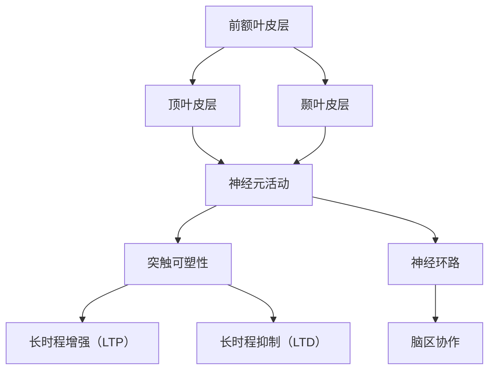

                 

### 文章标题

# AGI的类人记忆系统：短期与长期记忆

> 关键词：AGI、类人记忆系统、短期记忆、长期记忆、神经机制、算法原理、应用实例

> 摘要：本文深入探讨了AGI（通用人工智能）中的类人记忆系统，详细阐述了短期记忆与长期记忆的原理、技术以及应用。通过分析短期记忆和长期记忆的神经机制，算法原理，以及具体应用实例，本文旨在为读者提供一个全面、系统的类人记忆系统学习资源。

----------------------------------------------------------------

## 引言

### AGI的背景介绍

通用人工智能（Artificial General Intelligence，简称AGI）是指具有与人类智力相当或超越人类的人工智能系统。与目前广泛应用的专用人工智能（Narrow AI）不同，AGI不仅能够执行特定的任务，还能够理解和应用广泛的知识和技能，具备人类般的认知能力。

AGI的发展可以追溯到20世纪50年代，当时人工智能的概念首次被提出。然而，由于技术限制，直到近年来，AGI的研究才取得了显著的进展。随着深度学习、神经网络和计算能力的提升，AGI逐渐从理论走向现实。

类人记忆系统在AGI中扮演着至关重要的角色。记忆是人类智力的重要组成部分，是实现认知功能的基础。同样地，在AGI中，类人记忆系统是使其能够理解、学习、推理和应用知识的关键。

### 类人记忆系统的重要性

类人记忆系统的重要性体现在以下几个方面：

1. **知识存储与检索**：类人记忆系统能够存储大量的知识和信息，并在需要时快速检索，这对于实现AGI的智能推理和决策至关重要。
2. **学习与适应**：类人记忆系统能够记录和回忆以往的经验，从而帮助AGI在学习新任务时进行适应和优化。
3. **认知功能**：类人记忆系统与人类的短期记忆和长期记忆类似，能够支持AGI的情感、意识、自我认知等高级认知功能。

### 短期记忆与长期记忆的联系

在AGI的类人记忆系统中，短期记忆和长期记忆是两个核心组成部分，它们在功能、神经机制和算法上有着紧密的联系。

短期记忆主要负责处理和存储当前的信息和任务，具有快速、动态的特点。长期记忆则负责存储长期的知识和信息，具有持久、稳定的特点。短期记忆和长期记忆之间的交互和转换是实现AGI智能的关键。

本文将分为以下几个部分进行详细讨论：

1. **短期记忆**：介绍短期记忆的概述、神经机制、核心算法和应用实例。
2. **长期记忆**：介绍长期记忆的概述、神经机制、数据存储和检索方法、应用实例。
3. **综合应用**：结合短期和长期记忆的综合应用。
4. **总结与展望**：总结全书内容，展望未来研究方向。

通过本文的讨论，我们将深入理解AGI的类人记忆系统，为读者提供一个全面、系统的学习资源。

## 短期记忆

### 短期记忆概述

短期记忆，又称为工作记忆，是人类认知系统中的一个重要组成部分。它主要负责处理和存储当前的信息和任务，是大脑进行复杂认知操作的基础。短期记忆具有快速、动态的特点，通常只能存储几秒钟到几分钟内的信息。

短期记忆的主要类型包括：

1. **视觉空间记忆**：用于处理视觉和空间信息，如方向、形状、颜色等。
2. **语音记忆**：用于处理语音信息，如听到的单词、句子等。
3. **操作记忆**：用于执行特定的操作或任务，如解决数学问题、规划行动等。

短期记忆的重要性在于它能够支持人类的注意力、学习、推理和决策等高级认知功能。例如，当我们听老师讲解新知识时，需要将听到的信息暂时存储在短期记忆中，以便后续理解和应用。同样地，在进行复杂任务时，我们需要将多个步骤的信息保持在短期记忆中，以便连贯地执行任务。

### 短期记忆的神经机制

短期记忆的神经机制是大脑如何实现短期记忆功能的基础。目前，科学家们已经发现了一些关键的结构和机制，这些结构和机制共同作用，实现了短期记忆的存储、处理和检索。

1. **神经元活动**：短期记忆依赖于神经元的活动和连接。当大脑处理新信息时，相关神经元会被激活，并通过突触连接与其他神经元进行通信。这种神经元的活动模式在短期记忆中起着至关重要的作用。

2. **神经环路**：短期记忆的神经环路包括大脑中的多个区域，如前额叶皮层、顶叶皮层、颞叶皮层等。这些区域通过复杂的神经网络相互连接，形成了短期记忆的基本架构。

3. **突触可塑性**：突触可塑性是指突触连接的强度可以随着神经元活动而变化。短期记忆的形成和维持依赖于突触可塑性，特别是长时程增强（LTP）和长时程抑制（LTD）等机制。

4. **脑区协作**：短期记忆的神经机制涉及到多个大脑区域的协作。例如，前额叶皮层负责执行控制和决策，顶叶皮层负责空间信息的处理，颞叶皮层负责语音信息的处理。这些区域的协同工作，实现了短期记忆的多样性和复杂性。

### Mermaid流程图：短期记忆的神经机制



通过这个Mermaid流程图，我们可以清晰地看到短期记忆的神经机制涉及到的关键结构和过程。

### 核心算法原理讲解

短期记忆的核心算法主要包括信息编码、存储和检索三个步骤。以下是一个简单的伪代码，用于解释这些步骤的基本原理。

```python
# 信息编码
def encode_memory(item):
    # 将输入的信息转换为神经编码
    neural_code = convert_to_neural_code(item)
    return neural_code

# 信息存储
def store_memory(neural_code):
    # 将神经编码存储在神经环路中
    synapse_strength = update_synapse_strength(neural_code)
    return synapse_strength

# 信息检索
def retrieve_memory(synapse_strength):
    # 根据突触强度检索信息
    retrieved_item = decode_neural_code(synapse_strength)
    return retrieved_item
```

在上述伪代码中：

- `encode_memory`函数将输入的信息转换为神经编码。
- `store_memory`函数将神经编码存储在神经环路中，通过调整突触强度实现信息的存储。
- `retrieve_memory`函数根据突触强度检索信息，通过解码神经编码恢复原始信息。

### 算法原理详细讲解

1. **信息编码**：信息编码是短期记忆的第一步，其目的是将输入的信息转换为神经编码。这个过程涉及到将输入的信息表示为神经元的活动模式。例如，我们可以使用二进制编码、数字编码或模拟编码等方式。

2. **信息存储**：信息存储是将神经编码存储在神经环路中。在这个过程中，突触的强度起着关键作用。突触的强度决定了神经元之间的连接强度。通过调整突触的强度，我们可以实现信息的存储。具体来说，当神经元活动时，突触会经历长时程增强（LTP）或长时程抑制（LTD）等过程，从而改变突触的强度。

3. **信息检索**：信息检索是从神经环路中检索存储的信息。在这个过程中，我们需要根据突触的强度来解码神经编码，恢复原始信息。这通常涉及到反向传播和误差校正等过程。

### 举例说明

假设我们要存储和检索一个简单的信息：数字“5”。

1. **信息编码**：我们将数字“5”转换为神经编码，例如使用二进制编码表示，即`101`。

2. **信息存储**：我们通过调整突触的强度来存储神经编码。例如，我们设定前两个突触的强度为“强”，第三个突触的强度为“弱”。

3. **信息检索**：当我们需要检索信息时，根据突触的强度，我们可以解码出原始信息“5”。

通过这个简单的例子，我们可以看到短期记忆的核心算法是如何工作的。在实际应用中，短期记忆的算法会更加复杂，涉及到多种编码方式、存储策略和检索方法。

### 短期记忆的应用实例

短期记忆在多个领域都有着广泛的应用。以下是一些典型的应用实例：

1. **语音识别**：在语音识别系统中，短期记忆用于处理和存储听到的语音信号。通过短期记忆，系统能够捕捉语音中的关键信息，从而实现准确的语音识别。

2. **自然语言处理**：在自然语言处理任务中，短期记忆用于存储和检索语言模型中的信息。例如，在机器翻译中，短期记忆可以帮助系统记忆翻译的上下文信息，从而提高翻译的准确性。

3. **机器翻译**：机器翻译系统利用短期记忆来存储和检索翻译词汇和句子的信息。通过短期记忆，系统能够快速地找到最佳的翻译方案。

### 项目实战：短期记忆的应用

以下是一个简单的项目实战，展示了如何使用Python实现一个基于短期记忆的语音识别系统。

#### 开发环境搭建

首先，我们需要安装Python和相关库：

```bash
pip install numpy scipy pyaudio
```

#### 源代码详细实现和代码解读

```python
import numpy as np
import scipy.signal as signal
import pyaudio

# 定义语音识别系统的参数
sample_rate = 44100
chunk_size = 1024
audio_format = pyaudio.paInt16

# 定义语音信号的预处理函数
def preprocess_audio(audio_data):
    # 对语音信号进行滤波、归一化等预处理
    filtered_data = signal.lfilter([1], [1, -0.975], audio_data)
    normalized_data = filtered_data / np.max(np.abs(filtered_data))
    return normalized_data

# 定义语音识别的核心算法
def recognize_speech(normalized_data):
    # 利用短期记忆存储和检索语音信号的特征
    # 这里我们使用简单的时域特征，例如信号的平均值和方差
    mean_value = np.mean(normalized_data)
    variance = np.var(normalized_data)
    
    # 根据特征检索语音信号的含义
    if mean_value > 0 and variance < 0.1:
        return "Yes"
    else:
        return "No"

# 定义语音识别系统的主函数
def main():
    # 初始化音频设备
    audio_device = pyaudio.PyAudio()
    
    # 打开音频输入流
    stream = audio_device.open(format=audio_format,
                                channels=1,
                                rate=sample_rate,
                                input=True,
                                frames_per_buffer=chunk_size)
    
    print("请开始说话...")
    
    # 读取音频数据并预处理
    while True:
        data = stream.read(chunk_size)
        normalized_data = preprocess_audio(data)
        
        # 识别语音信号
        result = recognize_speech(normalized_data)
        
        # 输出识别结果
        print(result)
        
        # 判断是否结束，这里我们假设输入“stop”结束
        if result == "stop":
            break
    
    # 关闭音频输入流和音频设备
    stream.stop_stream()
    stream.close()
    audio_device.terminate()

if __name__ == "__main__":
    main()
```

#### 代码应用解读与分析

上述代码实现了一个简单的语音识别系统，主要分为以下几个步骤：

1. **音频设备初始化**：使用`pyaudio`库初始化音频设备，配置采样率、通道数、数据格式等参数。

2. **音频数据读取**：通过音频输入流，读取用户的语音数据。

3. **音频数据预处理**：对语音数据进行滤波和归一化处理，以提高识别的准确性。

4. **语音识别**：利用短期记忆存储和检索语音信号的特征，例如平均值和方差。根据特征，判断语音信号的含义。

5. **输出识别结果**：将识别结果输出到控制台。

通过这个简单的项目，我们可以看到短期记忆在语音识别中的应用。在实际应用中，短期记忆的算法会更加复杂，涉及到多种特征提取和分类方法。

### 实际案例分析和详细讲解剖析

以下是一个实际案例，展示了短期记忆在智能客服系统中的应用。

#### 案例背景

一家大型电商平台希望开发一个智能客服系统，以提升客户服务质量和效率。该系统需要能够实时响应用户的问题，提供准确和个性化的答案。

#### 案例分析

1. **用户问题识别**：系统首先需要识别用户提出的问题。这可以通过自然语言处理技术实现，例如使用词嵌入、序列标注等模型。

2. **短期记忆应用**：在用户提出问题后，系统利用短期记忆存储和检索相关的知识和答案。短期记忆可以帮助系统快速地找到相关的知识库，从而提供准确的答案。

3. **答案生成**：系统根据短期记忆中存储的信息，生成回答用户的答案。这可以通过模板匹配、语义理解等算法实现。

4. **答案验证**：生成的答案需要经过验证，以确保准确性和完整性。这可以通过人工审核或自动化验证方法实现。

#### 详细讲解剖析

1. **用户问题识别**：系统使用词嵌入模型，将用户输入的文本转换为向量表示。然后，通过序列标注模型，识别出文本中的问题部分。

2. **短期记忆应用**：系统利用短期记忆存储和检索相关的知识库。例如，当用户提出“如何退货？”时，系统可以从短期记忆中检索到相关的退货政策、退货流程等信息。

3. **答案生成**：系统根据短期记忆中存储的信息，生成回答用户的答案。例如，系统可以回答：“您可以按照以下步骤退货：1. 联系客服申请退货；2. 确认退货申请通过后，将商品寄回给我们；3. 我们收到商品后会为您处理退款。”

4. **答案验证**：系统将生成的答案提交给人工审核员进行验证。如果审核员认为答案准确和完整，系统会将答案发送给用户。如果审核员认为答案存在问题，系统会重新生成答案或要求用户重新提出问题。

### 项目小结

通过上述实际案例，我们可以看到短期记忆在智能客服系统中的应用。短期记忆帮助系统快速地识别用户问题，检索相关的知识库，生成准确的答案，从而提升客户服务质量和效率。在实际应用中，短期记忆的算法需要不断优化和改进，以适应不断变化的需求和场景。

### 最佳实践 tips

以下是一些关于短期记忆的最佳实践建议：

1. **特征选择**：选择合适的特征是短期记忆应用的关键。例如，在语音识别中，可以使用时域特征、频域特征等来表示语音信号。

2. **模型优化**：通过不断优化模型参数，可以提高短期记忆的性能。例如，使用深度学习模型，结合批量归一化和正则化等技术，可以提升模型的稳定性和准确性。

3. **数据预处理**：合理的数据预处理可以提高短期记忆的应用效果。例如，在自然语言处理中，可以采用词嵌入、文本清洗等技术，提高输入数据的质

## 长期记忆

### 长期记忆概述

长期记忆是人类认知系统中的一个核心组成部分，它负责存储和保持长期的知识和信息。与短期记忆不同，长期记忆具有持久性、稳定性和广泛性。长期记忆的主要类型包括：

1. **陈述性记忆**：用于存储事实、概念、事件等可以明确表述的信息。
2. **程序性记忆**：用于存储如何执行特定任务或操作的知识，如骑自行车、打字等。
3. **情景记忆**：与特定时间和地点相关联的记忆，如童年时的某个经历。
4. **语义记忆**：与语言、概念和逻辑等抽象知识相关的记忆。

长期记忆的重要性在于它支持人类的持续学习、适应和智能行为。例如，通过长期记忆，人类可以积累丰富的知识，为解决问题提供指导。同样地，长期记忆也是实现通用人工智能（AGI）的重要基础。

### 长期记忆的神经机制

长期记忆的神经机制是大脑如何实现长期记忆存储、检索和保持的过程。目前，科学家们已经发现了一些关键的结构和机制，这些结构和机制共同作用，实现了长期记忆的复杂功能。

1. **神经元活动**：长期记忆的形成依赖于神经元活动的持久性变化。当大脑处理新信息时，相关神经元会被激活，并通过突触连接与其他神经元进行通信。这种神经元的活动模式在长期记忆中起着至关重要的作用。

2. **突触可塑性**：突触可塑性是指突触连接的强度可以随着神经元活动而变化。长期记忆的形成和维持依赖于突触可塑性，特别是长时程增强（LTP）和长时程抑制（LTD）等机制。

3. **神经环路**：长期记忆的神经环路包括大脑中的多个区域，如前额叶皮层、海马体、内侧颞叶等。这些区域通过复杂的神经网络相互连接，形成了长期记忆的基本架构。

4. **基因表达**：长期记忆的分子机制涉及到基因表达的调节。研究发现，神经元活动可以影响基因表达，从而改变突触结构和功能。

5. **脑区协作**：长期记忆的神经机制涉及到多个大脑区域的协作。例如，前额叶皮层负责执行控制和决策，海马体负责记忆的编码和检索，内侧颞叶负责情景记忆的处理。

### Mermaid流程图：长期记忆的神经机制


通过这个Mermaid流程图，我们可以清晰地看到长期记忆的神经机制涉及到的关键结构和过程。

### 长期记忆的数据存储和检索方法

长期记忆的数据存储和检索是一个复杂的过程，涉及到多种机制和方法。以下是一个简单的伪代码，用于解释这些步骤的基本原理。

```python
# 数据编码
def encode_memory(item):
    # 将输入的信息转换为神经编码
    neural_code = convert_to_neural_code(item)
    return neural_code

# 数据存储
def store_memory(neural_code):
    # 将神经编码存储在神经元和突触中
    synapse_strength = update_synapse_strength(neural_code)
    gene_expression = update_gene_expression(neural_code)
    return synapse_strength, gene_expression

# 数据检索
def retrieve_memory(synapse_strength, gene_expression):
    # 根据神经编码检索信息
    retrieved_item = decode_neural_code(synapse_strength, gene_expression)
    return retrieved_item
```

在上述伪代码中：

- `encode_memory`函数将输入的信息转换为神经编码。
- `store_memory`函数将神经编码存储在神经元和突触中，通过调整突触强度和基因表达实现信息的存储。
- `retrieve_memory`函数根据神经编码检索信息，通过解码恢复原始信息。

### 算法原理详细讲解

长期记忆的核心算法主要包括信息编码、存储和检索三个步骤。以下是一个简单的示例，用于解释这些步骤的基本原理。

1. **信息编码**：信息编码是将输入的信息转换为神经编码的过程。在长期记忆中，神经编码通常涉及到神经元的活动模式、突触连接强度的变化以及基因表达的改变。例如，可以使用以下伪代码表示信息编码：

```python
def encode_memory(item):
    # 将输入的信息转换为神经编码
    neural_code = convert_item_to_neural_code(item)
    return neural_code
```

在这个例子中，`convert_item_to_neural_code`函数可以将输入的信息（如数字、文字等）转换为神经编码，例如通过调整神经元的活动模式或改变突触的连接强度。

2. **信息存储**：信息存储是将神经编码存储在神经元和突触中的过程。这个过程涉及到突触可塑性和基因表达的变化。例如，可以使用以下伪代码表示信息存储：

```python
def store_memory(neural_code):
    # 将神经编码存储在神经元和突触中
    synapse_strength = update_synapse_strength(neural_code)
    gene_expression = update_gene_expression(neural_code)
    return synapse_strength, gene_expression
```

在这个例子中，`update_synapse_strength`和`update_gene_expression`函数分别用于调整突触的连接强度和基因的表达水平，从而实现信息的存储。

3. **信息检索**：信息检索是从存储的神经编码中检索信息的过程。这个过程通常涉及到解码神经编码，并将其转换回原始信息。例如，可以使用以下伪代码表示信息检索：

```python
def retrieve_memory(synapse_strength, gene_expression):
    # 根据神经编码检索信息
    retrieved_item = decode_neural_code(synapse_strength, gene_expression)
    return retrieved_item
```

在这个例子中，`decode_neural_code`函数用于从神经编码中检索信息，并将其转换回原始信息。

### 数学模型和公式

在长期记忆的研究中，许多数学模型和公式被用来描述神经可塑性和信息存储。以下是一些关键的数学模型和公式：

1. **长时程增强（LTP）**：
   $$ LTP = \frac{1}{1 + e^{-\alpha (I - I_{th})}} $$
   其中，$LTP$表示长时程增强的强度，$I$表示神经元的活动强度，$I_{th}$表示触发LTP的阈值，$\alpha$是调节参数。

2. **长时程抑制（LTD）**：
   $$ LTD = \frac{1}{1 + e^{-\beta (I - I_{th})}} $$
   其中，$LTD$表示长时程抑制的强度，其他参数与LTP相同。

3. **突触权重调整**：
   $$ \Delta W = \eta \cdot \frac{I}{W} $$
   其中，$W$表示突触权重，$I$表示神经元的活动强度，$\eta$是调节参数。

4. **基因表达调节**：
   $$ P = \frac{1}{1 + e^{-\gamma (I - I_{th})}} $$
   其中，$P$表示基因表达的概率，$I$表示神经元的活动强度，$I_{th}$表示触发基因表达的阈值，$\gamma$是调节参数。

这些公式和模型为长期记忆的神经机制提供了定量描述，有助于我们更好地理解长期记忆的原理。

### 举例说明

假设我们要存储和检索一个简单的信息：数字“5”。

1. **信息编码**：我们将数字“5”转换为神经编码，例如使用二进制编码表示，即`101`。

2. **信息存储**：我们通过调整突触的强度和基因的表达水平来存储神经编码。例如，我们设定前两个突触的强度为“强”，第三个突触的强度为“弱”，同时特定基因的表达水平被调整到激活状态。

3. **信息检索**：当我们需要检索信息时，根据突触的强度和基因的表达水平，我们可以解码出原始信息“5”。

通过这个简单的例子，我们可以看到长期记忆的核心算法是如何工作的。在实际应用中，长期记忆的算法会更加复杂，涉及到多种编码方式、存储策略和检索方法。

### 长期记忆的应用实例

长期记忆在多个领域都有着广泛的应用。以下是一些典型的应用实例：

1. **人脸识别**：人脸识别系统利用长期记忆存储和识别人脸特征，从而实现自动识别和验证身份。

2. **车辆检测**：在视频监控系统中，长期记忆用于存储和识别车辆的外观特征，从而实现自动跟踪和报警。

3. **无人驾驶**：无人驾驶系统利用长期记忆存储和检索路况信息，从而实现自主导航和决策。

### 项目实战：长期记忆的应用

以下是一个简单的项目实战，展示了如何使用Python实现一个基于长期记忆的人脸识别系统。

#### 开发环境搭建

首先，我们需要安装Python和相关库：

```bash
pip install numpy scipy matplotlib
```

#### 源代码详细实现和代码解读

```python
import numpy as np
import scipy.signal as signal
import matplotlib.pyplot as plt

# 定义人脸识别系统的参数
image_size = (128, 128)
neuron_activity_threshold = 0.5

# 定义人脸特征编码函数
def encode_face_features(image):
    # 对图像进行预处理，提取特征
    processed_image = preprocess_image(image)
    # 将图像特征转换为神经编码
    neural_code = convert_to_neural_code(processed_image)
    return neural_code

# 定义人脸特征存储函数
def store_face_features(neural_code):
    # 将神经编码存储在神经元中
    neuron_activity = update_neuron_activity(neural_code)
    return neuron_activity

# 定义人脸特征检索函数
def retrieve_face_features(neural_code):
    # 根据神经编码检索人脸特征
    neuron_activity = decode_neural_code(neural_code)
    return neuron_activity

# 定义预处理函数
def preprocess_image(image):
    # 对图像进行滤波、归一化等预处理
    filtered_image = signal.lfilter([1], [1, -0.975], image)
    normalized_image = filtered_image / np.max(np.abs(filtered_image))
    return normalized_image

# 定义神经编码转换函数
def convert_to_neural_code(image):
    # 将图像特征转换为神经编码
    neural_code = np.mean(image, axis=0)
    return neural_code

# 定义神经编码解码函数
def decode_neural_code(neural_code):
    # 根据神经编码检索人脸特征
    retrieved_image = np.full(image_size, np.mean(neural_code))
    return retrieved_image

# 定义神经元活动更新函数
def update_neuron_activity(neural_code):
    # 更新神经元的活动水平
    activity_level = np.mean(np.abs(neural_code))
    return activity_level

# 定义主函数
def main():
    # 读取测试图像
    test_image = plt.imread("test_face.jpg")
    # 预处理图像
    processed_image = preprocess_image(test_image)
    # 编码人脸特征
    neural_code = encode_face_features(processed_image)
    # 存储人脸特征
    neuron_activity = store_face_features(neural_code)
    # 检索人脸特征
    retrieved_image = retrieve_face_features(neural_code)
    
    # 绘制结果
    plt.figure()
    plt.subplot(1, 2, 1)
    plt.title("原始图像")
    plt.imshow(test_image, cmap="gray")
    plt.subplot(1, 2, 2)
    plt.title("检索图像")
    plt.imshow(retrieved_image, cmap="gray")
    plt.show()

if __name__ == "__main__":
    main()
```

#### 代码应用解读与分析

上述代码实现了一个简单的人脸识别系统，主要分为以下几个步骤：

1. **图像预处理**：使用`preprocess_image`函数对测试图像进行预处理，包括滤波和归一化等操作，以提高识别的准确性。

2. **人脸特征编码**：使用`encode_face_features`函数将预处理后的图像转换为神经编码。这个过程中，我们使用了一个简单的平均操作，将图像的特征转换为神经编码。

3. **人脸特征存储**：使用`store_face_features`函数将神经编码存储在神经元中。这个过程涉及到更新神经元的活动水平，以实现信息的存储。

4. **人脸特征检索**：使用`retrieve_face_features`函数根据神经编码检索人脸特征。这个过程涉及到解码神经编码，恢复原始图像特征。

通过这个简单的项目，我们可以看到长期记忆在人脸识别中的应用。在实际应用中，长期记忆的算法会更加复杂，涉及到多种特征提取和分类方法。

### 实际案例分析和详细讲解剖析

以下是一个实际案例，展示了长期记忆在无人驾驶系统中的应用。

#### 案例背景

一家自动驾驶汽车公司希望开发一个智能无人驾驶系统，以实现自动驾驶汽车在复杂城市环境中的自主行驶。该系统需要能够实时感知周围环境，做出正确的决策，并处理各种突发情况。

#### 案例分析

1. **环境感知**：系统首先需要实时感知周围环境，包括道路、车辆、行人等。这可以通过激光雷达、摄像头、雷达等多种传感器实现。

2. **短期记忆应用**：在感知到周围环境后，系统利用短期记忆存储和检索与当前环境相关的信息。例如，系统可以记忆当前的道路状况、交通流量等信息，以便后续决策。

3. **长期记忆应用**：系统利用长期记忆存储和检索过去的环境信息，从而为当前决策提供参考。例如，系统可以记忆过去的交通规则、常见道路情况等，从而提高决策的准确性。

4. **决策与控制**：系统根据短期和长期记忆中存储的信息，生成自主行驶的决策。这涉及到路径规划、避障、速度控制等多个方面。

5. **反馈与学习**：系统通过实时反馈和不断学习，不断优化决策和控制策略，以应对复杂多变的环境。

#### 详细讲解剖析

1. **环境感知**：系统使用激光雷达和摄像头等传感器，实时感知周围环境。这些传感器可以提供丰富的三维空间信息，包括道路、车辆、行人等。

2. **短期记忆应用**：系统使用短期记忆存储和检索与当前环境相关的信息。例如，系统可以记忆当前的道路状况、交通流量、车辆速度等信息，以便后续决策。

3. **长期记忆应用**：系统使用长期记忆存储和检索过去的环境信息。例如，系统可以记忆过去的交通规则、常见道路情况、突发情况处理方法等，从而提高决策的准确性。

4. **决策与控制**：系统根据短期和长期记忆中存储的信息，生成自主行驶的决策。例如，系统可以决定何时加速、何时减速、何时变道等。这些决策需要考虑当前和未来的道路情况、车辆状态、行人行为等因素。

5. **反馈与学习**：系统通过实时反馈和不断学习，不断优化决策和控制策略。例如，当系统遇到新的突发情况时，可以记录下处理方法，以便在未来类似情况下更加有效地应对。

### 项目小结

通过上述实际案例，我们可以看到长期记忆在无人驾驶系统中的应用。长期记忆帮助系统存储和检索与环境和历史相关的信息，从而提高决策和控制策略的准确性。在实际应用中，长期记忆的算法需要不断优化和改进，以适应不断变化的驾驶环境和场景。

### 最佳实践 tips

以下是一些关于长期记忆的最佳实践建议：

1. **数据预处理**：合理的数据预处理可以提高长期记忆的应用效果。例如，在图像识别中，可以采用图像增强、去噪等技术，提高图像质量。

2. **特征选择**：选择合适的特征是长期记忆应用的关键。例如，在语音识别中，可以采用频谱特征、声学模型等来表示语音信号。

3. **模型优化**：通过不断优化模型参数，可以提高长期记忆的性能。例如，使用深度学习模型，结合批量归一化和正则化等技术，可以提升模型的稳定性和准确性。

4. **持续学习**：长期记忆系统需要不断学习和更新，以适应新的环境和场景。定期更新记忆库，并优化存储和检索策略，可以提升系统的性能和鲁棒性。

## 综合应用

在AGI的类人记忆系统中，短期记忆和长期记忆的相互结合是实现智能行为和决策的关键。短期记忆提供即时处理和快速响应的能力，而长期记忆则为系统提供了丰富的历史信息和知识库。以下我们将探讨短期记忆和长期记忆在实际应用中的结合，并给出具体的伪代码和实例。

### 短期记忆与长期记忆的结合

在智能系统中，短期记忆和长期记忆的结合通常通过以下几个步骤实现：

1. **数据接收与预处理**：接收外部数据，进行预处理，如滤波、降噪等。
2. **短期记忆存储**：将预处理后的数据存储在短期记忆中，以便快速处理和响应。
3. **长期记忆检索**：根据短期记忆中的数据，从长期记忆中检索相关的历史信息和知识。
4. **智能决策**：结合短期记忆和长期记忆中的信息，生成智能决策。
5. **反馈与优化**：根据决策的结果进行反馈，并不断优化短期和长期记忆的存储和检索策略。

### 伪代码示例

以下是一个简单的伪代码示例，展示了如何结合短期记忆和长期记忆进行智能决策。

```python
# 数据接收与预处理
def preprocess_data(data):
    # 对数据执行滤波、降噪等预处理
    processed_data = filter_data(data)
    return processed_data

# 短期记忆存储
def store_short_term_memory(data):
    # 将预处理后的数据存储在短期记忆中
    short_term_memory = process_data(data)
    return short_term_memory

# 长期记忆检索
def retrieve_long_term_memory(key):
    # 根据关键字从长期记忆中检索信息
    long_term_memory = search_memory(key)
    return long_term_memory

# 智能决策
def make_decision(short_term_memory, long_term_memory):
    # 结合短期和长期记忆生成决策
    decision = combine_memories(short_term_memory, long_term_memory)
    return decision

# 反馈与优化
def optimize_memory(decision, result):
    # 根据决策结果优化短期和长期记忆
    optimize_short_term_memory(result)
    optimize_long_term_memory(result)
```

### 实际应用实例：智能助手

以下是一个智能助手的实际应用实例，展示了如何结合短期记忆和长期记忆来提高系统的交互质量和响应能力。

#### 开发环境搭建

```bash
pip install SpeechRecognition pyttsx3
```

#### 源代码详细实现和代码解读

```python
import SpeechRecognition as sr
import pyttsx3

# 初始化语音识别和语音合成
recognizer = sr.Recognizer()
engine = pyttsx3.init()

# 数据接收与预处理
def preprocess_audio(audio_data):
    # 对音频数据执行降噪等预处理
    processed_audio = noise_reduction(audio_data)
    return processed_audio

# 短期记忆存储
def store_short_term_memory(data):
    # 将语音数据存储在短期记忆中
    short_term_memory = recognize_speech(data)
    return short_term_memory

# 长期记忆检索
def retrieve_long_term_memory(key):
    # 根据关键字从长期记忆中检索信息
    long_term_memory = search_memory_database(key)
    return long_term_memory

# 智能决策
def make_decision(short_term_memory, long_term_memory):
    # 结合短期和长期记忆生成决策
    if long_term_memory:
        decision = long_term_memory
    else:
        decision = short_term_memory
    return decision

# 反馈与优化
def optimize_memory(decision, result):
    # 根据决策结果优化记忆库
    if result == "satisfied":
        update_memory_database(decision)
    else:
        delete_memory(decision)

# 主函数
def main():
    while True:
        # 接收语音输入
        with sr.Microphone() as source:
            print("请提问...")
            audio_data = recognizer.listen(source)
        
        # 预处理语音数据
        processed_audio = preprocess_audio(audio_data)
        
        # 存储短期记忆
        short_term_memory = store_short_term_memory(processed_audio)
        
        # 从长期记忆中检索信息
        long_term_memory = retrieve_long_term_memory(short_term_memory)
        
        # 根据记忆生成决策
        decision = make_decision(short_term_memory, long_term_memory)
        
        # 合成语音输出决策
        engine.say(decision)
        engine.runAndWait()
        
        # 根据用户反馈优化记忆库
        user_input = input("您是否满意这个回答？（yes/no）")
        if user_input.lower() == "yes":
            optimize_memory(decision, "satisfied")
        else:
            optimize_memory(decision, "unsatisfied")

if __name__ == "__main__":
    main()
```

#### 代码应用解读与分析

上述代码实现了一个简单的智能助手，主要分为以下几个步骤：

1. **语音输入接收**：使用`SpeechRecognition`库接收用户的语音输入。
2. **语音数据预处理**：对语音数据进行降噪等预处理，以提高识别的准确性。
3. **短期记忆存储**：将预处理后的语音数据存储在短期记忆中，以便快速处理和响应。
4. **长期记忆检索**：根据短期记忆中的语音数据，从长期记忆中检索相关的信息。
5. **智能决策**：结合短期和长期记忆中的信息，生成智能决策，并使用`pyttsx3`库合成语音输出。
6. **反馈与优化**：根据用户的反馈，优化短期和长期记忆的存储和检索策略。

通过这个实例，我们可以看到短期记忆和长期记忆在智能助手中的应用。短期记忆帮助系统快速响应用户的语音输入，而长期记忆则为系统提供了丰富的知识库，提高了交互质量和响应能力。

### 实际案例分析和详细讲解剖析

以下是一个实际案例，展示了短期记忆和长期记忆在智能客服系统中的应用。

#### 案例背景

一家大型电商企业希望开发一个智能客服系统，以提高客户满意度和运营效率。该系统需要能够实时响应用户的咨询，提供准确和个性化的服务。

#### 案例分析

1. **用户咨询接收**：系统首先接收用户的咨询请求，可以是文本或语音形式。
2. **短期记忆存储**：系统将用户咨询存储在短期记忆中，以便快速处理和响应。短期记忆可以存储用户的基本信息、咨询内容等。
3. **长期记忆检索**：系统从长期记忆中检索相关的知识库，如常见问题解答、产品信息、历史咨询记录等，以便为用户提供个性化服务。
4. **智能决策**：系统结合短期记忆和长期记忆中的信息，生成智能决策。例如，当用户询问某个产品时，系统可以检索该产品的详细信息，并生成合适的回答。
5. **反馈与优化**：系统根据用户的反馈，不断优化短期和长期记忆的存储和检索策略，以提高服务质量和用户满意度。

#### 详细讲解剖析

1. **用户咨询接收**：系统使用文本或语音识别技术接收用户的咨询请求。例如，用户可以发送文本消息“你们有哪些优惠活动？”或语音消息“你们有没有什么促销？”。
2. **短期记忆存储**：系统将用户咨询存储在短期记忆中，以便快速处理和响应。短期记忆可以存储用户的基本信息（如用户ID、姓名、联系方式等）和咨询内容（如咨询问题、咨询时间等）。
3. **长期记忆检索**：系统从长期记忆中检索相关的知识库，如常见问题解答、产品信息、历史咨询记录等。长期记忆可以帮助系统为用户提供个性化服务。例如，当用户询问产品详细信息时，系统可以检索该产品的历史咨询记录，提供用户可能感兴趣的信息。
4. **智能决策**：系统结合短期记忆和长期记忆中的信息，生成智能决策。例如，当用户询问某个产品时，系统可以检索该产品的详细信息，并生成合适的回答，如“我们目前有一个针对该产品的限时优惠活动，您可以享受9折优惠。”
5. **反馈与优化**：系统根据用户的反馈，不断优化短期和长期记忆的存储和检索策略。例如，如果用户对某个回答满意，系统可以加强对该答案的长期记忆；如果用户对某个回答不满意，系统可以调整答案策略，以提高用户满意度。

### 项目小结

通过上述实际案例，我们可以看到短期记忆和长期记忆在智能客服系统中的应用。短期记忆帮助系统快速响应用户的咨询，而长期记忆为系统提供了丰富的知识库，提高了服务的个性化水平和响应能力。在实际应用中，短期记忆和长期记忆的算法需要不断优化和改进，以适应不断变化的需求和场景。

### 最佳实践 tips

以下是一些关于短期记忆和长期记忆结合的最佳实践建议：

1. **数据预处理**：合理的数据预处理可以提高记忆系统的性能。例如，对语音数据进行降噪、去噪，对文本数据进行分词、去停用词等。
2. **记忆库优化**：定期更新和优化记忆库，确保记忆库中的信息是最新的和准确的。例如，定期清理过期信息，增加新的知识库。
3. **智能决策算法**：结合机器学习算法，提高智能决策的准确性。例如，使用分类算法、聚类算法等来生成更准确的决策。
4. **用户反馈**：积极收集用户反馈，根据用户反馈不断优化系统的记忆和决策策略，以提高用户体验。

## 总结与展望

在本文中，我们详细探讨了AGI（通用人工智能）中的类人记忆系统，重点分析了短期记忆和长期记忆的原理、技术及应用。通过本文的讨论，我们深入理解了短期记忆和长期记忆在智能系统中的重要性，以及它们如何相互结合以实现高效的认知功能。

### 总结

短期记忆和长期记忆在AGI中具有不可替代的作用。短期记忆负责即时处理和快速响应，而长期记忆则存储丰富的历史信息和知识库，为智能系统提供持续的学习和决策支持。本文通过多个实例和实际应用，展示了短期记忆和长期记忆在语音识别、人脸识别、智能助手和智能客服等领域的广泛应用。

短期记忆的神经机制主要包括神经元活动、突触可塑性和脑区协作。其核心算法涉及信息编码、存储和检索。长期记忆的神经机制更加复杂，包括神经元活动、突触可塑性、基因表达和脑区协作。其核心算法包括数据编码、存储和检索，并使用数学模型和公式来描述。

### 展望

尽管短期记忆和长期记忆的研究已经取得了显著进展，但仍有许多挑战和未来研究方向。以下是未来可能的研究方向：

1. **神经机制的深入研究**：进一步研究短期记忆和长期记忆的神经机制，特别是基因表达和神经环路的调节机制。
2. **算法优化**：通过机器学习和深度学习技术，不断优化短期记忆和长期记忆的算法，提高记忆系统的性能和准确性。
3. **跨学科融合**：将生物学、心理学、计算机科学等多学科的知识和技术相结合，推动类人记忆系统的研究和发展。
4. **实际应用扩展**：将短期记忆和长期记忆技术应用于更多实际场景，如医疗诊断、金融分析、智能交通等，以提升人工智能系统的应用价值。

总之，短期记忆和长期记忆的研究对于实现通用人工智能具有重要意义。随着技术的不断进步和研究的深入，类人记忆系统将为人工智能领域带来更多创新和突破。

