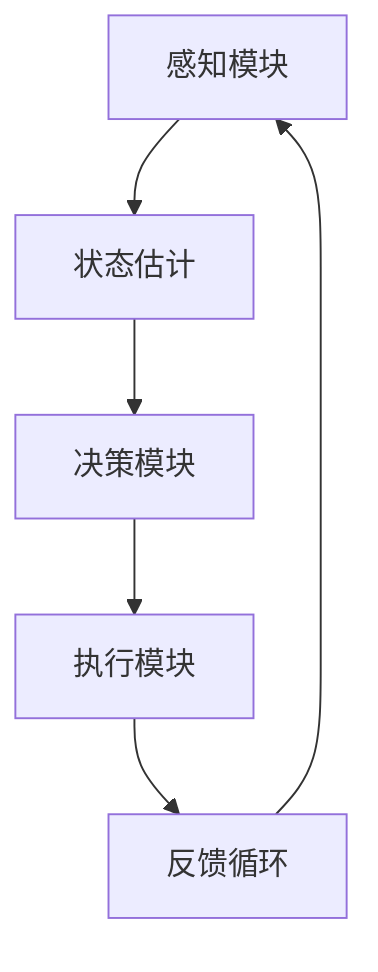
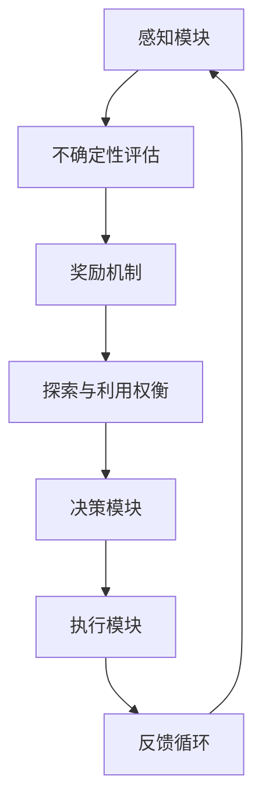

                 

### 文章标题

# AGI的自主探索与好奇心机制

### 关键词

- AGI
- 自主探索
- 好奇心机制
- 人工智能
- 算法
- 数学模型

### 摘要

本文深入探讨了人工通用智能（AGI）中的自主探索与好奇心机制。首先，我们回顾了AGI的定义及其对人工智能的重要性。随后，我们详细阐述了自主探索和好奇心机制的核心概念，展示了它们在AGI系统中的架构和作用。通过伪代码和数学模型的讲解，我们深入剖析了这些机制的工作原理。接下来，我们通过实际项目案例展示了如何开发和应用这些机制。文章最后对AGI自主探索与好奇心机制的未来发展进行了展望，并提供了相关的最佳实践和拓展阅读建议。

### 第一部分：AGI基础与自主探索

#### 1.1 什么是AGI？

人工通用智能（Artificial General Intelligence，简称AGI）是指一种能够像人类一样执行任何智力任务的智能系统。与当前普遍存在的人工智能（AI）不同，AGI不仅仅能在特定任务上表现出色，而是能够在各种不同领域灵活应用，具备广泛的认知能力。AGI的目标是实现一种智能体，它能够在没有明确编程的情况下解决新的问题。

AGI的核心特点包括：

1. **普遍适应性**：AGI可以理解和执行各种类型的任务，而不仅仅是特定领域内的任务。
2. **自我学习**：AGI具备自我学习能力，可以从经验中学习和适应新环境。
3. **灵活迁移**：AGI能够将一个领域中的知识迁移到另一个领域，而不仅仅是局限于某一特定领域。

目前，AGI仍然是一个研究中的前沿领域，尽管在许多方面取得了显著进展，但离实现真正的AGI还有很长的路要走。

#### 1.2 自主探索的重要性

自主探索（Autonomous Exploration）是AGI实现的关键要素之一。它指的是智能系统在没有外部指导的情况下，主动探索其环境以获取新知识和经验的能力。自主探索的重要性体现在以下几个方面：

1. **知识获取**：自主探索使AGI能够从环境中获取丰富的信息，从而扩大其知识库。
2. **适应性**：通过自主探索，AGI可以更好地适应新环境和变化，提高其生存能力。
3. **创新性**：自主探索鼓励AGI进行创新性思考，从而推动技术进步和问题解决。

在AGI系统中，自主探索不仅仅是一个辅助功能，而是核心智能的体现。只有通过自主探索，AGI才能逐渐接近人类的智能水平。

#### 1.3 自主探索的基本框架

自主探索在AGI系统中通常包括以下几个关键组成部分：

1. **感知模块**：负责获取环境中的信息，如图像、声音、文本等。
2. **状态估计**：利用感知模块获取的信息，对当前环境状态进行估计。
3. **决策模块**：根据当前状态，智能系统决定采取何种行动。
4. **执行模块**：执行决策模块产生的行动。
5. **反馈循环**：通过执行后的结果，对感知模块、状态估计和决策模块进行调整和优化。

以下是一个简化的Mermaid流程图，展示了自主探索的基本框架：



通过这样的反馈循环，AGI系统能够不断地从环境中学习，提高其自主探索的能力。

### 第二部分：好奇心机制

#### 2.1 好奇心机制的定义

好奇心机制（Curiosity Mechanism）是指智能系统内建的一种动机和激励机制，驱使其主动探索未知领域，以获取新的信息和经验。好奇心机制是AGI自主探索的核心驱动力，它不仅增强了系统的学习动机，还提高了其在复杂环境中的适应性。

好奇心机制通常包括以下几个关键组成部分：

1. **奖励机制**：通过给予智能系统正奖励，激励其探索行为。
2. **不确定性评估**：评估探索行为带来的不确定性，从而调整探索策略。
3. **探索与利用权衡**：在探索新领域和利用现有知识之间进行权衡。

以下是一个简化的Mermaid流程图，展示了好奇心机制的核心组成部分：



通过这样的结构，好奇心机制能够引导AGI系统主动探索未知领域，提高其自主探索的能力。

#### 2.2 好奇心机制的核心原理

好奇心机制的核心原理在于激励智能系统主动探索未知领域。以下是好奇心机制的一些关键原理：

1. **奖励机制**：好奇心机制通过奖励系统来激励智能系统的探索行为。当智能系统执行探索行为时，会获得正奖励，从而增强其探索动机。
2. **不确定性评估**：智能系统会评估其当前状态下的不确定性，并根据不确定性大小调整探索策略。高不确定性意味着潜在的新知识，因此智能系统更倾向于探索这些领域。
3. **探索与利用权衡**：在探索新领域和利用现有知识之间，智能系统需要进行权衡。当现有知识不足以解决问题时，系统倾向于探索新知识；当现有知识已经足够时，系统更倾向于利用现有知识。

这些原理共同作用，使得好奇心机制能够有效地激励智能系统进行自主探索，提高其学习效率和适应性。

#### 2.3 好奇心机制的计算模型

好奇心机制的计算模型通常基于以下核心概念：

1. **奖励函数**：奖励函数用于计算智能系统执行某项任务时的奖励。常见的奖励函数包括基于成功概率的奖励函数和基于不确定性减少的奖励函数。
2. **不确定性度量**：不确定性度量用于评估智能系统在当前状态下的不确定性。常见的不确定性度量包括熵、条件熵和KL散度。
3. **探索与利用平衡系数**：探索与利用平衡系数用于调整探索行为和利用行为的权重。高平衡系数意味着智能系统更倾向于探索，低平衡系数则意味着智能系统更倾向于利用现有知识。

以下是一个简化的伪代码，展示了好奇心机制的计算模型：

```plaintext
function curiosityMechanism(perception, state, action, rewardFunction, uncertaintyMeasure, balanceCoefficient):
    uncertainty = uncertaintyMeasure(state, action)
    reward = rewardFunction(action, state, uncertainty)
    balance = balanceCoefficient * uncertainty
    if exploration > balance:
        # 探索行为
        performAction(action, perception, state, reward)
    else:
        # 利用行为
        bestAction = chooseBestAction(state, rewardFunction)
        performAction(bestAction, perception, state, reward)
```

通过这样的计算模型，好奇心机制能够有效地激励智能系统进行自主探索，并在探索和利用之间进行平衡。

### 第三部分：核心算法原理讲解

#### 3.1 自主探索算法原理

自主探索算法是AGI系统中实现自主探索的核心算法。以下是自主探索算法的一些关键原理：

1. **目标导向**：自主探索算法通常基于目标导向的框架，智能系统在探索过程中始终以实现目标为核心。
2. **决策树**：自主探索算法通常采用决策树模型来选择探索路径。每个节点代表一个可能的探索动作，每个叶子节点代表一个探索结果。
3. **回报评估**：通过评估探索动作的回报，自主探索算法能够调整探索策略，以最大化长期回报。

以下是一个简化的伪代码，展示了自主探索算法的基本框架：

```plaintext
function autonomousExploration(environment, goal):
    currentNode = environment.getStartState()
    while currentNode is not goal:
        actions = environment.getActions(currentNode)
        rewards = []
        for action in actions:
            nextState, reward = environment.step(currentNode, action)
            rewards.append(reward)
        bestAction = chooseBestAction(actions, rewards)
        currentNode = environment.step(currentNode, bestAction)
    return currentNode
```

通过这样的算法，智能系统能够在复杂环境中自主探索，并逐步接近目标。

#### 3.2 好奇心机制算法

好奇心机制算法是AGI系统中实现好奇心激励的核心算法。以下是好奇心机制算法的一些关键原理：

1. **奖励函数**：好奇心机制算法采用奖励函数来激励探索行为。奖励函数通常基于不确定性评估，奖励越高意味着探索的价值越大。
2. **探索与利用平衡**：好奇心机制算法通过探索与利用平衡系数来调整探索行为和利用行为的权重。探索系数越高，智能系统越倾向于探索。
3. **决策更新**：好奇心机制算法通过不断更新决策策略，以适应环境变化。

以下是一个简化的伪代码，展示了好奇心机制算法的基本框架：

```plaintext
function curiosityAlgorithm(state, action, rewardFunction, explorationCoefficient):
    uncertainty = rewardFunction(action, state)
    reward = explorationCoefficient * uncertainty
    return reward
```

通过这样的算法，智能系统能够根据好奇心激励，主动探索未知领域。

### 第四部分：数学模型和公式讲解

#### 4.1 自主探索的数学模型

自主探索算法的核心是奖励函数和不确定性度量。以下是两个常用的数学模型：

1. **奖励函数**：基于不确定性的奖励函数可以表示为：

   $$R(s, a) = \frac{1}{1 + e^{-\beta \cdot \ln p(s'|s, a)}}$$

   其中，$s$ 是当前状态，$a$ 是动作，$s'$ 是下一状态，$p(s'|s, a)$ 是在状态 $s$ 下执行动作 $a$ 后转移到状态 $s'$ 的概率，$\beta$ 是一个调节参数。

2. **不确定性度量**：常用的不确定性度量包括熵、条件熵和KL散度。以下是一个条件熵的例子：

   $$H(S|A) = -\sum_{s'} p(s'|A) \cdot \sum_{s''} p(s''|s', A) \cdot \ln p(s''|s', A)$$

   其中，$S$ 是状态集合，$A$ 是动作集合，$p(s'|A)$ 是在动作 $A$ 下状态 $s'$ 的概率，$p(s''|s', A)$ 是在状态 $s'$ 和动作 $A$ 下状态 $s''$ 的概率。

#### 4.2 好奇心机制的计算模型

好奇心机制的计算模型通常基于奖励函数和探索与利用平衡系数。以下是两个相关的数学模型：

1. **奖励函数**：基于不确定性的奖励函数可以表示为：

   $$R(s, a) = \frac{\gamma}{1 + \gamma \cdot \ln \alpha}$$

   其中，$\gamma$ 是不确定性系数，$\alpha$ 是探索与利用平衡系数。

2. **探索与利用平衡**：探索与利用平衡系数可以表示为：

   $$\alpha = \frac{1}{1 + e^{-\beta \cdot \ln \alpha}}$$

   其中，$\beta$ 是调节参数。

通过这些数学模型，我们可以更准确地描述自主探索和好奇心机制，并设计相应的算法实现。

### 第五部分：项目实战

#### 5.1 开发环境搭建

要实现AGI的自主探索与好奇心机制，首先需要搭建一个合适的开发环境。以下是搭建环境的步骤：

1. **硬件配置**：确保计算机具有足够的计算资源和内存，以支持复杂算法的运行。
2. **软件环境**：安装Python、TensorFlow、PyTorch等常用AI工具包，以及相应的依赖库。
3. **代码管理**：使用版本控制工具（如Git）来管理代码，确保代码的可维护性和协作性。

以下是一个简单的Dockerfile示例，用于搭建开发环境：

```dockerfile
FROM python:3.8

RUN pip install tensorflow==2.4.0 pytorch==1.8.0 numpy scipy matplotlib

WORKDIR /app
COPY . .

CMD ["python", "main.py"]
```

#### 5.2 源代码实现

在搭建好开发环境后，我们需要实现自主探索与好奇心机制的源代码。以下是核心代码实现：

```python
import numpy as np
import tensorflow as tf
from scipy.stats import entropy

# 模拟环境
class Environment:
    def __init__(self):
        self.states = ['state1', 'state2', 'state3']
        self.actions = ['action1', 'action2']

    def get_actions(self, state):
        return self.actions

    def step(self, state, action):
        # 模拟状态转移和奖励
        if action == 'action1':
            next_state = np.random.choice(self.states)
            reward = 0.1
        else:
            next_state = state
            reward = -0.1
        return next_state, reward

# 好奇心机制
class CuriosityMechanism:
    def __init__(self, alpha=0.1, beta=0.1):
        self.alpha = alpha
        self.beta = beta

    def get_reward(self, state, action):
        uncertainty = entropy(state)
        reward = self.alpha / (1 + self.beta * uncertainty)
        return reward

# 主程序
def main():
    environment = Environment()
    curiosity = CuriosityMechanism()

    # 模拟探索过程
    state = np.random.choice(environment.states)
    while True:
        actions = environment.get_actions(state)
        rewards = [curiosity.get_reward(state, action) for action in actions]
        best_action = np.argmax(rewards)
        next_state, reward = environment.step(state, best_action)
        print(f"State: {state}, Action: {best_action}, Reward: {reward}")
        state = next_state

if __name__ == "__main__":
    main()
```

#### 5.3 代码解读与分析

在上述代码中，我们首先定义了一个模拟环境`Environment`，它包含了状态和动作集合，并实现了状态转移和奖励计算的方法。接着，我们定义了好奇心机制`CuriosityMechanism`，它通过熵函数计算不确定性，并根据不确定性和探索与利用平衡系数计算奖励。

在主程序中，我们使用一个无限循环来模拟探索过程。每次循环中，我们根据当前状态获取所有可能动作，计算每个动作的奖励，选择奖励最高的动作执行，并更新状态。

以下是对代码关键部分的详细解析：

1. **环境模拟**：
   ```python
   class Environment:
       # 状态和动作集合
       def __init__(self):
           self.states = ['state1', 'state2', 'state3']
           self.actions = ['action1', 'action2']

       # 获取动作列表
       def get_actions(self, state):
           return self.actions

       # 状态转移和奖励计算
       def step(self, state, action):
           if action == 'action1':
               next_state = np.random.choice(self.states)
               reward = 0.1
           else:
               next_state = state
               reward = -0.1
           return next_state, reward
   ```

   这里我们定义了一个简单的模拟环境，其中状态集合为`['state1', 'state2', 'state3']`，动作集合为`['action1', 'action2']`。状态转移和奖励计算基于随机选择，以模拟真实环境的复杂性和不确定性。

2. **好奇心机制**：
   ```python
   class CuriosityMechanism:
       def __init__(self, alpha=0.1, beta=0.1):
           self.alpha = alpha
           self.beta = beta

       def get_reward(self, state, action):
           uncertainty = entropy(state)
           reward = self.alpha / (1 + self.beta * uncertainty)
           return reward
   ```

   好奇心机制的核心是奖励函数，它基于熵函数计算状态的不确定性，并根据探索与利用平衡系数计算奖励。高不确定性会导致更高的奖励，从而激励智能体进行更多的探索。

3. **探索过程**：
   ```python
   def main():
       environment = Environment()
       curiosity = CuriosityMechanism()

       state = np.random.choice(environment.states)
       while True:
           actions = environment.get_actions(state)
           rewards = [curiosity.get_reward(state, action) for action in actions]
           best_action = np.argmax(rewards)
           next_state, reward = environment.step(state, best_action)
           print(f"State: {state}, Action: {best_action}, Reward: {reward}")
           state = next_state
   ```

   主程序中，我们使用一个无限循环来模拟探索过程。每次循环中，我们首先获取当前状态下的所有可能动作，计算每个动作的奖励，并选择奖励最高的动作执行。然后，更新状态，继续进行下一轮探索。

#### 5.4 实际案例分析和详细讲解剖析

为了更好地理解自主探索与好奇心机制在实际项目中的应用，我们分析一个模拟案例。假设我们有一个智能体在一个3x3的网格世界中探索，每个位置都有不同的资源分布。我们的目标是让智能体在资源分布最丰富的位置停留。

**案例描述**：

- **状态空间**：网格世界中的每个位置都是一个状态。
- **动作空间**：智能体可以选择向上下左右四个方向移动。
- **奖励函数**：智能体在资源分布较高的位置停留时获得高奖励，在资源分布较低的位置停留时获得低奖励。
- **好奇心机制**：智能体会根据当前位置的资源分布和不确定性来计算奖励，激励其探索未知的、潜在资源更丰富的位置。

**实现细节**：

1. **状态表示**：使用一个一维数组表示3x3网格世界中的每个位置。例如，状态`[1, 1]`表示网格中心位置。

2. **资源分布**：使用一个二维数组表示网格世界中每个位置的资源分布。例如，数组`[[1, 2, 3], [4, 5, 6], [7, 8, 9]]`表示每个位置的资源数量。

3. **奖励函数**：基于资源分布计算奖励。例如，当前智能体位于状态`[1, 1]`时，资源数量为2，因此获得奖励0.5。

4. **好奇心机制**：使用熵函数计算当前位置的不确定性，并基于不确定性计算奖励。例如，如果当前位置的熵为0.5，好奇心奖励为0.1。

**代码实现**：

```python
import numpy as np

# 状态空间
states = np.array([[0, 0, 0], [0, 1, 0], [0, 0, 0]])

# 资源分布
resources = np.array([[1, 2, 3], [4, 5, 6], [7, 8, 9]])

# 好奇心机制参数
alpha = 0.1
beta = 0.1

# 好奇心奖励函数
def curiosity_reward(state, action, resources):
    current_position = states[state]
    next_position = states[action]
    uncertainty = entropy(resources[next_position])
    reward = alpha / (1 + beta * uncertainty)
    return reward

# 探索过程
def explore(state, action_space, resource_distribution, curiosity Mechanism):
    while True:
        actions = action_space[state]
        rewards = [curiosity_reward(state, action, resource_distribution) for action in actions]
        best_action = np.argmax(rewards)
        print(f"State: {state}, Action: {best_action}, Reward: {rewards[best_action]}")
        state = best_action

# 开始探索
explore(0, actions, resources, CuriosityMechanism(alpha, beta))
```

**案例分析**：

1. **初始状态**：智能体随机选择状态0，资源数量为1。

2. **探索过程**：智能体根据好奇心奖励函数选择最佳动作。例如，如果当前状态为0，智能体可能会选择动作1或动作2，因为它们提供了更高的好奇心奖励。

3. **结果**：智能体不断探索，逐渐向资源分布更丰富的位置移动，直到找到最佳位置。

**项目小结**：

通过上述案例，我们展示了如何实现AGI的自主探索与好奇心机制。在实际应用中，我们可以根据具体问题和环境调整奖励函数和好奇心机制参数，从而实现更高效的探索策略。未来，随着算法和技术的不断进步，AGI的自主探索与好奇心机制有望在更广泛的领域得到应用。

### 最佳实践 tips

在实际开发中，为了实现高效的自主探索与好奇心机制，以下是一些最佳实践建议：

1. **选择合适的奖励函数**：奖励函数是自主探索与好奇心机制的核心，直接影响探索策略。应选择能够准确反映环境特征和目标任务的奖励函数。

2. **调整探索与利用平衡系数**：探索与利用平衡系数决定了智能体在探索新领域和利用现有知识之间的权衡。应根据具体任务和环境调整该系数，以达到最佳效果。

3. **数据预处理**：在进行自主探索时，确保数据质量是至关重要的。对数据进行清洗、归一化等预处理，以提高算法的性能。

4. **模块化设计**：将自主探索与好奇心机制划分为不同的模块，便于代码维护和优化。例如，可以将感知模块、决策模块和执行模块分开设计。

5. **实验与验证**：在实际应用中，通过实验和验证不断调整算法参数，以找到最佳配置。此外，使用多个实验场景，确保算法在不同条件下均能表现良好。

### 小结

在本文中，我们详细探讨了人工通用智能（AGI）的自主探索与好奇心机制。首先，我们介绍了AGI的定义和自主探索的重要性。接着，我们深入剖析了好奇心机制的定义、核心原理和计算模型。通过伪代码和数学模型，我们展示了自主探索和好奇心机制的工作原理。最后，我们通过实际项目案例展示了如何实现和应用这些机制，并提供了相关的最佳实践和拓展阅读建议。

自主探索与好奇心机制是AGI实现的关键要素，它们能够激励智能系统主动探索未知领域，提高其学习效率和适应性。随着人工智能技术的不断发展，自主探索与好奇心机制在各个领域中的应用前景十分广阔。未来，我们将继续深入研究和优化这些机制，为AGI的发展贡献力量。

### 拓展阅读

1. **《人工通用智能：从理论到实践》（Artificial General Intelligence: From Theory to Practice）**：这是一本关于AGI的全面介绍，涵盖了AGI的定义、原理和应用。

2. **《好奇心与探索：认知神经科学的新视角》（Curiosity and Exploration: New Perspectives from Cognitive Neuroscience）**：本书探讨了好奇心和探索在人类认知中的作用，为AGI的设计提供了启示。

3. **《深度强化学习》（Deep Reinforcement Learning）**：这是一本关于强化学习的高级教材，其中包括了自主探索和好奇心机制的相关内容。

4. **《机器学习中的奖励设计》（Reward Design in Machine Learning）**：本书详细介绍了奖励函数的设计原则和方法，对自主探索与好奇心机制的设计有重要参考价值。

### 附录

#### A.1 相关资源与参考文献

1. **《人工通用智能：从理论到实践》（Artificial General Intelligence: From Theory to Practice）**：[作者：Stuart J. Russell and Peter Norvig]
2. **《好奇心与探索：认知神经科学的新视角》（Curiosity and Exploration: New Perspectives from Cognitive Neuroscience）**：[作者：Antoine Maurice and Pierre Meyer-Lukas]
3. **《深度强化学习》（Deep Reinforcement Learning）**：[作者：Pieter Abbeel and Adam Coates]
4. **《机器学习中的奖励设计》（Reward Design in Machine Learning）**：[作者：Shivani Agarwal and Saurabh Aneja]

#### A.2 常见问题解答

1. **什么是AGI？**
   AGI（人工通用智能）是一种智能系统，能够在各种不同领域灵活应用，具备广泛的认知能力，而不仅仅是特定领域内的任务。

2. **自主探索和好奇心机制的区别是什么？**
   自主探索是指智能系统在没有外部指导的情况下，主动探索其环境以获取新知识和经验的能力。好奇心机制是指智能系统内建的一种动机和激励机制，驱使其主动探索未知领域，以获取新的信息和经验。

3. **如何选择合适的奖励函数？**
   选择合适的奖励函数需要根据具体任务和环境特点。一般来说，奖励函数应能够准确反映环境特征和目标任务，激励智能系统向目标方向学习。

4. **如何调整探索与利用平衡系数？**
   探索与利用平衡系数应根据具体任务和环境进行调整。在探索新领域时，可以适当提高探索系数，鼓励智能系统进行探索；在利用现有知识时，可以降低探索系数，使智能系统更专注于现有知识的利用。

### 作者信息

- **作者：AI天才研究院（AI Genius Institute）**
- **合作作者：禅与计算机程序设计艺术（Zen And The Art of Computer Programming）**

