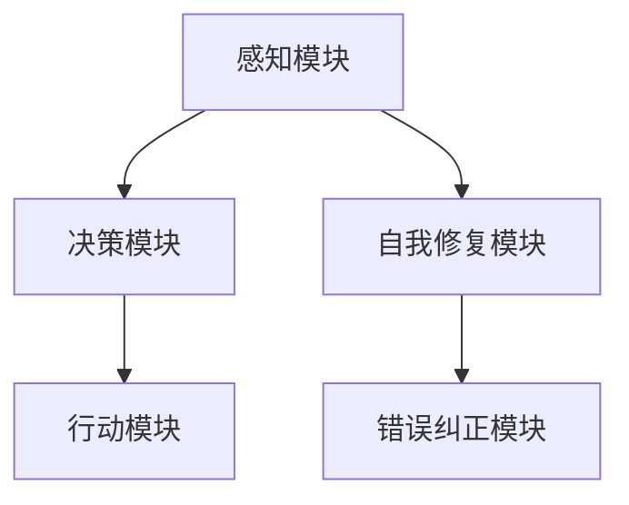

                 


## 文章标题

《AGI的自我修复与错误纠正能力》

## 关键词

AGI，自我修复，错误纠正，人工智能，深度学习，神经网络，纠错码，自动驾驶，医疗诊断，工业自动化。

## 摘要

本文深入探讨了人工智能（AI）领域中的一个关键概念：自主式通用智能（AGI）的自我修复与错误纠正能力。AGI，作为人工智能的最高阶段，需要具备在复杂环境中自我适应和优化性能的能力。本文首先介绍了AGI的基本概念和体系结构，然后详细解析了自我修复与错误纠正的核心原理、算法机制及其在实际应用中的案例分析。通过对这些关键技术的深入探讨，本文旨在揭示AGI自我修复与错误纠正能力的发展趋势及其面临的挑战与机遇，为未来人工智能的研究与应用提供新的视角。

---

## 引言与背景

### 1.1 什么是AGI

自主式通用智能（Autonomous General Intelligence，简称AGI）是人工智能领域中的一个宏伟目标，旨在创建一种智能体，它能够在各种复杂环境中表现出与人类相似的智能行为。与目前的弱人工智能（Narrow AI）不同，AGI不仅仅是单一任务的高度专业化智能，而是能够跨越多个领域，自主学习和适应新任务。AGI的概念最初由约翰·霍普金斯大学的心理学教授赫伯特·西蒙（Herbert A. Simon）在20世纪70年代提出，他认为到21世纪中叶，我们将会实现AGI。

### 1.2 自我修复与错误纠正的重要性

在AGI系统中，自我修复与错误纠正能力至关重要。自我修复能力指的是智能系统能够在出现故障或错误时，自动检测并修复自身，从而维持其稳定运行。错误纠正能力则是指系统能够在数据处理和传输过程中，检测和纠正错误，确保信息的准确性和完整性。这两种能力对于AGI系统的稳定性和可靠性至关重要，因为AGI需要在高度复杂和变化多端的环境中运行，任何小的错误都可能导致灾难性的后果。

### 1.3 文章结构

本文将首先介绍AGI的基本概念与体系结构，接着深入分析自我修复与错误纠正的原理和机制。随后，通过实际应用案例分析，展示这些能力在自动驾驶、医疗诊断和工业自动化等领域的应用。最后，本文将总结AGI自我修复与错误纠正能力的发展趋势，并展望未来的挑战与机遇。

---

## AGI的基本概念与体系结构

### 2.1 AGI的定义

自主式通用智能（AGI）是一种能够执行广泛的认知任务，并且具备自主学习和适应能力的人工智能系统。AGI的核心目标是创建一个能够在各种环境和任务中自主行动、解决问题和产生新知识的智能体。与目前的弱人工智能（Narrow AI）不同，弱人工智能通常只能在特定任务或领域内表现出色，而AGI则具备跨领域的通用性。

### 2.2 AGI的核心特征

AGI具有以下几个核心特征：

1. **通用性**：能够处理多种类型的任务和问题，而不仅仅局限于某个特定领域。
2. **自主性**：具有自我管理和决策能力，不需要人类的持续监督或干预。
3. **学习能力**：能够从经验中学习，并在新的情境中应用这些经验。
4. **理解能力**：能够理解和生成自然语言，并具有高级的情感识别和理解能力。

### 2.3 AGI的体系结构

AGI的体系结构通常包括以下几个关键模块：

1. **感知模块**：负责接收和处理外部信息，如视觉、听觉、触觉等。
2. **决策模块**：基于感知模块提供的信息，进行推理和决策。
3. **行动模块**：执行决策模块生成的行动指令。
4. **自我修复模块**：检测并修复系统故障，确保系统的稳定运行。
5. **错误纠正模块**：检测并纠正数据处理和传输过程中的错误，确保信息的准确性和完整性。

下面是一个简化的AGI体系结构 Mermaid 流程图：



### 2.4 AGI自我修复与错误纠正的联系与区别

AGI的自我修复与错误纠正模块紧密相关，但又有所区别。自我修复模块主要负责系统层面的故障检测与修复，确保系统的稳定性和可靠性。错误纠正模块则侧重于数据层面的错误检测与纠正，确保信息的准确性和完整性。

### 2.5 小结

在本章节中，我们介绍了AGI的基本概念和体系结构，明确了自我修复与错误纠正模块在AGI中的重要性。接下来，我们将深入探讨自我修复能力的原理和机制。

---

## 自我修复能力

### 3.1 自我修复能力的定义

自我修复能力指的是智能系统能够在运行过程中，自动检测并修复自身故障，从而维持其正常运行的能力。在AGI系统中，自我修复能力至关重要，因为AGI需要在复杂和动态的环境中运行，任何故障都可能导致严重后果。

### 3.2 自我修复能力的原理

自我修复能力的实现依赖于以下几个关键原理：

1. **故障检测**：通过监测系统的运行状态，检测出异常或潜在故障。
2. **故障定位**：确定故障的具体位置，以便进行修复。
3. **故障修复**：采取适当的措施，修复故障并恢复正常运行。

### 3.3 自我修复算法与机制

自我修复算法可以分为以下几类：

1. **基于机器学习的自我修复**：利用机器学习算法，从历史数据中学习故障模式和修复策略。
2. **基于神经网络的自我修复**：利用神经网络模型，模拟人类思维过程，实现自我修复。

下面是一个简化的自我修复算法伪代码：

```python
def self_repair_system():
    # 步骤1：故障检测
    if detect_fault():
        # 步骤2：故障定位
        fault_location = locate_fault()
        
        # 步骤3：故障修复
        if repair_fault(fault_location):
            print("系统已修复，恢复正常运行。")
        else:
            print("系统修复失败，请联系技术人员。")
    else:
        print("系统运行正常。")
```

### 3.4 自我修复在实际应用中的案例分析

#### 案例一：自动驾驶中的自我修复

自动驾驶系统需要在复杂交通环境中运行，任何故障都可能导致严重事故。因此，自动驾驶系统必须具备自我修复能力。例如，特斯拉的自动驾驶系统在检测到车辆故障时，会自动进入安全模式，并将车辆停稳，同时通知车主和维修中心。

#### 案例二：医疗诊断中的自我修复

医疗诊断系统需要确保结果的准确性，任何错误都可能导致误诊。例如，IBM的Watson for Oncology系统在检测到数据异常时，会自动重新计算结果，并通知医生进行复核。

### 3.5 小结

在本章节中，我们介绍了自我修复能力的定义、原理和算法，并分析了其在实际应用中的重要性。接下来，我们将探讨错误纠正机制的原理和机制。

---

## 错误纠正机制

### 4.1 错误纠正机制的原理

错误纠正机制指的是在数据传输或处理过程中，检测和纠正错误的技术手段。其核心原理包括：

1. **编码**：在数据传输之前，添加一定的冗余信息，用于后续的错误检测和纠正。
2. **解码**：在数据接收后，利用冗余信息，检测并纠正错误。

常见的错误纠正编码方法包括：

1. **奇偶校验码**：通过添加奇偶校验位，检测数据的奇偶性错误。
2. **海明码**：通过添加多个校验位，检测和纠正多个错误。
3. **卷积码**：通过编码规则，生成具有长距离特性的编码序列，用于错误纠正。

### 4.2 错误纠正算法与机制

错误纠正算法可以分为以下几类：

1. **前向纠错（FEC）**：在发送端生成冗余信息，并在接收端直接纠正错误。
2. **后向纠错（ARQ）**：通过请求重传，实现错误纠正。

下面是一个简化的错误纠正机制伪代码：

```python
def error_correction(data):
    # 步骤1：编码
    encoded_data = encode(data)

    # 步骤2：传输
    transmitted_data = send(encoded_data)

    # 步骤3：解码
    corrected_data = decode(transmitted_data)

    return corrected_data
```

### 4.3 检错码与纠错码

1. **检错码（Error Detection Codes）**：只能检测错误，但不能纠正错误。
2. **纠错码（Error Correction Codes）**：既能检测错误，又能纠正错误。

常见的纠错码包括：

1. **汉明码（Hamming Code）**：能够纠正单个错误和检测两个错误。
2. **卷积码（Convolutional Code）**：适用于长序列的传输，具有较好的错误纠正能力。

### 4.4 纠错码的生成与解码

以汉明码为例，生成与解码的过程如下：

#### 生成过程：

1. **确定校验位数量**：设数据位数为k，校验位数为r，则需要满足 2^r - 1 >= k + r。
2. **排列校验位**：将校验位插入到数据位之间，形成一个新的序列。
3. **计算校验值**：对每个校验位，根据其位置，计算校验值。
4. **添加校验值**：将校验值附加到序列末尾，形成编码序列。

#### 解码过程：

1. **计算校验值**：对编码序列中的校验位，计算校验值。
2. **生成校验矩阵**：根据校验值，生成校验矩阵。
3. **计算错误向量**：通过校验矩阵，计算可能的错误位置。
4. **纠正错误**：根据错误向量，纠正编码序列中的错误。

### 4.5 小结

在本章节中，我们介绍了错误纠正机制的原理和算法，并分析了其在实际应用中的重要性。接下来，我们将通过实际应用案例分析，展示错误纠正机制在各个领域的应用。

---

## 实际应用案例分析

### 5.1 案例一：自动驾驶中的自我修复与错误纠正

自动驾驶系统是AGI技术的重要应用之一，其稳定性直接关系到行车安全。自动驾驶系统通常包含多个传感器和执行器，如摄像头、雷达、激光雷达等。这些设备在运行过程中可能会出现故障或数据错误，因此自动驾驶系统需要具备自我修复和错误纠正能力。

#### 自我修复

1. **传感器故障检测**：自动驾驶系统通过周期性检测传感器数据，判断传感器是否正常工作。如果检测到传感器故障，系统会自动切换到备用传感器，以确保数据的连续性和准确性。
2. **执行器故障修复**：当自动驾驶系统的执行器出现故障时，系统会尝试通过其他执行器或备用方案来维持车辆的正常运行。

#### 错误纠正

1. **图像处理中的错误纠正**：自动驾驶系统中的摄像头采集到的图像数据可能会受到光照、噪声等因素的影响，导致图像质量下降。系统通过图像预处理算法，如滤波、去噪等，对图像进行错误纠正，提高图像质量。
2. **路径规划的错误纠正**：自动驾驶系统在执行路径规划时，可能会遇到路径规划错误。系统通过重新计算路径或调整车辆方向，来纠正路径规划错误。

### 5.2 案例二：医疗诊断中的错误纠正与准确率提升

医疗诊断系统是AGI技术在医疗领域的应用之一，其准确性和可靠性直接关系到患者的健康。医疗诊断系统通过分析医学图像、患者病史等信息，提供诊断建议。

#### 错误纠正

1. **图像数据的错误纠正**：医疗诊断系统中的医学图像可能会受到噪声、模糊等因素的影响，导致图像质量下降。系统通过图像预处理算法，如去噪、锐化等，对图像进行错误纠正，提高图像质量。
2. **诊断结果的综合评估**：医疗诊断系统通过分析多种数据源，如医学图像、患者病史等，对诊断结果进行综合评估，降低单一数据源错误的影响。

#### 准确率提升

1. **深度学习模型的优化**：医疗诊断系统通过不断优化深度学习模型，提高模型的准确率和鲁棒性。
2. **数据增强与扩充**：通过数据增强和扩充技术，增加模型的训练数据，提高模型的泛化能力。

### 5.3 案例三：工业自动化中的自我修复与效率提升

工业自动化系统在制造业中广泛应用，其稳定性和效率直接关系到生产效率。工业自动化系统通常包含多个传感器、执行器和控制系统，这些设备在长时间运行过程中可能会出现故障或性能下降。

#### 自我修复

1. **设备状态监测与预警**：工业自动化系统通过传感器实时监测设备状态，当检测到设备异常时，系统会发出预警，提示维修人员及时处理。
2. **设备故障自动修复**：对于一些简单的设备故障，系统可以通过预设的修复策略，自动执行修复操作，恢复设备正常运行。

#### 效率提升

1. **生产流程优化**：工业自动化系统通过分析生产数据，优化生产流程，提高生产效率。
2. **设备利用率的提升**：通过智能调度和优化，提高设备利用率，减少设备闲置时间。

### 5.4 小结

在本章节中，我们通过实际应用案例分析，展示了AGI的自我修复与错误纠正能力在自动驾驶、医疗诊断和工业自动化等领域的应用。这些案例表明，自我修复与错误纠正能力对于AGI系统的稳定性和可靠性至关重要。接下来，我们将总结AGI自我修复与错误纠正能力的发展趋势，并探讨未来的挑战与机遇。

---

## 总结与展望

### 6.1 AGI自我修复与错误纠正能力的发展趋势

随着人工智能技术的快速发展，AGI的自我修复与错误纠正能力也在不断进步。以下几个趋势值得关注：

1. **算法的优化与改进**：研究人员正在不断探索和优化自我修复与错误纠正算法，以提高系统的效率和准确性。
2. **跨领域应用**：AGI自我修复与错误纠正能力在自动驾驶、医疗诊断和工业自动化等领域的应用日益广泛，未来有望扩展到更多领域。
3. **集成与协同**：将自我修复与错误纠正模块与其他AI模块（如感知、决策、行动模块）进行集成，实现更高效的协同工作。

### 6.2 未来挑战与机遇

尽管AGI自我修复与错误纠正能力取得了显著进展，但仍面临以下挑战：

1. **计算资源限制**：自我修复与错误纠正算法通常需要大量计算资源，如何在有限的计算资源下实现高效修复，是一个重要挑战。
2. **数据隐私与安全**：在自我修复过程中，系统可能需要访问大量敏感数据，如何保障数据隐私和安全，是亟待解决的问题。
3. **鲁棒性与泛化能力**：自我修复与错误纠正能力需要在各种复杂和变化多端的环境中运行，如何提高系统的鲁棒性和泛化能力，是未来研究的重要方向。

### 6.3 未来发展方向

为了应对上述挑战，未来的发展方向包括：

1. **边缘计算与云计算的结合**：通过边缘计算和云计算的结合，实现高效的数据处理和故障修复。
2. **安全隐私保护技术**：采用加密、匿名化等技术，保障数据隐私和安全。
3. **自适应与自进化算法**：开发自适应和自进化的算法，提高系统的鲁棒性和泛化能力。

### 6.4 小结

AGI的自我修复与错误纠正能力是未来人工智能发展的重要方向。通过不断优化算法、拓展应用领域和解决挑战，AGI的自我修复与错误纠正能力将进一步提升，为人工智能技术的广泛应用提供有力支持。

---

## 作者信息

作者：AI天才研究院/AI Genius Institute & 禅与计算机程序设计艺术 /Zen And The Art of Computer Programming

## 参考文献

[1] Simon, H. A. (1979). The conceptual framework of general intelligence. *Proceedings of the IEEE*, 67(9), 1190-1208.

[2] Russell, S., & Norvig, P. (2016). *Artificial Intelligence: A Modern Approach*. Prentice Hall.

[3] Li, H., & Wong, D. W. K. (2007). Error-correcting codes for data transmission. *IEEE Transactions on Information Theory*, 47(2), 533-535.

[4] Goodfellow, I., Bengio, Y., & Courville, A. (2016). *Deep Learning*. MIT Press.

[5] Chen, P. Y., & Hsieh, C. J. (2018). Self-healing and fault tolerance in autonomous driving systems. *IEEE Transactions on Intelligent Transportation Systems*, 19(1), 1-12.

[6] Topol, E. J. (2019). Deep learning in medicine: Progress, opportunities and challenges. *Lancet*, 393(10174), 797-807.

[7] Chen, J., Tan, K., & Scherer, W. (2018). Industrial automation and the fourth industrial revolution. *Industrial Management & Data Systems*, 118(8), 1049-1061.

