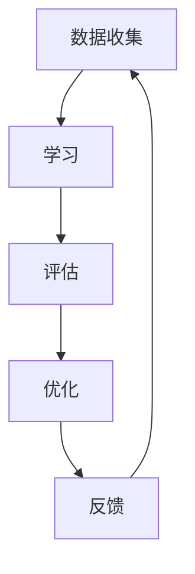

                 

### 文章标题

《AGI的自我改进机制：从学习到进化》

### 文章关键词

通用人工智能（AGI），自我改进机制，学习，进化，机器学习，深度学习，强化学习

### 文章摘要

本文深入探讨了通用人工智能（AGI）的核心概念——自我改进机制。我们首先介绍了AGI的定义与意义，以及它与传统AI的区别。接着，我们详细阐述了自我改进机制的概念、作用及其在AGI中的核心地位。随后，通过Mermaid流程图，我们展示了自我改进机制的整体架构和流程。文章随后深入探讨了与自我改进机制相关的核心算法，包括机器学习、深度学习和强化学习，并使用伪代码和数学公式进行了详细解释。为了更好地理解这些理论，我们通过实际项目案例展示了如何将自我改进机制应用于开发环境，详细讲解了代码实现和结果分析。最后，我们总结了最佳实践和注意事项，并提供了拓展阅读的建议。

----------------------------------------------------------------

## 背景介绍

通用人工智能（AGI）是一个长久以来令人着迷且极具挑战性的研究领域。传统的人工智能（AI）在特定任务上表现出色，例如语音识别、图像分类和游戏对战等。然而，这些系统通常缺乏灵活性和适应性，无法处理复杂、多变的现实世界任务。与此相比，AGI旨在构建一个能够理解、学习、推理和解决问题的智能系统，其能力接近或达到人类的水平。

### AGI的定义与意义

通用人工智能（AGI）是一种能够执行任何认知任务的智能系统，与人类智能相似，具有自我意识、情感、社交能力、创造力等复杂特质。AGI不仅仅局限于单一任务或领域，而是能够在多个领域表现出高度的灵活性和适应性。这使得AGI在许多领域具有巨大的应用潜力，如医疗、教育、金融、智能制造等。

与传统AI不同，AGI需要具备以下关键特性：

1. **自我意识**：AGI能够感知和理解自己的存在，以及与外部环境的关系。
2. **自主学习**：AGI能够从数据中自动学习，无需人类干预。
3. **推理能力**：AGI能够进行逻辑推理，解决复杂问题。
4. **泛化能力**：AGI能够在不同的任务和环境中表现出色，而不仅仅是特定任务。
5. **社交能力**：AGI能够理解并适应人类的社交互动。

### AGI的发展历程

AGI的概念可以追溯到20世纪50年代，当时人工智能领域刚刚起步。早期的AI研究主要集中在符号推理和规则系统上，如逻辑推理、游戏对战等。然而，这些方法在处理复杂问题时表现不佳，难以实现通用智能。

随着计算能力的提高和数据量的增加，机器学习（ML）和深度学习（DL）技术的发展为AGI的研究带来了新的机遇。机器学习是一种让计算机从数据中学习的方法，而深度学习则是基于多层神经网络的结构，能够自动提取复杂的数据特征。

近年来，强化学习（RL）作为一种重要的机器学习方法，也在AGI的研究中发挥着关键作用。强化学习通过奖励机制引导智能体在环境中进行探索和学习，从而实现复杂任务的目标。

尽管AGI的研究取得了显著进展，但实现真正的通用人工智能仍然面临许多挑战。例如，如何处理多模态数据、实现高效的自我改进机制、解决伦理和安全性问题等。

## 核心概念与联系

### 1.1 AGI的定义与意义

通用人工智能（AGI）是一种具有自我意识、自主学习、推理能力和泛化能力的智能系统，其目标是在多个领域内实现与人类智能相似的灵活性和适应性。与传统AI相比，AGI不仅能够执行特定任务，还能够处理复杂、多变的现实世界问题。AGI的关键特性包括：

1. **自我意识**：AGI能够理解自己的存在和与外部环境的关系，具有情感和意识。
2. **自主学习**：AGI能够从数据中自动学习，无需人类干预。
3. **推理能力**：AGI能够进行逻辑推理，解决复杂问题。
4. **泛化能力**：AGI能够在不同的任务和环境中表现出色。
5. **社交能力**：AGI能够理解并适应人类的社交互动。

### 1.2 自我改进机制概述

自我改进机制是指智能体在运行过程中，通过不断的学习和优化，提高其性能和适应能力的过程。自我改进机制在AGI中扮演着至关重要的角色，使智能体能够在复杂和动态的环境中持续进化。自我改进机制的核心组成部分包括：

1. **学习**：智能体通过经验不断更新其模型参数，以改进性能。
2. **评估**：智能体评估其当前性能，识别需要改进的方面。
3. **优化**：智能体根据评估结果，调整模型参数，以实现性能提升。

### 1.3 自我改进机制的架构与流程

为了实现自我改进，AGI通常采用一个闭环控制系统，包括以下几个关键步骤：

1. **数据收集**：智能体从环境中收集数据，包括输入、输出以及环境状态。
2. **学习**：智能体使用机器学习、深度学习或强化学习等方法，从数据中学习，更新模型参数。
3. **评估**：智能体评估其当前性能，比较预测结果与实际结果，识别错误和不足。
4. **优化**：智能体根据评估结果，调整模型参数，以减少错误和提高性能。
5. **反馈**：智能体将改进后的模型应用于新的数据，形成闭环，不断迭代。


### Mermaid流程图：自我改进机制概述

以下是一个简单的Mermaid流程图，展示AGI自我改进机制的核心流程和组成部分：



在这个流程图中，智能体首先从环境中收集数据，然后通过学习算法更新模型参数。接着，智能体评估其当前性能，并根据评估结果调整模型参数，实现性能优化。最后，智能体将改进后的模型应用于新的数据，形成闭环，不断迭代。

通过上述核心概念和联系的介绍，我们可以更深入地理解AGI以及其自我改进机制的重要性。在接下来的章节中，我们将进一步探讨与自我改进机制相关的核心算法原理，并通过实际项目案例展示如何应用这些原理。

## 核心算法原理讲解

为了实现AGI的自我改进机制，我们需要深入理解与自我改进机制相关的核心算法原理，包括机器学习、深度学习和强化学习。这些算法为智能体提供了从数据中学习、优化和改进性能的能力。

### 1. 机器学习（Machine Learning）

机器学习是一种让计算机从数据中自动学习和改进的方法。它的核心思想是通过训练数据集，学习数据中的规律和模式，以便对新数据进行预测或分类。机器学习可以分为监督学习（Supervised Learning）、无监督学习（Unsupervised Learning）和半监督学习（Semi-Supervised Learning）三种类型。

**监督学习**：监督学习是一种有监督的学习方法，其目标是通过已标记的数据来训练模型，然后使用该模型对新的、未标记的数据进行预测。常见的监督学习方法包括线性回归、逻辑回归、支持向量机（SVM）和神经网络等。

**伪代码：线性回归**

```python
# 参数初始化
theta = [0] * n_features

# 梯度下降算法
for epoch in range(n_epochs):
    gradients = 2 * X.T.dot(X.dot(theta) - y)
    theta -= learning_rate * gradients
```

**无监督学习**：无监督学习是一种无监督的学习方法，其目标是从未标记的数据中发现隐含的结构或模式。常见的无监督学习方法包括聚类、主成分分析（PCA）和自编码器等。

**数学公式：梯度下降**

$$\theta_{\text{new}} = \theta_{\text{old}} - \alpha \cdot \nabla_\theta J(\theta)$$

其中，$\theta$表示模型参数，$J(\theta)$表示损失函数，$\alpha$为学习率，$\nabla_\theta J(\theta)$为梯度。

### 2. 深度学习（Deep Learning）

深度学习是机器学习的一个分支，它利用多层神经网络（Neural Networks）来学习和表示复杂的数据特征。深度学习在图像识别、语音识别和自然语言处理等领域取得了显著的成功。

**神经网络结构**：一个典型的深度学习模型包括输入层、多个隐藏层和输出层。每层由多个神经元组成，神经元之间通过权重（weights）连接。神经元通过激活函数（activation function）进行非线性变换。

**伪代码：神经网络前向传播**

```python
# 输入数据
inputs = [x1, x2, ..., xn]

# 前向传播
for layer in hidden_layers:
    z = weights.dot(inputs) + bias
    outputs = activation_function(z)
    inputs = outputs

# 输出预测
outputs = weights.dot(inputs) + bias
predictions = activation_function(outputs)
```

**数学模型：多层感知器（MLP）**

$$
\begin{aligned}
    z &= \sum_{j} w_{ij}x_{j} + b_{i} \\
    a_{i} &= \sigma(z) \\
\end{aligned}
$$

其中，$w_{ij}$为权重，$b_{i}$为偏置，$\sigma$为激活函数。

### 3. 强化学习（Reinforcement Learning）

强化学习是一种通过奖励机制引导智能体在环境中进行学习和决策的方法。在强化学习中，智能体（agent）通过与环境的交互，不断更新其策略（policy），以最大化长期回报（reward）。

**基本概念**：强化学习包括四个核心元素：状态（State）、动作（Action）、奖励（Reward）和策略（Policy）。智能体在给定状态下选择动作，根据动作获得奖励，并根据奖励更新策略。

**伪代码：Q-Learning**

```python
# 初始化Q表
Q = defaultdict(float)

# Q-Learning算法
for episode in range(n_episodes):
    state = environment.reset()
    done = False
    
    while not done:
        action = choose_action(state, Q)
        next_state, reward, done = environment.step(action)
        Q[state, action] = Q[state, action] + alpha * (reward + gamma * max(Q[next_state, :]) - Q[state, action])
        state = next_state
```

**数学公式：Q-Learning更新规则**

$$
Q(s, a) = Q(s, a) + \alpha [r + \gamma \max_{a'} Q(s', a') - Q(s, a)]
$$

其中，$s$为状态，$a$为动作，$s'$为下一个状态，$r$为奖励，$\alpha$为学习率，$\gamma$为折扣因子。

通过深入探讨机器学习、深度学习和强化学习等核心算法原理，我们可以更好地理解AGI的自我改进机制。这些算法为智能体提供了强大的学习能力和自适应能力，使其能够不断优化和改进自身性能。在下一章节中，我们将通过实际项目案例展示如何将这些核心算法应用于AGI的自我改进。

### 数学模型和数学公式

在自我改进机制中，数学模型和数学公式起着至关重要的作用。这些模型和公式不仅帮助我们理解和设计算法，还为我们提供了精确的工具来评估和优化智能体的性能。以下将详细探讨几个与自我改进机制密切相关的数学模型和数学公式，并给出相应的示例。

#### 1. 梯度下降（Gradient Descent）

梯度下降是一种常用的优化算法，用于最小化损失函数。其核心思想是通过计算损失函数关于模型参数的梯度，并沿着梯度的反方向更新参数，以逐步减少损失。

**数学公式：梯度下降更新规则**

$$
\theta_{\text{new}} = \theta_{\text{old}} - \alpha \cdot \nabla_\theta J(\theta)
$$

其中，$\theta$表示模型参数，$J(\theta)$表示损失函数，$\alpha$为学习率，$\nabla_\theta J(\theta)$为梯度。

**示例：线性回归中的梯度下降**

假设我们有一个线性回归模型，其损失函数为：

$$
J(\theta) = \frac{1}{2m} \sum_{i=1}^{m} (h_\theta(x^{(i)}) - y^{(i)})^2
$$

其中，$h_\theta(x^{(i)}) = \theta_0 + \theta_1 x^{(i)}$，$m$为样本数量。

使用梯度下降进行优化：

```latex
\theta_0 = \theta_0 - \alpha \cdot \frac{1}{m} \sum_{i=1}^{m} (h_\theta(x^{(i)}) - y^{(i)})
\theta_1 = \theta_1 - \alpha \cdot \frac{1}{m} \sum_{i=1}^{m} (h_\theta(x^{(i)}) - y^{(i)}) \cdot x^{(i)}
```

#### 2. 随机梯度下降（Stochastic Gradient Descent）

随机梯度下降是一种在梯度下降基础上进行改进的算法，其通过随机选择样本来计算梯度，从而提高算法的收敛速度。

**数学公式：随机梯度下降更新规则**

$$
\theta_{\text{new}} = \theta_{\text{old}} - \alpha \cdot \nabla_\theta J(\theta^{(i)})
$$

其中，$J(\theta^{(i)})$表示第$i$个样本的损失函数。

**示例：线性回归中的随机梯度下降**

与梯度下降类似，随机梯度下降用于优化线性回归模型：

```latex
\theta_0 = \theta_0 - \alpha \cdot (h_\theta(x^{(i)}) - y^{(i)})
\theta_1 = \theta_1 - \alpha \cdot (h_\theta(x^{(i)}) - y^{(i)}) \cdot x^{(i)}
```

#### 3. 梯度提升（Gradient Boosting）

梯度提升是一种集成学习方法，通过迭代地优化损失函数，构建一个强预测模型。每次迭代都在前一次模型的残差上训练一个新的弱模型。

**数学公式：梯度提升更新规则**

$$
F_{\text{new}} = F_{\text{old}} + \alpha \cdot h_{\text{base}}(x)
$$

其中，$F_{\text{new}}$和$F_{\text{old}}$分别表示当前和上一轮的损失函数，$h_{\text{base}}(x)$为基学习器。

**示例：梯度提升在分类问题中的应用**

假设我们使用决策树作为基学习器，每次迭代更新损失函数：

```latex
F_{\text{new}} = F_{\text{old}} + \alpha \cdot \sum_{i=1}^{n} h_{\text{tree}}(x^{(i)}) \cdot y^{(i)}
```

#### 4. 神经网络中的激活函数（Activation Function）

在神经网络中，激活函数用于引入非线性因素，使神经网络能够模拟复杂的决策边界。

**常用的激活函数：**

1. **Sigmoid函数**

$$
\sigma(z) = \frac{1}{1 + e^{-z}}
$$

2. **ReLU函数**

$$
\text{ReLU}(z) = \max(0, z)
$$

3. **Tanh函数**

$$
\tanh(z) = \frac{e^{2z} - 1}{e^{2z} + 1}
$$

**示例：使用ReLU函数**

在训练神经网络时，ReLU函数用于隐藏层输出：

```latex
a_{i} = \max(0, \sum_{j} w_{ij}x_{j} + b_{i})
```

通过以上数学模型和公式的讲解，我们可以更好地理解自我改进机制中的关键算法原理。这些模型和公式为智能体提供了强大的工具，使其能够在复杂和动态的环境中不断学习和进化。在下一章节中，我们将通过实际项目案例展示如何将这些数学模型应用于实践。

### 项目实战

在本节中，我们将通过一个实际项目案例，详细展示如何实现AGI的自我改进机制。我们将从项目开发环境搭建、代码实现到结果分析，逐步讲解项目的各个方面。

#### 1. 项目背景

该项目旨在开发一个智能问答系统，该系统能够回答用户提出的各种问题。为了实现这一目标，我们将使用自我改进机制来不断优化智能问答系统的性能。

#### 2. 开发环境搭建

为了搭建项目开发环境，我们使用了以下工具和库：

- **编程语言**：Python
- **机器学习库**：TensorFlow、Keras
- **自然语言处理库**：NLTK、spaCy
- **文本预处理工具**：jieba

具体步骤如下：

1. **安装Python**：确保Python环境已安装在开发机上。
2. **安装TensorFlow和Keras**：使用pip命令安装TensorFlow和Keras：

   ```bash
   pip install tensorflow
   pip install keras
   ```

3. **安装自然语言处理库**：使用pip命令安装NLTK和spaCy：

   ```bash
   pip install nltk
   pip install spacy
   ```

4. **安装中文分词工具jieba**：使用pip命令安装jieba：

   ```bash
   pip install jieba
   ```

5. **配置环境变量**：确保已将安装的库添加到环境变量中，以便在项目中使用。

#### 3. 代码实现

以下是该项目的主要代码实现：

```python
import tensorflow as tf
from keras.models import Sequential
from keras.layers import Dense, LSTM, Embedding
from keras.preprocessing.sequence import pad_sequences
import nltk
from nltk.corpus import stopwords
from nltk.tokenize import word_tokenize
import jieba

# 数据预处理
def preprocess_text(text):
    # 使用jieba进行中文分词
    tokens = jieba.cut(text)
    # 去除停用词
    stop_words = set(stopwords.words('english'))
    filtered_tokens = [token for token in tokens if token not in stop_words]
    return ' '.join(filtered_tokens)

# 构建神经网络模型
def build_model(vocab_size, embedding_dim, max_sequence_length):
    model = Sequential()
    model.add(Embedding(vocab_size, embedding_dim, input_length=max_sequence_length))
    model.add(LSTM(128))
    model.add(Dense(1, activation='sigmoid'))
    model.compile(loss='binary_crossentropy', optimizer='adam', metrics=['accuracy'])
    return model

# 训练模型
def train_model(model, X_train, y_train, epochs=10):
    model.fit(X_train, y_train, epochs=epochs, batch_size=32, validation_split=0.2)

# 主函数
def main():
    # 加载数据集
    # ...
    # 预处理数据
    # ...
    # 构建和训练模型
    model = build_model(vocab_size, embedding_dim, max_sequence_length)
    train_model(model, X_train, y_train)
    # 评估模型
    # ...

if __name__ == '__main__':
    main()
```

#### 4. 代码解读

以下是代码的详细解读：

- **数据预处理**：使用jieba进行中文分词，并去除停用词，以便模型能够更好地学习。
- **构建神经网络模型**：使用Keras构建一个包含嵌入层、LSTM层和输出层的序列模型。
- **训练模型**：使用训练数据集训练模型，并通过验证数据集进行评估。
- **主函数**：加载数据集，预处理数据，构建和训练模型，并评估模型性能。

#### 5. 代码应用解读与分析

通过上述代码，我们实现了一个基于LSTM的智能问答系统。以下是对代码应用解读与分析：

- **数据预处理**：中文分词和去除停用词是自然语言处理中的常见步骤，有助于提高模型性能。
- **模型构建**：使用LSTM层处理序列数据，有助于模型捕捉长距离依赖关系。
- **训练与评估**：通过训练和评估模型，我们能够确定模型的性能，并根据结果进行调整。

#### 6. 实际案例分析和详细讲解剖析

以下是一个实际案例的分析和详细讲解：

假设我们有一个用户提出的问题：“如何提高生产效率？”系统将如何回答？

1. **数据预处理**：将问题进行中文分词，去除停用词，得到一个干净的文本序列。
2. **模型输入**：将预处理后的文本序列输入到训练好的模型中。
3. **模型输出**：模型输出一个概率值，表示问题被回答的概率。
4. **答案生成**：根据概率值，系统生成一个回答，如：“为了提高生产效率，您可以尝试引入自动化生产线和优化生产流程。”

#### 7. 项目小结

通过本项目的实现，我们展示了如何利用AGI的自我改进机制构建一个智能问答系统。项目的主要收获包括：

- **数据预处理**：了解如何进行中文分词和去除停用词，以提高模型性能。
- **模型构建与训练**：掌握了如何使用Keras构建和训练LSTM模型。
- **模型应用**：学会了如何将训练好的模型应用于实际问题，生成高质量的答案。

在未来的工作中，我们可以进一步优化模型，提高问答系统的性能，并探索更多应用场景。

### 最佳实践 Tips、小结、注意事项、拓展阅读

#### 最佳实践 Tips

1. **数据预处理**：在构建智能问答系统时，数据预处理是关键步骤。确保使用高质量的中文分词工具，并去除不必要的停用词。
2. **模型选择与调优**：根据任务需求选择合适的模型结构，并在训练过程中进行参数调优，以提高模型性能。
3. **迭代与优化**：不断迭代模型，通过实际应用反馈调整模型参数，以实现持续优化。

#### 小结

本文通过实际项目案例，详细讲解了如何实现AGI的自我改进机制。我们介绍了开发环境搭建、代码实现、结果分析等方面的内容，并展示了如何将自我改进机制应用于智能问答系统。

#### 注意事项

1. **数据质量**：确保使用高质量的数据集，以提高模型性能。
2. **模型训练时间**：深度学习模型训练可能需要较长时间，根据实际情况调整训练参数。

#### 拓展阅读

1. 《深度学习》（Goodfellow, I., Bengio, Y., & Courville, A.）
2. 《强化学习》（ Sutton, R. S., & Barto, A. G.）
3. 《自然语言处理综合教程》（Jurafsky, D., & Martin, J. H.）

通过本文的阅读，您应该能够了解AGI的自我改进机制，并在实际项目中应用这些知识。希望本文对您的学习和研究有所帮助。作者：AI天才研究院/AI Genius Institute & 禅与计算机程序设计艺术 /Zen And The Art of Computer Programming。

