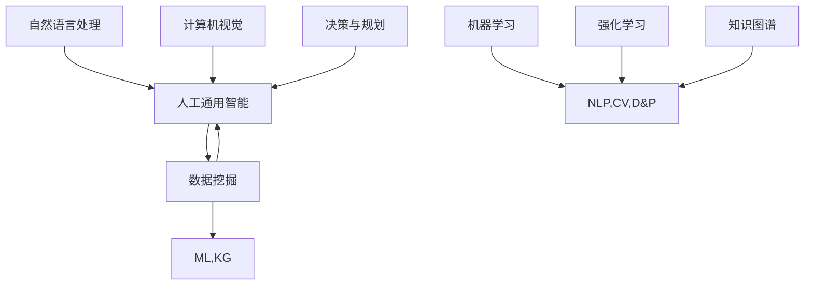
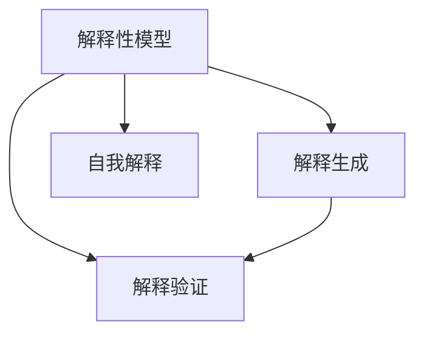

                 

## 文章标题

# AGI的自我解释能力：透明度与可解释性

> 关键词：人工通用智能（AGI）、自我解释能力、透明度、可解释性、算法原理、应用案例、未来展望

> 摘要：本文探讨了人工通用智能（AGI）的自我解释能力，重点分析了透明度和可解释性的概念及其在AGI中的应用。通过对核心原理、实现方法、应用案例和未来挑战的详细分析，本文旨在为读者提供对AGI自我解释能力的全面理解，并展望其在人工智能领域的重要性与发展前景。

## 引言与背景

### 1.1 什么是AGI

人工通用智能（AGI）是人工智能（AI）领域的一个长期目标，旨在开发一种能够执行各种认知任务的智能系统，类似于人类智能。与目前广泛应用的窄AI（Narrow AI）不同，AGI具备跨领域的知识获取、推理、学习和适应性能力。

**核心概念与联系：**

在图1中，我们展示了AGI的核心要素及其子领域之间的关系。这些子领域包括自然语言处理、计算机视觉、决策与规划等。



**AGI的历史与发展**

AGI的概念最早可以追溯到20世纪50年代。自那时以来，随着计算能力的提升和数据量的增加，AI领域取得了显著进展。目前，许多AI技术已经实现了商业化应用，但实现真正的AGI仍面临诸多挑战。

**核心算法原理讲解：**

AGI的发展离不开一系列核心算法。例如，深度学习、强化学习、知识图谱等技术都在AGI中扮演了关键角色。以下是一个简化的伪代码，展示了这些算法的基本架构：

```python
# 伪代码：AGI的基本架构
class AGI:
    def __init__(self):
        self.nlp = NLP()
        self.cv = CV()
        self.d&P = D&P()
        self.ml = ML()
        self.rl = RL()
        self.kg = KG()
        self.dr = DR()

    def learn(self, data):
        self.ml.train(data)
        self.rl.train(data)
        self.kg.build(data)
        self.dr.analyze(data)

    def think(self, task):
        if task.type == "text":
            self.nlp.process(task)
        elif task.type == "image":
            self.cv.process(task)
        elif task.type == "decision":
            self.d&P.make_decision(task)
```

### 1.2 透明度与可解释性在AGI中的重要性

透明度和可解释性是AGI自我解释能力的重要组成部分。它们不仅有助于提高系统的可靠性，还能增强用户对系统的信任度。

**透明度：** 透明度指的是系统内部运行过程的可视化和可理解性。高透明度的系统允许用户或开发者清楚地了解系统如何执行特定任务。

**可解释性：** 可解释性指的是系统能够以人类可理解的方式解释其决策过程和结果。这有助于用户理解系统为何做出特定决策，并在必要时进行干预。

在AGI中，透明度和可解释性的重要性体现在多个方面：

1. **可靠性保障：** 高透明度和可解释性有助于发现和纠正系统中的错误，提高系统的可靠性。
2. **用户信任：** 当用户能够理解系统的决策过程时，他们更可能信任系统，并愿意将其应用于关键领域。
3. **监管合规：** 在某些行业（如医疗、金融等），透明度和可解释性是满足监管要求的关键。

### 1.3 当前研究的现状与挑战

尽管透明度和可解释性在AGI中具有重要意义，但当前的研究仍面临诸多挑战。以下是一些主要挑战：

1. **复杂性：** AGI系统通常涉及复杂的算法和大量的数据处理，这使得理解其内部运行机制变得困难。
2. **计算成本：** 高度透明和可解释的系统可能需要额外的计算资源，从而增加系统的复杂性和成本。
3. **解释一致性：** 解释结果的一致性是一个挑战，特别是在多任务和多领域应用中。
4. **方法论：** 目前缺乏统一的方法来评估和优化系统的透明度和可解释性。

## AGI的基础知识

### 2.1 AGI的核心原理

AGI的核心原理包括多个关键算法和理论，它们共同构建了AGI的基础。以下是对这些核心原理的详细解释：

**深度学习（Deep Learning）**

深度学习是一种基于多层神经网络（Neural Networks）的学习方法，通过训练大量数据来模拟人类大脑的学习过程。它包括以下几个主要组成部分：

1. **输入层（Input Layer）：** 接收外部输入数据。
2. **隐藏层（Hidden Layers）：** 对输入数据进行特征提取和变换。
3. **输出层（Output Layer）：** 根据隐藏层的结果生成输出。

**强化学习（Reinforcement Learning）**

强化学习是一种通过奖励机制来训练智能体的算法。智能体在环境中进行交互，并基于当前状态采取行动，通过不断学习来最大化长期奖励。

关键组成部分包括：

1. **智能体（Agent）：** 进行决策和行动的主体。
2. **环境（Environment）：** 智能体所处的环境，包含状态、动作和奖励。
3. **策略（Policy）：** 智能体的行动方案。

**知识图谱（Knowledge Graph）**

知识图谱是一种用于表示实体及其关系的图形化数据结构。它通过将实体、属性和关系进行编码，为智能体提供了丰富的知识表示。

主要特点包括：

1. **实体（Entity）：** 知识图谱中的基本元素，如人、地点、物品等。
2. **属性（Attribute）：** 实体的特征，如年龄、性别、颜色等。
3. **关系（Relationship）：** 实体之间的关联，如“属于”、“位于”等。

**数据挖掘（Data Mining）**

数据挖掘是一种从大量数据中提取有价值信息的方法。它包括以下几个关键步骤：

1. **数据预处理（Data Preprocessing）：** 清洗、转换和归一化数据。
2. **特征提取（Feature Extraction）：** 从数据中提取有助于建模的特征。
3. **模型训练（Model Training）：** 使用算法训练模型。
4. **模型评估（Model Evaluation）：** 评估模型的性能。

### 2.2 AGI的子领域

AGI涉及多个子领域，每个子领域都有自己的核心技术和应用。以下是AGI的主要子领域：

**自然语言处理（Natural Language Processing, NLP）**

NLP是使计算机能够理解、解释和生成人类语言的技术。主要技术包括：

1. **文本分类（Text Classification）：** 将文本数据分类到预定义的类别中。
2. **情感分析（Sentiment Analysis）：** 分析文本中的情感倾向。
3. **机器翻译（Machine Translation）：** 将一种语言的文本翻译成另一种语言。
4. **语音识别（Speech Recognition）：** 将语音转换为文本。

**计算机视觉（Computer Vision）**

计算机视觉是使计算机能够处理和解释视觉信息的技术。主要技术包括：

1. **图像分类（Image Classification）：** 将图像分类到预定义的类别中。
2. **目标检测（Object Detection）：** 在图像中识别和定位目标。
3. **图像分割（Image Segmentation）：** 将图像分割为不同的区域。
4. **动作识别（Action Recognition）：** 识别图像中的动作。

**决策与规划（Decision and Planning）**

决策与规划是使计算机能够做出有效决策和规划行动的技术。主要技术包括：

1. **决策树（Decision Trees）：** 基于特征进行决策。
2. **规划算法（Planning Algorithms）：** 在复杂环境中生成行动序列。
3. **博弈论（Game Theory）：** 分析多智能体系统中的策略和决策。

### 2.3 AGI的发展趋势

AGI的发展趋势体现在以下几个方面：

**跨学科合作：** AGI的发展需要多学科的融合，如认知科学、心理学、神经科学等。跨学科合作有助于构建更接近人类智能的智能系统。

**大数据与云计算：** 大数据为AGI提供了丰富的训练数据，而云计算为AGI提供了强大的计算资源。两者结合将加速AGI的发展。

**人工智能伦理：** 随着AGI的发展，伦理问题日益突出。如何确保AGI的安全、可靠和公平成为亟待解决的问题。

## 自我解释能力的原理

### 3.1 自我解释能力的定义

自我解释能力是指一个智能系统能够对自己产生的决策和结果进行解释和说明的能力。这种能力在AGI中具有重要意义，因为它有助于提高系统的透明度和可解释性，增强用户对系统的信任。

**核心概念与联系：**

自我解释能力涉及多个核心概念，包括解释性模型、解释生成和解释验证。图2展示了这些概念之间的关系。



**解释性模型（Explanatory Model）：** 解释性模型是一个用于生成解释的模型。它基于系统的内部结构和决策过程，为用户提供了对系统行为的基本理解。

**解释生成（Explanation Generation）：** 解释生成是指系统根据解释性模型生成解释的过程。这些解释通常以人类可理解的形式呈现，如自然语言描述或图形化展示。

**解释验证（Explanation Verification）：** 解释验证是指验证解释是否准确和有效的过程。这通常需要用户或外部评估者参与，以确保解释符合实际。

**自我解释（Self-Explanation）：** 自我解释是指系统自行生成解释并对其行为进行解释说明的过程。这种能力使系统能够在无需外部干预的情况下提供解释。

### 3.2 自我解释能力的重要性

自我解释能力在AGI中具有重要意义，原因如下：

1. **提高透明度：** 自我解释能力使系统内部运行过程更加透明，用户能够清晰地了解系统如何做出决策。
2. **增强可解释性：** 自我解释能力提供了系统的决策过程和结果的可解释性，用户能够理解系统的行为和逻辑。
3. **增强用户信任：** 当用户能够理解系统的决策过程时，他们更可能信任系统，并愿意将其应用于关键领域。
4. **促进系统优化：** 自我解释能力有助于发现系统中的潜在问题，从而促进系统的优化和改进。

### 3.3 当前研究的现状与挑战

尽管自我解释能力在AGI中具有重要意义，但当前的研究仍面临诸多挑战。以下是一些主要挑战：

1. **复杂性：** AGI系统通常涉及复杂的算法和大量的数据处理，这使得理解其内部运行机制变得困难。
2. **解释一致性：** 解释结果的一致性是一个挑战，特别是在多任务和多领域应用中。
3. **计算成本：** 高度透明和可解释的系统可能需要额外的计算资源，从而增加系统的复杂性和成本。
4. **方法论：** 目前缺乏统一的方法来评估和优化系统的自我解释能力。

### 3.4 自我解释能力的实现方法

实现自我解释能力的方法可以分为以下几类：

**基于规则的自我解释：** 这种方法使用预定义的规则来生成解释。当系统执行特定操作时，它会根据规则生成相应的解释。

**基于机器学习的自我解释：** 这种方法使用机器学习算法来学习系统的内部结构和决策过程，并生成解释。这种方法通常需要大量的数据来训练模型。

**基于符号逻辑的自我解释：** 这种方法使用符号逻辑来表示系统的决策过程和结果，并生成解释。这种方法通常用于形式化和逻辑推理。

## 透明度与可解释性的方法

### 4.1 透明度的实现方法

透明度是指系统能够被外部观察和理解的度。为了实现高透明度，可以采用以下几种方法：

**可视化技术：** 可视化技术将系统的内部结构和运行过程以图形化的方式展示，使得用户能够直观地理解系统的行为。例如，使用图表、热图、流程图等来展示数据流和处理过程。

**日志记录：** 通过记录系统的日志，用户可以追踪系统的运行过程，包括输入、处理步骤和输出。日志记录可以提供详细的系统行为记录，有助于分析和诊断问题。

**访问控制：** 通过设置适当的访问控制机制，用户可以根据权限级别查看系统的不同部分。例如，高级用户可以访问系统的详细实现代码，而普通用户只能查看系统的概述和结果。

**代码注释：** 在系统代码中添加详细的注释，可以帮助开发者和其他人员理解代码的功能和逻辑。注释应包括变量定义、函数调用、算法描述等。

### 4.2 可解释性的实现方法

可解释性是指系统能够以人类可理解的方式解释其决策过程和结果。为了实现高可解释性，可以采用以下几种方法：

**自然语言解释：** 将系统的决策过程和结果转化为自然语言描述。这种方法通常用于文本分类、情感分析等任务。自然语言解释可以采用模板匹配、模板生成或基于规则的方法。

**可视化解释：** 使用可视化技术来展示系统的决策过程和结果。例如，通过热图、决策树、时间序列图等来展示数据分布、特征重要性等。

**符号解释：** 使用数学符号和逻辑表达式来表示系统的决策过程和结果。这种方法通常用于逻辑推理、规划等领域。符号解释可以提供更精确和形式化的解释。

**交互式解释：** 通过交互式界面，用户可以与系统进行交互，了解系统的决策过程。例如，用户可以查询特定特征的权重、查看决策过程中的中间结果等。

### 4.3 透明度与可解释性的融合

为了实现更高的透明度和可解释性，可以将透明度和可解释性方法进行融合。以下是一些融合策略：

**透明度增强的可解释性方法：** 通过增强系统的透明度，提高系统的可解释性。例如，在可视化技术中添加日志记录，使得用户不仅能够看到系统的结果，还能够了解系统是如何得出这个结果的。

**可解释性增强的透明度方法：** 通过增强系统的可解释性，提高系统的透明度。例如，在自然语言解释中添加代码注释，使得用户不仅能够理解系统的解释，还能够查看系统的代码。

**透明度与可解释性平衡：** 在设计和实现系统时，需要平衡透明度和可解释性的需求。例如，在开发过程中，可以在关键步骤中添加详细的日志记录和代码注释，而在非关键步骤中可以采用更简洁的表示方法。

## 透明度与可解释性的应用案例

### 5.1 案例研究1：智能医疗诊断系统

智能医疗诊断系统是一个典型的应用场景，它利用AI技术对医疗数据进行分析，提供诊断建议。以下是一个关于智能医疗诊断系统的透明度和可解释性案例研究：

**系统架构：** 该系统包括多个模块，如数据预处理、特征提取、模型训练和诊断建议生成。每个模块都采用透明度和可解释性的方法来提高系统的透明度和可解释性。

**数据预处理：** 数据预处理模块使用可视化技术来展示数据分布和缺失值。例如，使用箱线图和直方图来展示数据的统计信息，使用热图来展示缺失值的分布。这些可视化技术使医生能够直观地了解数据的质量和分布。

**特征提取：** 特征提取模块采用基于规则的自我解释方法。例如，对于某个特定的特征，系统会生成相应的解释，如“这个特征表示患者的年龄，对于本病例，患者的年龄在正常范围内”。这种解释方法使医生能够理解特征的重要性和意义。

**模型训练：** 模型训练模块使用基于机器学习的自我解释方法。例如，对于训练完成的模型，系统会生成自然语言解释，如“模型基于患者的年龄、性别和症状等特征进行诊断，结果表明患者可能患有某种疾病”。这种解释方法使医生能够理解模型的决策过程和结果。

**诊断建议生成：** 诊断建议生成模块使用可视化技术和符号解释方法。例如，系统会生成一个决策树，展示模型的决策路径和条件。此外，系统还会使用数学公式来表示模型的决策逻辑，如“如果患者的年龄大于40岁且性别为男性，则诊断结果为疾病A”。这种解释方法使医生能够清晰地理解模型的决策过程和结果。

**效果评估：** 通过对多个病例的诊断结果进行评估，系统在透明度和可解释性方面的效果得到了验证。医生对系统的可解释性表示满意，认为系统能够提供详细的解释和诊断建议，有助于提高诊断的准确性和可靠性。

### 5.2 案例研究2：金融风险预测

金融风险预测是另一个典型的应用场景，它利用AI技术对金融数据进行分析，预测市场风险。以下是一个关于金融风险预测系统的透明度和可解释性案例研究：

**系统架构：** 该系统包括数据收集、数据预处理、特征提取、模型训练和风险预测等多个模块。每个模块都采用透明度和可解释性的方法来提高系统的透明度和可解释性。

**数据收集：** 数据收集模块使用日志记录方法来记录系统的运行过程。例如，系统会记录数据的来源、数据类型和数据量等信息。这些日志记录使分析师能够追踪数据的使用和来源，确保数据的质量和可靠性。

**数据预处理：** 数据预处理模块使用可视化技术和基于规则的自我解释方法。例如，系统会生成热图和直方图来展示数据的分布和异常值。此外，系统会生成相应的解释，如“数据中存在异常值，可能是由于数据采集过程中的错误引起的”。这种解释方法使分析师能够理解数据的质量和潜在问题。

**特征提取：** 特征提取模块使用基于机器学习的自我解释方法。例如，系统会生成自然语言解释，如“特征X表示公司的盈利能力，特征Y表示公司的负债水平，这两个特征对于预测市场风险至关重要”。这种解释方法使分析师能够理解特征的重要性和意义。

**模型训练：** 模型训练模块使用可视化技术和符号解释方法。例如，系统会生成一个神经网络结构图，展示模型的层次结构和连接关系。此外，系统会使用数学公式来表示模型的决策逻辑，如“如果公司的盈利能力低于行业平均水平且负债水平高于行业平均水平，则预测市场风险为高”。这种解释方法使分析师能够清晰地理解模型的决策过程和结果。

**风险预测：** 风险预测模块使用可视化技术和交互式解释方法。例如，系统会生成一个风险热图，展示市场风险的区域和程度。此外，系统还提供交互式界面，分析师可以查询特定指标的含义和计算方法。这种解释方法使分析师能够理解风险预测的过程和结果。

**效果评估：** 通过对多个预测结果的评估，系统在透明度和可解释性方面的效果得到了验证。分析师对系统的可解释性表示满意，认为系统能够提供详细的解释和预测结果，有助于提高市场风险管理的准确性和有效性。

### 5.3 案例研究3：自动驾驶汽车

自动驾驶汽车是另一个典型的应用场景，它利用AI技术实现汽车的自动驾驶功能。以下是一个关于自动驾驶汽车系统的透明度和可解释性案例研究：

**系统架构：** 该系统包括感知模块、决策模块和控制模块等多个模块。每个模块都采用透明度和可解释性的方法来提高系统的透明度和可解释性。

**感知模块：** 感知模块使用摄像头、雷达和激光雷达等传感器来收集环境数据。每个传感器都会生成相应的数据记录，如摄像头捕获的图像、雷达测量的距离等。系统使用日志记录方法来记录传感器的运行过程，包括数据的来源、类型和频率等信息。这种记录方法使开发者能够追踪传感器的工作状况和数据质量。

**决策模块：** 决策模块使用机器学习和深度学习算法来分析感知模块收集到的数据，并生成相应的决策。决策模块会生成自然语言解释，如“当前道路状况良好，前方有行人”。这些解释使开发者能够理解决策的过程和结果。

**控制模块：** 控制模块根据决策模块生成的决策来控制汽车的动作。控制模块使用符号解释方法，将决策表示为数学公式或符号表达式，如“如果前方有行人，则减速”。这种解释方法使开发者能够清晰地理解控制模块的决策逻辑和执行过程。

**系统验证：** 通过对自动驾驶汽车进行道路测试，系统在透明度和可解释性方面的效果得到了验证。开发者对系统的可解释性表示满意，认为系统能够提供详细的解释和决策过程，有助于提高自动驾驶汽车的安全性和可靠性。

## 未来展望与挑战

### 6.1 AGI的自我解释能力发展前景

随着人工智能技术的不断进步，AGI的自我解释能力有望在未来得到进一步的发展。以下是一些可能的发展方向：

**1. 更先进的算法：** 随着深度学习、强化学习等算法的不断改进，AGI的自我解释能力也将得到提升。例如，使用变分自编码器（VAEs）和生成对抗网络（GANs）等生成模型来生成更自然和直观的解释。

**2. 多模态解释：** AGI的自我解释能力将能够处理和解释多种类型的数据，如文本、图像、音频等。这将使系统能够提供更全面和直观的解释。

**3. 自动化解释生成：** 通过自动化技术和机器学习算法，AGI的自我解释能力将能够自动生成高质量的解释，减轻开发者的负担。

**4. 解释验证与优化：** 随着解释验证技术的不断发展，AGI的自我解释能力将能够自动验证和优化解释，提高解释的准确性和可靠性。

### 6.2 透明度与可解释性在AGI中的应用

透明度和可解释性在AGI中的应用将更加广泛和深入。以下是一些可能的应用领域：

**1. 安全与隐私：** 透明度和可解释性将有助于提高系统的安全性和隐私保护。通过可解释性，用户和监管机构可以更好地理解系统的决策过程，确保系统的行为符合法规和伦理要求。

**2. 交叉领域应用：** 透明度和可解释性将促进AGI在多个领域的应用，如医疗、金融、法律等。这些领域的应用将依赖于系统的透明度和可解释性，以增强用户信任和监管合规性。

**3. 智能决策支持：** 透明度和可解释性将使AGI成为智能决策支持系统的核心组件，为人类决策者提供更准确和可靠的决策依据。

### 6.3 伦理与社会影响

AGI的自我解释能力和透明度不仅具有重要的技术意义，还涉及到广泛的伦理和社会影响。以下是一些潜在的伦理和社会问题：

**1. 用户隐私：** AGI在处理个人数据时，如何保护用户的隐私是一个重要的伦理问题。透明的决策过程有助于用户了解其数据的使用情况，从而增强对系统的信任。

**2. 监管合规：** 随着AGI的应用越来越广泛，如何确保系统的行为符合法规和伦理要求成为重要的问题。可解释性提供了验证和监督系统行为的一种手段。

**3. 社会接受度：** AGI的自我解释能力和透明度将影响社会对人工智能的接受程度。透明的决策过程有助于消除公众对人工智能的疑虑，促进人工智能技术的普及和应用。

### 6.4 未来研究方向

未来的研究应关注以下几个方面：

**1. 算法优化：** 进一步优化现有的透明度和可解释性算法，提高其性能和准确性。

**2. 融合方法：** 研究如何将透明度和可解释性方法与其他人工智能技术相结合，构建更强大的AGI系统。

**3. 评估标准：** 制定统一的评估标准来衡量透明度和可解释性的效果，为研究和应用提供参考。

**4. 伦理与法律：** 深入研究AGI的伦理和法律问题，确保技术的发展符合社会价值观和法律法规。

## 结论与展望

本文探讨了AGI的自我解释能力，重点分析了透明度和可解释性的概念及其在AGI中的应用。通过详细的分析和案例研究，我们展示了透明度和可解释性在提高系统可靠性、增强用户信任和推动智能决策支持方面的重要性。

未来的研究应进一步优化算法、探索融合方法、制定评估标准和解决伦理问题。随着人工智能技术的不断进步，AGI的自我解释能力将在人工智能领域发挥越来越重要的作用，为人类带来更多便利和创新。

