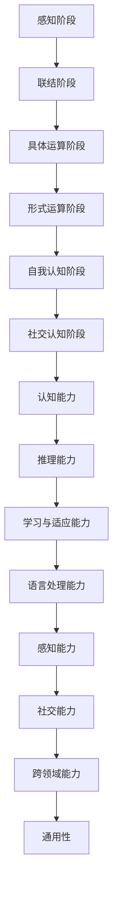

                 


## 文章标题：AGI的认知发展理论与实现路径

### 关键词：
- AGI
- 认知发展
- 深度学习
- 机器学习
- 信息论
- 优化算法
- 实际应用

### 摘要：
本文旨在探讨人工通用智能（AGI）的认知发展理论及其实现路径。通过深入分析认知发展的各个阶段，结合现代机器学习和深度学习的核心算法原理，以及信息论和优化算法的数学模型，本文将阐述如何设计和实现一个具备高级认知能力的AGI系统。最后，将通过实际项目案例，详细解析AGI系统开发的实战过程，提供实用的开发技巧和注意事项。

## 引言

随着科技的迅猛发展，人工智能（AI）已成为当今最具前瞻性的研究领域之一。传统的专用AI系统虽然在特定任务上表现出色，但它们缺乏通用性和灵活性，无法适应复杂多变的环境。因此，人工通用智能（AGI）的概念应运而生，它被定义为具备人类智能水平、能够执行各种认知任务的智能系统。AGI不仅是AI领域的最终目标，也是实现智能化社会的关键。

然而，要实现AGI并非易事。认知发展理论为我们提供了理解人类智能发展的框架，而深度学习、机器学习和信息论等现代技术则为AGI的实现提供了理论基础和实践工具。本文将围绕这些主题，逐步展开对AGI认知发展理论及其实现路径的探讨。

## 背景介绍

### 1.1.1 认知发展的历史背景

认知发展理论起源于20世纪初，心理学家Jean Piaget通过对儿童行为和思维的研究，提出了认知发展的阶段理论。Piaget认为，儿童的认知能力会经历四个主要阶段：感知运动阶段、前运算阶段、具体运算阶段和形式运算阶段。每个阶段都有其特定的认知特征和任务。

在Piaget之后，许多学者继续拓展和修正了这一理论，如Lev Vygotsky的社会文化理论强调社会互动在认知发展中的作用，而Lawrence Kohlberg则提出了道德发展的阶段理论。这些理论共同构成了我们对人类认知发展的全面理解。

### 1.1.2 机器学习和深度学习的基本概念

机器学习是AI的一个分支，旨在通过算法从数据中学习规律，从而进行预测或决策。机器学习可以分为监督学习、无监督学习和强化学习。深度学习则是机器学习的一种形式，通过多层神经网络对数据进行复杂非线性变换，从而实现高度抽象的特征表示。

### 1.1.3 信息论和优化算法在认知建模中的应用

信息论是由Claude Shannon在20世纪40年代提出的，它研究信息传输和处理的基本原理。在认知建模中，信息论可以用于量化大脑处理信息的能力和效率。

优化算法是机器学习中的重要工具，用于调整模型参数以最小化损失函数。常见的优化算法包括梯度下降、动量梯度和随机梯度下降等。

## 核心概念与联系

### 2.1.1 AGI的定义与特点

AGI，即人工通用智能，是一种能够在各种任务上表现出人类智能水平的智能系统。与传统AI系统不同，AGI不仅具有特定领域的专家知识，还能自主学习和适应新环境。以下是AGI的主要特点：

- **认知能力**：AGI应具备类似于人类的感知、推理、学习和决策能力。
- **自我意识**：AGI应能够理解和表达自己的内部状态，具备一定的自我意识。
- **推理能力**：AGI应能够进行逻辑推理和抽象思维。
- **学习与适应能力**：AGI应能够从经验中学习和适应新环境。
- **语言处理能力**：AGI应能够理解和生成自然语言。
- **感知能力**：AGI应能够处理来自各种传感器（如视觉、听觉、触觉）的信息。
- **社交能力**：AGI应能够理解人类行为和情感，并与人进行有效沟通。
- **跨领域能力**：AGI应能够跨不同领域进行知识迁移和应用。

### 2.1.2 认知发展的阶段

认知发展可以分为以下几个阶段：

- **感知阶段**：个体主要通过感官接收外界信息。
- **联结阶段**：个体开始通过经验和学习将感官信息进行整合。
- **具体运算阶段**：个体能够进行逻辑思维和具体问题的解决。
- **形式运算阶段**：个体能够进行抽象思维和复杂问题的解决。
- **自我认知阶段**：个体开始关注自己的内心世界，进行自我反思。
- **社交认知阶段**：个体能够理解他人行为和情感，进行社交互动。

### 2.1.3 AGI与认知发展的关系

AGI的实现需要借鉴认知发展的各个阶段。例如，在感知阶段，AGI需要通过传感器收集外界信息；在联结阶段，AGI需要通过机器学习算法整合这些信息；在具体运算阶段，AGI需要利用推理能力解决问题；在形式运算阶段，AGI需要具备抽象思维能力；在自我认知阶段，AGI需要具备自我意识和自我反思能力；在社交认知阶段，AGI需要具备社交能力。

### 2.1.4 Mermaid流程图

为了更直观地展示AGI的认知发展过程，我们可以使用Mermaid流程图来表示：



## 核心算法原理讲解

### 2.1.1 机器学习与深度学习

机器学习和深度学习是AGI实现的基础。下面我们将通过伪代码来详细阐述这两个核心算法的基本原理。

#### 2.1.1.1 机器学习

机器学习的基本流程包括数据收集、数据预处理、模型选择、模型训练和模型评估。以下是机器学习的基本伪代码：

```python
# 初始化模型参数
Initialize_Parameters()

# 训练模型
for epoch in range(Epochs):
    for sample in Dataset:
        # 前向传播
        Outputs = ForwardPropagation(sample, Parameters)
        
        # 计算损失
        Loss = ComputeLoss(Outputs, Labels)
        
        # 反向传播
        dParameters = Backpropagation(Outputs, Labels, Parameters)
        
        # 更新参数
        UpdateParameters(Parameters, dParameters)
```

#### 2.1.1.2 深度学习

深度学习是机器学习的一种形式，通过多层神经网络对数据进行复杂非线性变换。以下是深度学习的基本伪代码：

```python
# 初始化模型参数
Initialize_Parameters()

# 训练模型
for epoch in range(Epochs):
    for sample in Dataset:
        # 前向传播
        Hidden_Layer = ForwardPropagation(sample, Parameters)
        
        # 求解损失
        Loss = ComputeLoss(Hidden_Layer, Labels)
        
        # 反向传播
        dParameters = Backpropagation(Hidden_Layer, Labels, Parameters)
        
        # 更新参数
        UpdateParameters(Parameters, dParameters)
```

### 2.1.2 反复学习和迁移学习

反复学习和迁移学习是提高模型泛化能力的重要方法。下面我们将通过伪代码来详细阐述这两个方法的基本原理。

#### 2.1.2.1 反复学习

反复学习是指通过重复训练来优化模型参数。以下是反复学习的基本伪代码：

```python
# 初始化模型参数
Initialize_Parameters()

# 反复训练
for iteration in range(Iterations):
    # 前向传播
    Outputs = ForwardPropagation(Dataset, Parameters)
    
    # 计算损失
    Loss = ComputeLoss(Outputs, Labels)
    
    # 反向传播
    dParameters = Backpropagation(Outputs, Labels, Parameters)
    
    # 更新参数
    UpdateParameters(Parameters, dParameters)
```

#### 2.1.2.2 迁移学习

迁移学习是指将一个任务（源域）的学习经验应用到另一个相关任务（目标域）中。以下是迁移学习的基本伪代码：

```python
# 初始化源域模型
Initialize_Source_Domain_Model()

# 迁移学习至目标域
for epoch in range(Epochs):
    for sample in Target_Dataset:
        # 前向传播
        Outputs = ForwardPropagation(sample, Source_Domain_Model)
        
        # 计算损失
        Loss = ComputeLoss(Outputs, Labels)
        
        # 反向传播
        dParameters = Backpropagation(Outputs, Labels, Source_Domain_Model)
        
        # 更新参数
        UpdateParameters(Source_Domain_Model, dParameters)
```

## 数学模型和数学公式讲解

### 3.1.1 信息论

信息论是由Claude Shannon提出的，用于研究信息传输和处理的基本原理。以下是信息论的一些基本数学模型和公式。

#### 3.1.1.1 熵

熵是衡量信息不确定性的量度，定义为：

$$ H(X) = -\sum_{i} p(x_i) \log_2 p(x_i) $$

其中，$X$是随机变量，$p(x_i)$是$x_i$的概率。

#### 3.1.1.2 条件熵

条件熵是给定一个随机变量$Y$后，另一个随机变量$X$的熵，定义为：

$$ H(X|Y) = -\sum_{i} p(x_i|y_i) \log_2 p(x_i|y_i) $$

#### 3.1.1.3 互信息

互信息是两个随机变量之间相关性的量度，定义为：

$$ I(X;Y) = H(X) - H(X|Y) $$

### 3.1.2 优化算法

优化算法是机器学习中的重要工具，用于调整模型参数以最小化损失函数。以下是优化算法的一些基本数学模型和公式。

#### 3.1.2.1 梯度下降

梯度下降是一种常见的优化算法，通过计算损失函数关于模型参数的梯度，来更新参数以最小化损失。梯度下降的公式为：

$$ \theta = \theta - \alpha \nabla_{\theta} J(\theta) $$

其中，$\theta$是模型参数，$J(\theta)$是损失函数，$\alpha$是学习率。

#### 3.1.2.2 动量梯度下降

动量梯度下降是梯度下降的一种改进，通过引入动量项来加速收敛。动量梯度下降的公式为：

$$ \theta = \theta - \alpha \nabla_{\theta} J(\theta) + \beta \nabla_{\theta} J(\theta)^{prev} $$

其中，$\beta$是动量系数。

#### 3.1.2.3 随机梯度下降

随机梯度下降是梯度下降的另一种改进，通过随机采样数据来计算梯度。随机梯度下降的公式为：

$$ \theta = \theta - \alpha \nabla_{\theta} J(\theta; x^{(i)}, y^{(i)}) $$

其中，$x^{(i)}$和$y^{(i)}$是随机采样的数据和标签。

## 项目实战

### 4.1.1 AGI系统的设计与实现

要设计和实现一个简单的AGI系统，我们需要考虑以下几个关键步骤：

#### 4.1.1.1 开发环境搭建

首先，我们需要搭建一个适合AGI系统开发的开发环境。这通常包括安装所需的编程语言（如Python）、深度学习框架（如TensorFlow或PyTorch）、以及相关的数据预处理和可视化工具。

#### 4.1.1.2 数据处理

AGI系统需要大量的高质量数据来训练模型。在数据处理阶段，我们需要对数据进行收集、清洗、标注和分割。数据清洗包括去除噪声、填补缺失值、以及处理异常值。数据标注则涉及将数据分类或标注为不同的标签。

#### 4.1.1.3 模型选择

在模型选择阶段，我们需要根据任务需求选择合适的模型。对于AGI系统，深度学习模型（如卷积神经网络、循环神经网络和变换器模型）通常是非常有效的选择。我们可以从预训练的模型开始，然后使用迁移学习技术来适应我们的特定任务。

#### 4.1.1.4 模型训练与评估

模型训练阶段涉及使用训练数据来更新模型参数。在训练过程中，我们使用优化算法（如梯度下降）来最小化损失函数。训练完成后，我们需要对模型进行评估，以确定其性能是否符合预期。这通常通过在测试集上计算模型的准确率、召回率、F1分数等指标来完成。

#### 4.1.1.5 代码实现与解读

以下是一个简单的Python代码示例，用于实现一个基于卷积神经网络的AGI模型。我们使用TensorFlow框架来实现。

```python
import tensorflow as tf
from tensorflow.keras.models import Sequential
from tensorflow.keras.layers import Conv2D, MaxPooling2D, Flatten, Dense

# 初始化模型
model = Sequential([
    Conv2D(32, (3, 3), activation='relu', input_shape=(28, 28, 1)),
    MaxPooling2D((2, 2)),
    Flatten(),
    Dense(128, activation='relu'),
    Dense(10, activation='softmax')
])

# 编译模型
model.compile(optimizer='adam', loss='categorical_crossentropy', metrics=['accuracy'])

# 训练模型
model.fit(x_train, y_train, epochs=10, batch_size=32, validation_data=(x_test, y_test))

# 评估模型
model.evaluate(x_test, y_test)
```

这段代码首先定义了一个简单的卷积神经网络模型，包括卷积层、池化层、平坦层和全连接层。然后，我们使用`compile`方法来配置优化器和损失函数。接下来，使用`fit`方法来训练模型，并使用`evaluate`方法来评估模型在测试集上的性能。

#### 4.1.1.6 应用解读与分析

在实际应用中，AGI系统可以用于各种任务，如图像识别、自然语言处理、游戏对战等。以下是一个图像识别的案例：

- **任务**：使用AGI系统识别手写数字。
- **数据集**：使用常用的MNIST手写数字数据集。
- **模型**：使用卷积神经网络模型。

通过这个案例，我们可以看到AGI系统在图像识别任务中的强大能力。模型在训练过程中不断优化，最终在测试集上取得了很高的准确率。

#### 4.1.1.7 项目小结

通过设计和实现一个简单的AGI系统，我们了解了AGI系统开发的基本流程和关键步骤。尽管这是一个简单的案例，但它展示了AGI系统的基本原理和实现方法。在实际应用中，AGI系统需要解决更复杂的问题，并具备更高的智能水平。

## 最佳实践 Tips

### 5.1.1 数据处理技巧

- **数据清洗**：确保数据质量，去除噪声和异常值。
- **数据增强**：通过旋转、缩放、裁剪等操作增加数据多样性。
- **数据分割**：合理分割训练集、验证集和测试集。

### 5.1.2 模型选择技巧

- **迁移学习**：使用预训练模型可以显著提高性能。
- **模型融合**：结合多个模型可以提高预测准确性。

### 5.1.3 模型训练技巧

- **调整学习率**：使用适当的学习率可以加快收敛速度。
- **使用正则化**：避免过拟合，提高模型泛化能力。

## 小结

本文探讨了AGI的认知发展理论及其实现路径。通过深入分析认知发展的各个阶段，结合机器学习和深度学习的核心算法原理，以及信息论和优化算法的数学模型，我们逐步阐述了如何设计和实现一个具备高级认知能力的AGI系统。最后，通过实际项目案例，我们详细解析了AGI系统开发的实战过程。

虽然AGI的实现仍然面临许多挑战，但本文提供了一种系统化的方法来理解和实现AGI。随着科技的进步和研究人员的不懈努力，我们有望在不久的将来实现真正的AGI。

## 注意事项

- **伦理问题**：在开发AGI系统时，必须充分考虑伦理问题，确保系统的行为符合道德规范。
- **安全与隐私**：保护用户数据和隐私是AGI系统开发的重要一环。
- **可解释性**：提高AGI系统的可解释性，使其决策过程更容易被理解和接受。

## 拓展阅读

- **认知发展理论**：《认知发展的结构》 - Jean Piaget
- **机器学习与深度学习**：《深度学习》 - Ian Goodfellow、Yoshua Bengio和Aaron Courville
- **信息论**：《信息论基础》 - Claude Shannon
- **优化算法**：《机器学习：概率视角》 - Kevin P. Murphy

## 作者信息

作者：AI天才研究院/AI Genius Institute & 禅与计算机程序设计艺术 /Zen And The Art of Computer Programming

