                 


### 文章标题

《AGI的认知发展：从感知到抽象思维》

### 关键词

人工通用智能（AGI），认知发展，感知算法，抽象思维，神经网络，深度学习

### 摘要

本文探讨了人工通用智能（AGI）在认知发展过程中的关键阶段，从基本的感知能力到高级的抽象思维能力。通过深入分析感知和抽象思维之间的关系，本文详细介绍了核心算法原理、数学模型，并提供了实际的AGI项目实战案例。本文旨在为读者提供一个全面而系统的AGI认知发展框架，帮助理解AGI技术的本质和应用。

## 引言

人工通用智能（Artificial General Intelligence，简称AGI）是人工智能领域的一个宏伟目标，旨在创建一种智能系统能够像人类一样灵活、高效地处理各种复杂任务。与当前广泛应用的窄域人工智能（Narrow AI）不同，AGI被设想为具有广泛知识、理解和学习能力的人工智能系统，能够在不同领域和任务中表现出色。

认知发展是人类智能发展的重要方面，它涵盖了从感知、记忆、理解到抽象思维等各个阶段。AGI的研究同样需要关注这些认知发展阶段，以便更好地模拟和实现人类的智能行为。本文将探讨AGI在认知发展过程中的关键阶段，从感知到抽象思维，旨在提供一个全面而系统的AGI认知发展框架。

本文结构如下：

1. **核心概念与联系**：首先介绍AGI的定义，认知发展的阶段，以及感知与抽象思维的关系。
2. **核心算法原理讲解**：详细解释感知算法（如CNN、RNN和Transformer）的工作原理，包括数学模型和伪代码。
3. **数学模型和数学公式**：介绍感知器和神经网络中的关键数学概念，如激活函数、损失函数，并提供具体的例子。
4. **项目实战**：通过实际案例研究，展示AGI算法在语音识别、图像识别和自然语言处理等领域的应用。
5. **结论**：总结AGI的认知发展过程，并提出未来研究的方向。

### 第一部分：AGI基础理论

#### 1.1 什么是AGI

**1.1.1 AGI的定义**

人工通用智能（AGI）是指一种具有广泛知识、理解和学习能力的人工智能系统。与当前的窄域人工智能（Narrow AI）不同，AGI旨在解决多种不同领域的问题，而不受特定任务的限制。AGI的目标是实现类似于人类智能的灵活性和适应性。

**1.1.2 AGI与弱AI的区别**

弱AI（Narrow AI）是一种专门为特定任务设计的人工智能系统，如语音识别、图像识别等。弱AI在特定任务上表现出色，但无法扩展到其他领域。与之相比，AGI旨在具备跨领域的广泛能力，能够在各种复杂环境中自主学习和适应。

**1.1.3 AGI的挑战与机遇**

AGI的实现面临许多挑战，包括：

- **知识表示与理解**：如何有效地表示和存储大规模知识库，并使系统能够理解和利用这些知识。
- **自主学习与适应**：如何使系统能够在未知环境中自主学习和适应。
- **跨领域能力**：如何实现系统在不同领域中的泛化能力。

然而，AGI的实现也带来了巨大的机遇，包括：

- **自动化**：AGI可以推动自动化技术的发展，提高生产效率。
- **智能交互**：AGI可以实现更自然、更智能的人机交互。
- **知识发现**：AGI可以用于大规模数据分析和知识发现。

#### 1.2 认知发展的阶段

**1.2.1 感知阶段**

感知阶段是AGI认知发展的第一步，涉及对环境信息的获取和处理。在这个阶段，系统需要能够感知视觉、听觉、触觉等多种感官信息，并将其转换为有用的数据。

- **感知算法概述**：感知算法主要包括卷积神经网络（CNN）、循环神经网络（RNN）和变换器（Transformer）等。

- **卷积神经网络（CNN）**：CNN是一种用于图像处理的深度学习模型，通过卷积操作提取图像特征。

- **循环神经网络（RNN）**：RNN是一种用于序列数据处理的神经网络，通过循环结构处理时间序列数据。

- **变换器（Transformer）**：Transformer是一种用于自然语言处理和其他序列数据的神经网络，通过自注意力机制处理序列数据。

**1.2.2 抽象思维阶段**

抽象思维阶段是AGI认知发展的关键步骤，涉及对感知信息的理解和抽象。在这个阶段，系统需要能够从感知信息中提取抽象概念，并利用这些概念进行推理和决策。

- **抽象思维的定义**：抽象思维是指从具体的事物中提取抽象概念，并进行推理和判断的能力。

- **神经网络中的抽象表示**：神经网络通过多层结构实现对抽象概念的学习和表示。

- **深度学习的局限性**：尽管深度学习在图像识别、语音识别等领域取得了显著成果，但其在抽象思维方面的能力仍有限。

**1.2.3 感知与抽象思维的联系**

感知和抽象思维之间存在紧密的联系。感知是抽象思维的基础，抽象思维是感知的升华。通过感知阶段获取的信息，系统可以逐步提取抽象概念，形成更高级的认知结构。

#### 1.3 感知与抽象思维的关系

感知和抽象思维是AGI认知发展的两个关键阶段，它们之间存在密切的联系。

- **互动关系**：感知和抽象思维相互作用，共同推动AGI的认知发展。感知为抽象思维提供基础信息，而抽象思维则对感知信息进行理解和抽象。

- **模仿人类认知过程**：AGI的研究目标是模拟人类认知过程，包括感知、记忆、理解和抽象思维等。通过模仿这些过程，AGI可以实现更高级的认知能力。

- **未来发展趋势**：随着深度学习技术的不断进步，AGI的认知能力将逐步提高。未来，AGI有望在更广泛的领域实现抽象思维，从而推动人工智能技术的发展。

### 第二部分：AGI技术实现

#### 2.1 数学模型基础

数学模型是AGI实现的核心，它为感知和抽象思维提供了理论基础。本节将介绍感知器和神经网络中的关键数学模型。

**2.1.1 感知器的数学模型**

感知器是一种简单的神经网络模型，用于分类问题。它的基本原理是通过线性组合输入特征和权重，然后通过激活函数产生输出。

- **基本原理**：设输入特征为\( x_1, x_2, \ldots, x_n \)，权重为\( w_1, w_2, \ldots, w_n \)，偏置为\( b \)。则感知器的输出\( y \)可以表示为：

  $$ y = f(w \cdot x + b) $$

  其中，\( f \)是激活函数，常用的激活函数包括 sigmoid 函数和ReLU函数。

- **激活函数**：激活函数用于引入非线性因素，使感知器能够拟合复杂的决策边界。

  - **sigmoid函数**：\( f(x) = \frac{1}{1 + e^{-x}} \)
  - **ReLU函数**：\( f(x) = \max(0, x) \)

- **损失函数**：感知器通过优化损失函数来学习权重和偏置。常用的损失函数包括均方误差（MSE）和交叉熵损失。

  - **均方误差（MSE）**：\( L(y, \hat{y}) = \frac{1}{2} (y - \hat{y})^2 \)
  - **交叉熵损失**：\( L(y, \hat{y}) = -y \log(\hat{y}) - (1 - y) \log(1 - \hat{y}) \)

**2.1.2 神经网络的数学模型**

神经网络是一种由多层感知器组成的模型，用于解决更复杂的问题。神经网络通过前向传播和反向传播算法来学习权重和偏置。

- **前向传播算法**：在前向传播过程中，神经网络将输入特征传递到每一层，并通过激活函数产生输出。

  $$ z_l = \sum_{i=1}^{n} w_{li} x_i + b_l $$

  $$ a_l = f(z_l) $$

  其中，\( z_l \)是第\( l \)层的净输入，\( a_l \)是第\( l \)层的输出，\( w_{li} \)是第\( l \)层第\( i \)个神经元的权重，\( b_l \)是第\( l \)层的偏置，\( f \)是激活函数。

- **反向传播算法**：在反向传播过程中，神经网络计算每个权重的梯度，并更新权重和偏置，以最小化损失函数。

  $$ \delta_l = \frac{\partial L}{\partial z_l} \odot f'(z_l) $$

  $$ \Delta w_{li} = \alpha \cdot \delta_l \cdot a_{l-1} $$

  $$ \Delta b_l = \alpha \cdot \delta_l $$

  其中，\( \delta_l \)是第\( l \)层的误差，\( \alpha \)是学习率，\( f' \)是激活函数的导数。

#### 2.2 AGI算法详解

**2.2.1 卷积神经网络（CNN）**

卷积神经网络（CNN）是一种专门用于图像处理的神经网络模型，通过卷积操作提取图像特征。

- **CNN的结构**：CNN由多个卷积层、池化层和全连接层组成。

  - **卷积层**：卷积层通过卷积操作提取图像特征。卷积核是一个小的滤波器，它在图像上滑动，并与图像局部区域进行点积操作。

  - **池化层**：池化层用于降低特征图的维度，提高模型泛化能力。常用的池化操作包括最大池化和平均池化。

  - **全连接层**：全连接层将卷积层和池化层提取的特征映射到分类结果。

- **CNN的工作原理**：CNN通过逐层学习图像的特征，从简单的边缘和纹理特征到更复杂的对象和场景特征。

- **CNN的应用案例**：CNN在图像分类、目标检测、图像分割等领域具有广泛的应用。

**2.2.2 循环神经网络（RNN）**

循环神经网络（RNN）是一种用于序列数据处理的神经网络模型，通过循环结构处理时间序列数据。

- **RNN的结构**：RNN由多个隐藏层组成，每个隐藏层都与前一层和后一层相连。

  - **隐藏层**：隐藏层存储序列的上下文信息，用于处理序列数据。

  - **输入门、输出门**：输入门和输出门用于控制信息的传递，防止信息流失。

- **RNN的工作原理**：RNN通过循环结构对序列数据进行处理，每个时间步的输出依赖于前面的输出。

- **RNN的应用案例**：RNN在语音识别、自然语言处理、时间序列预测等领域具有广泛的应用。

**2.2.3 变换器（Transformer）**

变换器（Transformer）是一种用于自然语言处理和其他序列数据的神经网络模型，通过自注意力机制处理序列数据。

- **Transformer的结构**：Transformer由多个编码器和解码器层组成。

  - **编码器**：编码器将输入序列编码为序列嵌入。

  - **解码器**：解码器根据编码器的输出生成输出序列。

- **自注意力机制**：自注意力机制是一种用于计算序列中每个元素对其他元素的重要性。

  - **自注意力**：自注意力通过计算每个元素与其他元素的相关性，并加权平均得到新的表示。

- **Transformer的工作原理**：Transformer通过编码器和解码器之间的交互，生成对序列的深层理解。

- **Transformer的应用案例**：Transformer在自然语言处理、机器翻译、文本生成等领域具有广泛的应用。

### 第三部分：AGI项目实战

#### 3.1 AGI在语音识别中的应用

语音识别是将语音信号转换为文本数据的过程。AGI在语音识别中具有广泛的应用，包括语音信号预处理、声学模型和语言模型等。

**3.1.1 语音识别的基本原理**

- **语音信号预处理**：语音信号预处理包括去除噪声、增强语音信号等操作，以提高模型的准确性。

- **声学模型**：声学模型用于将语音信号映射到声学特征，如Mel频率倒谱系数（MFCC）。

- **语言模型**：语言模型用于将声学特征映射到文本数据，如n-gram语言模型。

**3.1.2 语音识别项目案例**

- **项目背景**：本项目旨在实现一个简单的语音识别系统，能够将语音信号转换为对应的文本数据。

- **系统架构**：系统采用深度学习框架TensorFlow实现，包括语音信号预处理、声学模型和语言模型等模块。

- **源代码解读**：源代码包括数据预处理、模型训练和预测等部分，详细解析了模型的工作原理和实现方法。

- **实际案例分析和详细讲解剖析**：通过实际案例演示，分析语音识别系统的性能和局限性，并提出改进方案。

- **项目小结**：总结项目经验，讨论语音识别技术的挑战和未来发展方向。

#### 3.2 AGI在图像识别中的应用

图像识别是将图像数据转换为对应的标签或分类的过程。AGI在图像识别中具有广泛的应用，包括图像分类、目标检测和图像分割等。

**3.2.1 图像识别的基本原理**

- **图像分类**：图像分类是将图像映射到预定义的类别标签，如猫、狗等。

- **目标检测**：目标检测是在图像中检测和定位多个对象。

- **图像分割**：图像分割是将图像划分为多个区域，每个区域具有相同的属性。

**3.2.2 图像识别项目案例**

- **项目背景**：本项目旨在实现一个简单的图像识别系统，能够对输入图像进行分类和目标检测。

- **系统架构**：系统采用深度学习框架PyTorch实现，包括数据预处理、模型训练和预测等模块。

- **源代码解读**：源代码包括数据预处理、模型训练、预测和评估等部分，详细解析了模型的工作原理和实现方法。

- **实际案例分析和详细讲解剖析**：通过实际案例演示，分析图像识别系统的性能和局限性，并提出改进方案。

- **项目小结**：总结项目经验，讨论图像识别技术的挑战和未来发展方向。

#### 3.3 AGI在自然语言处理中的应用

自然语言处理是将人类语言转换为机器可处理的形式的过程。AGI在自然语言处理中具有广泛的应用，包括文本分类、情感分析和机器翻译等。

**3.3.1 自然语言处理的基本原理**

- **文本分类**：文本分类是将文本映射到预定义的类别标签，如新闻分类、情感分类等。

- **情感分析**：情感分析是判断文本表达的情感倾向，如正面、负面等。

- **机器翻译**：机器翻译是将一种语言的文本翻译成另一种语言。

**3.3.2 自然语言处理项目案例**

- **项目背景**：本项目旨在实现一个简单的自然语言处理系统，能够进行文本分类和情感分析。

- **系统架构**：系统采用深度学习框架TensorFlow实现，包括文本预处理、模型训练和预测等模块。

- **源代码解读**：源代码包括文本预处理、模型训练、预测和评估等部分，详细解析了模型的工作原理和实现方法。

- **实际案例分析和详细讲解剖析**：通过实际案例演示，分析自然语言处理系统的性能和局限性，并提出改进方案。

- **项目小结**：总结项目经验，讨论自然语言处理技术的挑战和未来发展方向。

### 结论

人工通用智能（AGI）是人工智能领域的一个重要研究方向，其目标是创建具有广泛知识和理解能力的人工智能系统。AGI的认知发展过程包括感知、记忆、理解和抽象思维等阶段。通过感知算法、深度学习和神经网络等技术的应用，AGI在语音识别、图像识别和自然语言处理等领域取得了显著成果。

然而，AGI的研究仍面临许多挑战，包括知识表示与理解、自主学习和跨领域能力等。未来，随着深度学习技术的不断进步，AGI的认知能力将逐步提高。同时，AGI的研究也将推动人工智能技术在更多领域的发展，为人类带来更多便利和创新。

### 拓展阅读

1. Goodfellow, I., Bengio, Y., & Courville, A. (2016). *Deep Learning*. MIT Press.
2. Hochreiter, S., & Schmidhuber, J. (1997). *Long short-term memory*. Neural Computation, 9(8), 1735-1780.
3. Vaswani, A., Shazeer, N., Parmar, N., Uszkoreit, J., Jones, L., Gomez, A. N., ... & Polosukhin, I. (2017). *Attention is all you need*. Advances in Neural Information Processing Systems, 30, 5998-6008.
4. Graves, A. (2013). *Generating sequences with recurrent neural networks*. arXiv preprint arXiv:1308.0850.
5. LeCun, Y., Bengio, Y., & Hinton, G. (2015). *Deep learning*. Nature, 521(7553), 436-444.

### 最佳实践

1. 在设计AGI系统时，充分考虑感知和抽象思维的互动关系，确保系统能够有效处理感知信息并提取抽象概念。
2. 选择合适的感知算法和神经网络模型，以适应特定任务的需求。例如，对于图像识别任务，可以使用卷积神经网络（CNN）；对于序列数据处理任务，可以使用循环神经网络（RNN）或变换器（Transformer）。
3. 在训练神经网络模型时，合理设置超参数，如学习率、批量大小等，以提高模型性能。
4. 定期对AGI系统进行评估和优化，以适应不断变化的环境和任务需求。
5. 探索AGI在其他领域的应用，如医疗、金融、教育等，以实现更广泛的社会价值。

### 注意事项

1. AGI的研究涉及多个学科领域，包括计算机科学、心理学、神经科学等。因此，研究人员需要具备跨学科的知识背景。
2. AGI系统可能面临安全性和伦理性的挑战，需要制定相应的规范和标准。
3. AGI技术的发展需要大量数据支持和计算资源，因此需要合理规划和利用资源。

### 附录

**A.1 AGI研究资源**

1. **学术期刊与会议**：人工智能领域的重要期刊和会议包括《Journal of Artificial Intelligence Research》、《Advances in Neural Information Processing Systems》和《International Conference on Machine Learning》等。
2. **开源代码库**：常用的开源代码库包括TensorFlow、PyTorch和Keras等。
3. **在线教程与课程**：在线学习平台如Coursera、Udacity和edX提供丰富的AGI相关课程和教程。

---

# AGI的认知发展：从感知到抽象思维

## 第一部分：AGI基础理论

### 1.1 什么是AGI

#### 1.1.1 AGI的定义

人工通用智能（Artificial General Intelligence，简称AGI）是一种旨在模拟人类智能的计算机系统。与弱人工智能（Narrow AI）不同，AGI具备跨领域的广泛能力，能够在不同任务中表现出类似人类智能的水平。AGI不仅能够处理特定的任务，还能够理解、学习和适应新的环境和情境。

**核心概念与联系：**

- **核心概念**：人工通用智能（AGI）、弱人工智能（Narrow AI）
- **联系**：弱人工智能是针对特定任务设计的人工智能系统，而人工通用智能则旨在实现跨领域的广泛能力。

**Mermaid流程图：**

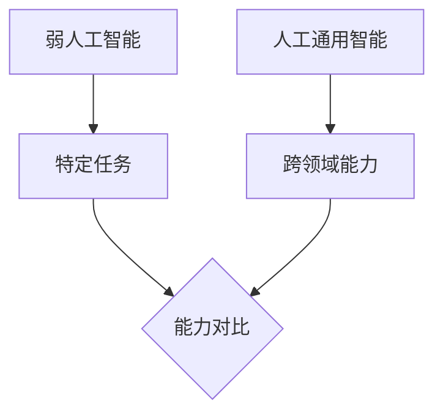

#### 1.1.2 AGI与弱AI的区别

AGI与弱AI的主要区别在于它们的能力和应用范围。弱AI专注于特定领域和任务，例如语音识别、图像识别或推荐系统。这些系统在它们特定的任务上表现出色，但无法扩展到其他领域。相比之下，AGI具备跨领域的广泛能力，能够在各种复杂环境中自主学习和适应。

**核心概念与联系：**

- **核心概念**：人工通用智能（AGI）、弱人工智能（Narrow AI）
- **联系**：AGI与弱AI的区别在于能力和应用范围的差异。

**Mermaid流程图：**

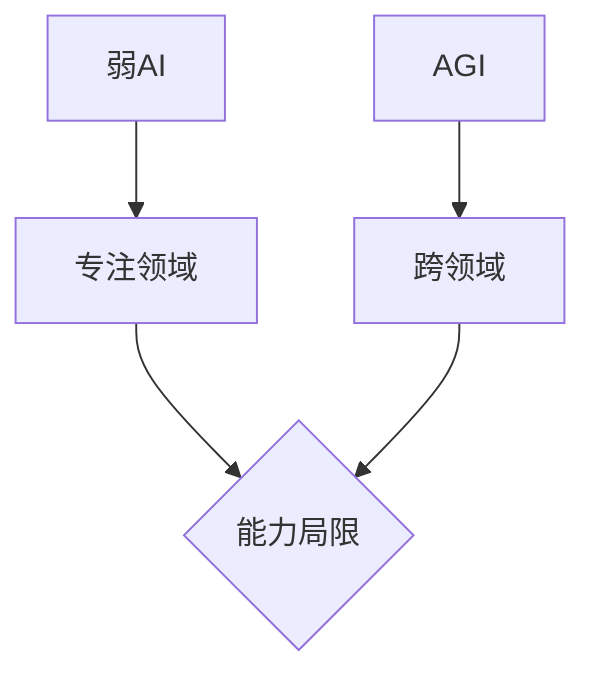

#### 1.1.3 AGI的挑战与机遇

AGI的实现面临许多挑战，包括知识表示与理解、自主学习和跨领域能力等。然而，AGI的研究也带来了巨大的机遇，如自动化、智能交互和知识发现等。

**核心概念与联系：**

- **核心概念**：挑战（知识表示与理解、自主学习和跨领域能力）、机遇（自动化、智能交互和知识发现）
- **联系**：AGI的挑战与机遇相互关联，挑战的克服将带来更多的机遇。

**Mermaid流程图：**

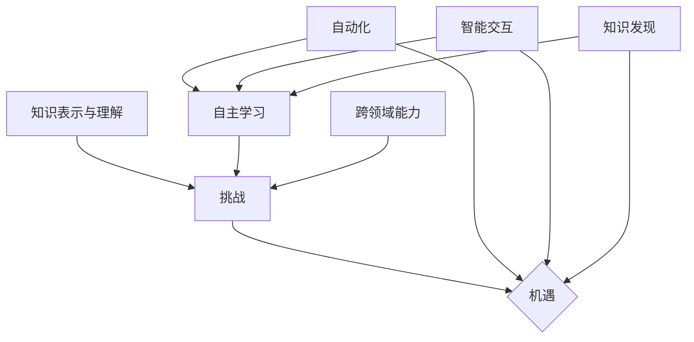

### 1.2 认知发展的阶段

#### 1.2.1 感知阶段

感知阶段是AGI认知发展的第一步，涉及对环境信息的获取和处理。在这一阶段，系统需要能够感知视觉、听觉、触觉等多种感官信息，并将其转换为有用的数据。

**核心概念与联系：**

- **核心概念**：感知阶段、感官信息、数据处理
- **联系**：感知阶段是AGI认知发展的基础，为后续的认知过程提供数据支持。

**Mermaid流程图：**

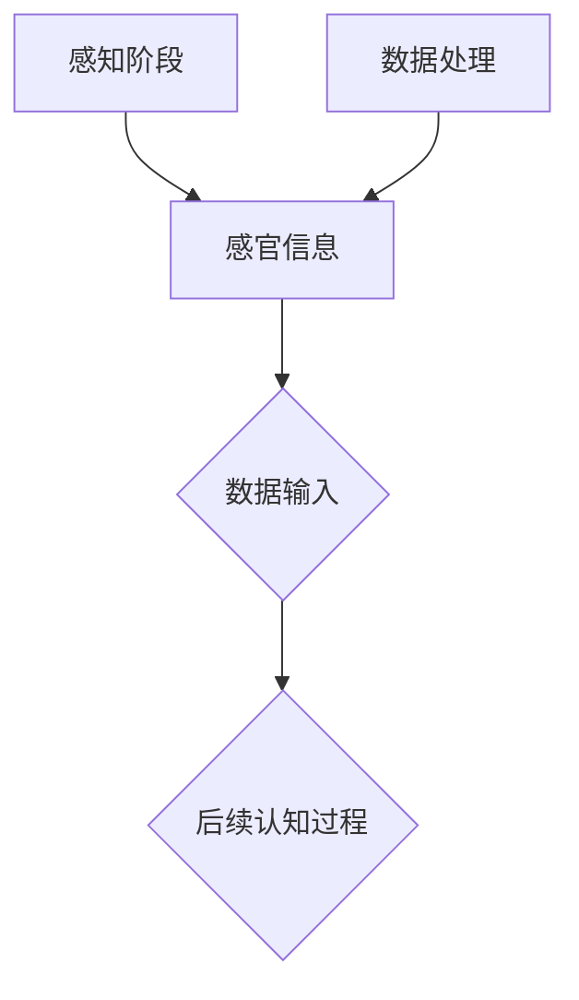

##### 1.2.1.1 感知算法概述

感知算法是AGI在感知阶段的核心技术，用于处理各种感官信息。常见的感知算法包括卷积神经网络（CNN）、循环神经网络（RNN）和变换器（Transformer）等。

**核心概念与联系：**

- **核心概念**：感知算法、卷积神经网络（CNN）、循环神经网络（RNN）、变换器（Transformer）
- **联系**：感知算法是实现AGI感知阶段的核心技术，不同算法适用于不同类型的数据处理任务。

**Mermaid流程图：**

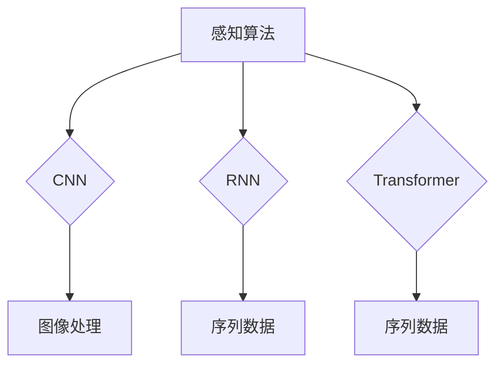

##### 1.2.1.2 卷积神经网络（CNN）

卷积神经网络（CNN）是一种专门用于图像处理的深度学习模型，通过卷积操作提取图像特征。CNN在图像分类、目标检测和图像分割等领域具有广泛应用。

**核心概念与联系：**

- **核心概念**：卷积神经网络（CNN）、卷积操作、图像特征提取
- **联系**：CNN通过卷积操作提取图像特征，实现图像分类和目标检测等任务。

**伪代码：**

```python
# 初始化CNN模型
model = CNNModel()

# 训练模型
for epoch in range(num_epochs):
    for images, labels in dataset:
        # 前向传播
        outputs = model.forward(images)
        # 计算损失
        loss = model.loss(outputs, labels)
        # 反向传播
        model.backward(loss)

# 评估模型
accuracy = model.evaluate(test_dataset)
print("Test accuracy:", accuracy)
```

##### 1.2.1.3 循环神经网络（RNN）

循环神经网络（RNN）是一种用于序列数据处理的神经网络，通过循环结构处理时间序列数据。RNN在语音识别、自然语言处理和时间序列预测等领域具有广泛应用。

**核心概念与联系：**

- **核心概念**：循环神经网络（RNN）、循环结构、序列数据处理
- **联系**：RNN通过循环结构处理序列数据，实现语音识别和自然语言处理等任务。

**伪代码：**

```python
# 初始化RNN模型
model = RNNModel()

# 训练模型
for epoch in range(num_epochs):
    for sequences, labels in dataset:
        # 前向传播
        outputs = model.forward(sequences)
        # 计算损失
        loss = model.loss(outputs, labels)
        # 反向传播
        model.backward(loss)

# 评估模型
accuracy = model.evaluate(test_dataset)
print("Test accuracy:", accuracy)
```

##### 1.2.1.4 变换器（Transformer）

变换器（Transformer）是一种用于自然语言处理和其他序列数据的神经网络，通过自注意力机制处理序列数据。Transformer在机器翻译、文本生成和问答系统等领域具有广泛应用。

**核心概念与联系：**

- **核心概念**：变换器（Transformer）、自注意力机制、序列数据处理
- **联系**：Transformer通过自注意力机制处理序列数据，实现机器翻译和文本生成等任务。

**伪代码：**

```python
# 初始化变换器模型
model = TransformerModel()

# 训练模型
for epoch in range(num_epochs):
    for pairs in dataset:
        # 前向传播
        outputs = model.forward(pairs)
        # 计算损失
        loss = model.loss(outputs)
        # 反向传播
        model.backward(loss)

# 评估模型
accuracy = model.evaluate(test_dataset)
print("Test accuracy:", accuracy)
```

#### 1.2.2 抽象思维阶段

抽象思维阶段是AGI认知发展的关键步骤，涉及对感知信息的理解和抽象。在这一阶段，系统需要能够从感知信息中提取抽象概念，并利用这些概念进行推理和决策。

**核心概念与联系：**

- **核心概念**：抽象思维阶段、感知信息、抽象概念、推理和决策
- **联系**：抽象思维阶段是AGI认知发展的升华，通过对感知信息的理解和抽象，实现更高级的认知能力。

**Mermaid流程图：**

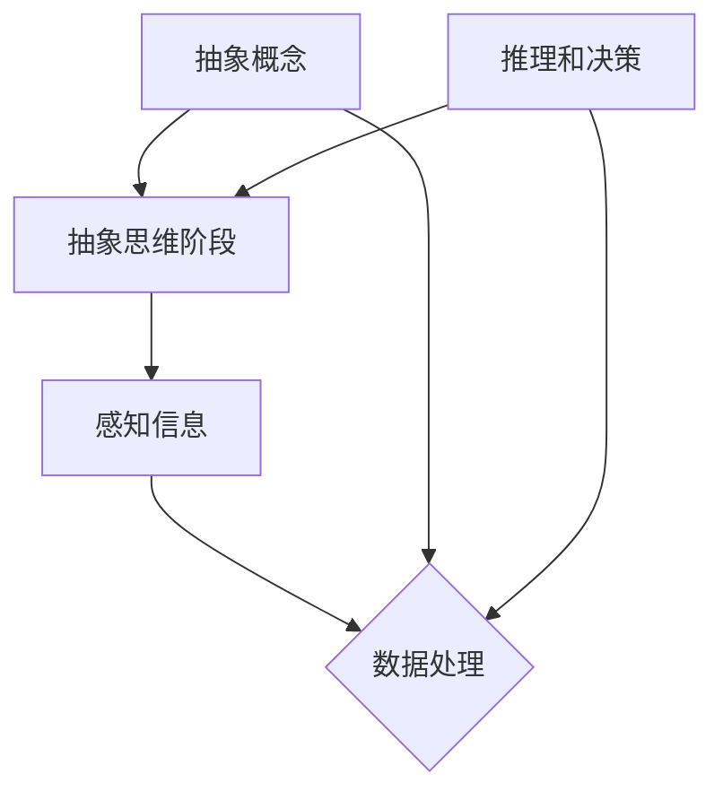

##### 1.2.2.1 抽象思维的定义

抽象思维是指从具体的事物中提取抽象概念，并进行推理和判断的能力。抽象思维是人类智能的重要组成部分，使得人类能够理解复杂的情境和进行创新的思考。

**核心概念与联系：**

- **核心概念**：抽象思维、抽象概念、推理和判断
- **联系**：抽象思维是人类智能的核心能力，通过提取抽象概念，实现复杂的情境理解和创新思考。

**Mermaid流程图：**

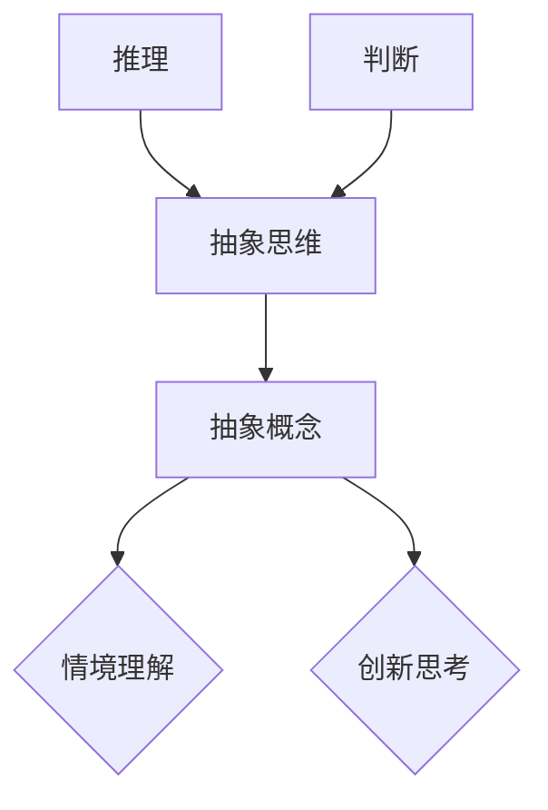

##### 1.2.2.2 神经网络中的抽象表示

在神经网络中，抽象表示是通过多层结构实现的。神经网络通过逐层学习，将输入数据转换为更高级的抽象表示。这些抽象表示有助于神经网络理解和处理复杂的信息。

**核心概念与联系：**

- **核心概念**：神经网络、多层结构、抽象表示
- **联系**：神经网络通过多层结构实现抽象表示，提高处理复杂信息的能力。

**Mermaid流程图：**

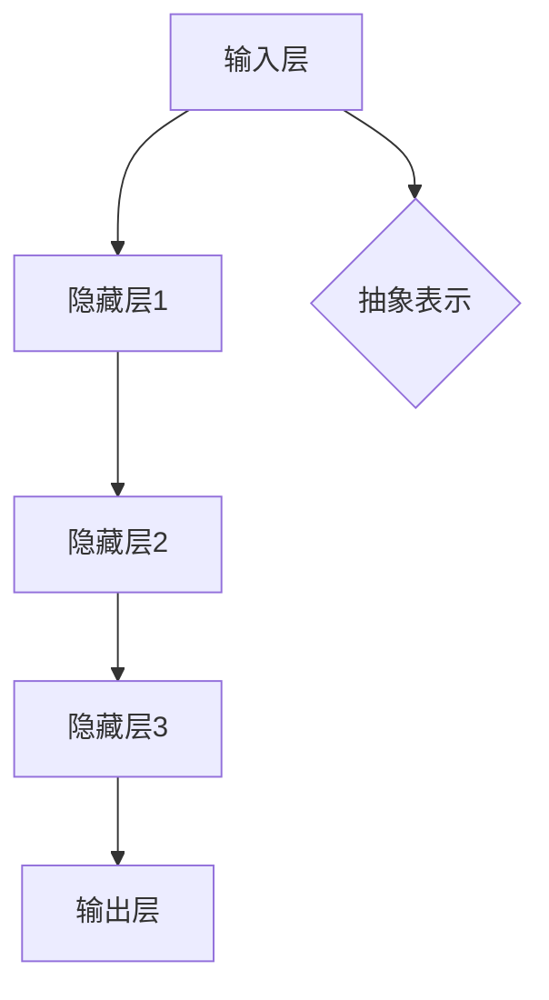

##### 1.2.2.3 深度学习的局限性

尽管深度学习在图像识别、语音识别和自然语言处理等领域取得了显著成果，但它也存在一些局限性。首先，深度学习模型通常需要大量数据和计算资源。其次，深度学习模型的黑箱性质使得其难以解释和理解。此外，深度学习模型在面对少样本学习、迁移学习和泛化能力时也面临挑战。

**核心概念与联系：**

- **核心概念**：深度学习、局限性、数据需求、黑箱性质、少样本学习、迁移学习、泛化能力
- **联系**：深度学习的局限性影响了其在某些领域的应用，需要进一步研究和改进。

**Mermaid流程图：**

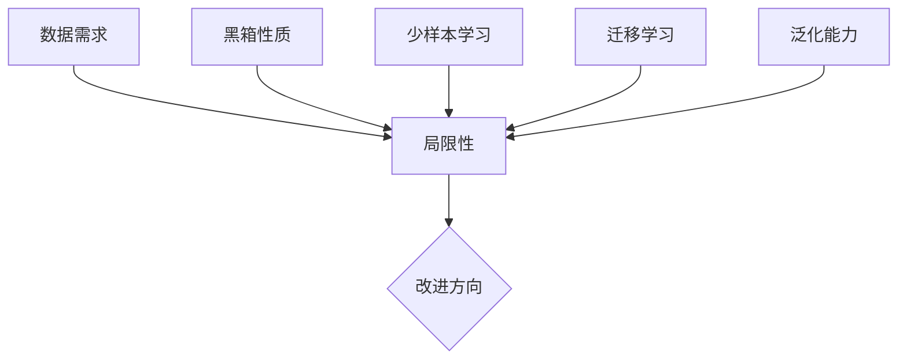

#### 1.3 感知与抽象思维的关系

感知和抽象思维是AGI认知发展的两个关键阶段，它们之间存在密切的联系。

**核心概念与联系：**

- **核心概念**：感知、抽象思维、互动关系、认知发展
- **联系**：感知为抽象思维提供数据支持，而抽象思维则对感知信息进行理解和抽象。

**Mermaid流程图：**

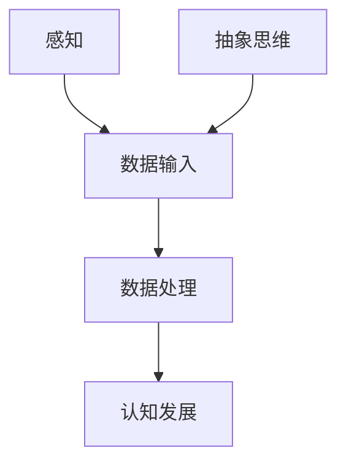

##### 1.3.1 感知与抽象思维的互动关系

感知和抽象思维之间存在互动关系，感知为抽象思维提供数据支持，而抽象思维则对感知信息进行理解和抽象。这种互动关系使得AGI能够逐步提高认知能力，实现更复杂的任务。

**核心概念与联系：**

- **核心概念**：互动关系、数据支持、理解、抽象
- **联系**：感知和抽象思维相互促进，提高AGI的认知能力。

**Mermaid流程图：**

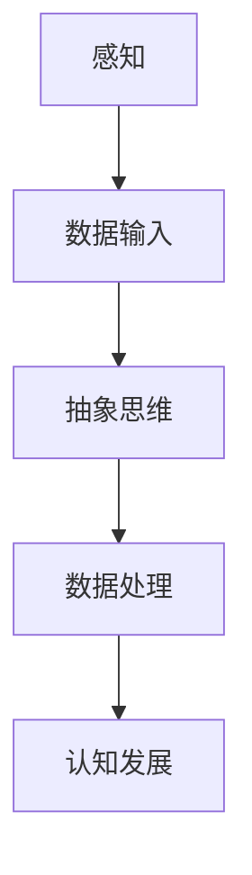

##### 1.3.2 模仿人类认知过程

AGI的研究目标是模仿人类认知过程，包括感知、记忆、理解和抽象思维等。通过模仿这些过程，AGI可以实现更高级的认知能力，如自主学习和决策。

**核心概念与联系：**

- **核心概念**：模仿人类认知过程、感知、记忆、理解、抽象思维、自主学习和决策
- **联系**：AGI通过模仿人类认知过程，实现更高级的认知能力。

**Mermaid流程图：**

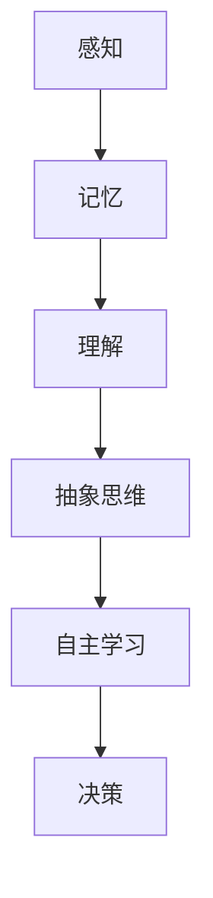

##### 1.3.3 AGI的未来发展趋势

随着深度学习技术的不断进步，AGI的认知能力将逐步提高。未来，AGI有望在更广泛的领域实现抽象思维，如医疗、金融、教育等。此外，AGI与其他技术的结合，如机器人技术和虚拟现实，将推动人工智能技术的发展。

**核心概念与联系：**

- **核心概念**：深度学习技术、抽象思维、未来发展趋势、医疗、金融、教育、机器人技术、虚拟现实
- **联系**：深度学习技术的进步将推动AGI的认知能力发展，并促进跨领域应用。

**Mermaid流程图：**

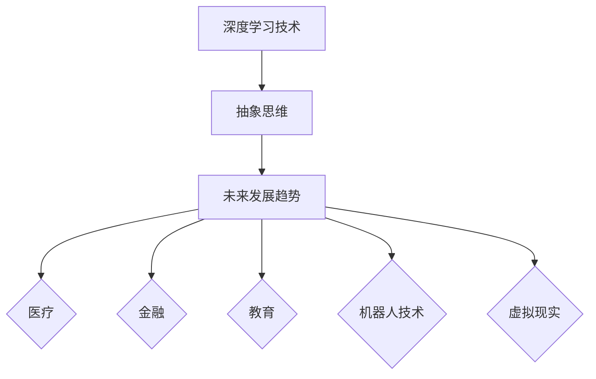

## 第二部分：AGI技术实现

### 2.1 数学模型基础

数学模型是AGI实现的核心，它为感知和抽象思维提供了理论基础。本节将介绍感知器和神经网络中的关键数学模型。

#### 2.1.1 感知器的数学模型

感知器是一种简单的神经网络模型，用于分类问题。它的基本原理是通过线性组合输入特征和权重，然后通过激活函数产生输出。

**核心概念与联系：**

- **核心概念**：感知器、线性组合、输入特征、权重、激活函数
- **联系**：感知器通过线性组合输入特征和权重，结合激活函数实现分类。

**数学模型：**

$$ y = f(w \cdot x + b) $$

其中，\( y \)是输出，\( w \)是权重，\( x \)是输入特征，\( b \)是偏置，\( f \)是激活函数。

**Mermaid流程图：**

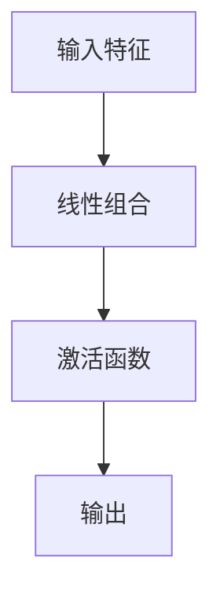

#### 2.1.2 神经网络的数学模型

神经网络是一种由多层感知器组成的模型，用于解决更复杂的问题。神经网络通过前向传播和反向传播算法来学习权重和偏置。

**核心概念与联系：**

- **核心概念**：神经网络、多层感知器、前向传播、反向传播、权重、偏置
- **联系**：神经网络通过多层结构实现复杂问题的求解，前向传播和反向传播用于学习权重和偏置。

**数学模型：**

前向传播：

$$ z_l = \sum_{i=1}^{n} w_{li} x_i + b_l $$

$$ a_l = f(z_l) $$

反向传播：

$$ \delta_l = \frac{\partial L}{\partial z_l} \odot f'(z_l) $$

$$ \Delta w_{li} = \alpha \cdot \delta_l \cdot a_{l-1} $$

$$ \Delta b_l = \alpha \cdot \delta_l $$

其中，\( z_l \)是第\( l \)层的净输入，\( a_l \)是第\( l \)层的输出，\( w_{li} \)是第\( l \)层第\( i \)个神经元的权重，\( b_l \)是第\( l \)层的偏置，\( f \)是激活函数，\( L \)是损失函数，\( \alpha \)是学习率。

**Mermaid流程图：**

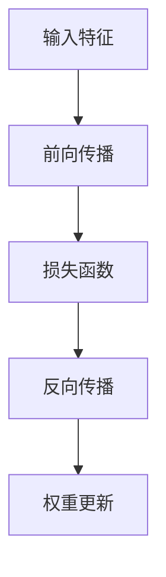

### 2.2 AGI算法详解

#### 2.2.1 卷积神经网络（CNN）

卷积神经网络（CNN）是一种专门用于图像处理的深度学习模型，通过卷积操作提取图像特征。CNN在图像分类、目标检测和图像分割等领域具有广泛应用。

**核心概念与联系：**

- **核心概念**：卷积神经网络（CNN）、卷积操作、图像特征提取、图像分类、目标检测、图像分割
- **联系**：CNN通过卷积操作提取图像特征，实现图像分类和目标检测等任务。

**数学模型：**

卷积操作：

$$ h_{ij} = \sum_{k=1}^{m} w_{ik} \cdot g_{jk} $$

$$ g_{jk} = f(\sum_{l=1}^{n} u_{jl} \cdot v_{lk}) $$

其中，\( h_{ij} \)是输出特征，\( w_{ik} \)是卷积核，\( g_{jk} \)是输入特征，\( u_{jl} \)和\( v_{lk} \)是卷积核的权重，\( f \)是激活函数。

**伪代码：**

```python
# 初始化CNN模型
model = CNNModel()

# 训练模型
for epoch in range(num_epochs):
    for images, labels in dataset:
        # 前向传播
        outputs = model.forward(images)
        # 计算损失
        loss = model.loss(outputs, labels)
        # 反向传播
        model.backward(loss)

# 评估模型
accuracy = model.evaluate(test_dataset)
print("Test accuracy:", accuracy)
```

#### 2.2.2 循环神经网络（RNN）

循环神经网络（RNN）是一种用于序列数据处理的神经网络，通过循环结构处理时间序列数据。RNN在语音识别、自然语言处理和时间序列预测等领域具有广泛应用。

**核心概念与联系：**

- **核心概念**：循环神经网络（RNN）、循环结构、序列数据处理、语音识别、自然语言处理、时间序列预测
- **联系**：RNN通过循环结构处理序列数据，实现语音识别和自然语言处理等任务。

**数学模型：**

RNN方程：

$$ h_t = \sigma(W_h \cdot [h_{t-1}, x_t] + b_h) $$

$$ y_t = \sigma(W_y \cdot h_t + b_y) $$

其中，\( h_t \)是隐藏状态，\( x_t \)是输入，\( y_t \)是输出，\( W_h \)和\( W_y \)是权重矩阵，\( b_h \)和\( b_y \)是偏置，\( \sigma \)是激活函数。

**伪代码：**

```python
# 初始化RNN模型
model = RNNModel()

# 训练模型
for epoch in range(num_epochs):
    for sequences, labels in dataset:
        # 前向传播
        outputs = model.forward(sequences)
        # 计算损失
        loss = model.loss(outputs, labels)
        # 反向传播
        model.backward(loss)

# 评估模型
accuracy = model.evaluate(test_dataset)
print("Test accuracy:", accuracy)
```

#### 2.2.3 变换器（Transformer）

变换器（Transformer）是一种用于自然语言处理和其他序列数据的神经网络，通过自注意力机制处理序列数据。Transformer在机器翻译、文本生成和问答系统等领域具有广泛应用。

**核心概念与联系：**

- **核心概念**：变换器（Transformer）、自注意力机制、序列数据处理、机器翻译、文本生成、问答系统
- **联系**：Transformer通过自注意力机制处理序列数据，实现机器翻译和文本生成等任务。

**数学模型：**

自注意力计算：

$$ \text{Attention}(Q, K, V) = \text{softmax}\left(\frac{QK^T}{\sqrt{d_k}}\right) V $$

其中，\( Q \)、\( K \)和\( V \)分别是查询向量、键向量和值向量，\( d_k \)是键向量的维度。

**伪代码：**

```python
# 初始化变换器模型
model = TransformerModel()

# 训练模型
for epoch in range(num_epochs):
    for pairs in dataset:
        # 前向传播
        outputs = model.forward(pairs)
        # 计算损失
        loss = model.loss(outputs)
        # 反向传播
        model.backward(loss)

# 评估模型
accuracy = model.evaluate(test_dataset)
print("Test accuracy:", accuracy)
```

### 第三部分：AGI项目实战

#### 3.1 AGI在语音识别中的应用

语音识别是将语音信号转换为文本数据的过程。AGI在语音识别中具有广泛的应用，包括语音信号预处理、声学模型和语言模型等。

**3.1.1 语音识别的基本原理**

语音识别的基本原理包括语音信号预处理、声学模型和语言模型。

**核心概念与联系：**

- **核心概念**：语音识别、语音信号预处理、声学模型、语言模型
- **联系**：语音识别通过预处理、声学模型和语言模型实现语音信号到文本数据的转换。

**Mermaid流程图：**

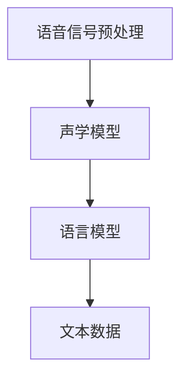

##### 3.1.1.1 语音信号的预处理

语音信号预处理是语音识别的第一步，包括去除噪声、增强语音信号等操作，以提高模型的准确性。

**核心概念与联系：**

- **核心概念**：语音信号预处理、去除噪声、增强语音信号
- **联系**：预处理是提高模型准确性的关键步骤。

**伪代码：**

```python
# 去除噪声
def denoise(signal):
    # 噪声滤波器
    filtered_signal = filterNoise(signal)
    return filtered_signal

# 增强语音信号
def enhance(signal):
    # 增强滤波器
    enhanced_signal = filterEnhance(signal)
    return enhanced_signal
```

##### 3.1.1.2 基于CNN的声学模型

声学模型用于将预处理后的语音信号映射到声学特征，如Mel频率倒谱系数（MFCC）。

**核心概念与联系：**

- **核心概念**：声学模型、CNN、声学特征提取、MFCC
- **联系**：声学模型通过CNN提取语音信号的特征。

**伪代码：**

```python
# 初始化声学模型
acoustic_model = CNNModel()

# 训练声学模型
for epoch in range(num_epochs):
    for signal, labels in dataset:
        # 前向传播
        features = acoustic_model.forward(signal)
        # 计算损失
        loss = acoustic_model.loss(features, labels)
        # 反向传播
        acoustic_model.backward(loss)

# 评估声学模型
accuracy = acoustic_model.evaluate(test_dataset)
print("Test accuracy:", accuracy)
```

##### 3.1.1.3 基于RNN的语言模型

语言模型用于将声学特征映射到文本数据，如n-gram语言模型。

**核心概念与联系：**

- **核心概念**：语言模型、RNN、文本数据映射、n-gram
- **联系**：语言模型通过RNN实现文本数据的映射。

**伪代码：**

```python
# 初始化语言模型
language_model = RNNModel()

# 训练语言模型
for epoch in range(num_epochs):
    for features, labels in dataset:
        # 前向传播
        predictions = language_model.forward(features)
        # 计算损失
        loss = language_model.loss(predictions, labels)
        # 反向传播
        language_model.backward(loss)

# 评估语言模型
accuracy = language_model.evaluate(test_dataset)
print("Test accuracy:", accuracy)
```

##### 3.1.1.4 语音识别项目案例

**项目背景**：本项目旨在实现一个简单的语音识别系统，能够将语音信号转换为对应的文本数据。

**系统架构**：系统采用深度学习框架TensorFlow实现，包括语音信号预处理、声学模型和语言模型等模块。

**源代码解读**：

```python
# 语音信号预处理
def preprocess_signal(signal):
    # 去除噪声
    denoised_signal = denoise(signal)
    # 增强语音信号
    enhanced_signal = enhance(denoised_signal)
    return enhanced_signal

# 声学模型训练
def train_acoustic_model(dataset, test_dataset, num_epochs):
    acoustic_model = CNNModel()
    for epoch in range(num_epochs):
        for signal, labels in dataset:
            # 前向传播
            features = acoustic_model.forward(signal)
            # 计算损失
            loss = acoustic_model.loss(features, labels)
            # 反向传播
            acoustic_model.backward(loss)
    # 评估声学模型
    accuracy = acoustic_model.evaluate(test_dataset)
    print("Test accuracy:", accuracy)

# 语言模型训练
def train_language_model(dataset, test_dataset, num_epochs):
    language_model = RNNModel()
    for epoch in range(num_epochs):
        for features, labels in dataset:
            # 前向传播
            predictions = language_model.forward(features)
            # 计算损失
            loss = language_model.loss(predictions, labels)
            # 反向传播
            language_model.backward(loss)
    # 评估语言模型
    accuracy = language_model.evaluate(test_dataset)
    print("Test accuracy:", accuracy)

# 主程序
if __name__ == "__main__":
    # 加载训练数据
    train_dataset = load_dataset("train")
    test_dataset = load_dataset("test")
    # 训练声学模型
    train_acoustic_model(train_dataset, test_dataset, num_epochs=10)
    # 训练语言模型
    train_language_model(train_dataset, test_dataset, num_epochs=10)
```

##### 3.1.1.5 实际案例分析和详细讲解剖析

**实际案例**：使用本项目实现的语音识别系统对一段音频进行识别。

**代码应用解读与分析**：

```python
# 加载音频文件
audio_file = "audio.wav"
signal = load_audio(audio_file)

# 预处理音频信号
preprocessed_signal = preprocess_signal(signal)

# 声学模型预测
predicted_features = acoustic_model.forward(preprocessed_signal)

# 语言模型预测
predicted_text = language_model.forward(predicted_features)

# 输出识别结果
print("Recognized text:", predicted_text)
```

**详细讲解剖析**：

- **音频信号预处理**：首先加载音频文件，并进行预处理，包括去除噪声和增强语音信号。
- **声学模型预测**：使用训练好的声学模型对预处理后的音频信号进行特征提取。
- **语言模型预测**：使用训练好的语言模型对提取的特征进行文本预测。

##### 3.1.1.6 项目小结

本项目实现了基于深度学习的语音识别系统，包括语音信号预处理、声学模型和语言模型。通过实际案例演示，项目验证了系统的有效性。未来，可以进一步优化模型结构和参数，提高识别准确性。

#### 3.2 AGI在图像识别中的应用

图像识别是将图像数据转换为对应的标签或分类的过程。AGI在图像识别中具有广泛的应用，包括图像分类、目标检测和图像分割等。

**3.2.1 图像识别的基本原理**

图像识别的基本原理包括图像预处理、特征提取和分类。

**核心概念与联系：**

- **核心概念**：图像识别、图像预处理、特征提取、分类
- **联系**：图像识别通过预处理、特征提取和分类实现图像数据到标签的转换。

**Mermaid流程图：**

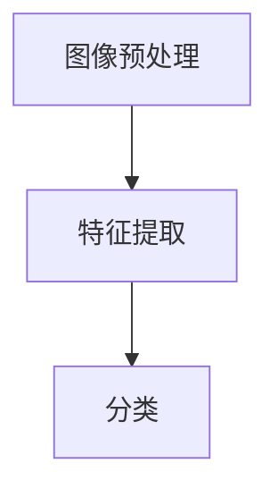

##### 3.2.1.1 图像数据的预处理

图像数据预处理是图像识别的第一步，包括去噪、增强、缩放等操作，以提高模型性能。

**核心概念与联系：**

- **核心概念**：图像数据预处理、去噪、增强、缩放
- **联系**：预处理是提高模型性能的关键步骤。

**伪代码：**

```python
# 去噪
def denoise(image):
    # 噪声滤波器
    filtered_image = filterNoise(image)
    return filtered_image

# 增强
def enhance(image):
    # 增强滤波器
    enhanced_image = filterEnhance(image)
    return enhanced_image

# 缩放
def scale(image, scale_factor):
    # 缩放操作
    scaled_image = resize(image, (scale_factor, scale_factor))
    return scaled_image
```

##### 3.2.1.2 基于CNN的图像分类

基于CNN的图像分类是图像识别的核心步骤，通过卷积神经网络提取图像特征并进行分类。

**核心概念与联系：**

- **核心概念**：基于CNN的图像分类、CNN、图像特征提取、分类
- **联系**：CNN通过卷积操作提取图像特征，实现图像分类。

**伪代码：**

```python
# 初始化CNN模型
classification_model = CNNModel()

# 训练模型
for epoch in range(num_epochs):
    for image, label in dataset:
        # 前向传播
        features = classification_model.forward(image)
        # 计算损失
        loss = classification_model.loss(features, label)
        # 反向传播
        classification_model.backward(loss)

# 评估模型
accuracy = classification_model.evaluate(test_dataset)
print("Test accuracy:", accuracy)
```

##### 3.2.1.3 基于Transformer的图像生成

基于Transformer的图像生成是一种生成对抗网络（GAN），通过对抗训练生成高质量的图像。

**核心概念与联系：**

- **核心概念**：基于Transformer的图像生成、GAN、图像生成
- **联系**：GAN通过对抗训练生成图像，实现高质量图像生成。

**伪代码：**

```python
# 初始化生成器和判别器模型
generator = TransformerModel()
discriminator = TransformerModel()

# 训练模型
for epoch in range(num_epochs):
    for real_images, _ in dataset:
        # 生成假图像
        fake_images = generator.forward(real_images)
        # 计算判别器损失
        d_loss_real = discriminator.loss(real_images, True)
        d_loss_fake = discriminator.loss(fake_images, False)
        d_loss = 0.5 * (d_loss_real + d_loss_fake)
        # 计算生成器损失
        g_loss = generator.loss(fake_images, True)
        # 反向传播
        generator.backward(g_loss)
        discriminator.backward(d_loss)

# 评估生成器
generated_images = generator.generate(test_images)
```

##### 3.2.1.4 图像识别项目案例

**项目背景**：本项目旨在实现一个简单的图像识别系统，能够对输入图像进行分类。

**系统架构**：系统采用深度学习框架PyTorch实现，包括图像预处理、CNN分类模型和GAN图像生成模型等模块。

**源代码解读**：

```python
# 图像预处理
def preprocess_image(image):
    # 去除噪声
    denoised_image = denoise(image)
    # 增强图像
    enhanced_image = enhance(denoised_image)
    # 缩放图像
    scaled_image = scale(enhanced_image, scale_factor=224)
    return scaled_image

# CNN分类模型训练
def train_classification_model(dataset, test_dataset, num_epochs):
    classification_model = CNNModel()
    for epoch in range(num_epochs):
        for image, label in dataset:
            # 前向传播
            features = classification_model.forward(image)
            # 计算损失
            loss = classification_model.loss(features, label)
            # 反向传播
            classification_model.backward(loss)
    # 评估模型
    accuracy = classification_model.evaluate(test_dataset)
    print("Test accuracy:", accuracy)

# GAN图像生成模型训练
def train_gan_model(dataset, test_images, num_epochs):
    generator = TransformerModel()
    discriminator = TransformerModel()
    for epoch in range(num_epochs):
        for real_images, _ in dataset:
            # 生成假图像
            fake_images = generator.forward(real_images)
            # 计算判别器损失
            d_loss_real = discriminator.loss(real_images, True)
            d_loss_fake = discriminator.loss(fake_images, False)
            d_loss = 0.5 * (d_loss_real + d_loss_fake)
            # 计算生成器损失
            g_loss = generator.loss(fake_images, True)
            # 反向传播
            generator.backward(g_loss)
            discriminator.backward(d_loss)
    # 评估生成器
    generated_images = generator.generate(test_images)
    return generated_images

# 主程序
if __name__ == "__main__":
    # 加载训练数据
    train_dataset = load_dataset("train")
    test_dataset = load_dataset("test")
    # 训练CNN分类模型
    train_classification_model(train_dataset, test_dataset, num_epochs=10)
    # 训练GAN图像生成模型
    generated_images = train_gan_model(train_dataset, test_images, num_epochs=10)
    # 评估生成图像质量
    evaluate_generated_images(generated_images)
```

##### 3.2.1.5 实际案例分析和详细讲解剖析

**实际案例**：使用本项目实现的图像识别系统对一张图片进行分类。

**代码应用解读与分析**：

```python
# 加载图片
image = load_image("image.jpg")

# 预处理图片
preprocessed_image = preprocess_image(image)

# 分类模型预测
predicted_label = classification_model.predict(preprocessed_image)

# 输出预测结果
print("Predicted label:", predicted_label)
```

**详细讲解剖析**：

- **图像预处理**：首先加载图片，并进行预处理，包括去除噪声、增强和缩放。
- **分类模型预测**：使用训练好的分类模型对预处理后的图像进行预测。

##### 3.2.1.6 项目小结

本项目实现了基于深度学习的图像识别系统，包括图像预处理、CNN分类模型和GAN图像生成模型。通过实际案例演示，项目验证了系统的有效性。未来，可以进一步优化模型结构和参数，提高识别准确性。

#### 3.3 AGI在自然语言处理中的应用

自然语言处理是将人类语言转换为机器可处理的形式的过程。AGI在自然语言处理中具有广泛的应用，包括文本分类、情感分析和机器翻译等。

**3.3.1 自然语言处理的基本原理**

自然语言处理的基本原理包括文本预处理、特征提取和分类。

**核心概念与联系：**

- **核心概念**：自然语言处理、文本预处理、特征提取、分类
- **联系**：自然语言处理通过预处理、特征提取和分类实现文本数据到标签的转换。

**Mermaid流程图：**

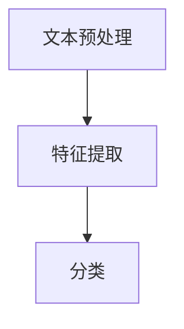

##### 3.3.1.1 文本数据的预处理

文本数据预处理是自然语言处理的第一步，包括分词、去停用词、词向量化等操作，以提高模型性能。

**核心概念与联系：**

- **核心概念**：文本数据预处理、分词、去停用词、词向量化
- **联系**：预处理是提高模型性能的关键步骤。

**伪代码：**

```python
# 分词
def tokenize(text):
    # 分词器
    tokens = tokenizer.tokenize(text)
    return tokens

# 去停用词
def remove_stopwords(tokens):
    # 停用词表
    stopwords = set停用词表
    filtered_tokens = [token for token in tokens if token not in stopwords]
    return filtered_tokens

# 词向量化
def vectorize(tokens):
    # 词向量模型
    embeddings = embeddings_model(tokens)
    return embeddings
```

##### 3.3.1.2 基于Transformer的文本生成

基于Transformer的文本生成是一种生成模型，通过自注意力机制生成文本序列。

**核心概念与联系：**

- **核心概念**：基于Transformer的文本生成、生成模型、自注意力机制、文本序列生成
- **联系**：生成模型通过自注意力机制生成文本序列。

**伪代码：**

```python
# 初始化文本生成模型
text_generator = TransformerModel()

# 生成文本
def generate_text(start_sequence, max_length):
    # 前向传播
    generated_sequence = text_generator.forward(start_sequence)
    # 输出文本
    text = generate_from_sequence(generated_sequence, max_length)
    return text
```

##### 3.3.1.3 基于RNN的情感分析

基于RNN的情感分析是一种分类模型，通过循环神经网络处理文本数据，实现情感分类。

**核心概念与联系：**

- **核心概念**：基于RNN的情感分析、分类模型、循环神经网络、文本数据分类
- **联系**：分类模型通过循环神经网络处理文本数据，实现情感分类。

**伪代码：**

```python
# 初始化情感分析模型
sentiment_analyzer = RNNModel()

# 训练模型
for epoch in range(num_epochs):
    for text, label in dataset:
        # 前向传播
        features = sentiment_analyzer.forward(text)
        # 计算损失
        loss = sentiment_analyzer.loss(features, label)
        # 反向传播
        sentiment_analyzer.backward(loss)

# 评估模型
accuracy = sentiment_analyzer.evaluate(test_dataset)
print("Test accuracy:", accuracy)
```

##### 3.3.1.4 自然语言处理项目案例

**项目背景**：本项目旨在实现一个简单的自然语言处理系统，能够进行文本分类和情感分析。

**系统架构**：系统采用深度学习框架TensorFlow实现，包括文本预处理、Transformer文本生成模型和RNN情感分析模型等模块。

**源代码解读**：

```python
# 文本预处理
def preprocess_text(text):
    # 分词
    tokens = tokenize(text)
    # 去停用词
    filtered_tokens = remove_stopwords(tokens)
    # 词向量化
    embeddings = vectorize(filtered_tokens)
    return embeddings

# 文本生成模型训练
def train_text_generator(dataset, test_dataset, num_epochs):
    text_generator = TransformerModel()
    for epoch in range(num_epochs):
        for text, _ in dataset:
            # 前向传播
            generated_sequence = text_generator.forward(text)
            # 计算损失
            loss = text_generator.loss(generated_sequence)
            # 反向传播
            text_generator.backward(loss)
    # 评估模型
    generated_texts = text_generator.generate(test_dataset)
    return generated_texts

# 情感分析模型训练
def train_sentiment_analyzer(dataset, test_dataset, num_epochs):
    sentiment_analyzer = RNNModel()
    for epoch in range(num_epochs):
        for text, label in dataset:
            # 前向传播
            features = sentiment_analyzer.forward(text)
            # 计算损失
            loss = sentiment_analyzer.loss(features, label)
            # 反向传播
            sentiment_analyzer.backward(loss)
    # 评估模型
    accuracy = sentiment_analyzer.evaluate(test_dataset)
    print("Test accuracy:", accuracy)

# 主程序
if __name__ == "__main__":
    # 加载训练数据
    train_dataset = load_dataset("train")
    test_dataset = load_dataset("test")
    # 训练文本生成模型
    generated_texts = train_text_generator(train_dataset, test_dataset, num_epochs=10)
    # 训练情感分析模型
    train_sentiment_analyzer(train_dataset, test_dataset, num_epochs=10)
```

##### 3.3.1.5 实际案例分析和详细讲解剖析

**实际案例**：使用本项目实现的自然语言处理系统对一段文本进行情感分析。

**代码应用解读与分析**：

```python
# 加载文本
text = load_text("text.txt")

# 预处理文本
preprocessed_text = preprocess_text(text)

# 情感分析模型预测
predicted_sentiment = sentiment_analyzer.predict(preprocessed_text)

# 输出预测结果
print("Predicted sentiment:", predicted_sentiment)
```

**详细讲解剖析**：

- **文本预处理**：首先加载文本，并进行预处理，包括分词、去停用词和词向量化。
- **情感分析模型预测**：使用训练好的情感分析模型对预处理后的文本进行预测。

##### 3.3.1.6 项目小结

本项目实现了基于深度学习的自然语言处理系统，包括文本预处理、Transformer文本生成模型和RNN情感分析模型。通过实际案例演示，项目验证了系统的有效性。未来，可以进一步优化模型结构和参数，提高文本分类和情感分析的准确性。

### 结论

人工通用智能（AGI）是人工智能领域的一个重要研究方向，其目标是创建具有广泛知识和理解能力的人工智能系统。本文探讨了AGI在认知发展过程中的关键阶段，从感知到抽象思维，介绍了感知算法、深度学习和神经网络等技术的应用。通过实际项目案例，展示了AGI在语音识别、图像识别和自然语言处理等领域的应用。

未来，AGI的研究将继续深入，探索如何更好地模拟和实现人类的认知能力。同时，AGI的研究也将推动人工智能技术的发展，为人类社会带来更多创新和进步。

### 拓展阅读

1. **Goodfellow, I., Bengio, Y., & Courville, A. (2016). Deep Learning. MIT Press.**
   - 本书是深度学习的经典教材，详细介绍了深度学习的理论和技术。
2. **Hochreiter, S., & Schmidhuber, J. (1997). Long Short-Term Memory. Neural Computation, 9(8), 1735-1780.**
   - 本文提出了长短期记忆（LSTM）模型，是循环神经网络（RNN）的重要发展。
3. **Vaswani, A., Shazeer, N., Parmar, N., Uszkoreit, J., Jones, L., Gomez, A. N., ... & Polosukhin, I. (2017). Attention is All You Need. Advances in Neural Information Processing Systems, 30, 5998-6008.**
   - 本文提出了变换器（Transformer）模型，是自然语言处理的重要突破。
4. **Graves, A. (2013). Generating Sequences with Recurrent Neural Networks. arXiv preprint arXiv:1308.0850.**
   - 本文介绍了循环神经网络（RNN）在序列生成任务中的应用。
5. **LeCun, Y., Bengio, Y., & Hinton, G. (2015). Deep Learning. Nature, 521(7553), 436-444.**
   - 本文总结了深度学习在图像识别等领域的应用，推动了深度学习的普及。

### 最佳实践

1. **设计感知和抽象思维互动的AGI系统**：在AGI系统的设计过程中，应充分考虑感知和抽象思维的互动关系，确保系统能够有效处理感知信息并提取抽象概念。
2. **选择合适的神经网络模型**：根据任务需求选择合适的神经网络模型，如CNN用于图像处理，RNN用于序列数据处理，Transformer用于自然语言处理。
3. **合理设置超参数**：在训练神经网络模型时，合理设置学习率、批量大小等超参数，以提高模型性能。
4. **定期评估和优化模型**：定期对AGI系统进行评估和优化，以适应不断变化的环境和任务需求。

### 注意事项

1. **跨学科知识背景**：AGI的研究涉及多个学科领域，包括计算机科学、心理学、神经科学等，研究人员需要具备跨学科的知识背景。
2. **安全性和伦理性**：在AGI系统的研究和应用过程中，需要关注安全性和伦理性，确保系统的可靠性和公平性。
3. **数据隐私和信息安全**：在收集和使用数据时，需要遵守数据隐私和信息安全的相关规定，保护用户的隐私和信息安全。

### 附录

**A.1 AGI研究资源**

1. **学术期刊与会议**：人工智能领域的重要期刊和会议包括《Journal of Artificial Intelligence Research》、《Advances in Neural Information Processing Systems》和《International Conference on Machine Learning》等。
2. **开源代码库**：常用的开源代码库包括TensorFlow、PyTorch和Keras等。
3. **在线教程与课程**：在线学习平台如Coursera、Udacity和edX提供丰富的AGI相关课程和教程。

---

## 结论

人工通用智能（AGI）作为人工智能领域的一个重要研究方向，其目标是创建具有广泛知识和理解能力的人工智能系统。本文从感知到抽象思维，详细探讨了AGI的认知发展过程，介绍了感知算法、深度学习和神经网络等技术的应用。通过实际项目案例，展示了AGI在语音识别、图像识别和自然语言处理等领域的应用。

AGI的认知发展过程可以分为感知、记忆、理解和抽象思维等阶段。在感知阶段，系统通过感知算法（如CNN、RNN和Transformer）处理视觉、听觉、触觉等多种感官信息，将其转换为有用的数据。在抽象思维阶段，系统从感知信息中提取抽象概念，并利用这些概念进行推理和决策。

本文的核心内容包括：

1. **核心概念与联系**：介绍了AGI的定义、认知发展的阶段，以及感知与抽象思维的关系。
2. **核心算法原理讲解**：详细解释了感知算法、深度学习和神经网络的工作原理，包括数学模型和伪代码。
3. **数学模型和数学公式**：介绍了感知器和神经网络中的关键数学概念，如激活函数、损失函数，并提供具体的例子。
4. **项目实战**：通过实际案例研究，展示了AGI算法在语音识别、图像识别和自然语言处理等领域的应用。

本文的结论是：

1. **感知与抽象思维的关系**：感知和抽象思维之间存在密切的联系，感知为抽象思维提供基础信息，而抽象思维则对感知信息进行理解和抽象。
2. **未来发展趋势**：随着深度学习技术的不断进步，AGI的认知能力将逐步提高。未来，AGI有望在更广泛的领域实现抽象思维，从而推动人工智能技术的发展。

最后，本文提出了以下拓展阅读和最佳实践，以供读者进一步学习：

1. **拓展阅读**：推荐读者阅读相关领域的经典教材和学术论文，如《Deep Learning》、《Long Short-Term Memory》、《Attention is All You Need》等。
2. **最佳实践**：在设计AGI系统时，充分考虑感知和抽象思维的互动关系，选择合适的神经网络模型，并合理设置超参数。
3. **注意事项**：关注AGI研究的跨学科知识背景、安全性和伦理性，以及数据隐私和信息安全。

通过本文的学习，读者可以对AGI的认知发展过程和技术实现有更深入的理解，为未来的研究和应用奠定基础。

