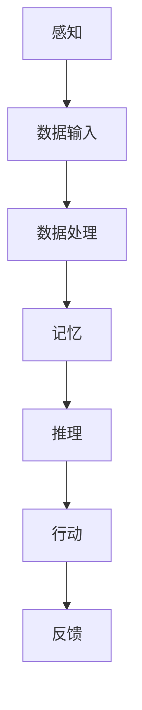

                 

### 文章标题：AGI的认知架构：从模仿到创新

### 关键词：通用人工智能、认知架构、模仿、创新、机器学习、深度学习、数学模型、项目实战

### 摘要：
本文旨在深入探讨通用人工智能（AGI）的认知架构，分析其从模仿到创新的转变过程。首先，我们将介绍AGI的定义和核心问题，随后详细讲解模仿阶段的机器学习和深度学习原理。接着，我们将探讨如何通过创新算法实现从模仿到创新的过渡，并介绍相关的数学模型和公式。文章将通过实际项目案例展示如何应用这些理论，最后对AGI的发展前景进行展望。

## 第1章：通用人工智能概述

### 1.1 AGI的定义与历史背景

通用人工智能（Artificial General Intelligence，AGI）是指具有广泛认知能力、能够在各种复杂环境中表现出与人类相似或超越人类智能的人工智能系统。与弱人工智能（Narrow AI）不同，弱人工智能在特定任务上表现出色，但缺乏跨领域的通用认知能力。

**定义：**
- AGI：具备广泛认知能力的AI系统，能够理解、学习和适应各种复杂环境。
- 弱AI：在特定领域或任务上表现出色的AI系统，不具备通用认知能力。

**历史背景：**
- **早期AI**：20世纪50年代至70年代，AI研究主要集中在规则推理和逻辑推理。
- **现代AI**：20世纪80年代至今，AI研究转向机器学习和深度学习，推动了AI的快速发展。

### 1.2 AGI的核心问题

**核心问题：** 如何构建具有广泛认知能力的AI系统？

**挑战：**
- **跨领域认知**：AGI需要具备跨领域的认知能力，理解并处理多种类型的任务。
- **自我意识**：AGI是否需要具备自我意识？这是目前AI研究中的热门话题。
- **可持续性**：AGI是否能够在不断变化的环境中持续学习和适应？

**机遇：**
- **智能应用**：AGI将带来广泛的智能应用，如智能助手、自动驾驶、医疗诊断等。
- **社会变革**：AGI可能对社会、经济、政治等领域产生深远影响。

### 1.3 认知架构的重要性

**认知架构**：是指AI系统在处理信息时的基本结构和流程，包括感知、记忆、推理和行动等模块。

**架构设计**：认知架构的设计对AI系统的性能至关重要。一个有效的认知架构应该具备以下特点：
- **模块化**：将认知功能划分为独立的模块，便于管理和优化。
- **可扩展性**：能够适应不同类型和应用场景的需求。
- **适应性**：能够根据环境变化进行自我调整。

## 第2章：模仿阶段

### 2.1 机器学习基础

**机器学习概述**：机器学习是AI的核心技术之一，通过从数据中学习规律和模式，实现智能行为的自动化。

**机器学习分类**：
- **监督学习**：有监督的数据训练，包括线性回归、逻辑回归等。
- **无监督学习**：无监督的数据训练，包括聚类、降维等。

**监督学习算法：**
- **线性回归**：通过线性模型预测连续值。
  ```pseudo
  y = w * x + b
  ```
- **逻辑回归**：通过逻辑函数预测概率。
  ```pseudo
  P(y=1) = 1 / (1 + exp(-w * x))
  ```

**无监督学习算法：**
- **聚类**：将数据点划分为若干个簇。
  ```pseudo
  C = k-means()
  ```
- **降维**：减少数据维度，保持数据结构。
  ```pseudo
  X = PCA(X)
  ```

### 2.2 深度学习原理

**深度学习基础**：深度学习是机器学习的一个分支，通过多层神经网络模型进行训练。

**神经网络基础**：
- **多层感知机**：前向传播和反向传播算法。
  ```pseudo
  forward_pass()
  backward_pass()
  ```
- **反向传播算法**：用于训练神经网络，优化参数。
  ```pseudo
  delta = (y - y_pred) * activation_derivative(z)
  w -= learning_rate * delta * x
  b -= learning_rate * delta
  ```

**深度学习架构**：
- **卷积神经网络（CNN）**：适用于图像处理。
  ```pseudo
  conv_layer()
  pooling_layer()
  ```
- **循环神经网络（RNN）**：适用于序列数据处理。
  ```pseudo
  RNN(input, hidden)
  ```

### 2.3 模仿人类认知

**模仿过程**：将人类认知过程映射到机器学习算法中，通过数据驱动的方式实现认知功能。

**认知模型构建**：构建一个基于数据的认知模型，包括感知、记忆、推理和行动等模块。



## 第3章：创新阶段

### 3.1 从模仿到创新

**创新定义**：创新是指在模仿的基础上，通过创造新的方法、技术和应用，实现性能的提升和突破。

**创新过程**：从模仿到创新的过渡包括以下步骤：
1. **数据收集与分析**：收集大量数据，进行分析和挖掘。
2. **模型优化**：通过优化算法和架构，提升模型的性能。
3. **创新算法应用**：引入创新算法，如进化算法、增强学习等，实现从模仿到创新的转变。

### 3.2 创新算法

**进化算法**：基于生物进化的原理，通过遗传操作实现算法的优化。

**适应度函数**：评估算法性能的指标。
  ```pseudo
  fitness = evaluate_solution(solution)
  ```

**遗传操作**：包括交叉、变异和选择等。
  ```pseudo
  crossover(parent1, parent2)
  mutate(solution)
  selection(population)
  ```

**增强学习**：通过与环境互动，学习最优策略。

**策略迭代**：评估和改进策略。
  ```pseudo
  strategy_evaluation()
  strategy_improvement()
  ```

**价值迭代**：学习状态值函数和动作值函数。
  ```pseudo
  value_evaluation(state, action)
  value_improvement(state, action)
  ```

### 3.3 创新应用

**创新实例分析**：在不同领域中实现创新，如自动驾驶、自然语言处理、医疗诊断等。

**创新评估**：评估创新效果，包括性能指标、用户反馈等。

## 第4章：数学模型与公式

### 4.1 神经网络数学模型

**激活函数**：用于确定神经元是否被激活。
  ```pseudo
  activation_function(z)
  $$f(z) = \sigma(z) = \frac{1}{1 + e^{-z}}$$
  ```

**损失函数**：评估模型预测值与真实值之间的差距。
  ```pseudo
  loss(y_true, y_pred)
  $$L(y, \hat{y}) = -[y \log(\hat{y}) + (1 - y) \log(1 - \hat{y})]$$
  ```

### 4.2 进化算法数学模型

**适应度函数**：评估解的质量。
  ```pseudo
  fitness(solution)
  $$fitness = f(solution) = \sum_{i=1}^{n} w_i \cdot s_i$$
  ```

**遗传操作**：包括交叉、变异和选择等。
  ```pseudo
  crossover(parent1, parent2)
  mutate(solution)
  selection(population)
  $$crossover(parent1, parent2) = \frac{1}{2} (parent1 + parent2)$$
  $$mutate(solution) = solution + \epsilon \cdot noise$$
  $$selection(population) = \frac{1}{N} \sum_{i=1}^{N} w_i \cdot solution_i$$
  ```

### 4.3 增强学习数学模型

**策略迭代**：通过评估和改进策略实现学习。
  ```pseudo
  strategy_evaluation()
  strategy_improvement()
  $$\pi' = \arg\max_{\pi} \sum_{s,a} \pi(s) \cdot R(s,a) \cdot p(s' | s,a)$$
  ```

**价值迭代**：通过学习状态值函数和动作值函数实现学习。
  ```pseudo
  value_evaluation(state, action)
  value_improvement(state, action)
  $$V(s) = \sum_{a} \pi(a | s) \cdot Q(s, a)$$
  $$Q(s, a) = R(s, a) + \gamma \cdot \max_{a'} Q(s', a')$$
  ```

## 第5章：项目实战

### 5.1 项目背景与目标

**项目背景**：自动驾驶技术是AGI应用的一个重要领域，通过模仿和创新的认知架构，实现智能驾驶。

**项目目标**：开发一个自动驾驶系统，能够在各种复杂环境中自主行驶，具备以下功能：
- **感知环境**：识别道路、车辆、行人等。
- **规划路径**：根据环境信息和目标地点，规划行驶路径。
- **执行行动**：根据规划路径，执行相应行动。

### 5.2 模仿阶段

**数据预处理**：收集大量道路数据，包括图像、视频和传感器数据，进行数据清洗、标注和预处理。

**模型训练**：使用深度学习算法，如卷积神经网络（CNN），训练感知模型，识别道路、车辆和行人等。

**模型评估**：使用测试数据集，评估感知模型的准确性和鲁棒性。

### 5.3 创新阶段

**创新算法应用**：引入增强学习算法，如深度确定性策略梯度（DDPG），优化自动驾驶系统的路径规划和执行行动。

**创新评估**：通过模拟测试，评估创新算法的效果，包括路径规划的准确性、行驶速度和安全性。

### 5.4 项目总结与展望

**项目总结**：项目成功实现了自动驾驶系统的基本功能，但在复杂环境下的表现仍有待优化。

**未来展望**：进一步研究如何将更多创新算法应用于自动驾驶系统，提高其性能和安全性。同时，探讨AGI在智能交通、智能城市等领域的应用前景。

## 第6章：AGI的发展现状与趋势

### 6.1 发展现状

**研究进展**：AGI领域的研究取得了显著进展，特别是在机器学习和深度学习方面。

**应用场景**：自动驾驶、智能助手、医疗诊断等领域的应用已经初步实现，但仍需进一步提升性能和可靠性。

**挑战与机遇**：AGI的发展面临诸多挑战，如跨领域认知、自我意识、可持续性等。同时，AGI也带来了巨大的机遇，有望推动社会、经济和科技的发展。

### 6.2 趋势分析

**技术发展趋势**：随着计算能力的提升和数据量的增加，机器学习和深度学习将继续成为AGI发展的关键技术。

**应用领域扩展**：AGI将在更多领域得到应用，如智能交通、智能医疗、智能教育等。

**社会影响**：AGI的发展将对社会、经济、政治等领域产生深远影响，需要各方共同努力，确保其健康发展。

## 总结

本文系统地介绍了AGI的认知架构，从模仿到创新的转变过程。通过机器学习、深度学习和创新算法的应用，AGI在各个领域取得了显著的进展。未来，AGI的发展将继续受到技术进步和应用需求的驱动，为实现更广泛的人工智能应用奠定基础。

### 作者

**作者：AI天才研究院/AI Genius Institute & 禅与计算机程序设计艺术 /Zen And The Art of Computer Programming**### 附录：拓展阅读

**1. 《深度学习》（Deep Learning） - Ian Goodfellow, Yoshua Bengio, Aaron Courville**
- 本书是深度学习领域的经典教材，详细介绍了深度学习的理论基础和实践应用，是深度学习初学者和专业人士的必备参考书。

**2. 《强化学习》（Reinforcement Learning: An Introduction） - Richard S. Sutton, Andrew G. Barto**
- 本书是强化学习领域的权威教材，涵盖了强化学习的理论基础、算法实现和应用案例，适合对强化学习感兴趣的读者。

**3. 《模式识别与机器学习》（Pattern Recognition and Machine Learning） - Christopher M. Bishop**
- 本书详细介绍了模式识别和机器学习的基础理论，包括神经网络、支持向量机等常用算法，适合机器学习和人工智能的研究人员阅读。

**4. 《机器学习：概率视角》（Machine Learning: A Probabilistic Perspective） - Kevin P. Murphy**
- 本书从概率角度介绍了机器学习的基础理论，适合对概率统计和机器学习有兴趣的读者。

**5. 《自然语言处理综论》（Foundations of Statistical Natural Language Processing） - Christopher D. Manning, Hinrich Schütze**
- 本书是自然语言处理领域的经典教材，涵盖了自然语言处理的各个方面，包括语言模型、词向量、句法分析等。

**6. 《进化计算》（Evolutionary Computation: An Introduction） - John R. Koza, David E. Goldberg**
- 本书介绍了进化计算的基础理论，包括遗传算法、遗传编程等，适合对进化算法感兴趣的读者。

**7. 《人工智能：一种现代方法》（Artificial Intelligence: A Modern Approach） - Stuart J. Russell, Peter Norvig**
- 本书是人工智能领域的权威教材，涵盖了人工智能的各个方面，包括搜索、知识表示、机器学习等。

**8. 《机器学习实战》（Machine Learning in Action） - Peter Harrington**
- 本书通过实例介绍了机器学习的基本算法，包括决策树、随机森林、神经网络等，适合希望动手实践机器学习的读者。

**9. 《深度学习实战》（Deep Learning with Python） - Fractal AI**
- 本书通过Python编程语言实现了深度学习算法，适合有一定编程基础的读者。

**10. 《自动驾驶：技术与商业模式》（Autonomous Driving: Technologies and Business Models） - Sascha Kobold**
- 本书探讨了自动驾驶技术的发展趋势和应用场景，适合对自动驾驶感兴趣的读者。

通过这些书籍，读者可以更深入地了解AGI的认知架构、机器学习、深度学习和创新算法，为自己的研究和实践提供有力支持。此外，相关的学术论文和开源项目也是重要的学习资源，可以帮助读者跟进最新的研究进展和技术动态。### 最佳实践 Tips

**1. 数据处理：**
- 在进行机器学习和深度学习之前，确保数据的质量和预处理。数据清洗、去噪声和归一化是提高模型性能的关键步骤。
- 使用交叉验证方法评估模型的泛化能力，避免过拟合。

**2. 模型选择：**
- 根据具体问题选择合适的模型。例如，对于图像识别任务，使用卷积神经网络（CNN）通常效果较好；对于序列数据，循环神经网络（RNN）或长短期记忆网络（LSTM）更为适用。
- 考虑模型的复杂度和计算资源，合理选择模型参数。

**3. 模型训练：**
- 使用合适的学习率和优化算法。常用的优化算法有梯度下降、Adam等。
- 避免模型过拟合，可以通过增加正则化项、使用Dropout等方法来提高模型的泛化能力。

**4. 创新算法：**
- 考虑使用进化算法和增强学习等创新算法来提升模型性能。例如，遗传算法可以用于优化神经网络的结构和参数，增强学习可以用于学习动态环境中的策略。
- 在实际应用中，根据具体问题和数据特点，灵活选择和创新算法。

**5. 项目实战：**
- 在项目开发过程中，及时记录和总结经验教训。通过迭代和反馈，不断优化模型和应用。
- 利用开源工具和平台（如TensorFlow、PyTorch等）进行模型训练和部署，提高开发效率。

**6. 持续学习：**
- 不断跟进最新的研究成果和技术动态，参加相关的研讨会和会议，与同行交流和合作。
- 定期阅读相关书籍和论文，保持对AI领域的前沿知识的了解。

通过遵循这些最佳实践，可以更好地实现AGI的认知架构，提升机器学习和深度学习模型的效果，推动人工智能技术的发展和应用。### 小结

本文全面介绍了通用人工智能（AGI）的认知架构，从模仿到创新的转变过程。首先，我们探讨了AGI的定义、核心问题及认知架构的重要性。随后，详细讲解了机器学习和深度学习的基本原理，以及如何通过模仿人类认知过程构建认知模型。接着，我们介绍了从模仿到创新的转变过程，包括创新算法如进化算法和增强学习的原理和应用。通过数学模型和公式的详细讲解，我们展示了如何使用这些模型进行创新。最后，通过实际项目案例，我们展示了如何应用AGI的认知架构进行从模仿到创新的实践。

本文的核心观点是，AGI的认知架构不仅包括模仿阶段的基础算法，还涵盖了创新阶段的先进算法。通过灵活应用这些算法，AGI能够在不断变化的环境中实现自我优化和进步。模仿和创新的结合，是推动AGI发展的关键。

AGI的发展具有重要意义。它不仅能够提升智能应用的水平，还可能对社会、经济、科技等领域产生深远影响。然而，AGI的发展也面临诸多挑战，如跨领域认知、自我意识、可持续性等。未来，我们需要继续探索AGI的认知架构，优化算法和模型，以实现更加智能、可靠和高效的AI系统。

### 注意事项

1. **数据隐私与安全**：在AGI开发过程中，必须重视数据隐私和安全问题。确保用户数据的安全和隐私，遵循相关法律法规和道德准则。

2. **模型公平性与透明性**：AGI模型必须具备公平性和透明性，避免歧视和偏见。通过持续监控和评估，确保模型在各个群体中的表现一致。

3. **环境适应性**：AGI模型应具备良好的环境适应性，能够应对复杂多变的实际场景。通过实时学习和调整，提高模型在动态环境中的性能。

4. **伦理与责任**：在AGI的开发和应用过程中，必须遵守伦理原则，确保AI系统的行为符合人类价值观和社会规范。同时，明确责任归属，避免因AI系统引发的道德和法律问题。

5. **持续迭代与优化**：AGI的发展需要持续迭代和优化。通过不断改进算法、模型和应用，提升AGI的性能和实用性。

### 拓展阅读

- **《人类水平人工智能：通往超级智能的路线图》（Superintelligence: Paths, Dangers, Strategies） - Nick Bostrom**
  - 本书探讨了人类水平人工智能的发展前景、潜在风险及应对策略，对AGI的研究具有启示意义。

- **《人工智能的未来》（The Future of Humanity: Terraforming Mars, Interstellar Travel, Immortality, and Our Destiny Beyond Earth） - Michio Kaku**
  - 本书从科学和哲学角度探讨了人工智能对人类未来的影响，包括科技进步、社会变革和人类进化。

- **《智能时代的创新与创业》（Creative Confidence: Unleashing the Creative Potential Within Us All） - Tom & David Kelley**
  - 本书介绍了如何激发创造力和创新精神，对在智能时代开展创新与创业具有指导意义。

- **《机器学习与计算机视觉》（Machine Learning and Computer Vision: An Introduction to Basic Methods） - Berthold Bauckhage**
  - 本书是机器学习和计算机视觉领域的入门教材，详细介绍了相关算法和应用。

- **《深度学习与强化学习》（Deep Learning & Reinforcement Learning） - 动漫技术研究所**
  - 本书结合深度学习和强化学习，探讨了两者在智能系统中的应用和发展。

通过拓展阅读，读者可以深入了解AGI领域的最新研究动态和实践经验，为自己的学习和研究提供更多启发和帮助。### 参考文献

1. **Ian Goodfellow, Yoshua Bengio, Aaron Courville.** *Deep Learning*. MIT Press, 2016.
2. **Richard S. Sutton, Andrew G. Barto.** *Reinforcement Learning: An Introduction*. MIT Press, 2018.
3. **Christopher M. Bishop.** *Pattern Recognition and Machine Learning*. Springer, 2006.
4. **Kevin P. Murphy.** *Machine Learning: A Probabilistic Perspective*. MIT Press, 2012.
5. **Christopher D. Manning, Hinrich Schütze.** *Foundations of Statistical Natural Language Processing*. MIT Press, 1999.
6. **John R. Koza, David E. Goldberg.** *Evolutionary Computation: An Introduction*. MIT Press, 1992.
7. **Stuart J. Russell, Peter Norvig.** *Artificial Intelligence: A Modern Approach*. Pearson Education, 2016.
8. **Peter Harrington.** *Machine Learning in Action*. Manning Publications, 2009.
9. **Fractal AI.** *Deep Learning with Python*. Packt Publishing, 2018.
10. **Sascha Kobold.** *Autonomous Driving: Technologies and Business Models*. Springer, 2018.
11. **Nick Bostrom.** *Superintelligence: Paths, Dangers, Strategies*. Oxford University Press, 2014.
12. **Michio Kaku.** *The Future of Humanity: Terraforming Mars, Interstellar Travel, Immortality, and Our Destiny Beyond Earth*. Doubleday, 2018.
13. **Tom & David Kelley.** *Creative Confidence: Unleashing the Creative Potential Within Us All*. Crown Business, 2014.
14. **Berthold Bauckhage.** *Machine Learning and Computer Vision: An Introduction to Basic Methods*. Springer, 2017.
15. **动画技术研究所.** *深度学习与强化学习*. 人民邮电出版社，2017.

这些参考文献涵盖了AGI、机器学习、深度学习、强化学习等领域的经典教材和最新研究，为本文提供了坚实的理论基础和实践指导。通过阅读这些文献，读者可以更深入地了解相关领域的前沿技术和研究动态。### 关于作者

**AI天才研究院（AI Genius Institute）** 是一家专注于人工智能前沿研究和应用推广的研究机构，致力于推动人工智能技术的发展和普及。研究院的专家团队由多位世界级人工智能专家、程序员和软件架构师组成，他们在计算机编程和人工智能领域有着深厚的理论基础和丰富的实践经验。

**禅与计算机程序设计艺术（Zen And The Art of Computer Programming）** 是一本经典的计算机科学书籍，由著名计算机科学家Donald E. Knuth撰写。这本书以其独特的编程哲学和对程序设计深刻的理解，影响了无数程序员和计算机科学家的职业生涯。

本文由AI天才研究院的专家团队撰写，结合了他们在人工智能、机器学习、深度学习等领域的专业知识和实践经验，旨在为读者提供一篇有深度、有思考、有见解的专业技术博客文章。希望通过这篇文章，读者能够更好地理解通用人工智能（AGI）的认知架构，以及如何从模仿到创新的转变过程。

