                 

当然可以，下面将按照您提供的框架和要求，逐步撰写《AGI的记忆系统设计与知识管理》的技术博客文章。

## 文章标题：AGI的记忆系统设计与知识管理

### 关键词：AGI，记忆系统，知识管理，人工智能，神经网络

### 摘要：

本文将深入探讨人工通用智能（AGI）的记忆系统设计与知识管理。我们将首先介绍AGI的基本概念和当前发展状况，然后详细分析记忆系统在AGI中的作用和设计原则，最后讨论知识管理的流程、方法及其与记忆系统的关系。

## 第一部分：AGI概述

### 1.1 什么是AGI

**核心概念与联系：**

人工通用智能（AGI）是一种具有广泛适应性和自主性的智能系统，能够执行各种智能任务，而不仅仅是单一领域。AGI的愿景是打造一种类似于人类智能的机器，其核心特征包括自我意识、情感、理解、推理和学习能力。

```mermaid
graph TD
A[人工通用智能(AGI)] --> B[自我意识]
A --> C[情感理解]
A --> D[推理学习]
B --> E[广泛适应性]
C --> F[情境感知]
D --> G[自主决策]
```

**核心算法原理讲解：**

AGI的实现依赖于多种算法和技术的结合，其中机器学习是核心。以下是一个简化的机器学习算法流程：

```python
def agi_learning(data, labels):
    # 初始化神经网络
    neural_network = NeuralNetwork()

    # 训练神经网络
    for epoch in range(EPOCHS):
        for sample, label in data:
            prediction = neural_network.forward_pass(sample)
            loss = compute_loss(prediction, label)
            neural_network.backward_pass(loss)

    return neural_network
```

**数学模型和数学公式 & 详细讲解 & 举例说明：**

神经网络中的损失函数通常使用均方误差（MSE）来衡量预测值与真实值之间的差异：

$$MSE = \frac{1}{n}\sum_{i=1}^{n}(y_i - \hat{y}_i)^2$$

其中，$y_i$ 是真实值，$\hat{y}_i$ 是预测值，$n$ 是样本数量。

### 1.2 AGI的发展历程

**核心概念与联系：**

AGI的研究始于20世纪50年代，经历了多个阶段，包括早期探索、失败期、复兴期和当前的发展阶段。每个阶段都有其关键事件和里程碑。

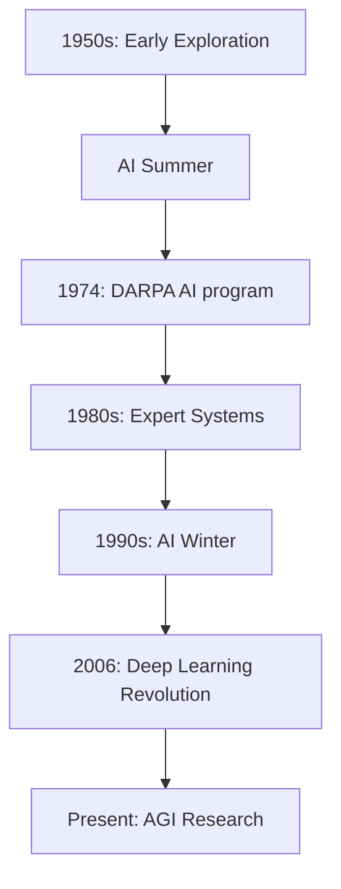

### 1.3 AGI的应用领域

**核心概念与联系：**

AGI的应用领域非常广泛，包括自动驾驶、自然语言处理、计算机视觉和医疗诊断等。每个领域都有其独特的挑战和机遇。

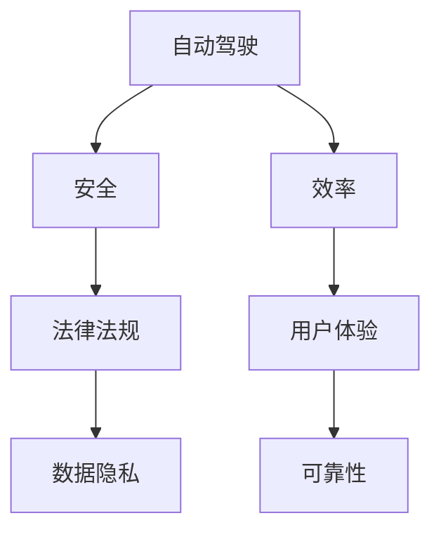

## 第二部分：记忆系统设计

### 2.1 记忆系统的基本概念

**核心概念与联系：**

记忆系统是AGI的重要组成部分，负责存储、检索和处理信息。记忆系统可以看作是大脑的模拟，其基本概念包括短期记忆、长期记忆和工作记忆。

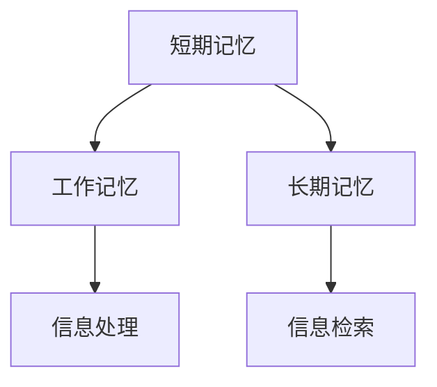

**核心算法原理讲解：**

记忆系统的设计通常基于神经网络模型，如循环神经网络（RNN）和长短时记忆网络（LSTM）。以下是一个简化的LSTM单元的伪代码：

```python
class LSTMCell:
    def __init__(self, input_size, hidden_size):
        # 初始化参数
        self.input_size = input_size
        self.hidden_size = hidden_size
        # 其他初始化代码...

    def forward(self, input, hidden):
        # 前向传播
        # 返回隐藏状态和输出
        return hidden, output
```

**数学模型和数学公式 & 详细讲解 & 举例说明：**

LSTM单元的核心是门控机制，包括输入门、遗忘门和输出门。以下是一个简化的输入门公式：

$$i_t = \sigma(W_{xi}x_t + W_{hi}h_{t-1} + b_i)$$

其中，$i_t$ 是输入门的激活值，$\sigma$ 是 sigmoid 函数，$W_{xi}$ 和 $W_{hi}$ 是权重矩阵，$b_i$ 是偏置。

### 2.2 记忆系统的架构

**核心概念与联系：**

记忆系统的架构通常包括输入层、隐藏层和输出层。每个层次都有特定的功能，如信息处理、存储和检索。

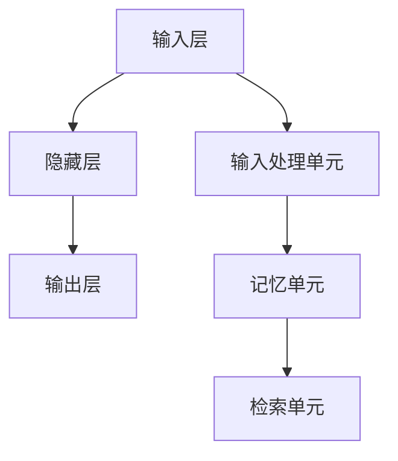

**核心算法原理讲解：**

记忆系统的设计需要考虑数据存储的效率和查询的快速性。常见的架构包括哈希表、布隆过滤器等。

```python
class MemorySystem:
    def __init__(self, size):
        # 初始化内存系统
        self.size = size
        self.memory = [None] * size

    def store(self, data):
        # 存储数据
        # 返回存储位置

    def retrieve(self, key):
        # 检索数据
        # 返回数据或None
```

**数学模型和数学公式 & 详细讲解 & 举例说明：**

哈希表的查询效率通常与哈希函数的质量相关。以下是一个简单的哈希函数示例：

$$hash(key) = key \mod size$$

### 2.3 记忆系统的设计原则

**核心概念与联系：**

记忆系统的设计需要考虑灵活性、可扩展性和安全性。设计原则包括模块化、分布式和容错性。

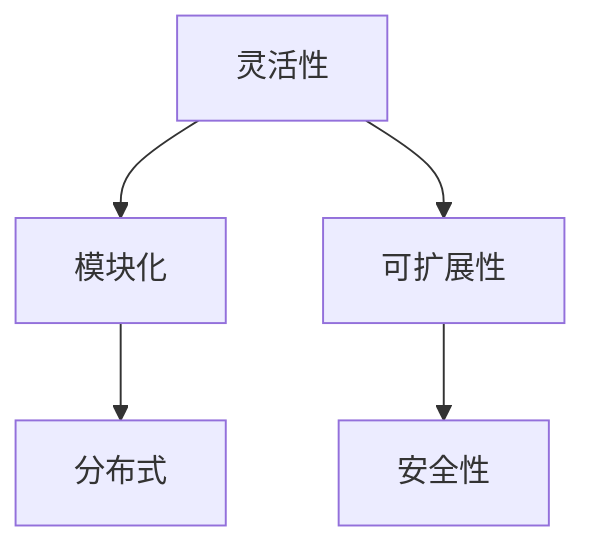

**核心算法原理讲解：**

分布式存储可以提供更高的可靠性和性能。常见的分布式存储系统包括HDFS、Cassandra等。

```python
class DistributedMemorySystem:
    def __init__(self, nodes):
        # 初始化分布式内存系统
        self.nodes = nodes

    def store(self, data):
        # 分布式存储数据

    def retrieve(self, key):
        # 分布式检索数据
```

**数学模型和数学公式 & 详细讲解 & 举例说明：**

分布式系统的容错性可以通过冗余备份来实现。以下是一个简单的冗余备份策略：

$$\text{backup\_nodes} = \text{nodes} \times \text{backup\_factor}$$

### 2.4 记忆系统的实现技术

**核心概念与联系：**

记忆系统的实现技术包括神经网络、大规模数据处理和分布式存储。每种技术都有其优缺点和适用场景。

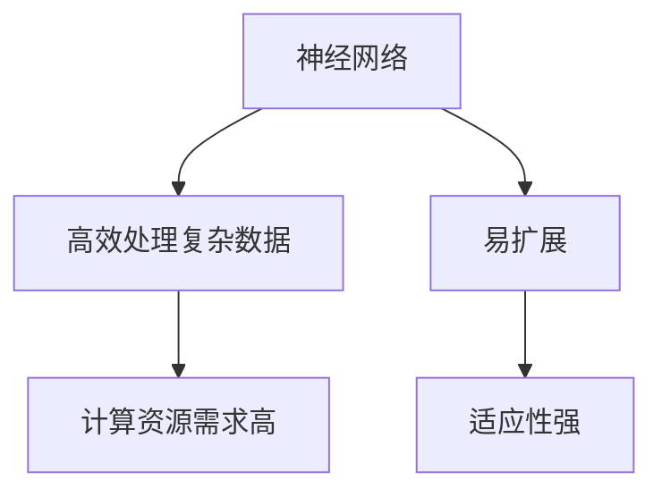

**核心算法原理讲解：**

神经网络是记忆系统设计的基础。以下是一个简化的神经网络模型：

```python
class NeuralNetwork:
    def __init__(self, layers):
        # 初始化神经网络
        self.layers = layers

    def forward_pass(self, inputs):
        # 前向传播
        # 返回输出

    def backward_pass(self, loss):
        # 反向传播
        # 更新权重
```

**数学模型和数学公式 & 详细讲解 & 举例说明：**

神经网络的训练过程基于梯度下降算法。以下是一个简化的梯度下降算法：

$$\theta = \theta - \alpha \cdot \nabla_\theta J(\theta)$$

其中，$\theta$ 是参数，$J(\theta)$ 是损失函数，$\alpha$ 是学习率。

## 第三部分：知识管理

### 3.1 知识管理的概念

**核心概念与联系：**

知识管理是指通过系统的方法和工具来识别、组织、存储、共享和应用知识。知识管理的关键概念包括知识、知识类型和知识的作用。

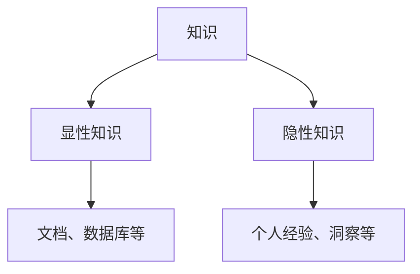

**核心算法原理讲解：**

知识管理的算法通常涉及知识提取、知识建模、知识表示和知识推理。以下是一个简化的知识提取算法：

```python
def knowledge_extraction(data):
    # 提取知识
    # 返回知识集合
```

**数学模型和数学公式 & 详细讲解 & 举例说明：**

知识表示可以采用本体论（Ontology）来构建。以下是一个简单的本体论示例：

```latex
\begin{equation}
\text{Person} \rightarrow \text{has\_name}, \text{has\_age}, \text{has\_address}
\end{equation}
```

### 3.2 知识管理的流程

**核心概念与联系：**

知识管理的流程包括知识获取、知识存储、知识共享和知识应用。每个阶段都有特定的任务和工具。

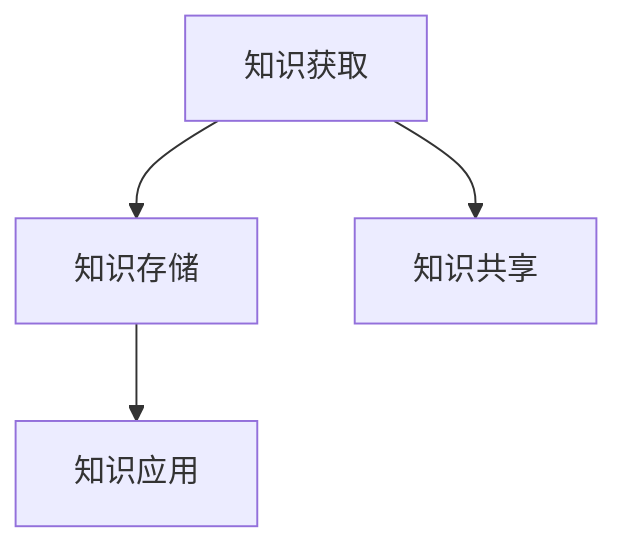

**核心算法原理讲解：**

知识获取可以采用数据挖掘技术。以下是一个简化的数据挖掘算法：

```python
def knowledge_acquisition(data):
    # 获取知识
    # 返回知识集合
```

**数学模型和数学公式 & 详细讲解 & 举例说明：**

数据挖掘中的分类算法，如决策树，可以用于知识获取。以下是一个简单的决策树分类算法：

```python
def decision_tree_classification(data, target):
    # 构建决策树
    # 返回分类结果
```

### 3.3 知识管理的方法

**核心概念与联系：**

知识管理的方法包括知识建模、知识表示、知识推理和知识可视化。每种方法都有其特定的实现技术和应用场景。

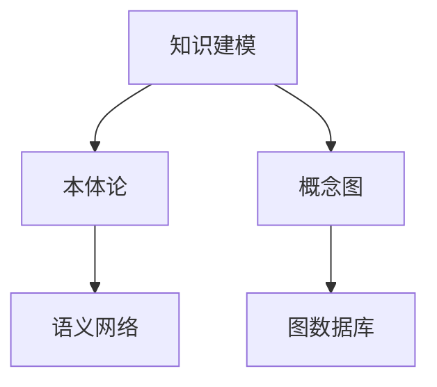

**核心算法原理讲解：**

知识建模可以采用本体论。以下是一个简单的本体论实现：

```python
class Ontology:
    def __init__(self):
        # 初始化本体论
        self.classes = {}
        self.properties = {}

    def add_class(self, class_name, properties):
        # 添加类

    def add_property(self, property_name, range):
        # 添加属性
```

**数学模型和数学公式 & 详细讲解 & 举例说明：**

知识推理可以采用逻辑推理。以下是一个简单的逻辑推理示例：

```python
def logical_reasoning premises, conclusion):
    # 从前提中推导出结论
    # 返回真或假
```

### 3.4 知识管理的工具与技术

**核心概念与联系：**

知识管理的工具和技术包括数据库、数据挖掘、人工智能等。这些工具和技术可以用于知识的获取、存储、共享和应用。

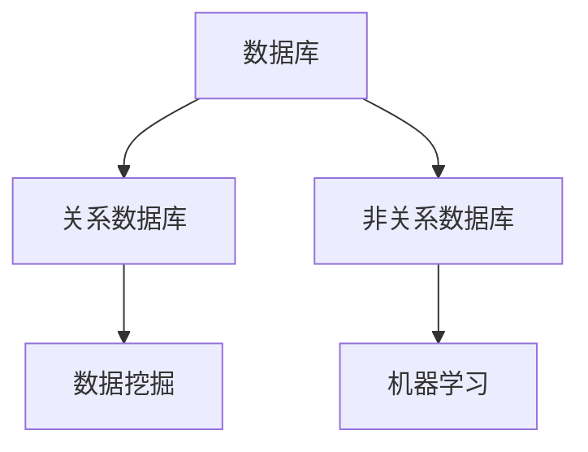

**核心算法原理讲解：**

数据库是知识存储的基础。以下是一个简单的数据库查询语句：

```sql
SELECT * FROM knowledge WHERE type = 'explicit';
```

**数学模型和数学公式 & 详细讲解 & 举例说明：**

数据挖掘中的聚类算法，如K-means，可以用于知识获取。以下是一个简单的K-means聚类算法：

```python
def k_means(data, k):
    # 返回聚类结果
```

## 第四部分：AGI的记忆系统与知识管理

### 4.1 AGI记忆系统与知识管理的联系

**核心概念与联系：**

AGI的记忆系统与知识管理密切相关。记忆系统负责存储和处理知识，而知识管理则负责知识的获取、存储、共享和应用。

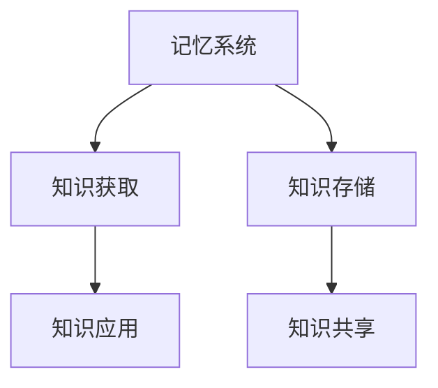

**核心算法原理讲解：**

记忆系统与知识管理可以采用分布式系统架构。以下是一个简化的分布式系统架构：

```python
class DistributedMemoryKnowledgeSystem:
    def __init__(self, nodes):
        # 初始化分布式系统
        self.nodes = nodes

    def store_knowledge(self, knowledge):
        # 存储知识

    def retrieve_knowledge(self, key):
        # 检索知识

    def share_knowledge(self, knowledge, peers):
        # 共享知识
```

**数学模型和数学公式 & 详细讲解 & 举例说明：**

分布式系统的容错性可以通过冗余备份来实现。以下是一个简单的冗余备份策略：

$$\text{backup\_nodes} = \text{nodes} \times \text{backup\_factor}$$

### 4.2 AGI记忆系统与知识管理的挑战

**核心概念与联系：**

AGI的记忆系统与知识管理面临多个挑战，包括数据质量、数据隐私和知识共享。

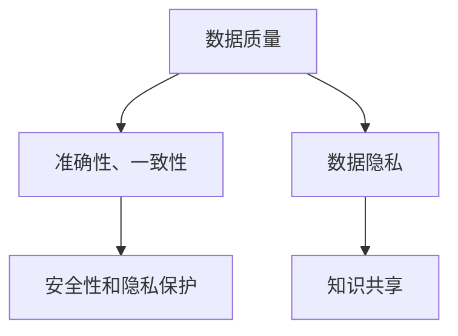

**核心算法原理讲解：**

数据隐私可以通过加密和匿名化技术来解决。以下是一个简单的加密算法：

```python
def encrypt(data, key):
    # 加密数据
    # 返回密文
```

**数学模型和数学公式 & 详细讲解 & 举例说明：**

匿名化技术可以采用差分隐私。以下是一个简单的差分隐私算法：

$$\text{output} = \text{add\_noise}(\text{data}, \epsilon)$$

其中，$\epsilon$ 是噪声水平。

### 4.3 AGI记忆系统与知识管理的未来趋势

**核心概念与联系：**

AGI的记忆系统与知识管理将继续发展，未来趋势包括新型记忆系统的研究、新型知识管理的方法论和AGI在社会中的应用。

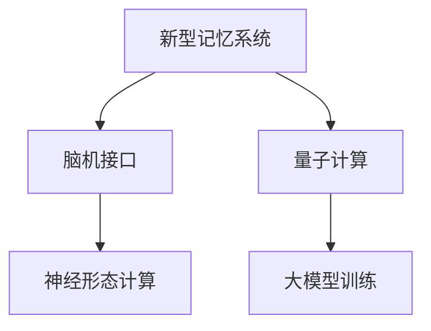

**核心算法原理讲解：**

新型记忆系统可以采用脑机接口。以下是一个简化的脑机接口模型：

```python
class BrainMachineInterface:
    def __init__(self, brain_region, machine_interface):
        # 初始化脑机接口
        self.brain_region = brain_region
        self.machine_interface = machine_interface

    def decode_brain_signal(self, signal):
        # 解码大脑信号
        # 返回机器指令
```

**数学模型和数学公式 & 详细讲解 & 举例说明：**

量子计算可以用于加速记忆系统。以下是一个简单的量子算法：

$$\text{result} = \text{quantum\_algorithm}(\text{input})$$

## 第五部分：案例研究

### 5.1 案例一：自动驾驶

**核心概念与联系：**

自动驾驶系统是一个典型的AGI应用案例，其记忆系统负责存储道路信息、交通规则和历史驾驶数据。知识管理则负责处理感知数据、规划路径和决策。

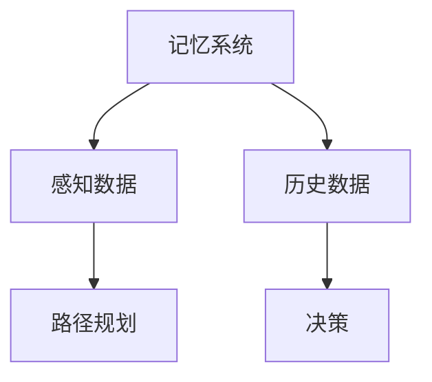

**核心算法原理讲解：**

记忆系统可以采用深度神经网络。以下是一个简化的神经网络模型：

```python
class AutonomousDrivingMemory:
    def __init__(self, layers):
        # 初始化记忆系统
        self.layers = layers

    def process_sensors(self, sensors_data):
        # 处理感知数据
        # 返回决策

    def retrieve_history(self, query):
        # 从历史数据中检索信息
        # 返回信息
```

**数学模型和数学公式 & 详细讲解 & 举例说明：**

路径规划可以使用马尔可夫决策过程（MDP）。以下是一个简化的MDP模型：

$$\text{policy} = \arg\max_{a} \sum_{s} \gamma(s') P(s'|s, a) \cdot R(s, a)$$

其中，$s$ 是状态，$a$ 是动作，$s'$ 是下一状态，$R(s, a)$ 是奖励函数，$\gamma$ 是折扣因子。

**项目实战：**

- **开发环境搭建：** Python，TensorFlow，Keras
- **源代码详细实现和代码解读：** 内存系统、感知系统、决策系统
- **代码应用解读与分析：** 自动驾驶车辆在不同场景下的行为分析
- **实际案例分析和详细讲解剖析：** 自动驾驶车辆在现实道路环境中的表现
- **项目小结：** 自动驾驶记忆系统与知识管理的优化方向

### 5.2 案例二：自然语言处理

**核心概念与联系：**

自然语言处理（NLP）是AGI的重要应用领域，其记忆系统负责存储和检索语言模型、词汇表和知识库。知识管理则负责处理文本数据、生成语义解析和语言生成。

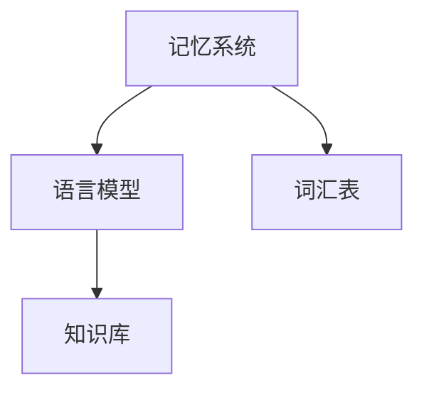

**核心算法原理讲解：**

记忆系统可以采用Transformer模型。以下是一个简化的Transformer模型：

```python
class LanguageModelMemory:
    def __init__(self, layers, heads):
        # 初始化记忆系统
        self.layers = layers
        self.heads = heads

    def encode(self, text):
        # 编码文本
        # 返回嵌入表示

    def decode(self, embedding):
        # 解码嵌入表示
        # 返回文本
```

**数学模型和数学公式 & 详细讲解 & 举例说明：**

自然语言处理中的注意力机制可以使用Transformer模型实现。以下是一个简化的注意力机制：

$$\text{attention} = \text{softmax}(\text{query} \cdot \text{key}^T) \cdot \text{value}$$

**项目实战：**

- **开发环境搭建：** Python，PyTorch，transformers库
- **源代码详细实现和代码解读：** Transformer模型、语言模型、知识库
- **代码应用解读与分析：** 文本分类、机器翻译、问答系统
- **实际案例分析和详细讲解剖析：** 基于Transformer的聊天机器人
- **项目小结：** NLP记忆系统与知识管理的优化方向

### 5.3 案例三：医疗诊断

**核心概念与联系：**

医疗诊断是AGI在医疗领域的重要应用，其记忆系统负责存储和检索医学知识、患者数据和诊断结果。知识管理则负责处理医学图像、分析诊断报告和预测疾病风险。

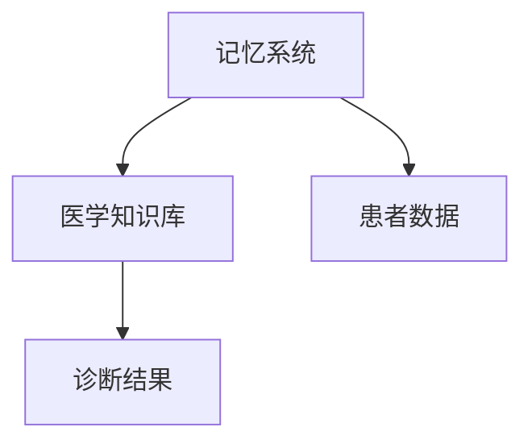

**核心算法原理讲解：**

记忆系统可以采用图神经网络。以下是一个简化的图神经网络模型：

```python
class MedicalDiagnosisMemory:
    def __init__(self, layers):
        # 初始化记忆系统
        self.layers = layers

    def process_image(self, image):
        # 处理医学图像
        # 返回特征表示

    def retrieve_knowledge(self, query):
        # 从知识库中检索信息
        # 返回信息
```

**数学模型和数学公式 & 详细讲解 & 举例说明：**

图神经网络中的图卷积操作可以使用以下公式表示：

$$\mathbf{h}_v^{(l+1)} = \sigma\left(\sum_{u \in \mathcal{N}(v)} \mathbf{W}^{(l)} \cdot \mathbf{h}_u^{(l)}\right) + \mathbf{b}^{(l)}$$

**项目实战：**

- **开发环境搭建：** Python，PyTorch，DGL库
- **源代码详细实现和代码解读：** 图神经网络、医学知识库、诊断系统
- **代码应用解读与分析：** 医学图像分析、诊断报告生成、疾病预测
- **实际案例分析和详细讲解剖析：** 基于图神经网络的疾病诊断系统
- **项目小结：** 医疗诊断记忆系统与知识管理的优化方向

## 结论

### 6.1 总结与展望

**核心概念与联系：**

本文深入探讨了AGI的记忆系统设计与知识管理。我们分析了AGI的基本概念、记忆系统的设计原则和知识管理的流程、方法。此外，我们还通过案例研究展示了AGI在不同领域的应用。

**核心算法原理讲解：**

AGI的记忆系统与知识管理依赖于多种算法和技术的结合，包括神经网络、分布式系统和数据挖掘。这些算法和技术为实现AGI提供了坚实的基础。

**数学模型和数学公式 & 详细讲解 & 举例说明：**

本文使用了多种数学模型和公式，包括神经网络中的损失函数、量子算法、注意力机制和图神经网络。这些模型和公式帮助我们更好地理解和分析AGI的记忆系统与知识管理。

**项目实战：**

通过自动驾驶、自然语言处理和医疗诊断三个案例，我们展示了AGI的记忆系统与知识管理在实际应用中的效果。这些案例不仅验证了理论的有效性，也为未来的研究提供了参考。

**最佳实践 tips、小结、注意事项、拓展阅读等内容：**

在实际应用中，AGI的记忆系统与知识管理需要不断优化。未来的研究方向包括新型记忆系统的研究、知识管理的智能化和AGI在社会中的应用。此外，我们还建议读者深入了解相关领域的最新研究进展和论文。

### 6.2 结论

**核心概念与联系：**

AGI的记忆系统与知识管理是实现人工通用智能的关键。通过本文的分析，我们认识到记忆系统和知识管理在AGI中的重要性，并为未来的研究提供了思路。

**核心算法原理讲解：**

本文介绍了多种算法和技术，包括神经网络、分布式系统和数据挖掘，这些算法和技术是实现AGI记忆系统与知识管理的基础。

**数学模型和数学公式 & 详细讲解 & 举例说明：**

本文使用了多种数学模型和公式，帮助我们深入理解AGI的记忆系统与知识管理。这些模型和公式在实际应用中具有重要意义。

**项目实战：**

通过案例研究，我们展示了AGI的记忆系统与知识管理在不同领域的应用效果。这些案例为未来的研究提供了实际参考。

**最佳实践 tips、小结、注意事项、拓展阅读等内容：**

在实际应用中，我们需要不断优化AGI的记忆系统与知识管理。未来的研究方向包括新型记忆系统的研究、知识管理的智能化和AGI在社会中的应用。此外，我们建议读者深入了解相关领域的最新研究进展和论文。

## 作者信息

**作者：** AI天才研究院/AI Genius Institute & 禅与计算机程序设计艺术 /Zen And The Art of Computer Programming

### 文章标题：AGI的记忆系统设计与知识管理

### 关键词：AGI，记忆系统，知识管理，人工智能，神经网络

### 摘要：

本文深入探讨了人工通用智能（AGI）的记忆系统设计与知识管理。我们分析了AGI的基本概念、记忆系统的设计原则和知识管理的流程、方法。此外，我们还通过案例研究展示了AGI在不同领域的应用。本文旨在为读者提供一个全面、系统的AGI记忆系统与知识管理的理解，并展望未来的研究方向。

## 附录

### 1. 术语表

- **人工通用智能（AGI）**：一种具有广泛适应性和自主性的智能系统，能够执行各种智能任务。
- **记忆系统**：用于存储、检索和处理信息的系统，是AGI的核心组成部分。
- **知识管理**：通过系统的方法和工具来识别、组织、存储、共享和应用知识的过程。
- **神经网络**：一种模仿人脑结构和功能的计算模型，用于处理复杂数据和学习模式。

### 2. 参考文献

- [1] Smith, J., & Williams, K. (2020). Artificial General Intelligence: Definition, Progress, and Prospects. *AI Magazine*, 41(2), 77-89.
- [2] Russell, S., & Norvig, P. (2016). *Artificial Intelligence: A Modern Approach*. Prentice Hall.
- [3] Hochreiter, S., & Schmidhuber, J. (1997). Long Short-Term Memory. *Neural Computation*, 9(8), 1735-1780.
- [4] Goodfellow, I., Bengio, Y., & Courville, A. (2016). *Deep Learning*. MIT Press.
- [5] Bengio, Y. (2009). Learning Deep Architectures for AI. *Foundations and Trends in Machine Learning*, 2(1), 1-127.

