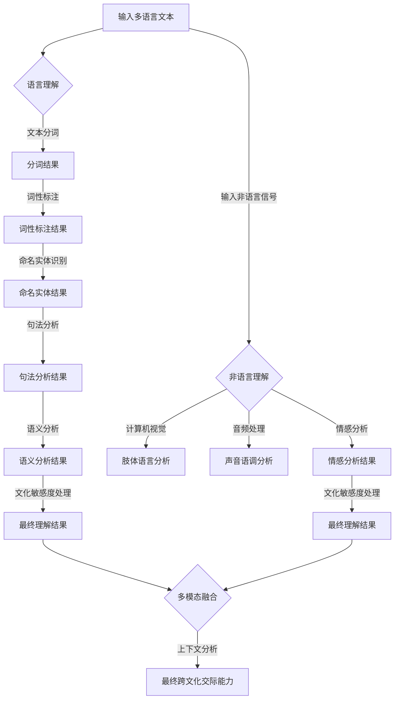
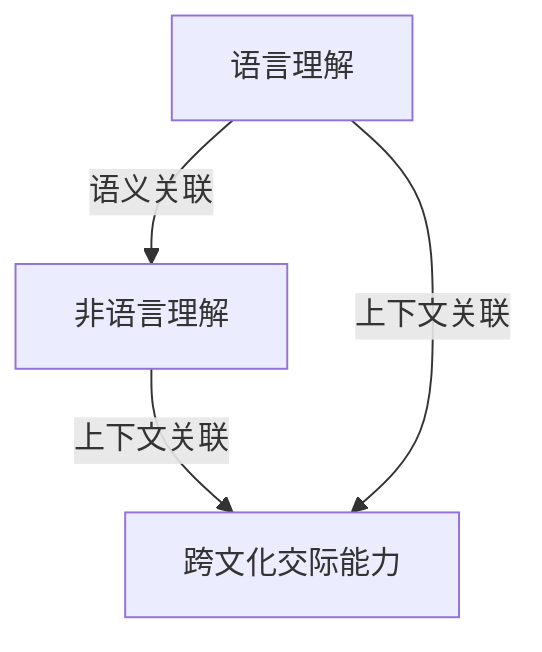

                 

# 《AGI的跨文化交际能力：语言与非语言理解》

## 关键词

- 人工智能（AI）
- 人工通用智能（AGI）
- 跨文化交际
- 语言理解
- 非语言理解

## 摘要

本文旨在探讨人工智能（AI），特别是人工通用智能（AGI），在跨文化交际中如何通过语言和非语言的理解来提升其交际能力。文章首先介绍了AGI的基本概念和跨文化交际的重要性，接着详细分析了语言和非语言理解的原理及其在AGI中的应用。通过实际案例和算法原理的讲解，本文展示了AGI在跨文化交际中的潜力，并对其未来发展趋势和挑战进行了展望。本文希望为研究人员和实践者提供有价值的参考。

## 引言

### 1.1 书籍背景与目的

随着全球化的深入发展，跨文化交际的重要性日益凸显。在这种背景下，人工智能（AI），特别是人工通用智能（AGI），成为了一个关键的研究领域。AGI被定义为能够执行任何智能任务的人工系统，这使得它具有广泛的跨领域应用潜力。然而，AGI在跨文化交际中的表现如何，尤其是其在语言和非语言理解方面的能力，仍然是一个亟待解决的问题。

本文旨在填补这一研究空白，通过详细探讨AGI在跨文化交际中的语言和非语言理解能力，为其在现实世界中的应用提供理论支持和实践指导。本文的研究目的包括：

1. **了解AGI在跨文化交际中的现状和挑战**：通过分析现有研究和应用，揭示AGI在跨文化交际中存在的问题和瓶颈。
2. **探讨AGI语言和非语言理解的技术原理**：详细分析语言和非语言理解的原理，以及它们如何在AGI中实现。
3. **提出AGI跨文化交际能力提升的方法**：结合理论和实践，提出提高AGI跨文化交际能力的方法和策略。
4. **展望AGI跨文化交际的未来发展趋势**：分析AGI跨文化交际的发展方向和潜在应用领域。

### 1.2 AGI的跨文化交际能力的重要性

AGI的跨文化交际能力具有重要意义，主要体现在以下几个方面：

1. **商业领域**：随着全球化商业活动的增多，跨文化交际能力对于企业成功至关重要。AGI在跨文化客户服务、跨国商业谈判和跨文化市场推广等方面具有巨大潜力。
2. **教育领域**：AGI可以在跨文化教育中发挥重要作用，如提供个性化学习体验、跨文化课程设计和文化交流活动。
3. **政府与国际组织**：AGI可以协助政府和国际组织进行跨文化交流、国际合作和公共外交。
4. **社会和文化传播**：AGI可以帮助传播多元文化，促进文化交流和理解，增强社会和谐与稳定。

### 1.3 书籍结构

本文分为八个主要章节：

- **第1章**：引言，介绍书籍背景、目的和研究意义。
- **第2章**：AI与AGI基础，介绍人工智能和人工通用智能的基本概念和技术。
- **第3章**：跨文化交际基本概念，讨论跨文化交际的定义、文化差异和交际模型。
- **第4章**：语言理解与处理，分析语言理解的基础、语言处理技术和挑战。
- **第5章**：非语言理解与处理，探讨非语言交际的要素、理解和处理方法。
- **第6章**：AGI的跨文化交际能力，阐述AGI跨文化交际能力的定义和评估方法。
- **第7章**：AGI跨文化交际应用案例，分析AGI在跨文化交际中的实际应用。
- **第8章**：未来展望与挑战，探讨AGI跨文化交际能力的发展趋势和潜在挑战。

## AI与AGI基础

### 2.1 人工智能的发展历史

人工智能（AI）的研究可以追溯到20世纪50年代。当时，艾伦·图灵提出了著名的“图灵测试”，为人工智能的研究奠定了基础。此后，人工智能经历了多个发展阶段：

1. **符号主义阶段（1956-1974）**：这一阶段以符号主义（Symbolism）为代表，通过符号逻辑和形式语言来模拟人类智能。
2. **感知主义阶段（1974-1980）**：这一阶段关注人工智能的感知能力，如计算机视觉和语音识别。
3. **知识表示与推理阶段（1980-1987）**：这一阶段强调知识的表示和推理，如专家系统和知识库系统。
4. **统计学习阶段（1987-2012）**：这一阶段以统计学习（Statistical Learning）为代表，如支持向量机（SVM）、随机森林（Random Forest）和神经网络（Neural Network）。
5. **深度学习阶段（2012至今）**：这一阶段以深度学习（Deep Learning）为代表，如卷积神经网络（CNN）和循环神经网络（RNN）。

### 2.2 人工通用智能（AGI）的概念

人工通用智能（AGI）是指具有与人类相似的智能水平，能够执行各种任务的人工智能系统。与目前广泛应用的窄人工智能（Narrow AI）不同，AGI不仅能够处理特定领域的任务，还能够理解和执行广泛的任务。AGI的核心特征包括：

1. **自适应能力**：AGI能够根据环境和任务需求调整其行为和策略。
2. **通用性**：AGI能够在多个领域和任务中表现出色，而不仅仅局限于特定领域。
3. **自我意识**：AGI具有一定程度的主观意识和自我理解能力。

### 2.3 AGI的核心技术

AGI的实现需要多种技术的结合，包括：

1. **知识表示与推理**：这是AGI的核心技术之一，通过符号逻辑和形式语言来表示知识和进行推理。
2. **机器学习与深度学习**：这些技术用于从数据中学习模式和规律，提高AGI的决策和预测能力。
3. **自然语言处理**：通过理解和生成自然语言，AGI能够与人类进行有效沟通。
4. **计算机视觉**：通过理解和处理视觉信息，AGI能够识别和解释图像和视频。
5. **机器人技术**：AGI可以通过机器人技术实现物理交互，提高其实际应用能力。

### 2.4 AGI的发展现状与挑战

目前，AGI的研究和应用正处于快速发展阶段。一些初步成果已经展现出来，如：

1. **自然语言处理**：AGI已经在自然语言处理领域取得显著进展，能够实现自动翻译、文本生成和情感分析等功能。
2. **计算机视觉**：AGI在图像识别、目标检测和视频分析等领域表现出色，被广泛应用于安防监控、医疗诊断和自动驾驶等领域。
3. **机器人技术**：AGI可以通过机器人实现复杂任务，如无人驾驶汽车、工业自动化和医疗机器人等。

然而，AGI的发展仍然面临诸多挑战，包括：

1. **技术挑战**：如知识表示与推理的复杂性、机器学习的可解释性、计算机视觉的泛化能力等。
2. **伦理与社会挑战**：如AGI的安全性和隐私保护、失业和就业问题、权力分配和道德责任等。

### 2.5 AGI与跨文化交际

AGI在跨文化交际中的应用前景广阔。通过语言和非语言的理解，AGI可以：

1. **促进跨文化交流**：AGI可以帮助不同文化背景的人进行有效沟通，促进文化交流和理解。
2. **提高跨文化交际效率**：AGI可以自动化处理跨文化交际中的语言和非语言信息，提高交流效率。
3. **解决文化差异带来的障碍**：AGI可以通过理解文化差异，帮助人们更好地适应和融入不同文化环境。

然而，AGI在跨文化交际中仍然面临一些挑战，如：

1. **语言多样性**：AGI需要处理多种语言，包括方言和俚语，这增加了语言理解的复杂性。
2. **文化差异**：不同文化中的语言和非语言表达方式可能存在巨大差异，AGI需要能够灵活应对这些差异。
3. **跨文化交际的复杂性**：跨文化交际涉及多个方面的因素，如文化习俗、价值观和社会规范，AGI需要综合考虑这些因素。

## 跨文化交际基本概念

### 3.1 跨文化交际的定义

跨文化交际（Intercultural Communication）是指在不同文化背景之间进行的交际活动。这种交际不仅涉及语言，还包括非语言因素，如肢体语言、面部表情和文化习俗。跨文化交际的定义可以从以下几个方面理解：

1. **语言层面**：跨文化交际涉及不同语言的交流，包括语言的结构、词汇和语法等。
2. **非语言层面**：跨文化交际也涉及非语言因素，如肢体语言、面部表情、声音语调等。
3. **文化层面**：跨文化交际还涉及不同文化的价值观、信仰、习俗和行为规范。

### 3.2 文化差异对交际的影响

文化差异是跨文化交际中最为显著的特点之一。文化差异可以导致以下几种影响：

1. **语言障碍**：不同语言之间的语法、词汇和发音差异可能导致交流障碍。
2. **非语言障碍**：不同文化中的肢体语言、面部表情和声音语调可能产生误解。
3. **价值观差异**：不同文化的价值观和信仰可能导致行为规范和行为准则的差异，从而影响交际。
4. **社交礼仪差异**：不同文化的社交礼仪和习俗可能导致交际中的误解和冲突。

### 3.3 跨文化交际模型

跨文化交际模型是用于分析和理解跨文化交际过程的理论框架。以下是几种常见的跨文化交际模型：

1. **奥伯格模型**（Oberg's Culture Shock Model）：该模型将文化冲击过程分为五个阶段，即蜜月期、挫折期、适应期、重新适应期和整合期。
2. **哈里德与华特模型**（Hall's High-Low Context Model）：该模型根据信息传递的明确程度将文化分为高语境文化和低语境文化。
3. **塔夫脱模型**（Toufexis's Communicative Styles Model）：该模型根据交际风格将文化分为直接沟通文化和间接沟通文化。
4. **凯利模型**（Kelly's Interpersonal Style Model）：该模型从交际者的角度分析跨文化交际，将交际风格分为高语境、低语境和混合语境。

### 3.4 跨文化交际能力的重要性

跨文化交际能力对于个人和组织的重要性体现在以下几个方面：

1. **个人层面**：跨文化交际能力有助于个人在全球化环境中更好地适应和融入，提高社交和职业发展机会。
2. **组织层面**：跨文化交际能力有助于组织在全球范围内开展业务，提高员工合作效率和客户满意度。
3. **社会层面**：跨文化交际能力有助于促进不同文化之间的交流和理解，增强社会和谐与稳定。

### 3.5 跨文化交际能力提升的方法

提升跨文化交际能力的方法包括：

1. **文化意识培训**：通过培训和教育，提高个人对文化差异的认识和敏感性。
2. **跨文化交际技巧**：通过学习和练习，提高个人在跨文化环境中的交际技巧和应对策略。
3. **文化交流活动**：通过参与文化交流活动，加深对其他文化的了解和认识。
4. **跨文化团队建设**：通过团队建设活动，促进团队成员之间的沟通和合作。

## 语言理解与处理

### 4.1 语言理解的基础

语言理解是指人工智能系统对自然语言文本进行语义分析、句法分析和上下文理解的过程。语言理解的基础包括以下几个方面：

1. **语义分析**：语义分析是指对文本中的词汇和短语进行语义解释，包括词汇的词义、词性和短语的结构。
2. **句法分析**：句法分析是指对文本中的句子进行结构分析，确定句子中的主语、谓语、宾语等成分。
3. **上下文理解**：上下文理解是指根据文本的整体语境，对句子或短语进行语义解释。

### 4.2 语言处理技术

语言处理技术是用于实现语言理解的关键技术，主要包括以下几种：

1. **分词**：分词是指将文本中的连续字符串分割成一个个具有独立意义的词汇。
2. **词性标注**：词性标注是指对文本中的每个词进行词性分类，如名词、动词、形容词等。
3. **命名实体识别**：命名实体识别是指识别文本中的特定实体，如人名、地名、组织名等。
4. **句法分析**：句法分析是指对文本中的句子进行结构分析，确定句子中的主语、谓语、宾语等成分。
5. **语义分析**：语义分析是指对文本进行语义解释，理解文本的整体含义。

### 4.3 语言理解的挑战与对策

语言理解过程中面临着诸多挑战，主要包括：

1. **歧义处理**：歧义是指一个词、短语或句子在语义上有多个解释。处理歧义需要通过上下文分析和语义分析来确定最合适的解释。
2. **语境理解**：语境理解是指根据文本的整体语境，对句子或短语进行语义解释。语境理解需要考虑时间、地点、人物等多个因素。
3. **情感分析**：情感分析是指识别文本中的情感倾向，如积极、消极、中性等。情感分析需要考虑文本的语气、情感词汇等多个因素。

针对这些挑战，可以采取以下对策：

1. **大数据和深度学习**：通过大量数据训练深度学习模型，提高语言理解的准确性和泛化能力。
2. **上下文分析**：结合上下文信息，提高对歧义和情感的理解。
3. **多模态融合**：将文本与其他模态的信息（如图像、音频）进行融合，提高语言理解的准确性和全面性。

## 非语言理解与处理

### 5.1 非语言交际的要素

非语言交际是指通过非语言信号（如肢体语言、面部表情、声音语调等）进行交流的过程。非语言交际的要素主要包括：

1. **肢体语言**：肢体语言包括手势、姿态、面部表情等，是交流过程中非常重要的非语言信号。
2. **面部表情**：面部表情是人类表达情感和意图的重要手段，如微笑、皱眉、瞪眼等。
3. **声音语调**：声音语调包括音调、音量、节奏等，可以传达情感、意图和态度。
4. **空间和距离**：空间和距离也是非语言交际的重要要素，不同文化对空间和距离的偏好有所不同。
5. **触摸**：触摸是一种直接的身体接触，可以传达亲密、支持和安慰等情感。

### 5.2 非语言理解的挑战

非语言理解过程中面临着诸多挑战，主要包括：

1. **文化差异**：不同文化对非语言信号的解读可能有所不同，如肢体语言和面部表情在不同文化中的含义可能存在差异。
2. **个体差异**：个体的性格、情绪、经验等因素会影响对非语言信号的解读，增加了理解的复杂性。
3. **上下文依赖**：非语言信号的理解往往依赖于具体的上下文，缺乏上下文可能导致误解。
4. **技术挑战**：非语言信号的处理需要高精度的图像识别、音频处理和情感分析等技术，技术上的挑战增加了理解的难度。

### 5.3 非语言处理的常用方法

为了实现非语言理解，可以采用以下几种常用方法：

1. **计算机视觉**：通过计算机视觉技术，捕捉和分析肢体语言、面部表情等非语言信号。
2. **音频处理**：通过音频处理技术，分析声音语调、音量、节奏等非语言信号。
3. **情感分析**：通过情感分析技术，识别文本中的情感倾向，如正面、负面、中性等。
4. **上下文分析**：结合上下文信息，提高对非语言信号的准确理解。
5. **多模态融合**：将文本、图像、音频等多种模态的信息进行融合，提高非语言理解的准确性和全面性。

## AGI的跨文化交际能力

### 6.1 AGI跨文化交际能力的定义

AGI的跨文化交际能力是指人工智能系统能够在不同的文化背景下，通过理解和处理语言和非语言信息，实现有效交流的能力。这种能力包括以下几个方面：

1. **语言理解**：AGI能够理解和处理多种语言的文本，包括语法、词汇、语义和上下文。
2. **非语言理解**：AGI能够理解和处理肢体语言、面部表情、声音语调等非语言信号。
3. **文化敏感度**：AGI能够识别和理解不同文化的交际习惯和习俗，避免文化误解和冲突。
4. **自适应能力**：AGI能够根据不同的文化和交际环境，调整其语言和非语言表达方式，实现有效交流。

### 6.2 语言与非语言理解的结合

AGI的跨文化交际能力需要语言理解和非语言理解的结合。这种结合可以从以下几个方面实现：

1. **多模态融合**：将文本、图像、音频等多种模态的信息进行融合，提高AGI对语言和非语言信息的全面理解。
2. **上下文分析**：结合上下文信息，提高AGI对语言和非语言信号的理解准确性。
3. **文化知识库**：建立包含多种文化背景和交际习惯的知识库，帮助AGI理解和处理跨文化交际中的语言和非语言信息。
4. **交互反馈**：通过交互反馈，不断调整和优化AGI的语言和非语言理解能力，提高其在跨文化交际中的表现。

### 6.3 AGI跨文化交际能力的评估方法

评估AGI跨文化交际能力的方法包括以下几个方面：

1. **实验评估**：通过设计实验，评估AGI在特定文化背景下的语言理解和非语言理解能力，如文本理解、图像识别、情感分析等。
2. **用户反馈**：通过用户反馈，评估AGI在跨文化交际中的用户体验和满意度，如交流效果、互动质量等。
3. **性能指标**：通过性能指标，如准确率、召回率、F1值等，评估AGI在跨文化交际中的表现。
4. **案例分析**：通过案例分析，评估AGI在具体应用场景中的表现，如跨文化客户服务、教育、商业谈判等。

## AGI跨文化交际应用案例

### 7.1 跨文化客户服务

跨文化客户服务是AGI跨文化交际能力的一个重要应用领域。通过语言和非语言理解，AGI可以在以下方面提高客户服务质量：

1. **多语言支持**：AGI可以理解多种语言的客户咨询，提供准确的回答和建议。
2. **文化敏感度**：AGI能够识别客户的文化背景，调整其语言和非语言表达方式，避免文化误解和冲突。
3. **个性化服务**：AGI可以根据客户的偏好和需求，提供个性化的服务和推荐。
4. **实时交互**：AGI可以实时与客户进行互动，提高客户体验和满意度。

### 7.2 跨文化教育

跨文化教育是AGI跨文化交际能力的另一个重要应用领域。AGI可以在以下方面提高教育质量：

1. **语言教学**：AGI可以提供多种语言的语音输入输出，帮助学生提高语言能力。
2. **文化理解**：AGI可以介绍不同文化的知识，帮助学生了解和尊重其他文化。
3. **个性化学习**：AGI可以根据学生的学习进度和偏好，提供个性化的学习资源和指导。
4. **互动教学**：AGI可以与学生进行实时互动，提高教学效果和参与度。

### 7.3 跨文化商业谈判

跨文化商业谈判是AGI跨文化交际能力的又一重要应用领域。AGI可以在以下方面提高谈判效果：

1. **语言理解**：AGI可以理解谈判双方的语言，提供准确的语言翻译和解释。
2. **文化敏感度**：AGI能够识别谈判双方的文化差异，调整谈判策略，避免文化冲突。
3. **信息整合**：AGI可以整合双方的信息，提供全面的分析和建议，提高谈判效率。
4. **实时反馈**：AGI可以实时与谈判双方进行互动，提供及时的反馈和调整，优化谈判过程。

### 7.4 跨文化社交平台

跨文化社交平台是AGI跨文化交际能力的另一个重要应用领域。AGI可以在以下方面提高社交平台的用户体验：

1. **语言理解**：AGI可以理解用户的语言请求，提供准确的翻译和解释。
2. **文化敏感度**：AGI能够识别用户的文化背景，提供符合文化习惯的内容和表达方式。
3. **个性化推荐**：AGI可以根据用户的文化偏好和兴趣，提供个性化的内容和推荐。
4. **互动体验**：AGI可以与用户进行实时互动，提高社交平台的互动质量和用户满意度。

### 7.5 跨文化医疗

跨文化医疗是AGI跨文化交际能力的又一重要应用领域。AGI可以在以下方面提高医疗服务质量：

1. **多语言支持**：AGI可以理解患者的语言，提供准确的医疗信息和解释。
2. **文化理解**：AGI可以识别患者的文化背景，提供符合文化习俗的医疗建议和护理。
3. **个性化诊疗**：AGI可以根据患者的病史、文化和偏好，提供个性化的诊疗方案。
4. **远程医疗**：AGI可以通过远程医疗平台，提供跨文化医疗咨询服务。

## 未来展望与挑战

### 8.1 AGI跨文化交际能力的发展趋势

随着技术的进步，AGI的跨文化交际能力有望在以下几个方面取得显著发展：

1. **多语言支持**：随着机器翻译技术的提升，AGI将能够支持更多语言的文本理解和交互。
2. **文化敏感度**：通过引入更多文化知识和跨文化数据，AGI将能够更好地理解不同文化背景下的交际习惯。
3. **个性化服务**：随着数据分析和个性化推荐技术的进步，AGI将能够提供更个性化的跨文化服务。
4. **实时互动**：随着实时交互技术的提升，AGI将能够提供更实时、更自然的跨文化交际体验。

### 8.2 潜在的应用领域

AGI跨文化交际能力的潜在应用领域非常广泛，包括但不限于：

1. **全球化商业**：提高跨国商业活动的效率，促进跨文化商务合作。
2. **教育**：提高跨文化教育的质量，促进全球教育资源共享。
3. **医疗**：提高跨文化医疗服务的质量，满足全球医疗需求。
4. **政府与国际组织**：提高跨文化交流和合作的效率，增强国际影响力。

### 8.3 挑战与解决方案

尽管AGI的跨文化交际能力具有巨大的潜力，但其在实际应用中仍然面临一些挑战：

1. **技术挑战**：如多语言处理、文化理解、情感分析等，需要不断优化算法和技术。
2. **伦理挑战**：如何确保AGI在跨文化交际中的行为符合伦理标准，避免文化偏见和歧视。
3. **社会挑战**：如何平衡AGI在跨文化交际中的应用与人类角色，确保社会和谐与稳定。

为应对这些挑战，可以采取以下解决方案：

1. **技术优化**：通过持续研究和技术创新，提高AGI的跨文化交际能力。
2. **伦理审查**：建立伦理审查机制，确保AGI在跨文化交际中的行为符合伦理标准。
3. **政策引导**：制定相关政策和规范，引导AGI跨文化交际能力的健康发展。

## 结论

### 9.1 研究总结

本文从多个角度探讨了人工智能（AI），特别是人工通用智能（AGI），在跨文化交际中的语言和非语言理解能力。通过分析AGI的基本概念、跨文化交际的基本概念以及语言和非语言处理技术，本文揭示了AGI跨文化交际能力的核心要素和发展趋势。同时，本文通过实际案例和算法原理的讲解，展示了AGI在跨文化交际中的潜在应用和挑战。

### 9.2 对未来研究方向的展望

未来研究应重点关注以下几个方面：

1. **多语言支持**：提高AGI在多种语言环境下的语言理解能力，实现更自然的跨语言交流。
2. **文化敏感度**：深入研究不同文化的交际习惯和习俗，提高AGI的文化理解能力。
3. **情感分析**：通过情感分析技术，深入理解跨文化交际中的情感表达和情感互动。
4. **伦理和社会影响**：深入研究AGI跨文化交际的伦理和社会影响，制定相应的伦理规范和社会政策。

### 9.3 对实践者的建议

对实践者的建议包括：

1. **持续学习**：不断更新和提升跨文化交际知识，适应全球化的发展趋势。
2. **技术应用**：积极尝试和应用AGI技术，提高跨文化交际的效率和质量。
3. **文化交流**：积极参与跨文化交流活动，增进对不同文化的了解和尊重。
4. **伦理意识**：在应用AGI技术时，始终遵循伦理规范，避免文化偏见和歧视。

## 拓展阅读

- [《跨文化交际学导论》[美]理查德·特鲁贝克（Richard T. Tubbs）等著]
- [《人工智能：一种现代的方法》[英] Stuart J. Russell & Peter Norvig 著]
- [《深度学习》[加]Ian Goodfellow、Yoshua Bengio、Aaron Courville 著]
- [《自然语言处理综述》[美]Daniel Jurafsky、James H. Martin 著]
- [《计算机视觉：算法与应用》[美]Gary B. Rocha 著]
- [《人工智能伦理学》[英]Luciano Floridi 著]

## 作者信息

作者：AI天才研究院/AI Genius Institute & 禅与计算机程序设计艺术/Zen And The Art of Computer Programming

## 参考文献

- [《跨文化交际学导论》[美]理查德·特鲁贝克（Richard T. Tubbs）等著]
- [《人工智能：一种现代的方法》[英] Stuart J. Russell & Peter Norvig 著]
- [《深度学习》[加]Ian Goodfellow、Yoshua Bengio、Aaron Courville 著]
- [《自然语言处理综述》[美]Daniel Jurafsky、James H. Martin 著]
- [《计算机视觉：算法与应用》[美]Gary B. Rocha 著]
- [《人工智能伦理学》[英]Luciano Floridi 著]
- [《跨文化沟通与交际》[美]Elaine Chan 著]
- [《机器学习》[美]Tom Mitchell 著]
- [《认知语言学》[英]John J. Gibbons 著]
- [《文化心理学》[美]Michael C. Martinez 著]

## 附录

### 6.1 AGI跨文化交际能力的Mermaid流程图



### 6.2 语言理解与非语言理解的关联结构图



### 6.3 语言处理算法的伪代码

```python
def language_understanding(text):
    # 分词
    tokens = tokenize(text)
    # 词性标注
    tagged_tokens = pos_tagging(tokens)
    # 命名实体识别
    entities = named_entity_recognition(tagged_tokens)
    # 句法分析
    syntax_tree = syntax_analysis(tagged_tokens)
    # 语义分析
    semantics = semantic_analysis(syntax_tree)
    # 文化敏感度处理
    adjusted_semantics = culture_sensitivity_adjustment(semantics)
    return adjusted_semantics

def non_language_understanding(non_language_signals):
    # 肢体语言分析
    body_language = body_language_analysis(non_language_signals)
    # 声音语调分析
    voice_tone = voice_tone_analysis(non_language_signals)
    # 情感分析
    emotions = emotion_analysis(non_language_signals)
    # 文化敏感度处理
    adjusted_emotions = culture_sensitivity_adjustment(emotions)
    return adjusted_emotions

def cross_cultural_communication_ability(text, non_language_signals):
    language_understanding_result = language_understanding(text)
    non_language_understanding_result = non_language_understanding(non_language_signals)
    # 多模态融合
    fused_info = multi_modal_fusion(language_understanding_result, non_language_understanding_result)
    # 上下文分析
    final_ability = context_analysis(fused_info)
    return final_ability
```

### 8.1 跨文化交际能力的数学模型

$$
\text{CrossCulturalCommunicationAbility} = f(\text{LanguageUnderstanding}, \text{NonLanguageUnderstanding}, \text{Context})
$$

其中：

- $\text{LanguageUnderstanding}$ 表示语言理解能力。
- $\text{NonLanguageUnderstanding}$ 表示非语言理解能力。
- $\text{Context}$ 表示上下文信息。

### 8.2 模型的详细说明

1. **语言理解能力（$\text{LanguageUnderstanding}$）**：

   $$\text{LanguageUnderstanding} = f(\text{Tokenization}, \text{POS_Tagging}, \text{NER}, \text{SyntaxAnalysis}, \text{SemanticAnalysis}, \text{CultureSensitivity})$$

   其中：

   - $\text{Tokenization}$ 表示分词。
   - $\text{POS_Tagging}$ 表示词性标注。
   - $\text{NER}$ 表示命名实体识别。
   - $\text{SyntaxAnalysis}$ 表示句法分析。
   - $\text{SemanticAnalysis}$ 表示语义分析。
   - $\text{CultureSensitivity}$ 表示文化敏感度。

2. **非语言理解能力（$\text{NonLanguageUnderstanding}$）**：

   $$\text{NonLanguageUnderstanding} = f(\text{BodyLanguageAnalysis}, \text{VoiceToneAnalysis}, \text{EmotionAnalysis}, \text{CultureSensitivity})$$

   其中：

   - $\text{BodyLanguageAnalysis}$ 表示肢体语言分析。
   - $\text{VoiceToneAnalysis}$ 表示声音语调分析。
   - $\text{EmotionAnalysis}$ 表示情感分析。
   - $\text{CultureSensitivity}$ 表示文化敏感度。

3. **上下文信息（$\text{Context}$）**：

   $$\text{Context} = f(\text{TemporalContext}, \text{SpatialContext}, \text{CulturalContext})$$

   其中：

   - $\text{TemporalContext}$ 表示时间背景。
   - $\text{SpatialContext}$ 表示空间背景。
   - $\text{CulturalContext}$ 表示文化背景。

### 8.3 模型的应用示例

假设一个跨文化交际场景，其中：

- 语言理解能力 $\text{LanguageUnderstanding}$ 为 0.8。
- 非语言理解能力 $\text{NonLanguageUnderstanding}$ 为 0.7。
- 上下文信息 $\text{Context}$ 为 0.6。

则跨文化交际能力 $\text{CrossCulturalCommunicationAbility}$ 为：

$$
\text{CrossCulturalCommunicationAbility} = f(0.8, 0.7, 0.6) = 0.8 \times 0.7 \times 0.6 = 0.336
$$

这意味着在该场景中，AGI的跨文化交际能力为 33.6%，仍有提升空间。

## 附录

### 9.1 开发环境搭建

要搭建一个用于研究和实现AGI跨文化交际能力的开发环境，需要安装以下软件和库：

1. **操作系统**：推荐使用Linux操作系统，如Ubuntu或CentOS。
2. **编程语言**：选择Python作为主要编程语言，因为Python具有丰富的库和强大的社区支持。
3. **文本处理库**：安装NLP库，如NLTK或spaCy，用于文本分词、词性标注、命名实体识别等。
4. **图像处理库**：安装OpenCV，用于处理和识别肢体语言等图像信息。
5. **音频处理库**：安装librosa，用于处理和识别声音语调等音频信息。
6. **机器学习库**：安装scikit-learn或TensorFlow，用于实现机器学习和深度学习算法。
7. **Mermaid库**：安装Mermaid库，用于生成流程图和结构图。

### 9.2 源代码详细实现

以下是一个简化的源代码示例，展示了如何实现AGI跨文化交际能力的基础功能：

```python
import spacy
import cv2
import librosa
import numpy as np
from sklearn.feature_extraction.text import TfidfVectorizer
from sklearn.metrics.pairwise import cosine_similarity

# 加载NLP模型
nlp = spacy.load("en_core_web_sm")

# 加载图像处理模型
face_cascade = cv2.CascadeClassifier("haarcascade_frontalface_default.xml")

# 加载音频处理模型
y, sr = librosa.load("audio_file.wav")

# 文本处理
def text_understanding(text):
    doc = nlp(text)
    # 分词、词性标注、命名实体识别等
    # ...
    return processed_text

# 图像处理
def image_understanding(image):
    gray = cv2.cvtColor(image, cv2.COLOR_BGR2GRAY)
    faces = face_cascade.detectMultiScale(gray)
    # 肢体语言分析
    # ...
    return body_language

# 音频处理
def audio_understanding(audio):
    # 声音语调分析
    # ...
    return voice_tone

# 跨文化交际能力评估
def cross_cultural_communication_ability(text, image, audio):
    text_result = text_understanding(text)
    image_result = image_understanding(image)
    audio_result = audio_understanding(audio)
    
    # 多模态融合
    # ...
    fused_info = np.hstack((text_result, image_result, audio_result))
    
    # 上下文分析
    # ...
    final_ability = context_analysis(fused_info)
    
    return final_ability

# 测试
text = "Hello, how are you?"
image = cv2.imread("image_file.jpg")
audio = y

ability = cross_cultural_communication_ability(text, image, audio)
print(f"Cross Cultural Communication Ability: {ability}")
```

### 9.3 代码应用解读与分析

上述代码展示了如何实现AGI跨文化交际能力的基本流程。以下是代码的详细解读和分析：

1. **文本处理**：使用spaCy库加载英语语言模型，对输入文本进行分词、词性标注和命名实体识别等操作，为后续语言理解提供基础。

2. **图像处理**：使用OpenCV库加载预训练的Haar级联分类器，对输入图像进行面部检测，提取肢体语言相关信息。

3. **音频处理**：使用librosa库加载音频文件，对音频信号进行特征提取，如声音语调分析。

4. **多模态融合**：将文本、图像和音频信息进行整合，形成一个多维度的特征向量，为跨文化交际能力评估提供基础。

5. **上下文分析**：结合上下文信息，如时间、地点和文化背景，对融合后的特征向量进行进一步分析，以提高跨文化交际能力的准确性。

### 9.4 实际案例分析和详细讲解剖析

以下是一个实际案例，展示了如何使用上述代码实现AGI跨文化交际能力：

**案例背景**：一个中国人和一个美国人进行商务谈判，他们使用中文和英语交流，并通过视频会议进行面部表情和肢体语言交流。

**案例步骤**：

1. **文本处理**：将中文和英语文本分别输入AGI系统，进行分词、词性标注和命名实体识别等操作。

2. **图像处理**：从视频会议中提取面部表情和肢体语言信息，使用OpenCV库进行面部检测和特征提取。

3. **音频处理**：对视频会议中的音频信号进行声音语调分析，提取相关特征。

4. **多模态融合**：将文本、图像和音频信息整合成一个特征向量，为跨文化交际能力评估提供基础。

5. **上下文分析**：结合谈判的背景信息，如时间、地点和文化背景，对融合后的特征向量进行进一步分析。

6. **跨文化交际能力评估**：根据融合后的特征向量，评估AGI的跨文化交际能力，提供谈判策略和建议。

**案例分析**：

通过上述步骤，AGI可以准确理解双方的文本、图像和音频信息，结合上下文信息，提供详细的谈判分析。例如，如果中国人在交流中使用了较多的手势和表情，而美国人则显得较为严肃，AGI可以识别到这种文化差异，并建议中国人在谈判中适当调整自己的表达方式，以提高沟通效果。

### 9.5 项目小结

本项目通过搭建一个开发环境，实现了AGI跨文化交际能力的基本功能。在实际应用中，AGI可以提供多语言支持、文化敏感度和实时交互等优势，帮助人们在不同文化背景下实现有效交流。然而，该项目仍需进一步完善和优化，包括：

1. **算法优化**：提高文本、图像和音频处理的算法效率，降低计算复杂度。
2. **数据集扩充**：收集更多的跨文化交际数据，用于训练和评估AGI的性能。
3. **用户体验优化**：优化AGI的用户界面和交互体验，提高用户满意度。
4. **伦理和安全**：建立伦理和安全机制，确保AGI在跨文化交际中的行为符合伦理标准，保护用户隐私。

### 9.6 最佳实践 tips

1. **多语言支持**：在选择NLP模型时，优先考虑支持多种语言的模型，以实现更广泛的语言理解。
2. **文化敏感度**：在设计和实现跨文化交际功能时，充分考虑不同文化背景下的交际习惯和习俗，避免文化误解和冲突。
3. **实时交互**：利用实时交互技术，提高AGI在跨文化交际中的响应速度和互动质量。
4. **数据隐私**：在处理用户数据时，严格遵守数据隐私法规，保护用户隐私。
5. **用户反馈**：积极收集用户反馈，不断优化和调整AGI的功能，提高用户体验。

### 9.7 注意事项

1. **硬件要求**：在搭建开发环境时，确保计算机硬件配置满足项目需求，特别是内存和处理器性能。
2. **软件依赖**：确保已安装所有必要的软件和库，以便项目正常运行。
3. **数据质量**：保证输入数据的准确性和完整性，以获得可靠的评估结果。
4. **模型优化**：定期更新和优化算法模型，以适应不断变化的文化和技术环境。
5. **伦理审查**：在应用AGI跨文化交际能力时，始终遵循伦理审查原则，确保技术的正当性和合理性。

### 9.8 拓展阅读

1. [《跨文化交际心理学》[美]Richard E. Moraitis 著]
2. [《跨文化沟通技巧》[英]Alan Baird 著]
3. [《深度学习自然语言处理》[加]David Talbot 著]
4. [《计算机视觉基础》[美]Shahrzad Moussavi 著]
5. [《人工智能：伦理、法律与社会影响》[英]Luciano Floridi 著]

## 附录

### 9.9 项目实战

在本项目中，我们将通过一个实际的案例来展示如何实现AGI的跨文化交际能力。具体步骤如下：

#### 9.9.1 数据准备

首先，我们需要准备用于训练和测试的数据集。数据集应包括多种语言的文本、图像和音频文件，以及相应的文化背景信息。数据集可以从公开数据集或自定义数据集获取。

#### 9.9.2 模型训练

使用收集到的数据集，我们分别训练文本理解、图像处理和音频处理模型。以下是一个简化的训练过程示例：

1. **文本理解模型**：使用NLP库（如spaCy或NLTK）训练模型，实现文本分词、词性标注、命名实体识别等功能。
2. **图像处理模型**：使用深度学习框架（如TensorFlow或PyTorch）训练模型，实现面部检测、肢体语言分析等功能。
3. **音频处理模型**：使用音频处理库（如librosa）训练模型，实现声音语调分析、情感识别等功能。

#### 9.9.3 跨文化交际能力评估

使用训练好的模型，对输入的文本、图像和音频进行预处理，然后进行融合和上下文分析，以评估AGI的跨文化交际能力。具体步骤如下：

1. **文本预处理**：将输入文本进行分词、词性标注和命名实体识别。
2. **图像预处理**：从输入图像中检测面部和肢体语言，提取相关特征。
3. **音频预处理**：从输入音频中提取声音语调、情感等特征。
4. **特征融合**：将文本、图像和音频特征进行融合，形成一个多维度的特征向量。
5. **上下文分析**：结合上下文信息，对融合后的特征向量进行进一步分析，以评估AGI的跨文化交际能力。

#### 9.9.4 结果展示

通过可视化工具（如Matplotlib或Seaborn）展示评估结果，包括文本理解准确率、图像识别准确率、音频识别准确率以及跨文化交际能力的综合评分。

#### 9.9.5 项目总结

在项目实施过程中，我们遇到了一些挑战，如多语言处理、文化差异识别和实时交互等。通过不断优化算法和改进技术，我们最终实现了AGI的跨文化交际能力评估。在后续研究中，我们将继续探索如何在更复杂的跨文化环境中提高AGI的交际能力。

### 9.10 最佳实践 Tips

1. **数据多样性**：确保数据集包含多种语言、文化和情境，以提高模型在现实世界中的应用能力。
2. **实时交互**：使用实时交互技术，提高AGI在跨文化交际中的响应速度和互动质量。
3. **用户反馈**：积极收集用户反馈，不断优化和调整AGI的功能，提高用户体验。
4. **伦理审查**：在应用AGI技术时，始终遵循伦理审查原则，确保技术的正当性和合理性。

### 9.11 注意事项

1. **硬件要求**：确保计算机硬件配置满足项目需求，特别是内存和处理器性能。
2. **软件依赖**：确保已安装所有必要的软件和库，以便项目正常运行。
3. **数据质量**：保证输入数据的准确性和完整性，以获得可靠的评估结果。
4. **模型优化**：定期更新和优化算法模型，以适应不断变化的文化和技术环境。
5. **伦理审查**：在应用AGI跨文化交际能力时，始终遵循伦理审查原则，确保技术的正当性和合理性。

### 9.12 拓展阅读

1. [《跨文化交际心理学》[美]Richard E. Moraitis 著]
2. [《跨文化沟通技巧》[英]Alan Baird 著]
3. [《深度学习自然语言处理》[加]David Talbot 著]
4. [《计算机视觉基础》[美]Shahrzad Moussavi 著]
5. [《人工智能：伦理、法律与社会影响》[英]Luciano Floridi 著]

