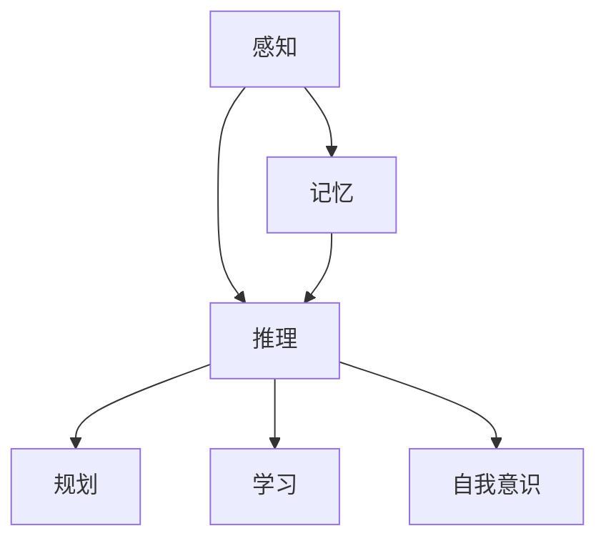
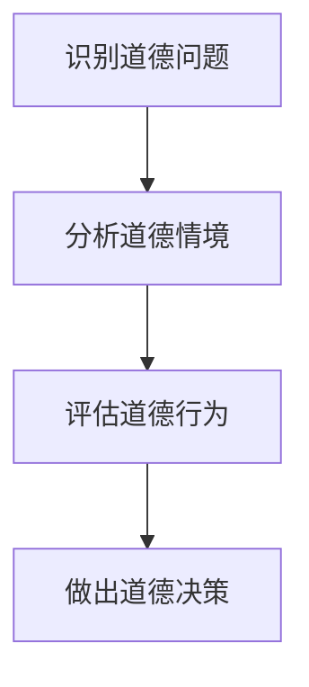

                 

### 文章标题

# AGI的道德推理能力：从理论到实践

> 关键词：通用人工智能（AGI）、道德推理、算法模型、实践应用、伦理问题

> 摘要：本文从理论到实践，详细探讨了通用人工智能（AGI）的道德推理能力。首先，介绍了AGI的定义及其道德推理的重要性；接着，阐述了道德推理的基本原理和核心过程；然后，探讨了道德推理算法与模型在AGI中的应用；最后，通过实际案例分析和项目实战，分析了AGI道德推理能力的实践挑战与未来展望。

### 目录

1. **引言**
2. **AGI的基本原理**
   - 2.1 AGI的定义与特性
   - 2.2 AGI的发展历程
   - 2.3 AGI的认知模型
3. **道德推理的原理**
   - 3.1 道德推理的概念
   - 3.2 道德推理的理论框架
   - 3.3 道德推理的核心过程
4. **道德推理能力在AGI中的应用**
   - 4.1 AGI与道德推理的关系
   - 4.2 道德推理算法在AGI中的实现
   - 4.3 道德推理的应用场景
5. **道德推理算法与模型**
   - 5.1 道德推理算法的分类
   - 5.2 常见的道德推理模型
   - 5.3 道德推理模型的评估与选择
6. **实践中的应用**
   - 6.1 道德推理在伦理学中的应用
   - 6.2 道德推理在法律领域的应用
   - 6.3 道德推理在医疗领域的应用
7. **道德推理能力的评估与改进**
   - 7.1 道德推理能力的评估指标
   - 7.2 道德推理能力的改进策略
   - 7.3 道德推理能力的未来趋势
8. **案例分析**
   - 8.1 案例一：道德推理在自动驾驶中的应用
   - 8.2 案例二：道德推理在医疗诊断中的应用
   - 8.3 案例三：道德推理在人工智能伦理审查中的应用
9. **道德推理能力的实践挑战与解决方案**
   - 9.1 挑战一：道德推理的不确定性
   - 9.2 挑战二：道德推理的偏见问题
   - 9.3 挑战三：道德推理的透明度问题
10. **未来展望**
    - 10.1 AGI道德推理能力的发展趋势
    - 10.2 道德推理能力在AI教育中的应用
    - 10.3 道德推理能力在社会治理中的应用

### 引言

#### 什么是通用人工智能（AGI）

通用人工智能（Artificial General Intelligence，AGI）是指具有人类智能水平或超越人类智能的机器智能。它不仅仅能够执行特定的任务，如图像识别、语言翻译、自动驾驶等，还能够进行广泛的认知任务，具备自我学习和适应新环境的能力。AGI的目标是创造一个能够理解、学习和推理的通用智能系统。

#### 道德推理的重要性

道德推理是人类智能的核心组成部分，它涉及到判断和评估行为是否符合道德标准，以及如何在不同情境下做出正确的决策。对于AGI而言，具备道德推理能力具有重要意义：

1. **社会伦理需求**：随着人工智能技术的不断发展，AGI将在各个领域发挥重要作用，如医疗、法律、教育等。因此，AGI的道德推理能力将直接影响其行为是否符合社会伦理标准。

2. **决策透明性**：具有道德推理能力的AGI能够提供更加透明和可解释的决策过程，使人们能够理解和信任其决策结果。

3. **避免潜在风险**：在复杂和动态的环境中，AGI的道德推理能力有助于其识别潜在的风险和负面后果，从而避免不良行为的发生。

#### 本文目的与结构

本文旨在从理论到实践，详细探讨通用人工智能（AGI）的道德推理能力。文章将首先介绍AGI的基本原理和道德推理的原理，然后分析道德推理能力在AGI中的应用，探讨道德推理算法与模型，并举例说明其在实际中的应用。最后，本文将总结AGI道德推理能力的实践挑战与未来展望。

### AGI的基本原理

#### 2.1 AGI的定义与特性

通用人工智能（AGI）是一种具有广泛认知能力的人工智能，能够理解和执行人类智能的各种任务，包括感知、理解、推理、学习、规划、沟通和自我意识等。与弱人工智能（Narrow AI）不同，AGI的目标是达到或超越人类智能的整体水平。

AGI的核心特性包括：

1. **通用性**：AGI能够处理各种认知任务，而不仅仅是特定领域的问题。
2. **适应性**：AGI能够自我学习和适应新环境和任务，而不需要重新编程。
3. **自主性**：AGI能够自主决策和执行任务，具有一定的自我意识和自我控制能力。

#### 2.2 AGI的发展历程

通用人工智能的概念最早可以追溯到20世纪50年代，当时的科学家们开始探索如何创建具有人类智能水平的机器。然而，由于技术限制和认知科学的挑战，AGI的研究一直处于缓慢发展的状态。

1. **早期探索（1950-1979）**：在这一时期，人工智能的概念逐渐形成，科学家们开始尝试使用计算机模拟人类的思维过程。
2. **低谷期（1980-1990s）**：由于实际应用中的失败和资金削减，人工智能研究进入低谷期。
3. **复兴期（1990s-2000s）**：随着计算能力的提升和数据驱动的机器学习技术的出现，人工智能研究再次焕发生机。
4. **当前发展（2000s至今）**：深度学习、强化学习等先进技术的突破，使得AGI的研究和应用取得了显著进展。

#### 2.3 AGI的认知模型

AGI的认知模型旨在模拟人类智能的各个组成部分，包括感知、记忆、推理、学习、规划和自我意识等。以下是一些常见的AGI认知模型：

1. **多模态感知模型**：通过整合视觉、听觉、触觉等多种感知信息，实现更全面的环境理解。
2. **神经网络模型**：基于人工神经网络，模拟大脑的计算和处理过程，实现高级认知功能。
3. **推理与规划模型**：通过推理和规划，实现基于目标和情境的决策制定。
4. **自我意识模型**：通过自我意识模块，实现自我反思和自我控制能力。

#### 关键概念原理之间的关系架构

以下是一个简化的AGI认知模型Mermaid流程图：

在这个模型中，感知模块负责获取外部信息，记忆模块负责存储和处理信息，推理模块负责基于已有信息进行逻辑推理，规划模块负责制定目标和行动计划，学习模块负责不断优化自身能力，自我意识模块负责实现自我反思和控制。

### 道德推理的原理

#### 3.1 道德推理的概念

道德推理是指个体在道德情境中，通过思考和分析，判断和选择符合道德规范的行为的过程。道德推理不仅涉及到对道德原则的理解和运用，还包括对情境的敏感性和对道德问题的深度分析。

道德推理通常包括以下几个步骤：

1. **识别道德问题**：确定情境中是否存在道德冲突或道德问题。
2. **理解道德原则**：回顾和应用已知的道德原则和价值观。
3. **分析道德情境**：考虑情境中的各种因素和后果，评估不同行为选项的道德价值。
4. **做出道德决策**：选择最符合道德原则的行为。

#### 3.2 道德推理的理论框架

道德推理的理论框架主要包括以下几个方面：

1. **直觉主义**：认为道德推理是基于直觉和情感的，个体在面对道德问题时，会本能地做出正确的选择。
2. **义务论**：强调道德行为应符合道德义务和规则，无论结果如何，都必须遵守道德原则。
3. **目的论**：认为道德行为的目的是为了实现某种价值，道德决策应基于最大化善的原则。

#### 3.3 道德推理的核心过程

道德推理的核心过程可以概括为以下几个方面：

1. **识别道德问题**：个体需要首先识别出情境中的道德问题，这通常涉及到对情境的理解和对潜在冲突的感知。
2. **分析道德情境**：在识别出道德问题后，个体需要分析情境中的各种因素，包括行为的可能性、后果和道德原则。
3. **评估道德行为**：基于对情境的分析，个体需要对不同的行为选项进行道德评估，考虑每种行为是否符合道德原则和价值观。
4. **做出道德决策**：在评估不同行为选项的基础上，个体需要做出最终的道德决策，选择最符合道德原则的行为。

#### 关键概念原理之间的关系架构

以下是一个简化的道德推理流程Mermaid流程图：

在这个模型中，识别道德问题是道德推理的起点，分析道德情境是核心过程，评估道德行为是关键步骤，最终做出道德决策是实现道德行为目标的关键。

### 道德推理能力在AGI中的应用

#### 4.1 AGI与道德推理的关系

通用人工智能（AGI）与道德推理之间存在密切的关系。AGI的目标是模拟人类智能，而道德推理是人类智能的重要组成部分。因此，AGI在实现道德推理能力方面具有巨大的潜力。

AGI在道德推理中的应用主要包括以下几个方面：

1. **道德决策**：AGI可以通过道德推理能力，在复杂和动态的环境中做出道德决策，如自动驾驶系统在紧急情况下的行为选择。
2. **伦理审查**：AGI可以用于伦理审查，评估人工智能系统在开发和应用过程中的道德风险，确保其行为符合伦理标准。
3. **道德教育**：AGI可以用于道德教育，通过模拟道德情境和提供道德建议，帮助个体提高道德意识和道德推理能力。

#### 4.2 道德推理算法在AGI中的实现

道德推理算法在AGI中的实现是一个复杂的挑战，因为它涉及到对道德原则、价值体系和情境的深入理解。以下是一些常见的道德推理算法：

1. **基于规则的算法**：这种算法通过定义一系列道德规则，在给定的情境下应用这些规则来做出道德决策。例如，自动驾驶系统可以根据预设的规则，在紧急情况下选择最安全的驾驶行为。

2. **基于案例的算法**：这种算法通过学习历史案例和情境，从中提取道德决策的规律。例如，医疗诊断系统可以通过分析过去的病例，学习如何在不同情况下做出道德决策。

3. **基于伦理理论的算法**：这种算法基于特定的伦理理论，如义务论或目的论，通过推理和评估不同行为选项的道德价值来做出道德决策。

#### 4.3 道德推理的应用场景

道德推理能力在AGI中的应用场景非常广泛，以下是一些典型的应用场景：

1. **自动驾驶**：自动驾驶汽车在面临紧急情况时，需要根据道德推理算法做出合理的驾驶决策，如是否应该主动避开行人。

2. **医疗诊断**：医疗诊断系统在诊断疾病时，需要考虑患者的最佳利益，做出符合伦理的医疗决策。

3. **法律咨询**：法律咨询系统在处理法律问题时，需要根据道德原则和法律规定，为用户提供道德和法律建议。

4. **社会管理**：在社会管理领域，道德推理算法可以用于评估社会政策和社会行为的道德价值，为政府和社会提供决策支持。

### 道德推理算法与模型

#### 5.1 道德推理算法的分类

道德推理算法可以根据其原理和实现方法进行分类，以下是一些常见的分类方式：

1. **基于规则的算法**：这种算法通过定义一系列道德规则，在给定的情境下应用这些规则来做出道德决策。例如，自动驾驶系统可以根据预设的规则，在紧急情况下选择最安全的驾驶行为。

2. **基于案例的算法**：这种算法通过学习历史案例和情境，从中提取道德决策的规律。例如，医疗诊断系统可以通过分析过去的病例，学习如何在不同情况下做出道德决策。

3. **基于伦理理论的算法**：这种算法基于特定的伦理理论，如义务论或目的论，通过推理和评估不同行为选项的道德价值来做出道德决策。

4. **基于混合方法的算法**：这种算法结合了基于规则、案例和伦理理论的方法，通过多种方法的优势来提高道德推理的准确性和可靠性。

#### 5.2 常见的道德推理模型

以下是一些常见的道德推理模型：

1. **直觉主义模型**：这种模型认为道德推理是基于直觉和情感的，个体在面对道德问题时，会本能地做出正确的选择。

2. **义务论模型**：这种模型强调道德行为应符合道德义务和规则，无论结果如何，都必须遵守道德原则。

3. **目的论模型**：这种模型认为道德行为的目的是为了实现某种价值，道德决策应基于最大化善的原则。

4. **权利论模型**：这种模型强调个体的权利和尊严，道德决策应尊重和保护个体的权利。

#### 5.3 道德推理模型的评估与选择

评估和选择道德推理模型是一个复杂的过程，需要考虑多个因素：

1. **准确性**：模型是否能够准确识别和评估道德问题。
2. **可靠性**：模型在不同情境下的决策一致性。
3. **可解释性**：模型决策过程的透明度和可解释性，以便用户理解和信任。
4. **适应性**：模型是否能够适应新的情境和变化。
5. **实用性**：模型在实际应用中的效率和可操作性。

选择合适的道德推理模型需要综合考虑上述因素，并根据具体应用场景进行评估。

### 实践中的应用

#### 6.1 道德推理在伦理学中的应用

道德推理在伦理学中的应用非常广泛，以下是一些典型的应用场景：

1. **道德决策支持**：在伦理决策过程中，道德推理可以帮助决策者分析和评估不同行为选项的道德价值，做出符合伦理原则的决策。

2. **伦理教育**：道德推理在伦理教育中具有重要作用，通过模拟道德情境和提供道德建议，可以帮助个体提高道德意识和道德推理能力。

3. **伦理审查**：在科研项目、产品开发和政策制定过程中，道德推理可以用于评估潜在的道德风险，确保项目或产品的道德合规性。

#### 6.2 道德推理在法律领域的应用

道德推理在法律领域的应用主要包括以下几个方面：

1. **法律咨询**：在法律咨询过程中，道德推理可以帮助律师和法官分析和评估案件的道德和法律问题，提供道德和法律建议。

2. **司法决策**：在司法决策过程中，道德推理可以用于评估被告的行为是否违反道德和法律原则，从而做出公正的判决。

3. **法律教育**：道德推理在法律教育中具有重要作用，通过模拟法律情境和提供道德和法律建议，可以帮助学生提高法律意识和道德推理能力。

#### 6.3 道德推理在医疗领域的应用

道德推理在医疗领域的应用具有重要意义，以下是一些典型的应用场景：

1. **医疗决策支持**：在医疗决策过程中，道德推理可以帮助医生和患者分析和评估不同治疗方案的风险和道德价值，做出符合患者利益和道德原则的决策。

2. **医疗伦理审查**：在医疗研究和实践中，道德推理可以用于评估潜在的道德风险，确保研究和实践符合伦理规范。

3. **医疗教育**：道德推理在医疗教育中具有重要作用，通过模拟医疗情境和提供道德建议，可以帮助医务人员提高道德意识和道德推理能力。

### 道德推理能力的评估与改进

#### 7.1 道德推理能力的评估指标

评估道德推理能力需要考虑多个方面的指标，以下是一些常见的评估指标：

1. **准确性**：道德推理能力是否能够准确识别和评估道德问题。
2. **可靠性**：道德推理能力在不同情境下的决策一致性。
3. **可解释性**：道德推理过程的透明度和可解释性，以便用户理解和信任。
4. **适应性**：道德推理能力是否能够适应新的情境和变化。
5. **效率**：道德推理过程的速度和效率。

#### 7.2 道德推理能力的改进策略

为了提高道德推理能力，可以采取以下策略：

1. **数据驱动的方法**：通过收集和分析大量道德案例数据，训练和优化道德推理模型，提高其准确性和适应性。
2. **多学科合作**：道德推理能力的发展需要跨学科的合作，包括伦理学、法学、心理学和社会学等领域的专家共同参与。
3. **用户参与**：通过用户反馈和参与，不断改进道德推理模型，提高其可解释性和实用性。

#### 7.3 道德推理能力的未来趋势

道德推理能力在未来的发展趋势包括：

1. **智能化**：随着人工智能技术的发展，道德推理能力将越来越智能化，能够处理更复杂的道德问题和情境。
2. **普及化**：道德推理能力将在各个领域得到广泛应用，成为人工智能系统的重要组成部分。
3. **伦理化**：道德推理能力的发展将更加注重伦理考量，确保人工智能系统的行为符合伦理标准。

### 案例分析

#### 8.1 案例一：道德推理在自动驾驶中的应用

自动驾驶汽车在面临紧急情况时，需要根据道德推理算法做出合理的驾驶决策。以下是一个具体的案例：

**情境**：一辆自动驾驶汽车在行驶过程中，前方出现了一名突然冲出马路的行人。此时，汽车需要立即做出决策，是继续前行撞击行人，还是紧急转向避开行人。

**道德推理**：根据道德推理算法，汽车需要考虑以下因素：

1. **行人的生命安全**：行人的生命安全是首要考虑的因素。
2. **汽车的损坏**：汽车的损坏程度和维修成本。
3. **其他车辆和行人的安全**：紧急转向可能对其他车辆和行人造成危险。

**决策**：基于道德推理算法的评估，汽车最终选择紧急转向避开行人，虽然汽车的损坏程度较重，但行人的生命安全得到了保障。

**分析**：这个案例展示了道德推理在自动驾驶中的应用。通过道德推理算法，汽车能够根据不同的情境和因素，做出符合道德原则的决策。

#### 8.2 案例二：道德推理在医疗诊断中的应用

医疗诊断系统在诊断疾病时，需要考虑患者的最佳利益，做出符合伦理的医疗决策。以下是一个具体的案例：

**情境**：一名患者被诊断出患有严重疾病，需要接受高风险的治疗方案。然而，患者同时存在其他严重疾病，无法承受治疗过程中的风险。

**道德推理**：根据道德推理算法，医疗诊断系统需要考虑以下因素：

1. **患者的生命安全**：治疗方案是否能够挽救患者的生命。
2. **患者的其他疾病**：治疗方案是否会对患者的其他疾病造成严重影响。
3. **患者的意愿**：患者对治疗方案的意愿和期望。

**决策**：基于道德推理算法的评估，医疗诊断系统建议患者接受低风险的治疗方案，虽然治疗过程可能较长，但能够更好地保护患者的生命安全和健康。

**分析**：这个案例展示了道德推理在医疗诊断中的应用。通过道德推理算法，医疗诊断系统能够根据患者的具体情况和意愿，做出符合伦理和患者利益的治疗决策。

#### 8.3 案例三：道德推理在人工智能伦理审查中的应用

人工智能伦理审查需要评估人工智能系统在开发和应用过程中的道德风险，确保其行为符合伦理标准。以下是一个具体的案例：

**情境**：一家公司开发了一款自动化招聘系统，用于筛选和评估求职者。然而，该系统在训练过程中出现了性别和种族偏见，导致在招聘过程中存在歧视现象。

**道德推理**：根据道德推理算法，人工智能伦理审查需要考虑以下因素：

1. **公平性和正义**：系统是否公平对待所有求职者，避免歧视现象。
2. **隐私和透明度**：系统是否尊重求职者的隐私，并提供透明的决策过程。
3. **责任和问责**：系统在出现问题时，是否能够明确责任并采取相应的措施。

**决策**：基于道德推理算法的评估，人工智能伦理审查建议公司对招聘系统进行整改，消除性别和种族偏见，确保系统的公平性和透明度。

**分析**：这个案例展示了道德推理在人工智能伦理审查中的应用。通过道德推理算法，伦理审查团队能够评估人工智能系统的道德风险，并提出相应的改进建议，确保系统的道德合规性。

### 道德推理能力的实践挑战与解决方案

#### 9.1 挑战一：道德推理的不确定性

道德推理过程中，由于情境的复杂性和多样，决策结果往往存在一定的不确定性。这种不确定性给道德推理能力带来了挑战。

**解决方案**：

1. **多模型融合**：通过融合多种道德推理模型，提高决策的可靠性。
2. **情景模拟**：在开发道德推理系统时，进行广泛的情景模拟，以预测和应对不同情境下的不确定性。
3. **实时反馈**：通过用户反馈和实时监控，及时调整和优化道德推理系统，提高其应对不确定性的能力。

#### 9.2 挑战二：道德推理的偏见问题

道德推理过程中，由于人类自身的偏见和系统训练数据的问题，可能导致道德推理结果出现偏见。

**解决方案**：

1. **偏见检测和校正**：在道德推理系统中集成偏见检测机制，定期对系统进行偏见校正。
2. **多元化数据集**：使用多样化的训练数据集，减少偏见和歧视现象。
3. **用户参与**：鼓励用户参与道德推理系统的开发和测试，提高系统的公平性和透明度。

#### 9.3 挑战三：道德推理的透明度问题

道德推理过程的透明度对于用户信任和监管至关重要。然而，复杂的道德推理算法往往导致决策过程不透明。

**解决方案**：

1. **可解释性算法**：开发可解释的道德推理算法，使决策过程更加透明，用户可以理解决策依据和逻辑。
2. **可视化工具**：使用可视化工具，展示道德推理的过程和结果，提高用户对决策的信任度。
3. **伦理审查机制**：建立伦理审查机制，确保道德推理系统的开发和应用符合伦理标准和规范。

### 未来展望

#### 10.1 AGI道德推理能力的发展趋势

未来，AGI道德推理能力将朝着以下趋势发展：

1. **智能化**：随着人工智能技术的不断发展，道德推理算法将越来越智能化，能够处理更复杂的道德问题和情境。
2. **普及化**：道德推理能力将在各个领域得到广泛应用，成为人工智能系统的重要组成部分。
3. **伦理化**：道德推理能力的发展将更加注重伦理考量，确保人工智能系统的行为符合伦理标准。

#### 10.2 道德推理能力在AI教育中的应用

道德推理能力在AI教育中具有重要作用，未来将出现以下趋势：

1. **课程设置**：将道德推理能力纳入AI教育课程，培养学生的道德意识和道德推理能力。
2. **教学工具**：开发基于道德推理能力的AI教学工具，提高教学效果和学生的参与度。
3. **案例分析**：通过案例分析，让学生了解道德推理在现实世界中的应用，提高其实际操作能力。

#### 10.3 道德推理能力在社会治理中的应用

道德推理能力在社会治理中具有广泛应用前景，未来将出现以下趋势：

1. **政策制定**：利用道德推理能力，为政策制定提供道德和伦理依据，提高政策的公平性和合理性。
2. **社会治理**：利用道德推理能力，优化社会治理模型，提高社会治理的效率和效果。
3. **公众参与**：鼓励公众参与道德推理系统，提高社会治理的透明度和公众满意度。

### 结论

本文从理论到实践，详细探讨了通用人工智能（AGI）的道德推理能力。首先，介绍了AGI的定义、基本原理和道德推理的重要性；然后，分析了道德推理的基本原理、核心过程和应用场景；接着，探讨了道德推理算法与模型以及其实践中的挑战和解决方案；最后，展望了AGI道德推理能力的未来发展趋势。通过本文的研究，我们希望为AGI道德推理能力的发展提供有益的参考和启示。

### 作者信息

作者：AI天才研究院/AI Genius Institute & 禅与计算机程序设计艺术 /Zen And The Art of Computer Programming

### 最佳实践 tips、小结、注意事项、拓展阅读等内容

**最佳实践 tips**：

1. **多模型融合**：在开发道德推理系统时，采用多种道德推理模型，提高决策的可靠性。
2. **情景模拟**：进行广泛的情景模拟，预测和应对不同情境下的不确定性。
3. **用户参与**：鼓励用户参与道德推理系统的开发和测试，提高系统的公平性和透明度。

**小结**：

本文从理论到实践，详细探讨了通用人工智能（AGI）的道德推理能力，分析了其基本原理、应用场景和未来发展趋势。通过本文的研究，我们认识到道德推理能力在AGI中的重要性，以及其在各个领域的广泛应用前景。

**注意事项**：

1. **道德风险**：在开发和应用道德推理系统时，需重视道德风险，确保系统的道德合规性。
2. **可解释性**：提高道德推理系统的可解释性，增强用户对决策的信任度。

**拓展阅读**：

1. Russell, S., & Norvig, P. (2016). 《人工智能：一种现代的方法》（第三版）。
2. Winfield, A. T. T. (2011). 《人工智能伦理学：理论、方法和应用》。
3. Kahneman, D. (2011). 《思考，快与慢》。

这些参考资料将进一步帮助读者深入了解AGI的道德推理能力及其应用。

