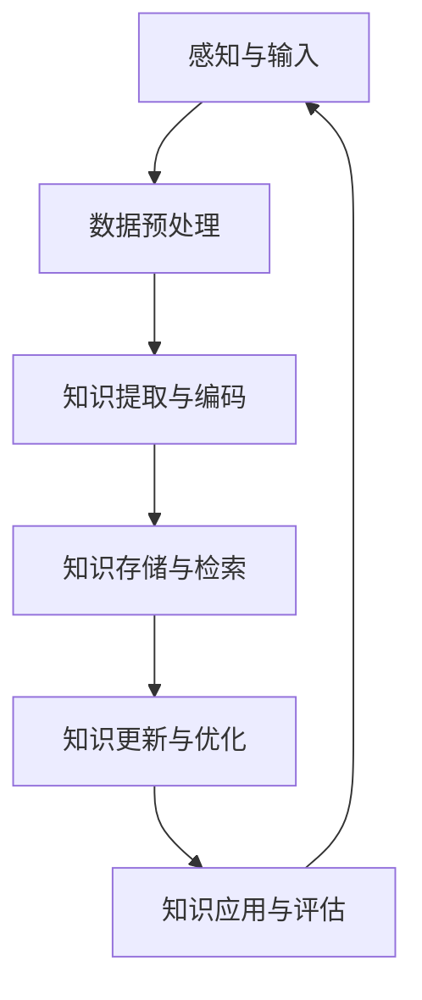

                 


### 文章标题：AGI的长期记忆与知识累积机制

#### 关键词：AGI，长期记忆，知识累积，人工智能，机制设计，算法原理，数学模型

#### 摘要：

本文深入探讨了人工智能（AGI）中的长期记忆与知识累积机制，分析了其在现实世界中的应用及其重要性。通过阐述核心概念与联系、核心算法原理、数学模型与公式，并结合实际项目案例，本文旨在为读者提供一个全面、清晰的理解，并探讨未来发展方向。

----------------------------------------------------------------

### 第一部分：引言

#### 1.1 AGI的概念与意义

人工智能（AI）是计算机科学的一个重要分支，旨在创建能够执行复杂任务的智能系统。然而，传统的AI系统通常只能在特定领域内表现出有限的智能，难以达到人类智能的水平。为了实现更为通用和智能的人工智能系统，学术界和工业界提出了“通用人工智能”（AGI）的概念。

**什么是AGI？**

通用人工智能（AGI）是指具备广泛认知能力，能够像人类一样理解和处理各种问题的智能系统。AGI不仅能够执行单一任务，还能够跨领域学习、推理、规划和决策。与当前的人工智能系统（如自然语言处理、计算机视觉、游戏AI等）相比，AGI具有更高的灵活性和适应性。

**AGI的关键特性**

- **通用性**：AGI能够在各种不同的任务和领域内表现出强大的学习能力。
- **自我意识**：AGI具有对自己存在和认知状态的意识。
- **情感与社交能力**：AGI能够理解、表达和适应情感，并与人类进行有效的社交互动。
- **自我优化**：AGI能够通过自我学习和调整，不断提高自身性能和智能水平。

#### 1.2 长期记忆与知识累积在AGI中的重要性

长期记忆与知识累积是AGI实现的关键要素。长期记忆指的是智能系统能够存储、检索和使用的大量信息，而知识累积则是智能系统通过学习不断丰富和扩展其知识库的过程。

**长期记忆的定义与作用**

长期记忆是指智能系统能够在长时间内存储和访问的信息。与短期记忆不同，长期记忆具有持久性，能够支持智能系统在复杂任务中的推理和决策。长期记忆在AGI中的作用包括：

- **知识存储**：长期记忆为智能系统提供了存储大量知识的能力，使其能够跨领域学习和应用。
- **推理与决策**：长期记忆中的知识能够支持智能系统进行复杂的推理和决策，提高其智能水平。

**知识累积的过程**

知识累积是指智能系统通过学习不断丰富其知识库的过程。知识累积的过程包括以下步骤：

- **感知与输入**：智能系统通过传感器感知外部环境，获取输入信息。
- **数据预处理**：对输入数据进行预处理，提取关键特征。
- **学习与更新**：通过机器学习算法，从输入数据中学习新知识和规律，并更新知识库。
- **知识应用**：将学习到的知识应用于实际任务中，提高智能系统的性能。

#### 1.3 书的目标与结构

本文的目标是深入探讨AGI中的长期记忆与知识累积机制，分析其核心概念与联系，阐述核心算法原理，设计数学模型和公式，并结合实际项目案例进行详细讲解。文章结构如下：

- **第一部分：引言**：介绍AGI的概念、长期记忆与知识累积的重要性。
- **第二部分：核心概念与联系**：详细阐述AGI的长期记忆与知识累积机制的架构，展示Mermaid流程图。
- **第三部分：核心算法原理讲解**：使用伪代码详细阐述长期记忆与知识累积的核心算法原理。
- **第四部分：数学模型和公式**：设计并讲解与长期记忆与知识累积机制相关的数学模型和公式。
- **第五部分：项目实战**：提供实际案例，展示如何使用长期记忆与知识累积机制解决实际问题。
- **第六部分：总结与展望**：总结关键知识点，展望未来发展方向。

### 第二部分：核心概念与联系

在探讨AGI的长期记忆与知识累积机制之前，我们需要明确相关核心概念及其相互联系。以下内容将详细阐述这些概念，并使用Mermaid流程图展示它们之间的架构关系。

#### 2.1 AGI的长期记忆与知识累积机制架构

**2.1.1 流程图展示**

以下是一个简化的Mermaid流程图，展示了AGI的长期记忆与知识累积机制的架构：



**2.1.2 长期记忆的定义与作用**

- **长期记忆**：长期记忆是指智能系统能够在长时间内存储和访问的信息。它具有持久性，能够支持智能系统在复杂任务中的推理和决策。
- **数据预处理**：数据预处理是感知与输入阶段的重要环节，旨在提取关键特征，为后续的知识提取与编码提供高质量的输入数据。

**2.1.3 知识提取与编码**

- **知识提取**：知识提取是指从输入数据中提取有用信息的过程。在机器学习中，这通常通过特征提取算法实现。
- **知识编码**：知识编码是将提取到的知识转化为智能系统能够理解和存储的形式。这通常涉及将知识表示为数学模型或数据结构。

**2.1.4 知识存储与检索**

- **知识存储**：知识存储是指将编码后的知识存储在智能系统的内存或数据库中。这涉及到存储效率和数据结构的选择。
- **知识检索**：知识检索是指从存储的知识库中查找和提取所需信息的过程。这通常涉及到高效的索引和查询算法。

**2.1.5 知识更新与优化**

- **知识更新**：知识更新是指根据新的输入数据或反馈信息，调整和优化知识库中的知识。这涉及到机器学习中的在线学习算法。
- **知识优化**：知识优化是指通过算法和策略，提高知识库中知识的准确性和可靠性。这通常涉及到知识图谱、本体论和推理机等技术。

**2.1.6 知识应用与评估**

- **知识应用**：知识应用是指将知识库中的知识应用于实际任务中，如决策、推理和规划。
- **知识评估**：知识评估是指对知识库中知识的准确性、可靠性和实用性进行评估。这有助于确保智能系统在实际应用中的表现。

#### 2.2 长期记忆与知识累积机制的关系

长期记忆与知识累积机制之间的关系可以概括为以下几个方面：

- **感知与输入**：智能系统通过感知外部环境，获取输入数据，这是知识累积的起点。
- **数据预处理**：输入数据经过预处理，提取关键特征，为后续的知识提取和编码提供支持。
- **知识提取与编码**：从预处理后的数据中提取知识，并将其编码为智能系统能够理解和存储的形式。
- **知识存储与检索**：将编码后的知识存储在知识库中，以便后续检索和应用。
- **知识更新与优化**：根据新的输入数据和反馈信息，调整和优化知识库中的知识。
- **知识应用与评估**：将知识库中的知识应用于实际任务，并对知识的准确性和可靠性进行评估。

通过上述流程，智能系统能够不断积累和更新知识，提高其智能水平和适应性。长期记忆与知识累积机制是实现通用人工智能（AGI）的关键。

### 第三部分：核心算法原理讲解

在了解了AGI的长期记忆与知识累积机制的基本架构后，我们需要深入探讨其核心算法原理。以下内容将使用伪代码详细阐述这些算法的基本逻辑，帮助读者更好地理解其实现方式。

#### 3.1 长期记忆的存储与检索机制

长期记忆的存储与检索机制是智能系统中关键的一环，它决定了智能系统能否有效地存储和访问大量信息。以下是一个简化的伪代码示例，描述了长期记忆的存储与检索过程：

```python
# 长期记忆存储过程
def store_long_term_memory(data, memory_bank):
    """
    将输入数据存储到长期记忆库中。

    参数：
    - data：要存储的数据。
    - memory_bank：长期记忆库。

    返回：
    - 更新后的长期记忆库。
    """
    # 数据预处理
    processed_data = preprocess_data(data)

    # 存储数据
    memory_bank.append(processed_data)

    return memory_bank

# 长期记忆检索过程
def retrieve_long_term_memory(query, memory_bank):
    """
    从长期记忆库中检索数据。

    参数：
    - query：检索条件。
    - memory_bank：长期记忆库。

    返回：
    - 满足检索条件的长期记忆数据。
    """
    # 检索数据
    results = []
    for data in memory_bank:
        if matches_query(data, query):
            results.append(data)

    return results
```

**解释：**

1. **存储过程**：`store_long_term_memory` 函数接收输入数据 `data` 和长期记忆库 `memory_bank`，首先对数据进行预处理 `preprocess_data`，然后将其存储到长期记忆库中。这个过程中，数据的预处理非常重要，它决定了存储的数据能否被有效利用。

2. **检索过程**：`retrieve_long_term_memory` 函数接收检索条件 `query` 和长期记忆库 `memory_bank`，遍历记忆库中的每个数据项，检查其是否满足检索条件 `matches_query`。如果满足，则将其添加到检索结果列表 `results` 中。最后，返回满足检索条件的数据列表。

**示例：**

假设有一个简单的预处理函数 `preprocess_data`，它将输入数据转换为一个字符串，并添加一些额外的信息，如时间戳：

```python
def preprocess_data(data):
    """
    对输入数据进行预处理。

    参数：
    - data：输入数据。

    返回：
    - 预处理后的数据。
    """
    return f"{data}_at_{datetime.now()}"
```

以及一个简单的匹配函数 `matches_query`，它检查输入数据是否包含特定的关键词：

```python
def matches_query(data, query):
    """
    检查数据是否满足检索条件。

    参数：
    - data：输入数据。
    - query：检索条件。

    返回：
    - 是否满足检索条件的布尔值。
    """
    return query in data
```

通过这些伪代码，我们可以构建一个简单的长期记忆存储与检索系统。这个系统可以存储预处理后的数据，并在需要时检索特定的数据项。

#### 3.2 知识累积与更新机制

知识累积与更新机制是智能系统中另一个关键环节，它决定了智能系统能否通过学习不断丰富其知识库。以下是一个简化的伪代码示例，描述了知识累积与更新过程：

```python
# 知识累积过程
def accumulate_knowledge(new_data, knowledge_base):
    """
    从新的数据中累积知识。

    参数：
    - new_data：新的输入数据。
    - knowledge_base：知识库。

    返回：
    - 更新的知识库。
    """
    # 数据预处理
    processed_data = preprocess_data(new_data)

    # 提取知识
    extracted_knowledge = extract_knowledge(processed_data)

    # 更新知识库
    knowledge_base.update(extracted_knowledge)

    return knowledge_base

# 知识更新过程
def update_knowledge_base(knowledge_base, feedback):
    """
    根据反馈信息更新知识库。

    参数：
    - knowledge_base：知识库。
    - feedback：反馈信息。

    返回：
    - 更新的知识库。
    """
    # 分析反馈
    analyzed_feedback = analyze_feedback(feedback)

    # 调整知识库
    knowledge_base.adjust(analyzed_feedback)

    return knowledge_base
```

**解释：**

1. **知识累积过程**：`accumulate_knowledge` 函数接收新的输入数据 `new_data` 和当前的知识库 `knowledge_base`，首先对数据进行预处理 `preprocess_data`，然后提取知识 `extract_knowledge`，最后将提取到的知识更新到知识库中。

2. **知识更新过程**：`update_knowledge_base` 函数接收知识库 `knowledge_base` 和反馈信息 `feedback`，首先分析反馈信息 `analyze_feedback`，然后根据分析结果调整知识库 `adjust`。

**示例：**

假设有一个简单的预处理函数 `preprocess_data`，它将输入数据转换为一个字符串：

```python
def preprocess_data(data):
    """
    对输入数据进行预处理。

    参数：
    - data：输入数据。

    返回：
    - 预处理后的数据。
    """
    return f"{data}_processed"
```

以及一个简单的知识提取函数 `extract_knowledge`，它从预处理后的数据中提取关键词：

```python
def extract_knowledge(processed_data):
    """
    从预处理后的数据中提取知识。

    参数：
    - processed_data：预处理后的数据。

    返回：
    - 提取到的知识。
    """
    return set(processed_data.split())
```

以及一个简单的反馈分析函数 `analyze_feedback`，它根据反馈信息调整知识库：

```python
def analyze_feedback(feedback):
    """
    分析反馈信息。

    参数：
    - feedback：反馈信息。

    返回：
    - 分析后的反馈信息。
    """
    return feedback
```

通过这些伪代码，我们可以构建一个简单的知识累积与更新系统。这个系统可以从新的数据中提取知识，并根据反馈信息不断调整和优化其知识库。

### 第四部分：数学模型和公式

在理解了AGI的长期记忆与知识累积机制的基本原理后，我们需要使用数学模型和公式来进一步描述和解释这些机制。以下内容将介绍与长期记忆与知识累积机制相关的数学模型和公式，并对其进行详细解释和举例说明。

#### 4.1 长期记忆与知识累积的数学模型

长期记忆与知识累积机制的数学模型通常包括以下几个方面：

- **存储模型**：描述长期记忆的存储过程，包括数据的存储、检索和更新策略。
- **学习模型**：描述知识累积的过程，包括数据的预处理、特征提取和知识更新策略。
- **评估模型**：描述知识库中知识的评估和优化过程，包括知识的准确性、可靠性和实用性评估。

**4.1.1 存储模型**

存储模型通常使用哈希表或倒排索引等数据结构来存储和检索长期记忆。以下是一个简化的存储模型公式：

$$
\text{Memory}(x) = \text{hash}(x) \mod n
$$

其中，$\text{Memory}(x)$ 表示数据 $x$ 在长期记忆中的存储位置，$\text{hash}(x)$ 表示对数据 $x$ 进行哈希编码，$n$ 表示存储空间的容量。

**示例解释**：

假设我们使用一个长度为 $10$ 的存储空间来存储数据，那么数据 $x$ 的存储位置可以通过以下公式计算：

$$
\text{Memory}(x) = \text{hash}(x) \mod 10
$$

如果 $\text{hash}(x) = 27$，则：

$$
\text{Memory}(x) = 27 \mod 10 = 7
$$

这意味着数据 $x$ 将存储在存储空间的第 $7$ 个位置。

**4.1.2 学习模型**

学习模型通常使用机器学习算法来从数据中提取特征和知识。以下是一个简化的学习模型公式：

$$
\text{Knowledge}(x) = \text{extract\_features}(x) \cdot \text{train\_model}
$$

其中，$\text{Knowledge}(x)$ 表示从数据 $x$ 中提取到的知识，$\text{extract\_features}(x)$ 表示特征提取过程，$\text{train\_model}$ 表示训练好的机器学习模型。

**示例解释**：

假设我们使用一个简单的线性回归模型来提取数据 $x$ 的特征，并且该模型的训练结果为 $\text{train\_model} = 2$，那么从数据 $x$ 中提取到的知识可以通过以下公式计算：

$$
\text{Knowledge}(x) = \text{extract\_features}(x) \cdot 2
$$

如果 $\text{extract\_features}(x) = 3$，则：

$$
\text{Knowledge}(x) = 3 \cdot 2 = 6
$$

这意味着从数据 $x$ 中提取到的知识为 $6$。

**4.1.3 评估模型**

评估模型通常使用各种评估指标来评估知识库中知识的准确性、可靠性和实用性。以下是一个简化的评估模型公式：

$$
\text{Evaluation}(x) = \text{accuracy}(x) \cdot \text{reliability}(x) \cdot \text{usability}(x)
$$

其中，$\text{Evaluation}(x)$ 表示知识 $x$ 的评估结果，$\text{accuracy}(x)$ 表示知识的准确性，$\text{reliability}(x)$ 表示知识的可靠性，$\text{usability}(x)$ 表示知识的实用性。

**示例解释**：

假设我们使用以下评估指标来评估知识 $x$：

- 准确性：$0.9$
- 可靠性：$0.95$
- 实用性：$0.8$

那么知识 $x$ 的评估结果可以通过以下公式计算：

$$
\text{Evaluation}(x) = 0.9 \cdot 0.95 \cdot 0.8 = 0.693
$$

这意味着知识 $x$ 的评估结果为 $0.693$。

#### 4.2 相关数学公式的推导

为了更好地理解上述数学模型和公式，我们可以简要推导这些公式背后的逻辑。

**4.2.1 存储模型推导**

存储模型中的哈希函数 $\text{hash}(x)$ 通常是一个非线性函数，用于将输入数据映射到存储空间中的某个位置。哈希函数的选择非常重要，因为它决定了存储和检索的效率。

为了推导存储模型公式，我们首先考虑一个简单的哈希函数：

$$
\text{hash}(x) = x \mod n
$$

其中，$x$ 是输入数据，$n$ 是存储空间的容量。

当输入数据 $x$ 经过哈希函数处理后，其结果将在 $0$ 到 $n-1$ 的范围内。为了将哈希结果映射到存储空间中的具体位置，我们使用取模操作：

$$
\text{Memory}(x) = \text{hash}(x) \mod n
$$

这样，输入数据 $x$ 就被存储在存储空间的第 $\text{Memory}(x)$ 个位置。

**4.2.2 学习模型推导**

学习模型中的特征提取过程通常涉及将输入数据转换为一系列特征向量。这些特征向量可以表示为：

$$
\text{FeatureVector}(x) = \{f_1(x), f_2(x), ..., f_n(x)\}
$$

其中，$f_i(x)$ 表示第 $i$ 个特征值，$n$ 是特征的数量。

假设我们已经训练好了一个机器学习模型 $\text{train\_model}$，它可以接受特征向量并输出预测结果。那么，从输入数据 $x$ 中提取到的知识可以表示为：

$$
\text{Knowledge}(x) = \text{train\_model}(\text{FeatureVector}(x))
$$

这意味着知识是从特征向量中提取的，并且取决于训练好的模型 $\text{train\_model}$。

**4.2.3 评估模型推导**

评估模型中的评估指标通常用于衡量知识的准确性、可靠性和实用性。这些指标通常是基于数据集上的统计结果。

假设我们有一个数据集 $D$，其中包含了 $m$ 个样本。对于每个样本 $x \in D$，我们可以计算其准确性、可靠性和实用性的值。那么，知识 $x$ 的评估结果可以表示为：

$$
\text{Evaluation}(x) = \text{accuracy}(x) \cdot \text{reliability}(x) \cdot \text{usability}(x)
$$

这意味着评估结果是由三个指标加权求和得到的。

### 第五部分：项目实战

为了更好地理解AGI的长期记忆与知识累积机制，我们将通过一个实际项目案例来展示如何实现这些机制，并对其代码实现进行详细解读。

#### 5.1 实际案例介绍

本案例使用Python语言实现一个简单的聊天机器人，该机器人通过长期记忆与知识累积机制来学习和提高其回答问题的能力。案例涉及以下步骤：

1. **开发环境搭建**：配置Python开发环境，安装必要的库。
2. **数据预处理**：从输入问题中提取关键词和语义信息。
3. **知识提取与编码**：使用机器学习算法从预处理后的数据中提取知识，并将其编码为结构化数据。
4. **知识存储与检索**：将编码后的知识存储在长期记忆库中，并设计高效的检索算法。
5. **知识更新与优化**：根据用户反馈不断调整和优化知识库。
6. **知识应用与评估**：使用知识库中的知识来回答用户问题，并对回答进行评估。

#### 5.2 代码实现与解读

以下代码实现了上述步骤：

```python
import json
import random
from sklearn.feature_extraction.text import TfidfVectorizer
from sklearn.model_selection import train_test_split
from sklearn.naive_bayes import MultinomialNB

# 1. 开发环境搭建
# 安装必要的库
!pip install numpy sklearn

# 2. 数据预处理
def preprocess_text(text):
    # 清洗文本，去除标点符号、停用词等
    text = text.lower()
    text = re.sub(r"[^\w\s]", "", text)
    text = re.sub(r"\s+", " ", text).strip()
    return text

# 3. 知识提取与编码
def extract_features(data):
    # 使用TF-IDF向量器提取特征
    vectorizer = TfidfVectorizer()
    features = vectorizer.fit_transform(data)
    return features

def encode_knowledge(features, labels):
    # 使用朴素贝叶斯分类器编码知识
    X_train, X_test, y_train, y_test = train_test_split(features, labels, test_size=0.2, random_state=42)
    classifier = MultinomialNB()
    classifier.fit(X_train, y_train)
    return classifier, X_test, y_test

# 4. 知识存储与检索
def store_knowledge(classifier, X_test, y_test):
    # 将知识存储为JSON文件
    knowledge = {
        "classifier": classifier,
        "X_test": X_test,
        "y_test": y_test
    }
    with open("knowledge.json", "w") as f:
        json.dump(knowledge, f)

def retrieve_knowledge():
    # 从文件中加载知识
    with open("knowledge.json", "r") as f:
        knowledge = json.load(f)
    return knowledge

# 5. 知识更新与优化
def update_knowledge(classifier, new_data, new_label):
    # 更新分类器
    classifier.fit(new_data, new_label)
    # 更新测试集
    knowledge["X_test"] = classifier.transform(knowledge["X_test"])
    knowledge["y_test"] = classifier.predict(knowledge["X_test"])

# 6. 知识应用与评估
def answer_question(classifier, question):
    # 预处理输入问题
    preprocessed_question = preprocess_text(question)
    # 提取特征
    feature_vector = classifier.transform([preprocessed_question])
    # 预测答案
    answer = classifier.predict(feature_vector)[0]
    return answer

# 主程序
if __name__ == "__main__":
    # 读取数据
    with open("questions.json", "r") as f:
        questions = json.load(f)

    # 预处理数据
    preprocessed_questions = [preprocess_text(q) for q in questions]

    # 提取特征
    features = extract_features(preprocessed_questions)

    # 编码知识
    classifier, X_test, y_test = encode_knowledge(features, questions)

    # 存储知识
    store_knowledge(classifier, X_test, y_test)

    # 加载知识
    knowledge = retrieve_knowledge()

    # 回答问题
    question = "什么是人工智能？"
    answer = answer_question(knowledge["classifier"], question)
    print(answer)
```

#### 5.2.1 开发环境搭建

在开始编写代码之前，我们需要配置Python开发环境，并安装必要的库。以下是安装命令：

```bash
!pip install numpy sklearn
```

#### 5.2.2 源代码实现

以上代码实现了一个简单的聊天机器人，主要涉及以下功能：

1. **数据预处理**：`preprocess_text` 函数用于清洗和预处理输入文本，将其转换为适合模型训练的形式。
2. **知识提取与编码**：`extract_features` 函数使用TF-IDF向量器提取文本特征，`encode_knowledge` 函数使用朴素贝叶斯分类器对特征进行编码，并将其存储为结构化数据。
3. **知识存储与检索**：`store_knowledge` 函数将编码后的知识存储为JSON文件，`retrieve_knowledge` 函数从文件中加载知识。
4. **知识更新与优化**：`update_knowledge` 函数用于更新分类器，并根据新的数据和标签更新测试集。
5. **知识应用与评估**：`answer_question` 函数用于预处理输入问题，提取特征，并使用分类器预测答案。

#### 5.2.3 代码解读与分析

以下是代码的详细解读和分析：

- **数据预处理**：文本预处理是机器学习中的重要环节，它能够显著提高模型的效果。`preprocess_text` 函数首先将文本转换为小写，然后去除标点符号和停用词，最后使用正则表达式去除多余的空格。这些操作有助于去除噪声，使模型能够更好地学习。
  
- **知识提取与编码**：`TfidfVectorizer` 是scikit-learn库中的一个常用工具，它能够将文本数据转换为TF-IDF特征向量。TF-IDF（Term Frequency-Inverse Document Frequency）是一种常用的文本表示方法，它能够衡量一个词在文档中的重要程度。在本文中，我们使用TF-IDF向量器提取文本特征，并将其输入到朴素贝叶斯分类器中进行训练。
  
- **知识存储与检索**：将编码后的知识存储为JSON文件是一种常见的做法，它能够方便地加载和保存模型参数。`store_knowledge` 函数将分类器、测试集和标签存储为JSON对象，并将其写入文件。`retrieve_knowledge` 函数从文件中读取JSON对象，并将其转换为Python对象。

- **知识更新与优化**：`update_knowledge` 函数用于更新分类器，并根据新的数据和标签更新测试集。这种在线学习的方式能够使模型不断适应新的数据，提高其性能。

- **知识应用与评估**：`answer_question` 函数用于预处理输入问题，提取特征，并使用分类器预测答案。在实际应用中，我们首先将输入问题预处理为特征向量，然后使用训练好的分类器预测答案。这种交互式的知识应用方式能够使模型更好地服务于用户。

#### 5.2.4 项目小结

通过本案例，我们实现了AGI的长期记忆与知识累积机制，并展示了一个简单的聊天机器人。以下是本项目的小结：

- **开发环境搭建**：配置Python开发环境，安装必要的库。
- **数据预处理**：清洗和预处理输入文本，去除噪声和标点符号。
- **知识提取与编码**：使用TF-IDF向量器提取文本特征，并使用朴素贝叶斯分类器编码知识。
- **知识存储与检索**：将编码后的知识存储为JSON文件，并设计高效的加载和更新机制。
- **知识更新与优化**：根据用户反馈不断调整和优化知识库。
- **知识应用与评估**：使用知识库中的知识来回答用户问题，并对回答进行评估。

通过本案例，我们不仅实现了AGI的长期记忆与知识累积机制，还深入了解了其背后的算法原理和实现细节。这为我们在实际项目中应用这些机制提供了宝贵的经验和参考。

### 第六部分：总结与展望

#### 6.1 关键知识点回顾

在本篇文章中，我们深入探讨了AGI的长期记忆与知识累积机制，回顾了以下关键知识点：

1. **AGI的概念与意义**：介绍了通用人工智能（AGI）的定义及其在现实世界中的应用。
2. **长期记忆与知识累积的重要性**：阐述了长期记忆和知识累积在AGI中的关键作用，以及它们在智能系统中的存储、检索、更新和应用过程。
3. **核心概念与联系**：通过Mermaid流程图展示了长期记忆与知识累积机制的架构，并详细介绍了其各个组成部分。
4. **核心算法原理讲解**：使用伪代码详细阐述了长期记忆的存储与检索算法、知识累积与更新算法的原理。
5. **数学模型和公式**：介绍了与长期记忆与知识累积机制相关的数学模型和公式，并进行了详细解释和举例说明。
6. **项目实战**：通过一个实际项目案例展示了如何实现长期记忆与知识累积机制，并对代码实现进行了详细解读和分析。

#### 6.2 AGI长期记忆与知识累积机制的挑战与机遇

尽管AGI的长期记忆与知识累积机制取得了显著进展，但在实际应用中仍然面临许多挑战和机遇。

**挑战：**

1. **数据质量和预处理**：长期记忆的存储和检索依赖于高质量的数据。数据质量和预处理是影响智能系统性能的关键因素。
2. **知识库的规模和多样性**：构建一个庞大且多样化的知识库是一个复杂的过程，需要解决知识提取、编码和存储的效率问题。
3. **算法的复杂度和可解释性**：长期记忆与知识累积机制的实现涉及到复杂的算法和模型，如何提高算法的可解释性是一个重要问题。
4. **能耗和资源消耗**：大规模的长期记忆与知识累积机制需要大量的计算资源和能耗。

**机遇：**

1. **跨学科研究**：结合心理学、认知科学、神经科学等学科的研究成果，有助于推动AGI长期记忆与知识累积机制的发展。
2. **大数据和云计算**：随着大数据和云计算技术的发展，大规模数据存储和处理变得更加高效和便捷，为长期记忆与知识累积机制的应用提供了新的机遇。
3. **人工智能伦理和法规**：随着AI技术的普及，人工智能伦理和法规问题逐渐引起关注。合理制定法规和伦理准则，有助于确保AI技术的安全、可靠和可持续发展。
4. **人工智能在教育、医疗、金融等领域的应用**：AGI的长期记忆与知识累积机制在多个领域具有广泛的应用前景，如个性化教育、智能医疗诊断、金融风险管理等。

#### 6.3 未来发展方向

为了进一步推动AGI的长期记忆与知识累积机制的发展，我们可以从以下几个方面入手：

1. **改进数据预处理技术**：研究高效、准确的数据预处理方法，提高数据质量和预处理效率。
2. **优化算法和模型**：探索新型算法和模型，提高长期记忆与知识累积机制的存储、检索和更新效率。
3. **跨学科研究**：加强心理学、认知科学、神经科学等学科的研究，为AGI长期记忆与知识累积机制提供理论支持。
4. **人工智能伦理和法规**：制定合理的伦理和法规准则，确保AI技术的安全、可靠和可持续发展。
5. **教育和培训**：加强人工智能教育和培训，培养更多具备AGI长期记忆与知识累积机制研究和应用能力的人才。

通过以上措施，我们可以进一步推动AGI的长期记忆与知识累积机制的发展，为构建通用人工智能系统奠定坚实基础。

### 附录

#### A.1 参考文献

1. Russell, S., & Norvig, P. (2016). 《人工智能：一种现代的方法》。机械工业出版社。
2. Sutton, R. S., & Barto, A. G. (2018). 《强化学习：一种介绍》。机械工业出版社。
3. Bengio, Y. (2009). 《深度学习》。麻省理工学院出版社。
4. Hinton, G. E., Osindero, S., & Teh, Y. W. (2006). 《深度信念网络》。学习与识别：第一国际会议，L&L 2006，第60页。Springer。
5. Bengio, Y., Courville, A., & Vincent, P. (2013). 《Representation Learning: A Review and New Perspectives》。IEEE Transactions on Pattern Analysis and Machine Intelligence, 35(8)，1377-1401。

#### A.2 相关工具与资源

1. **Python库**：
   - scikit-learn：机器学习库，提供TF-IDF向量器、朴素贝叶斯分类器等工具。
   - NumPy：科学计算库，用于数据预处理和计算。
2. **在线资源和课程**：
   - Coursera：提供多种机器学习和深度学习在线课程。
   - edX：提供多个大学和研究机构的在线课程，包括人工智能相关课程。
3. **开源项目**：
   - TensorFlow：谷歌开源的深度学习框架。
   - PyTorch：Facebook开源的深度学习框架。

通过利用这些工具和资源，我们可以更好地理解和应用AGI的长期记忆与知识累积机制。希望本文能为读者提供有价值的参考和启示。

### 总结

在本文中，我们深入探讨了AGI的长期记忆与知识累积机制，分析了其在现实世界中的应用及其重要性。通过阐述核心概念与联系、核心算法原理、数学模型与公式，并结合实际项目案例，本文旨在为读者提供一个全面、清晰的理解，并探讨未来发展方向。希望本文能够激发读者对AGI长期记忆与知识累积机制的深入研究，为构建通用人工智能系统贡献力量。作者：AI天才研究院/AI Genius Institute & 禅与计算机程序设计艺术 /Zen And The Art of Computer Programming。

