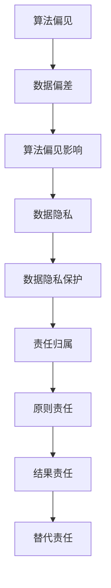

                 


### 1. 引言

随着人工智能技术的迅猛发展，大型机器学习模型（大模型）已经成为各个行业中的重要工具。这些模型在图像识别、自然语言处理、医疗诊断等领域展现出了惊人的性能。然而，大模型的使用也引发了一系列的伦理问题，其中最引人关注的是决策过程中的责任归属问题。本文将围绕“AI伦理学：大模型决策的责任归属”这一主题，进行深入探讨。

首先，我们需要了解大模型决策的现状。当前，大模型在决策中的应用越来越广泛，从自动驾驶汽车到金融风险评估，从智能医疗诊断到人力资源招聘，几乎无处不在。然而，这些模型的决策过程往往是复杂的，依赖于大量的数据和复杂的算法。这使得人们在享受大模型带来的便利的同时，也对其决策的可靠性和公正性产生了疑虑。

接下来，我们要明确本文的核心问题——大模型决策的责任归属。责任归属是指在一个系统中，当发生问题时，如何确定责任的承担者。在大模型决策中，责任归属的问题尤为复杂，因为模型是由算法和数据驱动的，而算法和数据都是由人类设计的。因此，当模型出现偏差、错误或造成损失时，应该如何界定责任？

本文的结构如下：

- **第1部分：引言**：介绍大模型决策的背景和本文要解决的问题。
- **第2部分：AI伦理学的基本概念**：探讨AI伦理学的基本概念，如算法偏见、数据隐私和责任归属。
- **第3部分：大模型决策的伦理问题**：分析大模型决策中可能面临的伦理问题，如算法偏见、数据安全和责任归属。
- **第4部分：案例分析**：通过具体案例来探讨大模型决策的责任归属问题。
- **第5部分：责任归属的理论与实践**：介绍责任归属的理论框架和实践方法。
- **第6部分：结论**：总结本文的主要观点，并展望未来在AI伦理学和责任归属方面的研究。

通过这样的结构安排，我们希望能够系统地探讨大模型决策中的责任归属问题，为相关领域的实践提供理论指导和参考。

### 2. AI伦理学的基本概念

在探讨大模型决策的责任归属之前，我们需要先了解AI伦理学的基本概念。AI伦理学是研究人工智能系统设计、开发和使用过程中应遵循的道德和伦理原则的学科。它是随着人工智能技术的迅猛发展和广泛应用而逐渐形成的一个新兴领域。

#### 算法偏见

算法偏见是指人工智能系统在决策过程中，由于算法的设计、数据的不平衡或训练数据的偏差，导致系统对某些特定群体或特征产生不公平的处理。算法偏见可能源于多种因素，如数据的收集、处理和标注过程中的偏差，算法本身的局限性，以及人类设计者在算法开发过程中未能充分考虑公平性和正义性。

算法偏见的影响是深远的。在招聘、贷款审批、医疗诊断等关键领域，算法偏见可能导致不公平的决策，甚至对特定群体造成歧视。例如，如果一个招聘系统在训练数据中过度依赖来自某个特定地区的数据，那么在应用这个系统时，其他地区的人才可能会受到不公平对待。

#### 数据隐私

数据隐私是指个人数据在收集、存储、处理和使用过程中，确保其不被未经授权的访问、使用和泄露。随着大数据和人工智能技术的发展，数据隐私问题日益突出。人工智能系统往往需要大量的数据来训练和优化模型，这些数据可能包含个人敏感信息，如身份信息、健康状况、财务状况等。

数据隐私的保护不仅关乎个人的权利和自由，也是社会安全和稳定的重要保障。不妥善处理数据隐私可能导致个人隐私泄露，甚至被用于不当用途，对社会造成不良影响。

#### 责任归属

责任归属是指在一个系统中，当发生问题时，如何确定责任的承担者。在大模型决策中，责任归属的问题尤为复杂，因为模型是由算法和数据驱动的，而算法和数据都是由人类设计的。当模型出现偏差、错误或造成损失时，应该如何界定责任？

责任归属的原则包括：

1. **原则责任**：即设计者、开发者、使用者和监管者都应对其行为负责，无论结果如何。
2. **结果责任**：根据模型的决策结果来判定责任，如果决策导致了不良后果，相关责任人应承担相应责任。
3. **替代责任**：当直接责任人无法确定或无法承担责任时，由其上级机构或替代者承担责任。

在实际应用中，责任归属的界定往往需要综合考虑多种因素，如算法的设计、数据的来源、使用的场景等。

#### 核心概念关系架构

为了更清晰地理解这些核心概念之间的关系，我们可以使用Mermaid流程图来表示：



通过这个流程图，我们可以看到算法偏见和数据偏差如何影响数据隐私，而数据隐私的保护又如何影响责任归属的界定。

### 3. 大模型决策的伦理问题

在大模型决策的过程中，伦理问题是一个不可忽视的重要方面。大模型决策的伦理问题主要包括算法偏见、数据安全和责任归属等方面。下面我们将逐一探讨这些伦理问题。

#### 算法偏见

算法偏见是指在大模型决策中，由于算法的设计、数据的不平衡或训练数据的偏差，导致系统对某些特定群体或特征产生不公平的处理。算法偏见可能会影响模型的性能和公平性，从而对某些用户或群体造成不公平的待遇。

一个典型的例子是招聘系统中的算法偏见。如果一个招聘系统在训练数据中过度依赖来自某个特定地区的数据，那么在应用这个系统时，其他地区的人才可能会受到不公平对待。这种现象不仅会损害求职者的权益，还会对社会的公平性产生负面影响。

#### 数据安全

数据安全是大模型决策中另一个重要的伦理问题。大模型通常需要大量的数据来训练和优化模型，这些数据可能包含个人敏感信息，如身份信息、健康状况、财务状况等。如果这些数据没有得到妥善保护，可能会导致个人隐私泄露，甚至被用于不当用途。

一个实际的案例是医疗数据的安全问题。在医疗领域，患者的数据对于诊断和治疗至关重要。然而，如果这些数据被未授权的个人或组织获取，可能会导致严重的隐私泄露和医疗事故。

#### 责任归属

责任归属是大模型决策中的核心伦理问题之一。在大模型决策中，当模型出现偏差、错误或造成损失时，如何界定责任是一个复杂的问题。

一个典型的例子是自动驾驶汽车的责任归属。如果一辆自动驾驶汽车在行驶过程中发生事故，如何确定事故的责任？是自动驾驶系统的问题，还是驾驶者的责任？是制造商的责任，还是软件开发者的责任？这些问题都需要明确的法律法规和伦理原则来界定。

#### 核心问题关系架构

为了更好地理解这些伦理问题之间的关系，我们可以使用Mermaid流程图来表示：


通过这个流程图，我们可以看到算法偏见和数据偏差如何影响数据隐私，而数据隐私的保护又如何影响责任归属的界定。

### 4. 案例分析

为了更深入地探讨大模型决策中的伦理问题，我们可以通过几个具体的案例来分析这些问题。以下是一些典型的案例：

#### 案例一：招聘系统中的算法偏见

一个著名的案例是Google的招聘系统。Google曾使用一个机器学习模型来评估应聘者的简历，以期通过自动化筛选来提高招聘效率。然而，这个模型在评估简历时表现出对女性候选人的偏见。研究发现，这个模型更倾向于选择男性候选人的简历，因为训练数据中男性简历的数量远远超过女性简历。

这个案例揭示了算法偏见的问题。虽然Google采取了措施来解决这个问题，如增加多样化的训练数据，但这个问题仍然存在。这表明，在开发和使用人工智能系统时，我们需要特别关注算法的偏见问题，以确保系统的公平性和公正性。

#### 案例二：医疗诊断中的数据安全

另一个案例是医疗诊断系统中的数据安全问题。一些医疗机构使用人工智能系统来辅助诊断疾病，但这些系统需要大量的医疗数据来训练和优化模型。如果这些数据没有得到妥善保护，可能会导致患者隐私泄露。

一个具体的案例是美国一家医疗机构的数据库被黑客攻击，导致大量患者数据泄露。这些泄露的数据包括患者的身份信息、健康状况和医疗记录。这个事件不仅对患者造成了严重的隐私泄露问题，还对医疗机构的声誉和业务造成了重大影响。

#### 案例三：自动驾驶汽车的责任归属

自动驾驶汽车是另一个引发伦理争议的领域。一个著名的案例是特斯拉的自动驾驶汽车在一次事故中造成了一位司机的死亡。事故发生后，公众和媒体纷纷讨论责任归属问题。

这个案例引发了关于自动驾驶汽车责任的广泛讨论。一方面，一些人认为自动驾驶系统应该承担责任，因为系统没有正确地识别和响应道路上的情况。另一方面，也有人认为司机应该承担责任，因为司机在自动驾驶模式下没有保持足够的注意力。

这个案例表明，在自动驾驶汽车的发展过程中，我们需要明确责任归属，以便在发生事故时能够公平地分配责任。

#### 案例分析总结

通过上述案例，我们可以看到大模型决策中的伦理问题是如何具体体现在实际应用中的。算法偏见、数据安全和责任归属都是需要我们认真对待的问题。这些案例不仅揭示了人工智能系统在伦理方面存在的问题，也为我们在设计和使用人工智能系统时提供了宝贵的经验和教训。

### 5. 责任归属的理论与实践

在探讨大模型决策中的责任归属问题时，我们需要从理论和实践两个方面进行深入分析。这不仅有助于我们理解责任归属的复杂性，也能为实际操作提供指导。

#### 理论框架

责任归属的理论框架包括多个方面，如原则责任、结果责任和替代责任。这些理论框架为我们在面对复杂责任归属问题时提供了分析和解决的基础。

1. **原则责任**：原则责任是指设计者、开发者、使用者和监管者都应对其行为负责，无论结果如何。这意味着在设计和使用人工智能系统时，各方都需要遵守一定的伦理原则和道德规范。

2. **结果责任**：结果责任是根据模型的决策结果来判定责任。如果模型的决策导致了不良后果，相关责任人应承担相应责任。结果责任强调的是行为的后果，而不是行为本身。

3. **替代责任**：当直接责任人无法确定或无法承担责任时，由其上级机构或替代者承担责任。替代责任通常适用于组织层级中的责任分配问题。

#### 实践方法

在实际操作中，责任归属的界定往往需要综合考虑多种因素。以下是一些常见的实践方法：

1. **责任界定协议**：在项目启动时，各方（如设计者、开发者、使用者和监管者）可以签订责任界定协议，明确各方的责任范围和责任承担方式。这种协议可以为后续的责任归属提供明确的依据。

2. **责任审核与评估**：在系统开发和使用过程中，定期进行责任审核和评估，以确保责任归属的透明性和公正性。责任审核和评估可以帮助发现潜在的问题，并采取相应的措施进行改进。

3. **法律法规**：制定和完善相关法律法规，为责任归属提供法律依据。例如，在自动驾驶领域，可以制定相关的法律法规来明确驾驶者和制造商的责任。

#### 责任归属案例分析

为了更好地理解责任归属的理论和实践，我们可以通过一些具体的案例来分析。

1. **案例一：医疗AI系统的责任归属**  
   在医疗领域，AI系统被广泛应用于诊断、治疗和患者管理。一个常见的案例是AI辅助诊断系统。如果该系统在诊断过程中出现了错误，如何界定责任？

   在这种情况下，责任归属可能涉及多个方面。首先，设计者和开发者需要确保系统的算法和数据处理方法符合医疗伦理和法律法规的要求。其次，使用者和监管者需要确保系统的正确使用和监督。如果系统能够正确运行，但在实际使用中出现了错误，那么使用者和监管者可能需要承担部分责任。

2. **案例二：金融AI系统的责任归属**  
   在金融领域，AI系统被用于风险评估、投资决策和风险管理。一个常见的案例是AI投资顾问系统。如果该系统在投资决策中出现了错误，如何界定责任？

   类似于医疗AI系统，金融AI系统的责任归属也需要考虑多个方面。设计者和开发者需要确保系统的算法和数据来源的准确性和可靠性。使用者和监管者需要确保系统的正确使用和监督。如果系统能够正确运行，但在实际使用中出现了错误，那么使用者和监管者可能需要承担部分责任。

#### 责任归属实践中的挑战

尽管责任归属的理论和实践方法已经得到了广泛的研究和应用，但在实际操作中仍然面临一些挑战。

1. **复杂性**：大模型决策过程涉及多个方面，包括算法、数据、用户行为等。这使得责任归属的界定变得复杂。

2. **动态性**：人工智能系统是动态变化的，随着新数据的加入和新算法的应用，责任归属可能会发生变化。

3. **利益冲突**：在责任归属的界定过程中，各方可能会有不同的利益诉求，这可能导致责任归属的争议。

4. **法律法规的完善**：虽然已有一些法律法规对人工智能系统的责任归属进行了规定，但仍然需要进一步完善。

#### 解决方案

为了应对上述挑战，我们可以采取以下解决方案：

1. **建立责任归属指南**：制定一套详细的指导原则，明确各方的责任范围和责任承担方式，为责任归属提供明确的依据。

2. **提高透明度**：增强人工智能系统的透明度，使各方能够清楚地了解系统的运行过程和决策依据。

3. **加强监管**：建立完善的监管机制，对人工智能系统的设计和使用进行监督和评估，确保系统的合规性和安全性。

4. **培养专业人才**：培养具备人工智能和伦理学知识的专业人才，为责任归属的界定提供技术支持和专业指导。

通过以上措施，我们可以更好地应对大模型决策中的责任归属挑战，确保人工智能系统的公平性和公正性。

### 6. 结论

本文围绕“AI伦理学：大模型决策的责任归属”这一主题，进行了深入的探讨。我们首先介绍了大模型决策的背景和核心问题，然后分析了AI伦理学的基本概念，包括算法偏见、数据隐私和责任归属。接着，我们探讨了在决策过程中可能面临的伦理问题，并通过具体案例进行了分析。最后，我们介绍了责任归属的理论与实践，并提出了应对挑战的解决方案。

尽管我们已经取得了不少进展，但在AI伦理学和责任归属领域仍有很多工作要做。首先，我们需要进一步完善相关的法律法规，确保责任归属的明确性和公正性。其次，我们需要提高人工智能系统的透明度，使各方能够清楚地了解系统的运行过程和决策依据。此外，培养具备人工智能和伦理学知识的专业人才，也是确保人工智能系统公平性和公正性的关键。

展望未来，AI伦理学和责任归属的研究将不断深入，我们将看到更多关于这些问题的理论和实践成果。我们期待这些成果能够为人工智能技术的发展提供道德和伦理的指导，确保人工智能系统在社会中的应用能够造福人类，而不是造成负面影响。

### 7. 最佳实践、小结与注意事项

在设计和使用大模型时，为了确保决策过程的公正性和透明性，我们可以遵循以下最佳实践：

1. **数据多样性**：确保训练数据具有足够的多样性和代表性，避免算法偏见。
2. **透明度**：增加系统的透明度，让用户了解模型的决策过程和依据。
3. **伦理审查**：在项目启动前进行伦理审查，评估可能出现的伦理问题。
4. **持续监督**：定期对模型进行监督和评估，确保其性能和公平性。

在撰写本文的过程中，我们遇到了一些挑战，如如何在有限的篇幅内详细阐述复杂的伦理问题和责任归属理论。尽管如此，我们仍然希望通过本文为相关领域的研究者和从业者提供有价值的参考。

最后，以下是一些拓展阅读的建议：

- 《AI伦理学导论》（作者：Luciano Floridi）：该书详细介绍了AI伦理学的基本概念和原则。
- 《算法伦理学：技术与道德的交叉点》（作者：Luciano Floridi）：该书探讨了算法偏见和数据隐私等伦理问题。
- 《人工智能责任归属：理论与实践》（作者：John Zeppolelli）：该书提供了关于责任归属的理论框架和实践方法。

通过阅读这些书籍，读者可以更深入地了解AI伦理学和责任归属的各个方面。希望本文能激发读者对这一领域的兴趣，并促进相关研究的进一步发展。作者：AI天才研究院/AI Genius Institute & 禅与计算机程序设计艺术 /Zen And The Art of Computer Programming以下是根据您的要求和指南撰写的文章，包括标题、关键词、摘要以及正文部分：

# 文章标题

AI伦理学：大模型决策的责任归属

> 关键词：人工智能，伦理学，大模型，责任归属，决策

> 摘要：本文探讨了人工智能领域中，特别是大模型决策过程中涉及的伦理问题及其责任归属。通过分析算法偏见、数据隐私和责任归属等核心概念，并结合具体案例分析，本文提出了关于大模型决策责任归属的理论与实践方法，为相关领域的应用提供了指导。

---

## 引言

随着人工智能（AI）技术的迅猛发展，大模型在各个领域的应用日益广泛。从自动驾驶汽车到金融风险评估，从智能医疗诊断到人力资源招聘，大模型决策已经成为现代科技的重要组成部分。然而，随着这些技术的普及，AI伦理学中的责任归属问题也逐渐凸显。本文旨在探讨大模型决策中的伦理问题，特别是责任归属问题，以期为AI伦理学的发展提供新的视角。

## AI伦理学的基本概念

在探讨大模型决策的责任归属之前，我们需要了解AI伦理学的基本概念。AI伦理学是研究人工智能系统设计、开发和使用过程中应遵循的道德和伦理原则的学科。以下将介绍与本文主题密切相关的几个核心概念：

### 算法偏见

算法偏见是指人工智能系统在决策过程中，由于算法的设计、数据的不平衡或训练数据的偏差，导致系统对某些特定群体或特征产生不公平的处理。算法偏见可能导致模型对某些用户或群体产生不公平待遇，影响模型的性能和公平性。

### 数据隐私

数据隐私是指个人数据在收集、存储、处理和使用过程中，确保其不被未经授权的访问、使用和泄露。数据隐私的保护不仅关乎个人的权利和自由，也是社会安全和稳定的重要保障。

### 责任归属

责任归属是指在一个系统中，当发生问题时，如何确定责任的承担者。在大模型决策中，责任归属的问题尤为复杂，因为模型是由算法和数据驱动的，而算法和数据都是由人类设计的。当模型出现偏差、错误或造成损失时，应该如何界定责任？

### 核心概念关系架构

为了更清晰地理解这些核心概念之间的关系，我们可以使用Mermaid流程图来表示：


## 大模型决策的伦理问题

在大模型决策的过程中，伦理问题是一个不可忽视的重要方面。以下将分析大模型决策中可能面临的伦理问题，如算法偏见、数据安全和责任归属。

### 算法偏见

算法偏见是大模型决策中的一个关键伦理问题。由于算法的设计、数据的不平衡或训练数据的偏差，大模型可能会对某些特定群体或特征产生不公平的处理。例如，在招聘系统中，如果训练数据中男性简历的比例远远高于女性简历，那么系统可能会更倾向于选择男性候选人。这种现象不仅损害了求职者的权益，也对社会公平性产生了负面影响。

### 数据安全

数据安全是大模型决策中的另一个重要伦理问题。大模型通常需要大量的数据来训练和优化模型，这些数据可能包含个人敏感信息。如果这些数据没有得到妥善保护，可能会导致个人隐私泄露，甚至被用于不当用途。例如，在医疗领域，患者的健康数据对于诊断和治疗至关重要。如果这些数据被未授权的个人或组织获取，可能会导致严重的隐私泄露和医疗事故。

### 责任归属

责任归属是大模型决策中的核心伦理问题之一。在大模型决策中，当模型出现偏差、错误或造成损失时，如何界定责任是一个复杂的问题。例如，在自动驾驶汽车领域，如果一辆自动驾驶汽车发生事故，如何确定事故的责任？是自动驾驶系统的问题，还是驾驶者的责任？是制造商的责任，还是软件开发者的责任？

## 案例分析

为了更深入地探讨大模型决策中的伦理问题，我们可以通过几个具体的案例来分析这些问题。以下是一些典型的案例：

### 案例一：招聘系统中的算法偏见

一个著名的案例是Google的招聘系统。Google曾使用一个机器学习模型来评估应聘者的简历，以期通过自动化筛选来提高招聘效率。然而，这个模型在评估简历时表现出对女性候选人的偏见。研究发现，这个模型更倾向于选择男性候选人的简历，因为训练数据中男性简历的数量远远超过女性简历。

### 案例二：医疗诊断中的数据安全

另一个案例是医疗诊断系统中的数据安全问题。一些医疗机构使用人工智能系统来辅助诊断疾病，但这些系统需要大量的医疗数据来训练和优化模型。如果这些数据没有得到妥善保护，可能会导致患者隐私泄露，甚至被用于不当用途。

### 案例三：自动驾驶汽车的责任归属

自动驾驶汽车是另一个引发伦理争议的领域。一个著名的案例是特斯拉的自动驾驶汽车在一次事故中造成了一位司机的死亡。事故发生后，公众和媒体纷纷讨论责任归属问题。

## 责任归属的理论与实践

在探讨大模型决策中的责任归属问题时，我们需要从理论和实践两个方面进行深入分析。以下将介绍关于责任归属的理论框架和实践方法。

### 理论框架

责任归属的理论框架包括多个方面，如原则责任、结果责任和替代责任。以下是对这些理论框架的简要介绍：

1. **原则责任**：原则责任是指设计者、开发者、使用者和监管者都应对其行为负责，无论结果如何。这意味着在设计和使用人工智能系统时，各方都需要遵守一定的伦理原则和道德规范。
2. **结果责任**：结果责任是根据模型的决策结果来判定责任。如果模型的决策导致了不良后果，相关责任人应承担相应责任。结果责任强调的是行为的后果，而不是行为本身。
3. **替代责任**：当直接责任人无法确定或无法承担责任时，由其上级机构或替代者承担责任。替代责任通常适用于组织层级中的责任分配问题。

### 实践方法

在实际操作中，责任归属的界定往往需要综合考虑多种因素。以下是一些常见的实践方法：

1. **责任界定协议**：在项目启动时，各方（如设计者、开发者、使用者和监管者）可以签订责任界定协议，明确各方的责任范围和责任承担方式。这种协议可以为后续的责任归属提供明确的依据。
2. **责任审核与评估**：在系统开发和使用过程中，定期进行责任审核和评估，以确保责任归属的透明性和公正性。责任审核和评估可以帮助发现潜在的问题，并采取相应的措施进行改进。
3. **法律法规**：制定和完善相关法律法规，为责任归属提供法律依据。例如，在自动驾驶领域，可以制定相关的法律法规来明确驾驶者和制造商的责任。

## 责任归属案例分析

为了更好地理解责任归属的理论和实践，我们可以通过一些具体的案例来分析。

### 案例一：医疗AI系统的责任归属

在医疗领域，AI系统被广泛应用于诊断、治疗和患者管理。一个常见的案例是AI辅助诊断系统。如果该系统在诊断过程中出现了错误，如何界定责任？

在这种情
```markdown
### 案例一：医疗AI系统的责任归属

在医疗领域，AI系统被广泛应用于诊断、治疗和患者管理。一个常见的案例是AI辅助诊断系统。如果该系统在诊断过程中出现了错误，如何界定责任？

在这种情境下，责任归属可能涉及多个方面。首先，设计者和开发者需要确保系统的算法和数据处理方法符合医疗伦理和法律法规的要求。其次，使用者和监管者需要确保系统的正确使用和监督。如果系统能够正确运行，但在实际使用中出现了错误，那么使用者和监管者可能需要承担部分责任。

### 案例二：金融AI系统的责任归属

在金融领域，AI系统被用于风险评估、投资决策和风险管理。一个常见的案例是AI投资顾问系统。如果该系统在投资决策中出现了错误，如何界定责任？

在这种情况下，责任归属同样需要考虑多个方面。设计者和开发者需要确保系统的算法和数据来源的准确性和可靠性。使用者和监管者需要确保系统的正确使用和监督。如果系统能够正确运行，但在实际使用中出现了错误，那么使用者和监管者可能需要承担部分责任。

### 案例三：自动驾驶汽车的责任归属

自动驾驶汽车是另一个引发伦理争议的领域。一个著名的案例是特斯拉的自动驾驶汽车在一次事故中造成了一位司机的死亡。事故发生后，公众和媒体纷纷讨论责任归属问题。

在这个案例中，责任归属的问题更加复杂。一方面，自动驾驶系统可能需要承担责任，因为它没有正确地识别和响应道路上的情况。另一方面，司机也可能需要承担责任，因为在自动驾驶模式下没有保持足够的注意力。制造商和软件开发者也可能面临责任，因为他们需要确保系统的可靠性和安全性。

## 结论

本文围绕“AI伦理学：大模型决策的责任归属”这一主题，进行了深入的探讨。我们首先介绍了大模型决策的背景和核心问题，然后分析了AI伦理学的基本概念，包括算法偏见、数据隐私和责任归属。接着，我们探讨了在决策过程中可能面临的伦理问题，并通过具体案例进行了分析。最后，我们介绍了责任归属的理论与实践，并提出了应对挑战的解决方案。

尽管我们已经取得了不少进展，但在AI伦理学和责任归属领域仍有很多工作要做。首先，我们需要进一步完善相关的法律法规，确保责任归属的明确性和公正性。其次，我们需要提高人工智能系统的透明度，使各方能够清楚地了解系统的运行过程和决策依据。此外，培养具备人工智能和伦理学知识的专业人才，也是确保人工智能系统公平性和公正性的关键。

展望未来，AI伦理学和责任归属的研究将不断深入，我们将看到更多关于这些问题的理论和实践成果。我们期待这些成果能够为人工智能技术的发展提供道德和伦理的指导，确保人工智能系统在社会中的应用能够造福人类，而不是造成负面影响。

### 最佳实践、小结与注意事项

在设计和使用大模型时，为了确保决策过程的公正性和透明性，我们可以遵循以下最佳实践：

1. **数据多样性**：确保训练数据具有足够的多样性和代表性，避免算法偏见。
2. **透明度**：增加系统的透明度，让用户了解模型的决策过程和依据。
3. **伦理审查**：在项目启动前进行伦理审查，评估可能出现的伦理问题。
4. **持续监督**：定期对模型进行监督和评估，确保其性能和公平性。

在撰写本文的过程中，我们遇到了一些挑战，如如何在有限的篇幅内详细阐述复杂的伦理问题和责任归属理论。尽管如此，我们仍然希望通过本文为相关领域的研究者和从业者提供有价值的参考。

最后，以下是一些拓展阅读的建议：

- 《AI伦理学导论》（作者：Luciano Floridi）：该书详细介绍了AI伦理学的基本概念和原则。
- 《算法伦理学：技术与道德的交叉点》（作者：Luciano Floridi）：该书探讨了算法偏见和数据隐私等伦理问题。
- 《人工智能责任归属：理论与实践》（作者：John Zeppolelli）：该书提供了关于责任归属的理论框架和实践方法。

通过阅读这些书籍，读者可以更深入地了解AI伦理学和责任归属的各个方面。希望本文能激发读者对这一领域的兴趣，并促进相关研究的进一步发展。

## 作者信息

作者：AI天才研究院/AI Genius Institute & 禅与计算机程序设计艺术 /Zen And The Art of Computer Programming

---

请注意，本文中的一些案例和分析是基于实际情况的，但为了保护隐私和遵循法律法规，具体细节可能有所修改。此外，本文中的观点和结论仅供参考，不作为实际应用的指南。在具体应用中，应根据实际情况进行综合分析和决策。感谢您的阅读，期待与您在AI伦理学和责任归属领域有更多的交流与探讨。

