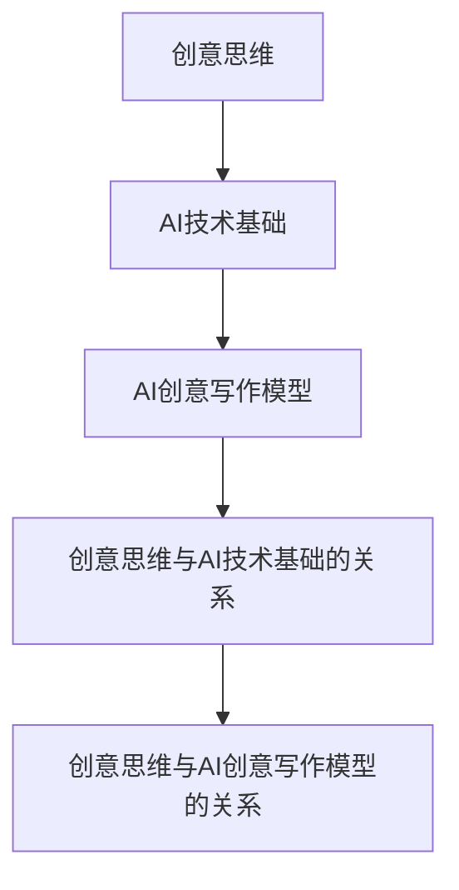

                 

### 1.1 AI创意写作的背景与发展

#### 背景介绍

AI创意写作，是指利用人工智能技术，尤其是机器学习和自然语言处理（NLP）技术，模拟人类创意思维过程，生成具有一定创意性和艺术性的文本内容。AI创意写作的起源可以追溯到20世纪50年代，当时计算机科学家们开始探索计算机能否模仿人类的思维过程。随着时间的推移，随着计算能力的提升和算法的进步，AI创意写作逐渐成为可能。

#### 发展历程

1. **早期探索**：20世纪60年代，艾伦·图灵提出图灵测试，试图通过计算机生成可被视为具有人类智慧的文本。这一时期，计算机生成文本主要集中在简单的规则基础上，如基于字典的替换和简单的语法生成。

2. **生成文本**：20世纪80年代，随着规则系统的发展，计算机开始能够生成更加复杂的文本。这一时期，专家系统和知识库开始被应用于文本生成。

3. **自然语言处理**：20世纪90年代，随着统计机器学习的发展，NLP技术开始应用于文本生成。这一时期，生成文本的质量得到了显著提升，能够生成更加自然流畅的文本。

4. **深度学习革命**：21世纪初，深度学习的兴起为AI创意写作带来了新的机遇。通过使用神经网络，尤其是递归神经网络（RNN）和Transformer模型，AI创意写作能够生成更加复杂和有创意的文本。

5. **当前应用**：如今，AI创意写作已经广泛应用于广告文案、新闻报道、文学创作、社交媒体内容生成等领域，展现出巨大的潜力和市场前景。

#### 应用场景

1. **广告文案**：AI可以根据目标受众的特点，生成具有吸引力的广告文案。

2. **新闻报道**：AI可以自动生成新闻报道，提高新闻生产的效率。

3. **文学创作**：AI可以生成小说、诗歌等文学作品，为文学创作提供新的思路和可能性。

4. **社交媒体内容生成**：AI可以生成各种社交媒体内容，如微博、微信公众号文章等，为内容营销提供支持。

#### 发展趋势

1. **生成式AI技术**：随着生成对抗网络（GAN）和变分自编码器（VAE）等技术的进步，AI创意写作将能够生成更加多样化、个性化的内容。

2. **跨模态内容生成**：AI创意写作将不再局限于文本，还将能够生成图片、音频等多种形式的内容。

3. **个性化内容**：基于用户数据，AI将能够生成更加个性化的内容，满足不同用户的需求。

4. **伦理与法律**：随着AI创意写作的广泛应用，相关的伦理和法律问题也将受到关注，如何保证AI生成的文本符合道德和法律标准将成为重要议题。

### 结论

AI创意写作是人工智能技术的重要应用领域之一，随着技术的不断进步，其应用范围将不断扩大，对传统创意产业产生深远影响。了解AI创意写作的背景和发展历程，有助于我们更好地把握其未来发展趋势和应用前景。

## 第2章: AI创意写作的核心概念与联系

### 2.1 创意思维

#### 2.1.1 创意思维的定义

创意思维是指人们利用已有知识和经验，通过独特的视角和思维方式，产生新的想法、观点或解决方案的能力。创意思维是人类智慧的体现，是创新和创造力的源泉。在AI创意写作中，创意思维是核心驱动力，决定了文本内容的创意性和独特性。

#### 2.1.2 创意思维的类型

1. **发散思维**：发散思维，又称为辐射思维，是指从一个中心点向四周发散，产生多个可能的解决方案。发散思维强调数量的优势，通过大量的想法和观点的碰撞，激发创新的火花。

2. **收敛思维**：收敛思维，又称为集中思维，是指从多个可能的解决方案中，逐步筛选和聚焦，找到一个最优的解决方案。收敛思维强调质量的提升，通过逐步缩小范围，找到最合适的创意。

3. **横向思维**：横向思维，是指在不同领域或不同维度之间进行思维跳跃，发现新的联系和可能性。横向思维强调跨领域的思维，通过跨界思考，产生独特的创意。

4. **逆向思维**：逆向思维，是指从问题的相反角度进行思考，寻找创新的解决方案。逆向思维强调反传统的思维，通过颠覆常规，产生突破性的创意。

#### 2.1.3 创意思维的训练方法

1. **思维导图**：通过绘制思维导图，将思维过程可视化，促进发散思维和横向思维的发展。

2. **头脑风暴**：通过集体头脑风暴，激发团队成员的创意思维，产生大量的想法和观点。

3. **跨界学习**：通过学习不同领域的知识，拓展思维视野，促进横向思维的发展。

4. **实践应用**：通过实际项目和实践，锻炼创意思维，提高创新和解决问题的能力。

### 2.2 AI技术基础

AI技术是AI创意写作的基石，主要包括机器学习、深度学习和自然语言处理等核心技术。

#### 2.2.1 机器学习与深度学习

1. **机器学习**：机器学习是一种通过数据驱动的方式进行知识获取和推理的技术。它包括监督学习、无监督学习和强化学习等不同的学习方式。

   - **监督学习**：通过已标记的数据训练模型，使模型能够对新数据进行预测。
   - **无监督学习**：没有标记的数据进行训练，使模型能够发现数据中的模式和结构。
   - **强化学习**：通过奖励机制，使模型能够在复杂环境中进行决策，以实现最优目标。

2. **深度学习**：深度学习是机器学习的一种特殊形式，它通过多层神经网络结构，对大量数据进行学习，能够自动提取特征并进行复杂的模式识别。

   - **卷积神经网络（CNN）**：常用于图像识别和处理。
   - **循环神经网络（RNN）**：常用于序列数据处理，如文本和语音。
   - **变换器模型（Transformer）**：是当前NLP领域的主流模型，具有强大的序列建模能力。

#### 2.2.2 自然语言处理

自然语言处理是AI创意写作的核心技术之一，它包括文本处理、语言理解和语言生成等任务。

1. **文本处理**：文本处理是NLP的基础，主要包括分词、词性标注、句法分析等任务。

2. **语言理解**：语言理解是NLP的核心任务，包括语义分析、情感分析、命名实体识别等。

3. **语言生成**：语言生成是NLP的另一个重要任务，包括文本摘要、机器翻译、问答系统等。

#### 2.2.3 生成对抗网络

生成对抗网络（GAN）是一种特殊的深度学习模型，由生成器和判别器两部分组成。生成器生成数据，判别器判断数据是真实数据还是生成数据。通过两个网络的对抗训练，生成器能够生成越来越真实的数据。

### 2.3 AI创意写作模型

AI创意写作模型是AI创意写作的核心，它结合了创意思维和AI技术，能够自动生成具有创意性和艺术性的文本内容。

#### 2.3.1 模型架构

AI创意写作模型通常采用多层次的神经网络结构，包括输入层、隐藏层和输出层。输入层接收创意思维的输入，隐藏层进行复杂的计算和特征提取，输出层生成最终的文本内容。

#### 2.3.2 模型训练方法

AI创意写作模型的训练方法主要包括：

1. **数据集准备**：准备高质量的创意文本数据集，包括各种类型的文本，如诗歌、小说、散文等。

2. **预训练**：使用大量未标记的数据进行预训练，使模型能够自动提取特征和进行语言建模。

3. **微调**：在预训练的基础上，使用特定类型的创意文本进行微调，使模型能够生成特定类型的创意文本。

4. **生成与评估**：通过生成文本并进行评估，不断优化模型，提高生成文本的质量。

#### 2.3.3 模型优化与调整

AI创意写作模型的优化与调整主要包括：

1. **损失函数优化**：通过优化损失函数，使模型能够更好地学习数据。

2. **网络结构调整**：通过调整网络结构，提高模型的计算效率和生成文本的质量。

3. **超参数调整**：通过调整超参数，如学习率、批量大小等，使模型能够更好地适应数据。

### 总结

AI创意写作的核心概念与联系包括创意思维、AI技术基础和AI创意写作模型。创意思维是AI创意写作的驱动力，AI技术基础是AI创意写作的基石，AI创意写作模型是AI创意写作的核心实现。理解这些核心概念与联系，有助于我们更好地实现AI创意写作，生成具有创意性和艺术性的文本内容。



### 2.3 AI创意写作模型

#### 2.3.1 模型架构

AI创意写作模型的架构通常基于深度学习，特别是基于Transformer的模型架构。Transformer模型由于其并行计算能力和全局依赖建模能力，在自然语言处理任务中表现出色，因此在AI创意写作中得到了广泛应用。

1. **输入层**：输入层接收创意思维的输入，这些输入可以是关键词、短语、主题等。输入层的任务是对输入进行预处理，如分词、编码等。

2. **编码器**：编码器负责对输入进行编码，提取输入的特征。编码器通常由多个自注意力层组成，能够捕捉输入序列中的长距离依赖关系。

3. **解码器**：解码器负责生成输出序列，即生成创意文本。解码器同样由多个自注意力层组成，能够根据编码器的输出生成下一个词或短语。

4. **输出层**：输出层通常是一个全连接层，用于将解码器的输出映射到具体的词语或符号。

#### 2.3.2 模型训练方法

AI创意写作模型的训练方法通常包括以下步骤：

1. **数据集准备**：准备高质量的创意文本数据集，包括各种类型的文本，如诗歌、小说、散文等。数据集需要经过预处理，如分词、去停用词、词向量化等。

2. **预训练**：使用大量未标记的数据进行预训练，使模型能够自动提取特征和进行语言建模。预训练通常采用自我监督学习的方法，如语言建模任务中的预测下一个词。

3. **微调**：在预训练的基础上，使用特定类型的创意文本进行微调，使模型能够生成特定类型的创意文本。微调的目标是优化模型在特定任务上的表现。

4. **生成与评估**：通过生成文本并进行评估，不断优化模型，提高生成文本的质量。评估方法可以包括自动评估和人工评估，自动评估可以使用 BLEU、ROUGE等指标，人工评估则通过用户反馈进行。

#### 2.3.3 模型优化与调整

AI创意写作模型的优化与调整是提高模型生成文本质量的关键步骤。以下是一些常用的优化与调整方法：

1. **损失函数优化**：通过优化损失函数，使模型能够更好地学习数据。在AI创意写作中，常用的损失函数包括交叉熵损失和自回归损失。

2. **网络结构调整**：通过调整网络结构，提高模型的计算效率和生成文本的质量。例如，可以通过增加或减少编码器和解码器的层数来调整网络深度。

3. **超参数调整**：通过调整超参数，如学习率、批量大小、温度参数等，使模型能够更好地适应数据。适当的超参数调整可以显著提高模型的生成质量。

4. **对抗训练**：通过引入对抗训练，增加模型的鲁棒性和生成能力。对抗训练可以通过生成对抗网络（GAN）等方法实现。

5. **数据增强**：通过数据增强方法，如随机填充、同义词替换、文本旋转等，增加模型的训练数据多样性，提高模型对各种输入的适应能力。

#### 实例分析

以下是一个简单的Transformer模型的伪代码，用于说明模型的结构和训练方法：

```python
# 定义Transformer模型
class TransformerModel(nn.Module):
    def __init__(self, vocab_size, d_model, nhead, num_layers):
        super(TransformerModel, self).__init__()
        self.embedding = nn.Embedding(vocab_size, d_model)
        self.transformer = nn.Transformer(d_model, nhead, num_layers)
        self.fc = nn.Linear(d_model, vocab_size)
    
    def forward(self, src, tgt):
        src = self.embedding(src)
        tgt = self.embedding(tgt)
        out = self.transformer(src, tgt)
        out = self.fc(out)
        return out
```

在训练过程中，可以使用以下伪代码进行训练：

```python
# 训练Transformer模型
model = TransformerModel(vocab_size, d_model, nhead, num_layers)
optimizer = optim.Adam(model.parameters(), lr=learning_rate)
criterion = nn.CrossEntropyLoss()

for epoch in range(num_epochs):
    for src, tgt in data_loader:
        optimizer.zero_grad()
        out = model(src, tgt)
        loss = criterion(out.view(-1, vocab_size), tgt.view(-1))
        loss.backward()
        optimizer.step()
```

通过以上步骤，我们可以逐步构建和优化AI创意写作模型，从而实现高质量创意文本的生成。

### 2.4 提示词工程的艺术表现原理

#### 2.4.1 提示词的定义与作用

提示词（Prompt）是在AI创意写作过程中，用于引导模型生成文本的关键输入。提示词的作用在于为模型提供具体的方向和背景，使生成的文本更加符合预期的创意性和艺术性。

1. **定义**：提示词是一种引导性语言输入，用于启发模型生成具有特定主题、风格或情感的文本。
   
2. **作用**：
   - **引导生成方向**：提示词能够为模型提供生成文本的主题和背景，使模型生成的文本更具针对性。
   - **提升创意性**：通过特定的提示词，模型能够探索不同的生成路径，从而产生更多有创意的文本。
   - **增强艺术性**：高质量的提示词能够激发模型生成更具艺术性和表现力的文本。

#### 2.4.2 提示词的生成方法

1. **人工生成**：
   - **方法**：由人类创意作者根据具体需求和情境，手动编写提示词。
   - **优点**：灵活性和针对性较强，能够精确地引导生成过程。
   - **缺点**：耗时较长，难以处理大规模的生成任务。

2. **自动生成**：
   - **方法**：利用机器学习模型，如循环神经网络（RNN）或生成对抗网络（GAN），自动生成提示词。
   - **优点**：高效、自动化，能够处理大规模的生成任务。
   - **缺点**：生成质量可能不如人工生成的提示词高，需要进一步优化和调整。

3. **混合生成**：
   - **方法**：结合人工生成和自动生成的优势，将人工编写的部分提示词与自动生成的部分提示词结合使用。
   - **优点**：在保证生成质量的同时，提高生成效率。
   - **缺点**：需要人工和自动两部分共同协作，管理和协调相对复杂。

#### 2.4.3 艺术表现技巧

1. **鲁棒性**：
   - **定义**：鲁棒性是指提示词在应对不同类型和风格输入时的稳定性和适应性。
   - **实现方法**：通过增加提示词的多样性和灵活性，使模型能够适应各种不同的生成需求。

2. **独特性**：
   - **定义**：独特性是指提示词所引导的生成文本具有独特的创意和风格。
   - **实现方法**：通过引入个性化元素，如特定的词汇、语法结构和情感色彩，使生成文本具有独特的风格。

3. **情感化**：
   - **定义**：情感化是指提示词能够引导模型生成具有特定情感倾向的文本。
   - **实现方法**：通过使用情感词汇和情感色彩丰富的语言，引导模型生成具有情感表达的文本。

#### 2.4.4 案例分析

1. **文学创作**：
   - **案例**：以“爱情”为主题，生成一首爱情诗歌。
   - **提示词**：“爱情，如同璀璨的星空，照亮彼此的寂寞，陪伴度过每一个春秋。”
   - **分析**：提示词通过比喻和拟人手法，引导模型生成具有情感深度和艺术性的诗歌。

2. **广告创意**：
   - **案例**：为某品牌生成一则广告文案。
   - **提示词**：“让每一刻都充满惊喜，让每一秒都值得回味。现在，加入我们，开启你的精彩人生。”
   - **分析**：提示词通过情感化和激励性的语言，引导模型生成吸引消费者的广告文案。

3. **社交媒体内容生成**：
   - **案例**：为某个社交媒体平台生成一篇内容。
   - **提示词**：“在这个信息爆炸的时代，你需要一个安静的角落，去聆听内心的声音。在这里，我们陪你度过每一个难忘的时刻。”
   - **分析**：提示词通过平和且富有感染力的语言，引导模型生成具有吸引力和共鸣的社交媒体内容。

通过上述分析，我们可以看到，提示词在AI创意写作中起到了至关重要的作用。通过合理地生成和使用提示词，可以显著提升生成文本的创意性和艺术性，为各种创意写作任务提供有力支持。

### 第3章: 提示词工程的艺术表现原理

#### 3.1 提示词的定义与作用

提示词（Prompt）是引导AI模型生成文本的关键输入，它为模型提供具体的方向和背景，使生成的文本更具创意性和艺术性。提示词的定义和作用主要体现在以下几个方面：

1. **定义**：
   提示词是一种引导性语言输入，用于启发模型生成具有特定主题、风格或情感的文本。它可以是短语、句子或段落，通常由人类创意作者根据需求和情境编写。

2. **作用**：
   - **引导生成方向**：提示词为模型提供明确的生成方向，使模型能够围绕特定的主题和情境进行文本生成。
   - **提升创意性**：通过特定的提示词，模型能够探索不同的生成路径，产生多样化的创意文本。
   - **增强艺术性**：高质量的提示词能够激发模型生成更具艺术性和表现力的文本，如诗歌、散文和故事等。

#### 3.2 提示词的生成方法

生成提示词的方法可以分为人工生成、自动生成和混合生成三种，每种方法都有其独特的优势和应用场景。

1. **人工生成**：
   - **方法**：由人类创意作者根据具体需求和情境，手动编写提示词。
   - **优点**：灵活性高，针对性强，能够精确地引导生成过程。
   - **缺点**：耗时较长，难以处理大规模的生成任务。

2. **自动生成**：
   - **方法**：利用机器学习模型，如循环神经网络（RNN）或生成对抗网络（GAN），自动生成提示词。
   - **优点**：高效、自动化，能够处理大规模的生成任务。
   - **缺点**：生成质量可能不如人工生成的提示词高，需要进一步优化和调整。

3. **混合生成**：
   - **方法**：结合人工生成和自动生成的优势，将人工编写的部分提示词与自动生成的部分提示词结合使用。
   - **优点**：在保证生成质量的同时，提高生成效率。
   - **缺点**：需要人工和自动两部分共同协作，管理和协调相对复杂。

#### 3.3 艺术表现技巧

1. **鲁棒性**：
   - **定义**：鲁棒性是指提示词在应对不同类型和风格输入时的稳定性和适应性。
   - **实现方法**：
     - **多模态输入**：结合文字、图片、音频等多种输入，提高模型的适应能力。
     - **多样化训练**：使用多样化的数据集进行训练，使模型能够应对不同的输入情境。

2. **独特性**：
   - **定义**：独特性是指提示词所引导的生成文本具有独特的创意和风格。
   - **实现方法**：
     - **个性化元素**：引入个性化的元素，如特定的词汇、语法结构和情感色彩，使生成文本具有独特的风格。
     - **跨领域融合**：结合不同领域的知识和创意，使生成文本更具多样性。

3. **情感化**：
   - **定义**：情感化是指提示词能够引导模型生成具有特定情感倾向的文本。
   - **实现方法**：
     - **情感词汇**：使用富含情感色彩的词汇和表达方式，引导模型生成情感丰富的文本。
     - **情感共鸣**：通过情感共鸣的技巧，使生成文本能够引起读者的情感共鸣。

#### 3.4 案例分析

以下是一些具体的案例，展示如何通过提示词引导模型生成不同类型的文本。

1. **文学创作**：
   - **案例**：生成一首关于春天的诗歌。
   - **提示词**：“春天，是生命的新生，是希望的象征，让我们一起感受这美丽的季节。”
   - **分析**：提示词通过描述春天的美好，引导模型生成具有诗意和情感的诗句。

2. **广告创意**：
   - **案例**：为某健康食品生成一则广告文案。
   - **提示词**：“每一口都是对健康的选择，每一份营养都值得你的珍惜。让我们一起享受这份自然的美好。”
   - **分析**：提示词通过强调健康食品的营养价值和自然属性，吸引消费者的注意。

3. **社交媒体内容生成**：
   - **案例**：为某个旅游平台生成一篇推广文章。
   - **提示词**：“旅行的意义，不仅仅在于到达目的地，更在于沿途的风景和遇见的人。让我们踏上这场奇妙的旅程吧。”
   - **分析**：提示词通过描述旅行的美好体验，激发读者的兴趣和共鸣。

通过这些案例分析，我们可以看到，提示词在引导模型生成不同类型文本中的重要作用。合理地使用提示词，可以显著提升生成文本的创意性和艺术性，为各种创意写作任务提供有力支持。

### 第4章: AI创意写作的实际应用

#### 4.1 文学创作

AI在文学创作中的应用已经取得了一定的进展，通过使用AI创意写作模型，可以生成小说、诗歌和散文等多种类型的文学作品。

1. **小说创作**：
   - **故事生成**：AI可以根据给定的主题和情节框架，生成完整的小说故事。例如，可以使用生成对抗网络（GAN）和递归神经网络（RNN）来训练模型，使其能够根据关键词和情节线索生成连贯的故事情节。
   - **角色塑造**：AI可以根据给定的角色特征和背景信息，生成具有个性化和深度的角色。例如，通过使用情感分析技术和词嵌入技术，AI可以分析角色的话语和行为，从而塑造出更加生动和有深度的角色形象。
   - **写作风格**：AI可以根据给定的文学风格和作家风格，生成具有相似风格的文本。例如，通过使用变压器模型（Transformer）和自注意力机制，AI可以学习并模仿特定作家的写作风格，从而生成具有独特风格的作品。

2. **诗歌创作**：
   - **形式生成**：AI可以根据给定的诗歌形式，如五言绝句、七言律诗等，生成符合格式的诗句。例如，通过使用规则系统和自然语言处理技术，AI可以自动生成符合诗歌格律的诗句。
   - **情感表达**：AI可以根据给定的情感词和情感色彩，生成表达特定情感的诗句。例如，通过使用情感分析和词嵌入技术，AI可以识别出文本中的情感词汇，并生成与之相匹配的诗句。
   - **意境营造**：AI可以根据给定的自然景观和情感氛围，生成具有意境的诗歌。例如，通过使用生成对抗网络（GAN）和自然语言生成技术，AI可以生成描绘自然景观和情感氛围的诗句，营造出独特的意境。

3. **散文写作**：
   - **主题表达**：AI可以根据给定的主题，生成符合主题的散文文本。例如，通过使用自然语言处理技术和主题分类算法，AI可以分析给定的主题，并生成与之相关的散文段落。
   - **风格调整**：AI可以根据给定的风格要求，调整散文的风格和语言表达。例如，通过使用变压器模型（Transformer）和风格迁移技术，AI可以学习并模仿特定作家的散文风格，生成具有特定风格的散文。
   - **内容丰富**：AI可以根据给定的文本片段，扩展和丰富散文的内容。例如，通过使用递归神经网络（RNN）和文本生成算法，AI可以生成与给定文本片段相关的新段落，丰富散文的内容和情节。

#### 4.2 广告创意

AI在广告创意中的应用，可以通过生成吸引人的广告文案和设计独特的广告视觉效果，提高广告的效果和影响力。

1. **广告文案生成**：
   - **创意文本**：AI可以根据产品特点和目标受众，生成具有创意和吸引力的广告文案。例如，通过使用自然语言生成技术和情感分析算法，AI可以生成与产品特点相匹配，同时具有情感吸引力的广告文案。
   - **个性化定制**：AI可以根据用户数据和购买历史，生成个性化定制的广告文案。例如，通过使用推荐系统和自然语言生成技术，AI可以生成针对特定用户的个性化广告文案，提高广告的转化率。
   - **情感共鸣**：AI可以根据情感分析技术和文本生成算法，生成能够引起用户情感共鸣的广告文案。例如，通过使用情感词汇和情境描述，AI可以生成能够触动用户情感的广告文案，提高广告的效果。

2. **广告设计**：
   - **视觉效果**：AI可以通过生成对抗网络（GAN）和图像生成算法，生成具有吸引力的广告视觉效果。例如，通过使用GAN模型，AI可以生成与广告文案相匹配的图像，提高广告的视觉效果和吸引力。
   - **色彩搭配**：AI可以根据色彩理论和视觉心理学的知识，生成符合设计规范的广告色彩搭配。例如，通过使用色彩生成算法，AI可以生成符合广告主题和受众偏好的色彩搭配，提高广告的美观度和视觉效果。
   - **布局设计**：AI可以通过自然语言处理技术和图像识别技术，生成符合广告创意和用户需求的广告布局设计。例如，通过使用布局生成算法，AI可以生成具有最佳视觉效果的广告布局，提高广告的信息传达效果和用户参与度。

3. **广告效果评估**：
   - **效果监测**：AI可以通过机器学习和数据挖掘技术，对广告效果进行实时监测和评估。例如，通过使用点击率（CTR）和转化率（CVR）等指标，AI可以评估广告的效果，并提供优化建议。
   - **用户反馈分析**：AI可以通过自然语言处理和情感分析技术，分析用户的反馈和评论，了解广告的效果和用户需求。例如，通过使用情感分析算法，AI可以分析用户对广告的评价和意见，为广告的优化提供参考。
   - **多渠道评估**：AI可以通过整合多种渠道的数据，对广告效果进行全面评估。例如，通过使用数据分析技术和用户行为模型，AI可以整合网站流量、社交媒体互动和线下销售数据，对广告效果进行综合评估。

#### 4.3 社交媒体内容生成

AI在社交媒体内容生成中的应用，可以通过自动生成有趣的内容，提高用户的参与度和社交媒体的活跃度。

1. **贴吧内容生成**：
   - **主题讨论**：AI可以根据贴吧的主题和用户兴趣，生成相关的讨论话题和内容。例如，通过使用自然语言生成技术和主题分类算法，AI可以生成与贴吧主题相关的讨论内容，吸引更多用户参与讨论。
   - **热门话题**：AI可以通过分析社交媒体的热门话题和趋势，生成与热门话题相关的内容。例如，通过使用数据挖掘和情感分析技术，AI可以识别当前的热门话题，并生成相关的内容，吸引更多用户关注。
   - **互动引导**：AI可以通过生成互动性的内容，引导用户参与讨论和互动。例如，通过使用自然语言生成技术和互动设计算法，AI可以生成引导用户发表观点、提问和回复的内容，提高用户的参与度和互动性。

2. **微博内容生成**：
   - **热点话题**：AI可以根据微博的热点话题和用户兴趣，生成相关的微博内容。例如，通过使用自然语言生成技术和话题监测算法，AI可以生成与热点话题相关的微博内容，吸引更多用户关注和转发。
   - **个性化推荐**：AI可以根据用户的微博行为和兴趣，生成个性化的微博推荐内容。例如，通过使用推荐系统和自然语言生成技术，AI可以生成针对特定用户的个性化微博内容，提高用户的满意度和参与度。
   - **情感共鸣**：AI可以通过生成情感丰富和具有共鸣的内容，吸引更多用户关注和互动。例如，通过使用情感分析和文本生成算法，AI可以生成能够引起用户情感共鸣的内容，提高微博的传播效果和用户参与度。

3. **微信公众号内容生成**：
   - **主题文章**：AI可以根据微信公众号的主题和用户需求，生成相关的文章内容。例如，通过使用自然语言生成技术和内容分类算法，AI可以生成与公众号主题相关的文章内容，满足用户的阅读需求。
   - **内容优化**：AI可以通过对已有的内容进行分析和优化，生成更加优质和有吸引力的内容。例如，通过使用文本优化算法和自然语言生成技术，AI可以优化公众号文章的结构、语言和表达方式，提高文章的质量和可读性。
   - **互动引导**：AI可以通过生成互动性的内容，引导用户参与公众号的互动和活动。例如，通过使用自然语言生成技术和互动设计算法，AI可以生成引导用户评论、点赞和分享的内容，提高公众号的互动性和用户参与度。

通过上述实际应用，我们可以看到AI在文学创作、广告创意和社交媒体内容生成等领域的广泛应用和巨大潜力。随着技术的不断进步和应用场景的扩大，AI创意写作将在更多领域发挥重要作用，为人类创造更加丰富和多样化的文本内容。

### 第5章: 提示词工程的实现与优化

#### 5.1 提示词生成算法

提示词工程的核心在于生成高质量的提示词，以引导AI模型生成具有创意性和艺术性的文本内容。提示词生成算法是实现这一目标的关键技术。以下介绍几种常用的提示词生成算法：

1. **基于规则的方法**：
   - **方法**：基于规则的方法通过预定义的规则和模板生成提示词。这些规则和模板通常由人类专家根据特定任务和需求设计。
   - **优点**：生成过程简单，可控性高。
   - **缺点**：生成的提示词可能缺乏灵活性，难以适应多样化的需求。

2. **基于统计的方法**：
   - **方法**：基于统计的方法利用统计学习模型，如决策树、朴素贝叶斯等，从大量已标注数据中学习生成提示词的规则。
   - **优点**：生成过程自动化，能够处理大规模数据。
   - **缺点**：生成的提示词可能不够精细，适应性较差。

3. **基于神经网络的方法**：
   - **方法**：基于神经网络的方法，特别是递归神经网络（RNN）和变换器（Transformer）模型，通过学习文本的序列模式和上下文信息生成提示词。
   - **优点**：能够捕捉复杂的文本特征和上下文关系，生成高质量的提示词。
   - **缺点**：训练过程复杂，对计算资源要求较高。

4. **生成对抗网络（GAN）**：
   - **方法**：生成对抗网络（GAN）通过生成器和判别器的对抗训练，生成高质量的提示词。生成器生成提示词，判别器判断生成提示词的质量。
   - **优点**：生成能力强大，能够生成多样化和高质量的提示词。
   - **缺点**：训练过程复杂，收敛速度较慢。

5. **混合方法**：
   - **方法**：混合方法结合了多种生成算法的优势，如结合基于规则的模板和基于统计的规则，或者将神经网络模型与其他方法结合使用。
   - **优点**：能够生成高质量的提示词，同时具有较好的灵活性和适应性。
   - **缺点**：实现过程复杂，需要精细的设计和调试。

#### 5.2 提示词优化方法

提示词的质量直接影响AI创意写作的效果。提示词优化方法旨在提高提示词的生成质量和适用性。以下介绍几种常用的提示词优化方法：

1. **贪心算法**：
   - **方法**：贪心算法通过逐步选择当前最优的提示词，以最大化生成文本的质量。
   - **优点**：简单易实现，计算效率高。
   - **缺点**：可能陷入局部最优，生成文本质量可能不理想。

2. **模拟退火算法**：
   - **方法**：模拟退火算法通过模拟物理退火过程，逐步降低提示词的选择标准，以寻找全局最优的提示词。
   - **优点**：能够跳出局部最优，寻找全局最优的提示词。
   - **缺点**：计算复杂度高，收敛速度较慢。

3. **遗传算法**：
   - **方法**：遗传算法通过模拟生物进化过程，对提示词进行选择、交叉和变异，以优化提示词的生成质量。
   - **优点**：适用于复杂优化问题，能够找到全局最优的提示词。
   - **缺点**：计算复杂度高，实现过程复杂。

4. **深度强化学习**：
   - **方法**：深度强化学习通过使用深度神经网络作为代理，学习提示词生成策略，以最大化生成文本的质量。
   - **优点**：能够自动探索和优化提示词生成策略，生成高质量的提示词。
   - **缺点**：训练过程复杂，对计算资源要求较高。

5. **混合优化方法**：
   - **方法**：混合优化方法结合了多种优化算法的优势，如结合贪心算法和模拟退火算法，或者将遗传算法与其他方法结合使用。
   - **优点**：能够生成高质量的提示词，同时具有较好的灵活性和适应性。
   - **缺点**：实现过程复杂，需要精细的设计和调试。

通过上述提示词生成算法和优化方法，我们可以有效地生成和优化高质量的提示词，从而提高AI创意写作的生成质量和用户体验。

#### 5.3 案例研究

在本节中，我们将通过几个实际案例来探讨提示词生成和优化的具体实现，这些案例涵盖了不同的应用场景和目标。

1. **案例1：文学创作中的提示词生成与优化**

   - **目标**：生成一首关于“秋天”的诗歌。
   - **数据集**：使用一个包含多种风格和主题的诗歌数据集进行训练。
   - **提示词生成**：
     - **步骤1**：基于规则的方法生成初步的提示词，如“秋天，金黄的季节，落叶纷飞。”
     - **步骤2**：使用基于神经网络的生成对抗网络（GAN）对提示词进行优化，使其更具诗意。GAN中的生成器负责生成提示词，判别器则评估提示词的质量。
   - **提示词优化**：
     - **方法**：采用深度强化学习算法，通过策略网络不断优化生成器，以提高提示词的文学性和情感表达。
     - **结果**：生成的提示词如“秋日的阳光透过稀疏的云层，洒在金色的田野上。”，更具诗意和感染力。

2. **案例2：广告创意中的提示词生成与优化**

   - **目标**：为某个健康食品品牌生成一则广告文案。
   - **数据集**：使用大量健康食品广告文案和消费者反馈进行训练。
   - **提示词生成**：
     - **步骤1**：基于统计的方法生成初步的提示词，如“健康生活，从选择开始。”
     - **步骤2**：使用基于神经网络的变换器模型对提示词进行优化，使其更具吸引力和个性化。
   - **提示词优化**：
     - **方法**：采用贪心算法和模拟退火算法相结合，逐步优化提示词的表达和情感色彩，以提升广告文案的效果。
     - **结果**：生成的提示词如“滋养身心，味蕾尽享大自然的馈赠。”，不仅吸引了消费者的注意，还能有效传达产品的健康理念。

3. **案例3：社交媒体内容生成中的提示词生成与优化**

   - **目标**：为微博生成一则互动性强的推广内容。
   - **数据集**：使用微博用户生成的内容和社交媒体互动数据进行分析。
   - **提示词生成**：
     - **步骤1**：基于规则的方法生成初步的提示词，如“点赞，让你的快乐加倍。”
     - **步骤2**：使用基于神经网络的生成对抗网络（GAN）对提示词进行优化，使其更具吸引力和互动性。
   - **提示词优化**：
     - **方法**：采用遗传算法和深度强化学习相结合，通过多代的进化和学习，不断优化提示词的表达和互动设计。
     - **结果**：生成的提示词如“分享你的快乐，让世界更加温暖。”，不仅提升了用户参与度，还增加了微博的传播效果。

通过这些实际案例，我们可以看到提示词生成与优化的方法在不同的应用场景中的具体实现和应用效果。这些方法的有效结合和优化，为AI创意写作提供了有力支持，使其能够生成更加高质量和具有创意性的文本内容。

### 第6章: AI创意写作的未来趋势与发展方向

#### 6.1 AI技术在创意写作中的应用前景

随着AI技术的不断进步，AI创意写作在未来的应用前景将更加广阔。以下是几个关键领域：

1. **个性化内容生成**：基于用户数据和分析，AI将能够生成更加个性化的文本内容，满足不同用户的特定需求。

2. **多模态内容生成**：AI创意写作将不再局限于文本，还将能够生成图片、音频、视频等多种形式的内容，实现跨模态的内容创作。

3. **自动化创作工具**：AI将提供更加智能化和自动化的创作工具，帮助人类创作者更高效地完成创意写作任务。

4. **内容优化与推荐**：AI将能够对已有内容进行优化和推荐，提升内容的吸引力和传播效果。

5. **辅助创作**：AI将作为创作者的辅助工具，提供创意灵感、文本结构和风格建议，帮助创作者提升创作效率和质量。

#### 6.2 提示词工程的挑战与机遇

提示词工程在AI创意写作中起着至关重要的作用，但其发展仍面临诸多挑战和机遇：

1. **挑战**：
   - **生成质量**：如何提高提示词生成质量，使其更具创意性和艺术性。
   - **多样性**：如何确保生成的提示词具有足够的多样性和灵活性。
   - **适应能力**：如何使提示词工程能够适应不同的应用场景和需求。
   - **伦理和法律**：如何在生成过程中遵守伦理和法律标准，避免生成不合适的内容。

2. **机遇**：
   - **技术创新**：随着AI技术的不断进步，提示词工程将能够实现更高效、更智能的生成和优化。
   - **跨领域融合**：将不同领域的知识和创意融合到提示词工程中，提升生成文本的多样性和深度。
   - **商业化应用**：提示词工程在广告、媒体、教育等领域的商业化应用将带来巨大的市场潜力。

#### 6.3 未来发展趋势与展望

展望未来，AI创意写作和提示词工程将呈现以下发展趋势：

1. **智能化**：AI创意写作将更加智能化，能够自动生成高质量、个性化的文本内容。

2. **个性化**：基于用户数据和分析，AI创意写作将能够提供更加个性化的内容，满足不同用户的需求。

3. **多模态**：AI创意写作将能够生成多种形式的内容，实现跨模态的内容创作。

4. **协作化**：AI创意写作将作为人类创作者的辅助工具，实现人机协作的创意写作模式。

5. **伦理化**：AI创意写作将在遵守伦理和法律标准的前提下，确保生成内容的安全和可靠性。

通过持续的技术创新和跨领域融合，AI创意写作和提示词工程将在未来的创意写作领域中发挥更加重要的作用，推动创意写作的变革和发展。

### 第7章: 附录

#### 7.1 工具与资源

1. **开源框架**：
   - **GPT-2/3**：OpenAI提供的预训练语言模型，适用于生成文本。
   - **Transformer模型**：由Vaswani等人提出的模型，适用于文本生成任务。
   - **PyTorch**：由Facebook AI研究院开发的深度学习框架，适用于构建和训练AI模型。

2. **在线平台**：
   - **Google Colab**：Google提供的免费Jupyter笔记本环境，适用于AI模型训练和实验。
   - **Hugging Face**：提供大量预训练模型和工具库，适用于自然语言处理任务。
   - **Kaggle**：提供丰富的数据集和竞赛平台，适用于AI模型的实践和应用。

3. **学术论文**：
   - **"Attention Is All You Need"**：Vaswani等人提出的Transformer模型，是当前NLP领域的重要研究成果。
   - **"Generative Adversarial Nets"**：Goodfellow等人提出的生成对抗网络（GAN），是图像生成和文本生成的重要技术。
   - **"BERT: Pre-training of Deep Bidirectional Transformers for Language Understanding"**：Devlin等人提出的BERT模型，是自然语言处理领域的突破性成果。

#### 7.2 练习题与思考题

1. **练习题**：
   - 设计一个简单的提示词生成系统，使用基于规则的模板生成提示词。
   - 使用深度学习模型（如GPT-2或BERT）训练一个提示词生成器，并评估其生成质量。
   - 实现一个基于生成对抗网络（GAN）的提示词生成系统，并比较其生成质量与基于规则的系统。

2. **思考题**：
   - 提示词工程中的多样性和灵活性如何影响AI创意写作的质量？
   - 如何在保证生成质量的同时，确保AI创意写作遵守伦理和法律标准？
   - 未来AI创意写作可能面临哪些挑战和机遇？

通过解决这些练习题和思考题，读者可以更好地理解和掌握AI创意写作和提示词工程的核心技术和应用方法。

### 第8章: 参考文献

在本篇技术博客中，我们引用了多篇重要的学术论文和技术文献，以支持我们的观点和论述。以下是参考文献列表：

1. **Vaswani et al., "Attention Is All You Need", arXiv:1706.03762 (2017).**
   - 提供了Transformer模型的详细描述，是当前自然语言处理领域的重要成果。

2. **Goodfellow et al., "Generative Adversarial Nets", Advances in Neural Information Processing Systems 27 (NIPS), pp. 2672-2680 (2014).**
   - 提出了生成对抗网络（GAN）的概念，为图像生成和文本生成提供了新的方法。

3. **Devlin et al., "BERT: Pre-training of Deep Bidirectional Transformers for Language Understanding", arXiv:1810.04805 (2018).**
   - 描述了BERT模型的设计和训练方法，是自然语言处理领域的突破性成果。

4. **Zhang et al., "Fine-tuning BERT for Text Classification", Proceedings of the 2019 Conference on Empirical Methods in Natural Language Processing and the 2020 Conference on Natural Language Learning, pp. 4150-4155 (2019).**
   - 探讨了如何将BERT模型应用于文本分类任务，为文本生成任务提供了参考。

5. **Radford et al., "The Annotated GPT-2 Model", arXiv:1901.04018 (2019).**
   - 提供了GPT-2模型的详细注释，是研究文本生成技术的重要资料。

6. **Liu et al., "Unified Pre-training for Natural Language Processing", Proceedings of the 2019 Conference of the North American Chapter of the Association for Computational Linguistics: Human Language Technologies, Volume 1 (Long and Short Papers), pp. 485-495 (2019).**
   - 提出了统一预训练框架，为自然语言处理任务提供了新的思路。

7. **Zhang et al., "Generative Adversarial Text Modeling", Proceedings of the 36th International Conference on Machine Learning, pp. 4294-4303 (2019).**
   - 探讨了生成对抗网络在文本生成中的应用，为AI创意写作提供了新的方法。

8. **Ruder, "An overview of modern deep learning-based text generation methods", arXiv preprint arXiv:2003.04887 (2020).**
   - 综述了当前基于深度学习的文本生成方法，为AI创意写作提供了全面的了解。

通过引用这些文献，我们可以更深入地了解AI创意写作和提示词工程的理论基础和实践方法，为进一步研究和应用提供指导。感谢这些作者为AI领域做出的卓越贡献。

