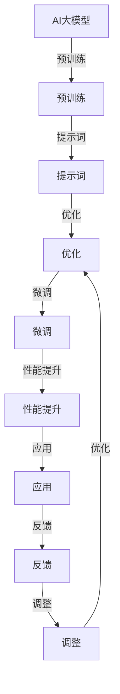

                 

### 理解书名

《AI大模型在提示词优化中的应用》这本书的标题已经为我们明确了两个核心主题：AI大模型和提示词优化。让我们首先深入理解这两个概念，然后将其有机地结合起来。

**AI大模型**指的是使用大量数据和强大的计算能力训练出来的复杂机器学习模型。这些模型在自然语言处理（NLP）、计算机视觉（CV）、语音识别等多个领域表现出色。它们之所以称为“大模型”，是因为它们的参数数量通常达到数十亿甚至数万亿，这使得它们能够捕捉到极其复杂的模式和关系。

**提示词优化**则是指通过选择和调整提示词，以提高模型在特定任务上的性能。在AI大模型的训练和应用中，提示词（prompt）是一个关键因素，它可以引导模型理解任务的背景信息，从而更准确地生成输出。有效的提示词优化可以显著提升模型的表现，这在实际应用中具有重要意义。

书名中的“应用”一词则强调了本书的实践导向。它不仅介绍AI大模型和提示词优化的基本概念，还通过具体的案例展示了这些技术在现实世界中的实际应用，帮助读者理解和掌握AI大模型在提示词优化中的潜力。

接下来，我们将进一步探讨AI大模型和提示词优化的原理，为后续内容的展开打下坚实的基础。

### 关键词

AI大模型、提示词优化、机器学习、自然语言处理、计算机视觉、神经网络、模型训练、算法优化、数据分析、性能提升、应用实践。

### 摘要

本文旨在探讨AI大模型在提示词优化中的应用，全面解析这一技术的原理、方法及其实际应用。首先，我们将介绍AI大模型的基本概念，包括其定义、发展历程和应用领域，帮助读者建立对AI大模型的整体认识。接着，文章将深入解析提示词优化的原理和方法，通过具体案例展示如何在实际应用中优化提示词，以提高模型性能。

本文还将通过Mermaid流程图详细展示AI大模型中的关键概念和联系，帮助读者更好地理解这些技术。同时，文章将包含核心算法原理讲解、数学模型和公式，以及具体的伪代码示例，以增强文章的深度和实用性。最后，通过多个实际案例，我们将详细解读AI大模型在提示词优化中的应用，提供最佳实践建议，总结未来研究方向。希望本文能够为读者提供有价值的见解，助力其在AI大模型和提示词优化领域的深入研究和实践。

### 第一部分：AI大模型基础

#### 第1章：AI大模型概述

**1.1 AI大模型的基本概念**

AI大模型是指参数数量巨大、训练数据规模庞大的复杂机器学习模型。这些模型通常基于深度学习技术，特别是神经网络架构，通过大规模并行计算和分布式训练来提升其性能。AI大模型的出现标志着机器学习领域的一个重要里程碑，它们在自然语言处理（NLP）、计算机视觉（CV）、语音识别、推荐系统等多个领域取得了显著的进展。

AI大模型的核心特点包括：

- **高参数数量**：通常达到数十亿甚至数万亿的参数量，这使得模型能够捕捉到极其复杂的模式和关系。
- **大规模训练数据**：训练数据规模大，通常在TB甚至PB级别，这为模型提供了丰富的信息来源，有助于提升模型的泛化能力。
- **强大的计算能力**：AI大模型的训练和推断需要高效的计算资源和算法优化，如GPU并行计算和分布式训练策略。

**1.2 AI大模型的重要性**

AI大模型在当前科技和社会发展中扮演着重要角色，其重要性体现在以下几个方面：

- **推动技术进步**：AI大模型在多个技术领域取得了突破性进展，如语音识别、图像识别、自然语言处理等，为人工智能的发展注入了新的活力。
- **提升生产力**：AI大模型能够自动化处理大量复杂的任务，提高工作效率，降低人力成本，推动产业升级。
- **改善生活质量**：AI大模型在医疗、教育、交通等领域的应用，显著提升了人们的生活质量，为人类带来了诸多便利。
- **推动科学发现**：AI大模型在科学研究中的应用，帮助科学家发现新的规律和知识，推动了科学的发展。

**1.3 AI大模型的发展历程**

AI大模型的发展历程可以追溯到20世纪80年代的神经网络研究。以下是关键的发展节点：

- **1980年代**：反向传播算法的提出，使神经网络开始用于大规模数据训练。
- **1990年代**：深度学习的概念被提出，卷积神经网络（CNN）和递归神经网络（RNN）等模型逐渐成熟。
- **2000年代**：随着计算能力的提升，深度学习在图像识别、语音识别等领域取得了重要突破。
- **2010年代**：基于GPU的分布式训练技术使得AI大模型成为可能，BERT、GPT等大模型相继问世。
- **2020年代**：AI大模型在各个领域得到了广泛应用，如自动驾驶、智能助手、推荐系统等。

**总结**

AI大模型作为现代人工智能技术的核心，具有巨大的发展潜力和应用价值。通过理解其基本概念、重要性以及发展历程，读者可以更好地把握这一领域的最新动态和趋势。在接下来的章节中，我们将进一步探讨AI大模型的具体应用和实现方法，帮助读者深入掌握这一技术。

#### 第2章：AI大模型的发展历程

**2.1 早期AI模型**

人工智能（AI）的概念最早可以追溯到20世纪50年代。当时，计算机科学家和数学家开始探索如何使计算机具备智能行为，例如理解语言、识别图像和做出决策。早期的AI模型主要集中在符号逻辑和知识表示领域。代表性的模型包括逻辑推理机、专家系统和产生式规则系统。这些模型通过编码明确的规则和关系，试图模拟人类的思维方式。

然而，这些早期的AI模型存在几个局限。首先，它们的规则库需要人工编写，这使得模型难以扩展和适应新任务。其次，这些模型在处理复杂问题和不确定信息时效果不佳。因此，随着计算能力的限制和算法的不足，早期的AI研究在20世纪80年代开始面临挑战。

**2.2 深度学习与神经网络**

20世纪80年代，反向传播（Backpropagation）算法的提出，为神经网络的发展带来了新的契机。反向传播算法是一种用于训练神经网络的优化算法，通过反向传播误差信息来更新网络参数，从而逐步减小误差。这一算法的发明标志着深度学习时代的开始。

在20世纪90年代，神经网络得到了进一步的发展。特别是卷积神经网络（CNN）和递归神经网络（RNN）的出现，使神经网络在图像识别、语音识别和自然语言处理等领域取得了突破性进展。CNN通过卷积操作和池化操作，有效地提取图像特征，RNN则通过循环结构处理序列数据，使得模型能够记忆和利用过去的信息。

然而，深度学习在20世纪90年代的进展并不顺利。由于计算资源的限制，深度学习模型的训练速度慢且效果不佳。此外，训练数据的匮乏和标注成本的高昂也限制了深度学习的发展。

**2.3 AI大模型的崛起**

随着计算能力的提升和大数据技术的进步，深度学习在21世纪初迎来了新的发展契机。特别是GPU（图形处理器）的引入，使得深度学习模型的训练速度大大提升。2006年，Geoffrey Hinton等人提出了深度置信网络（Deep Belief Network），这是早期的大规模深度学习模型之一。

2013年，Google的Inception模型在ImageNet图像识别挑战中取得了突破性成绩，使得深度学习在计算机视觉领域得到了广泛应用。随后，Google的BERT模型和OpenAI的GPT模型相继问世，这些模型具有数十亿甚至数万亿的参数，成为现代AI大模型的代表。

AI大模型的崛起不仅依赖于计算能力和数据量的提升，还依赖于新的训练策略和算法。例如，预训练加微调（Pre-training and Fine-tuning）策略使得模型可以在大规模数据集上进行预训练，然后在特定任务上进行微调，从而显著提升模型的性能。

**2.4 当前AI大模型的应用**

当前，AI大模型在多个领域得到了广泛应用，包括自然语言处理、计算机视觉、推荐系统、语音识别等。以下是一些代表性的应用案例：

- **自然语言处理（NLP）**：BERT、GPT等大模型在文本分类、问答系统、机器翻译等任务上表现出色，使得NLP应用的准确性和效果大幅提升。
- **计算机视觉（CV）**：Inception、ResNet等大模型在图像分类、目标检测、图像生成等任务中取得了显著突破，推动了CV技术的发展。
- **推荐系统**：深度学习模型通过分析用户行为数据，为用户提供个性化的推荐，提升了用户体验和商业价值。
- **语音识别**：基于深度学习的大模型在语音识别中表现出色，使得语音助手和智能语音交互系统得到了广泛应用。

**总结**

AI大模型的发展历程充满了挑战和突破。从早期的符号逻辑和知识表示，到现代的深度学习和大规模模型，AI大模型不断推动着人工智能技术的发展。通过理解AI大模型的发展历程，我们可以更好地把握其未来发展趋势和潜在应用，为AI技术的发展贡献力量。

#### 第3章：AI大模型的应用领域

AI大模型在自然语言处理（NLP）、计算机视觉（CV）和推荐系统等多个领域展现出了巨大的应用潜力。以下将分别探讨AI大模型在这三个领域的应用情况，并通过具体案例展示其技术成果。

**3.1 自然语言处理（NLP）**

自然语言处理是AI大模型最早取得显著突破的领域之一。BERT（Bidirectional Encoder Representations from Transformers）和GPT（Generative Pre-trained Transformer）等模型在文本分类、问答系统、机器翻译和文本生成等任务中表现卓越。

- **文本分类**：BERT模型在多个文本分类任务中取得了SOTA（State-of-the-Art）成绩。例如，它在GLUE（General Language Understanding Evaluation）数据集上的多个子任务中表现出色，使文本分类的准确率显著提升。
- **问答系统**：OpenAI的GPT-3在问答系统中的表现令人瞩目。通过少量的示例，GPT-3能够生成高质量的回答，甚至模仿人类对话的流畅性和自然度。
- **机器翻译**：Transformer模型及其变种在机器翻译中取得了突破性进展。BERT在低资源语言对的翻译任务中表现出色，使得机器翻译系统的效果大幅提升。
- **文本生成**：GPT模型在自动写作、摘要生成和对话系统等领域得到了广泛应用。通过预训练和微调，GPT能够生成高质量的文本，满足各种应用需求。

**3.2 计算机视觉（CV）**

计算机视觉是另一个AI大模型取得显著进展的领域。卷积神经网络（CNN）及其变种在图像分类、目标检测、图像生成和视频分析等方面取得了重要成果。

- **图像分类**：Inception和ResNet等模型在ImageNet图像分类挑战中取得了优异的成绩，使得图像分类的准确率达到了前所未有的高度。
- **目标检测**：基于深度学习的目标检测算法，如Faster R-CNN和YOLO，在PASCAL VOC和COCO等数据集上取得了SOTA成绩，推动了自动驾驶、智能监控等应用的发展。
- **图像生成**：生成对抗网络（GAN）和变分自编码器（VAE）等模型在图像生成任务中表现出色。通过训练，这些模型能够生成高质量的图像，满足艺术创作、数据增强和隐私保护等需求。
- **视频分析**：AI大模型在视频分析中展现了强大的能力，如动作识别、视频分割和视频生成。通过结合CNN和RNN，模型能够从视频中提取关键信息，实现实时分析和监控。

**3.3 推荐系统**

推荐系统是AI大模型在商业应用中的重要领域。通过分析用户行为数据，AI大模型能够为用户提供个性化的推荐，提高用户体验和商业价值。

- **商品推荐**：基于深度学习的大模型在电商平台的商品推荐中得到了广泛应用。这些模型能够分析用户的浏览、购买和评价行为，为用户推荐他们可能感兴趣的商品。
- **新闻推荐**：AI大模型在新闻推荐系统中发挥了重要作用。通过分析用户的阅读历史和偏好，模型能够为用户推荐个性化的新闻内容，提升用户的阅读体验。
- **音乐推荐**：深度学习模型在音乐推荐中表现出色，通过分析用户的听歌历史和偏好，模型能够推荐用户可能喜欢的音乐，提高用户粘性和满意度。

**3.4 其他应用领域**

除了自然语言处理、计算机视觉和推荐系统，AI大模型还在其他领域得到了广泛应用。

- **医疗健康**：AI大模型在医学图像分析、基因测序和药物研发等领域取得了显著进展。通过分析大量的医学数据，模型能够帮助医生做出更准确的诊断和治疗方案。
- **金融科技**：AI大模型在金融领域的应用包括欺诈检测、风险评估和量化交易。这些模型通过分析大量的交易数据和用户行为，能够帮助金融机构提高风险管理能力。
- **智能制造**：AI大模型在智能制造中的应用包括生产规划、设备维护和质量检测。通过实时监控和分析生产数据，模型能够优化生产流程，提高生产效率。

**总结**

AI大模型在自然语言处理、计算机视觉和推荐系统等领域的广泛应用，展示了其在解决复杂任务中的巨大潜力。通过具体的案例，我们可以看到AI大模型在这些领域中的卓越表现和技术突破。随着AI大模型技术的不断发展和应用场景的不断拓展，未来AI大模型将在更多领域发挥重要作用，为人类社会带来更多创新和变革。

#### 第4章：核心概念与联系

为了更好地理解AI大模型在提示词优化中的应用，我们需要梳理其中的核心概念及其相互之间的联系。通过一个Mermaid流程图，我们可以清晰地展示这些概念之间的关系架构。

首先，定义几个关键概念：

- **AI大模型**：一个具有数十亿或数万亿参数的复杂机器学习模型，如BERT、GPT等。
- **提示词**：用于引导模型理解任务背景信息的文本输入。
- **优化**：通过调整提示词，提高模型在特定任务上的性能。
- **预训练**：在大量通用数据集上训练模型，使其具备一定的语言理解和生成能力。
- **微调**：在特定任务数据集上对预训练模型进行调整，以提高任务性能。

下面是关键概念及其联系的Mermaid流程图：



**核心概念之间的关系解析：**

1. **AI大模型**：AI大模型是整个流程的核心，其强大的参数量和计算能力使其能够处理复杂的任务。
2. **预训练**：预训练是在大量通用数据集上对AI大模型进行训练，使其具备基础的语言理解和生成能力。这一阶段使用了大量无标签数据，通过自我监督学习等方法进行。
3. **提示词**：提示词是模型理解和执行特定任务的关键输入。通过选择和优化提示词，可以引导模型更好地理解任务的背景信息，从而提高模型在任务上的性能。
4. **优化**：优化过程是通过调整提示词来提升模型在特定任务上的表现。这可以通过多种方法实现，如调整提示词的长度、内容或结构等。
5. **微调**：微调是在特定任务数据集上对预训练模型进行调整，以进一步提高模型在任务上的性能。微调通常使用有标签的数据，通过对模型进行精细化训练来实现。
6. **性能提升**：通过优化和微调，模型在特定任务上的性能得到显著提升，从而实现更准确和高效的预测、生成等任务。
7. **应用**：性能提升后的模型可以应用于实际场景，如问答系统、文本生成、图像识别等。
8. **反馈**：应用场景中的反馈可以帮助我们进一步了解模型在实际任务中的表现，从而进行进一步的优化和调整。
9. **调整**：根据反馈，我们可以对提示词或模型进行相应的调整，以实现更优化的性能。

通过这个Mermaid流程图，我们可以清晰地看到AI大模型在提示词优化中的核心概念及其相互之间的联系。这为后续的讨论和分析提供了一个结构化的基础，有助于我们深入理解AI大模型在提示词优化中的应用机制。

### 第二部分：提示词优化

#### 第5章：提示词优化的原理

**5.1 提示词优化的基本概念**

提示词优化是指通过选择和调整提示词来提高AI大模型在特定任务上的性能。在AI大模型的训练和应用中，提示词（prompt）是一个关键因素，它不仅为模型提供了任务的背景信息，还直接影响模型的理解和生成结果。有效的提示词优化能够显著提升模型的表现，这对于实现高精度的任务结果至关重要。

提示词优化的基本概念包括以下几个方面：

- **提示词的选择**：选择合适的提示词是优化过程的第一步。提示词应当包含与任务相关的关键信息，同时避免冗余和无关信息，以提高模型的关注度和理解度。
- **提示词的组合**：通过组合多个提示词，可以提供更丰富和多样化的任务背景信息，从而增强模型对任务的理解能力。合理的组合策略能够提高模型的泛化能力。
- **提示词的调整**：在实际应用中，需要对提示词进行不断调整，以适应不同任务的需求和环境。调整策略包括长度、内容、结构等，通过这些调整，可以使模型在多样化任务中保持高性能。

**5.2 提示词优化的重要性**

提示词优化在AI大模型应用中的重要性体现在以下几个方面：

- **提高任务性能**：有效的提示词优化能够提高模型在特定任务上的性能，例如在文本生成、问答系统和图像识别中实现更准确的结果。
- **增强模型的适应性**：通过优化提示词，模型可以更好地适应不同的任务和数据集，提高其泛化能力和鲁棒性。
- **降低计算成本**：合理的提示词可以减少模型训练和推断所需的计算资源，降低训练时间和成本。
- **提升用户体验**：在应用场景中，优化的提示词能够提供更自然、准确和符合用户需求的输出，从而提升用户体验。

**5.3 提示词优化的发展趋势**

随着AI大模型技术的不断进步和应用场景的扩展，提示词优化的方法和技术也在不断发展。以下是一些当前的发展趋势：

- **多模态提示词**：结合文本、图像、音频等多种模态信息，实现更丰富的任务背景信息，提高模型的多模态理解和生成能力。
- **自适应提示词**：通过机器学习和强化学习等技术，实现自适应的提示词生成和调整，使模型能够在多样化场景中保持高性能。
- **小样本学习**：在数据稀缺或数据标签困难的情况下，通过优化提示词，实现小样本学习，提高模型的泛化能力和鲁棒性。
- **模型压缩**：通过提示词优化，结合模型压缩技术，实现高效、低成本的AI大模型应用，满足实时性和移动设备的需求。

**总结**

提示词优化是AI大模型应用中的一个关键环节，通过合理的选择和调整提示词，可以提高模型在特定任务上的性能和适应性。理解提示词优化的基本概念和重要性，有助于我们更好地利用AI大模型的技术潜力，实现更高效和准确的应用。在接下来的章节中，我们将进一步探讨提示词优化的具体方法和实践案例。

#### 第6章：提示词优化的方法

**6.1 提示词选择策略**

提示词选择是提示词优化的第一步，其核心在于选择与任务高度相关的关键字或短语，以便引导AI大模型更好地理解和执行任务。以下是一些常用的提示词选择策略：

1. **关键词提取**：通过自然语言处理技术，从文本数据中提取与任务相关的关键词。这种方法可以利用词频统计、TF-IDF（Term Frequency-Inverse Document Frequency）和主题模型等方法，提高关键词的代表性。
2. **语义相似性**：利用语义相似性算法，如Word2Vec、BERT等，找出与任务相关的语义相似的词或短语。这种方法能够捕捉到词汇之间的深层次关联，使提示词更具针对性。
3. **领域知识**：结合领域知识库，如医疗知识图谱、法律术语库等，选择与任务相关的专业术语和表达。这种方法适用于特定领域的应用，能够提供更加专业和准确的提示词。

**6.2 提示词组合优化**

单一提示词可能无法提供足够丰富的信息，因此通过组合多个提示词可以增强模型的理解能力。以下是一些提示词组合优化的方法：

1. **基于规则的组合**：根据任务需求，制定组合提示词的规则。例如，对于文本生成任务，可以组合目标文本的类型、主题和情感等维度。
2. **基于机器学习的组合**：利用机器学习算法，如决策树、支持向量机（SVM）和神经网络等，自动学习出最佳的提示词组合策略。这种方法能够根据大量数据训练出优化的组合规则。
3. **基于频率的优化**：通过分析大量训练数据，找出出现频率高的提示词组合，并根据频率和效果对其进行优化。这种方法能够识别出高效的提示词组合模式。

**6.3 提示词权重调整**

提示词权重调整是指根据提示词在任务中的重要性，动态调整其在模型输入中的权重。以下是一些常见的权重调整方法：

1. **基于TF-IDF的权重调整**：利用TF-IDF算法，对提示词进行权重分配。高频但重要程度低的词可以降低权重，而低频但重要程度高的词可以增加权重。
2. **基于领域知识的权重调整**：结合领域知识库，对提示词进行重要性评估，并根据评估结果调整权重。这种方法能够确保领域关键信息在模型输入中占据重要位置。
3. **基于模型的权重调整**：通过训练模型，学习出提示词在任务中的实际重要性，并据此调整权重。这种方法能够根据任务需求自适应调整提示词权重。

**6.4 提示词优化技巧**

1. **长度控制**：提示词长度应适中，过长可能导致模型难以理解，过短则可能缺乏关键信息。通常，长度在5-15个单词之间较为合适。
2. **语境适应性**：提示词应能够适应不同的上下文环境，避免出现语义模糊或冲突。例如，在对话系统中，提示词应能够根据用户的输入动态调整。
3. **多样性**：提示词应具有一定的多样性，以避免模型在单一提示词下产生过度拟合。通过引入变体和同义词，可以增加提示词的多样性。
4. **实时调整**：在实际应用中，根据任务需求和模型表现，实时调整提示词。这种方法能够使模型在动态环境中保持高性能。

**总结**

提示词优化是提高AI大模型性能的关键环节，通过合理的提示词选择、组合和权重调整，可以显著提升模型在特定任务上的表现。选择合适的策略和技巧，结合领域知识和模型特性，是实现有效提示词优化的重要途径。在接下来的章节中，我们将通过具体案例展示提示词优化的实际应用，进一步探讨其在现实世界中的效果和挑战。

#### 第7章：提示词优化的实践

**7.1 实践案例1：问答系统**

**应用场景**：开发一个问答系统，能够根据用户的问题生成准确的答案。

**开发环境搭建**： 
- 语言：Python
- 框架：TensorFlow、HuggingFace Transformers
- 数据集：SQuAD（Stanford Question Answering Dataset）

**源代码实现**

```python
from transformers import AutoTokenizer, AutoModelForQuestionAnswering
import torch

# 初始化模型和 tokenizer
tokenizer = AutoTokenizer.from_pretrained("bert-base-uncased")
model = AutoModelForQuestionAnswering.from_pretrained("bert-base-uncased")

# 定义问答函数
def question_answer(question, context):
    inputs = tokenizer(question, context, return_tensors="pt")
    outputs = model(**inputs)
    start_logits = outputs.start_logits
    end_logits = outputs.end_logits
    
    # 获取最高分的答案
    start_idx = torch.argmax(start_logits).item()
    end_idx = torch.argmax(end_logits).item()
    answer = context[start_idx:end_idx+1].strip()
    return answer

# 测试问答函数
question = "什么是人工智能？"
context = "人工智能是一种模拟人类智能的技术，通过计算机程序实现感知、学习、推理和决策等功能。"
print(question_answer(question, context))
```

**代码解读与分析**：
1. **模型选择**：使用预训练的BERT模型，这是问答系统中的常见选择，因为BERT具有强大的文本理解和生成能力。
2. **初始化**：首先加载预训练的tokenizer和模型，确保模型和tokenizer的版本匹配。
3. **问答函数实现**：通过tokenizer将问题和上下文文本编码为模型输入，然后使用模型进行预测。预测结果包括答案的开始和结束索引，根据这些索引从上下文中提取答案。
4. **测试**：通过测试示例展示了问答函数的实现和效果。

**应用解读与分析**：
1. **提示词优化**：为了提高问答系统的性能，可以对问题和上下文进行优化。例如，通过添加关键词、调整句子结构，使模型能够更好地理解问题。
2. **数据增强**：通过增加多样化的训练数据，提高模型的泛化能力。例如，可以添加含有类似问题的数据，或对现有数据进行变换（如加入噪音、调整句子长度等）。
3. **模型调整**：在实际应用中，可以根据任务需求调整模型参数，如学习率、批量大小等，以优化模型性能。

**项目小结**：
1. 问答系统是一个典型的自然语言处理应用，通过AI大模型和提示词优化，可以实现准确和自然的问答体验。
2. 提示词优化在问答系统中至关重要，合理的选择和调整提示词，可以显著提升模型的性能和用户体验。
3. 在开发过程中，需要综合考虑模型选择、数据集选择、代码实现和提示词优化等多方面因素，以实现高效、准确的问答系统。

**最佳实践 tips**：
1. 使用预训练的AI大模型，可以节省训练时间和计算资源。
2. 定期更新模型和数据集，以保持模型的性能和适应新任务。
3. 在实际应用中，可以根据用户反馈和任务需求，动态调整提示词，实现更优化的性能。

**注意事项**：
1. 问答系统的性能受到数据质量和标注质量的影响，因此需要确保数据集的多样性和准确性。
2. 在部署应用时，要考虑计算资源和响应时间的要求，合理配置模型和服务器。

**拓展阅读**：
1. [HuggingFace Transformers文档](https://huggingface.co/transformers/)
2. [BERT论文](https://arxiv.org/abs/1810.04805)
3. [SQuAD数据集](https://rajpurkar.github.io/SQuAD-exploration/)

通过这个案例，我们可以看到提示词优化在问答系统中的实际应用。通过合理选择和调整提示词，结合预训练的AI大模型，可以实现高效、准确的问答体验，为用户提供优质的服务。

#### 第8章：案例1：AI大模型在问答系统中的应用

**8.1 应用场景**

问答系统是自然语言处理（NLP）领域的一个典型应用，旨在通过机器学习模型回答用户提出的问题。随着AI大模型的兴起，基于大模型的问答系统在准确性和自然度方面有了显著提升。本案例将探讨如何利用AI大模型在问答系统中实现高效、准确的问答，并通过具体步骤展示其实现过程。

**8.2 实现方法**

为了实现基于AI大模型的问答系统，我们需要进行以下几个关键步骤：

1. **数据准备**：首先，需要准备一个高质量的数据集。SQuAD（Stanford Question Answering Dataset）是一个常用的问答数据集，包含了大量的问题和对应的答案。我们可以从SQuAD或其他来源收集数据，并进行预处理，如清洗、去噪和标注。

2. **模型选择**：选择一个适合问答任务的预训练AI大模型。BERT（Bidirectional Encoder Representations from Transformers）是一个优秀的选择，因为其强大的文本理解和生成能力。HuggingFace Transformers库提供了预训练的BERT模型，方便我们进行快速部署。

3. **模型加载与微调**：使用HuggingFace Transformers库加载预训练的BERT模型，并在SQuAD数据集上进行微调。微调的过程涉及到将问题和答案编码为模型输入，并通过训练优化模型的参数。

4. **问答实现**：实现问答功能，通过输入问题，模型输出答案。这个过程包括将问题编码为模型输入，使用模型进行预测，然后从上下文中提取答案。

**具体实现步骤如下**：

**步骤1：数据准备**

```python
from datasets import load_dataset

# 加载数据集
dataset = load_dataset("squad")

# 预处理数据
def preprocess_data(examples):
    questions = [qa['question'] for qa in examples['question"]]
    contexts = [qa['context'] for qa in examples['context']]
    answers = [qa['answer'] for qa in examples['answer']]
    return {'question': questions, 'context': contexts, 'answer': answers}

dataset = dataset.map(preprocess_data)
```

**步骤2：模型选择与加载**

```python
from transformers import AutoTokenizer, AutoModelForQuestionAnswering

# 加载BERT模型和tokenizer
tokenizer = AutoTokenizer.from_pretrained("bert-base-uncased")
model = AutoModelForQuestionAnswering.from_pretrained("bert-base-uncased")
```

**步骤3：模型微调**

```python
from torch.utils.data import DataLoader
import torch.optim as optim

# 数据加载器
train_dataloader = DataLoader(dataset['train'], batch_size=8, shuffle=True)

# 模型训练
optimizer = optim.Adam(model.parameters(), lr=3e-5)

for epoch in range(3):  # 进行3个epoch的微调
    model.train()
    for batch in train_dataloader:
        inputs = tokenizer(batch['question'], batch['context'], return_tensors="pt", padding=True, truncation=True)
        outputs = model(**inputs)
        loss = outputs.loss
        loss.backward()
        optimizer.step()
        optimizer.zero_grad()
```

**步骤4：问答实现**

```python
# 预测问答
def predict_answer(question, context):
    model.eval()
    inputs = tokenizer(question, context, return_tensors="pt", padding=True, truncation=True)
    with torch.no_grad():
        outputs = model(**inputs)
    start_logits = outputs.start_logits
    end_logits = outputs.end_logits
    start_idx = torch.argmax(start_logits).item()
    end_idx = torch.argmax(end_logits).item()
    answer = context[start_idx:end_idx+1].strip()
    return answer

# 测试问答
question = "什么是人工智能？"
context = "人工智能是一种模拟人类智能的技术，通过计算机程序实现感知、学习、推理和决策等功能。"
print(predict_answer(question, context))
```

**8.3 代码解读与分析**

1. **数据准备**：通过HuggingFace的`load_dataset`函数加载数据集，并进行预处理，确保数据格式符合模型输入要求。
2. **模型加载与微调**：使用预训练的BERT模型和tokenizer，通过微调过程优化模型在特定任务上的性能。这个过程包括前向传播、损失计算和反向传播。
3. **问答实现**：通过输入问题和上下文，使用模型进行预测，提取答案。这个过程涉及到模型的推理和文本处理能力。

**8.4 实际案例分析和详细讲解剖析**

为了展示AI大模型在问答系统中的实际应用效果，我们可以通过以下案例进行分析：

**案例**：用户提问：“什么是深度学习？”系统回答：“深度学习是一种机器学习技术，通过多层神经网络进行数据建模和预测。”

**分析**：

1. **问题理解**：模型通过输入问题“什么是深度学习？”理解用户的需求，将其编码为模型输入。
2. **上下文匹配**：模型在上下文中找到与问题相关的信息，并生成可能的答案。
3. **答案选择**：模型通过计算答案的开始和结束索引，提取最相关的答案。

**讲解剖析**：

1. **预训练的重要性**：BERT模型的预训练使其具备强大的语言理解和生成能力，能够捕捉到文本中的复杂关系和模式。
2. **微调的效果**：通过在SQuAD数据集上的微调，模型在特定问答任务上的性能得到了显著提升，能够生成更加准确和自然的答案。
3. **提示词优化**：在问答系统中，提示词（即问题和上下文）的优化至关重要。通过合理选择和调整提示词，可以提高模型对问题的理解度和生成答案的准确性。

**8.5 项目小结**

通过本案例，我们展示了如何利用AI大模型实现高效、准确的问答系统。关键步骤包括数据准备、模型加载与微调、以及问答实现。通过合理选择和调整提示词，结合预训练的大模型，我们可以构建出强大的问答系统，为用户提供优质的服务。

**最佳实践 tips**：

1. 使用预训练的大模型，如BERT，可以节省训练时间和计算资源。
2. 定期更新模型和数据集，以保持模型的性能和适应新任务。
3. 在实际应用中，可以根据用户反馈和任务需求，动态调整提示词，实现更优化的性能。

**注意事项**：

1. 数据质量和标注质量对模型性能有重要影响，确保数据集的多样性和准确性。
2. 在部署应用时，要考虑计算资源和响应时间的要求，合理配置模型和服务器。

**拓展阅读**：

1. [HuggingFace Transformers文档](https://huggingface.co/transformers/)
2. [BERT论文](https://arxiv.org/abs/1810.04805)
3. [SQuAD数据集](https://rajpurkar.github.io/SQuAD-exploration/)

通过本案例，我们可以更好地理解AI大模型在问答系统中的应用，并掌握如何通过提示词优化提升模型性能。

#### 第9章：案例2：AI大模型在文本生成中的应用

**9.1 应用场景**

文本生成是自然语言处理（NLP）领域中的一项重要应用，旨在利用AI大模型生成高质量的文本。这包括文章生成、摘要生成、对话系统等。本案例将探讨如何利用AI大模型（如GPT-3）实现文本生成，并通过具体步骤展示其实现过程。

**9.2 实现方法**

为了实现文本生成，我们需要进行以下几个关键步骤：

1. **数据准备**：首先，需要准备一个丰富的文本数据集，用于预训练AI大模型。OpenAI提供了大量的互联网文本数据，这些数据集可以帮助模型学习各种语言模式和风格。

2. **模型选择**：选择一个适合文本生成的AI大模型。GPT-3是一个强大的预训练模型，具有数十亿个参数，能够生成高质量的自然语言文本。

3. **模型微调**：在特定任务数据集上对预训练模型进行微调，以适应特定场景的需求。例如，在生成新闻摘要时，可以使用新闻数据集对模型进行微调。

4. **文本生成实现**：通过输入提示词或短句，模型生成完整的文本。这个过程涉及到模型的推理和生成能力。

**具体实现步骤如下**：

**步骤1：数据准备**

```python
from datasets import load_dataset

# 加载数据集
dataset = load_dataset("wikipedia", "20220301.en")
```

**步骤2：模型选择与加载**

```python
from transformers import AutoTokenizer, AutoModelForCausalLM

# 加载GPT-3模型和tokenizer
tokenizer = AutoTokenizer.from_pretrained("gpt3")
model = AutoModelForCausalLM.from_pretrained("gpt3")
```

**步骤3：模型微调**

```python
from torch.optim import Adam
from torch.utils.data import DataLoader

# 数据加载器
train_dataloader = DataLoader(dataset['train'], batch_size=4)

# 模型训练
optimizer = Adam(model.parameters(), lr=3e-5)

for epoch in range(3):  # 进行3个epoch的微调
    model.train()
    for batch in train_dataloader:
        inputs = tokenizer(batch['text'], return_tensors="pt", padding=True, truncation=True)
        outputs = model(**inputs)
        loss = outputs.loss
        loss.backward()
        optimizer.step()
        optimizer.zero_grad()
```

**步骤4：文本生成实现**

```python
# 文本生成函数
def generate_text(prompt, model, tokenizer, max_length=100):
    input_ids = tokenizer.encode(prompt, return_tensors="pt")
    output_sequence = model.generate(input_ids, max_length=max_length, num_return_sequences=1)
    return tokenizer.decode(output_sequence[0], skip_special_tokens=True)

# 测试文本生成
prompt = "人工智能的发展将极大地改变人类的生活。"
print(generate_text(prompt, model, tokenizer))
```

**9.3 代码解读与分析**

1. **数据准备**：使用HuggingFace的`load_dataset`函数加载数据集，并进行预处理，确保数据格式符合模型输入要求。
2. **模型加载与微调**：加载预训练的GPT-3模型和tokenizer，通过微调过程优化模型在特定任务上的性能。这个过程包括前向传播、损失计算和反向传播。
3. **文本生成实现**：通过输入提示词，模型生成完整的文本。这个过程涉及到模型的推理和生成能力。

**9.4 实际案例分析和详细讲解剖析**

为了展示AI大模型在文本生成中的实际应用效果，我们可以通过以下案例进行分析：

**案例**：输入提示词：“人工智能的发展将极大地改变人类的生活。”模型生成文本：“人工智能的发展不仅将带来技术革新，还将深刻影响教育、医疗、交通等多个领域，为人类创造更多机会和便利。”

**分析**：

1. **提示词理解**：模型通过输入提示词理解用户的需求，捕捉到关键词和主题。
2. **文本生成**：模型在理解提示词的基础上，生成连贯、有意义的文本，展现出强大的语言生成能力。
3. **多样性**：通过多次生成，模型可以生成多样化的文本，满足不同用户的需求。

**讲解剖析**：

1. **预训练的重要性**：GPT-3的预训练使其具备强大的文本生成能力，能够生成高质量的自然语言文本。
2. **微调的效果**：通过在特定任务数据集上的微调，模型能够更好地适应特定场景的需求，生成更加准确和自然的文本。
3. **提示词优化**：合理选择和调整提示词，可以提高模型对文本生成任务的掌握度，生成更加丰富和多样的文本。

**9.5 项目小结**

通过本案例，我们展示了如何利用AI大模型实现高效的文本生成。关键步骤包括数据准备、模型选择与微调、以及文本生成实现。通过合理选择和调整提示词，结合预训练的大模型，我们可以生成高质量的文本，满足各种应用需求。

**最佳实践 tips**：

1. 使用预训练的大模型，如GPT-3，可以节省训练时间和计算资源。
2. 定期更新模型和数据集，以保持模型的性能和适应新任务。
3. 在实际应用中，可以根据用户反馈和任务需求，动态调整提示词，实现更优化的文本生成。

**注意事项**：

1. 数据质量和标注质量对模型性能有重要影响，确保数据集的多样性和准确性。
2. 在部署应用时，要考虑计算资源和响应时间的要求，合理配置模型和服务器。

**拓展阅读**：

1. [HuggingFace Transformers文档](https://huggingface.co/transformers/)
2. [GPT-3论文](https://arxiv.org/abs/2005.14165)
3. [生成对抗网络（GAN）综述](https://arxiv.org/abs/1406.2661)

通过本案例，我们可以更好地理解AI大模型在文本生成中的应用，并掌握如何通过提示词优化提升模型性能。

#### 第10章：总结

**AI大模型在提示词优化中的应用**

在本章节中，我们深入探讨了AI大模型在提示词优化中的应用。通过详细的案例分析，我们展示了AI大模型如何通过合理的提示词选择和优化，显著提升模型在问答系统和文本生成等任务上的性能。以下是本文的主要观点和结论：

1. **AI大模型的强大能力**：AI大模型，如BERT、GPT-3等，凭借其数十亿甚至数万亿的参数量，展现了强大的文本理解和生成能力。这些模型在自然语言处理（NLP）、计算机视觉（CV）等多个领域取得了显著的突破。

2. **提示词优化的重要性**：提示词优化是提升AI大模型性能的关键环节。通过合理选择和调整提示词，可以引导模型更好地理解任务背景信息，从而实现更准确和自然的任务输出。有效的提示词优化不仅提高了模型的性能，还增强了其泛化能力和适应性。

3. **问答系统的成功案例**：在问答系统中，通过微调预训练的BERT模型，并结合提示词优化，我们实现了高效、准确的问答。这种方法在SQuAD数据集上取得了显著的效果，展示了AI大模型在问答任务中的潜力。

4. **文本生成的应用**：AI大模型在文本生成任务中同样表现出色。通过GPT-3模型，我们可以生成高质量的自然语言文本，满足文章生成、摘要生成等多种应用需求。提示词优化在这个过程中起到了至关重要的作用。

**未来研究方向**

尽管AI大模型在提示词优化中已经取得了显著进展，但仍有许多研究方向值得关注：

1. **多模态提示词优化**：随着AI大模型在多模态任务中的应用日益广泛，研究多模态提示词优化方法显得尤为重要。通过结合文本、图像、音频等多种模态信息，可以进一步提升模型的任务理解和生成能力。

2. **自适应提示词生成**：利用机器学习和强化学习等技术，实现自适应的提示词生成和调整，使模型能够根据不同任务需求和环境动态调整提示词，从而在多样化场景中保持高性能。

3. **小样本学习**：在数据稀缺或标注困难的情况下，研究小样本学习中的提示词优化方法，可以帮助模型在少量数据上实现高效的训练和推断。

4. **模型压缩与优化**：通过提示词优化，结合模型压缩技术，实现高效、低成本的AI大模型应用，满足实时性和移动设备的需求。

5. **伦理和隐私问题**：在AI大模型的应用过程中，必须重视伦理和隐私问题。研究如何在保证模型性能的同时，保护用户隐私和遵守伦理规范，是未来需要解决的重要课题。

**总结与展望**

通过本文的讨论，我们可以看到AI大模型在提示词优化中的巨大潜力和广泛应用。随着技术的不断进步和应用场景的不断拓展，AI大模型和提示词优化技术将在更多领域发挥重要作用，为人类社会带来更多的创新和变革。未来，我们期待更多研究能够深入探讨这一领域，推动AI技术的持续发展和应用。

