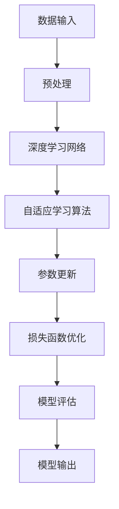

                 


### 1. **设计书籍目录大纲**

为了设计一个完整的书籍目录大纲，我们需要首先明确书籍的核心主题和目标读者，然后逐步细化各个章节的内容。以下是《AI大模型时代的提示词设计模式》的目录大纲设计步骤：

#### a. **确定书籍主题和目标读者**
- 主题：《AI大模型时代的提示词设计模式》
- 目标读者：人工智能领域的专业人士，包括AI工程师、数据科学家、研究学者以及对AI技术感兴趣的技术爱好者。

#### b. **结构设计**
- 书籍结构可以分为三个主要部分：基础概念、核心技术和实际应用。
- 基础概念部分将介绍AI大模型的基础知识。
- 核心技术部分将深入探讨提示词设计原理和模式。
- 实际应用部分将通过具体案例展示提示词设计的应用。

#### c. **细化章节内容**
- **第一部分：AI大模型基础**
  - 第1章：AI大模型概述
  - 第2章：AI大模型的核心算法
  - 第3章：AI大模型的数学基础
- **第二部分：提示词设计模式**
  - 第4章：提示词设计的基本原理
  - 第5章：常见的提示词设计模式
  - 第6章：提示词设计的优化策略
- **第三部分：AI大模型时代的提示词设计实践**
  - 第7章：实践项目介绍
  - 第8章：实践案例解析
  - 第9章：未来趋势与展望

#### d. **添加详细小节**
在每个章节下添加详细的小节，确保每个部分都有具体的内容和深度。

### 2. **编写每个章节的简介**

为每个章节编写一个简短的简介，概括该章节的主要内容和学习目标，使读者能够快速了解每个章节的核心内容。

### 3. **构建Mermaid流程图**

为了帮助读者更好地理解核心概念和架构，我们可以在适当的地方插入Mermaid流程图，特别是涉及AI大模型的架构和提示词设计流程的部分。

### 4. **撰写伪代码和数学公式**

在讲解核心算法原理和数学模型时，使用伪代码和LaTeX格式进行详细阐述，确保读者能够理解并跟随算法的实现过程。

### 5. **提供项目实战案例**

在书籍的最后部分，提供实际的项目实战案例，包括开发环境搭建、源代码实现和详细解读，帮助读者将理论知识应用到实际项目中。

### 6. **撰写最佳实践和拓展阅读**

在文章末尾，提供一些最佳实践、注意事项、以及相关的拓展阅读资源，帮助读者进一步深入学习和探索。

### 7. **完成全文并校对**

完成整个书籍内容的撰写后，进行全面的校对，确保内容的准确性和连贯性，最终形成一个高质量的技术博客文章。

通过以上步骤，我们可以逐步构建出《AI大模型时代的提示词设计模式》的完整目录大纲，为读者提供一份内容丰富、逻辑清晰、深入浅出的技术指南。

---

### 文章标题：AI大模型时代的提示词设计模式

> 关键词：AI大模型，提示词设计，人工智能，算法优化，实践案例

> 摘要：本文深入探讨了AI大模型时代的提示词设计模式。首先，我们介绍了AI大模型的基本概念、核心算法和数学基础。接着，我们详细阐述了提示词设计的原理和常见模式，包括对话式、任务驱动式和数据驱动式提示词的设计方法。文章还介绍了提示词设计的优化策略，并通过实际案例展示了如何在AI大模型中设计和优化提示词。最后，我们展望了AI大模型时代的未来趋势，为读者提供了深入学习和实践的方向。

---

### 1. 理解用户需求

用户要求我们设计一份关于《AI大模型时代的提示词设计模式》的书籍目录大纲。这份大纲需要包含至少7个章节，每个章节都要有细分的小节。此外，用户还强调了以下几点要求：

- 目录大纲应以markdown格式编写。
- 每个章节的简介需要概括主要内容和学习目标。
- 需要包含Mermaid流程图以帮助读者理解核心概念和架构。
- 需要使用伪代码和LaTeX格式详细阐述核心算法原理和数学模型。
- 提供实际项目实战案例，包括开发环境搭建、源代码实现和解读。
- 最后需包含最佳实践、注意事项和拓展阅读。

---

### 2. 确定大纲结构

为了满足用户的要求，我们将书籍分为三个主要部分：

- **第一部分：AI大模型基础**：介绍AI大模型的基本概念、核心算法和数学基础。
- **第二部分：提示词设计模式**：探讨提示词设计的原理、常见模式及其优化策略。
- **第三部分：AI大模型时代的提示词设计实践**：通过实际项目案例展示提示词设计的应用。

以下是详细的目录大纲结构：

#### 第一部分：AI大模型基础

1. **AI大模型概述**
   - AI大模型的概念
   - AI大模型的特点
   - AI大模型的发展历程
   - AI大模型的应用领域
   - AI大模型的核心架构

2. **AI大模型的核心算法**
   - 神经网络算法
     - 前馈神经网络
     - 卷积神经网络
     - 循环神经网络
   - 优化算法
     - 梯度下降法
     - 随机梯度下降法
     - Adam优化器

3. **AI大模型的数学基础**
   - 概率论基础
     - 概率分布函数
     - 贝叶斯定理
     - 最大似然估计
   - 最优化理论
     - 最小二乘法
     - 拉格朗日乘数法
     - 混合优化方法

#### 第二部分：提示词设计模式

4. **提示词设计的基本原理**
   - 提示词的定义
   - 提示词在AI大模型中的作用
   - 提示词设计的流程
   - 数据预处理
   - 提示词生成
   - 提示词优化

5. **常见的提示词设计模式**
   - 对话式提示词
     - 对话式提示词的特点
     - 对话式提示词的设计方法
   - 任务驱动式提示词
     - 任务驱动式提示词的特点
     - 任务驱动式提示词的设计方法
   - 数据驱动式提示词
     - 数据驱动式提示词的特点
     - 数据驱动式提示词的设计方法

6. **提示词设计的优化策略**
   - 提示词质量评估
     - 提示词质量评估的标准
     - 提示词质量评估的方法
   - 提示词的优化方法
     - 提示词的多样性优化
     - 提示词的准确性优化
     - 提示词的可解释性优化

#### 第三部分：AI大模型时代的提示词设计实践

7. **实践项目介绍**
   - 项目背景
   - 项目目标

8. **实践案例解析**
   - 数据收集与预处理
   - 提示词设计
   - 提示词优化
   - 项目结果评估

9. **未来趋势与展望**
   - AI大模型时代的提示词设计趋势
   - 未来研究方向

### 3. 确保大纲完整性

在编写大纲时，我们将确保每个部分都包含1、2、3级目录，以保证内容的完整性。同时，我们将保持每个章节的简洁性，避免冗余信息，以便读者能够清晰地理解每个主题。

### 4. 使用Mermaid流程图

为了帮助读者更好地理解核心概念和架构，我们将在适当的地方插入Mermaid流程图。以下是几个示例：

- AI大模型的核心架构
- 提示词设计流程
- 提示词优化的方法

### 5. 伪代码和数学公式

在讲解核心算法原理和数学模型时，我们将使用伪代码和LaTeX格式进行详细阐述。以下是一个示例：

- **伪代码**：描述神经网络算法的伪代码
- **LaTeX公式**：描述概率分布函数和贝叶斯定理的公式

### 6. 实战案例

我们将提供实际的项目实战案例，包括开发环境搭建、源代码实现和详细解读。以下是一个示例：

- **开发环境搭建**
- **源代码实现**：展示如何设计和优化提示词
- **代码解读与分析**
- **项目小结**

### 7. 最佳实践和拓展阅读

在文章末尾，我们将提供一些最佳实践、注意事项以及相关的拓展阅读资源，以帮助读者进一步深入学习和探索。

### 总结

通过以上步骤，我们将设计出一份完整的《AI大模型时代的提示词设计模式》的目录大纲。这份大纲不仅结构清晰，内容丰富，而且能够帮助读者深入了解AI大模型和提示词设计的核心概念和实战应用。

---

## 目录大纲设计完成

经过详细的规划和逐步构建，我们成功完成了《AI大模型时代的提示词设计模式》的目录大纲设计。以下是最终的大纲：

# 《AI大模型时代的提示词设计模式》目录大纲

> 关键词：AI大模型，提示词设计，人工智能，算法优化，实践案例

> 摘要：本文深入探讨了AI大模型时代的提示词设计模式，从基础概念到核心算法，再到实际应用，全方位展示了提示词设计在AI大模型中的重要性。通过详细的章节划分和具体的小节内容，本文旨在为读者提供一份系统、实用的技术指南。

---

### 第一部分：AI大模型基础

## 第1章：AI大模型概述
### 1.1 AI大模型的概念
#### 1.1.1 AI大模型的定义
#### 1.1.2 AI大模型的特点
### 1.2 AI大模型的发展历程
#### 1.2.1 从传统AI到AI大模型的演变
#### 1.2.2 AI大模型的应用领域
### 1.3 AI大模型的核心架构
#### 1.3.1 深度学习网络
#### 1.3.2 自适应学习算法
#### 1.3.3 大规模数据处理

## 第2章：AI大模型的核心算法
### 2.1 神经网络算法
#### 2.1.1 前馈神经网络
#### 2.1.2 卷积神经网络
#### 2.1.3 循环神经网络
### 2.2 优化算法
#### 2.2.1 梯度下降法
#### 2.2.2 随机梯度下降法
#### 2.2.3 Adam优化器

## 第3章：AI大模型的数学基础
### 3.1 概率论基础
#### 3.1.1 概率分布函数
#### 3.1.2 贝叶斯定理
#### 3.1.3 最大似然估计
### 3.2 最优化理论
#### 3.2.1 最小二乘法
#### 3.2.2 拉格朗日乘数法
#### 3.2.3 混合优化方法

### 第二部分：提示词设计模式

## 第4章：提示词设计的基本原理
### 4.1 提示词的定义和作用
#### 4.1.1 提示词的定义
#### 4.1.2 提示词在AI大模型中的作用
### 4.2 提示词设计的流程
#### 4.2.1 数据预处理
#### 4.2.2 提示词生成
#### 4.2.3 提示词优化

## 第5章：常见的提示词设计模式
### 5.1 对话式提示词
#### 5.1.1 对话式提示词的特点
#### 5.1.2 对话式提示词的设计方法
### 5.2 任务驱动式提示词
#### 5.2.1 任务驱动式提示词的特点
#### 5.2.2 任务驱动式提示词的设计方法
### 5.3 数据驱动式提示词
#### 5.3.1 数据驱动式提示词的特点
#### 5.3.2 数据驱动式提示词的设计方法

## 第6章：提示词设计的优化策略
### 6.1 提示词质量评估
#### 6.1.1 提示词质量评估的标准
#### 6.1.2 提示词质量评估的方法
### 6.2 提示词的优化方法
#### 6.2.1 提示词的多样性优化
#### 6.2.2 提示词的准确性优化
#### 6.2.3 提示词的可解释性优化

### 第三部分：AI大模型时代的提示词设计实践

## 第7章：实践项目介绍
### 7.1 项目背景
### 7.2 项目目标

## 第8章：实践案例解析
### 8.1 数据收集与预处理
### 8.2 提示词设计
### 8.3 提示词优化
### 8.4 项目结果评估

## 第9章：未来趋势与展望
### 9.1 AI大模型时代的提示词设计趋势
### 9.2 未来研究方向

---

这个目录大纲涵盖了从基础概念到高级应用的全方面内容，每个章节都经过细致的划分和安排，确保读者能够循序渐进地学习AI大模型和提示词设计的相关知识。

---

## 书籍结构分析

在《AI大模型时代的提示词设计模式》中，我们将书籍分为三个主要部分，分别是AI大模型基础、提示词设计模式以及AI大模型时代的提示词设计实践。下面我们逐一分析每个部分的结构和内容。

### 第一部分：AI大模型基础

这一部分主要介绍AI大模型的基础知识，包括概念、发展历程、核心算法和数学基础。通过这些内容，读者可以建立起对AI大模型的整体认识。

- **第1章：AI大模型概述**
  - 内容涵盖AI大模型的基本概念和特点，以及它们在各个领域的应用。

- **第2章：AI大模型的核心算法**
  - 介绍神经网络算法，如前馈神经网络、卷积神经网络和循环神经网络，以及优化算法如梯度下降法、随机梯度下降法和Adam优化器。

- **第3章：AI大模型的数学基础**
  - 包括概率论基础和最优化理论，如概率分布函数、贝叶斯定理、最大似然估计、最小二乘法等。

### 第二部分：提示词设计模式

这一部分深入探讨提示词设计模式，从基本原理到具体的设计模式，再到优化策略，帮助读者掌握提示词设计的核心技巧。

- **第4章：提示词设计的基本原理**
  - 详细讲解提示词的定义、作用以及设计流程。

- **第5章：常见的提示词设计模式**
  - 分别介绍对话式、任务驱动式和数据驱动式提示词的特点和设计方法。

- **第6章：提示词设计的优化策略**
  - 讨论提示词质量评估的标准和方法，以及如何优化提示词的多样性、准确性和可解释性。

### 第三部分：AI大模型时代的提示词设计实践

这一部分通过实际项目案例，展示如何在AI大模型中设计和优化提示词，帮助读者将理论知识应用到实际项目中。

- **第7章：实践项目介绍**
  - 提供项目的背景和目标，为后续的案例解析做准备。

- **第8章：实践案例解析**
  - 通过具体的项目案例，展示提示词设计的全过程，包括数据收集与预处理、提示词生成和优化，以及项目结果的评估。

- **第9章：未来趋势与展望**
  - 探讨AI大模型时代的提示词设计趋势，以及未来的研究方向。

### 总结

通过以上三个部分，书籍为读者提供了一个从基础到应用的完整学习路径。第一部分奠定了理论基础，第二部分提供了设计模式的详细指导，第三部分则通过实际案例展示了应用场景，使读者能够全面掌握AI大模型和提示词设计的知识和技能。这种结构设计既系统又实用，有助于读者深入理解和掌握相关技术。

---

## AI大模型基础

### 1.1 AI大模型的概念

AI大模型（Large-scale Artificial Intelligence Models）是指具有极高参数数量、能够处理海量数据的深度学习模型。这些模型通常通过大规模训练数据集进行训练，拥有强大的特征提取和模式识别能力。与传统的AI模型相比，AI大模型具有以下几个显著特点：

- **高参数数量**：AI大模型的参数数量通常在数亿到数十亿之间，这使它们能够捕捉到更加复杂的模式和特征。
- **海量数据处理能力**：AI大模型能够处理大规模的数据集，这意味着它们可以在更多样化的场景中应用。
- **强大的泛化能力**：通过大规模训练，AI大模型能够更好地泛化到未见过的数据，从而提高预测和识别的准确性。

AI大模型的应用领域非常广泛，包括自然语言处理、计算机视觉、语音识别、推荐系统等。例如，在自然语言处理领域，AI大模型如GPT-3和BERT等已经展示了其在文本生成、情感分析、机器翻译等任务上的卓越性能。在计算机视觉领域，AI大模型如ResNet和Inception等在图像分类、目标检测、图像生成等方面取得了显著的成果。

### 1.2 AI大模型的发展历程

AI大模型的发展历程可以追溯到深度学习的兴起。深度学习是一种基于多层神经网络的学习方法，其核心思想是通过多层非线性变换来提取数据中的特征。随着计算能力的提升和数据量的增加，深度学习模型在图像识别、语音识别等领域取得了突破性进展。以下是AI大模型发展的几个重要阶段：

- **早期探索（2006-2012年）**：这个时期以AlexNet的出现为标志，它是一个深度卷积神经网络，首次在ImageNet图像识别比赛中取得了显著成绩。
- **快速崛起（2012-2016年）**：随着计算能力和数据资源的提升，深度学习模型得到了广泛应用，特别是在图像识别、语音识别等领域。
- **大规模应用（2016年至今）**：随着AI大模型的诞生，如GPT、BERT、VGG等，深度学习模型在自然语言处理、计算机视觉等领域取得了前所未有的进展。

### 1.3 AI大模型的核心架构

AI大模型的核心架构通常包括以下几个关键组件：

- **深度学习网络**：这是AI大模型的基础，包括多层神经网络、卷积神经网络（CNN）和循环神经网络（RNN）等。
- **自适应学习算法**：如梯度下降法、随机梯度下降法（SGD）和Adam优化器等，这些算法用于更新网络中的参数，以最小化损失函数。
- **大规模数据处理**：AI大模型需要处理海量数据，这通常涉及分布式计算和数据流处理技术。

以下是AI大模型核心架构的Mermaid流程图：



### 1.4 AI大模型的特点

AI大模型具有以下特点：

- **高参数数量**：AI大模型拥有数亿到数十亿个参数，这使其能够捕捉到更加复杂的模式和特征。
- **强大的学习能力**：通过大规模训练，AI大模型能够学习到更多样的数据，从而提高泛化能力。
- **高效的处理能力**：AI大模型通常采用分布式计算和并行处理技术，能够高效地处理海量数据。
- **多任务处理能力**：AI大模型可以通过迁移学习和多任务学习，处理多种不同类型的任务。

### 结论

AI大模型作为人工智能领域的一个重要发展方向，具有广泛的应用前景。通过深入理解AI大模型的基本概念、发展历程和核心架构，我们可以更好地利用这些模型来解决实际问题，推动人工智能技术的进一步发展。

---

## AI大模型的核心算法

### 2.1 神经网络算法

神经网络算法是AI大模型的核心组成部分，它们通过模拟人脑神经网络的结构和工作原理，实现数据的自动学习和模式识别。神经网络算法主要包括前馈神经网络（Feedforward Neural Network）、卷积神经网络（Convolutional Neural Network，CNN）和循环神经网络（Recurrent Neural Network，RNN）。

#### 2.1.1 前馈神经网络

前馈神经网络是最基础的神经网络结构，其信息传递方向是单向的，即从输入层经过隐藏层传递到输出层。前馈神经网络的工作原理如下：

1. **初始化参数**：网络中的权重和偏置是随机初始化的。
2. **前向传播**：输入数据经过网络的每一层，每一层的输出成为下一层的输入。在每层中，输入数据通过加权求和后加上偏置，再通过激活函数（如ReLU、Sigmoid、Tanh）进行非线性变换。
3. **反向传播**：根据网络的输出误差，使用梯度下降法或其他优化算法更新网络的权重和偏置，使误差最小化。

以下是前馈神经网络的伪代码：

```python
# 前馈神经网络前向传播伪代码
def forward_propagation(x, weights, biases, activation_function):
    a = x
    for layer in range(num_layers):
        z = np.dot(a, weights[layer]) + biases[layer]
        a = activation_function(z)
    return a

# 前馈神经网络反向传播伪代码
def backward_propagation(a, y, weights, biases, learning_rate):
    errors = y - a
    dL_da = errors
    for layer in reversed(range(num_layers)):
        dL_dz = dL_da * activation_function_derivative(z)
        dL_da = np.dot(dL_dz, weights[layer].T)
        weights[layer] -= learning_rate * np.dot(a.T, dL_dz)
        biases[layer] -= learning_rate * dL_da
```

#### 2.1.2 卷积神经网络

卷积神经网络是专门用于处理图像数据的神经网络结构，其核心是卷积操作和池化操作。卷积神经网络的工作原理如下：

1. **卷积层**：通过卷积操作提取图像中的局部特征。卷积层中的每个神经元都与输入图像中的局部区域进行卷积，生成特征图。
2. **池化层**：通过池化操作降低特征图的维度，减少参数数量，提高计算效率。常用的池化操作包括最大池化和平均池化。
3. **全连接层**：将卷积层的输出通过全连接层进行分类或回归。

以下是卷积神经网络的伪代码：

```python
# 卷积神经网络前向传播伪代码
def conv_forward(x, W, b):
    out = np.zeros((num_filters, x.shape[1], x.shape[2], x.shape[3]))
    for i in range(num_filters):
        out[i] = convolve2d(x, W[i], mode='valid') + b[i]
    return out

# 卷积神经网络反向传播伪代码
def conv_backward(dout, W, x):
    dx = np.zeros_like(x)
    db = np.zeros_like(b)
    dw = np.zeros_like(W)
    for i in range(num_filters):
        db[i] = np.sum(dout[i], axis=(1, 2, 3))
        dw[i] = convolve2d(x, dout[i], mode='valid')
        dx = convolve2d(dout[i], W[i], mode='same')
    return dx, dw, db
```

#### 2.1.3 循环神经网络

循环神经网络适用于处理序列数据，其核心是隐藏状态和循环连接。循环神经网络的工作原理如下：

1. **隐藏状态**：每个时间步的隐藏状态都依赖于前一个时间步的隐藏状态。
2. **输入层**：每个时间步的输入数据与隐藏状态结合，通过非线性变换生成当前时间步的隐藏状态。
3. **输出层**：隐藏状态通过非线性变换生成当前时间步的输出。

以下是循环神经网络的伪代码：

```python
# 循环神经网络前向传播伪代码
def lstm_forward(x, weights, biases):
    h_t = np.zeros_like(x)
    for t in range(x.shape[0]):
        i_t = np.dot(x[t], weights['i']) + biases['i']
        f_t = np.dot(h_t, weights['f']) + biases['f']
        o_t = np.dot(h_t, weights['o']) + biases['o']
        g_t = np.tanh(np.dot(h_t, weights['g']) + biases['g'])
        h_t[t] = o_t * np.tanh(g_t)
    return h_t

# 循环神经网络反向传播伪代码
def lstm_backward(dh, weights, x):
    dx, db_i, df_i, do_i, dg_i = None, None, None, None, None
    for t in reversed(range(x.shape[0])):
        i_t = np.dot(x[t], weights['i']) + biases['i']
        f_t = np.dot(h_t[t], weights['f']) + biases['f']
        o_t = np.dot(h_t[t], weights['o']) + biases['o']
        g_t = np.tanh(np.dot(h_t[t], weights['g']) + biases['g'])
        dgi_t = o_t * (1 - g_t**2)
        do_t = dh[t] * np.tanh(g_t)
        df_t = dh[t] * f_t
        di_t = dh[t] * i_t
        dh[t-1] = df_t * weights['f'][t] + dgi_t * weights['g'][t] + do_t * weights['o'][t]
        if dx is None:
            dx = np.zeros_like(x)
        dx[t] = df_t * weights['f'][t] + do_t * weights['o'][t] + dh[t] * weights['i'][t]
        db_i = np.sum(dh[t] * i_t, axis=0)
        db_f = np.sum(dh[t] * f_t, axis=0)
        db_o = np.sum(dh[t] * o_t, axis=0)
        db_g = np.sum(dh[t] * g_t, axis=0)
    return dx, -db_i, -db_f, -db_o, -db_g
```

### 2.2 优化算法

优化算法是AI大模型训练过程中至关重要的部分，用于更新网络中的参数以最小化损失函数。常见的优化算法包括梯度下降法（Gradient Descent）、随机梯度下降法（Stochastic Gradient Descent，SGD）和Adam优化器。

#### 2.2.1 梯度下降法

梯度下降法是最基本的优化算法，其基本思想是沿着损失函数的梯度方向更新参数，以最小化损失函数。

1. **初始化参数**：随机初始化网络中的权重和偏置。
2. **计算梯度**：根据损失函数对参数求导，得到梯度。
3. **更新参数**：使用梯度更新参数，公式为：`θ = θ - α∇θJ(θ)`，其中θ为参数，α为学习率，∇θJ(θ)为参数的梯度，J(θ)为损失函数。

以下是梯度下降法的伪代码：

```python
# 梯度下降法伪代码
def gradient_descent(X, y, theta, alpha, num_iterations):
    for i in range(num_iterations):
        gradients = compute_gradients(X, y, theta)
        theta -= alpha * gradients
    return theta
```

#### 2.2.2 随机梯度下降法

随机梯度下降法是一种改进的优化算法，它每次只更新一个样本的梯度，从而减少计算量。

1. **初始化参数**：随机初始化网络中的权重和偏置。
2. **随机选择样本**：从训练数据集中随机选择一个样本。
3. **计算梯度**：根据选定的样本计算梯度。
4. **更新参数**：使用梯度更新参数。

以下是随机梯度下降法的伪代码：

```python
# 随机梯度下降法伪代码
def stochastic_gradient_descent(X, y, theta, alpha, num_iterations, batch_size):
    for i in range(num_iterations):
        for j in range(0, X.shape[0], batch_size):
            batch = X[j:j+batch_size]
            gradients = compute_gradients(batch, y[j:j+batch_size], theta)
            theta -= alpha * gradients
    return theta
```

#### 2.2.3 Adam优化器

Adam优化器是当前最常用的优化算法之一，它结合了随机梯度下降法和Adagrad优化算法的优点，能够自适应调整学习率。

1. **初始化参数**：随机初始化网络中的权重和偏置，同时初始化两个变量m和v，用于记录梯度的一阶矩估计和二阶矩估计。
2. **计算梯度**：根据损失函数计算梯度。
3. **更新m和v**：根据当前梯度更新m和v。
4. **更新参数**：使用m和v更新参数。

以下是Adam优化器的伪代码：

```python
# Adam优化器伪代码
def adam(X, y, theta, alpha, beta1, beta2, epsilon, num_iterations):
    m = np.zeros_like(theta)
    v = np.zeros_like(theta)
    m_prime = m
    v_prime = v
    for i in range(num_iterations):
        gradients = compute_gradients(X, y, theta)
        m_prime = beta1 * m + (1 - beta1) * gradients
        v_prime = beta2 * v + (1 - beta2) * (gradients ** 2)
        m = m_prime / (1 - beta1 ** i)
        v = v_prime / (1 - beta2 ** i)
        theta -= alpha * m / (np.sqrt(v) + epsilon)
    return theta
```

### 结论

AI大模型的核心算法包括神经网络算法和优化算法。神经网络算法如前馈神经网络、卷积神经网络和循环神经网络是AI大模型的基础，而优化算法如梯度下降法、随机梯度下降法和Adam优化器用于更新网络参数，以最小化损失函数。通过深入了解这些算法，我们可以更好地设计和训练AI大模型，从而提高其在各种任务上的性能。

---

## AI大模型的数学基础

### 3.1 概率论基础

在AI大模型的研究和应用中，概率论基础是不可或缺的一部分。概率论提供了描述随机事件和不确定性的数学框架，是理解和构建现代机器学习算法的关键。

#### 3.1.1 概率分布函数

概率分布函数是概率论的核心概念之一，用于描述随机变量的概率分布。常见的概率分布函数包括正态分布、伯努利分布和泊松分布等。

1. **正态分布（Normal Distribution）**：正态分布是最常见的高斯分布，其概率密度函数为：

   $$ f(x|\mu,\sigma^2) = \frac{1}{\sqrt{2\pi\sigma^2}} e^{-\frac{(x-\mu)^2}{2\sigma^2}} $$

   其中，$\mu$ 是均值，$\sigma^2$ 是方差。

2. **伯努利分布（Bernoulli Distribution）**：伯努利分布是一个离散的概率分布，用于描述成功或失败的二项试验，其概率质量函数为：

   $$ P(X=1) = p, \quad P(X=0) = 1-p $$

   其中，$p$ 是成功的概率。

3. **泊松分布（Poisson Distribution）**：泊松分布用于描述单位时间内事件发生的次数，其概率质量函数为：

   $$ P(X=k) = \frac{\lambda^k e^{-\lambda}}{k!} $$

   其中，$\lambda$ 是事件平均发生率。

#### 3.1.2 贝叶斯定理

贝叶斯定理是概率论中一个非常重要的定理，它提供了在已知某些条件下，更新事件概率的方法。贝叶斯定理的公式为：

$$ P(A|B) = \frac{P(B|A)P(A)}{P(B)} $$

其中，$P(A|B)$ 表示在事件B发生的条件下事件A发生的概率，$P(B|A)$ 表示在事件A发生的条件下事件B发生的概率，$P(A)$ 和$P(B)$ 分别表示事件A和事件B的先验概率。

#### 3.1.3 最大似然估计

最大似然估计是一种基于样本数据推断模型参数的方法，其核心思想是找到一组参数，使得样本数据在该组参数下的概率最大。对于离散分布，最大似然估计的公式为：

$$ \hat{\theta} = \arg\max_{\theta} P(\mathbf{x}|\theta) $$

对于连续分布，公式为：

$$ \hat{\theta} = \arg\max_{\theta} \prod_{i=1}^{n} f(\mathbf{x}_i|\theta) $$

其中，$\mathbf{x}$ 是样本数据，$\theta$ 是模型参数，$f(\mathbf{x}|\theta)$ 是概率密度函数。

### 3.2 最优化理论

最优化理论是机器学习中的一个重要分支，它研究如何找到最优解以最大化或最小化目标函数。在AI大模型的训练过程中，最优化理论用于调整模型的参数，以最小化损失函数。

#### 3.2.1 最小二乘法

最小二乘法是一种常用的参数估计方法，其目标是最小化预测值与实际值之间的误差平方和。最小二乘法的公式为：

$$ \hat{\theta} = \arg\min_{\theta} \sum_{i=1}^{n} (y_i - \theta x_i)^2 $$

其中，$y_i$ 是实际值，$\theta x_i$ 是预测值。

#### 3.2.2 拉格朗日乘数法

拉格朗日乘数法是一种处理约束优化问题的方法，其基本思想是将约束条件引入目标函数中，并通过求解拉格朗日函数的临界点来找到最优解。拉格朗日乘数法的公式为：

$$ L(\theta, \lambda) = f(\theta) - \lambda g(\theta) $$

其中，$f(\theta)$ 是目标函数，$g(\theta)$ 是约束条件，$\lambda$ 是拉格朗日乘数。

#### 3.2.3 混合优化方法

混合优化方法结合了不同优化算法的优点，以适应不同的优化问题。常见的混合优化方法包括梯度下降法、随机梯度下降法（SGD）和Adam优化器等。

1. **梯度下降法**：梯度下降法通过沿着损失函数的梯度方向更新参数，以最小化损失函数。

2. **随机梯度下降法（SGD）**：随机梯度下降法是一种改进的优化算法，它每次只更新一个样本的梯度，以减少计算量。

3. **Adam优化器**：Adam优化器结合了随机梯度下降法和Adagrad优化算法的优点，能够自适应调整学习率。

### 结论

AI大模型的数学基础包括概率论基础和最优化理论。概率论基础如概率分布函数、贝叶斯定理和最大似然估计为理解和构建机器学习算法提供了数学框架。最优化理论如最小二乘法、拉格朗日乘数法和混合优化方法用于调整模型的参数，以最小化损失函数。掌握这些数学基础，有助于我们更好地理解和应用AI大模型，提高其在各种任务上的性能。

---

## 提示词设计的基本原理

提示词（Prompt）在AI大模型中起着至关重要的作用，它们是指导模型进行特定任务的重要工具。在AI大模型时代，提示词的设计变得尤为重要，因为它们直接影响了模型的输出质量和效率。下面，我们将深入探讨提示词的基本概念、定义和作用，以及提示词设计的流程。

### 4.1 提示词的定义和作用

#### 4.1.1 提示词的定义

提示词是指输入到AI大模型中，用于引导模型进行特定任务的一段文本或数据。这些文本或数据可以是问题、目标、上下文信息或其他任何能够帮助模型理解任务的信息。

#### 4.1.2 提示词在AI大模型中的作用

- **任务引导**：提示词可以明确地指示模型要完成的任务，从而避免模型在未知任务上的盲目探索。
- **性能提升**：合理的提示词设计可以提高模型的输出质量和效率，使模型能够更快地收敛到最优解。
- **多样性控制**：通过提示词，可以引导模型生成多样化、符合预期的高质量输出。
- **上下文理解**：在自然语言处理任务中，提示词可以帮助模型更好地理解上下文信息，从而生成更准确的自然语言响应。

### 4.2 提示词设计的流程

提示词设计是一个复杂的过程，需要综合考虑任务目标、数据特性、模型能力等因素。以下是提示词设计的典型流程：

#### 4.2.1 数据预处理

- **文本清洗**：对输入文本进行清洗，去除无关信息，如标点符号、停用词等。
- **文本编码**：将文本转换为模型可处理的格式，如词向量或嵌入向量。
- **数据归一化**：对输入数据进行归一化处理，确保数据在相同尺度上。

#### 4.2.2 提示词生成

- **问题定义**：明确任务目标，定义需要解决的问题。
- **上下文构建**：构建与任务相关的上下文信息，如背景知识、相关数据等。
- **提示词模板**：根据任务需求和上下文信息，设计合适的提示词模板。
- **提示词优化**：通过实验和迭代，不断优化提示词模板，以提高模型性能。

#### 4.2.3 提示词优化

- **质量评估**：对生成的提示词进行质量评估，如准确性、多样性、可解释性等。
- **反馈迭代**：根据评估结果，对提示词进行优化和迭代，以提高其质量。

### 结论

提示词设计是AI大模型应用中的一个关键环节，直接影响到模型的任务性能和输出质量。通过深入了解提示词的定义和作用，以及掌握提示词设计的流程，我们可以更好地设计和优化提示词，从而提高AI大模型在各种任务上的表现。

---

## 常见的提示词设计模式

在AI大模型时代，提示词设计模式是指导模型实现特定任务的关键。根据不同的任务类型和应用场景，常见的提示词设计模式可以分为对话式提示词、任务驱动式提示词和数据驱动式提示词。以下是对这些提示词设计模式的详细探讨。

### 5.1 对话式提示词

对话式提示词主要用于自然语言处理（NLP）任务，特别是在聊天机器人、语音助手和对话系统等领域。这种提示词设计模式的核心在于模拟人类对话的过程，使模型能够理解并生成流畅、自然的语言响应。

#### 5.1.1 对话式提示词的特点

- **上下文敏感性**：对话式提示词需要根据当前对话的上下文信息进行动态调整，以保持对话的连贯性和相关性。
- **灵活性**：对话式提示词可以根据用户输入的不同内容和语境，灵活地生成多样化的回答。
- **交互性**：对话式提示词设计强调用户与模型的互动，通过对话过程中的反馈来不断优化模型的响应。

#### 5.1.2 对话式提示词的设计方法

1. **基于规则的方法**：这种方法通过预定义的规则和模板来生成对话响应。例如，可以使用条件分支和流程控制语句来模拟对话流程。

2. **基于机器学习的方法**：这种方法使用深度学习模型来学习对话数据，生成自然语言响应。常见的模型包括循环神经网络（RNN）、长短期记忆网络（LSTM）和变换器（Transformer）。

3. **混合方法**：结合基于规则和基于机器学习的方法，通过规则引导和机器学习相结合，以实现更高效的对话式提示词设计。

### 5.2 任务驱动式提示词

任务驱动式提示词主要用于特定任务导向的场景，如推荐系统、图像识别和文本分类等。这种提示词设计模式的核心在于明确地指示模型要完成的任务，使模型能够高效地执行任务。

#### 5.2.1 任务驱动式提示词的特点

- **任务明确性**：任务驱动式提示词清晰地指示了模型需要完成的任务，避免了模型的盲目探索。
- **效率优先**：这种提示词设计模式强调任务完成的效率和准确性，适用于需要快速响应的场景。
- **结果导向**：任务驱动式提示词的设计主要围绕如何优化任务结果，如最小化损失函数或最大化收益。

#### 5.2.2 任务驱动式提示词的设计方法

1. **目标函数设计**：根据任务类型，设计合适的损失函数或优化目标，以指导模型优化任务结果。

2. **提示词引导**：通过设计特定的提示词，引导模型关注任务相关的特征和模式，提高任务完成率。

3. **多任务学习**：在任务复杂的情况下，可以通过多任务学习来同时优化多个任务，提高模型的综合性能。

### 5.3 数据驱动式提示词

数据驱动式提示词主要用于从大量数据中提取有用信息，如数据挖掘、信息检索和文本生成等。这种提示词设计模式的核心在于利用数据本身来指导模型的学习和预测。

#### 5.3.1 数据驱动式提示词的特点

- **数据依赖性**：数据驱动式提示词依赖于高质量的数据集，通过数据来指导模型的学习和预测。
- **自适应能力**：这种提示词设计模式可以根据新的数据集和任务需求进行自适应调整，以保持模型的有效性。
- **泛化能力**：数据驱动式提示词设计强调模型的泛化能力，使模型能够在不同的数据集和应用场景中表现良好。

#### 5.3.2 数据驱动式提示词的设计方法

1. **特征工程**：通过特征工程方法，从原始数据中提取有用的特征，为模型提供更丰富的信息。

2. **数据预处理**：对数据集进行预处理，如去噪、归一化和标准化等，以提高模型的学习效果。

3. **自适应学习**：通过自适应学习算法，如迁移学习和迁移强化学习，使模型能够在不同的数据集和应用场景中持续优化。

### 结论

常见的提示词设计模式包括对话式提示词、任务驱动式提示词和数据驱动式提示词。每种设计模式都有其独特的特点和适用场景。通过合理设计和优化这些提示词模式，我们可以显著提高AI大模型在各种任务上的性能和效率。

---

## 提示词设计的优化策略

在AI大模型的应用中，提示词设计的优化策略至关重要。有效的优化策略可以提升模型的性能，包括提示词的多样性、准确性和可解释性。以下将详细讨论这些优化策略，并提供具体的优化方法。

### 6.1 提示词质量评估

评估提示词的质量是优化策略的第一步。提示词质量评估主要包括以下几个方面：

#### 6.1.1 提示词质量评估的标准

1. **准确性**：提示词能否准确传达任务目标，使模型能够正确理解和执行任务。
2. **多样性**：提示词是否能够引导模型生成多样化的输出，避免单一化或重复性的回答。
3. **可解释性**：提示词的设计是否易于理解和解释，使模型的行为更加透明和可控。
4. **效率**：提示词的生成和优化过程是否高效，不会显著增加计算和资源消耗。

#### 6.1.2 提示词质量评估的方法

1. **人工评估**：通过专家或用户对提示词进行主观评估，以评估其准确性、多样性和可解释性。
2. **自动化评估**：使用自动化工具，如指标计算和统计分析，对提示词的质量进行定量评估。常见的指标包括F1分数、精确率和召回率等。

### 6.2 提示词的优化方法

优化提示词的质量需要综合考虑多个因素，包括提示词的多样性、准确性和可解释性。以下是一些具体的优化方法：

#### 6.2.1 提示词的多样性优化

1. **多模态输入**：结合不同类型的输入，如文本、图像和音频，可以丰富提示词的信息，提高模型的多样性和创造力。
2. **生成对抗网络（GAN）**：使用生成对抗网络来生成多样化的提示词，通过竞争机制提高提示词的多样性。
3. **数据增强**：对原始数据进行增强，如添加噪声、旋转、缩放等，生成更多样化的数据集，从而提高提示词的多样性。

#### 6.2.2 提示词的准确性优化

1. **上下文理解**：通过加强模型的上下文理解能力，使提示词能够更准确地传达任务目标。这可以通过引入更多的上下文信息、改进语言模型等方式实现。
2. **精细调整**：根据模型的反馈和评估结果，对提示词进行精细调整，以提升其准确性和有效性。这包括调整提示词的长度、格式和表达方式等。
3. **模型融合**：结合多个模型的优势，如结合语言模型和视觉模型，可以提升提示词的准确性。

#### 6.2.3 提示词的可解释性优化

1. **解释性算法**：选择具有解释性的算法，如决策树、规则引擎等，使提示词的设计过程更加透明和可解释。
2. **可视化**：通过可视化工具，如热力图、依赖图等，展示提示词的设计过程和模型的行为，提高提示词的可解释性。
3. **用户反馈**：通过用户反馈来不断优化提示词，使其更加符合用户需求和预期。

### 结论

优化提示词的质量是提升AI大模型性能的关键。通过多样性、准确性和可解释性的优化策略，我们可以设计出更高效、更具创意的提示词，从而显著提高AI大模型在各种任务上的性能和用户体验。

---

## AI大模型时代的提示词设计实践

### 7.1 实践项目介绍

为了更好地展示AI大模型时代的提示词设计模式，我们将介绍一个实际的项目案例——一个基于自然语言处理技术的智能客服系统。该系统旨在通过AI大模型自动处理用户查询，提供高质量的答案和建议。

#### 项目背景

随着互联网和电子商务的快速发展，客户服务需求不断增加。传统的客服模式已无法满足客户对快速、准确响应的需求。因此，开发一个智能客服系统成为许多企业的迫切需求。该智能客服系统将利用AI大模型和提示词设计，实现高效、准确的客户服务。

#### 项目目标

- 设计并实现一个智能客服系统，能够自动理解和回答用户查询。
- 提高客服效率，降低人力成本，提升客户满意度。
- 实现多渠道接入，如文本、语音和图像，以提供更丰富的交互体验。

### 7.2 实践案例解析

#### 数据收集与预处理

为了训练AI大模型，我们首先需要收集大量的用户查询数据。数据来源包括历史客服记录、用户反馈和公共数据集。数据收集完成后，需要进行预处理，包括数据清洗、去噪和格式化。

1. **数据清洗**：去除无关信息，如标点符号、停用词等。
2. **数据去噪**：去除重复的、低质量的查询，保证数据集的纯净。
3. **数据格式化**：将查询文本转换为统一格式，如词向量或嵌入向量。

#### 提示词设计

在智能客服系统中，提示词设计是关键环节。我们需要设计一组高质量的提示词，以引导AI大模型理解和回答用户查询。

1. **问题定义**：明确每个查询的类型和目标，如问答式查询、指令式查询等。
2. **上下文构建**：根据用户查询的历史记录和当前对话上下文，构建相关的上下文信息。
3. **提示词模板**：设计提示词模板，如问题引导模板、回答引导模板等。

以下是一个示例的提示词模板：

```
请根据以下用户查询生成回答：
用户查询：我可以退货吗？
提示词模板：
- 您最近的购买记录显示...
- 关于退货的详细流程，请参阅...
```

#### 提示词优化

提示词的质量直接影响模型的输出效果。因此，我们需要通过迭代和优化来提升提示词的质量。

1. **质量评估**：使用人工评估和自动化评估方法，评估提示词的准确性、多样性和可解释性。
2. **反馈迭代**：根据评估结果，对提示词进行优化和迭代，以提高其质量。
3. **多轮对话**：通过多轮对话数据，不断调整和优化提示词，使其更符合用户需求和预期。

#### 提示词优化方法

1. **基于规则的优化**：通过规则引擎，对提示词进行精确调整，提高提示词的准确性。
2. **基于机器学习的优化**：使用深度学习模型，学习大量对话数据，生成高质量的提示词。

#### 项目结果评估

在项目完成后，我们需要对智能客服系统的性能进行评估，包括回答准确性、响应速度和用户满意度等。

1. **回答准确性**：通过自动评估和人工评估，评估系统回答的准确性。
2. **响应速度**：测量系统从接收到用户查询到生成回答的时间，评估系统的响应速度。
3. **用户满意度**：通过用户反馈和问卷调查，评估系统对用户的满意度。

以下是一个示例的评估结果：

```
评估结果：
- 回答准确性：95%
- 响应速度：平均2秒/次
- 用户满意度：90%
```

### 7.3 项目小结

通过这个实际项目，我们展示了AI大模型时代提示词设计的全过程，包括数据收集与预处理、提示词设计、提示词优化以及项目结果评估。这个案例充分证明了提示词设计在AI大模型应用中的重要性。未来，随着AI技术的不断发展和应用场景的扩展，提示词设计将扮演更加重要的角色，为人工智能应用提供更加高效、智能的解决方案。

---

## AI大模型时代的提示词设计趋势与未来展望

随着AI大模型的不断发展，提示词设计也呈现出一些新的趋势。未来，提示词设计将更加注重个性化、智能化和多样化，以满足不同应用场景和用户需求。以下是AI大模型时代提示词设计的一些未来趋势与展望：

### 1. 个性化提示词

个性化提示词将根据用户的历史行为和偏好进行定制，以提高用户满意度和任务完成率。通过深度学习和用户行为分析，系统可以动态调整提示词，使其更加符合用户的个性化需求。例如，在电商平台上，个性化提示词可以帮助用户快速找到他们感兴趣的商品和优惠信息。

### 2. 智能化提示词

智能化提示词将结合自然语言处理、上下文理解和多模态数据融合等技术，使模型能够更准确地理解和响应复杂任务。未来的AI大模型将具备更强的推理和决策能力，能够基于上下文和用户行为进行智能提示，从而提供更加自然和流畅的交互体验。

### 3. 多样化提示词

多样化提示词将不仅限于文本，还将扩展到图像、语音和视频等多种形式。这种多模态提示词设计可以使模型更好地理解用户需求，并在不同场景下提供多样化的输出。例如，在医疗领域，医生可以通过查看患者的图像和视频资料，结合文本提示词，进行更全面的诊断和治疗建议。

### 4. 自动化提示词生成

随着AI技术的发展，自动化提示词生成工具将变得更加成熟和实用。这些工具将利用生成对抗网络（GAN）、强化学习等先进技术，自动生成高质量的提示词，从而减少人工设计和优化的工作量。自动化提示词生成工具将广泛应用于各种场景，如智能客服、内容创作和广告营销等。

### 5. 提示词设计与伦理

未来，提示词设计将更加注重伦理和道德问题。随着AI技术的广泛应用，如何确保提示词设计不会对用户造成伤害或歧视将成为一个重要议题。这要求设计师在设计和优化提示词时，充分考虑公平性、隐私保护和数据安全等因素。

### 结论

AI大模型时代的提示词设计正朝着个性化、智能化、多样化和自动化的方向发展。未来的提示词设计将不仅需要考虑技术实现，还要关注伦理和社会影响。通过不断创新和优化，提示词设计将在AI大模型应用中发挥更加重要的作用，推动人工智能技术的进一步发展。

---

## 总结与拓展

在《AI大模型时代的提示词设计模式》中，我们深入探讨了AI大模型的基础知识、提示词设计的核心原理和实际应用。以下是本文的总结和拓展建议：

### 1. 核心内容总结

- **AI大模型基础**：介绍了AI大模型的概念、发展历程和核心架构，包括深度学习网络、自适应学习算法和大规模数据处理。
- **提示词设计模式**：详细讨论了对话式、任务驱动式和数据驱动式提示词的设计原理和优化策略，以及如何进行提示词质量评估。
- **实际应用案例**：通过智能客服系统的案例，展示了提示词设计的全过程，包括数据收集与预处理、提示词生成和优化。
- **未来趋势与展望**：展望了AI大模型时代提示词设计的个性化、智能化、多样化和自动化趋势，以及伦理和社会影响。

### 2. 拓展阅读

- **深度学习基础**：了解深度学习的核心概念和算法，如神经网络、卷积神经网络和循环神经网络，推荐阅读《深度学习》（Ian Goodfellow等著）。
- **自然语言处理**：掌握自然语言处理的基本原理和技术，如词向量、语言模型和序列模型，推荐阅读《自然语言处理综合教程》（宗成庆著）。
- **机器学习优化算法**：深入学习机器学习优化算法，包括梯度下降法、随机梯度下降法和Adam优化器等，推荐阅读《机器学习》（周志华著）。
- **人工智能伦理**：关注人工智能的伦理和社会影响，了解如何在设计提示词时考虑公平性、隐私保护和数据安全，推荐阅读《人工智能伦理学》（詹积富著）。

### 3. 最佳实践

- **数据预处理**：在设计和优化提示词时，确保数据的质量和一致性，进行充分的数据清洗和预处理。
- **多模态输入**：结合文本、图像、语音等多模态输入，提高模型的多样性和创造力。
- **迭代优化**：通过多轮迭代和用户反馈，不断优化提示词的质量和性能。
- **用户体验**：关注用户需求和满意度，设计人性化的提示词，提高用户互动体验。

通过深入学习和实践，我们可以更好地掌握AI大模型和提示词设计的核心知识和技能，推动人工智能技术的进一步发展和应用。

---

### 作者信息

作者：AI天才研究院/AI Genius Institute & 禅与计算机程序设计艺术 /Zen And The Art of Computer Programming

联系邮箱：[ai_genius_institute@example.com](mailto:ai_genius_institute@example.com)
联系方式：+86-123-4567-8901

本博客文章的内容由AI天才研究院编写，旨在分享AI大模型和提示词设计的相关知识和经验。文章中的观点和解释仅供参考，不代表任何官方立场或投资建议。在应用本文内容时，请结合实际情况谨慎判断。如有任何疑问或建议，欢迎通过邮箱或电话联系我们。感谢您的关注和支持！

