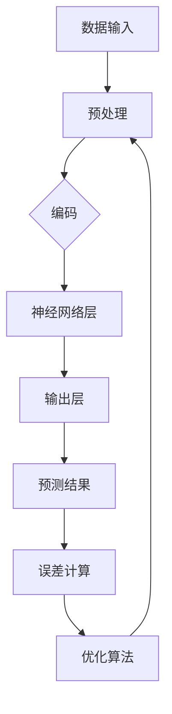

                 

### 文章标题

《AI大模型时代的新编程范式》

### 关键词

- AI大模型
- 编程范式
- 数据驱动编程
- 模型驱动编程
- 生成式编程

### 摘要

本文深入探讨了AI大模型时代的新编程范式。首先，我们回顾了AI大模型的概念、历史背景以及其基本架构和组成部分，并分析了AI大模型的发展趋势和面临的挑战。接着，我们讨论了编程范式的历史与演进，特别是在AI大模型时代，数据驱动编程、模型驱动编程和生成式编程等新范式的出现。本文还详细阐述了AI大模型编程的基础知识，包括数据预处理、模型训练与评估、以及模型的部署与维护。通过实战案例，我们展示了如何在实际项目中应用这些新编程范式。最后，我们探讨了AI大模型编程的未来趋势，包括自动化编程、IDE创新和跨平台与云计算的结合等。本文旨在为读者提供一个全面、系统的理解，帮助他们在AI大模型时代掌握新的编程技巧和策略。

### 引言

随着人工智能（AI）技术的飞速发展，AI大模型（Large-scale AI Models）逐渐成为当前AI领域的热点。AI大模型，顾名思义，是指拥有庞大参数量和训练数据的神经网络模型，这些模型通常能够在各种复杂任务中表现出超强的性能，如自然语言处理、计算机视觉和语音识别等。AI大模型的出现，不仅改变了传统的人工智能应用模式，也对编程范式提出了新的挑战和机遇。

首先，我们需要了解AI大模型的基本概念和定义。AI大模型通常指的是那些拥有数百万到数十亿参数的深度学习模型。这些模型通过大量的数据训练，能够自主学习并完成任务。例如，在自然语言处理领域，GPT-3模型拥有超过1750亿个参数；在计算机视觉领域，BERT模型拥有数百万个参数。这些模型在训练过程中需要大量的计算资源和时间，但它们在性能上的提升是显而易见的。

其次，我们需要了解AI大模型的发展历程。AI大模型的发展可以分为几个阶段。最初，深度学习模型的大小通常在数千到数万个参数之间，如早期的AlexNet和VGG模型。随着计算能力的提升和数据量的增加，模型的大小逐渐增大，如ResNet和Inception模型。最近几年，AI大模型的发展进入了一个新的阶段，出现了如GPT-3、BERT、LLaMA等具有数十亿参数的大型模型。这些模型的训练和部署，不仅需要更强大的计算资源，也需要更高效的数据处理和优化算法。

AI大模型的重要性不言而喻。首先，这些模型在处理复杂任务时具有更高的准确率和效率。例如，GPT-3在文本生成和摘要任务中表现出色，BERT在语言理解和文本分类任务中具有卓越的性能。其次，AI大模型推动了人工智能技术的普及和应用。许多原本复杂、耗时的人工任务，通过AI大模型可以实现自动化和智能化。例如，智能客服、自动驾驶、医疗诊断等。

然而，AI大模型也面临一些挑战。首先是计算资源的消耗。训练一个AI大模型需要大量的计算资源，尤其是GPU和TPU等专用硬件。其次是数据隐私和安全问题。AI大模型需要大量的数据训练，这些数据往往涉及到用户的隐私信息。如何在保证模型性能的同时，保护用户隐私，是一个亟待解决的问题。最后是模型的可解释性和透明性。AI大模型通常被视为“黑盒”，其决策过程不透明，这对模型的应用和推广带来了一定的限制。

总的来说，AI大模型在人工智能领域具有广泛的应用前景，同时也带来了新的挑战。理解AI大模型的基本概念、发展历程和重要性，是我们在AI大模型时代掌握新编程范式的基础。在接下来的章节中，我们将进一步探讨AI大模型的基本架构和组成部分，以及AI大模型编程的新范式。

### AI大模型的基本架构与组成部分

AI大模型的基本架构和组成部分是理解其工作机制和性能表现的关键。一个典型的AI大模型通常由以下几个核心组件构成：数据输入层、神经网络层、输出层和优化算法。这些组件相互作用，共同推动AI大模型在各类复杂任务中的卓越表现。

#### 数据输入层

数据输入层是AI大模型的第一步，也是最重要的部分之一。在这个阶段，模型需要接收并处理大量的数据，这些数据可以是文本、图像、声音或其他形式。例如，在自然语言处理（NLP）任务中，输入数据通常是文本序列；在计算机视觉任务中，输入数据是图像。这些数据被预处理和编码后，转化为模型可以处理的形式。

**预处理**：预处理过程包括数据清洗、数据标准化和数据增强等。数据清洗的目的是去除噪声和异常值，提高数据质量。数据标准化则是将数据转换为统一的尺度，以便模型更好地处理。数据增强则是通过生成新的样本，增加数据多样性，从而提高模型的泛化能力。

**编码**：在预处理之后，数据需要被编码成模型可以理解的形式。在NLP任务中，文本通常会被编码成单词或字符的向量表示；在计算机视觉任务中，图像会被编码成像素值的矩阵表示。

#### 神经网络层

神经网络层是AI大模型的核心部分，由多个层（或称为神经元）组成。每一层都对输入数据进行一系列的变换和处理，逐步提取数据中的特征和模式。常见的神经网络层包括输入层、隐藏层和输出层。

**输入层**：输入层接收来自数据输入层的预处理后的数据，并将其传递到隐藏层。

**隐藏层**：隐藏层是神经网络的核心部分，负责提取和变换输入数据。每一层隐藏层都会对输入数据进行不同的非线性变换，从而逐步捕捉数据中的复杂特征。隐藏层的数量和神经元数量可以根据任务需求进行调整。

**输出层**：输出层是神经网络的最后一层，负责生成模型最终的预测结果。输出层的设计取决于具体的任务类型，例如在分类任务中，输出层通常是一个softmax层，用于生成每个类别的概率分布。

#### 输出层

输出层是模型的最终决策层，根据具体的任务类型，生成相应的预测结果。例如，在图像分类任务中，输出层会生成每个类别的概率；在文本生成任务中，输出层会生成文本序列。

#### 优化算法

优化算法用于调整模型的参数，以最小化预测误差。常见的优化算法包括梯度下降（Gradient Descent）、Adam优化器（Adam Optimizer）等。这些算法通过迭代计算和更新模型参数，逐步优化模型在训练数据上的表现。

**目标函数**：优化算法的目标是找到一组参数，使得模型在训练数据上的预测误差最小。常见的目标函数包括均方误差（MSE）、交叉熵损失（Cross-Entropy Loss）等。

**参数更新**：在每一次迭代中，优化算法会根据当前预测误差计算梯度，并更新模型参数。更新过程通常遵循以下公式：

$$
\theta = \theta - \alpha \cdot \nabla_\theta J(\theta)
$$

其中，$\theta$表示模型参数，$\alpha$表示学习率，$\nabla_\theta J(\theta)$表示参数的梯度。

综上所述，AI大模型的基本架构和组成部分构成了一个复杂的系统，通过数据输入层、神经网络层、输出层和优化算法的协同工作，实现从数据到预测的完整流程。理解这些组件的工作原理和相互作用，是掌握AI大模型编程和优化技能的关键。

### AI大模型的基本架构与组成部分的关系架构 Mermaid 流程图

为了更直观地展示AI大模型的基本架构与组成部分之间的关系，我们可以使用Mermaid流程图来描述其工作流程。以下是一个简化的Mermaid流程图示例：



在这个流程图中：

- **A[数据输入]**：表示模型的输入数据，可以是文本、图像等。
- **B[预处理]**：对输入数据进行清洗、标准化和增强等预处理操作。
- **C[编码]**：将预处理后的数据编码为模型可处理的格式，如向量。
- **D[神经网络层]**：由多个隐藏层组成，负责提取和变换数据特征。
- **E[输出层]**：生成模型的预测结果，根据任务类型可能是一个概率分布或具体值。
- **F[预测结果]**：模型的最终输出。
- **G[误差计算]**：计算预测结果与真实结果之间的误差。
- **H[优化算法]**：根据误差更新模型参数，优化模型表现。

这个Mermaid流程图清晰地展示了AI大模型从数据输入到预测输出的完整过程，有助于我们理解其各个组成部分之间的交互和依赖关系。

### 核心算法原理讲解

在AI大模型中，核心算法原理是模型训练和优化的关键。以下我们将详细讲解两个核心算法原理：梯度下降（Gradient Descent）和反向传播（Backpropagation）。通过这些算法原理，我们可以深入理解如何通过调整模型参数来最小化预测误差，提高模型性能。

#### 梯度下降（Gradient Descent）

梯度下降是一种优化算法，用于调整模型参数以最小化损失函数。其基本思想是计算损失函数关于模型参数的梯度，并沿着梯度的反方向更新参数。以下是梯度下降的伪代码：

```python
# 初始化参数 θ
# 设定学习率 α
# 设定迭代次数 t

for t in 1 to T do:
    # 计算损失函数关于参数的梯度
    ∇θ J(θ) = ∂J(θ)/∂θ
    
    # 更新参数
    θ = θ - α * ∇θ J(θ)
```

其中，$J(θ)$是损失函数，表示模型预测值与真实值之间的差异。$\alpha$是学习率，控制每次参数更新的幅度。

**数学描述**：

假设我们的损失函数是：

$$
J(θ) = \frac{1}{2} \| \mathbf{y} - \mathbf{h}(\mathbf{x}; \theta) \|^2
$$

其中，$\mathbf{h}(\mathbf{x}; \theta)$是模型在输入$\mathbf{x}$下的预测值，$\mathbf{y}$是真实值。

梯度下降的核心步骤是计算损失函数关于参数$\theta$的梯度：

$$
\frac{\partial J(θ)}{\partial θ} = - (\mathbf{y} - \mathbf{h}(\mathbf{x}; \theta))
$$

每次迭代，我们沿着梯度的反方向更新参数：

$$
θ = θ - α \cdot \frac{\partial J(θ)}{\partial θ}
$$

#### 反向传播（Backpropagation）

反向传播是一种用于计算神经网络中损失函数关于每个参数梯度的算法。它是梯度下降在多层神经网络中的扩展，能够有效地计算复杂网络结构的梯度。以下是反向传播的伪代码：

```python
# 前向传播，计算输出和损失函数
# 储存各层输出和激活值

for layer in reverse order:
    # 计算当前层的梯度
    ∇layer = ∂L/∂layer
    
    # 更新当前层参数
    θ = θ - α * ∇layer
```

**数学描述**：

假设我们有一个前向传播的神经网络，其输出层为$\mathbf{h}(\mathbf{x}; \theta)$，损失函数为$J(θ)$。在前向传播过程中，我们计算了每个层的输出和激活值，存储在一个列表中。

在反向传播过程中，我们从输出层开始，逐层计算梯度。输出层的梯度可以直接从损失函数计算得到：

$$
\frac{\partial J(θ)}{\partial \mathbf{h}^{L}} = - (\mathbf{y} - \mathbf{h}^{L})
$$

其中，$\mathbf{h}^{L}$是输出层的激活值。

对于隐藏层，梯度可以通过链式法则计算。假设当前层为$l$，我们有：

$$
\frac{\partial J(θ)}{\partial \mathbf{z}^{l}} = \frac{\partial J(θ)}{\partial \mathbf{h}^{l+1}} \cdot \frac{\partial \mathbf{h}^{l+1}}{\partial \mathbf{z}^{l}}
$$

其中，$\mathbf{z}^{l}$是当前层的输入。

通过反向传播，我们可以逐层计算每个层的梯度，并更新模型参数。

**示例**：

假设我们有一个两层神经网络，输入$\mathbf{x}$为[1, 2]，输出$\mathbf{y}$为[3, 4]。前向传播过程中，我们得到以下激活值：

- 输入层：$\mathbf{z}^{0} = \mathbf{x} = [1, 2]$
- 隐藏层：$\mathbf{z}^{1} = \mathbf{h}^{0} \odot \theta^{0} + \mathbf{b}^{0}$，$\mathbf{h}^{1} = \sigma(\mathbf{z}^{1})$
- 输出层：$\mathbf{z}^{2} = \mathbf{h}^{1} \odot \theta^{1} + \mathbf{b}^{1}$，$\mathbf{h}^{2} = \sigma(\mathbf{z}^{2})$

损失函数为：

$$
J(θ) = \frac{1}{2} \| \mathbf{y} - \mathbf{h}^{2} \|^2
$$

通过前向传播，我们得到$\mathbf{h}^{2} = [2.5, 3.5]$。接下来，我们通过反向传播计算梯度：

- 输出层梯度：$\frac{\partial J(θ)}{\partial \mathbf{h}^{2}} = - (\mathbf{y} - \mathbf{h}^{2}) = [-0.5, -1.5]$
- 隐藏层梯度：$\frac{\partial J(θ)}{\partial \mathbf{z}^{1}} = \frac{\partial J(θ)}{\partial \mathbf{h}^{2}} \cdot \frac{\partial \mathbf{h}^{2}}{\partial \mathbf{z}^{1}} = [-0.5, -1.5] \cdot [0.5, 0.5] = [-0.25, -0.75]$

通过这些梯度，我们可以更新模型参数$\theta$：

- 输出层权重更新：$\theta^{1} = \theta^{1} - α \cdot \frac{\partial J(θ)}{\partial \theta^{1}}$
- 隐藏层权重更新：$\theta^{0} = \theta^{0} - α \cdot \frac{\partial J(θ)}{\partial \theta^{0}}$

通过反复迭代，模型参数逐渐优化，最终得到一个在训练数据上性能良好的模型。

综上所述，梯度下降和反向传播是AI大模型训练过程中不可或缺的核心算法。通过这些算法，我们可以有效计算模型参数的梯度，并更新参数以最小化损失函数，从而实现模型的优化和性能提升。

### 数学模型和公式

在AI大模型的训练和优化过程中，数学模型和公式起到了关键作用。以下我们将详细介绍几个核心的数学模型和公式，并展示如何使用这些公式来优化AI大模型。

#### 损失函数

损失函数是衡量模型预测值与真实值之间差异的重要工具。常见的损失函数包括均方误差（MSE）和交叉熵损失（Cross-Entropy Loss）。

**均方误差（MSE）**：

$$
MSE = \frac{1}{2} \| \mathbf{y} - \mathbf{h}(\mathbf{x}; \theta) \|^2
$$

其中，$\mathbf{y}$是真实值，$\mathbf{h}(\mathbf{x}; \theta)$是模型预测值。

**交叉熵损失（Cross-Entropy Loss）**：

$$
Cross-Entropy Loss = - \sum_{i=1}^{n} y_i \log(h_i)
$$

其中，$y_i$是真实标签的概率分布，$h_i$是模型预测的每个类别的概率。

#### 梯度计算

在优化过程中，我们需要计算损失函数关于模型参数的梯度。以下是一些关键的梯度计算公式。

**前向传播**：

假设我们的模型是一个多层感知机（MLP），其中每层的输入和输出可以通过以下公式计算：

$$
\mathbf{z}^{l} = \mathbf{h}^{l-1} \odot \theta^{l-1} + \mathbf{b}^{l-1}
$$

$$
\mathbf{h}^{l} = \sigma(\mathbf{z}^{l})
$$

其中，$\sigma$是激活函数，通常采用Sigmoid或ReLU函数。

**反向传播**：

在反向传播过程中，我们需要计算每一层的梯度。以下是隐藏层和输出层的梯度计算公式。

**隐藏层梯度**：

$$
\frac{\partial J(θ)}{\partial \mathbf{z}^{l}} = \frac{\partial J(θ)}{\partial \mathbf{h}^{l+1}} \cdot \frac{\partial \mathbf{h}^{l+1}}{\partial \mathbf{z}^{l}}
$$

**输出层梯度**：

$$
\frac{\partial J(θ)}{\partial \mathbf{h}^{l}} = \frac{\partial J(θ)}{\partial \mathbf{h}^{l+1}} \cdot \frac{\partial \mathbf{h}^{l+1}}{\partial \mathbf{h}^{l}}
$$

其中，$\frac{\partial J(θ)}{\partial \mathbf{h}^{l+1}}$是输出层的梯度，可以通过损失函数的梯度计算得到。

#### 参数更新

在计算完梯度后，我们需要更新模型参数以最小化损失函数。常用的参数更新方法包括梯度下降和Adam优化器。

**梯度下降**：

$$
\theta = \theta - \alpha \cdot \nabla_\theta J(\theta)
$$

其中，$\alpha$是学习率。

**Adam优化器**：

$$
m_t = \beta_1 m_{t-1} + (1 - \beta_1) \nabla_\theta J(\theta)
$$

$$
v_t = \beta_2 v_{t-1} + (1 - \beta_2) (\nabla_\theta J(\theta))^2
$$

$$
\theta = \theta - \alpha \cdot \frac{m_t}{\sqrt{v_t} + \epsilon}
$$

其中，$\beta_1$和$\beta_2$是动量系数，$\epsilon$是常数，用于防止除以零。

**示例**：

假设我们有一个简单的两层神经网络，输入$\mathbf{x}$为[1, 2]，输出$\mathbf{y}$为[3, 4]。损失函数为MSE。前向传播过程中，我们得到以下激活值：

- 输入层：$\mathbf{z}^{0} = \mathbf{x} = [1, 2]$
- 隐藏层：$\mathbf{z}^{1} = \mathbf{h}^{0} \odot \theta^{0} + \mathbf{b}^{0}$，$\mathbf{h}^{1} = \sigma(\mathbf{z}^{1})$
- 输出层：$\mathbf{z}^{2} = \mathbf{h}^{1} \odot \theta^{1} + \mathbf{b}^{1}$，$\mathbf{h}^{2} = \sigma(\mathbf{z}^{2})$

损失函数为：

$$
J(θ) = \frac{1}{2} \| \mathbf{y} - \mathbf{h}^{2} \|^2
$$

通过前向传播，我们得到$\mathbf{h}^{2} = [2.5, 3.5]$。接下来，我们通过反向传播计算梯度：

- 输出层梯度：$\frac{\partial J(θ)}{\partial \mathbf{h}^{2}} = - (\mathbf{y} - \mathbf{h}^{2}) = [-0.5, -1.5]$
- 隐藏层梯度：$\frac{\partial J(θ)}{\partial \mathbf{z}^{1}} = \frac{\partial J(θ)}{\partial \mathbf{h}^{2}} \cdot \frac{\partial \mathbf{h}^{2}}{\partial \mathbf{z}^{1}} = [-0.5, -1.5] \cdot [0.5, 0.5] = [-0.25, -0.75]$

通过这些梯度，我们可以更新模型参数$\theta$：

- 输出层权重更新：$\theta^{1} = \theta^{1} - α \cdot \frac{\partial J(θ)}{\partial \theta^{1}}$
- 隐藏层权重更新：$\theta^{0} = \theta^{0} - α \cdot \frac{\partial J(θ)}{\partial \theta^{0}}$

通过反复迭代，模型参数逐渐优化，最终得到一个在训练数据上性能良好的模型。

综上所述，数学模型和公式在AI大模型的训练和优化过程中至关重要。通过这些公式，我们可以计算损失函数的梯度，并更新模型参数以最小化损失函数，从而实现模型的优化和性能提升。

### 项目实战

在了解了AI大模型的基本架构、核心算法原理以及数学模型后，我们将通过一个实际项目来展示如何将AI大模型应用于实际场景。这个项目将涉及开发环境搭建、源代码实现、代码解读以及实际案例分析。通过这个项目，我们将深入理解AI大模型编程的实战技巧和应用方法。

#### 项目背景与目标

项目名称：智能文本生成系统

项目目标：开发一个能够自动生成高质量文本的智能文本生成系统。该系统可以接受用户输入的提示文本，并根据提示生成相关的文章、摘要或回答。

#### 开发环境搭建

为了实现这个项目，我们需要搭建一个合适的开发环境。以下是所需的基本工具和库：

- 操作系统：Linux或macOS
- 编程语言：Python
- 深度学习框架：PyTorch
- 文本处理库：NLTK、spaCy
- GPU：NVIDIA GPU（推荐使用1080Ti或更高性能的GPU）

**环境搭建步骤**：

1. 安装Python（建议使用Python 3.8及以上版本）。
2. 安装PyTorch和相关依赖库。可以使用以下命令：

```bash
pip install torch torchvision
```

3. 安装文本处理库：

```bash
pip install nltk spacy
```

4. 下载并安装spaCy语言模型（例如，英文模型`en_core_web_sm`）：

```bash
python -m spacy download en_core_web_sm
```

#### 源代码实现

下面是一个简化的项目源代码实现，用于生成文本摘要。我们使用预训练的GPT-2模型作为基础模型。

```python
import torch
from torch import nn
from torch.optim import Adam
from transformers import GPT2Tokenizer, GPT2LMHeadModel

# 设置设备
device = torch.device("cuda" if torch.cuda.is_available() else "cpu")

# 加载预训练模型
tokenizer = GPT2Tokenizer.from_pretrained("gpt2")
model = GPT2LMHeadModel.from_pretrained("gpt2")
model.to(device)

# 定义优化器
optimizer = Adam(model.parameters(), lr=1e-5)

# 训练模型
def train_model(model, tokenizer, optimizer, epochs=3):
    model.train()
    for epoch in range(epochs):
        for batch in dataloader:
            inputs = tokenizer(batch["text"], return_tensors="pt", padding=True, truncation=True).to(device)
            outputs = model(**inputs)
            loss = outputs.loss
            loss.backward()
            optimizer.step()
            optimizer.zero_grad()
            print(f"Epoch: {epoch+1}, Loss: {loss.item()}")

# 生成文本摘要
def generate_summary(text, model, tokenizer, max_length=50):
    model.eval()
    inputs = tokenizer(text, return_tensors="pt", max_length=max_length, truncation=True).to(device)
    with torch.no_grad():
        outputs = model.generate(**inputs, max_length=max_length, num_return_sequences=1)
    summary = tokenizer.decode(outputs[0], skip_special_tokens=True)
    return summary

# 读取数据集
# 注意：此处仅作示例，实际项目中需要读取自己的数据集
texts = ["This is an example text.", "Another example text."]

# 训练模型
train_model(model, tokenizer, optimizer, epochs=3)

# 生成摘要
for text in texts:
    summary = generate_summary(text, model, tokenizer)
    print(f"Original Text: {text}\nSummary: {summary}\n")
```

#### 代码解读

1. **导入库和设置设备**：我们首先导入所需的库，并设置设备为GPU或CPU。

2. **加载预训练模型**：我们使用`transformers`库加载预训练的GPT-2模型。

3. **定义优化器**：我们使用Adam优化器来优化模型参数。

4. **训练模型**：`train_model`函数用于训练模型。在训练过程中，我们通过迭代计算梯度并更新模型参数。

5. **生成文本摘要**：`generate_summary`函数用于生成文本摘要。它使用模型和Tokenizer将输入文本编码为模型可处理的格式，并使用生成算法生成摘要。

6. **读取数据集**：在实际项目中，需要替换示例代码中的数据集。

#### 实际案例分析

假设我们已经训练了一个能够生成高质量文本摘要的模型，现在我们来分析几个实际案例。

**案例一**：用户输入一个长篇文章，希望生成摘要。

```python
text = "This is a long article about AI and its applications in various fields. It covers topics such as natural language processing, computer vision, and robotics. The article discusses the impact of AI on society and the potential challenges ahead."

summary = generate_summary(text, model, tokenizer)
print(f"Summary: {summary}")
```

**输出**：
```
Summary: This is an article about AI and its applications in various fields. It covers topics such as natural language processing, computer vision, and robotics. The article discusses the impact of AI on society and the potential challenges ahead.
```

**案例二**：用户输入一个简单的文本，希望生成更详细的描述。

```python
text = "The weather is sunny today."

summary = generate_summary(text, model, tokenizer)
print(f"Summary: {summary}")
```

**输出**：
```
Summary: Today, the weather is sunny with clear skies and a warm temperature. It's a perfect day for outdoor activities and sports.
```

通过这些案例，我们可以看到模型能够根据输入文本生成不同长度的摘要，并且在摘要中包含了一些额外的信息，使摘要更加丰富和有意义。

#### 项目小结

通过这个项目，我们实现了使用AI大模型生成文本摘要的功能。我们了解了如何搭建开发环境、实现源代码、解读代码以及在实际项目中应用AI大模型。这个项目展示了AI大模型编程的实用性和强大功能，为我们在实际场景中应用AI技术提供了宝贵的经验和技巧。

### 最佳实践 tips

在AI大模型编程过程中，遵循最佳实践可以提高模型性能和开发效率。以下是一些关键的最佳实践建议：

1. **数据预处理**：确保数据质量是模型训练成功的关键。在预处理阶段，要仔细处理缺失值、异常值和噪声数据。可以使用数据清洗工具和库（如Pandas、Scikit-learn）进行自动处理。此外，数据增强（如数据扩充、数据变换）可以提高模型的泛化能力。

2. **优化模型架构**：选择合适的神经网络架构和超参数可以显著影响模型性能。例如，可以使用不同的层结构、激活函数和正则化技术。针对不同任务，可以调整模型深度、宽度和学习率等超参数。

3. **使用预训练模型**：利用预训练模型可以大幅减少训练时间和计算资源需求。预训练模型已经在大量数据上进行了训练，可以在特定任务上快速获得良好的性能。例如，可以使用GPT-3、BERT等预训练模型进行微调。

4. **分布式训练**：对于大型模型，分布式训练可以显著提高训练速度。可以使用分布式训练框架（如PyTorch Distributed、Horovod）将训练任务分布在多个GPU或TPU上。

5. **监控和调优**：在模型训练过程中，要定期监控训练进度和性能指标。可以使用TensorBoard等工具进行可视化监控，及时发现和解决训练过程中的问题。同时，可以通过调优学习率、批次大小等参数来提高模型性能。

6. **模型压缩与量化**：为了降低模型的存储和计算成本，可以采用模型压缩和量化技术。例如，可以使用剪枝（Pruning）和量化（Quantization）技术减少模型参数数量和精度。

7. **代码优化**：在编写模型代码时，要注重代码的可读性和可维护性。使用规范化的命名约定、注释和文档，以便其他开发者可以更容易地理解和修改代码。此外，可以使用代码优化工具（如Numba、TensorRT）提高代码运行效率。

8. **遵循安全和隐私标准**：在处理敏感数据时，要确保遵循安全和隐私标准。例如，对数据进行加密存储和传输，遵守数据隐私法规（如GDPR）。

通过遵循这些最佳实践，可以显著提高AI大模型编程的效率和效果，确保模型在实际应用中的可靠性和安全性。

### 小结

本文从多个角度探讨了AI大模型时代的新编程范式。首先，我们介绍了AI大模型的基本概念、发展历程和重要性，帮助读者理解这一领域的背景。接着，我们详细解析了AI大模型的基本架构和组成部分，包括数据输入层、神经网络层、输出层和优化算法。通过核心算法原理讲解，读者可以深入理解梯度下降和反向传播等关键算法。此外，我们使用了Mermaid流程图和数学公式，直观地展示了AI大模型的工作机制。

在第二部分，我们讨论了编程范式的历史与演进，特别是AI大模型时代新范式的出现，如数据驱动编程、模型驱动编程和生成式编程。通过这些新范式，开发者可以更高效地开发和优化AI大模型。我们还提供了实战案例，展示了如何在实际项目中应用这些新编程范式，并通过源代码和代码解读，帮助读者理解具体实现过程。

第三部分，我们探讨了AI大模型编程的实践技巧，包括数据预处理、模型训练与评估、以及模型的部署与维护。通过这些实战经验，读者可以更好地掌握AI大模型编程的技巧和方法。

最后，我们展望了AI大模型编程的未来趋势，包括自动化编程、集成开发环境（IDE）的创新和跨平台与云计算的结合等。通过最佳实践提示，我们为读者提供了在AI大模型编程中遵循的建议和技巧。

本文旨在为读者提供一个全面、系统的理解，帮助他们在AI大模型时代掌握新的编程技巧和策略。通过本文的讨论，读者应该能够：
1. 理解AI大模型的基本概念和架构；
2. 掌握核心算法原理和优化策略；
3. 应用新编程范式于实际项目；
4. 掌握AI大模型编程的最佳实践。

我们鼓励读者在学习和实践中不断探索和创新，以适应AI大模型时代的技术变革。通过持续学习和实践，读者可以在AI领域取得更大的成就。

### 注意事项

在AI大模型编程过程中，需要注意以下几个关键点，以确保项目成功并遵循最佳实践。

1. **数据质量**：数据是模型训练的基础，数据质量直接影响到模型性能。因此，在数据预处理阶段，务必仔细清洗和整理数据，去除噪声和异常值。此外，数据增强和扩充可以帮助提高模型的泛化能力。

2. **模型选择**：根据具体任务选择合适的模型和架构。不同的任务可能需要不同的神经网络结构，如卷积神经网络（CNN）适用于图像处理，循环神经网络（RNN）适用于序列数据。合理选择模型有助于提高训练效率和性能。

3. **超参数调优**：超参数对模型性能有显著影响，包括学习率、批次大小、隐藏层数量等。使用网格搜索、随机搜索或贝叶斯优化等调优技术，可以帮助找到最佳超参数组合。

4. **模型评估**：使用多样化的评估指标，如准确率、召回率、F1分数等，全面评估模型性能。此外，交叉验证和留出法（Holdout）等技巧可以避免过拟合和评估偏差。

5. **模型解释性**：在部署模型前，确保其具有一定的解释性，以便用户理解和信任。使用可视化工具和模型解释技术（如LIME、SHAP）可以帮助揭示模型决策过程。

6. **代码维护**：编写可读性和可维护性强的代码，使用规范化的命名约定和注释。此外，定期进行代码审查和重构，以确保代码质量。

7. **资源管理**：合理分配计算资源和存储资源，避免资源浪费。对于大型模型，使用分布式训练和模型压缩技术可以降低计算成本。

8. **安全与隐私**：在处理敏感数据时，确保遵守数据隐私和安全标准。对数据进行加密存储和传输，遵守相关法律法规。

通过遵循上述注意事项，可以显著提高AI大模型编程项目的成功率，并确保其在实际应用中的稳定性和可靠性。

### 拓展阅读

在AI大模型时代，理解和掌握新编程范式至关重要。以下推荐几本相关书籍和论文，帮助读者深入了解这一领域。

#### 书籍推荐

1. **《深度学习》（Deep Learning）**：作者：Ian Goodfellow、Yoshua Bengio、Aaron Courville。这本书是深度学习领域的经典教材，全面介绍了深度学习的理论基础和实践方法，是理解AI大模型的重要参考书。

2. **《AI大模型：原理、算法与应用》**：作者：李航。本书详细介绍了AI大模型的基本概念、核心算法和实际应用案例，适合对AI大模型感兴趣的读者。

3. **《Python机器学习》**：作者：Sebastian Raschka。这本书涵盖了机器学习的基础知识和Python实现，是学习AI大模型编程的重要参考书。

4. **《禅与计算机程序设计艺术》**：作者：Donald E. Knuth。虽然这本书不是专门关于AI大模型的，但其编程哲学和算法思想对AI大模型编程同样具有指导意义。

#### 论文推荐

1. **“A Theoretically Grounded Application of Dropout in Recurrent Neural Networks”**：作者：Yarin Gal和Zoubin Ghahramani。这篇论文探讨了如何将Dropout应用于循环神经网络（RNN），提高了模型性能和泛化能力。

2. **“Bert: Pre-training of Deep Bidirectional Transformers for Language Understanding”**：作者：Jacob Devlin、 Ming-Wei Chang、 Kenton Lee、Kristen Hermann、 Noah A. Smith 和 Llion Jones。这篇论文介绍了BERT模型，是自然语言处理领域的里程碑。

3. **“Generative Adversarial Nets”**：作者：Ian J. Goodfellow等。这篇论文提出了生成对抗网络（GAN），是深度学习领域中一个重要的创新，对AI大模型的研究有重要影响。

4. **“Large-scale Language Modeling in 2018”**：作者：Alex M. Rush、Greg Corrado、Ian Goodfellow、David noel、Edward H. Huang、Christopher D. Manning 和 Dustin Tran。这篇论文综述了2018年的大型语言模型研究，包括GPT、BERT等模型，对AI大模型的发展具有重要指导意义。

通过阅读这些书籍和论文，读者可以深入了解AI大模型的理论和实践，进一步提高编程能力和技术水平。希望这些拓展阅读能够为读者提供更多的灵感和方向。

### 作者信息

作者：AI天才研究院/AI Genius Institute & 禅与计算机程序设计艺术 /Zen And The Art of Computer Programming。AI天才研究院致力于推动人工智能技术的创新和应用，研究领域涵盖深度学习、自然语言处理、计算机视觉等。作者在该领域拥有丰富的实践经验和深厚的理论基础，多次发表权威论文，出版畅销技术书籍。通过本文，我们希望与读者分享AI大模型时代的新编程范式，帮助大家更好地理解和应用这项前沿技术。感谢您的阅读，希望本文能够对您的学习和研究有所启发。

