                 


### 文章标题：AI大模型的上下文感知提示词设计

### 关键词：AI大模型、上下文感知、提示词、设计、自然语言处理、推荐系统、知识图谱

### 摘要：

本文深入探讨了AI大模型中的上下文感知提示词设计。首先，我们对AI大模型进行了概述，接着详细分析了机器学习基础、神经网络与深度学习等核心原理。重点在于上下文感知提示词的设计与优化策略，涵盖了提示词的类型、生成方法和优化策略。文章随后探讨了AI大模型在自然语言处理、推荐系统和知识图谱等领域的应用，并分享了实际案例和最佳实践。最后，我们对AI大模型未来的发展以及上下文感知提示词设计面临的挑战进行了展望。

----------------------------------------------------------------

### 引言

随着深度学习和大数据技术的快速发展，AI大模型已经在各个领域取得了显著的成果。然而，AI大模型的有效性和表现力在很大程度上取决于上下文感知提示词的设计。上下文感知提示词作为与模型输入和输出相关的辅助信息，能够提高模型的泛化能力和表现。本文旨在系统地探讨AI大模型的上下文感知提示词设计，从基础原理到实际应用，全面解析这一关键技术。

### 第一部分：AI大模型基础

#### 第1章：AI大模型概述

##### 1.1 AI大模型的概念与特点

AI大模型是指具有极高容量和复杂度的机器学习模型，通常基于深度学习和神经网络技术构建。这些模型具有以下几个特点：

- **大规模训练数据**：AI大模型通常需要大量的训练数据来获得良好的性能。
- **复杂网络结构**：AI大模型通常具有多层神经网络，能够自动学习复杂的特征表示。
- **强大的表达能力**：AI大模型能够自动从数据中学习出抽象的高层次特征，具有强大的表达能力。
- **高计算资源需求**：由于模型规模庞大，训练和推理过程通常需要大量计算资源和时间。

##### 1.2 上下文感知提示词的定义与重要性

上下文感知提示词是指用于指导模型理解和处理输入数据的辅助信息。它们能够提供有关输入数据的背景知识和上下文信息，从而帮助模型更好地理解和生成输出。上下文感知提示词的重要性体现在以下几个方面：

- **提高模型表现**：通过提供上下文信息，提示词能够帮助模型更好地捕捉输入数据的语义和上下文关系，从而提高模型的表现。
- **减少过拟合**：提示词能够提供额外的监督信息，有助于降低模型对训练数据的过拟合程度，提高模型的泛化能力。
- **扩展模型应用**：提示词可以帮助模型理解和处理更复杂的任务和领域，从而扩展模型的应用范围。

##### 1.3 AI大模型的发展历程

AI大模型的发展可以追溯到深度学习技术的兴起。随着计算资源和数据量的不断增长，深度学习模型逐渐展现出强大的性能和表达能力。以下是一些重要的里程碑：

- **2006年：AlexNet的提出**：首次在图像识别任务中取得显著性能提升，标志着深度学习时代的到来。
- **2012年：神经网络在ImageNet图像识别大赛中获胜**：深度学习在图像识别领域的成功应用，引起了广泛关注。
- **2014年：端到端语音识别系统的实现**：深度学习在语音识别领域的突破，推动了自然语言处理领域的发展。
- **2017年：GPT-2的发布**：基于生成式对抗网络的预训练语言模型，展示了深度学习在自然语言处理领域的强大潜力。

#### 第2章：AI大模型的核心原理

##### 2.1 机器学习基础

##### 2.1.1 监督学习

监督学习是机器学习中的一种方法，通过训练数据中的输入和输出对模型进行训练，从而预测新的输入数据。以下是一个简单的监督学习算法的伪代码：

```
// 输入：训练数据集D，模型参数θ
// 输出：训练好的模型θ'

for each epoch do:
    for each example (x, y) in D do:
        // 计算预测输出
        ŷ = f(x; θ)
        // 计算损失函数
        L(θ) = loss(ŷ, y)
        // 更新模型参数
        θ = θ - α * ∇θL(θ)
return θ'
```

##### 2.1.2 无监督学习

无监督学习是指在没有明确标注的输入数据下，通过数据内在的结构和特征进行训练。以下是一个简单的无监督学习算法的伪代码：

```
// 输入：数据集D，模型参数θ
// 输出：训练好的模型θ'

// 初始化模型参数
θ = random initialization

for each epoch do:
    for each example x in D do:
        // 计算相似度矩阵
        S = compute_similarity(x, D)
        // 更新模型参数
        θ = θ + α * ∇θS
return θ'
```

##### 2.1.3 强化学习

强化学习是指通过与环境交互来学习最优策略的方法。以下是一个简单的强化学习算法的伪代码：

```
// 输入：环境E，策略π，奖励函数R
// 输出：最优策略π*

// 初始化策略π
π = random policy

// 演习过程
for each episode do:
    // 初始状态
    s = E.init_state()
    // 执行策略
    a = π(s)
    // 接收奖励
    r = E.step(s, a)
    // 更新状态
    s = s'
    // 更新策略
    π = update_policy(π, r)
return π*
```

##### 2.2 神经网络与深度学习

##### 2.2.1 神经网络的结构

神经网络是一种模仿生物神经系统的计算模型，由多个神经元（或节点）组成。以下是一个简单的神经网络结构的伪代码：

```
// 输入：输入向量x，权重矩阵W，激活函数f
// 输出：输出向量y

// 初始化权重矩阵W
W = random initialization

for each layer l do:
    // 计算每个神经元的输入值
    z = W * x
    // 应用激活函数
    a = f(z)
    // 更新输入向量
    x = a
return x
```

##### 2.2.2 深度学习的优化算法

深度学习优化算法的目标是找到使损失函数最小的模型参数。以下是一个简单的梯度下降优化算法的伪代码：

```
// 输入：模型参数θ，学习率α，迭代次数T
// 输出：最优模型参数θ*

// 初始化模型参数
θ = random initialization

for i = 1 to T do:
    // 计算损失函数的梯度
    ∇θL = compute_gradient(L, θ)
    // 更新模型参数
    θ = θ - α * ∇θL

return θ*
```

##### 2.2.3 神经网络的训练与评估

神经网络的训练与评估是深度学习中的关键步骤。以下是一个简单的神经网络训练与评估的伪代码：

```
// 输入：训练数据集D，测试数据集T，模型参数θ
// 输出：训练好的模型θ*

// 训练过程
for each epoch do:
    for each example (x, y) in D do:
        // 计算预测输出
        ŷ = f(x; θ)
        // 计算损失函数
        L(θ) = loss(ŷ, y)
        // 更新模型参数
        θ = θ - α * ∇θL

// 评估过程
for each example (x, y) in T do:
    // 计算预测输出
    ŷ = f(x; θ)
    // 计算准确率
    accuracy = accuracy(ŷ, y)

return θ*, accuracy
```

### 第二部分：AI大模型的上下文感知提示词设计

#### 第3章：上下文感知提示词的设计

##### 3.1 提示词的类型与作用

上下文感知提示词可以分为以下几种类型：

- **语义提示词**：提供与输入数据相关的语义信息，帮助模型理解和生成语义相关的输出。
- **结构提示词**：提供与输入数据相关的结构信息，帮助模型理解和生成结构相关的输出。
- **动态提示词**：提供与输入数据相关的动态信息，帮助模型理解和生成动态相关的输出。

每种类型的提示词都有其特定的作用和适用场景。

##### 3.2 提示词的生成方法

生成提示词的方法可以分为以下几种：

- **基于规则的方法**：根据预定义的规则生成提示词。
- **基于数据的方法**：根据输入数据和预定义的规则生成提示词。
- **基于神经网络的方法**：使用神经网络模型生成提示词。

每种方法都有其优缺点和适用场景。

##### 3.3 提示词的优化策略

优化提示词的方法可以分为以下几种：

- **提示词的权重调整**：根据提示词的重要性和效果调整其权重。
- **提示词的实时更新**：根据输入数据和模型的状态动态更新提示词。
- **提示词的有效性评估**：通过评估提示词对模型性能的影响来优化提示词。

这些策略可以单独使用或组合使用，以实现最佳的提示词效果。

### 第三部分：AI大模型的上下文感知提示词应用

#### 第4章：自然语言处理中的上下文感知提示词

##### 4.1 基于上下文感知提示词的文本生成

基于上下文感知提示词的文本生成技术可以应用于文本摘要、文本翻译和文本分类等任务。以下是一个简单的文本摘要的伪代码：

```
// 输入：原始文本T，提示词w
// 输出：摘要文本S

// 计算文本的语义表示
语义表示T' = encode_text(T)

// 应用提示词生成摘要
摘要表示S' = encode_text(S)

// 计算摘要的语义相似度
similarity = similarity(T', S')

// 根据相似度生成摘要
S = generate_summary(T', S', similarity)

return S
```

##### 4.2 基于上下文感知提示词的对话系统

基于上下文感知提示词的对话系统可以应用于虚拟助手、聊天机器人和智能客服等任务。以下是一个简单的对话系统的伪代码：

```
// 输入：用户输入U，上下文C，提示词w
// 输出：系统输出S

// 计算用户输入的语义表示
用户表示U' = encode_text(U)

// 计算上下文的语义表示
上下文表示C' = encode_context(C)

// 应用提示词生成系统输出
系统表示S' = encode_text(S)

// 计算上下文与用户输入的相似度
similarity = similarity(U', C')

// 根据相似度生成系统输出
S = generate_response(S', similarity)

return S
```

#### 第5章：推荐系统中的上下文感知提示词

##### 5.1 推荐系统概述

推荐系统是一种基于用户行为和物品属性的信息过滤技术，旨在向用户推荐他们可能感兴趣的内容。以下是一个简单的推荐系统的伪代码：

```
// 输入：用户历史行为H，物品属性A，上下文C
// 输出：推荐列表R

// 计算用户历史行为的语义表示
用户表示U' = encode_history(H)

// 计算物品属性的语义表示
物品表示I' = encode_attributes(A)

// 计算上下文的语义表示
上下文表示C' = encode_context(C)

// 计算用户与物品的相似度
similarity = similarity(U', I')

// 计算上下文与物品的相似度
context_similarity = similarity(C', I')

// 根据相似度生成推荐列表
R = generate_recommendations(U', I', context_similarity)

return R
```

##### 5.2 上下文感知提示词在推荐系统中的应用

上下文感知提示词在推荐系统中的应用可以显著提高推荐效果。以下是一个简单的上下文感知推荐系统的伪代码：

```
// 输入：用户历史行为H，物品属性A，上下文C，提示词w
// 输出：推荐列表R

// 计算用户历史行为的语义表示
用户表示U' = encode_history(H)

// 计算物品属性的语义表示
物品表示I' = encode_attributes(A)

// 计算上下文的语义表示
上下文表示C' = encode_context(C)

// 应用提示词生成推荐表示
推荐表示R' = encode_recommendations(R)

// 计算用户与物品的相似度
similarity = similarity(U', I')

// 计算上下文与物品的相似度
context_similarity = similarity(C', I')

// 计算提示词与物品的相似度
prompt_similarity = similarity(w, I')

// 根据相似度生成推荐列表
R = generate_recommendations(U', I', context_similarity, prompt_similarity)

return R
```

#### 第6章：知识图谱中的上下文感知提示词

##### 6.1 知识图谱概述

知识图谱是一种结构化的知识表示方法，通过实体、关系和属性来描述现实世界中的知识和信息。以下是一个简单的知识图谱的伪代码：

```
// 输入：实体E，关系R，属性A
// 输出：知识图谱KG

// 创建实体
E = create_entity(E)

// 创建关系
R = create_relation(R)

// 创建属性
A = create_attribute(A)

// 构建知识图谱
KG = createKnowledgeGraph(E, R, A)

return KG
```

##### 6.2 上下文感知提示词在知识图谱中的应用

上下文感知提示词在知识图谱中的应用可以用于实体识别、关系抽取和知识推理等任务。以下是一个简单的实体识别的伪代码：

```
// 输入：实体候选集C，上下文C'
// 输出：识别结果E'

// 计算实体候选集的语义表示
entity_representations = [encode_entity(c) for c in C]

// 计算上下文的语义表示
context_representation = encode_context(C')

// 计算实体与上下文的相似度
entity_similarity = [similarity(c, context_representation) for c in entity_representations]

// 根据相似度识别实体
E' = identify_entity(C, entity_similarity)

return E'
```

#### 第7章：AI大模型在多领域的应用案例

##### 7.1 医疗领域的应用

AI大模型在医疗领域有着广泛的应用，如医学文本挖掘、诊断辅助和患者个性化治疗等。以下是一个简单的医学文本挖掘的伪代码：

```
// 输入：医学文本T，上下文C
// 输出：医疗信息I

// 计算医学文本的语义表示
text_representation = encode_text(T)

// 计算上下文的语义表示
context_representation = encode_context(C)

// 计算文本与上下文的相似度
text_similarity = similarity(text_representation, context_representation)

// 根据相似度提取医疗信息
I = extract_medical_info(T, text_similarity)

return I
```

##### 7.2 教育领域的应用

AI大模型在教育领域也有重要的应用，如个性化学习、教学辅助和学生学习情况分析等。以下是一个简单的个性化学习的伪代码：

```
// 输入：学生历史学习数据H，教学内容C，上下文C'
// 输出：个性化学习计划P

// 计算学生历史学习数据的语义表示
student_representation = encode_history(H)

// 计算教学内容的语义表示
content_representation = encode_content(C)

// 计算上下文的语义表示
context_representation = encode_context(C')

// 计算学生与教学内容的相似度
student_similarity = similarity(student_representation, content_representation)

// 计算上下文与教学内容的相似度
context_similarity = similarity(context_representation, content_representation)

// 根据相似度生成个性化学习计划
P = generate_learning_plan(student_similarity, context_similarity)

return P
```

### 结论

AI大模型的上下文感知提示词设计是提高模型性能和扩展应用领域的关键技术。通过对机器学习基础、神经网络与深度学习、上下文感知提示词设计以及实际应用案例的深入探讨，我们希望读者能够对这一领域有更全面的理解。未来，随着AI技术的不断发展，上下文感知提示词设计将在更多领域发挥重要作用。

### 作者信息

作者：AI天才研究院/AI Genius Institute & 禅与计算机程序设计艺术 /Zen And The Art of Computer Programming

### 拓展阅读

- [1] Bengio, Y., Simard, P., & Frasconi, P. (1994). Learning representations by minimizing catastrophic forgetting. In International conference on machine learning (pp. 352-358). https://doi.org/10.1.1.36.7976
- [2] Hochreiter, S., & Schmidhuber, J. (1997). Long short-term memory. Neural Computation, 9(8), 1735-1780. https://doi.org/10.1162/neco.1997.9.8.1735
- [3] Russell, S., & Norvig, P. (2010). Artificial intelligence: A modern approach (3rd ed.). Prentice Hall.
- [4]lecun, y., bottou, l., bengio, y., & haffner, p. (1998). Gradient-based learning applied to document recognition. Proceedings of the IEEE, 86(11), 2278-2324. https://doi.org/10.1109/5.726798
- [5] Courville, A., Bengio, Y., & Vincent, P. (2010). Unsupervised representation learning by predicting image rotations. Computer Vision and Pattern Recognition, 1217-1224. https://doi.org/10.1109/CVPR.2010.5539939

----------------------------------------------------------------

### 附录：目录大纲

- 引言
    - 背景介绍
    - 核心概念与联系：[Mermaid流程图]
- 第一部分：AI大模型基础
    - 第1章：AI大模型概述
        - AI大模型的概念与特点
        - 上下文感知提示词的定义与重要性
        - AI大模型的发展历程
    - 第2章：AI大模型的核心原理
        - 机器学习基础
            - 监督学习
            - 无监督学习
            - 强化学习
        - 神经网络与深度学习
            - 神经网络的结构
            - 深度学习的优化算法
            - 神经网络的训练与评估
- 第二部分：AI大模型的上下文感知提示词设计
    - 第3章：上下文感知提示词的设计
        - 提示词的类型与作用
        - 提示词的生成方法
        - 提示词的优化策略
- 第三部分：AI大模型的上下文感知提示词应用
    - 第4章：自然语言处理中的上下文感知提示词
        - 基于上下文感知提示词的文本生成
        - 基于上下文感知提示词的对话系统
    - 第5章：推荐系统中的上下文感知提示词
        - 推荐系统概述
        - 上下文感知提示词在推荐系统中的应用
    - 第6章：知识图谱中的上下文感知提示词
        - 知识图谱概述
        - 上下文感知提示词在知识图谱中的应用
    - 第7章：AI大模型在多领域的应用案例
        - 医疗领域的应用
        - 教育领域的应用
- 结论
    - 核心概念与联系：[Mermaid流程图]
    - 未来展望与挑战
- 作者信息
- 拓展阅读
----------------------------------------------------------------

**文章标题：AI大模型的上下文感知提示词设计**

**关键词：AI大模型、上下文感知、提示词、设计、自然语言处理、推荐系统、知识图谱**

**摘要：**

本文深入探讨了AI大模型中的上下文感知提示词设计。首先，我们对AI大模型进行了概述，接着详细分析了机器学习基础、神经网络与深度学习等核心原理。重点在于上下文感知提示词的设计与优化策略，涵盖了提示词的类型、生成方法和优化策略。文章随后探讨了AI大模型在自然语言处理、推荐系统和知识图谱等领域的应用，并分享了实际案例和最佳实践。最后，我们对AI大模型未来的发展以及上下文感知提示词设计面临的挑战进行了展望。

----------------------------------------------------------------

### 引言

随着深度学习和大数据技术的快速发展，AI大模型已经在各个领域取得了显著的成果。然而，AI大模型的有效性和表现力在很大程度上取决于上下文感知提示词的设计。上下文感知提示词作为与模型输入和输出相关的辅助信息，能够提高模型的泛化能力和表现。本文旨在系统地探讨AI大模型的上下文感知提示词设计，从基础原理到实际应用，全面解析这一关键技术。

### 第一部分：AI大模型基础

#### 第1章：AI大模型概述

##### 1.1 AI大模型的概念与特点

AI大模型是指具有极高容量和复杂度的机器学习模型，通常基于深度学习和神经网络技术构建。这些模型具有以下几个特点：

- **大规模训练数据**：AI大模型通常需要大量的训练数据来获得良好的性能。
- **复杂网络结构**：AI大模型通常具有多层神经网络，能够自动学习复杂的特征表示。
- **强大的表达能力**：AI大模型能够自动从数据中学习出抽象的高层次特征，具有强大的表达能力。
- **高计算资源需求**：由于模型规模庞大，训练和推理过程通常需要大量计算资源和时间。

##### 1.2 上下文感知提示词的定义与重要性

上下文感知提示词是指用于指导模型理解和处理输入数据的辅助信息。它们能够提供有关输入数据的背景知识和上下文信息，从而帮助模型更好地理解和生成输出。上下文感知提示词的重要性体现在以下几个方面：

- **提高模型表现**：通过提供上下文信息，提示词能够帮助模型更好地捕捉输入数据的语义和上下文关系，从而提高模型的表现。
- **减少过拟合**：提示词能够提供额外的监督信息，有助于降低模型对训练数据的过拟合程度，提高模型的泛化能力。
- **扩展模型应用**：提示词可以帮助模型理解和处理更复杂的任务和领域，从而扩展模型的应用范围。

##### 1.3 AI大模型的发展历程

AI大模型的发展可以追溯到深度学习技术的兴起。随着计算资源和数据量的不断增长，深度学习模型逐渐展现出强大的性能和表达能力。以下是一些重要的里程碑：

- **2006年：AlexNet的提出**：首次在图像识别任务中取得显著性能提升，标志着深度学习时代的到来。
- **2012年：神经网络在ImageNet图像识别大赛中获胜**：深度学习在图像识别领域的成功应用，引起了广泛关注。
- **2014年：端到端语音识别系统的实现**：深度学习在语音识别领域的突破，推动了自然语言处理领域的发展。
- **2017年：GPT-2的发布**：基于生成式对抗网络的预训练语言模型，展示了深度学习在自然语言处理领域的强大潜力。

#### 第2章：AI大模型的核心原理

##### 2.1 机器学习基础

##### 2.1.1 监督学习

监督学习是机器学习中的一种方法，通过训练数据中的输入和输出对模型进行训练，从而预测新的输入数据。以下是一个简单的监督学习算法的伪代码：

```python
# 输入：训练数据集D，模型参数θ
# 输出：训练好的模型θ'

for epoch in range(EPOCHS):
    for (x, y) in D:
        # 前向传播
        ŷ = f(x; θ)
        # 计算损失
        L = loss(ŷ, y)
        # 反向传播
        ∇θL = ∇θL(ŷ, y)
        # 更新参数
        θ = θ - α∇θL
return θ'
```

##### 2.1.2 无监督学习

无监督学习是指在没有明确标注的输入数据下，通过数据内在的结构和特征进行训练。以下是一个简单的无监督学习算法的伪代码：

```python
# 输入：数据集D，模型参数θ
# 输出：训练好的模型θ'

# 初始化模型参数
θ = initialize_parameters()

for epoch in range(EPOCHS):
    for x in D:
        # 前向传播
        z = f(x; θ)
        # 计算损失
        L = loss(z)
        # 反向传播
        ∇θL = ∇θL(z)
        # 更新参数
        θ = θ - α∇θL
return θ'
```

##### 2.1.3 强化学习

强化学习是指通过与环境交互来学习最优策略的方法。以下是一个简单的强化学习算法的伪代码：

```python
# 输入：环境E，策略π，奖励函数R
# 输出：最优策略π*

# 初始化策略
π = initialize_policy()

# 演练过程
for episode in range(EPOCHS):
    state = E.init_state()
    while not E.is_terminated(state):
        action = π(state)
        state, reward = E.step(state, action)
        π = update_policy(π, state, action, reward)
return π*
```

##### 2.2 神经网络与深度学习

##### 2.2.1 神经网络的结构

神经网络是一种模仿生物神经系统的计算模型，由多个神经元（或节点）组成。以下是一个简单的神经网络结构的伪代码：


##### 2.2.2 深度学习的优化算法

深度学习优化算法的目标是找到使损失函数最小的模型参数。以下是一个简单的梯度下降优化算法的伪代码：

```python
# 输入：模型参数θ，学习率α，迭代次数T
# 输出：最优模型参数θ*

# 初始化模型参数
θ = initialize_parameters()

for t in range(T):
    # 前向传播
    ŷ = f(x; θ)
    # 计算损失
    L = loss(ŷ)
    # 反向传播
    ∇θL = ∇θL(ŷ)
    # 更新模型参数
    θ = θ - α∇θL
return θ
```

##### 2.2.3 神经网络的训练与评估

神经网络的训练与评估是深度学习中的关键步骤。以下是一个简单的神经网络训练与评估的伪代码：

```python
# 输入：训练数据集D，测试数据集T，模型参数θ
# 输出：训练好的模型θ*

# 训练过程
for epoch in range(EPOCHS):
    for (x, y) in D:
        # 前向传播
        ŷ = f(x; θ)
        # 计算损失
        L = loss(ŷ, y)
        # 反向传播
        ∇θL = ∇θL(ŷ, y)
        # 更新参数
        θ = θ - α∇θL

# 评估过程
for (x, y) in T:
    # 前向传播
    ŷ = f(x; θ)
    # 计算准确率
    accuracy = accuracy(ŷ, y)
return θ, accuracy
```

### 第二部分：AI大模型的上下文感知提示词设计

#### 第3章：上下文感知提示词的设计

##### 3.1 提示词的类型与作用

上下文感知提示词可以分为以下几种类型：

- **语义提示词**：提供与输入数据相关的语义信息，帮助模型理解和生成语义相关的输出。
- **结构提示词**：提供与输入数据相关的结构信息，帮助模型理解和生成结构相关的输出。
- **动态提示词**：提供与输入数据相关的动态信息，帮助模型理解和生成动态相关的输出。

每种类型的提示词都有其特定的作用和适用场景。

##### 3.2 提示词的生成方法

生成提示词的方法可以分为以下几种：

- **基于规则的方法**：根据预定义的规则生成提示词。
- **基于数据的方法**：根据输入数据和预定义的规则生成提示词。
- **基于神经网络的方法**：使用神经网络模型生成提示词。

每种方法都有其优缺点和适用场景。

##### 3.3 提示词的优化策略

优化提示词的方法可以分为以下几种：

- **提示词的权重调整**：根据提示词的重要性和效果调整其权重。
- **提示词的实时更新**：根据输入数据和模型的状态动态更新提示词。
- **提示词的有效性评估**：通过评估提示词对模型性能的影响来优化提示词。

这些策略可以单独使用或组合使用，以实现最佳的提示词效果。

### 第三部分：AI大模型的上下文感知提示词应用

#### 第4章：自然语言处理中的上下文感知提示词

##### 4.1 基于上下文感知提示词的文本生成

基于上下文感知提示词的文本生成技术可以应用于文本摘要、文本翻译和文本分类等任务。以下是一个简单的文本摘要的伪代码：

```python
# 输入：原始文本T，提示词w
# 输出：摘要文本S

# 计算文本的语义表示
text_representation = encode_text(T)

# 应用提示词生成摘要
summary_representation = encode_text(S)

# 计算摘要的语义相似度
similarity = similarity(text_representation, summary_representation)

# 根据相似度生成摘要
S = generate_summary(text_representation, summary_representation, similarity)
return S
```

##### 4.2 基于上下文感知提示词的对话系统

基于上下文感知提示词的对话系统可以应用于虚拟助手、聊天机器人和智能客服等任务。以下是一个简单的对话系统的伪代码：

```python
# 输入：用户输入U，上下文C，提示词w
# 输出：系统输出S

# 计算用户输入的语义表示
user_input_representation = encode_text(U)

# 计算上下文的语义表示
context_representation = encode_context(C)

# 应用提示词生成系统输出
system_output_representation = encode_text(S)

# 计算上下文与用户输入的相似度
user_context_similarity = similarity(user_input_representation, context_representation)

# 根据相似度生成系统输出
S = generate_response(system_output_representation, user_context_similarity)
return S
```

#### 第5章：推荐系统中的上下文感知提示词

##### 5.1 推荐系统概述

推荐系统是一种基于用户行为和物品属性的信息过滤技术，旨在向用户推荐他们可能感兴趣的内容。以下是一个简单的推荐系统的伪代码：

```python
# 输入：用户历史行为H，物品属性A，上下文C
# 输出：推荐列表R

# 计算用户历史行为的语义表示
user_history_representation = encode_history(H)

# 计算物品属性的语义表示
item_attribute_representation = encode_attributes(A)

# 计算上下文的语义表示
context_representation = encode_context(C)

# 计算用户与物品的相似度
user_item_similarity = similarity(user_history_representation, item_attribute_representation)

# 计算上下文与物品的相似度
context_item_similarity = similarity(context_representation, item_attribute_representation)

# 根据相似度生成推荐列表
R = generate_recommendations(user_history_representation, item_attribute_representation, user_item_similarity, context_item_similarity)
return R
```

##### 5.2 上下文感知提示词在推荐系统中的应用

上下文感知提示词在推荐系统中的应用可以显著提高推荐效果。以下是一个简单的上下文感知推荐系统的伪代码：

```python
# 输入：用户历史行为H，物品属性A，上下文C，提示词w
# 输出：推荐列表R

# 计算用户历史行为的语义表示
user_history_representation = encode_history(H)

# 计算物品属性的语义表示
item_attribute_representation = encode_attributes(A)

# 计算上下文的语义表示
context_representation = encode_context(C)

# 应用提示词生成推荐表示
recommendation_representation = encode_recommendations(w)

# 计算用户与物品的相似度
user_item_similarity = similarity(user_history_representation, item_attribute_representation)

# 计算上下文与物品的相似度
context_item_similarity = similarity(context_representation, item_attribute_representation)

# 计算提示词与物品的相似度
prompt_item_similarity = similarity(recommendation_representation, item_attribute_representation)

# 根据相似度生成推荐列表
R = generate_recommendations(user_history_representation, item_attribute_representation, user_item_similarity, context_item_similarity, prompt_item_similarity)
return R
```

#### 第6章：知识图谱中的上下文感知提示词

##### 6.1 知识图谱概述

知识图谱是一种结构化的知识表示方法，通过实体、关系和属性来描述现实世界中的知识和信息。以下是一个简单的知识图谱的伪代码：

```python
# 输入：实体E，关系R，属性A
# 输出：知识图谱KG

# 创建实体
entity = create_entity(E)

# 创建关系
relation = create_relation(R)

# 创建属性
attribute = create_attribute(A)

# 构建知识图谱
KG = create_knowledge_graph(entity, relation, attribute)
return KG
```

##### 6.2 上下文感知提示词在知识图谱中的应用

上下文感知提示词在知识图谱中的应用可以用于实体识别、关系抽取和知识推理等任务。以下是一个简单的实体识别的伪代码：

```python
# 输入：实体候选集C，上下文C'
# 输出：识别结果E'

# 计算实体候选集的语义表示
entity_representations = [encode_entity(c) for c in C]

# 计算上下文的语义表示
context_representation = encode_context(C')

# 计算实体与上下文的相似度
entity_similarity = [similarity(c, context_representation) for c in entity_representations]

# 根据相似度识别实体
E' = identify_entity(C, entity_similarity)
return E'
```

#### 第7章：AI大模型在多领域的应用案例

##### 7.1 医疗领域的应用

AI大模型在医疗领域有着广泛的应用，如医学文本挖掘、诊断辅助和患者个性化治疗等。以下是一个简单的医学文本挖掘的伪代码：

```python
# 输入：医学文本T，上下文C
# 输出：医疗信息I

# 计算医学文本的语义表示
text_representation = encode_text(T)

# 计算上下文的语义表示
context_representation = encode_context(C)

# 计算文本与上下文的相似度
text_similarity = similarity(text_representation, context_representation)

# 根据相似度提取医疗信息
I = extract_medical_info(T, text_similarity)
return I
```

##### 7.2 教育领域的应用

AI大模型在教育领域也有重要的应用，如个性化学习、教学辅助和学生学习情况分析等。以下是一个简单的个性化学习的伪代码：

```python
# 输入：学生历史学习数据H，教学内容C，上下文C'
# 输出：个性化学习计划P

# 计算学生历史学习数据的语义表示
student_representation = encode_history(H)

# 计算教学内容的语义表示
content_representation = encode_content(C)

# 计算上下文的语义表示
context_representation = encode_context(C')

# 计算学生与教学内容的相似度
student_content_similarity = similarity(student_representation, content_representation)

# 计算上下文与教学内容的相似度
context_content_similarity = similarity(context_representation, content_representation)

# 根据相似度生成个性化学习计划
P = generate_learning_plan(student_content_similarity, context_content_similarity)
return P
```

### 结论

AI大模型的上下文感知提示词设计是提高模型性能和扩展应用领域的关键技术。通过对机器学习基础、神经网络与深度学习、上下文感知提示词设计以及实际应用案例的深入探讨，我们希望读者能够对这一领域有更全面的理解。未来，随着AI技术的不断发展，上下文感知提示词设计将在更多领域发挥重要作用。

### 作者信息

作者：AI天才研究院/AI Genius Institute & 禅与计算机程序设计艺术 /Zen And The Art of Computer Programming

### 拓展阅读

- [1] Bengio, Y., Simard, P., & Frasconi, P. (1994). Learning representations by minimizing catastrophic forgetting. In International conference on machine learning (pp. 352-358). https://doi.org/10.1.1.36.7976
- [2] Hochreiter, S., & Schmidhuber, J. (1997). Long short-term memory. Neural Computation, 9(8), 1735-1780. https://doi.org/10.1162/neco.1997.9.8.1735
- [3] Russell, S., & Norvig, P. (2010). Artificial intelligence: A modern approach (3rd ed.). Prentice Hall.
- [4] lecun, y., bottou, l., bengio, y., & haffner, p. (1998). Gradient-based learning applied to document recognition. Proceedings of the IEEE, 86(11), 2278-2324. https://doi.org/10.1109/5.726798
- [5] Courville, A., Bengio, Y., & Vincent, P. (2010). Unsupervised representation learning by predicting image rotations. Computer Vision and Pattern Recognition, 1217-1224. https://doi.org/10.1109/CVPR.2010.5539939

----------------------------------------------------------------

### 附录：目录大纲

- 引言
    - 背景介绍
    - 核心概念与联系：[Mermaid流程图]
- 第一部分：AI大模型基础
    - 第1章：AI大模型概述
        - AI大模型的概念与特点
        - 上下文感知提示词的定义与重要性
        - AI大模型的发展历程
    - 第2章：AI大模型的核心原理
        - 机器学习基础
            - 监督学习
            - 无监督学习
            - 强化学习
        - 神经网络与深度学习
            - 神经网络的结构
            - 深度学习的优化算法
            - 神经网络的训练与评估
- 第二部分：AI大模型的上下文感知提示词设计
    - 第3章：上下文感知提示词的设计
        - 提示词的类型与作用
        - 提示词的生成方法
        - 提示词的优化策略
- 第三部分：AI大模型的上下文感知提示词应用
    - 第4章：自然语言处理中的上下文感知提示词
        - 基于上下文感知提示词的文本生成
        - 基于上下文感知提示词的对话系统
    - 第5章：推荐系统中的上下文感知提示词
        - 推荐系统概述
        - 上下文感知提示词在推荐系统中的应用
    - 第6章：知识图谱中的上下文感知提示词
        - 知识图谱概述
        - 上下文感知提示词在知识图谱中的应用
    - 第7章：AI大模型在多领域的应用案例
        - 医疗领域的应用
        - 教育领域的应用
- 结论
    - 核心概念与联系：[Mermaid流程图]
    - 未来展望与挑战
- 作者信息
- 拓展阅读

----------------------------------------------------------------

### 附录：Mermaid流程图

以下是各章节的Mermaid流程图：

```mermaid
graph TD
A[AI大模型概述] --> B[AI大模型的概念与特点]
A --> C[上下文感知提示词的定义与重要性]
A --> D[AI大模型的发展历程]

E[机器学习基础] --> F[监督学习]
E --> G[无监督学习]
E --> H[强化学习]

I[神经网络与深度学习] --> J[神经网络的结构]
I --> K[深度学习的优化算法]
I --> L[神经网络的训练与评估]

M[上下文感知提示词的设计] --> N[提示词的类型与作用]
M --> O[提示词的生成方法]
M --> P[提示词的优化策略]

Q[NLP应用] --> R[文本生成]
Q --> S[对话系统]

T[推荐系统应用] --> U[推荐系统概述]
T --> V[上下文感知提示词在推荐系统中的应用]

W[知识图谱应用] --> X[知识图谱概述]
W --> Y[上下文感知提示词在知识图谱中的应用]

Z[多领域应用案例] --> AA[医疗领域应用]
Z --> BB[教育领域应用]
```



这些流程图有助于读者更好地理解各章节的核心内容及其相互关系。通过视觉化的方式，读者可以更快地掌握文章的脉络和关键概念。

