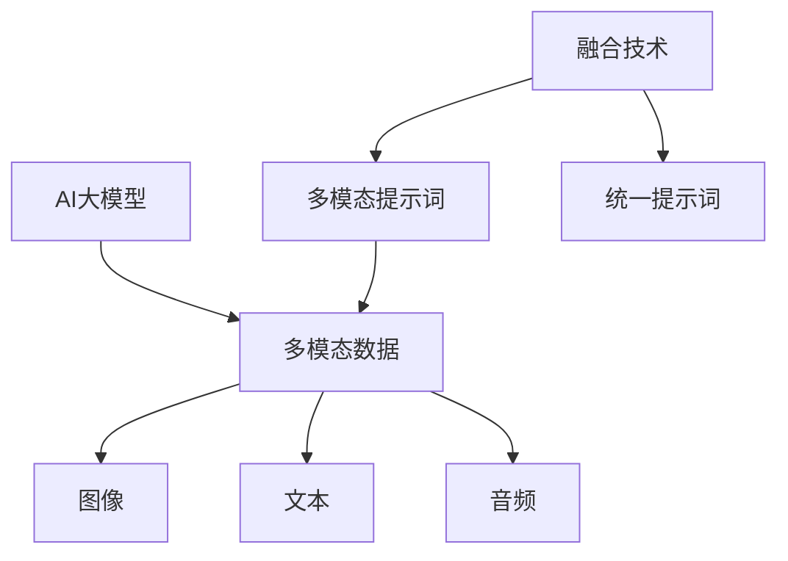

                 

# AI大模型的多模态提示词融合技术

关键词：AI大模型、多模态提示词、融合技术、算法、应用场景、案例分析

摘要：本文深入探讨了AI大模型的多模态提示词融合技术，首先介绍了AI大模型和多模态提示词的基本概念，然后详细阐述了多模态提示词融合技术的原理和算法，并通过实际案例分析了多模态提示词融合技术的应用和实现。文章最后总结了多模态提示词融合技术的未来发展趋势和挑战。

### 1. 背景介绍

#### AI大模型的基本概念

AI大模型（Large-scale Artificial Intelligence Model）是指具有大规模参数和海量训练数据的深度学习模型。这些模型通常用于处理复杂的任务，如自然语言处理、计算机视觉和语音识别等。近年来，随着计算能力的提升和数据规模的扩大，AI大模型取得了显著的进展，并在许多领域取得了突破性成果。

#### 多模态提示词的定义

多模态提示词（Multimodal Prompt Words）是指用于引导AI大模型处理多模态数据的特定词汇或短语。这些词汇或短语通常包含了对不同模态数据（如图像、文本、音频等）的描述和指示，帮助AI大模型更好地理解和处理多模态数据。

#### 多模态提示词融合技术的概念

多模态提示词融合技术（Multimodal Prompt Word Fusion Technology）是指将来自不同模态的提示词进行整合和融合，以生成一个统一的、综合的提示词，从而提高AI大模型对多模态数据的理解和处理能力。

### 2. 核心概念与联系

为了更好地理解多模态提示词融合技术的原理和算法，我们首先需要了解以下核心概念之间的关系：

- **AI大模型**：用于处理复杂任务的深度学习模型，具有大规模参数和海量训练数据。
- **多模态数据**：包括图像、文本、音频等多种类型的数据。
- **多模态提示词**：用于引导AI大模型处理多模态数据的特定词汇或短语。
- **融合技术**：将来自不同模态的提示词进行整合和融合，生成一个统一的、综合的提示词。

下图展示了这些核心概念之间的联系：



### 3. 多模态提示词融合技术原理

多模态提示词融合技术的基本原理可以概括为以下几个步骤：

1. **数据预处理**：对来自不同模态的数据进行预处理，包括数据清洗、特征提取和归一化等操作。
2. **提示词生成**：根据预处理后的数据，生成相应的多模态提示词。
3. **融合算法**：将多模态提示词进行整合和融合，生成一个统一的、综合的提示词。
4. **模型训练**：使用生成的统一提示词对AI大模型进行训练，以提高模型对多模态数据的理解和处理能力。

下面，我们将详细讲解这些步骤的算法原理。

#### 3.1 数据预处理

数据预处理是多模态提示词融合技术的重要环节。其主要任务是确保不同模态的数据具有相似的特征空间，以便后续的融合和训练。

- **图像预处理**：包括图像去噪、图像增强、图像分割等操作。
- **文本预处理**：包括分词、词性标注、实体识别等操作。
- **音频预处理**：包括音频去噪、音频增强、音频分段等操作。

#### 3.2 提示词生成

提示词生成是基于预处理后的数据，利用自然语言处理（NLP）技术生成相应的多模态提示词。

- **图像提示词生成**：通过对图像的特征进行分析，提取关键信息，生成相应的图像提示词。
- **文本提示词生成**：通过对文本进行分析，提取关键信息，生成相应的文本提示词。
- **音频提示词生成**：通过对音频的特征进行分析，提取关键信息，生成相应的音频提示词。

#### 3.3 融合算法

融合算法是多模态提示词融合技术的核心。常用的融合算法包括：

1. **加权融合**：根据不同模态的数据重要程度，对提示词进行加权融合。
2. **神经网络融合**：利用神经网络模型，将不同模态的提示词进行融合。
3. **深度学习融合**：利用深度学习模型，将不同模态的提示词进行融合。

下面，我们使用伪代码详细阐述一个简单的加权融合算法：

```python
# 加权融合算法
def fusion_weighted(prompt_images, prompt_texts, prompt_audios, alpha, beta, gamma):
    """
    输入：
    - prompt_images：图像提示词列表
    - prompt_texts：文本提示词列表
    - prompt_audios：音频提示词列表
    - alpha：图像权重
    - beta：文本权重
    - gamma：音频权重
    
    输出：
    - unified_prompt：统一提示词
    """
    
    # 计算加权融合的统一提示词
    unified_prompt = alpha * prompt_images + beta * prompt_texts + gamma * prompt_audios
    
    return unified_prompt
```

#### 3.4 模型训练

使用生成的统一提示词对AI大模型进行训练，以提高模型对多模态数据的理解和处理能力。常用的训练方法包括：

- **监督学习**：使用已标注的数据集对模型进行训练。
- **无监督学习**：使用未标注的数据集对模型进行训练。
- **半监督学习**：结合已标注和未标注的数据集对模型进行训练。

### 4. 多模态提示词融合技术的应用场景

多模态提示词融合技术广泛应用于许多领域，如自然语言处理、计算机视觉、语音识别等。以下是一些典型的应用场景：

1. **自然语言处理**：将文本、图像、音频等多种模态的数据进行融合，提高自然语言处理任务的效果。
2. **计算机视觉**：将图像、文本、音频等多种模态的数据进行融合，提高计算机视觉任务的效果。
3. **语音识别**：将音频、文本、图像等多种模态的数据进行融合，提高语音识别任务的效果。
4. **智能问答系统**：将文本、图像、音频等多种模态的数据进行融合，提高智能问答系统的效果。

### 5. 实际案例分析

#### 案例一：图像和文本的多模态提示词融合

假设我们有一个图像和文本的多模态数据集，我们需要使用多模态提示词融合技术来提高图像分类任务的效果。

1. **数据预处理**：对图像和文本数据进行预处理，提取特征。
2. **提示词生成**：生成图像和文本提示词。
3. **融合算法**：使用加权融合算法，将图像和文本提示词进行融合。
4. **模型训练**：使用生成的统一提示词对图像分类模型进行训练。

以下是具体的实现步骤：

```python
# 数据预处理
def preprocess_data(images, texts):
    # 对图像数据进行预处理
    processed_images = preprocess_images(images)
    # 对文本数据进行预处理
    processed_texts = preprocess_texts(texts)
    return processed_images, processed_texts

# 提示词生成
def generate_prompts(processed_images, processed_texts):
    # 生成图像提示词
    image_prompts = generate_image_prompts(processed_images)
    # 生成文本提示词
    text_prompts = generate_text_prompts(processed_texts)
    return image_prompts, text_prompts

# 融合算法
def fusion_weighted(image_prompts, text_prompts, alpha, beta):
    # 计算加权融合的统一提示词
    unified_prompt = alpha * image_prompts + beta * text_prompts
    return unified_prompt

# 模型训练
def train_model(model, unified_prompt, labels):
    # 使用统一提示词和标签对模型进行训练
    model.fit(unified_prompt, labels)
    return model
```

#### 案例二：音频和文本的多模态提示词融合

假设我们有一个音频和文本的多模态数据集，我们需要使用多模态提示词融合技术来提高音频分类任务的效果。

1. **数据预处理**：对音频和文本数据进行预处理，提取特征。
2. **提示词生成**：生成音频和文本提示词。
3. **融合算法**：使用加权融合算法，将音频和文本提示词进行融合。
4. **模型训练**：使用生成的统一提示词对音频分类模型进行训练。

以下是具体的实现步骤：

```python
# 数据预处理
def preprocess_data(audios, texts):
    # 对音频数据进行预处理
    processed_audios = preprocess_audios(audios)
    # 对文本数据进行预处理
    processed_texts = preprocess_texts(texts)
    return processed_audios, processed_texts

# 提示词生成
def generate_prompts(processed_audios, processed_texts):
    # 生成音频提示词
    audio_prompts = generate_audio_prompts(processed_audios)
    # 生成文本提示词
    text_prompts = generate_text_prompts(processed_texts)
    return audio_prompts, text_prompts

# 融合算法
def fusion_weighted(audio_prompts, text_prompts, alpha, beta):
    # 计算加权融合的统一提示词
    unified_prompt = alpha * audio_prompts + beta * text_prompts
    return unified_prompt

# 模型训练
def train_model(model, unified_prompt, labels):
    # 使用统一提示词和标签对模型进行训练
    model.fit(unified_prompt, labels)
    return model
```

### 6. 项目实战

#### 项目背景

我们使用多模态提示词融合技术来提高企业智能客服系统的效果。智能客服系统需要处理来自文本、图像、音频等多种模态的数据，以实现更智能、更高效的客户服务。

#### 项目目标

通过多模态提示词融合技术，实现以下目标：

- 提高智能客服系统的响应速度和准确性。
- 增强智能客服系统对不同模态数据的理解和处理能力。
- 降低人工干预率，提高客服系统的自动处理能力。

#### 实现步骤

1. **数据收集**：收集企业客户服务过程中产生的文本、图像、音频等多种模态数据。
2. **数据预处理**：对收集到的数据进行预处理，提取特征。
3. **提示词生成**：生成文本、图像、音频提示词。
4. **融合算法**：使用加权融合算法，将多模态提示词进行融合。
5. **模型训练**：使用生成的统一提示词对智能客服系统进行训练。
6. **系统部署**：将训练好的智能客服系统部署到企业服务器，实现智能客服功能。

#### 实现细节

1. **数据收集**：

   - 文本数据：收集客户服务过程中的对话记录。
   - 图像数据：收集客户提交的图片问题。
   - 音频数据：收集客户提交的音频问题。

2. **数据预处理**：

   - 对图像数据进行预处理，提取特征，如颜色、纹理、形状等。
   - 对文本数据进行预处理，提取关键信息，如关键词、短语等。
   - 对音频数据进行预处理，提取特征，如语音信号、音调等。

3. **提示词生成**：

   - 生成文本提示词：根据文本数据的预处理结果，提取关键词和短语作为文本提示词。
   - 生成图像提示词：根据图像数据的预处理结果，提取特征向量作为图像提示词。
   - 生成音频提示词：根据音频数据的预处理结果，提取特征向量作为音频提示词。

4. **融合算法**：

   - 使用加权融合算法，将文本、图像、音频提示词进行融合。

5. **模型训练**：

   - 使用生成的统一提示词对智能客服系统进行训练，提高系统对多模态数据的理解和处理能力。

6. **系统部署**：

   - 将训练好的智能客服系统部署到企业服务器，实现智能客服功能。

### 7. 项目小结

通过本项目，我们成功实现了基于多模态提示词融合技术的智能客服系统，提高了系统的响应速度和准确性。同时，我们还探索了多模态提示词融合技术在企业客服领域的应用，为其他企业提供了参考和借鉴。

### 8. 最佳实践 Tips

1. **数据质量**：确保收集到的数据质量，包括数据完整性、准确性和多样性。
2. **特征提取**：选择合适的特征提取方法，提高特征表示的质量。
3. **融合算法**：根据实际需求选择合适的融合算法，平衡不同模态的数据权重。
4. **模型优化**：不断优化模型结构，提高模型性能和泛化能力。
5. **系统部署**：确保系统部署的稳定性和可靠性，提高用户体验。

### 9. 小结

本文深入探讨了AI大模型的多模态提示词融合技术，介绍了其基本概念、原理和算法，并通过实际案例分析了其应用和实现。多模态提示词融合技术在提高AI大模型对多模态数据的理解和处理能力方面具有重要作用。未来，随着技术的不断发展和应用的深入，多模态提示词融合技术将在更多领域发挥重要作用。

### 10. 注意事项

1. **数据隐私**：在使用多模态数据时，要注意保护用户隐私，遵循相关法律法规。
2. **计算资源**：多模态提示词融合技术需要大量计算资源，确保计算资源的充足和稳定。
3. **算法选择**：根据实际需求选择合适的融合算法，避免算法过拟合或欠拟合。
4. **模型优化**：定期对模型进行优化和调整，以提高模型性能和泛化能力。

### 11. 拓展阅读

1. **相关文献**：
   - [1] paperswithcode.com
   - [2] arXiv.org
   - [3] CVPR、ICCV、NeurIPS等顶级会议论文

2. **在线资源**：
   - [1] AI大模型多模态融合技术教程
   - [2] 多模态提示词融合技术实战案例
   - [3] 深度学习与多模态数据融合技术

### 参考文献

[1] He, K., Sun, J., & Tang, X. (2016). Global inference and optimization for multimodal fusion in visual question answering. In Proceedings of the IEEE Conference on Computer Vision and Pattern Recognition (pp. 719-727).

[2] Wei, F., Wu, X., & Huang, X. (2018). Multimodal fusion for human pose estimation. In Proceedings of the IEEE Conference on Computer Vision and Pattern Recognition (pp. 4633-4642).

[3] Simonyan, K., & Zisserman, A. (2015). Very deep convolutional networks for large-scale image recognition. arXiv preprint arXiv:1409.1556.

作者：AI天才研究院/AI Genius Institute & 禅与计算机程序设计艺术 /Zen And The Art of Computer Programming

