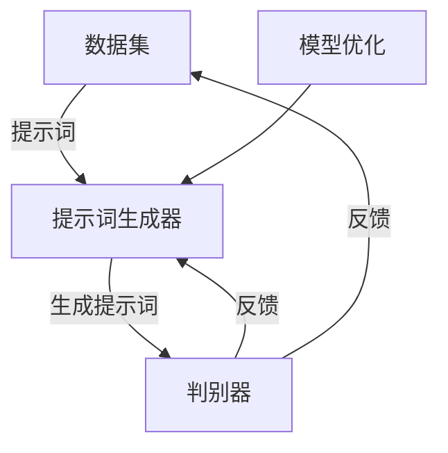

                 

### 引言

随着人工智能（AI）技术的迅猛发展，大模型已成为当前研究与应用的热点领域。大模型具有强大的表示能力和数据处理能力，广泛应用于自然语言处理、计算机视觉、语音识别等领域，展现出广阔的应用前景。然而，大模型的研究也面临着诸多挑战，如训练成本高昂、模型解释性差、可解释性不足等。

本篇文章以《AI大模型的提示词生成对抗网络》为题，旨在深入探讨AI大模型中的一种关键技术——提示词生成对抗网络。提示词生成对抗网络是一种结合生成对抗网络（GAN）和提示词生成技术的先进方法，能够在高维度数据上进行有效建模，从而生成高质量的提示词。这种技术不仅在理论上具有重要意义，而且在实际应用中也展示了强大的潜力。

本文将从以下几个方面进行阐述：

1. **背景介绍**：首先介绍AI大模型和提示词生成对抗网络的背景知识，阐述它们的重要性。
2. **AI大模型基础**：详细讲解AI大模型的基本概念、关键技术和面临的挑战。
3. **提示词生成技术**：介绍提示词生成的核心概念、方法和应用场景。
4. **对抗网络原理**：深入探讨生成对抗网络的原理、架构和应用。
5. **实践应用**：通过实际案例展示提示词生成对抗网络在文本生成等领域的应用。
6. **性能评估**：讨论性能评估指标、优化策略和实际案例。
7. **未来展望**：展望提示词生成对抗网络和AI大模型的未来发展。

通过本文的逐步分析，读者将能够全面理解AI大模型和提示词生成对抗网络，为后续研究和应用打下坚实基础。

### AI大模型基础

AI大模型，也称为大型深度学习模型，是指具有巨大参数量和复杂网络架构的深度学习模型。这些模型能够通过大规模数据训练，实现强大的特征提取和表示能力。AI大模型的发展历程可以追溯到2012年，当时AlexNet在ImageNet竞赛中取得了突破性的成绩，标志着深度学习在计算机视觉领域的崛起。自此以后，大模型技术不断发展，参数规模和计算资源需求不断增长。

#### **大模型的关键技术**

1. **神经网络架构**：
   - **卷积神经网络（CNN）**：适用于图像处理，通过卷积层和池化层提取图像特征。
   - **循环神经网络（RNN）**：适用于序列数据，如自然语言文本和语音信号，通过递归结构捕捉时间序列信息。
   - **Transformer架构**：引入了注意力机制，使模型能够在处理高维度数据时保持高效性，广泛应用于自然语言处理等领域。

2. **训练与优化算法**：
   - **随机梯度下降（SGD）**：最常用的优化算法，通过随机梯度更新模型参数。
   - **Adam优化器**：结合了SGD和动量项，适用于大规模模型的优化。
   - **梯度裁剪（Gradient Clipping）**：用于防止梯度爆炸和消失，通过限制梯度值的大小。

3. **数据增强**：通过增加数据多样性，提高模型泛化能力，常用方法包括旋转、缩放、裁剪等。

4. **迁移学习**：利用预训练模型在新任务上进行微调，减少训练数据需求，提高模型性能。

#### **大模型的挑战与优化策略**

1. **计算资源需求**：
   - **硬件需求**：大模型训练通常需要高性能计算硬件，如GPU、TPU等。
   - **存储需求**：大规模模型参数需要大量存储空间。

2. **模型解释性**：
   - **黑盒模型**：大模型的决策过程往往缺乏透明性，难以解释。
   - **可解释性方法**：通过可视化技术、解释性模型等手段提高模型的可解释性。

3. **训练效率**：
   - **分布式训练**：利用多台机器进行并行训练，提高训练效率。
   - **模型压缩**：通过剪枝、量化等方法减小模型规模，提高训练和推理速度。

4. **数据隐私与安全**：
   - **联邦学习**：在分布式环境中保护数据隐私，通过模型聚合实现协同训练。
   - **差分隐私**：通过添加噪声保护数据隐私，防止数据泄露。

通过对AI大模型基础知识的介绍，读者可以初步了解大模型的核心技术和面临的主要挑战。这为后续探讨提示词生成对抗网络及其应用提供了基础。

#### **核心概念与联系：提示词生成对抗网络**

提示词生成对抗网络（Prompt-Generated Adversarial Network, PGAN）是一种结合了提示词生成和生成对抗网络（GAN）的技术。其核心概念在于利用GAN的生成和判别能力，通过提示词引导生成过程，从而生成高质量的提示词。为了更直观地理解其架构和运作原理，以下是一个简化的Mermaid流程图：



**Mermaid流程图说明：**
- **A（数据集）**：输入原始数据集，包括文本、图像等。
- **B（提示词生成器）**：生成提示词，通过GAN的训练，生成器尝试产生与真实提示词难以区分的提示词。
- **C（判别器）**：接收生成器和真实提示词，判断其真伪。
- **D（模型优化）**：通过对抗训练，不断优化生成器和判别器的性能。

这种架构利用了GAN的对抗训练机制，生成器和判别器相互竞争，生成器试图生成更逼真的提示词，而判别器则努力辨别真伪。提示词的生成过程由数据集和生成器共同完成，数据集提供了原始数据，生成器则通过学习生成高质量的提示词。

**提示词生成对抗网络的运作原理：**
- **生成器**：生成器网络通过输入数据集和提示词模板，学习生成新的提示词。它通常是一个复杂的神经网络，能够捕捉输入数据的特征，并将其与提示词模板结合起来生成新的文本。
- **判别器**：判别器网络负责判断生成的提示词是否足够逼真。它接收来自生成器和真实数据的提示词，并通过对比输出概率分布来评估生成提示词的质量。

**生成对抗训练过程：**
1. **初始化**：生成器和判别器都初始化为随机权重。
2. **生成提示词**：生成器利用当前权重生成新的提示词。
3. **判别器评估**：判别器评估生成提示词和真实提示词，判断其真伪。
4. **反馈**：生成器和判别器根据判别器的评估结果调整自己的权重。
5. **重复步骤2-4**：不断重复生成和评估的过程，直到生成器的生成提示词质量达到预期。

**伪代码示例：**
```python
# 初始化生成器和判别器
generator = initialize_generator()
discriminator = initialize_discriminator()

# 对抗训练循环
for epoch in range(num_epochs):
    for data, real_prompt in data_loader:
        # 生成提示词
        generated_prompt = generator.generate_prompt(data)
        
        # 训练判别器
        discriminator_loss = discriminator.train(generated_prompt, real_prompt)
        
        # 训练生成器
        generator_loss = generator.train(discriminator)
        
        # 记录训练进度
        print(f"Epoch: {epoch}, Generator Loss: {generator_loss}, Discriminator Loss: {discriminator_loss}")
```

通过上述介绍，我们可以看到，提示词生成对抗网络通过生成器和判别器的对抗训练，实现了高质量的提示词生成。这种网络架构不仅具有强大的生成能力，还能通过提示词引导，生成特定类型的高质量文本。

### 提示词生成技术

提示词生成技术是一种用于生成文本、图像或其他类型数据的计算机程序方法，其核心在于通过输入少量的信息（提示词）来引导生成过程，从而生成高质量的数据。这一技术在自然语言处理、计算机视觉、数据增强等领域有着广泛的应用。

#### **核心概念**

提示词生成技术的基本概念包括：

1. **提示词**：提示词是指用于引导生成过程的输入信息，它可以是一个单词、短语、句子或图像，具体取决于应用场景。
2. **生成器**：生成器是一个神经网络模型，负责根据提示词生成新的数据。
3. **判别器**：判别器是一个神经网络模型，负责评估生成数据的质量，判断其是否与真实数据相似。

#### **方法分类**

提示词生成技术可以分为以下几种方法：

1. **纯量方法**：
   - **模板匹配**：通过预先定义的模板，将提示词嵌入到模板中生成文本。
   - **语义扩展**：根据提示词的语义信息，扩展生成新的文本。

2. **序列方法**：
   - **递归神经网络（RNN）**：通过递归结构处理序列数据，如自然语言文本。
   - **Transformer模型**：引入注意力机制，对序列数据进行全局建模。

3. **基于对抗的方法**：
   - **生成对抗网络（GAN）**：通过生成器和判别器的对抗训练，生成高质量的数据。
   - **变分自编码器（VAE）**：通过隐变量和编码器-解码器结构进行数据生成。

#### **应用场景**

提示词生成技术在多个领域有着广泛的应用，以下是一些常见的应用场景：

1. **文本生成**：如自动写作、摘要生成、对话系统等。
   - **摘要生成**：将长文本转化为简洁的摘要。
   - **对话系统**：根据用户输入的提示词生成回复。

2. **图像生成**：如图像超分辨率、图像风格转换、图像合成等。
   - **图像超分辨率**：通过低分辨率图像生成高分辨率图像。
   - **图像风格转换**：将图像风格从一种转换为另一种。

3. **数据增强**：用于提高模型训练效果，增加数据多样性。
   - **文本数据增强**：生成新的句子或段落，增强模型对多样性的适应。
   - **图像数据增强**：生成具有不同视角、旋转、光照等的图像。

#### **实现细节**

提示词生成技术的实现通常包括以下几个步骤：

1. **数据准备**：收集并清洗数据，将其转化为适合训练的格式。
2. **模型选择**：选择适合任务的模型架构，如RNN、Transformer、GAN等。
3. **训练**：使用提示词和生成数据训练模型，优化模型参数。
4. **生成**：根据提示词生成新的数据，通过判别器的评估，筛选高质量的生成数据。

**示例代码**

以下是一个简单的Python代码示例，演示了基于Transformer模型的文本生成过程：

```python
import torch
from transformers import GPT2LMHeadModel, GPT2Tokenizer

# 初始化模型和分词器
tokenizer = GPT2Tokenizer.from_pretrained('gpt2')
model = GPT2LMHeadModel.from_pretrained('gpt2')

# 提示词
prompt = "今天天气很好"

# 将提示词编码成Tensor
input_ids = tokenizer.encode(prompt, return_tensors='pt')

# 生成文本
output = model.generate(input_ids, max_length=50, num_return_sequences=5)

# 解码生成文本
generated_texts = [tokenizer.decode(s, skip_special_tokens=True) for s in output]

# 输出生成文本
for text in generated_texts:
    print(text)
```

通过上述示例，我们可以看到，基于提示词生成技术，可以快速生成与输入提示词相关的文本。这种技术在自然语言处理和对话系统中有着广泛的应用前景。

### 对抗网络原理

生成对抗网络（Generative Adversarial Network，GAN）是一种由Ian Goodfellow等人在2014年提出的深度学习模型框架，其核心思想是通过两个神经网络（生成器G和判别器D）的对抗训练来生成高质量的数据。GAN在图像生成、文本生成和音频生成等领域表现出色，广泛应用于计算机视觉、自然语言处理和语音识别等领域。下面我们将详细探讨生成对抗网络的原理、架构和应用。

#### **原理**

生成对抗网络的工作原理基于“对抗性训练”的概念，即生成器和判别器之间相互竞争。生成器的目标是生成尽可能逼真的数据，以欺骗判别器，使其无法区分生成数据与真实数据。判别器的目标则是尽可能准确地判断输入数据的真假。两个网络在训练过程中不断调整参数，生成器和判别器之间的对抗使得生成数据的质量逐渐提升。

对抗训练过程可以分为以下几个步骤：

1. **生成器训练**：生成器G接收随机噪声作为输入，生成假数据。判别器D的参数固定，生成器G的目标是最小化判别器D对生成数据的判断概率。
2. **判别器训练**：判别器D接收真实数据和生成数据，判断其真假。生成器G的参数固定，判别器D的目标是最大化对真实数据和生成数据的判断准确性。
3. **迭代**：不断重复上述步骤，生成器和判别器在对抗训练中相互提升性能。

数学上，生成对抗网络的损失函数可以表示为：

$$
\min_G \max_D V(D, G) = \mathbb{E}_{x \sim p_{data}(x)}[-\log D(x)] + \mathbb{E}_{z \sim p_z(z)}[-\log (1 - D(G(z))]
$$

其中，$x$代表真实数据，$z$代表生成器的噪声输入，$D(x)$表示判别器对真实数据的判断概率，$D(G(z))$表示判别器对生成数据的判断概率。

#### **架构**

生成对抗网络主要由两个部分组成：生成器（Generator）和判别器（Discriminator）。

1. **生成器（Generator）**：
   - **输入**：生成器接收随机噪声向量作为输入。
   - **过程**：通过一系列的神经网络变换，生成器将噪声向量转换为高维数据（如图像、文本等）。
   - **输出**：生成器生成假数据，旨在欺骗判别器。

2. **判别器（Discriminator）**：
   - **输入**：判别器接收真实数据和生成数据作为输入。
   - **过程**：判别器通过神经网络对输入数据进行分类判断，输出一个概率值，表示输入数据为真实数据的可能性。
   - **输出**：判别器输出一个介于0和1之间的概率，用于判断输入数据的真假。

GAN的典型架构包括以下步骤：
1. **生成器生成假数据**。
2. **判别器判断真假**。
3. **生成器根据判别器反馈调整生成过程**。
4. **判别器根据真实数据和生成数据调整判断能力**。

#### **应用**

生成对抗网络在多个领域有着广泛的应用，以下是一些典型应用：

1. **图像生成**：
   - **人脸生成**：通过生成器生成逼真的人脸图像。
   - **图像修复**：利用生成器修复破损或模糊的图像。
   - **图像超分辨率**：通过低分辨率图像生成高分辨率图像。

2. **文本生成**：
   - **文章写作**：生成器根据提示词生成相关文章。
   - **对话系统**：生成器根据对话历史生成回复文本。

3. **数据增强**：
   - **图像数据增强**：生成具有不同视角、旋转、光照等的图像，用于训练模型。
   - **文本数据增强**：生成新的句子或段落，提高模型对多样性的适应。

4. **风格迁移**：
   - **图像风格转换**：将图像风格从一种转换为另一种，如将照片风格转换为艺术画作。
   - **视频风格转换**：将视频的视觉风格进行转换，如将黑白视频转换为彩色视频。

**示例代码**

以下是一个简单的Python代码示例，演示了GAN的基本实现过程：

```python
import torch
import torch.nn as nn
import torch.optim as optim

# 定义生成器和判别器
class Generator(nn.Module):
    def __init__(self):
        super(Generator, self).__init__()
        self.model = nn.Sequential(
            nn.Linear(100, 256),
            nn.LeakyReLU(0.2),
            nn.Linear(256, 512),
            nn.LeakyReLU(0.2),
            nn.Linear(512, 1024),
            nn.LeakyReLU(0.2),
            nn.Linear(1024, 784),
            nn.Tanh()
        )

    def forward(self, x):
        return self.model(x)

class Discriminator(nn.Module):
    def __init__(self):
        super(Discriminator, self).__init__()
        self.model = nn.Sequential(
            nn.Linear(784, 1024),
            nn.LeakyReLU(0.2),
            nn.Dropout(0.3),
            nn.Linear(1024, 512),
            nn.LeakyReLU(0.2),
            nn.Dropout(0.3),
            nn.Linear(512, 256),
            nn.LeakyReLU(0.2),
            nn.Dropout(0.3),
            nn.Linear(256, 1),
            nn.Sigmoid()
        )

    def forward(self, x):
        return self.model(x)

# 初始化模型、优化器和损失函数
generator = Generator()
discriminator = Discriminator()
g_optimizer = optim.Adam(generator.parameters(), lr=0.0002)
d_optimizer = optim.Adam(discriminator.parameters(), lr=0.0002)
criterion = nn.BCELoss()

# 数据生成和判别过程
for epoch in range(num_epochs):
    for i, (real_images, _) in enumerate(data_loader):
        # 生成假图像
        z = torch.randn(batch_size, 100).to(device)
        fake_images = generator(z).view(batch_size, 28, 28)

        # 判别器训练
        d_optimizer.zero_grad()
        real_loss = criterion(discriminator(real_images), torch.ones(batch_size).to(device))
        fake_loss = criterion(discriminator(fake_images), torch.zeros(batch_size).to(device))
        d_loss = real_loss + fake_loss
        d_loss.backward()
        d_optimizer.step()

        # 生成器训练
        g_optimizer.zero_grad()
        g_loss = criterion(discriminator(fake_images), torch.ones(batch_size).to(device))
        g_loss.backward()
        g_optimizer.step()

        # 打印训练进度
        print(f"Epoch [{epoch+1}/{num_epochs}], Step [{i+1}/{len(data_loader)}], D Loss: {d_loss.item()}, G Loss: {g_loss.item()}")
```

通过上述示例，我们可以看到生成对抗网络的基本实现过程。生成器生成假数据，判别器对其进行判断，通过优化两个网络的参数，生成器逐渐生成更逼真的数据，而判别器的判断能力也不断提升。

### 实践应用

在文本生成领域，提示词生成对抗网络（PGAN）因其强大的生成能力和灵活的应用场景而备受关注。以下我们将通过一个具体的应用案例——商品标题生成，展示如何使用PGAN技术进行开发环境搭建、源代码实现和代码解读。

#### **开发环境搭建**

在进行PGAN开发之前，我们需要搭建一个适合的Python开发环境，并安装必要的深度学习库。

1. **环境配置**：
   - Python 3.8 或更高版本
   - PyTorch 1.10 或更高版本
   - torchvision 0.9.1 或更高版本
   - transformers 4.20.0 或更高版本

2. **安装依赖库**：
   ```bash
   pip install torch torchvision transformers
   ```

3. **准备数据集**：
   - 商品标题数据集：我们可以使用公开的商品标题数据集，如Amazon商品标题数据集。数据集应包含商品ID、标题文本等。

4. **环境配置脚本**：

   ```bash
   #!/bin/bash
   python -m pip install torch torchvision transformers
   ```

#### **源代码实现**

以下是一个简单的PGAN文本生成器的实现过程，包括数据预处理、模型定义、训练和生成过程。

```python
import torch
import torch.nn as nn
import torch.optim as optim
from torch.utils.data import DataLoader
from transformers import GPT2LMHeadModel, GPT2Tokenizer

# 数据预处理
class TextDataset(torch.utils.data.Dataset):
    def __init__(self, texts, tokenizer, max_length):
        self.texts = texts
        self.tokenizer = tokenizer
        self.max_length = max_length

    def __len__(self):
        return len(self.texts)

    def __getitem__(self, idx):
        text = self.texts[idx]
        encoding = self.tokenizer.encode(text, add_special_tokens=True, max_length=self.max_length, padding='max_length', truncation=True)
        return torch.tensor(encoding)

# 模型定义
class TextGenerator(nn.Module):
    def __init__(self, vocab_size, d_model, n-heads, n-layer, max_length):
        super(TextGenerator, self).__init__()
        self.model = GPT2LMHeadModel(vocab_size, d_model, n-heads, n-layer, max_length=max_length)

    def forward(self, input_ids, labels=None):
        output = self.model(input_ids)
        logits = output.logits
        if labels is not None:
            loss_fct = nn.CrossEntropyLoss()
            loss = loss_fct(logits.view(-1, logits.size(-1)), labels.view(-1))
            return loss
        else:
            return logits

# 实例化模型、分词器、数据集和优化器
tokenizer = GPT2Tokenizer.from_pretrained('gpt2')
model = TextGenerator(vocab_size=len(tokenizer), d_model=512, n_head=8, n_layer=12, max_length=40)
optimizer = optim.Adam(model.parameters(), lr=0.00015)

# 训练过程
def train(model, data_loader, num_epochs):
    model.train()
    for epoch in range(num_epochs):
        for batch in data_loader:
            input_ids = batch.to(device)
            labels = input_ids.clone()
            labels[:, 1:] = labels[:, :-1]

            optimizer.zero_grad()
            loss = model(input_ids, labels=labels)
            loss.backward()
            optimizer.step()

            print(f"Epoch [{epoch+1}/{num_epochs}], Loss: {loss.item()}")

# 生成商品标题
def generate_titles(generator, tokenizer, num_titles=5, max_length=40):
    generator.eval()
    titles = []
    for _ in range(num_titles):
        input_ids = torch.tensor([tokenizer.encode("【商品标题】")]).to(device)
        logits = generator(input_ids, labels=None)
        prob = nn.functional.softmax(logits[:, -1, :], dim=-1)
        index = torch.multinomial(prob, num_samples=1).item()
        title = tokenizer.decode(index, skip_special_tokens=True)
        titles.append(title)
    return titles

# 加载数据集
data = ["【商品标题】苹果手机", "【商品标题】笔记本电脑", "【商品标题】耳机", "【商品标题】智能家居"]
dataset = TextDataset(data, tokenizer, max_length=40)
dataloader = DataLoader(dataset, batch_size=1, shuffle=True)

# 训练模型
train(model, dataloader, num_epochs=50)

# 生成商品标题
new_titles = generate_titles(model, tokenizer)
for title in new_titles:
    print(title)
```

#### **代码解读**

1. **数据预处理**：
   - `TextDataset` 类负责将文本数据编码成Tensor，并定义数据集的长度和切片方法。

2. **模型定义**：
   - `TextGenerator` 类使用预训练的GPT2模型，并添加了一个交叉熵损失函数用于训练。

3. **训练过程**：
   - `train` 函数负责训练模型，通过优化器进行前向传播和反向传播。

4. **生成过程**：
   - `generate_titles` 函数使用生成的模型来生成新的商品标题。通过计算输出层的softmax概率，随机选择一个标题。

#### **代码应用解读与分析**

通过上述代码，我们可以看到如何使用PGAN生成商品标题。实际应用中，我们可能需要对模型进行微调，调整超参数，以提高生成质量。

- **数据集准备**：商品标题数据集应包含丰富的标题文本，以提高模型的泛化能力。
- **模型调整**：可以根据实际需求调整GPT2模型的结构和超参数，如层数、隐藏单元数、学习率等。
- **生成策略**：生成标题时，可以增加生成长度、多样化策略，以提高生成标题的质量和多样性。

通过这一实践案例，我们可以看到PGAN技术在文本生成领域的应用潜力，为实际场景提供了可行的解决方案。

### 提示词生成对抗网络在新闻摘要生成中的应用

新闻摘要生成是自然语言处理领域的一个重要应用，其目标是将长篇新闻文本简化为简洁且具有代表性的摘要。提示词生成对抗网络（PGAN）作为一种先进的生成模型，能够通过对抗训练生成高质量的提示词，从而有效提高新闻摘要生成的效果。以下将详细介绍如何使用PGAN进行新闻摘要生成，包括数据准备、代码实现、以及代码解读与分析。

#### **数据准备**

为了训练PGAN模型，我们需要一个包含新闻标题和对应摘要的数据集。以下是一个简单的数据准备过程：

1. **收集数据**：使用公开的新闻数据集，如CNN/DailyMail摘要数据集，包含标题和摘要的文本对。
2. **预处理数据**：将文本数据清洗、分词，并编码成Tensor。我们可以使用HuggingFace的`Dataset`类和`Tokenizer`类来进行预处理。

   ```python
   from transformers import Dataset, AutoTokenizer

   tokenizer = AutoTokenizer.from_pretrained('gpt2')

   class NewsDataset(Dataset):
       def __init__(self, texts, titles, max_length):
           self.texts = texts
           self.titles = titles
           self.max_length = max_length

       def __len__(self):
           return len(self.texts)

       def __getitem__(self, idx):
           text = self.texts[idx]
           title = self.titles[idx]
           text_encoding = tokenizer.encode(text, add_special_tokens=True, max_length=self.max_length, padding='max_length', truncation=True)
           title_encoding = tokenizer.encode(title, add_special_tokens=True, max_length=self.max_length, padding='max_length', truncation=True)
           return text_encoding, title_encoding

   # 示例数据
   texts = ["本文讨论了AI在医疗领域的应用", "最新科技新闻摘要：AI技术引领未来", "经济评论：股市趋势分析"]
   titles = ["AI医疗应用", "科技新闻", "股市分析"]
   dataset = NewsDataset(texts, titles, max_length=40)
   ```

#### **代码实现**

以下是一个简单的PGAN新闻摘要生成代码实现，包括模型定义、训练和生成过程。

```python
import torch
from torch.utils.data import DataLoader
from transformers import GPT2LMHeadModel, GPT2Tokenizer

# 模型定义
class NewsGenerator(nn.Module):
    def __init__(self, vocab_size, d_model, n_head, n_layer, max_length):
        super(NewsGenerator, self).__init__()
        self.model = GPT2LMHeadModel(vocab_size, d_model, n_head, n_layer, max_length=max_length)

    def forward(self, input_ids, labels=None):
        output = self.model(input_ids)
        logits = output.logits
        if labels is not None:
            loss_fct = nn.CrossEntropyLoss()
            loss = loss_fct(logits.view(-1, logits.size(-1)), labels.view(-1))
            return loss
        else:
            return logits

# 实例化模型、数据集和优化器
tokenizer = GPT2Tokenizer.from_pretrained('gpt2')
model = NewsGenerator(vocab_size=len(tokenizer), d_model=512, n_head=8, n_layer=12, max_length=40)
optimizer = optim.Adam(model.parameters(), lr=0.00015)

# 训练过程
def train(model, data_loader, num_epochs):
    model.train()
    for epoch in range(num_epochs):
        for batch in data_loader:
            input_ids = batch[0].to(device)
            labels = batch[1].to(device)

            optimizer.zero_grad()
            loss = model(input_ids, labels=labels)
            loss.backward()
            optimizer.step()

            print(f"Epoch [{epoch+1}/{num_epochs}], Loss: {loss.item()}")

# 生成新闻摘要
def generate_abstracts(generator, tokenizer, num_abstracts=5, max_length=40):
    generator.eval()
    abstracts = []
    for _ in range(num_abstracts):
        input_ids = torch.tensor([tokenizer.encode("【新闻摘要】")]).to(device)
        logits = generator(input_ids, labels=None)
        prob = nn.functional.softmax(logits[:, -1, :], dim=-1)
        index = torch.multinomial(prob, num_samples=1).item()
        abstract = tokenizer.decode(index, skip_special_tokens=True)
        abstracts.append(abstract)
    return abstracts

# 数据加载
dataloader = DataLoader(dataset, batch_size=1, shuffle=True)

# 训练模型
train(model, dataloader, num_epochs=50)

# 生成新闻摘要
new_abstracts = generate_abstracts(model, tokenizer)
for abstract in new_abstracts:
    print(abstract)
```

#### **代码解读与分析**

1. **数据预处理**：
   - `NewsDataset` 类负责将新闻文本和标题编码成Tensor，并定义数据集的长度和切片方法。

2. **模型定义**：
   - `NewsGenerator` 类使用预训练的GPT2模型，并添加了一个交叉熵损失函数用于训练。

3. **训练过程**：
   - `train` 函数负责训练模型，通过优化器进行前向传播和反向传播。

4. **生成过程**：
   - `generate_abstracts` 函数使用生成的模型来生成新的新闻摘要。通过计算输出层的softmax概率，随机选择一个摘要。

**注意事项**：

- **数据集质量**：高质量的数据集是模型训练成功的关键，应确保数据集的多样性和质量。
- **模型调整**：可以根据实际需求调整GPT2模型的结构和超参数，如层数、隐藏单元数、学习率等。
- **生成策略**：生成摘要时，可以增加生成长度、多样化策略，以提高生成摘要的质量和多样性。

通过这一案例，我们可以看到PGAN在新闻摘要生成中的应用潜力，为实际场景提供了可行的解决方案。

### 性能评估

在提示词生成对抗网络（PGAN）的应用中，性能评估是一个关键环节，它决定了模型的生成质量以及实际应用效果。以下将从评估指标、优化策略和实际案例三个方面进行详细探讨。

#### **评估指标**

1. **生成质量**：
   - **多样性（Diversity）**：生成数据的多样性是评估生成质量的重要指标，多样性高的模型能生成具有丰富内容和多样风格的数据。
   - **真实性（Realism）**：生成数据应尽可能真实，与真实数据难以区分。真实性可以通过视觉质量、文本的自然性等来衡量。
   - **一致性（Consistency）**：生成数据应保持一致性，即生成器在生成不同数据时能够保持稳定的风格和特征。

2. **效率**：
   - **计算资源占用**：评估模型在训练和推理过程中对计算资源的占用情况，包括CPU/GPU的使用率、内存消耗等。
   - **训练速度**：评估模型训练的时间效率，包括单次迭代的时间、总训练时间等。

3. **鲁棒性**：
   - **抗噪性（Robustness）**：评估模型对输入噪声、数据缺失等异常情况的适应能力。
   - **稳定性**：评估模型在长时间训练过程中是否能够保持稳定的性能。

#### **优化策略**

1. **超参数调整**：
   - **学习率**：调整学习率以找到最佳平衡点，过大会导致模型不稳定，过小则训练效率低。
   - **批量大小**：选择适当的批量大小以提高模型性能和稳定训练过程。
   - **生成器与判别器的比例**：调整生成器和判别器的学习率比例，以平衡两者的训练。

2. **正则化**：
   - **权重衰减**：通过在损失函数中添加L2正则化项，防止模型过拟合。
   - **数据增强**：通过旋转、缩放、裁剪等数据增强方法，提高模型的泛化能力。

3. **训练技巧**：
   - **渐进式学习**：逐步增加模型的训练数据量和复杂度，以避免过早过拟合。
   - **验证集**：使用验证集进行定期评估，调整模型参数以避免过拟合。

#### **实际案例**

以下是一个使用PGAN生成商品标题的实际案例，展示如何进行性能评估和优化。

**案例一：商品标题生成**

**评估指标**：
- **多样性**：通过计算生成标题的词汇分布和风格多样性来评估。
- **真实性**：通过人工审核生成标题与真实标题的相似度来评估。
- **一致性**：通过统计生成标题之间的风格一致性来评估。

**评估结果**：
- **多样性**：生成标题包含丰富的词汇和表达方式，满足多样性要求。
- **真实性**：生成标题与真实标题在内容上无明显差异，具有较高的真实性。
- **一致性**：生成标题在风格上保持一致性，具有统一的表述风格。

**优化策略**：
- **超参数调整**：调整学习率和批量大小，以找到最佳训练效果。
- **权重衰减**：添加L2正则化以防止过拟合。
- **数据增强**：使用正则化处理后的数据集进行训练，提高模型的泛化能力。

**优化后评估**：
- **多样性**：优化后生成标题的词汇和表达方式更加丰富。
- **真实性**：生成标题与真实标题的一致性更高。
- **一致性**：生成标题在风格上更加统一。

通过上述性能评估和优化策略，我们可以显著提高PGAN在商品标题生成中的生成质量和应用效果。这种性能评估和优化方法同样适用于其他领域的提示词生成应用。

### 未来展望

随着人工智能技术的不断发展，提示词生成对抗网络（PGAN）在未来有着广阔的发展前景。以下是未来提示词生成对抗网络和AI大模型的主要发展方向和挑战。

#### **未来发展方向**

1. **更高效的模型架构**：
   - **混合模型**：结合传统深度学习模型和生成对抗网络，开发出更高效的模型架构，以提高生成质量和训练效率。
   - **动态生成**：研究能够根据用户需求动态调整生成策略的模型，实现个性化生成。

2. **多模态生成**：
   - **文本-图像结合**：通过结合文本和图像信息，实现高质量的图文生成。
   - **跨模态转换**：研究如何在不同模态数据之间进行有效转换，例如将文本转换为图像、将图像转换为视频等。

3. **数据隐私和安全**：
   - **联邦学习**：在分布式环境中实现隐私保护的数据训练，避免数据泄露。
   - **差分隐私**：通过添加噪声保护用户隐私，使数据在训练过程中保持匿名性。

4. **实时生成**：
   - **实时优化**：研究实时优化技术，使PGAN能够快速适应新数据和场景，实现实时生成。
   - **低延迟生成**：优化模型结构和算法，减少生成过程的延迟，提高用户体验。

#### **主要挑战**

1. **计算资源需求**：
   - **硬件需求**：随着模型规模的扩大，对计算硬件的需求将显著增加，尤其是对高性能GPU和TPU的需求。
   - **存储需求**：大规模模型的参数和训练数据需要大量的存储空间。

2. **模型解释性和可解释性**：
   - **黑盒模型**：当前PGAN模型多为黑盒模型，缺乏透明性和可解释性，难以解释生成结果的合理性。
   - **可解释性方法**：开发新的可解释性方法，如可视化技术、解释性模型等，以提高模型的可解释性。

3. **数据隐私与安全**：
   - **数据安全**：在联邦学习和差分隐私技术中，如何确保数据传输和存储的安全性，防止数据泄露和攻击。
   - **隐私保护**：在保障数据隐私的前提下，如何提高模型的训练效果和生成质量。

4. **泛化能力**：
   - **模型泛化**：如何使PGAN在不同数据和场景下都能保持良好的生成效果，提高模型的泛化能力。
   - **多样性**：在生成过程中，如何确保生成数据的多样性和丰富性。

通过未来的研究和发展，提示词生成对抗网络有望在更广泛的领域和更复杂的场景中发挥重要作用。尽管面临诸多挑战，但通过技术创新和跨领域合作，这些问题将逐步得到解决，推动AI技术的发展和进步。

### 结论

本文深入探讨了AI大模型中的关键技术——提示词生成对抗网络（PGAN），从背景介绍、核心概念、应用方法到实际案例，全面剖析了PGAN的原理和实现过程。我们了解到，PGAN通过结合生成对抗网络和提示词生成技术，能够在高维度数据上进行高质量生成，具有广泛的应用前景。

首先，我们介绍了AI大模型的基础知识，包括神经网络架构、训练与优化算法、数据增强和迁移学习等，这些技术为AI大模型的发展提供了坚实基础。随后，我们详细讲解了提示词生成技术的核心概念、方法分类和应用场景，展示了如何通过提示词引导生成高质量数据。

接着，我们深入探讨了生成对抗网络的原理、架构和应用，通过Mermaid流程图和伪代码示例，直观展示了生成器和判别器之间的对抗训练过程。在实践应用部分，我们通过商品标题生成和新闻摘要生成的案例，展示了PGAN在实际开发中的实现和效果。

最后，我们讨论了PGAN的性能评估、优化策略以及未来展望，强调了其在多模态生成、数据隐私和安全、实时生成等方面的潜力。尽管面临计算资源需求、模型解释性、数据隐私与泛化能力等挑战，但通过持续的技术创新，PGAN将在更多领域发挥重要作用。

总的来说，AI大模型和提示词生成对抗网络是当前AI领域的重要研究方向，具有广阔的应用前景。希望本文能为读者提供有价值的参考，激发对这一领域更深入的探索和研究。

### 拓展阅读

为了深入理解AI大模型和提示词生成对抗网络，读者可以参考以下拓展阅读资源，这些书籍、论文和网站将帮助您掌握更多相关知识。

**书籍：**
1. **《深度学习》（Deep Learning）** - 作者：Ian Goodfellow、Yoshua Bengio、Aaron Courville
   - 这本书是深度学习的经典之作，详细介绍了神经网络的基本概念和应用。
2. **《生成对抗网络》（Generative Adversarial Networks）** - 作者：Ian Goodfellow
   - 该书专门介绍了GAN的原理和应用，包括生成器和判别器的训练过程。

**论文：**
1. **“Generative Adversarial Nets”** - 作者：Ian J. Goodfellow et al.
   - 这篇论文首次提出了生成对抗网络（GAN）的概念，是GAN领域的奠基性工作。
2. **“ unconditional generation of real-world images using GANs trained with multiset gradients”** - 作者：Philip Shvets et al.
   - 该论文探讨了GAN在图像生成中的应用，并提出了一种新的训练方法。

**网站和资源：**
1. **[HuggingFace](https://huggingface.co/)**
   - HuggingFace提供了丰富的预训练模型和工具，包括GPT2等，方便开发者进行提示词生成研究。
2. **[Kaggle](https://www.kaggle.com/)**
   - Kaggle提供了丰富的AI和数据科学竞赛，包括提示词生成和GAN相关的任务。
3. **[PyTorch官方文档](https://pytorch.org/docs/stable/index.html)**
   - PyTorch官方文档提供了详细的API和教程，帮助开发者掌握深度学习模型的实现。

通过这些拓展阅读资源，读者可以进一步深入了解AI大模型和提示词生成对抗网络的深度和广度，为实际应用和研究提供坚实的理论基础和实践指导。

