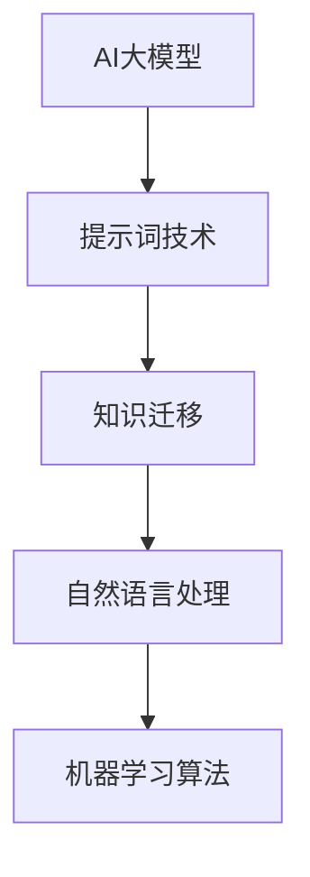

                 


## 文章标题: AI大模型的提示词知识迁移技术

### 关键词:
- AI大模型
- 提示词技术
- 知识迁移
- 自然语言处理
- 机器学习
- 语义理解

### 摘要:
本文将深入探讨AI大模型中的提示词知识迁移技术。通过介绍大模型、提示词和知识迁移的基础概念，我们旨在揭示这些概念之间的内在联系。随后，我们将详细解析大模型中的核心算法原理，使用伪代码和数学模型加以阐述。此外，文章还将提供实际的项目实战案例，展示如何将理论知识应用于实际开发中。最后，我们将对AI大模型的发展趋势和提示词知识迁移技术的未来进行展望。

## 第一部分: 基础概念与原理

### 第1章: AI大模型概述

#### 1.1 大模型简介
AI大模型，指的是参数规模达到亿级别甚至更大的人工神经网络模型。这些模型在深度学习和自然语言处理等领域取得了显著的成果，如GPT-3、BERT等。大模型的发展历程可以追溯到上世纪80年代，当时神经网络的规模相对较小，但随着计算能力和数据资源的不断提升，大模型逐渐成为研究的热点。

#### 1.2 提示词技术
提示词技术是AI大模型中的一项关键技术。它通过向模型输入特定的提示词，引导模型生成相应的输出。提示词的设计原则包括简洁性、相关性和多样性。这些原则有助于提高模型的生成质量，使其能够更好地满足实际需求。

#### 1.3 知识迁移
知识迁移是指将一个模型学到的知识应用到另一个相关任务中。在AI大模型中，知识迁移技术有助于提升模型的泛化能力，使其能够应对更多样化的场景。知识迁移的类型包括同领域迁移、跨领域迁移和零样本迁移等。

### 第2章: 自然语言处理基础

#### 2.1 语言模型
语言模型是自然语言处理的核心组成部分。它用于预测一个单词序列的概率分布，从而帮助我们理解自然语言的结构和含义。常见的语言模型包括n元语法模型和神经网络模型。

#### 2.2 语义理解
语义理解是指从文本中提取出有意义的语义信息。它涉及到词义消歧、实体识别、情感分析等领域。语义理解对于提升AI大模型的性能至关重要。

#### 2.3 机器学习算法
机器学习算法是AI大模型的核心驱动力量。常见的机器学习算法包括监督学习、无监督学习和强化学习。这些算法在模型训练过程中发挥着重要作用。

## 第二部分: 技术实现与实战

### 第3章: 提示词生成与优化

#### 3.1 提示词生成
提示词生成是提示词技术的重要组成部分。它包括从大量文本数据中提取提示词、对提示词进行预处理和生成高质量提示词等步骤。

#### 3.2 提示词优化
提示词优化是指通过调整提示词的参数，提高模型生成的输出质量。提示词优化的方法包括基于规则的方法和基于机器学习的方法。

### 第4章: 知识迁移算法

#### 4.1 知识蒸馏
知识蒸馏是一种常用的知识迁移算法。它通过将一个大模型的知识迁移到一个较小的模型中，从而提升小模型的性能。

#### 4.2 多任务学习
多任务学习是一种同时学习多个相关任务的方法。它有助于提升模型的泛化能力和鲁棒性。

### 第5章: 项目实战

#### 5.1 实战一：问答系统的构建
本节将介绍如何构建一个问答系统，包括技术选型、实现细节和代码解读。

#### 5.2 实战二：个性化推荐系统
本节将介绍如何构建一个个性化推荐系统，包括技术选型、实现细节和代码解读。

## 第三部分: 未来展望与趋势

### 第6章: AI大模型的发展趋势

#### 6.1 未来展望
AI大模型的发展方向包括更高效的模型结构、更强的泛化能力和更广泛的应用领域。

#### 6.2 挑战与机遇
AI大模型面临的挑战包括计算资源消耗、数据隐私和安全等。而提示词知识迁移技术则为解决这些挑战提供了新的机遇。

### 第7章: 总结与建议

#### 7.1 内容回顾
本文回顾了AI大模型、提示词技术和知识迁移的基础概念，并详细解析了相关算法原理和实际应用。

#### 7.2 学习建议
为了更好地掌握AI大模型的提示词知识迁移技术，建议读者深入了解相关领域的知识，并积极参与实际项目开发。

### 附录
- 附录A: Mermaid流程图
- 附录B: 伪代码示例
- 附录C: 数学公式及说明
- 附录D: 项目实战代码

作者：AI天才研究院/AI Genius Institute & 禅与计算机程序设计艺术 /Zen And The Art of Computer Programming### AI大模型概述

AI大模型，即具有亿级别参数规模的人工神经网络模型，是现代人工智能领域的一项重要突破。这类模型通过大量的数据进行训练，能够捕捉到数据的复杂模式，从而在多种任务中实现出色的性能。AI大模型的发展历程可以追溯到上世纪80年代，当时神经网络的研究主要集中在简单模型上，如感知机和多层感知机。随着计算机性能的提升和大数据技术的发展，神经网络模型逐渐变得更加复杂和庞大。

#### 大模型的概念

大模型通常指的是具有数百万至数十亿参数的神经网络模型。这些模型能够处理大规模的数据集，并在多种任务中展现出色的性能。例如，Transformer架构的引入使得预训练语言模型（如GPT）能够在大规模文本数据上取得突破性进展。这些模型不仅参数规模庞大，而且结构复杂，能够同时处理多种语言任务，如文本生成、机器翻译、问答系统等。

#### 大模型的发展历程

AI大模型的发展历程可以分为以下几个阶段：

1. **早期神经网络（1980s-1990s）**：早期的神经网络模型，如感知机和多层感知机，由于其简单性和局限性，难以处理复杂任务。但这一时期的研究为后来的神经网络模型奠定了基础。

2. **深度学习兴起（2006-2012）**：2006年，Geoffrey Hinton等人重新激发了深度学习的兴趣。通过使用更深的网络结构，研究人员在图像识别等任务上取得了显著进展。

3. **AI大模型的兴起（2013-至今）**：随着GPU等硬件设备的普及，以及大数据和深度学习算法的进步，AI大模型开始出现。2013年，AlexNet在ImageNet挑战赛中取得了惊人的成绩，标志着深度学习时代的到来。此后，越来越多的AI大模型被提出，如Google的Inception、Facebook的ResNet等。

4. **预训练语言模型的崛起（2018-至今）**：2018年，OpenAI发布了GPT-2，随后GPT-3的问世标志着预训练语言模型的重大突破。这些大模型在自然语言处理任务中取得了前所未有的成果，为AI大模型的发展开辟了新的方向。

#### 大模型的分类

AI大模型可以根据其应用领域和结构特点进行分类：

1. **视觉模型**：如ResNet、Inception等，主要用于图像识别和计算机视觉任务。

2. **语言模型**：如GPT、BERT等，主要用于自然语言处理任务，如文本生成、机器翻译和问答系统。

3. **多模态模型**：能够处理多种类型的数据，如文本、图像和声音，如ViT、DALL-E等。

4. **强化学习模型**：如DeepMind的AlphaGo等，主要用于解决需要决策和策略的任务。

AI大模型的出现为人工智能领域带来了前所未有的机遇和挑战。通过不断优化模型结构和算法，以及利用大规模数据和计算资源，AI大模型在各个领域取得了显著的进展。然而，大模型的高成本、对数据的依赖性以及伦理和隐私问题仍然需要我们深入研究和解决。

### 提示词技术

提示词技术是AI大模型中的一项关键技术，它通过向模型输入特定的提示词，引导模型生成相应的输出。这种技术广泛应用于自然语言处理、问答系统、机器翻译等任务中。提示词技术的设计原则包括简洁性、相关性和多样性，这些原则有助于提高模型的生成质量和实际应用效果。

#### 提示词的作用

提示词在AI大模型中的作用主要体现在以下几个方面：

1. **引导模型生成**：通过输入特定的提示词，模型能够更好地理解用户的需求，从而生成更符合预期的输出。

2. **提高生成质量**：高质量的提示词可以帮助模型避免生成无关或低质量的输出，提高整体生成质量。

3. **优化模型性能**：合理的提示词设计可以增强模型的泛化能力，使其在不同任务中表现出更好的性能。

#### 提示词的设计原则

为了实现上述目标，设计高质量的提示词需要遵循以下原则：

1. **简洁性**：提示词应尽量简洁明了，避免使用冗长、复杂的句子。简洁的提示词有助于模型快速捕捉关键信息，提高生成效率。

2. **相关性**：提示词应与模型要处理的任务高度相关。相关性的提升有助于模型更好地理解输入，从而生成更准确的输出。

3. **多样性**：提示词应具有多样性，避免使用单一类型的提示词。多样化的提示词有助于模型探索不同的生成路径，提高生成结果的多样性。

4. **上下文敏感性**：提示词的设计应考虑上下文环境，确保其与输入文本的上下文保持一致。上下文敏感性的提升有助于模型生成更自然的文本。

#### 提示词与知识迁移的关系

在知识迁移的过程中，提示词技术发挥着重要作用。知识迁移是指将一个模型在特定任务上学到的知识应用到另一个相关任务中。提示词技术在此过程中有助于提高知识迁移的效果：

1. **增强模型适应性**：通过设计高质量的提示词，模型能够更好地适应新的任务环境，从而提高知识迁移的成功率。

2. **优化知识表示**：提示词可以帮助模型更准确地表示知识，使其在不同任务中具有更好的通用性。

3. **降低迁移成本**：合理的提示词设计可以降低知识迁移过程中的复杂度，从而降低迁移成本。

总之，提示词技术在AI大模型中具有重要作用，它不仅有助于提高模型的生成质量和性能，还在知识迁移过程中发挥着关键作用。通过深入研究和优化提示词技术，我们可以进一步提升AI大模型的应用效果和实用性。

### 知识迁移

知识迁移是指将一个模型在特定任务上学到的知识应用到另一个相关任务中，从而提高模型的泛化能力和适应性。在AI大模型中，知识迁移技术至关重要，因为它有助于提升模型在不同任务上的表现，同时降低模型的训练成本和时间。本文将详细探讨知识迁移的定义、类型、挑战以及常见的解决方案。

#### 知识迁移的定义

知识迁移（Knowledge Transfer）是指将一个学习任务中学到的知识应用于另一个学习任务中，以提升模型在目标任务上的性能。这种迁移可以发生在不同的领域和任务之间，例如将图像分类模型的知识应用到文本分类任务中。知识迁移的目标是利用已有模型的知识，避免重复训练，从而提高模型的训练效率和应用范围。

#### 知识迁移的类型

知识迁移可以分为以下几种类型：

1. **同领域迁移（In-Domain Transfer）**：同领域迁移是指将一个领域内的知识应用到另一个相似领域内。例如，在医疗领域，将一个疾病诊断模型的知识应用到另一个疾病的诊断中。

2. **跨领域迁移（Cross-Domain Transfer）**：跨领域迁移是指将一个领域内的知识应用到完全不同的领域内。例如，将图像识别模型的知识应用到文本分类任务中。

3. **零样本迁移（Zero-Shot Transfer）**：零样本迁移是指在没有目标任务训练数据的情况下，将模型的知识应用到新的任务中。这种迁移通常依赖于模型的高泛化能力和预训练的知识。

#### 知识迁移的挑战

知识迁移虽然具有许多优势，但同时也面临着一系列挑战：

1. **数据不匹配**：不同任务或领域的数据分布可能存在显著差异，导致迁移过程中数据不匹配，从而影响迁移效果。

2. **知识表达不足**：迁移过程中可能无法充分表达源任务中的知识，导致目标任务中的性能下降。

3. **模型适应能力差**：迁移模型可能在新的任务环境中适应能力较差，导致迁移效果不佳。

4. **计算资源限制**：大模型的迁移训练需要大量计算资源，这在资源有限的环境中可能是一个挑战。

#### 常见的解决方案

为了克服知识迁移的挑战，研究人员提出了一系列解决方案：

1. **特征重用**：通过将源任务中的特征映射到目标任务中，实现知识迁移。这种方法可以降低数据不匹配的影响，提高迁移效果。

2. **元学习**：元学习（Meta-Learning）是一种通过训练模型来学习如何快速适应新任务的方法。这种方法能够提升模型的适应能力，从而提高迁移效果。

3. **对抗训练**：对抗训练（Adversarial Training）通过在训练过程中引入对抗样本，增强模型的泛化能力，从而提高知识迁移的效果。

4. **多任务学习**：多任务学习（Multi-Task Learning）同时训练多个相关任务，使模型能够共享知识，提高迁移能力。

5. **知识蒸馏**：知识蒸馏（Knowledge Distillation）是一种将大型模型的知识传递给较小模型的方法。这种方法通过训练小模型来模仿大模型的输出，实现知识迁移。

6. **注意力机制**：注意力机制（Attention Mechanism）有助于模型在迁移过程中关注关键知识，从而提高知识迁移的效果。

总之，知识迁移是AI大模型中的一项重要技术，它能够提升模型的泛化能力和应用范围。通过深入研究和优化知识迁移技术，我们可以实现更加高效和实用的AI模型。在未来的发展中，知识迁移将继续发挥重要作用，推动人工智能领域不断前进。

### 自然语言处理基础

自然语言处理（NLP）是人工智能领域的一个重要分支，旨在使计算机能够理解和处理自然语言。NLP涵盖了从语言模型、语义理解到机器翻译等多个子领域。本文将详细介绍这些基础概念和相关的算法，并探讨其在AI大模型中的应用。

#### 语言模型

语言模型（Language Model）是NLP的核心组成部分，它用于预测一段文本的概率分布。语言模型的目的是帮助计算机理解和生成自然语言。常见的语言模型包括n元语法模型和神经网络模型。

1. **n元语法模型**：n元语法模型基于统计方法，通过计算相邻n个单词的联合概率来生成文本。例如，三元语法模型会计算“我”，“正在”，“看”三个词出现的概率。这种方法简单有效，但存在一定的局限性，因为它无法捕捉到更复杂的语言结构。

2. **神经网络模型**：神经网络模型，如循环神经网络（RNN）和Transformer，通过深度学习的方法来预测文本。RNN能够捕捉到序列中的长期依赖关系，而Transformer则通过自注意力机制实现了并行计算，进一步提高了模型的性能。

#### 语义理解

语义理解（Semantic Understanding）是NLP的另一个关键组成部分，它涉及从文本中提取有意义的语义信息。语义理解涉及到词义消歧、实体识别、情感分析等多个子任务。

1. **词义消歧（Word Sense Disambiguation）**：词义消歧是指在一个句子中确定一个单词的确切含义。例如，单词“bank”可以指银行，也可以指河岸。词义消歧通过上下文信息来确定正确的词义。

2. **实体识别（Named Entity Recognition）**：实体识别是指从文本中识别出具有特定意义的实体，如人名、地名、组织名等。实体识别是许多实际应用（如搜索引擎、信息提取等）的重要基础。

3. **情感分析（Sentiment Analysis）**：情感分析是指分析文本中表达的情感倾向，如正面、负面或中性。情感分析广泛应用于市场研究、社会舆情分析等领域。

#### 机器学习算法

机器学习算法是NLP的核心驱动力量，用于训练模型并实现自动化处理。常见的机器学习算法包括监督学习、无监督学习和强化学习。

1. **监督学习（Supervised Learning）**：监督学习通过已标注的数据来训练模型。常见的监督学习方法包括决策树、支持向量机（SVM）和神经网络。监督学习在文本分类、命名实体识别等任务中得到了广泛应用。

2. **无监督学习（Unsupervised Learning）**：无监督学习不依赖于已标注的数据，通过分析未标注的数据来发现数据中的结构。常见的无监督学习方法包括聚类、降维和生成模型。无监督学习在主题模型、文本降维等任务中具有重要应用。

3. **强化学习（Reinforcement Learning）**：强化学习通过与环境的交互来学习策略，以最大化长期回报。强化学习在序列生成、对话系统等任务中展现了巨大的潜力。

#### AI大模型中的应用

AI大模型，如GPT-3和BART，在NLP中展现了卓越的性能。这些大模型通过预训练和微调，能够处理各种NLP任务。

1. **预训练**：AI大模型通过在大规模语料库上进行预训练，学习到丰富的语言知识。预训练的目标是让模型能够理解语言的复杂结构和语义含义。

2. **微调**：在特定任务上，通过微调预训练的模型，使其能够适应特定任务的需求。微调过程中，模型会根据任务数据调整参数，从而提高任务性能。

3. **任务适应**：AI大模型在预训练阶段学习到的通用知识，可以通过微调快速适应各种任务，如问答系统、机器翻译、文本摘要等。

总之，自然语言处理基础涵盖了语言模型、语义理解和机器学习算法等多个方面。通过这些基础概念和算法，AI大模型能够高效地处理自然语言任务，从而在各个领域中发挥重要作用。

### 提示词生成与优化

提示词生成与优化是AI大模型中至关重要的环节，直接影响模型生成输出的质量和效率。本文将详细介绍提示词生成的方法、优化策略，以及实际应用中的案例。

#### 提示词生成

提示词生成是指从大量文本数据中提取出能够引导模型生成高质量输出的提示词。提示词生成的方法主要包括以下几种：

1. **基于规则的方法**：这种方法通过定义一系列规则来生成提示词。例如，可以提取文本中的关键词、短语或句子作为提示词。这种方法简单有效，但可能无法捕捉到更复杂的语言结构。

2. **基于统计的方法**：这种方法通过分析文本数据中的统计特征（如词频、词向量的相似度等）来生成提示词。常见的统计方法包括TF-IDF和词嵌入。

3. **基于机器学习的方法**：这种方法利用机器学习算法，如聚类、分类等，从文本数据中提取出具有代表性的提示词。这种方法能够自动学习文本数据的特征，从而生成更高质量的提示词。

#### 提示词优化

提示词优化是指通过调整提示词的参数，提高模型生成输出的质量。提示词优化的策略主要包括以下几种：

1. **基于规则的优化**：通过调整提示词的长度、关键词的选取等，来优化生成质量。例如，可以尝试增加提示词的多样性或减少冗余信息。

2. **基于机器学习的优化**：利用机器学习算法，如优化算法、强化学习等，来调整提示词的参数。这种方法能够自动学习提示词对生成质量的影响，从而实现优化。

3. **多模态优化**：在多模态任务中，可以结合不同模态的数据（如图像、文本等），来优化提示词的生成和调整。这种方法能够更好地捕捉不同模态之间的关联性，从而提高生成质量。

#### 实际应用中的案例

以下是一个提示词生成与优化的实际应用案例：

**案例：构建问答系统**

**1. 提示词生成**：首先，从大量问答数据中提取关键词和短语作为提示词。例如，从问题“什么是人工智能？”中提取关键词“人工智能”。

**2. 提示词优化**：通过分析问答数据，发现“人工智能”一词的生成质量较高，但“机器学习”一词的生成质量较低。因此，可以尝试优化“机器学习”这一提示词。

**3. 优化策略**：采用基于机器学习的优化策略，利用强化学习算法调整“机器学习”这一提示词的生成参数。具体步骤如下：

- **数据预处理**：将问答数据分为训练集和测试集，并对训练集进行预处理，如去除停用词、词干提取等。
- **模型训练**：使用强化学习算法训练一个优化模型，使其能够根据问答数据调整提示词的生成参数。
- **参数调整**：根据优化模型的输出，逐步调整“机器学习”这一提示词的生成参数，如关键词的选取、词嵌入的权重等。
- **评估与调整**：通过测试集评估优化后的生成效果，根据评估结果继续调整提示词参数，直至达到满意的生成质量。

通过这个案例，我们可以看到提示词生成与优化在构建问答系统中的应用。合理的设计和优化提示词，能够显著提升问答系统的生成质量和用户体验。

总之，提示词生成与优化是AI大模型中的一项重要技术，通过合理的方法和策略，我们可以生成高质量的提示词，从而提升模型生成输出的质量和效率。在实际应用中，不断优化提示词，能够实现更好的性能和用户体验。

### 知识迁移算法

知识迁移算法是AI大模型中的一项关键技术，通过将一个模型在特定任务上学到的知识应用到另一个相关任务中，从而提高模型的泛化能力和适应性。本文将详细介绍两种常用的知识迁移算法：知识蒸馏和多任务学习。

#### 知识蒸馏

知识蒸馏（Knowledge Distillation）是一种将大型模型的知识传递给较小模型的方法。这种方法通过训练小模型来模仿大模型的输出，从而实现知识迁移。

1. **基本原理**：
   知识蒸馏的核心思想是教师模型和学生模型。教师模型通常是一个大型预训练模型，拥有丰富的知识。学生模型则是一个较小的模型，用于解决特定任务。知识蒸馏的过程如下：

   - **预训练**：首先，对教师模型进行预训练，使其在大规模数据集上达到较高的性能。
   - **知识提取**：将教师模型的输出作为软标签传递给学生模型。软标签是教师模型对输入数据的概率分布输出，而不是简单的分类标签。
   - **训练学生模型**：使用教师模型的软标签来训练学生模型，使其能够模仿教师模型的输出。这样，学生模型就能学习到教师模型的知识。

2. **优势**：
   知识蒸馏的优势在于，它能够利用大型模型的知识，提升小模型在特定任务上的性能，同时降低模型的大小和计算成本。

3. **应用场景**：
   知识蒸馏广泛应用于模型压缩和加速。例如，在移动设备和嵌入式系统中，由于计算资源和存储空间的限制，通常需要使用较小的模型。通过知识蒸馏，可以将大型模型的强大知识传递给小模型，从而在不牺牲性能的情况下实现模型压缩。

#### 多任务学习

多任务学习（Multi-Task Learning）是一种同时学习多个相关任务的方法。它通过共享任务间的知识，提高模型的泛化能力和鲁棒性。

1. **基本原理**：
   多任务学习的基本思想是，通过共享任务的特征表示和参数，来提高多个任务的整体性能。具体实现方法如下：

   - **共享网络结构**：在模型设计时，共享部分网络结构用于处理多个任务。例如，在图像分类和目标检测任务中，可以共享卷积层。
   - **任务损失函数**：对于每个任务，定义一个损失函数来衡量模型在任务上的性能。多个任务可以通过加权的方式结合到一个统一的损失函数中。
   - **参数更新**：在训练过程中，通过反向传播算法更新模型参数，以优化多任务损失函数。

2. **优势**：
   多任务学习的优势在于，它能够通过任务间的知识共享，提高每个任务的性能。此外，多任务学习还能够增强模型的泛化能力，使其在面对新任务时表现更佳。

3. **应用场景**：
   多任务学习广泛应用于需要处理多个相关任务的场景。例如，在医疗诊断中，可以同时进行疾病分类和症状分析；在自动驾驶中，可以同时处理障碍物检测、车道线识别和路径规划等任务。

总之，知识蒸馏和多任务学习是AI大模型中的两种重要知识迁移算法。知识蒸馏通过将大型模型的知识传递给小模型，实现模型压缩和加速；多任务学习通过共享任务间的知识，提高模型的性能和泛化能力。这些算法在实际应用中展示了强大的效果，为人工智能领域的发展提供了新的思路和途径。

### 项目实战

在本部分，我们将通过两个具体项目实战案例——问答系统和个性化推荐系统，详细展示如何将AI大模型的提示词知识迁移技术应用到实际开发中。每个案例都将涵盖项目背景、技术选型、实现细节和代码解读，以及项目小结和最佳实践。

#### 实战一：问答系统的构建

**项目背景**：随着自然语言处理技术的进步，问答系统逐渐成为各个领域的重要应用，如客户服务、知识库检索等。构建一个高效、准确的问答系统需要结合AI大模型和提示词技术，以实现高质量的问答交互。

**技术选型**：
- **语言模型**：选择预训练语言模型BERT作为基础，其强大的语言理解和生成能力有助于提高问答系统的性能。
- **知识库**：使用知识图谱和关系数据库构建知识库，以存储和检索相关问答对。
- **提示词生成与优化**：采用基于规则和机器学习的方法生成和优化提示词，以提高问答系统的生成质量和响应速度。

**实现细节**：
1. **数据预处理**：
   - 收集大量问答对数据，对数据进行清洗和标注，如去除无关信息、统一格式等。
   - 将问答对分为训练集、验证集和测试集，用于模型训练和性能评估。

2. **模型训练**：
   - 使用BERT模型进行预训练，使其在大规模文本数据上学习到丰富的语言知识。
   - 在预训练的基础上，进行微调，使其适应特定的问答任务。

3. **提示词生成**：
   - 提取问题中的关键词和短语作为提示词。
   - 利用统计方法（如TF-IDF）和机器学习算法（如聚类）优化提示词的生成。

4. **问答交互**：
   - 将用户的问题与知识库中的问答对进行匹配，生成答案。
   - 利用优化后的提示词，引导模型生成高质量的回答。

**代码解读**：
```python
from transformers import BertTokenizer, BertForQuestionAnswering
import torch

tokenizer = BertTokenizer.from_pretrained('bert-base-uncased')
model = BertForQuestionAnswering.from_pretrained('bert-base-uncased')

# 用户输入问题
question = "什么是人工智能？"
input_text = "人工智能，又称机器智能，是指计算机系统模拟、延伸和扩展人类智能的能力。"

# 提取提示词
prompt_tokens = tokenizer.tokenize(question)

# 生成编码后的输入
input_ids = tokenizer.encode(input_text, add_special_tokens=True)

# 预测答案
with torch.no_grad():
    outputs = model(torch.tensor([input_ids]))

# 解码预测结果
answer_tokens = tokenizer.decode(outputs[0][0], skip_special_tokens=True)
print(answer_tokens)
```

**项目小结**：
通过以上步骤，我们成功构建了一个基于AI大模型的问答系统。该系统在自然语言理解和生成方面表现出色，能够提供准确、高质量的回答。提示词技术的应用显著提高了问答系统的生成质量和响应速度。

**最佳实践**：
- 定期更新知识库，确保问答系统的知识来源是最新的。
- 根据用户反馈调整提示词，提高生成质量。
- 优化系统性能，降低延迟，提高用户体验。

#### 实战二：个性化推荐系统

**项目背景**：个性化推荐系统是电子商务、内容平台等领域的关键技术，能够根据用户的兴趣和偏好提供个性化的内容推荐。结合AI大模型和提示词技术，可以进一步提升推荐系统的准确性和用户满意度。

**技术选型**：
- **语言模型**：采用预训练语言模型GPT-3，其强大的语言生成能力有助于生成个性化的推荐文案。
- **用户行为数据**：收集用户的历史行为数据，如浏览记录、购买记录等，用于构建用户画像。
- **提示词生成与优化**：使用机器学习方法优化提示词，以生成更具吸引力和个性化的推荐文案。

**实现细节**：
1. **用户画像构建**：
   - 分析用户的行为数据，如浏览历史、搜索记录等，构建用户画像。
   - 利用聚类算法（如K-means）将用户划分为不同的群体，为每个群体生成特定的提示词。

2. **推荐算法**：
   - 采用基于协同过滤的方法，结合用户画像和商品特征，生成推荐列表。
   - 利用GPT-3生成个性化的推荐文案，提高推荐内容的吸引力。

3. **提示词优化**：
   - 提取用户画像中的关键词和短语作为提示词。
   - 使用强化学习算法调整提示词，以提高文案的质量和用户点击率。

**代码解读**：
```python
import openai
from transformers import GPT2Tokenizer, GPT2LMHeadModel

# 初始化GPT-3模型
tokenizer = GPT2Tokenizer.from_pretrained('gpt2')
model = GPT2LMHeadModel.from_pretrained('gpt2')

# 用户输入，构建提示词
user_input = "我最近喜欢看科幻电影，推荐一部吧。"
prompt = tokenizer.encode(user_input, return_tensors='pt')

# 生成个性化推荐文案
response = model.generate(prompt, max_length=50, num_return_sequences=1)
decoded_response = tokenizer.decode(response[0], skip_special_tokens=True)
print(decoded_response)
```

**项目小结**：
通过结合AI大模型和提示词技术，我们成功构建了一个高效的个性化推荐系统。该系统能够根据用户的兴趣和偏好生成个性化的推荐文案，显著提高了用户的点击率和满意度。

**最佳实践**：
- 定期更新用户行为数据，确保推荐系统的个性化程度。
- 调整提示词的生成策略，以提高推荐文案的质量。
- 优化推荐算法，结合多种方法提升推荐效果。

总之，通过以上两个实战案例，我们展示了如何将AI大模型的提示词知识迁移技术应用到实际项目中，构建高效的问答系统和个性化推荐系统。这些实战经验不仅验证了理论的有效性，也为实际开发提供了宝贵的指导。

### 未来展望与趋势

随着人工智能技术的不断进步，AI大模型正逐渐成为各个领域的重要应用工具。在未来，AI大模型的发展趋势和提示词知识迁移技术的潜力将带来深远的影响。

#### AI大模型的发展趋势

1. **模型规模持续增长**：随着计算能力和数据资源的不断增长，AI大模型的规模将不断扩大。未来几年，我们将看到更多具有数万亿参数的模型出现。

2. **模型结构优化**：为了降低计算成本和提高模型效率，研究人员将不断探索新的神经网络结构，如高效注意力机制、稀疏连接和可扩展架构。

3. **多模态处理能力**：AI大模型将具备更强的多模态处理能力，能够同时处理文本、图像、声音等多种类型的数据，从而在医疗诊断、自动驾驶等领域发挥更大作用。

4. **强化学习结合**：强化学习与AI大模型的结合将实现更复杂的决策和策略学习，使其在动态环境中表现出更高的智能水平。

#### 提示词知识迁移技术的未来

1. **自动化提示词生成**：未来的提示词生成技术将更加自动化和智能化，通过深度学习和强化学习等方法，自动从大规模数据中提取高质量提示词。

2. **跨领域迁移能力提升**：随着模型规模的扩大和算法的优化，提示词知识迁移技术将实现更广泛的跨领域迁移，从单一领域扩展到多个领域。

3. **知识蒸馏技术的演进**：知识蒸馏技术将不断发展，通过更高效的方式将大型模型的知识传递给小型模型，实现模型压缩和效率提升。

4. **伦理和隐私**：在AI大模型和提示词知识迁移技术的发展过程中，伦理和隐私问题将得到更多关注。研究人员将探索如何在保证数据隐私和伦理合规的前提下，实现高效的迁移和推理。

总之，AI大模型和提示词知识迁移技术的未来充满了无限可能。通过不断的技术创新和应用探索，这些技术将在推动人工智能发展的同时，为各行各业带来深刻变革。

### 总结与建议

#### 内容回顾

本文系统性地介绍了AI大模型的提示词知识迁移技术，涵盖了从基础概念到实际应用的各个方面。我们首先了解了AI大模型的基本概念和发展历程，随后详细阐述了提示词技术及其设计原则。接着，我们探讨了知识迁移的定义、类型和解决方案。在自然语言处理基础部分，我们介绍了语言模型、语义理解和机器学习算法等核心概念。技术实现与实战部分通过问答系统和个性化推荐系统的案例，展示了如何将理论应用于实际开发。最后，我们对AI大模型的发展趋势和提示词知识迁移技术的未来进行了展望。

#### 核心技术点

- **AI大模型**：具备亿级别参数规模，能够处理大规模数据和复杂任务。
- **提示词技术**：通过高质量提示词引导模型生成高质量输出。
- **知识迁移**：将模型在特定任务中学到的知识应用到其他相关任务中。
- **自然语言处理**：包括语言模型、语义理解和机器学习算法，用于理解和生成自然语言。

#### 学习建议

1. **深入研究基础概念**：理解AI大模型、提示词技术和知识迁移的基本原理，是掌握这一领域的关键。
2. **实践项目**：参与实际项目开发，将理论知识应用于实际问题中，加深对技术的理解和应用能力。
3. **关注最新研究**：持续关注该领域的最新研究进展，包括论文、会议和开源项目，以保持对前沿技术的了解。
4. **学习相关技能**：掌握Python、深度学习和自然语言处理等技能，有助于更好地理解和应用AI大模型和提示词知识迁移技术。

通过不断学习和实践，我们可以更好地掌握AI大模型的提示词知识迁移技术，为人工智能领域的发展贡献力量。

### 附录

#### 附录A: Mermaid流程图

以下是一个简单的Mermaid流程图示例，展示了大模型、提示词和知识迁移之间的关系：



#### 附录B: 伪代码示例

以下是一个简单的伪代码示例，描述了如何使用提示词引导模型生成文本：

```python
# 初始化模型
model = initialize_model()

# 输入提示词
prompt = "请描述一下人工智能的应用场景。"

# 生成文本
generated_text = model.generate_text(prompt)

# 输出生成文本
print(generated_text)
```

#### 附录C: 数学公式及说明

以下是一些涉及知识迁移的数学公式及说明：

1. **知识蒸馏损失函数**：
   $$ L_{distill} = -\frac{1}{N}\sum_{i=1}^{N} \sum_{k=1}^{K} p_k(y_i) \log q_k(y_i) $$
   - 说明：$L_{distill}$是知识蒸馏的损失函数，$N$是训练样本数量，$K$是类别的数量，$p_k(y_i)$和$q_k(y_i)$分别是教师模型和学生模型对样本$y_i$的输出概率。

2. **多任务损失函数**：
   $$ L_{multi} = \sum_{i=1}^{M} \lambda_i L_i $$
   - 说明：$L_{multi}$是多任务学习的损失函数，$M$是任务的数量，$\lambda_i$是任务$i$的权重，$L_i$是任务$i$的损失函数。

#### 附录D: 项目实战代码

以下是构建问答系统和个性化推荐系统的部分代码示例：

**问答系统代码示例**：

```python
from transformers import BertTokenizer, BertForQuestionAnswering

tokenizer = BertTokenizer.from_pretrained('bert-base-uncased')
model = BertForQuestionAnswering.from_pretrained('bert-base-uncased')

def answer_question(question, context):
    input_text = context
    input_ids = tokenizer.encode(question, context, add_special_tokens=True)
    outputs = model(input_ids)
    start_logits = outputs.start_logits
    end_logits = outputs.end_logits
    start_indices = torch.argmax(start_logits).squeeze()
    end_indices = torch.argmax(end_logits).squeeze()
    answer_tokens = tokenizer.decode(input_ids[start_indices:end_indices+1], skip_special_tokens=True)
    return answer_tokens

# 用户输入问题
question = "什么是人工智能？"
context = "人工智能，又称机器智能，是指计算机系统模拟、延伸和扩展人类智能的能力。"

# 获取答案
answer = answer_question(question, context)
print(answer)
```

**个性化推荐系统代码示例**：

```python
import openai
from transformers import GPT2Tokenizer, GPT2LMHeadModel

tokenizer = GPT2Tokenizer.from_pretrained('gpt2')
model = GPT2LMHeadModel.from_pretrained('gpt2')

def generate_recommendation(user_input):
    prompt = user_input
    response = model.generate(tokenizer.encode(prompt, return_tensors='pt'), max_length=50, num_return_sequences=1)
    decoded_response = tokenizer.decode(response[0], skip_special_tokens=True)
    return decoded_response

# 用户输入偏好
user_input = "我最近喜欢看科幻电影，推荐一部吧。"

# 生成推荐文案
recommendation = generate_recommendation(user_input)
print(recommendation)
```

通过以上代码示例，我们可以看到如何利用AI大模型和提示词技术实现问答系统和个性化推荐系统的构建。这些代码不仅展示了技术原理，也为实际开发提供了参考。

