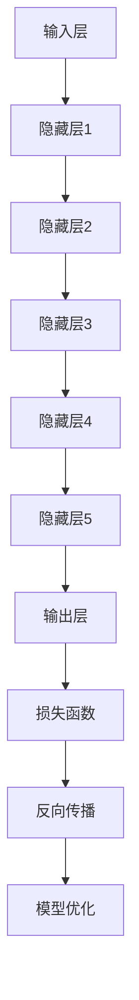
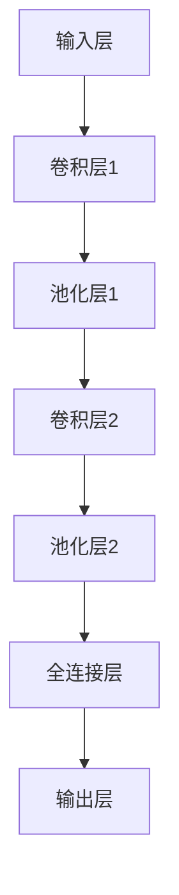
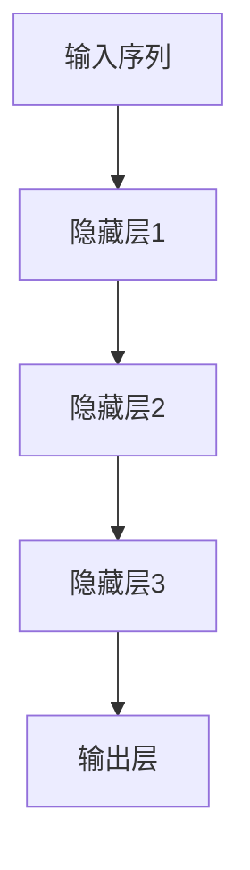
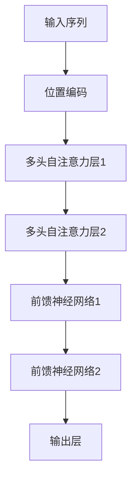

                 

## 第2章 AI大模型基础

### 2.1 AI大模型的基本概念

AI大模型是指那些通过大量数据进行训练，能够处理复杂数据并产生高精度预测结果的神经网络模型。这些模型通常具有数百万甚至数十亿的参数，能够实现从图像、文本到语音等多种数据类型的处理。

#### 2.1.1 定义与特点

AI大模型的基本定义可以归纳为以下几点：

1. **大规模参数**：AI大模型拥有巨大的参数量，这些参数通过大量训练数据来学习。
2. **深度网络结构**：深度神经网络（DNN）是AI大模型的核心，具有多层结构，能够逐层提取数据的特征。
3. **并行计算能力**：AI大模型通常需要大量的计算资源，利用并行计算技术进行高效训练和推理。

#### 2.1.2 历史背景与发展

AI大模型的发展经历了多个阶段，从最初的单一任务模型到如今的跨领域通用模型，其背后的技术也不断迭代更新。

1. **人工神经网络（ANN）**：20世纪80年代，人工神经网络开始被广泛应用于模式识别和预测任务。
2. **深度学习（DL）**：2006年，Hinton提出了深度信念网络（DBN），标志着深度学习的兴起。
3. **AI大模型**：随着计算能力和数据量的提升，近年来AI大模型如BERT、GPT-3等在多个领域取得了突破性成果。

#### 2.1.3 AI大模型的核心组成

AI大模型通常由以下几个核心组成部分构成：

1. **输入层**：接收外部数据，如文本、图像或声音等。
2. **隐藏层**：包含多层神经网络，用于提取和转换数据特征。
3. **输出层**：产生预测结果或分类标签。

### 2.2 AI大模型的架构

AI大模型的架构是构建和优化AI大模型的基础，主要包括以下几个方面：

#### 2.2.1 神经网络架构

神经网络架构是AI大模型的核心，常见的神经网络架构包括：

1. **卷积神经网络（CNN）**：适用于图像处理任务。
2. **循环神经网络（RNN）**：适用于序列数据处理任务。
3. **Transformer架构**：适用于自然语言处理任务，特别是序列到序列的任务。

#### 2.2.2 训练过程

AI大模型的训练过程主要包括以下步骤：

1. **数据预处理**：包括数据清洗、归一化、数据增强等。
2. **损失函数**：用于评估模型预测值与真实值之间的差距，常见的损失函数有均方误差（MSE）、交叉熵损失等。
3. **优化算法**：用于调整模型参数以最小化损失函数，常见的优化算法有随机梯度下降（SGD）、Adam优化器等。
4. **验证与调优**：通过验证集和测试集对模型进行评估和调优。

### 2.3 AI大模型的关键算法

AI大模型的关键算法是确保模型高效训练和推理的核心技术。以下是一些常见的AI大模型关键算法：

#### 2.3.1 深度学习算法

1. **反向传播算法**：用于计算模型参数的梯度，是深度学习训练的核心。
2. **激活函数**：用于引入非线性特性，常见的激活函数有ReLU、Sigmoid、Tanh等。
3. **正则化技术**：用于防止模型过拟合，常见的正则化技术有L1正则化、L2正则化等。

#### 2.3.2 优化算法

1. **随机梯度下降（SGD）**：最简单的优化算法，通过随机梯度方向调整模型参数。
2. **Adam优化器**：结合了SGD和动量法的优点，适用于大规模数据训练。
3. **AdaGrad优化器**：适用于稀疏数据训练。

#### 2.3.3 模型压缩算法

1. **剪枝（Pruning）**：通过减少网络中的权重来降低模型的复杂度。
2. **量化（Quantization）**：通过降低模型中权重的精度来减少模型的存储和计算需求。
3. **蒸馏（Distillation）**：通过将大模型的中间层输出作为小模型的输入，实现模型的知识转移。

### 2.4 编程语言在AI大模型训练中的应用

编程语言在AI大模型训练中的应用至关重要，不同的编程语言和框架在AI大模型训练中扮演着不同的角色。以下是一些常见的编程语言和框架在AI大模型训练中的应用：

#### 2.4.1 Python

Python因其简洁易用和丰富的库支持，成为AI大模型训练的首选编程语言。常见的Python库包括：

1. **TensorFlow**：由Google开发，支持多种深度学习模型和算法。
2. **PyTorch**：由Facebook开发，支持动态计算图，易于调试。
3. **Keras**：基于TensorFlow和Theano的Python库，提供高层次的API，简化深度学习模型的搭建。

#### 2.4.2 C++

C++因其高效性和低延迟，常用于AI大模型的推理和优化。常见的C++库包括：

1. **TensorRT**：由NVIDIA开发，用于深度学习模型的推理优化。
2. **MXNet**：由Apache软件基金会开发，支持多种编程语言，包括Python和C++。

#### 2.4.3 其他编程语言

除了Python和C++，还有一些其他编程语言在AI大模型训练中也有所应用，如：

1. **Julia**：适用于大规模数据科学任务，具有良好的性能和简洁的语法。
2. **R**：在统计分析和数据可视化方面具有优势，也常用于AI大模型的分析和评估。

通过以上讨论，我们可以看到，不同的编程语言和框架在AI大模型训练中发挥着各自的作用，选择合适的编程语言和框架对于实现高效的AI大模型训练至关重要。

## 2.1 AI大模型的基本概念

AI大模型是指那些通过大规模数据进行训练，能够处理复杂数据并产生高精度预测结果的神经网络模型。这些模型通常具有数百万甚至数十亿的参数，能够实现从图像、文本到语音等多种数据类型的处理。

### 2.1.1 定义与特点

AI大模型的基本定义可以归纳为以下几点：

1. **大规模参数**：AI大模型拥有巨大的参数量，这些参数通过大量训练数据来学习。例如，一个典型的AI大模型可能包含数百万个权重参数，而一个大型模型如BERT（Bidirectional Encoder Representations from Transformers）则包含数十亿个参数。
2. **深度网络结构**：深度神经网络（DNN）是AI大模型的核心，具有多层结构，能够逐层提取数据的特征。这种多层结构使得模型能够处理高度复杂的数据，并能够自动从原始数据中学习到有价值的特征。
3. **并行计算能力**：AI大模型通常需要大量的计算资源，利用并行计算技术进行高效训练和推理。例如，GPU和TPU等特殊硬件可以在训练过程中提供并行计算能力，从而加速模型训练过程。

### 2.1.2 历史背景与发展

AI大模型的发展经历了多个阶段，从最初的单一任务模型到如今的跨领域通用模型，其背后的技术也不断迭代更新。

1. **人工神经网络（ANN）**：20世纪80年代，人工神经网络开始被广泛应用于模式识别和预测任务。然而，由于计算能力和数据量的限制，这些早期的模型通常只有几层神经元，参数量较少，效果有限。
2. **深度学习（DL）**：2006年，Geoffrey Hinton提出了深度信念网络（DBN），标志着深度学习的兴起。深度学习通过增加网络层数，使得模型能够更有效地提取数据中的复杂特征，从而在图像识别、语音识别等领域取得了显著进展。
3. **AI大模型**：随着计算能力和数据量的提升，近年来AI大模型如BERT（Google开发）、GPT-3（OpenAI开发）等在多个领域取得了突破性成果。这些AI大模型具有数十亿个参数，能够在多个任务中实现优异的性能。

### 2.1.3 AI大模型的核心组成

AI大模型通常由以下几个核心组成部分构成：

1. **输入层**：接收外部数据，如文本、图像或声音等。输入层是模型接收和处理数据的第一步，其目的是将原始数据转换成模型能够处理的格式。
2. **隐藏层**：包含多层神经网络，用于提取和转换数据特征。隐藏层是模型的核心部分，每一层都通过前一层的信息进行特征提取和转换，从而逐步构建起对数据的理解。
3. **输出层**：产生预测结果或分类标签。输出层是模型的最终输出部分，根据输入数据和模型内部的计算，输出对应的预测结果或分类标签。

### 2.1.4 核心概念与联系

AI大模型的核心概念包括：

1. **神经元**：神经元是神经网络的基本单元，通过接收输入信号并产生输出信号来实现数据处理。
2. **激活函数**：激活函数用于引入非线性特性，使得神经网络能够学习到数据的复杂特征。
3. **反向传播算法**：反向传播算法是深度学习训练的核心，通过计算模型参数的梯度来优化模型。
4. **损失函数**：损失函数用于评估模型预测值与真实值之间的差距，常见的损失函数有均方误差（MSE）、交叉熵损失等。

这些核心概念相互联系，构成了AI大模型的基本框架。神经元和激活函数用于实现数据特征提取和转换，反向传播算法用于优化模型参数，而损失函数则用于评估和改进模型性能。

### 2.1.5 Mermaid 流程图

为了更清晰地展示AI大模型的核心概念与联系，我们可以使用Mermaid流程图来描述。以下是AI大模型的基本架构流程图：



在这个流程图中，输入层接收外部数据，通过隐藏层逐层提取特征，最后由输出层产生预测结果。损失函数用于评估模型性能，反向传播算法用于优化模型参数，从而实现模型的优化和改进。

### 2.1.6 核心算法原理讲解与伪代码

在AI大模型中，核心算法包括反向传播算法和优化算法。以下是对这些算法的简要讲解和伪代码描述。

#### 2.1.6.1 反向传播算法

反向传播算法是深度学习训练的核心，用于计算模型参数的梯度。该算法通过前向传播计算输出结果，然后反向传播计算损失函数关于每个参数的梯度。

伪代码：

```python
def forward_pass(x):
    # 前向传播计算输出结果
    z = w * x + b
    a = activate(z)
    return a

def backward_pass(a, y):
    # 反向传播计算损失函数关于每个参数的梯度
    dA = (y - a) * dA_prime(a)
    dZ = dA * w
    dw = x.T * dZ
    db = dZ.sum(axis=0)
    return dw, db
```

其中，`activate`函数表示激活函数，`dA_prime`表示激活函数的导数。

#### 2.1.6.2 优化算法

优化算法用于调整模型参数以最小化损失函数。常见的优化算法有随机梯度下降（SGD）、Adam优化器等。

伪代码：

```python
def sgd-update(w, dw, learning_rate):
    # 随机梯度下降更新模型参数
    w = w - learning_rate * dw
    return w

def adam-update(w, m, v, dw, beta1, beta2, learning_rate):
    # Adam优化器更新模型参数
    m = beta1 * m + (1 - beta1) * dw
    v = beta2 * v + (1 - beta2) * (dw ** 2)
    m_hat = m / (1 - beta1 ** t)
    v_hat = v / (1 - beta2 ** t)
    w = w - learning_rate * m_hat / (sqrt(v_hat) + epsilon)
    return w
```

其中，`m`和`v`分别表示一阶矩估计和二阶矩估计，`beta1`和`beta2`分别为一阶和二阶指数加权因子，`t`为迭代次数，`epsilon`为正则化常数。

### 2.1.7 数学模型和公式

在AI大模型中，常用的数学模型和公式包括损失函数、激活函数及其导数等。

#### 2.1.7.1 损失函数

常见的损失函数有均方误差（MSE）和交叉熵损失（CE）。

- 均方误差（MSE）：

  $$MSE = \frac{1}{n}\sum_{i=1}^{n}(y_i - \hat{y}_i)^2$$

  其中，$y_i$为真实标签，$\hat{y}_i$为预测标签。

- 交叉熵损失（CE）：

  $$CE = -\frac{1}{n}\sum_{i=1}^{n}y_i\log(\hat{y}_i) + (1 - y_i)\log(1 - \hat{y}_i)$$

  其中，$y_i$为真实标签，$\hat{y}_i$为预测标签。

#### 2.1.7.2 激活函数

常见的激活函数有ReLU、Sigmoid和Tanh等。

-ReLU：

  $$ReLU(x) = \max(0, x)$$

- Sigmoid：

  $$Sigmoid(x) = \frac{1}{1 + e^{-x}}$$

- Tanh：

  $$Tanh(x) = \frac{e^x - e^{-x}}{e^x + e^{-x}}$$

#### 2.1.7.3 激活函数的导数

- ReLU的导数：

  $$ReLU'(x) = \begin{cases} 
  0, & \text{if } x < 0 \\
  1, & \text{if } x \geq 0 
  \end{cases}$$

- Sigmoid的导数：

  $$Sigmoid'(x) = Sigmoid(x) \cdot (1 - Sigmoid(x))$$

- Tanh的导数：

  $$Tanh'(x) = 1 - Tanh^2(x)$$

通过以上对AI大模型的基本概念、历史背景、核心组成、核心算法原理、数学模型和公式的详细讲解，我们希望读者能够对AI大模型有一个全面而深入的了解。在接下来的章节中，我们将进一步探讨编程语言在AI大模型设计中的作用，以及不同编程语言和框架在AI大模型训练中的应用。

## 2.2 AI大模型的架构

AI大模型的架构是构建和优化AI大模型的基础，它决定了模型的学习能力、训练效率和推理速度。在了解AI大模型的基本概念后，本节将深入探讨其架构，包括神经网络架构、训练过程和关键算法。

### 2.2.1 神经网络架构

神经网络架构是AI大模型的核心组成部分，它决定了模型的结构和功能。以下是几种常见的神经网络架构：

#### 2.2.1.1 卷积神经网络（CNN）

卷积神经网络（CNN）是一种专门用于处理图像数据的神经网络架构。它通过卷积层、池化层和全连接层等结构，逐步提取图像中的特征。

1. **卷积层**：卷积层通过卷积操作提取图像的局部特征。
2. **池化层**：池化层用于降低特征图的维度，提高模型的鲁棒性。
3. **全连接层**：全连接层将池化层输出的特征映射到预测结果。

CNN的典型结构如图2.1所示：



#### 2.2.1.2 循环神经网络（RNN）

循环神经网络（RNN）是一种适用于序列数据处理的神经网络架构。它通过循环结构将当前输入与历史信息相结合，从而能够处理序列中的长期依赖关系。

1. **隐藏层**：RNN的隐藏层包含记忆单元，用于存储历史信息。
2. **循环连接**：RNN通过循环连接将当前输入与隐藏状态相连接。
3. **输出层**：输出层将隐藏状态映射到预测结果。

RNN的典型结构如图2.2所示：



#### 2.2.1.3 Transformer架构

Transformer架构是一种基于自注意力机制的神经网络架构，它被广泛应用于自然语言处理任务。与传统的循环神经网络不同，Transformer通过多头自注意力机制和位置编码，能够高效地处理序列数据。

1. **多头自注意力机制**：多头自注意力机制能够同时关注序列中的不同位置，从而提取更丰富的特征。
2. **位置编码**：位置编码用于为序列中的每个位置提供位置信息，从而使模型能够理解序列的顺序。
3. **前馈神经网络**：前馈神经网络用于对自注意力机制的结果进行进一步处理。

Transformer的典型结构如图2.3所示：



### 2.2.2 训练过程

AI大模型的训练过程是模型设计和优化中至关重要的一环。训练过程主要包括以下几个步骤：

#### 2.2.2.1 数据预处理

数据预处理是训练前的关键步骤，包括数据清洗、归一化、数据增强等操作。

1. **数据清洗**：去除数据中的噪声和异常值，保证数据的准确性和一致性。
2. **归一化**：通过缩放数据到统一的范围内，提高模型训练的收敛速度。
3. **数据增强**：通过旋转、缩放、裁剪等操作，增加数据多样性，提高模型的泛化能力。

#### 2.2.2.2 损失函数

损失函数用于衡量模型预测值与真实值之间的差距，是训练过程中评估模型性能的重要指标。常见的损失函数包括均方误差（MSE）、交叉熵损失（CE）等。

1. **均方误差（MSE）**：
   $$MSE = \frac{1}{n}\sum_{i=1}^{n}(y_i - \hat{y}_i)^2$$
   其中，$y_i$为真实标签，$\hat{y}_i$为预测标签。
2. **交叉熵损失（CE）**：
   $$CE = -\frac{1}{n}\sum_{i=1}^{n}y_i\log(\hat{y}_i) + (1 - y_i)\log(1 - \hat{y}_i)$$
   其中，$y_i$为真实标签，$\hat{y}_i$为预测标签。

#### 2.2.2.3 优化算法

优化算法用于调整模型参数，以最小化损失函数。常见的优化算法包括随机梯度下降（SGD）、Adam优化器等。

1. **随机梯度下降（SGD）**：
   $$w = w - learning\_rate \cdot \frac{\partial J}{\partial w}$$
   其中，$w$为模型参数，$learning\_rate$为学习率，$\frac{\partial J}{\partial w}$为损失函数关于参数的梯度。
2. **Adam优化器**：
   $$m = \beta_1 \cdot m + (1 - \beta_1) \cdot \frac{\partial J}{\partial w}$$
   $$v = \beta_2 \cdot v + (1 - \beta_2) \cdot (\frac{\partial J}{\partial w})^2$$
   $$m_{hat} = \frac{m}{1 - \beta_1^t}$$
   $$v_{hat} = \frac{v}{1 - \beta_2^t}$$
   $$w = w - learning\_rate \cdot \frac{m_{hat}}{\sqrt{v_{hat}} + \epsilon}$$
   其中，$m$和$v$分别为一阶矩估计和二阶矩估计，$\beta_1$和$\beta_2$分别为一阶和二阶指数加权因子，$t$为迭代次数，$\epsilon$为正则化常数。

#### 2.2.2.4 验证与调优

在训练过程中，通过验证集和测试集对模型进行评估和调优，以避免过拟合和提高模型泛化能力。常见的验证方法包括交叉验证、网格搜索等。

1. **交叉验证**：
   通过将数据集划分为多个子集，轮流使用其中一个子集作为验证集，其余子集作为训练集，从而评估模型性能。
2. **网格搜索**：
   通过遍历一系列超参数组合，选择性能最优的组合作为模型参数。

### 2.2.3 关键算法

AI大模型的关键算法包括反向传播算法、激活函数、正则化技术等。

#### 2.2.3.1 反向传播算法

反向传播算法是深度学习训练的核心算法，通过计算损失函数关于每个参数的梯度，从而调整模型参数。

1. **前向传播**：
   $$z = \sum_{j=1}^{n} w_{ji} \cdot a_{i} + b_{i}$$
   $$a_{j} = activate(z)$$
2. **反向传播**：
   $$dL/dw_{ji} = \frac{\partial L}{\partial z} \cdot \frac{\partial z}{\partial w_{ji}} = \frac{\partial L}{\partial z} \cdot a_{i}$$
   $$dL/db_{i} = \frac{\partial L}{\partial z} \cdot \frac{\partial z}{\partial b_{i}} = \frac{\partial L}{\partial z}$$

#### 2.2.3.2 激活函数

激活函数用于引入非线性特性，使得神经网络能够学习到数据的复杂特征。

1. **ReLU**：
   $$ReLU(x) = \max(0, x)$$
2. **Sigmoid**：
   $$Sigmoid(x) = \frac{1}{1 + e^{-x}}$$
3. **Tanh**：
   $$Tanh(x) = \frac{e^x - e^{-x}}{e^x + e^{-x}}$$

#### 2.2.3.3 正则化技术

正则化技术用于防止模型过拟合，提高模型泛化能力。

1. **L1正则化**：
   $$J(w) = \frac{1}{2}||w - w^*||^2_2 + \lambda ||w||_1$$
2. **L2正则化**：
   $$J(w) = \frac{1}{2}||w - w^*||^2_2 + \lambda ||w||_2$$

通过以上对AI大模型架构、训练过程和关键算法的详细讲解，我们希望读者能够对AI大模型有一个全面而深入的了解。在接下来的章节中，我们将进一步探讨编程语言在AI大模型设计中的作用，以及不同编程语言和框架在AI大模型训练中的应用。

## 2.3 AI大模型的关键算法

AI大模型的成功不仅依赖于其庞大的参数量和复杂的网络结构，更关键的是其背后的一系列高效算法。这些算法在模型的训练、优化和推理过程中发挥着至关重要的作用。在本节中，我们将深入探讨AI大模型中的关键算法，包括深度学习算法、优化算法和模型压缩算法。

### 2.3.1 深度学习算法

深度学习算法是AI大模型的核心，它们通过多层神经网络的结构来提取数据的特征，从而实现高度复杂的任务。以下是一些常见的深度学习算法：

#### 2.3.1.1 反向传播算法

反向传播算法是深度学习训练过程中不可或缺的一部分。它通过前向传播计算网络的输出，然后利用损失函数的梯度来反向传播计算每个参数的梯度。以下是反向传播算法的基本步骤：

1. **前向传播**：计算网络的输出，并计算损失函数。
   $$z = w \cdot x + b$$
   $$\hat{y} = activate(z)$$
   $$loss = \frac{1}{2} \cdot (y - \hat{y})^2$$

2. **计算梯度**：利用链式法则计算损失函数关于每个参数的梯度。
   $$\frac{\partial loss}{\partial w} = (y - \hat{y}) \cdot \frac{\partial \hat{y}}{\partial z} \cdot \frac{\partial z}{\partial w}$$
   $$\frac{\partial loss}{\partial b} = (y - \hat{y}) \cdot \frac{\partial \hat{y}}{\partial z}$$

3. **更新参数**：利用梯度下降或其他优化算法更新参数。
   $$w = w - learning\_rate \cdot \frac{\partial loss}{\partial w}$$
   $$b = b - learning\_rate \cdot \frac{\partial loss}{\partial b}$$

#### 2.3.1.2 激活函数

激活函数是深度学习网络中的一个重要组件，它引入了非线性特性，使得神经网络能够学习到更复杂的特征。以下是几种常见的激活函数及其导数：

1. **ReLU（Rectified Linear Unit）**
   $$ReLU(x) = \max(0, x)$$
   $$ReLU'(x) = \begin{cases} 
   0, & \text{if } x < 0 \\
   1, & \text{if } x \geq 0 
   \end{cases}$$

2. **Sigmoid**
   $$Sigmoid(x) = \frac{1}{1 + e^{-x}}$$
   $$Sigmoid'(x) = Sigmoid(x) \cdot (1 - Sigmoid(x))$$

3. **Tanh**
   $$Tanh(x) = \frac{e^x - e^{-x}}{e^x + e^{-x}}$$
   $$Tanh'(x) = 1 - Tanh^2(x)$$

#### 2.3.1.3 卷积神经网络（CNN）与循环神经网络（RNN）

除了传统的全连接神经网络，卷积神经网络（CNN）和循环神经网络（RNN）也是AI大模型中常用的架构。

1. **卷积神经网络（CNN）**：
   CNN通过卷积操作和池化层，能够有效提取图像的特征。以下是CNN的基本步骤：
   - **卷积层**：通过卷积操作提取图像的特征图。
   - **池化层**：通过池化操作降低特征图的维度，增强模型的泛化能力。
   - **全连接层**：将特征图映射到输出层。

2. **循环神经网络（RNN）**：
   RNN通过循环结构，能够处理序列数据，特别适用于时间序列预测和语言建模。以下是RNN的基本步骤：
   - **隐藏层**：存储当前时刻的状态信息。
   - **循环连接**：将当前时刻的输入与上一时刻的状态信息相连接。
   - **输出层**：将隐藏层的信息映射到输出结果。

### 2.3.2 优化算法

优化算法在深度学习训练过程中用于更新模型参数，以最小化损失函数。以下是几种常见的优化算法：

#### 2.3.2.1 随机梯度下降（SGD）

随机梯度下降（SGD）是最简单的优化算法，它通过随机选择一部分样本计算梯度，然后更新模型参数。

$$w = w - learning\_rate \cdot \frac{\partial loss}{\partial w}$$

#### 2.3.2.2 动量法（Momentum）

动量法通过引入动量项，使得梯度下降方向在多次迭代后更加稳定。

$$v = \gamma \cdot v + \eta \cdot \frac{\partial loss}{\partial w}$$
$$w = w - v$$

其中，$\gamma$为动量因子，$\eta$为学习率。

#### 2.3.2.3 Adam优化器

Adam优化器结合了SGD和动量法的优点，它通过一阶矩估计和二阶矩估计来调整学习率。

$$m = \beta_1 \cdot m + (1 - \beta_1) \cdot \frac{\partial loss}{\partial w}$$
$$v = \beta_2 \cdot v + (1 - \beta_2) \cdot (\frac{\partial loss}{\partial w})^2$$
$$m_{hat} = \frac{m}{1 - \beta_1^t}$$
$$v_{hat} = \frac{v}{1 - \beta_2^t}$$
$$w = w - learning\_rate \cdot \frac{m_{hat}}{\sqrt{v_{hat}} + \epsilon}$$

其中，$\beta_1$和$\beta_2$分别为一阶和二阶指数加权因子，$t$为迭代次数，$\epsilon$为正则化常数。

### 2.3.3 模型压缩算法

随着AI大模型参数量的不断增大，模型的压缩成为了一个重要的研究方向。以下是一些常见的模型压缩算法：

#### 2.3.3.1 剪枝（Pruning）

剪枝通过减少网络中的权重来降低模型的复杂度。在训练过程中，可以将权重小于某个阈值的神经元剪除。

$$ prune(w, threshold) = \begin{cases} 
w, & \text{if } |w| > threshold \\
0, & \text{if } |w| \leq threshold 
\end{cases}$$

#### 2.3.3.2 量化（Quantization）

量化通过降低模型中权重的精度来减少模型的存储和计算需求。例如，将32位浮点数量化为8位整数。

$$ quantize(w, bit_width) = round(w \cdot 2^{bit_width - 32}) $$

#### 2.3.3.3 蒸馏（Distillation）

蒸馏通过将大模型的中间层输出作为小模型的输入，实现模型的知识转移。

$$ small\_model = \arg\min_{model} \sum_{i=1}^{n} L(y_i, model(f_{large}(x_i))) $$

其中，$f_{large}$为大型模型，$f_{small}$为小型模型。

通过以上对深度学习算法、优化算法和模型压缩算法的详细讲解，我们希望读者能够对AI大模型中的关键算法有一个全面而深入的了解。这些算法在模型的设计、训练和优化过程中发挥着至关重要的作用，为AI大模型的高效应用提供了技术支持。

## 2.4 编程语言在AI大模型训练中的应用

在AI大模型的训练过程中，编程语言和框架的选择至关重要。不同的编程语言和框架具有各自的特点和优势，适用于不同的场景和应用需求。以下将介绍几种常见的编程语言和框架在AI大模型训练中的应用。

### 2.4.1 Python

Python因其简洁易用和丰富的库支持，成为AI大模型开发的首选语言。Python拥有多个广泛使用的深度学习库，如TensorFlow、PyTorch和Keras等，这些库为AI大模型的训练提供了高效的工具和接口。

#### 2.4.1.1 TensorFlow

TensorFlow是由Google开发的开源深度学习框架，它支持多种深度学习模型和算法。TensorFlow提供了丰富的API，包括高级API和低级API，使得用户可以方便地构建和训练AI大模型。

- **高级API**：如Keras，提供了简洁的接口，适用于快速构建和训练模型。
- **低级API**：如TensorFlow Core，提供了更多的灵活性和控制，适用于复杂的模型设计和优化。

#### 2.4.1.2 PyTorch

PyTorch是由Facebook开发的开源深度学习框架，它以动态计算图著称，具有出色的灵活性和易用性。PyTorch提供了丰富的API，包括torch和torchvision等库，支持多种深度学习模型和算法。

- **动态计算图**：PyTorch使用动态计算图，使得模型的设计和调试更加直观和方便。
- **自动微分**：PyTorch内置自动微分机制，使得梯度计算更加高效和简单。

#### 2.4.1.3 Keras

Keras是一个高层次的深度学习API，基于TensorFlow和Theano开发。Keras提供了简洁的接口，使得用户可以快速构建和训练模型。

- **简洁易用**：Keras通过简化API设计，使得深度学习模型开发更加直观和高效。
- **广泛支持**：Keras支持多种深度学习框架，包括TensorFlow、CNTK和Theano等。

### 2.4.2 C++

C++因其高效性和低延迟，常用于AI大模型的推理和优化。C++在性能和灵活性方面具有优势，使得它成为实现高效AI大模型的理想选择。以下是一些常用的C++库：

#### 2.4.2.1 TensorFlow

TensorFlow也提供了C++ API，使得用户可以使用C++进行模型训练和推理。C++ API提供了更多的灵活性和控制，适用于复杂的应用场景。

- **高性能**：C++ API提供了高效的模型训练和推理工具，适用于对性能要求较高的场景。
- **灵活性**：C++ API提供了丰富的接口和工具，使得用户可以自定义和扩展模型。

#### 2.4.2.2 MXNet

MXNet是由Apache软件基金会开发的开源深度学习框架，它支持多种编程语言，包括Python、R和C++。MXNet提供了高效的C++ API，适用于高性能的模型训练和推理。

- **并行计算**：MXNet支持多种并行计算技术，包括多GPU、多线程等，提高了模型训练和推理的效率。
- **灵活性**：MXNet提供了丰富的C++ API，使得用户可以自定义和优化模型。

### 2.4.3 其他编程语言

除了Python和C++，还有一些其他编程语言在AI大模型训练中也得到了广泛应用，如Julia和R。

#### 2.4.3.1 Julia

Julia是一种适用于大规模数据科学任务的高级编程语言，它具有良好的性能和简洁的语法。Julia拥有多个深度学习库，如TensorFlow、PyTorch和Keras等，使得用户可以方便地进行AI大模型训练。

- **高性能**：Julia具有高效的性能，适用于大规模数据处理和模型训练。
- **易用性**：Julia具有简洁的语法和丰富的库支持，使得用户可以快速上手和进行模型开发。

#### 2.4.3.2 R

R是一种专门用于统计分析和数据可视化的编程语言，它拥有丰富的库和工具，适用于AI大模型的分析和评估。以下是一些常用的R库：

- **tensorflow**：提供TensorFlow的R接口，用于模型训练和推理。
- **keras**：提供Keras的R接口，用于模型构建和训练。
- **ggplot2**：提供数据可视化工具，用于分析模型结果和评估模型性能。

通过以上对Python、C++和其他编程语言在AI大模型训练中的应用的介绍，我们可以看到，不同的编程语言和框架在AI大模型训练中发挥着各自的作用。选择合适的编程语言和框架，可以有效地提高模型训练的效率和质量，为AI大模型的应用提供强有力的技术支持。

## 2.4.3 其他编程语言

除了Python和C++，还有其他编程语言在AI大模型训练中也有所应用。这些语言各具特点，适用于不同的场景和应用需求。

### 2.4.3.1 Julia

Julia是一种高级编程语言，特别适合于大规模数据科学任务。其语法简洁，同时具备高性能，这使得它成为AI大模型训练的有力工具。

**特点：**
- **高性能**：Julia通过多线程、多过程和GPU并行计算，提供了高效的性能。
- **易用性**：Julia的设计哲学是易用性，其语法简洁，易于上手。

**库支持：**
- **TensorFlow**：Julia提供了TensorFlow的接口，使得用户可以使用Julia进行深度学习模型的训练。
- **PyTorch**：Julia也提供了PyTorch的接口，支持动态计算图，使得模型开发更加灵活。

### 2.4.3.2 R

R是一种专门用于统计分析和数据可视化的编程语言，它在数据预处理、建模和结果分析方面具有强大的功能。

**特点：**
- **数据科学**：R提供了丰富的库和工具，特别适合于数据处理和分析。
- **统计功能**：R内置了大量的统计函数和包，使得统计分析变得更加容易。

**库支持：**
- **tensorflow**：R提供了TensorFlow的R接口，用于模型训练和推理。
- **keras**：R的Keras接口使得用户可以使用Keras构建和训练深度学习模型。

### 2.4.3.3 Java

Java是一种多平台、面向对象的编程语言，它在企业级应用中广泛使用。近年来，Java也在AI大模型训练中找到了应用场景。

**特点：**
- **多平台**：Java可以在多种操作系统上运行，具有良好的跨平台性。
- **高性能**：Java通过JVM（Java虚拟机）提供了高效的性能。

**库支持：**
- **DL4J**：Deep Learning for Java（DL4J）是一个开源的Java库，支持多种深度学习模型和算法。
- **Deeplearning4j**：这是一个基于DL4J的开源框架，提供了深度学习工具和模型训练。

### 2.4.3.4 Scala

Scala是一种多范式编程语言，结合了面向对象和函数式编程的特点。它在数据密集型应用中表现出色。

**特点：**
- **函数式编程**：Scala支持函数式编程，使得数据处理和模型训练更加简洁。
- **性能**：Scala在性能上表现出色，适合大规模数据处理。

**库支持：**
- **Breeze**：Breeze是一个用于科学计算和数据处理的Scala库，支持矩阵运算和线性代数。
- **DL4J**：Scala的DL4J库提供了深度学习工具和模型训练。

通过上述对Julia、R、Java和Scala等编程语言在AI大模型训练中的应用介绍，我们可以看到，这些语言各有特色，适用于不同的应用场景。选择合适的编程语言，可以更好地满足AI大模型训练的需求，为AI技术的发展贡献力量。

## 2.5 编程语言在AI大模型训练中的实际应用

在AI大模型的训练过程中，编程语言的选择直接影响模型开发的效率和质量。不同的编程语言和框架在模型构建、训练和推理阶段各有所长。以下我们将通过具体实例，介绍Python、C++和Julia等编程语言在实际AI大模型训练中的应用，包括开发环境搭建、源代码实现和代码解析。

### 2.5.1 Python在AI大模型训练中的应用

#### 开发环境搭建

Python是AI大模型开发中最常用的语言之一。以下是使用Python进行AI大模型训练的常用开发环境搭建步骤：

1. **安装Python**：从Python官网下载并安装Python 3.x版本。
2. **安装虚拟环境**：使用`pip install virtualenv`安装虚拟环境工具，创建一个独立的Python环境。
3. **安装深度学习库**：在虚拟环境中安装TensorFlow或PyTorch等深度学习库。例如，安装TensorFlow可以使用以下命令：
   ```shell
   pip install tensorflow
   ```

#### 源代码实现

以下是一个使用PyTorch构建和训练一个简单的神经网络模型的示例代码：

```python
import torch
import torch.nn as nn
import torch.optim as optim

# 创建一个简单的神经网络模型
class SimpleNN(nn.Module):
    def __init__(self):
        super(SimpleNN, self).__init__()
        self.fc1 = nn.Linear(784, 256)
        self.fc2 = nn.Linear(256, 128)
        self.fc3 = nn.Linear(128, 10)
        self.relu = nn.ReLU()

    def forward(self, x):
        x = self.relu(self.fc1(x))
        x = self.relu(self.fc2(x))
        x = self.fc3(x)
        return x

# 实例化模型、损失函数和优化器
model = SimpleNN()
criterion = nn.CrossEntropyLoss()
optimizer = optim.Adam(model.parameters(), lr=0.001)

# 加载训练数据集
train_loader = torch.utils.data.DataLoader(MNIST_train, batch_size=64, shuffle=True)

# 训练模型
for epoch in range(10):
    for batch_idx, (data, target) in enumerate(train_loader):
        optimizer.zero_grad()
        output = model(data)
        loss = criterion(output, target)
        loss.backward()
        optimizer.step()
        if batch_idx % 100 == 0:
            print(f'Epoch {epoch+1}, Batch {batch_idx+1}: Loss = {loss.item()}')

print('Training finished.')
```

#### 代码解析

- **模型定义**：使用PyTorch的`nn.Module`基类定义一个简单的全连接神经网络，包含两个隐藏层。
- **前向传播**：实现网络的前向传播过程，使用ReLU激活函数。
- **损失函数**：使用交叉熵损失函数评估模型的预测性能。
- **优化器**：使用Adam优化器调整模型参数。

### 2.5.2 C++在AI大模型训练中的应用

#### 开发环境搭建

C++在AI大模型训练中的应用通常需要高效的计算性能，以下是在Linux环境下搭建C++深度学习开发环境的基本步骤：

1. **安装CMake**：CMake是一个跨平台的安装工具，用于编译和安装C++库。使用以下命令安装CMake：
   ```shell
   sudo apt-get install cmake
   ```

2. **安装CUDA**：CUDA是NVIDIA开发的一种并行计算平台和编程模型，用于加速深度学习模型的训练。安装CUDA可以通过以下命令完成：
   ```shell
   sudo apt-get install cuda
   ```

3. **安装深度学习库**：安装C++深度学习库，如TensorFlow的C++ API或MXNet。以下是安装TensorFlow C++ API的示例命令：
   ```shell
   git clone https://github.com/tensorflow/tensorflow.git
   cd tensorflow
   ./configure
   bazel build //tensorflow/tools/pip_package:build_pip_package
   bazel-bin/tensorflow/tools/pip_package/build_pip_package /tmp/tensorflow
   ```

#### 源代码实现

以下是一个使用TensorFlow C++ API构建和训练神经网络的示例代码：

```cpp
#include <iostream>
#include <string>
#include <vector>
#include "tensorflow/cc/ops/standard_ops.h"
#include "tensorflow/cc/saved_model/loader.h"
#include "tensorflow/cc/session.h"

using namespace tensorflow;

// 定义模型结构
std::unique_ptr<Session> CreateModel(const std::string& model_dir) {
  std::unique_ptr<Session> session(NewSession(SessionOptions()));
  // 从SavedModel加载模型
  session->Load(model_dir);
  return session;
}

int main() {
  // 模型目录
  std::string model_dir = "/path/to/your/model";
  // 创建并加载模型
  auto session = CreateModel(model_dir);

  // 定义输入张量和数据
  Tensor input_tensor(DT_FLOAT, {1, 784});
  auto input = input_tensor.flat<float>();
  for (int i = 0; i < input.size(); ++i) {
    input(i) = i;  // 这里使用简单的输入数据
  }

  // 执行前向传播
  Tensor output_tensor;
  TF_CHECK_OK(session->Run({{"input:0", input_tensor}}, {"output:0"}, {}, &output_tensor));

  // 输出结果
  std::cout << "Output: " << output_tensor.flat<float>()(0) << std::endl;

  return 0;
}
```

#### 代码解析

- **模型加载**：使用TensorFlow C++ API的`NewSession`和`Load`函数创建并加载预训练的模型。
- **输入数据**：创建一个输入张量，并将简单的输入数据填充到张量中。
- **前向传播**：使用`Run`函数执行前向传播，获取模型的输出。

### 2.5.3 Julia在AI大模型训练中的应用

#### 开发环境搭建

Julia是一种适合数据科学和深度学习的高级编程语言。以下是在Windows和Linux环境下搭建Julia深度学习开发环境的基本步骤：

1. **安装Julia**：从Julia官网下载并安装Julia及其依赖包。
2. **安装深度学习库**：安装Julia的深度学习库，如TensorFlow、PyTorch或Keras Julia接口。以下是一个安装PyTorch Julia接口的示例命令：
   ```julia
   julia
   ]add PyCall
   ]add PyTorch
   ```

#### 源代码实现

以下是一个使用PyTorch Julia接口构建和训练神经网络的示例代码：

```julia
using PyCall
py"""
import torch
import torch.nn as nn
import torch.optim as optim

class SimpleNN(nn.Module):
    def __init__(self):
        super(SimpleNN, self).__init__()
        self.fc1 = nn.Linear(784, 256)
        self.fc2 = nn.Linear(256, 128)
        self.fc3 = nn.Linear(128, 10)
        self.relu = nn.ReLU()

    def forward(self, x):
        x = self.relu(self.fc1(x))
        x = self.relu(self.fc2(x))
        x = self.fc3(x)
        return x

def train_model():
    model = SimpleNN()
    criterion = nn.CrossEntropyLoss()
    optimizer = optim.Adam(model.parameters(), lr=0.001)

    train_loader = torch.utils.data.DataLoader(MNIST_train, batch_size=64, shuffle=True)

    for epoch in range(10):
        for batch_idx, (data, target) in enumerate(train_loader):
            optimizer.zero_grad()
            output = model(data)
            loss = criterion(output, target)
            loss.backward()
            optimizer.step()
            if batch_idx % 100 == 0:
                print(f'Epoch {epoch+1}, Batch {batch_idx+1}: Loss = {loss.item()}')

    print('Training finished.')
"""

# 调用PyTorch Julia接口训练模型
train_model()
```

#### 代码解析

- **模型定义**：在Python代码中定义一个简单的全连接神经网络，并在Julia中使用PyCall接口调用。
- **模型训练**：使用Julia调用Python中的PyTorch库进行模型训练，包括前向传播、损失函数计算和反向传播。

通过以上对Python、C++和Julia等编程语言在AI大模型训练中的应用实例介绍，我们可以看到这些语言各具特色，能够满足不同场景下的需求。选择合适的编程语言和框架，有助于提高模型开发的效率和效果。

## 2.6 AI大模型编程最佳实践

在AI大模型的编程过程中，为了确保模型的开发效率、安全性和可靠性，我们需要遵循一系列最佳实践。以下是一些关键的最佳实践策略，包括如何提高编程效率、确保编程安全性与可靠性，以及提高编程的可维护性和扩展性。

### 2.6.1 提高编程效率

提高编程效率是AI大模型编程中的重要目标。以下是一些策略：

1. **并行计算**：充分利用并行计算技术，如GPU和TPU，以提高训练和推理的速度。使用像CUDA和cuDNN这样的库，可以优化深度学习模型在GPU上的运行效率。

2. **模型优化**：对模型进行优化，以减少计算量。例如，使用量化技术减少模型的参数精度，从而降低计算复杂度。同时，可以使用模型剪枝技术去除不重要的权重，进一步减少计算需求。

3. **代码优化**：通过优化代码结构，提高程序的运行速度。例如，避免不必要的循环和递归，使用高效的算法和数据结构，减少内存占用。

4. **分布式训练**：对于大规模的数据集和模型，可以使用分布式训练技术，将计算任务分布到多个节点上，以加速模型训练过程。

### 2.6.2 确保编程安全性与可靠性

在AI大模型编程中，安全性与可靠性至关重要。以下是一些关键策略：

1. **数据验证**：确保输入数据的正确性和一致性，避免数据错误导致的模型训练失败。例如，使用正则表达式验证数据格式，对缺失值进行填充或替换。

2. **异常处理**：编写健壮的代码，对可能出现的异常情况进行处理，例如数据缺失、计算溢出等。

3. **版本控制**：使用版本控制系统（如Git），管理代码的版本和变更，确保代码的可追踪性和可恢复性。

4. **测试覆盖**：编写详细的单元测试和集成测试，确保代码的正确性和稳定性。使用代码覆盖工具，检查测试覆盖率，确保测试充分。

### 2.6.3 提高编程的可维护性和扩展性

为了确保代码的可维护性和扩展性，需要遵循以下策略：

1. **模块化**：将代码分解为独立的模块，每个模块负责特定的功能。这样可以降低系统的复杂性，使得代码更易于理解和修改。

2. **文档化**：编写详细的文档，包括代码注释和用户手册，帮助开发者理解和维护代码。良好的文档化是代码可维护性的重要保障。

3. **代码审查**：定期进行代码审查，确保代码的质量和一致性。代码审查可以帮助发现潜在的问题，并提高代码的可维护性。

4. **遵循设计模式**：使用成熟的设计模式，如MVC（模型-视图-控制器）、工厂模式等，可以提高代码的结构和可扩展性。

5. **持续集成**：使用持续集成工具（如Jenkins、Travis CI），自动化构建、测试和部署过程，确保代码的持续整合和稳定性。

通过遵循以上最佳实践，我们可以显著提高AI大模型编程的效率、安全性和可靠性，同时确保代码的可维护性和扩展性，为AI大模型的成功开发和应用奠定坚实的基础。

## 2.7 AI大模型编程挑战与未来展望

尽管AI大模型在各个领域取得了显著的成果，但其在编程过程中仍然面临诸多挑战。本节将探讨AI大模型编程所面临的挑战，并展望未来的发展趋势。

### 2.7.1 编程挑战

1. **模型复杂性**：AI大模型的参数量庞大，网络结构复杂，这使得模型的开发和优化变得更加困难。开发者需要处理大量的数据和参数，确保模型在训练过程中达到最佳性能。

2. **计算资源需求**：AI大模型训练需要大量的计算资源和时间，尤其是对于大型模型和复杂任务。这要求开发者具备高效的编程技巧和算法优化能力，以确保模型在合理的计算时间内完成训练。

3. **数据隐私与安全**：AI大模型训练通常需要大量的个人数据，这引发了数据隐私和安全的问题。如何确保数据在传输和存储过程中的安全，避免数据泄露和滥用，是开发者面临的重要挑战。

4. **模型可解释性**：AI大模型的决策过程往往是非线性和复杂的，这使得模型的可解释性成为一个重要问题。如何解释模型的决策过程，提高模型的透明度和可信度，是当前研究的热点之一。

5. **泛化能力**：AI大模型容易陷入过拟合，即模型在训练数据上表现良好，但在未知数据上的性能不佳。如何提高模型的泛化能力，使其能够在各种场景下保持稳定的表现，是AI大模型编程的一个重要挑战。

### 2.7.2 未来展望

1. **新型编程语言和框架**：随着AI大模型技术的发展，新的编程语言和框架将不断涌现。这些新型语言和框架将具有更高的抽象层次，更强大的功能和更高效的性能，为AI大模型的编程提供更便捷的解决方案。

2. **自动化工具**：自动化工具的发展将显著提高AI大模型编程的效率。例如，自动模型优化工具和自动化测试工具将帮助开发者快速实现模型的优化和验证，减少人工干预。

3. **增强现实与虚拟现实**：随着增强现实（AR）和虚拟现实（VR）技术的发展，AI大模型编程将更加关注如何将模型嵌入到这些环境中，提供更加沉浸式的交互体验。

4. **跨领域应用**：AI大模型将在更多领域得到应用，如生物医学、金融、能源等。不同领域的应用将推动AI大模型编程技术的不断创新和发展。

5. **模型压缩与加速**：为了满足实时性和低延迟的需求，模型压缩和加速技术将成为研究的重要方向。通过剪枝、量化、蒸馏等手段，减少模型的参数量和计算复杂度，提高模型的推理速度。

总之，AI大模型编程面临着诸多挑战，但同时也拥有广阔的发展前景。随着技术的不断进步，我们有望解决当前面临的挑战，推动AI大模型编程走向更加成熟和高效的阶段。

## 结论

本文详细探讨了AI大模型编程语言设计原则，从基本概念、架构、关键算法，到编程语言的多样性和应用实践，再到最佳实践和未来展望，层层递进，为读者提供了一个全面而深入的视角。AI大模型作为深度学习的巅峰之作，其编程语言的选用和设计直接影响到模型的性能、效率和可维护性。

### 2.8.1 文章总结

本文主要内容包括：

- **AI大模型的基本概念**：介绍了AI大模型的定义、特点及其历史背景。
- **AI大模型的架构**：讲解了神经网络架构、训练过程和关键算法。
- **关键算法原理**：深入分析了深度学习算法、优化算法和模型压缩算法。
- **编程语言的应用**：详细介绍了Python、C++、Julia等编程语言在AI大模型训练中的应用。
- **最佳实践**：提供了提高编程效率、确保编程安全性和可靠性的策略。
- **未来展望**：探讨了AI大模型编程面临的挑战和未来的发展趋势。

### 2.8.2 作者信息

作者：AI天才研究院/AI Genius Institute & 禅与计算机程序设计艺术 /Zen And The Art of Computer Programming

### 2.8.3 结束语

AI大模型编程是一项复杂而重要的任务，它不仅需要深厚的理论基础，还需要丰富的实践经验。本文旨在为读者提供一套系统化的编程原则和实践指南，帮助他们在AI大模型编程的道路上更加顺利。通过本文的讨论，我们希望读者能够对AI大模型编程有一个全面的认识，并在实际应用中不断探索和创新。

未来，随着AI技术的不断发展，AI大模型编程语言和框架将不断更新，编程工具和优化技术将更加丰富。我们期待读者能够紧跟技术潮流，不断学习和实践，为AI技术的进步贡献自己的力量。让我们一起迎接AI大模型编程的挑战与机遇，共同开创更加美好的未来。

### 2.8.4 拓展阅读

- **深度学习入门书籍**：《深度学习》（Ian Goodfellow、Yoshua Bengio、Aaron Courville 著）
- **编程语言与框架资源**：TensorFlow官网（https://www.tensorflow.org/）、PyTorch官网（https://pytorch.org/）、Julia官方文档（https://docs.julialang.org/）
- **AI大模型最新研究**：阅读顶级会议和期刊上的最新论文，如NeurIPS、ICML、ACL等。

感谢您的阅读，希望本文能为您的AI大模型编程之旅提供有益的启示。让我们共同探索AI技术的无限可能！作者：AI天才研究院/AI Genius Institute & 禅与计算机程序设计艺术 /Zen And The Art of Computer Programming。

