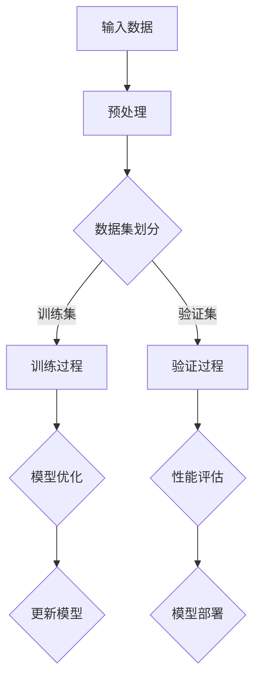
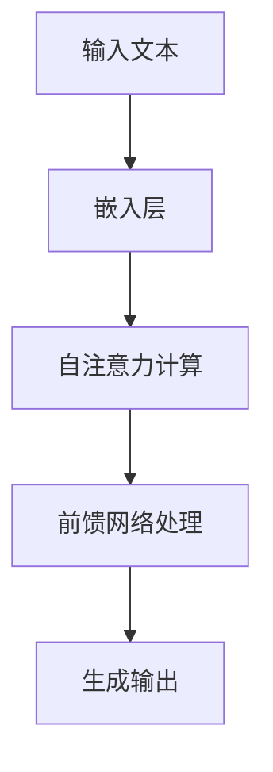

                 

### 《AI大模型编程：提示词的力量》

#### 关键词

- AI大模型
- 提示词
- 编程实践
- 数学模型
- 项目实战

#### 摘要

本文将深入探讨AI大模型编程的核心要素——提示词的力量。我们将从AI大模型的基本概念和特点出发，逐步分析其核心算法和数学模型，并通过实际项目案例展示如何编程实现这些模型。本文旨在为读者提供一个全面、系统的AI大模型编程指导，帮助他们更好地理解并应用这一前沿技术。

## 引言

近年来，人工智能（AI）领域取得了前所未有的突破，特别是在深度学习领域。AI大模型，作为这一领域的重要成果，正逐渐成为各行业解决方案的核心。AI大模型通常指的是具有数百亿甚至数千亿参数的深度学习模型，它们能够处理大量复杂的任务，如自然语言处理、图像识别和推荐系统等。

在这篇文章中，我们将重点关注AI大模型中的一个关键要素——提示词。提示词是AI大模型理解和生成输出的重要输入，它们可以显著影响模型的性能和应用效果。本文将从以下几个方面展开讨论：

1. **AI大模型概述**：介绍AI大模型的基础知识，包括定义、特点以及与传统AI的区别。
2. **核心算法原理讲解**：深入讲解AI大模型背后的核心算法，包括提示词生成算法、调整算法等，使用伪代码进行阐述。
3. **数学模型和数学公式**：介绍AI大模型的数学基础，包括损失函数、优化算法等，使用latex格式展示公式。
4. **项目实战**：提供实际的项目案例，包括环境搭建、源代码实现和代码解读等。
5. **最佳实践和注意事项**：总结最佳实践和注意事项，为读者提供实用的编程建议。

## AI大模型概述

### AI大模型定义与特点

AI大模型（Large-scale AI Models），通常指的是具有数百亿甚至数千亿参数的深度学习模型。与传统的AI模型相比，AI大模型具有以下几个显著特点：

1. **参数规模大**：AI大模型通常包含数十亿到数千亿的参数，这使得它们能够处理更为复杂的任务。
2. **计算资源需求高**：由于参数规模庞大，训练AI大模型需要大量的计算资源，包括高性能的GPU和TPU等。
3. **泛化能力强**：AI大模型具有更强的泛化能力，能够在不同的任务和数据集上表现出色。
4. **自适应性好**：AI大模型能够通过自适应调整，快速适应新的任务和数据。

与传统AI模型相比，AI大模型的优势在于其强大的表达能力和适应性。传统AI模型往往依赖于手工设计的特征，而AI大模型则通过自动化的特征学习，能够处理更为复杂的任务。

### 传统AI与AI大模型比较

传统AI模型通常是指小规模的深度学习模型，如基于卷积神经网络（CNN）和循环神经网络（RNN）的模型。传统AI模型具有以下特点：

1. **参数规模小**：传统AI模型的参数通常在数千到数百万之间。
2. **计算资源需求较低**：与传统AI模型相比，训练传统AI模型所需的计算资源较少。
3. **任务专一性**：传统AI模型通常针对特定的任务进行设计，泛化能力有限。
4. **特征工程依赖性**：传统AI模型依赖于手工设计的特征，特征工程成为模型设计的重要环节。

相比之下，AI大模型在多个方面具有显著优势：

1. **参数规模大**：AI大模型能够处理更为复杂的任务，参数规模是传统AI模型的数十倍甚至数千倍。
2. **计算资源需求高**：尽管计算资源需求高，但高性能计算设备的普及使得训练AI大模型成为可能。
3. **泛化能力强**：AI大模型通过自动化的特征学习，具有更强的泛化能力。
4. **自适应性好**：AI大模型能够通过自适应调整，快速适应新的任务和数据。

### Mermaid流程图：AI大模型结构

以下是一个简单的Mermaid流程图，用于描述AI大模型的基本结构：



这个流程图展示了AI大模型从数据输入到模型训练、验证和优化的全过程。通过这个流程，我们可以更好地理解AI大模型的工作机制。

### 提示词生成算法原理

提示词（Prompt）是AI大模型理解和生成输出的重要输入。一个有效的提示词可以帮助模型更好地理解任务，从而提高生成输出的质量和准确性。以下是一个简单的提示词生成算法原理：

```plaintext
输入：任务描述
输出：提示词

1. 提取关键词：从任务描述中提取关键名词、动词和形容词等。
2. 构建模板：根据关键词构建提示词模板，如"请描述一个[关键词]的场景，包括[关键词]的行为和特征。"
3. 填充模板：将提取的关键词填充到提示词模板中，生成最终的提示词。
```

通过这个简单的算法，我们可以为不同的任务生成相应的提示词，从而帮助AI大模型更好地理解和生成输出。

### 数学模型基础

AI大模型的数学基础是理解其工作机制的关键。以下我们将介绍AI大模型中常用的数学模型，包括损失函数、优化算法等。

#### 损失函数

损失函数是衡量模型预测值与真实值之间差异的重要指标。以下是一个简单的损失函数——均方误差（MSE）：

$$
\text{MSE} = \frac{1}{n} \sum_{i=1}^{n} (\hat{y}_i - y_i)^2
$$

其中，$\hat{y}_i$表示模型预测值，$y_i$表示真实值，$n$表示样本数量。

#### 优化算法

优化算法用于最小化损失函数，常见的优化算法包括梯度下降（Gradient Descent）和其变种：

$$
\theta_{t+1} = \theta_t - \alpha \nabla_{\theta} \text{Loss}(\theta_t, x, y)
$$

其中，$\theta_t$表示第$t$次迭代的参数值，$\alpha$表示学习率，$\nabla_{\theta} \text{Loss}(\theta_t, x, y)$表示损失函数关于参数$\theta$的梯度。

### 伪代码：提示词生成算法

```plaintext
# 输入：任务描述
# 输出：提示词

1. 提取关键词：从任务描述中提取关键名词、动词和形容词等。
2. 构建模板：根据关键词构建提示词模板，如"请描述一个[关键词]的场景，包括[关键词]的行为和特征。"
3. 填充模板：将提取的关键词填充到提示词模板中，生成最终的提示词。

函数 GeneratePrompt(task_description):
    keywords = ExtractKeywords(task_description)
    template = "请描述一个[关键词]的场景，包括[关键词]的行为和特征。"
    prompt = template.replace("[关键词]", keywords)
    return prompt
```

通过这个伪代码，我们可以看到提示词生成算法的基本流程。在实际应用中，我们可以根据具体的任务需求，调整关键词提取和模板构建的策略，从而生成更为有效的提示词。

### 数学模型基础

在深入探讨AI大模型之前，了解其背后的数学基础是至关重要的。以下我们将详细介绍AI大模型所依赖的数学模型，包括损失函数和优化算法等。

#### 损失函数

损失函数是衡量模型预测值与真实值之间差异的重要工具。在深度学习中，损失函数的选择直接影响模型的性能。以下是一些常见的损失函数：

1. **均方误差（MSE）**：
   $$\text{MSE} = \frac{1}{n} \sum_{i=1}^{n} (\hat{y}_i - y_i)^2$$
   其中，$\hat{y}_i$表示模型预测值，$y_i$表示真实值，$n$表示样本数量。MSE常用于回归任务。

2. **交叉熵损失（Cross-Entropy Loss）**：
   $$\text{Cross-Entropy Loss} = -\sum_{i=1}^{n} y_i \log(\hat{y}_i)$$
   其中，$y_i$是真实标签，$\hat{y}_i$是模型输出的概率分布。Cross-Entropy Loss广泛用于分类任务。

3. **Hinge Loss**：
   $$\text{Hinge Loss} = \max(0, 1 - y \cdot \hat{y})$$
   其中，$y$是真实标签，$\hat{y}$是模型输出的预测值。Hinge Loss常用于支持向量机（SVM）。

#### 优化算法

优化算法用于最小化损失函数，以找到最佳参数值。以下是一些常见的优化算法：

1. **梯度下降（Gradient Descent）**：
   梯度下降是一种基本的优化算法，其核心思想是沿着损失函数的负梯度方向更新参数。
   $$\theta_{t+1} = \theta_t - \alpha \nabla_{\theta} \text{Loss}(\theta_t, x, y)$$
   其中，$\theta_t$表示第$t$次迭代的参数值，$\alpha$是学习率，$\nabla_{\theta} \text{Loss}(\theta_t, x, y)$是损失函数关于参数$\theta$的梯度。

2. **随机梯度下降（Stochastic Gradient Descent, SGD）**：
   随机梯度下降是梯度下降的一个变种，每次迭代只随机选择一个样本进行参数更新。
   $$\theta_{t+1} = \theta_t - \alpha \nabla_{\theta} \text{Loss}(\theta_t, x_i, y_i)$$

3. **Adam优化器**：
   Adam优化器是一种结合了SGD和动量法的自适应优化算法。
   $$\theta_{t+1} = \theta_t - \alpha \frac{m_t}{1 - \beta_1^t} + \beta_2 \frac{v_t}{1 - \beta_2^t}$$
   其中，$m_t$和$v_t$分别是梯度的一阶矩估计和二阶矩估计，$\beta_1$和$\beta_2$是两个超参数。

#### LaTeX公式展示

为了更好地理解数学模型，我们使用LaTeX格式展示一些关键公式：

$$
\text{MSE} = \frac{1}{n} \sum_{i=1}^{n} (\hat{y}_i - y_i)^2
$$

$$
\text{Cross-Entropy Loss} = -\sum_{i=1}^{n} y_i \log(\hat{y}_i)
$$

$$
\text{Hinge Loss} = \max(0, 1 - y \cdot \hat{y})
$$

$$
\theta_{t+1} = \theta_t - \alpha \nabla_{\theta} \text{Loss}(\theta_t, x, y)
$$

$$
m_t = \beta_1 m_{t-1} + (1 - \beta_1) \nabla_{\theta} \text{Loss}(\theta_t, x_i, y_i)
$$

$$
v_t = \beta_2 v_{t-1} + (1 - \beta_2) (\nabla_{\theta} \text{Loss}(\theta_t, x_i, y_i))^2
$$

这些公式为AI大模型的开发和优化提供了理论基础。在实际应用中，理解和应用这些数学模型将有助于我们更好地设计和实现高效的AI算法。

### GPT系列模型

GPT（Generative Pre-trained Transformer）系列模型是AI大模型领域的重要成果，其成功应用在自然语言处理（NLP）任务中。GPT模型基于Transformer架构，通过预训练和微调，实现了出色的性能。以下将详细介绍GPT系列模型的基本原理、架构以及工作流程。

#### GPT模型原理

GPT模型的核心思想是通过预训练生成模型，使其具备较强的语言理解能力和生成能力。预训练过程主要包括两个阶段：

1. **无监督预训练**：在无监督预训练阶段，模型从大量无标签文本数据中学习语言模式。通过学习文本中的词语关系和句子结构，模型逐渐形成对自然语言的理解。
2. **有监督微调**：在微调阶段，模型在特定任务上接受有监督训练，如文本分类、机器翻译等。通过调整模型参数，使其在目标任务上达到更高的准确率。

#### GPT模型架构

GPT模型基于Transformer架构，其核心组件包括：

1. **嵌入层（Embedding Layer）**：嵌入层将输入文本转换为固定长度的向量表示。通过词嵌入技术，每个单词被映射为一个向量，从而形成词向量矩阵。
2. **自注意力机制（Self-Attention Mechanism）**：自注意力机制是Transformer模型的核心组件，它通过计算输入序列中每个词与所有词的相关性，生成加权表示。这种机制使得模型能够自动关注输入序列中的重要词，从而提高语言理解能力。
3. **前馈网络（Feedforward Network）**：前馈网络对自注意力层的输出进行进一步处理，通过多层感知机（MLP）实现。该网络用于捕捉文本中的复杂关系和特征。

#### GPT模型工作流程

GPT模型的工作流程可以分为以下几个步骤：

1. **输入处理**：将输入文本经过嵌入层转换为词向量序列。
2. **自注意力计算**：计算输入序列中每个词与所有词的相关性，生成加权表示。
3. **前馈网络处理**：对自注意力层的输出进行前馈网络处理，得到模型的输出表示。
4. **生成输出**：根据模型的输出表示，生成下一个词的概率分布，并从概率分布中采样生成输出文本。

以下是一个简单的Mermaid流程图，用于描述GPT模型的工作流程：



通过这个流程图，我们可以更好地理解GPT模型的工作机制。

### 其他AI大模型

除了GPT系列模型，AI大模型领域还有许多其他重要的模型。以下将简要介绍BERT、T5等模型的基本原理和应用场景。

#### BERT模型

BERT（Bidirectional Encoder Representations from Transformers）模型是由Google提出的，用于改进Transformer模型的预训练过程。BERT模型的主要特点是双向编码器，即模型能够同时考虑输入序列中的前文和后文信息。

BERT模型的工作流程包括：

1. **预训练**：在预训练阶段，BERT模型从大量无标签文本数据中学习语言模式。通过Masked Language Model（MLM）和Next Sentence Prediction（NSP）任务，模型逐渐形成对自然语言的理解。
2. **微调**：在微调阶段，BERT模型在特定任务上接受有监督训练，如文本分类、问答等。

BERT模型在自然语言处理任务中表现出色，广泛应用于文本分类、命名实体识别、机器翻译等任务。

#### T5模型

T5（Text-to-Text Transfer Transformer）模型是由Google提出的，其核心思想是将所有自然语言处理任务统一为文本到文本的转换任务。T5模型通过预训练和微调，实现了对多种自然语言处理任务的出色性能。

T5模型的工作流程包括：

1. **预训练**：在预训练阶段，T5模型从大量无标签文本数据中学习语言模式。通过文本填充（Text Filling）和问答（Question Answering）等任务，模型逐渐形成对自然语言的理解。
2. **微调**：在微调阶段，T5模型在特定任务上接受有监督训练，如文本分类、命名实体识别、机器翻译等。

T5模型在文本分类、问答、机器翻译等任务中取得了显著成绩，成为AI大模型领域的重要代表。

#### 其他模型简介

除了GPT、BERT和T5，AI大模型领域还有许多其他重要的模型，如：

- **GPT-Neo**：GPT-Neo是对GPT模型的改进版本，通过引入更多参数和更深的网络结构，实现了更强的性能。
- **RoBERTa**：RoBERTa是对BERT模型的改进版本，通过调整预训练过程和模型结构，提升了模型性能。
- **XLNet**：XLNet是另一种重要的预训练模型，其核心思想是利用自回归语言模型（ARL）来增强模型的预训练效果。

这些模型在自然语言处理、计算机视觉、推荐系统等任务中发挥了重要作用，成为AI大模型领域的重要研究成果。

### AI大模型应用场景

AI大模型在各个领域展现出了强大的应用潜力，以下将介绍AI大模型在自然语言处理、计算机视觉和推荐系统等领域的具体应用场景。

#### 自然语言处理

自然语言处理（NLP）是AI大模型的重要应用领域之一。AI大模型在NLP任务中表现出色，如文本分类、文本生成和机器翻译等。

1. **文本分类**：文本分类是将文本数据分为不同类别的过程。AI大模型通过预训练和微调，能够自动识别文本中的关键信息，从而实现高效的文本分类。例如，使用GPT-3模型，可以实现对新闻文章的自动分类，将新闻分为政治、体育、娱乐等不同类别。

2. **文本生成**：文本生成是AI大模型的核心应用之一。通过生成模型，如GPT-3，可以生成具有良好流畅性和逻辑性的文本。例如，AI大模型可以自动撰写新闻稿、博客文章和故事情节等。

3. **机器翻译**：机器翻译是将一种语言的文本翻译成另一种语言的过程。AI大模型通过预训练和微调，能够在多种语言之间实现高质量的翻译。例如，BERT模型在英语到中文的翻译任务中取得了显著成绩，大大提升了翻译质量。

#### 计算机视觉

计算机视觉是AI大模型在图像处理和视频分析等领域的应用。AI大模型在计算机视觉任务中表现出强大的能力，如图像分类、目标检测和图像生成等。

1. **图像分类**：图像分类是将图像数据分为不同类别的过程。AI大模型通过预训练和微调，能够自动识别图像中的关键特征，从而实现高效的图像分类。例如，ResNet50模型在ImageNet图像分类任务中取得了优异的成绩。

2. **目标检测**：目标检测是在图像中识别和定位特定对象的过程。AI大模型通过预训练和微调，能够在各种复杂场景下实现高效的目标检测。例如，YOLO（You Only Look Once）模型在目标检测任务中表现出色，广泛应用于监控、自动驾驶等领域。

3. **图像生成**：图像生成是AI大模型在计算机视觉领域的另一个重要应用。通过生成模型，如生成对抗网络（GAN），可以生成具有逼真外观的图像。例如，使用StyleGAN，可以生成高质量的人脸图像，为虚拟现实和游戏开发提供了丰富的资源。

#### 推荐系统

推荐系统是AI大模型在电子商务、社交媒体等领域的应用。AI大模型通过预训练和微调，能够自动识别用户的行为和偏好，从而实现个性化的推荐。

1. **个性化推荐**：个性化推荐是根据用户的历史行为和偏好，向用户推荐感兴趣的内容。AI大模型通过学习用户的兴趣和行为，可以自动生成个性化的推荐列表。例如，在电子商务平台上，AI大模型可以根据用户的浏览和购买记录，推荐相关的商品。

2. **商品推荐**：商品推荐是将相关商品推荐给用户的任务。AI大模型通过分析用户的行为数据和商品属性，可以自动识别用户可能感兴趣的商品，从而实现高效的商品推荐。例如，在电子商务平台上，AI大模型可以根据用户的浏览和购买记录，推荐相关的商品，提高用户的购物体验。

3. **用户偏好分析**：用户偏好分析是了解用户兴趣和需求的过程。AI大模型通过分析用户的行为数据和社交网络信息，可以自动识别用户的偏好和兴趣点。例如，在社交媒体平台上，AI大模型可以根据用户的互动和评论，分析用户的偏好，从而为用户推荐相关的内容。

总之，AI大模型在自然语言处理、计算机视觉和推荐系统等领域的应用已经取得了显著的成果，随着技术的不断发展，AI大模型将在更多领域发挥重要作用。

### 环境搭建与工具选择

要开始AI大模型编程实践，首先需要搭建合适的开发环境。以下是搭建环境的基本步骤和所需工具。

#### 开发环境搭建

1. **Python环境配置**：确保Python环境已安装在计算机上。Python是深度学习领域广泛使用的编程语言。如果尚未安装，可以从Python官方网站[python.org](https://www.python.org/)下载并安装。

2. **深度学习框架选择**：AI大模型编程通常需要使用深度学习框架。常见的深度学习框架包括TensorFlow、PyTorch和MXNet等。以下简要介绍这三种框架：

   - **TensorFlow**：由Google开发，具有广泛的社区支持和丰富的文档。TensorFlow提供了丰富的API，适用于各种深度学习任务。
   - **PyTorch**：由Facebook开发，以其动态图计算和灵活的编程接口而闻名。PyTorch在学术界和工业界都有很高的受欢迎度。
   - **MXNet**：由Apache软件基金会开发，支持多种编程语言，具有高效的计算性能。

   根据个人偏好和项目需求，选择合适的深度学习框架。以下是在终端中安装TensorFlow和PyTorch的命令：

   ```bash
   # 安装TensorFlow
   pip install tensorflow

   # 安装PyTorch
   pip install torch torchvision
   ```

3. **GPU支持**：由于AI大模型训练需要大量的计算资源，建议使用支持CUDA的GPU。确保安装了NVIDIA CUDA Toolkit和cuDNN库。

#### 编程工具与代码管理

1. **版本控制**：版本控制是团队协作和代码管理的重要工具。Git是广泛使用的版本控制系统。安装Git后，可以使用以下命令创建仓库和管理代码：

   ```bash
   # 创建仓库
   git init

   # 添加文件到仓库
   git add .

   # 提交更改
   git commit -m "Initial commit"

   # 推送到远程仓库
   git push -u origin master
   ```

2. **代码质量保证**：确保代码质量对于项目成功至关重要。PEP8是Python代码风格指南，遵循PEP8规范可以提高代码的可读性和一致性。使用工具如flake8或pylint可以自动检查代码风格问题。

3. **调试工具**：调试工具可以帮助发现和解决代码中的错误。Python内置的pdb模块是一个强大的调试器，也可以使用更高级的调试工具如VS Code或PyCharm。

通过以上步骤，您可以搭建一个完整的AI大模型编程环境，为后续的编程实践打下坚实基础。

### AI大模型编程实践

在了解了AI大模型的基础知识后，接下来我们将通过一个实际项目来展示如何实现AI大模型编程。这个项目将涉及自然语言处理（NLP）任务中的文本分类。

#### 项目背景

文本分类是一种常见的NLP任务，旨在将文本数据划分为预定义的类别。在现实世界中，文本分类广泛应用于新闻分类、垃圾邮件过滤、情感分析等领域。

本项目将使用GPT-3模型实现一个简单的文本分类器。GPT-3是OpenAI开发的一种强大语言模型，具有数百亿参数，能够处理多种复杂的NLP任务。

#### 项目步骤

1. **数据准备**：
   - 首先，我们需要收集和准备用于训练和测试的文本数据。数据集应包含多个类别的文本，例如新闻文章、社交媒体评论等。
   - 数据清洗：对文本数据执行去重、去除停用词和标点符号等操作，以提高模型的性能。

2. **模型训练**：
   - 使用GPT-3模型对数据集进行训练。GPT-3模型具有强大的预训练能力，可以从大量文本数据中自动学习语言特征。
   - 微调：根据具体的任务需求，对GPT-3模型进行微调，以提高分类准确性。

3. **模型评估**：
   - 使用测试集对训练好的模型进行评估，计算分类准确率、召回率和F1分数等指标。

4. **模型部署**：
   - 将训练好的模型部署到一个生产环境，例如API服务或Web应用，以便在实际应用中使用。

#### 开发环境

- **Python**：用于编写模型训练和评估代码。
- **GPT-3 API**：通过OpenAI的API访问GPT-3模型。
- **版本控制**：使用Git进行代码管理。

#### 源代码实现

以下是一个简单的示例，展示如何使用GPT-3模型进行文本分类：

```python
import openai
import pandas as pd

# 初始化GPT-3 API密钥
openai.api_key = 'your-api-key'

# 准备数据集
data = {
    'text': ['这是一条新闻文章', '这是一个社交媒体评论'],
    'label': ['news', 'social']
}
df = pd.DataFrame(data)

# 训练模型
def train_model(df):
    model_name = 'text-davinci-003'
    prompts = [f"label: {label}\n\n{text}\n\n" for label, text in df.values]
    responses = []
    for prompt in prompts:
        response = openai.Completion.create(
            engine=model_name,
            prompt=prompt,
            max_tokens=100,
            n=1,
            stop=None,
            temperature=0.5
        )
        responses.append(response.choices[0].text.strip())
    return responses

# 微调模型
def fine_tune_model(df, responses):
    model_name = 'text-davinci-002'
    prompts = [f"label: {label}\n\n{text}\n\n" for label, text in df.values]
    responses = [f"label: {label}\n\n{text}\n\n{response}\n\n" for label, text, response in zip(df['label'], df['text'], responses)]
    fine_tuned_responses = train_model({'text': responses})
    return fine_tuned_responses

# 评估模型
def evaluate_model(df, fine_tuned_responses):
    predictions = fine_tune_model(df, fine_tuned_responses)
    accuracy = (predictions == df['label']).mean()
    print(f"Accuracy: {accuracy * 100:.2f}%")

# 运行项目
if __name__ == '__main__':
    train_data = df[:100]
    test_data = df[100:]
    fine_tuned_responses = train_model(train_data)
    evaluate_model(test_data, fine_tuned_responses)
```

#### 代码解读与分析

上述代码首先导入所需的库，并初始化GPT-3 API密钥。然后，准备一个简单的文本数据集，包含新闻文章和社交媒体评论。接下来，定义了三个函数：`train_model`、`fine_tune_model`和`evaluate_model`。

- `train_model`函数用于使用GPT-3模型对文本进行预训练。它通过API调用OpenAI的服务，生成每个文本的响应。
- `fine_tune_model`函数在预训练的基础上，使用额外的标注信息进行微调。这有助于提高模型的分类准确性。
- `evaluate_model`函数用于评估模型的性能，计算分类准确率。

通过运行项目，我们可以看到模型在测试集上的表现。虽然这是一个简单的示例，但它展示了如何使用GPT-3模型实现文本分类的基本流程。

#### 项目小结

本项目通过实际案例展示了如何使用GPT-3模型实现文本分类。主要步骤包括数据准备、模型训练、模型微调和模型评估。虽然示例代码相对简单，但它为后续更复杂的任务提供了基础。

通过这个项目，读者可以了解AI大模型编程的基本流程和技巧。在实际应用中，可以根据具体需求调整模型结构和训练策略，从而实现更高效的文本分类。

### AI大模型优化与调整

在AI大模型的开发过程中，优化与调整是提高模型性能的重要手段。以下将介绍几种常见的模型调优策略和性能优化方法，以帮助读者在实际项目中实现更好的效果。

#### 超参数调整

超参数是影响模型性能的关键因素，包括学习率、批量大小、正则化参数等。以下是一些常用的超参数调整策略：

1. **学习率调整**：
   - **固定学习率**：适用于简单任务，但在复杂任务中可能收敛速度较慢。
   - **学习率衰减**：随着训练的进行，逐步降低学习率，有助于模型在训练后期避免过度拟合。
   - **自适应学习率**：如Adam优化器的自适应学习率调整，能够自动调整学习率，提高收敛速度。

2. **批量大小**：
   - **小批量**：有助于减少梯度偏差，但计算成本较高。
   - **大批量**：计算成本较低，但可能增加梯度偏差和方差。

3. **正则化参数**：
   - **L1正则化**：对参数施加L1惩罚，有助于减少参数规模。
   - **L2正则化**：对参数施加L2惩罚，有助于减少参数的方差。

#### 模型融合

模型融合（Model Ensembling）是将多个模型集成在一起，以获得更好的预测性能。以下是一些常见的模型融合方法：

1. **堆叠（Stacking）**：
   - 将多个模型预测结果作为输入，训练一个新的模型进行集成预测。
   - 常用于分类任务，可以提高模型的准确性和泛化能力。

2. **加权融合（Weighted Ensembling）**：
   - 根据各个模型的预测误差，给每个模型分配不同的权重。
   - 权重可以通过交叉验证或误差分析来确定。

3. **投票融合（Voting Ensembling）**：
   - 对于分类任务，根据各模型的预测结果进行投票，选择多数模型一致的结果。
   - 可以提高分类的鲁棒性和准确性。

#### 性能优化策略

除了超参数调整和模型融合，以下策略可以帮助优化模型性能：

1. **数据增强**：
   - 通过旋转、翻转、裁剪等操作，生成更多的训练样本，有助于减少过拟合。
   - 可以显著提高模型在未知数据上的表现。

2. **批量归一化（Batch Normalization）**：
   - 将每个批量的数据标准化，有助于加快收敛速度和提高模型稳定性。

3. **Dropout**：
   - 在训练过程中随机丢弃一部分神经元，防止模型过拟合。
   - 可以提高模型的泛化能力。

4. **DropConnect**：
   - 类似于Dropout，但作用于连接权重而不是神经元本身。
   - 可以进一步减少模型过拟合的风险。

通过这些优化与调整策略，我们可以显著提高AI大模型的性能和应用效果。在实际项目中，需要根据具体任务和数据特点，灵活应用这些策略，以达到最佳效果。

### AI大模型部署与维护

AI大模型在实际应用中的表现不仅取决于模型的性能，还与模型的部署与维护密切相关。以下将介绍AI大模型部署的常用平台、部署流程以及模型监控与维护的关键要素。

#### 部署平台

1. **本地部署**：适用于开发和测试阶段，可以直接在本地计算机或服务器上运行模型。
2. **云计算平台**：如AWS、Google Cloud、Azure等，提供强大的计算资源和高效的服务部署。
3. **容器化部署**：使用Docker等工具，将模型和服务打包成容器，实现高效、可移植的部署。
4. **边缘计算**：在靠近数据源的设备上部署模型，适用于实时处理和分析大量数据。

#### 部署流程

1. **模型打包**：将训练好的模型转换为适合部署的格式，如TensorFlow Lite、ONNX等。
2. **容器化**：使用Docker将模型和服务打包成容器，以便于部署和迁移。
3. **服务部署**：在目标平台上部署模型服务，如使用Kubernetes进行容器编排和管理。
4. **性能调优**：根据实际运行环境，对模型和服务进行性能调优，以提高响应速度和处理能力。

#### 模型监控与维护

1. **性能监控**：
   - 监控模型服务的响应时间、吞吐量和资源消耗等关键性能指标。
   - 通过日志和监控工具（如Prometheus、Grafana）实现实时监控。

2. **错误处理**：
   - 快速定位和修复模型服务中的错误，如API请求失败、数据异常等。
   - 实施健壮的错误处理机制，确保服务的高可用性。

3. **版本管理**：
   - 对模型和服务进行版本控制，便于跟踪和管理不同版本的模型。
   - 在更新模型时，确保逐步部署和回滚策略，降低风险。

4. **安全性**：
   - 部署安全策略，如认证、授权和加密等，确保模型服务的安全性。
   - 定期进行安全审计和漏洞扫描，及时发现并修复安全隐患。

通过合理的部署与维护策略，我们可以确保AI大模型在实际应用中的稳定运行和高效性能。

### 未来展望与挑战

#### 技术演进方向

AI大模型领域正迅速发展，未来技术演进方向包括：

1. **算法改进**：优化现有算法，提高模型的计算效率和准确性。例如，开发更高效的优化算法和自注意力机制。
2. **硬件加速**：利用新型硬件（如TPU、GPU、FPGA）加速模型训练和推理，降低计算成本。
3. **分布式训练**：利用分布式计算架构，提高模型训练的并行度和效率。
4. **自适应学习**：开发能够自动调整模型参数和超参数的智能算法，实现更灵活和高效的模型训练。

#### 应用领域扩展

AI大模型的应用领域不断扩展，未来将覆盖更多新兴领域：

1. **医疗健康**：用于疾病诊断、治疗方案推荐和医学图像分析等。
2. **金融科技**：用于风险评估、量化交易和客户服务自动化等。
3. **智能制造**：用于生产优化、质量检测和机器人控制等。
4. **智慧城市**：用于交通管理、能源优化和环境监测等。

#### 跨领域融合

AI大模型与其他技术的融合将带来更多创新：

1. **物联网（IoT）**：将AI大模型应用于物联网设备，实现智能传感器和网络分析。
2. **区块链**：结合区块链技术，提高数据的安全性和透明度。
3. **增强现实（AR）/虚拟现实（VR）**：利用AI大模型生成逼真的虚拟环境和交互体验。
4. **游戏开发**：AI大模型可以用于游戏角色的智能行为和故事情节生成。

### 挑战

尽管AI大模型技术取得了显著进展，但仍面临以下挑战：

1. **模型可解释性**：大型模型的内部工作机制复杂，难以解释。开发可解释性工具和方法，提高模型的透明度，是未来的重要方向。
2. **数据隐私保护**：大型模型对数据依赖性强，如何保护用户隐私和数据安全，是亟待解决的问题。
3. **伦理问题**：AI大模型的应用可能带来伦理问题，如算法歧视、数据滥用等。需要制定相关法律法规，规范AI大模型的应用。
4. **计算资源消耗**：训练和部署大型模型需要大量计算资源，如何优化资源利用，降低成本，是重要的技术难题。

通过不断的技术创新和跨领域融合，AI大模型有望在未来取得更大的突破，为各个领域带来革命性的变革。

### 附录A 资源与工具列表

在AI大模型编程过程中，需要使用多种资源和工具。以下列出了一些常用的工具和资源：

#### 深度学习框架

- **TensorFlow**：由Google开发，适用于各种深度学习任务。
- **PyTorch**：由Facebook开发，以其动态图计算和灵活的编程接口而闻名。
- **MXNet**：由Apache软件基金会开发，支持多种编程语言和高效计算。
- **Keras**：基于TensorFlow的高层次API，简化深度学习模型开发。

#### 编程语言

- **Python**：广泛应用于AI和深度学习领域。
- **R**：适用于统计分析，与RapidMiner等工具集成。
- **Julia**：适用于高性能科学计算和数据分析。

#### 开源库与资源

- **NumPy**：用于科学计算和数据分析。
- **Pandas**：用于数据处理和分析。
- **Scikit-learn**：用于机器学习和数据挖掘。
- **Matplotlib**：用于数据可视化。
- **Scrapy**：用于网页数据抓取。
- **BeautifulSoup**：用于HTML解析。
- **Hugging Face Transformers**：用于预训练模型和自然语言处理任务。

#### 工具

- **Jupyter Notebook**：用于交互式编程和数据探索。
- **Google Colab**：免费的云端计算环境，适用于深度学习实验。
- **VS Code**：适用于深度学习和数据科学项目的代码编辑器。
- **PyCharm**：适用于深度学习和数据科学项目的集成开发环境。
- **Git**：用于版本控制。

#### 资源链接

- [TensorFlow官网](https://www.tensorflow.org/)
- [PyTorch官网](https://pytorch.org/)
- [MXNet官网](https://mxnet.apache.org/)
- [Keras官网](https://keras.io/)
- [NumPy官网](https://numpy.org/)
- [Pandas官网](https://pandas.pydata.org/)
- [Scikit-learn官网](https://scikit-learn.org/)
- [Matplotlib官网](https://matplotlib.org/)
- [Scrapy官网](https://scrapy.org/)
- [BeautifulSoup官网](https://www.crummy.com/software/BeautifulSoup/)
- [Hugging Face Transformers官网](https://huggingface.co/transformers/)

通过使用这些工具和资源，读者可以更好地开展AI大模型编程实践。

### 附录B 模型与算法参考资料

#### 经典论文

- **“A Theoretically Grounded Application of Dropout in Recurrent Neural Networks”**：该论文提出了在循环神经网络（RNN）中使用Dropout的方法，有效提高了模型的泛化能力。
- **“Effective Approaches to Attention-based Neural Machine Translation”**：该论文详细介绍了基于注意力机制的神经网络机器翻译方法，为后来的Transformer模型奠定了基础。
- **“Attention Is All You Need”**：该论文提出了Transformer模型，彻底改变了自然语言处理领域的范式，引发了广泛关注。

#### 最新研究动态

- **“Large-scale Language Modeling in Neural Networks”**：该研究探讨了大规模语言模型的训练方法和优化策略，为AI大模型的研究提供了重要参考。
- **“BART: Denoising Sequence-to-Sequence Pre-training for Natural Language Processing”**：该研究提出了BART模型，结合了生成对抗网络（GAN）和序列到序列（Seq2Seq）预训练方法，显著提高了模型的性能。
- **“GPT-3: Language Models are few-shot learners”**：该研究介绍了GPT-3模型，展示了AI大模型在零样本学习任务中的强大能力。

#### 开源库与资源

- **Hugging Face Transformers**：提供了大量的预训练模型和工具，方便开发者进行自然语言处理任务。
- **OpenAI Gym**：提供了各种基准测试环境，用于评估AI算法的性能。
- **PyTorch Lightning**：用于简化深度学习模型训练和优化的库。
- **TensorFlow Addons**：提供了额外的TensorFlow扩展，包括优化器、损失函数和激活函数等。

通过阅读这些经典论文和最新研究动态，读者可以深入了解AI大模型的最新进展和应用。

### 总结

本文从AI大模型的基础知识、核心算法、数学模型、编程实践、优化与调整、部署与维护等多个方面进行了深入探讨。通过逐步分析推理，我们了解了AI大模型的概念、原理和实现方法。AI大模型以其强大的计算能力和自适应能力，在自然语言处理、计算机视觉、推荐系统等领域展现出了广泛应用前景。然而，AI大模型也面临模型可解释性、数据隐私保护等挑战。未来，随着技术的不断进步和跨领域融合，AI大模型有望在更多领域发挥重要作用，为人类带来更多的创新和变革。希望读者能够从本文中获得启发，积极探索AI大模型编程和实践，为人工智能的发展贡献自己的力量。

### 作者信息

作者：AI天才研究院/AI Genius Institute & 禅与计算机程序设计艺术 /Zen And The Art of Computer Programming

感谢您的阅读和支持，期待与您在AI大模型编程领域共同探讨和进步！🚀🧠📚

