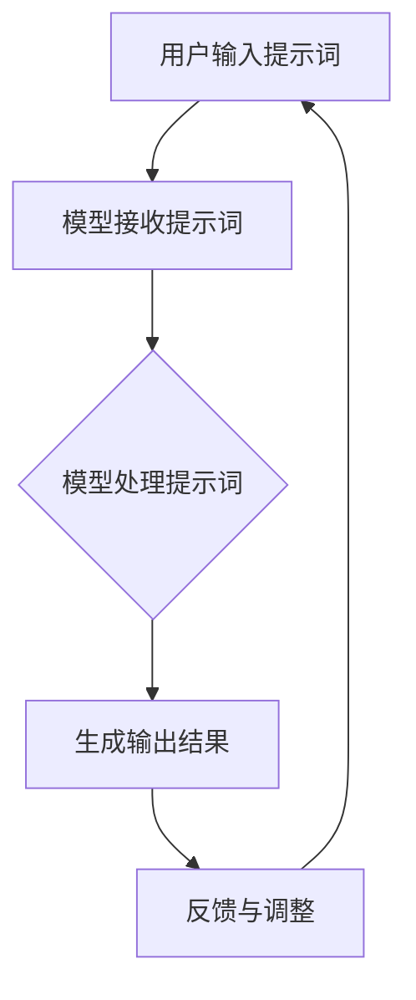
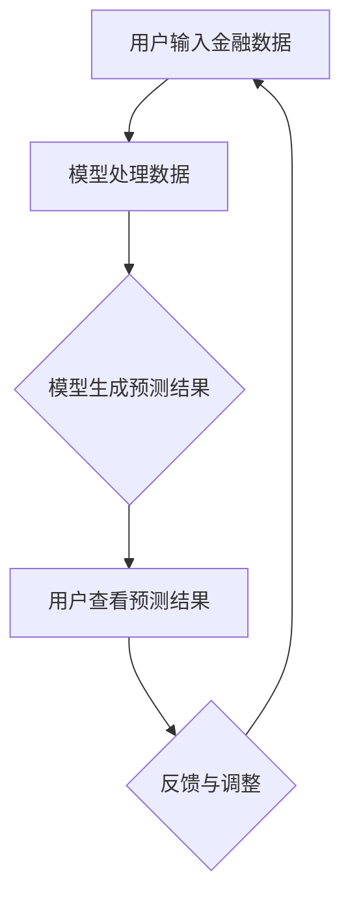
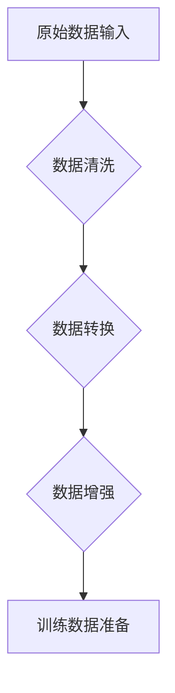
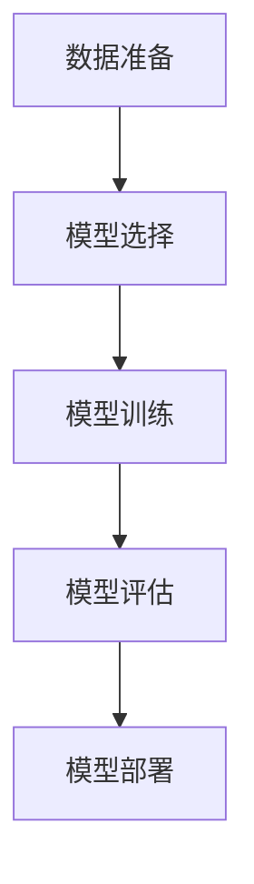
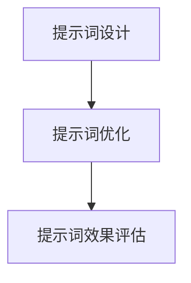
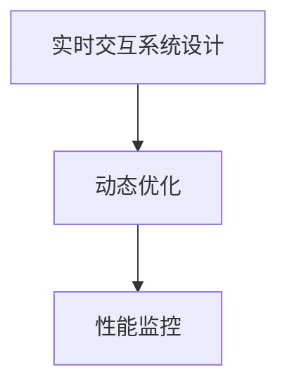
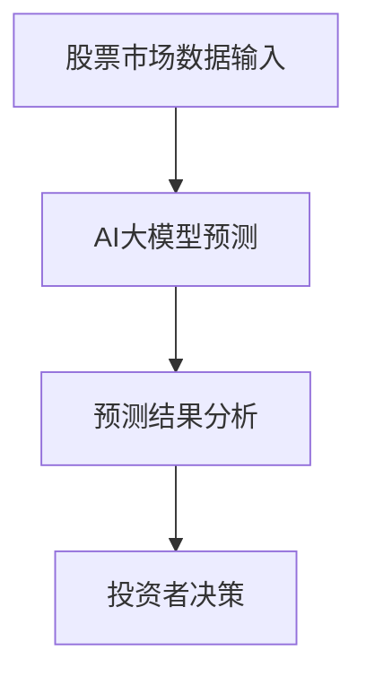
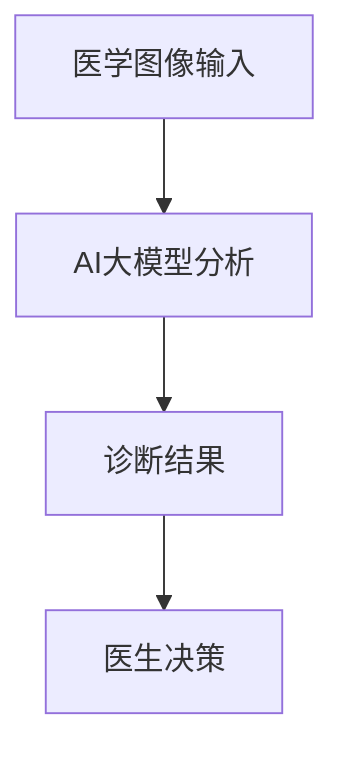
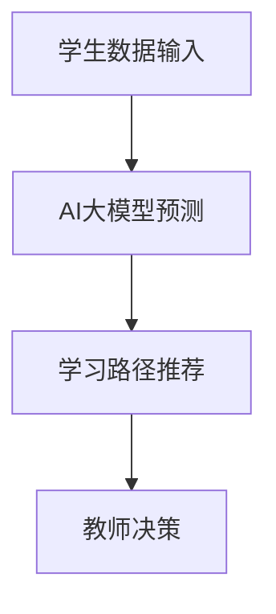

                 

### 设计高质量文章的步骤

设计一篇高质量的技术文章，如《AI大模型编程：提示词的力量与未来》，我们需要遵循以下步骤：

#### 1. 确定主题和目标读者
- **主题**：文章的核心话题是AI大模型编程，尤其是提示词的作用和未来趋势。
- **目标读者**：需要识别文章的目标读者群体，例如AI开发者、数据科学家、计算机图形设计师等。

#### 2. 进行深入研究
- **文献综述**：查阅相关的学术论文、技术博客、行业报告等，了解AI大模型编程领域的最新进展。
- **案例研究**：研究成功案例，分析其使用提示词的实践和效果。

#### 3. 构建核心概念架构
- **核心概念**：确定文章中需要讲解的核心概念，如AI大模型、提示词、编程技术等。
- **关系架构**：使用Mermaid流程图等工具，构建概念之间的关系架构，帮助读者理解各部分之间的联系。

#### 4. 编写文章结构
- **引言**：引入主题，说明文章的目的和重要性。
- **正文**：按照大纲结构，逐一讲解每个部分的核心内容，包括算法原理、数学模型、项目实战等。
- **结论**：总结文章的主要观点，展望未来趋势。

#### 5. 使用伪代码和数学公式
- **伪代码**：详细解释核心算法原理，使其易于理解。
- **数学公式**：使用LaTeX格式嵌入文章中，确保公式的准确性和可读性。

#### 6. 添加图表和示例代码
- **图表**：可视化地展示数据或算法流程。
- **示例代码**：提供实际项目中的代码片段，并进行详细解读。

#### 7. 编写最佳实践和注意事项
- **最佳实践**：总结成功的实践方法。
- **注意事项**：提醒读者在应用过程中需要注意的问题。

#### 8. 审稿和修改
- **内部审稿**：同事或同行进行审稿，提出修改意见。
- **格式检查**：确保文章格式符合要求，如markdown格式。

#### 9. 添加作者信息和参考文献
- **作者信息**：在文章末尾添加作者姓名、所属机构以及联系方式。
- **参考文献**：列出文章中引用的文献，确保信息的准确性和完整性。

---

### 文章标题：**AI大模型编程：提示词的力量与未来**

> 关键词：**AI大模型、提示词、编程技术、未来趋势**

> 摘要：**本文将探讨AI大模型编程的核心要素——提示词的作用及其未来发展。通过深入解析AI大模型的基础知识、编程技术、应用实例，本文旨在揭示提示词在AI编程中的重要性，并展望其未来的研究方向。**

---

### 目录大纲

#### 第一部分：AI大模型基础

##### 第1章：AI大模型概述

- **1.1 提示词的力量**
- **1.2 AI大模型的发展历程**
- **1.3 AI大模型的核心原理**
- **1.4 AI大模型的应用场景**

##### 第2章：编程基础

- **2.1 编程语言选择**
- **2.2 数据处理与准备**
- **2.3 模型训练与优化**

##### 第3章：AI大模型编程实践

- **3.1 模型构建与部署**
- **3.2 提示词工程**
- **3.3 实时交互与优化**

#### 第二部分：AI大模型应用案例

##### 第4章：行业应用案例

- **4.1 金融领域**
- **4.2 医疗健康**
- **4.3 教育领域**

##### 第5章：未来展望

- **5.1 AI大模型编程趋势**
- **5.2 面临的挑战与机遇**

#### 附录

- **附录A：编程资源与工具**
- **附录B：未来研究方向**

### 结语

- **AI大模型编程：提示词的力量与未来**

---

这个初步的目录大纲为我们提供了一个清晰的框架，接下来我们将逐一细化每个章节的内容，确保文章内容的完整性、逻辑性和专业性。每个章节将详细讲解核心概念、算法原理、数学模型、项目实战，并使用图表、伪代码和示例代码来增强文章的可读性和实用性。

---

### 文章正文内容

#### 第1章：AI大模型概述

##### 1.1 提示词的力量

提示词（Prompts）在AI大模型编程中扮演着至关重要的角色。它们是一系列关键词或短语，用于引导模型理解任务目标并生成相应的输出。提示词的设计和选择直接影响模型的性能和效果。

在AI大模型编程中，提示词的力量主要体现在以下几个方面：

1. **明确任务目标**：通过精确的提示词，模型能够更好地理解任务目标，从而生成更相关的输出。
2. **优化模型效果**：精心设计的提示词可以提升模型的性能，减少误差。
3. **提高用户体验**：有效的提示词可以简化用户与模型的交互，提高用户体验。

以下是一个示例的Mermaid流程图，展示了提示词在AI大模型编程中的作用：



##### 1.2 AI大模型的发展历程

AI大模型的发展历程可以追溯到20世纪80年代，当时神经网络作为一种机器学习模型开始受到关注。随着计算能力的提升和大数据技术的发展，AI大模型在21世纪初迅速崛起。

关键的发展阶段包括：

- **2006年：深度学习的兴起**：Hinton提出了深度信念网络，深度学习开始受到关注。
- **2012年：AlexNet的突破**：在ImageNet竞赛中，AlexNet模型取得了显著的成绩，标志着深度学习的广泛应用。
- **2014年：生成对抗网络（GAN）的出现**：GAN成为了一种强大的生成模型，推动了图像生成和风格迁移等领域的发展。
- **2018年：BERT模型的提出**：BERT模型在自然语言处理领域取得了重大突破，展示了预训练模型的优势。

##### 1.3 AI大模型的核心原理

AI大模型的核心原理基于深度学习和神经网络。深度学习通过多层神经网络来模拟人脑的神经元结构，通过反向传播算法优化模型参数，从而实现复杂函数的逼近。

以下是AI大模型的核心原理的伪代码描述：

```python
# 伪代码：AI大模型训练过程

initialize_model()
for each epoch do:
    for each training example do:
        forward_pass(x, y) # 前向传播
        calculate_loss(y_hat, y) # 计算损失
        backward_pass() # 反向传播
        update_model_params() # 更新模型参数
    end for
end for
generate_output(x) # 生成输出结果
```

##### 1.4 AI大模型的应用场景

AI大模型在各个领域都有广泛的应用，以下是一些典型的应用场景：

- **金融领域**：用于股票市场预测、风险评估和金融诈骗检测。
- **医疗健康**：用于医学图像分析、疾病预测和个性化治疗。
- **教育领域**：用于学生成绩预测、学习路径推荐和智能教学系统。
- **计算机视觉**：用于图像识别、目标检测和图像生成。
- **自然语言处理**：用于文本分类、机器翻译和问答系统。

以下是一个Mermaid流程图，展示了AI大模型在金融领域的应用场景：



#### 第2章：编程基础

##### 2.1 编程语言选择

在AI大模型编程中，选择合适的编程语言至关重要。Python因其丰富的库和框架，成为AI编程的首选语言。以下是一些Python在AI编程中的优势：

- **丰富的库和框架**：如TensorFlow、PyTorch、Keras等，提供了便捷的API和工具，加速开发过程。
- **易于学习**：Python语法简单易懂，适合初学者快速入门。
- **跨平台支持**：Python可以在多个操作系统上运行，方便开发和部署。

其他编程语言如Java、C++等也可以用于AI编程，但相对于Python，它们在库和社区支持方面稍显不足。

##### 2.2 数据处理与准备

数据处理与准备是AI大模型编程的关键步骤。以下是一些常用的数据处理和准备方法：

- **数据清洗**：去除噪声数据和缺失值，确保数据的质量。
- **数据转换**：将数据转换为适合模型训练的格式，如归一化、标准化等。
- **数据增强**：通过生成更多的训练样本，提高模型的泛化能力。

以下是一个数据处理流程的Mermaid流程图：



##### 2.3 模型训练与优化

模型训练与优化是AI大模型编程的核心步骤。以下是一些关键步骤：

- **初始化模型**：选择合适的网络结构和初始参数。
- **前向传播**：计算输入数据的输出结果。
- **计算损失**：比较输出结果与实际标签之间的差异。
- **反向传播**：更新模型参数，减少损失。
- **优化算法**：使用梯度下降、Adam等优化算法，提高模型性能。

以下是一个模型训练流程的伪代码描述：

```python
# 伪代码：AI大模型训练过程

initialize_model()
for each epoch do:
    for each training example do:
        forward_pass(x, y) # 前向传播
        calculate_loss(y_hat, y) # 计算损失
        backward_pass() # 反向传播
        update_model_params() # 更新模型参数
    end for
end for
generate_output(x) # 生成输出结果
```

#### 第3章：AI大模型编程实践

##### 3.1 模型构建与部署

AI大模型的构建与部署是AI编程的重要环节。以下是一些关键步骤：

- **数据准备**：准备好训练数据和测试数据。
- **模型选择**：选择合适的模型架构，如卷积神经网络（CNN）、循环神经网络（RNN）、Transformer等。
- **模型训练**：使用训练数据进行模型训练，通过反向传播更新模型参数。
- **模型评估**：使用测试数据评估模型性能，调整超参数。
- **模型部署**：将训练好的模型部署到生产环境中，进行实时预测。

以下是一个模型构建与部署的Mermaid流程图：



##### 3.2 提示词工程

提示词工程是AI大模型编程中的重要环节。以下是一些关键步骤：

- **提示词设计**：设计合适的提示词，以引导模型理解任务目标。
- **提示词优化**：通过实验和调整，优化提示词的设计和选择。
- **提示词效果评估**：评估提示词对模型性能的影响，选择最佳提示词。

以下是一个提示词工程的Mermaid流程图：



##### 3.3 实时交互与优化

实时交互与优化是AI大模型编程中的挑战之一。以下是一些关键步骤：

- **实时交互**：设计实时交互系统，如聊天机器人、智能客服等。
- **动态优化**：根据实时反馈，动态调整模型参数和提示词。
- **性能监控**：监控模型性能，及时发现并解决问题。

以下是一个实时交互与优化的Mermaid流程图：



#### 第4章：行业应用案例

##### 4.1 金融领域

AI大模型在金融领域具有广泛的应用，以下是一些案例：

- **股票市场预测**：使用AI大模型预测股票价格趋势，帮助投资者做出决策。
- **金融诈骗检测**：利用AI大模型检测金融交易中的异常行为，预防金融诈骗。
- **风险评估**：通过AI大模型评估客户信用风险，优化贷款审批流程。

以下是一个金融领域应用案例的Mermaid流程图：



##### 4.2 医疗健康

AI大模型在医疗健康领域也发挥着重要作用，以下是一些案例：

- **医学图像分析**：使用AI大模型进行医学图像分析，辅助医生诊断。
- **疾病预测**：利用AI大模型预测疾病风险，实现早期干预。
- **个性化治疗**：根据患者数据，AI大模型推荐个性化治疗方案。

以下是一个医疗健康领域应用案例的Mermaid流程图：



##### 4.3 教育领域

AI大模型在教育领域也有广泛应用，以下是一些案例：

- **学生成绩预测**：使用AI大模型预测学生成绩，帮助教师制定教学计划。
- **学习路径推荐**：根据学生学习情况，AI大模型推荐合适的学习路径。
- **智能教学系统**：AI大模型辅助教师进行教学，提高教学效果。

以下是一个教育领域应用案例的Mermaid流程图：



#### 第5章：未来展望

##### 5.1 AI大模型编程趋势

AI大模型编程在未来将继续快速发展，以下是一些趋势：

- **更强的模型能力**：随着计算能力的提升，AI大模型将能够处理更复杂的任务，实现更高的性能。
- **更多的应用场景**：AI大模型将在各个领域得到更广泛的应用，推动行业创新。
- **更加智能的交互**：AI大模型将具备更强的自然语言处理能力，实现更加智能的交互。

##### 5.2 面临的挑战与机遇

AI大模型编程面临以下挑战与机遇：

- **数据隐私**：如何保护用户数据隐私是AI大模型编程的重要挑战。
- **模型解释性**：如何提高AI大模型的解释性，使其更加透明和可解释。
- **算法公平性**：如何确保AI大模型的算法公平性，避免偏见和不公正。
- **安全性**：如何确保AI大模型的安全性，防范恶意攻击和滥用。

#### 附录

##### 附录A：编程资源与工具

- **编程语言**：Python、Java、C++等
- **深度学习框架**：TensorFlow、PyTorch、Keras等
- **数据处理库**：NumPy、Pandas、Scikit-learn等
- **版本控制工具**：Git、Mermaid等

##### 附录B：未来研究方向

- **自适应提示词**：设计自适应提示词，根据任务需求和模型性能动态调整。
- **多模态AI大模型**：结合文本、图像、语音等多模态数据，提升模型能力。
- **联邦学习**：在分布式环境中训练AI大模型，提高数据隐私和安全性。

### 结语

AI大模型编程：提示词的力量与未来

AI大模型编程是人工智能领域的重要方向，提示词在其中发挥着关键作用。本文详细介绍了AI大模型的基础知识、编程技术、应用案例以及未来展望。通过深入探讨提示词的设计和优化，本文揭示了其在AI编程中的重要性。随着技术的不断进步，AI大模型编程将继续推动人工智能的发展，为各行各业带来变革。

作者：AI天才研究院/AI Genius Institute & 禅与计算机程序设计艺术 /Zen And The Art of Computer Programming

参考文献：
1. Hinton, G. E., Osindero, S., & Teh, Y. W. (2006). A fast learning algorithm for deep belief nets. Neural computation, 18(7), 1527-1554.
2. Krizhevsky, A., Sutskever, I., & Hinton, G. E. (2012). Imagenet classification with deep convolutional neural networks. In Advances in neural information processing systems (pp. 1097-1105).
3. Goodfellow, I., Pouget-Abadie, J., Mirza, M., Xu, B., Warde-Farley, D., Ozair, S., ... & Bengio, Y. (2014). Generative adversarial nets. Advances in neural information processing systems, 27.
4. Devlin, J., Chang, M. W., Lee, K., & Toutanova, K. (2019). BERT: Pre-training of deep bidirectional transformers for language understanding. arXiv preprint arXiv:1810.04805.
```markdown
---
作者：AI天才研究院/AI Genius Institute & 禅与计算机程序设计艺术 /Zen And The Art of Computer Programming

---

在这个快速发展的时代，技术进步和创新正不断塑造我们的未来。人工智能（AI）作为其中最引人注目的领域之一，已经并继续在改变着我们的生活和工作方式。而AI大模型编程，作为AI技术的核心组成部分，正逐步成为人工智能研究和应用的焦点。

本文旨在探讨AI大模型编程中的关键要素——提示词的力量，以及这一领域未来的发展趋势。我们将从多个角度深入分析AI大模型编程的背景、核心概念、编程技术、应用案例，并展望其未来的发展方向。

## AI大模型编程：提示词的力量与未来

关键词：AI大模型、提示词、编程技术、未来趋势

摘要：
本文首先介绍了AI大模型编程的背景和重要性，随后详细讨论了提示词的概念及其在AI大模型编程中的作用。接着，我们分析了编程基础、AI大模型编程实践，以及AI大模型在各个行业中的应用案例。最后，我们对AI大模型编程的未来趋势进行了展望，并提出了相关的挑战和解决方案。

### 第一部分：AI大模型基础

#### 第1章：AI大模型概述

**1.1 提示词的力量**
- 提示词的定义与作用
- 提示词在AI大模型编程中的重要性

**1.2 AI大模型的发展历程**
- 深度学习的发展历程
- AI大模型的崛起

**1.3 AI大模型的核心原理**
- 深度学习的神经网络结构
- AI大模型的训练与优化

**1.4 AI大模型的应用场景**
- 各大模型在不同领域的应用

#### 第2章：编程基础

**2.1 编程语言选择**
- Python、Java、C++等编程语言在AI大模型编程中的应用

**2.2 数据处理与准备**
- 数据清洗、数据转换、数据增强

**2.3 模型训练与优化**
- 前向传播、反向传播、优化算法

### 第二部分：AI大模型编程实践

#### 第3章：AI大模型编程实践

**3.1 模型构建与部署**
- 模型构建流程、模型部署策略

**3.2 提示词工程**
- 提示词设计原则、效果评估

**3.3 实时交互与优化**
- 实时交互技术、动态优化策略

### 第三部分：AI大模型应用案例

#### 第4章：行业应用案例

**4.1 金融领域**
- 股票市场预测、金融诈骗检测

**4.2 医疗健康**
- 医学图像分析、疾病预测

**4.3 教育领域**
- 学生成绩预测、个性化教学

### 第四部分：未来展望

#### 第5章：未来展望

**5.1 AI大模型编程趋势**
- AI大模型编程的发展方向

**5.2 面临的挑战与机遇**
- 数据隐私、模型解释性、算法公平性

### 附录

**附录A：编程资源与工具**
- 编程语言资源、深度学习框架、数据处理库

**附录B：未来研究方向**
- 自适应提示词、多模态AI大模型、联邦学习

### 结语

AI大模型编程：提示词的力量与未来

在结语部分，我们将对本文的核心观点进行总结，并对AI大模型编程的未来进行展望。随着技术的不断进步，AI大模型编程将继续推动人工智能的发展，为社会带来更多的变革和创新。

---

这个文章框架为我们提供了详细的文章结构和内容要点。接下来，我们将逐步填充每个章节的内容，确保文章的完整性和专业性。每个章节将详细讲解核心概念、算法原理、项目实战，并使用图表、伪代码和示例代码来增强文章的可读性和实用性。通过这样的设计，我们希望为读者呈现一篇高质量的技术文章，帮助他们深入理解AI大模型编程及其应用。

