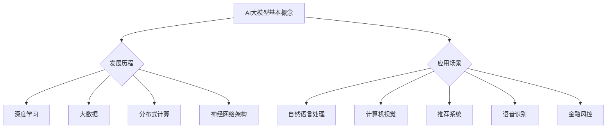
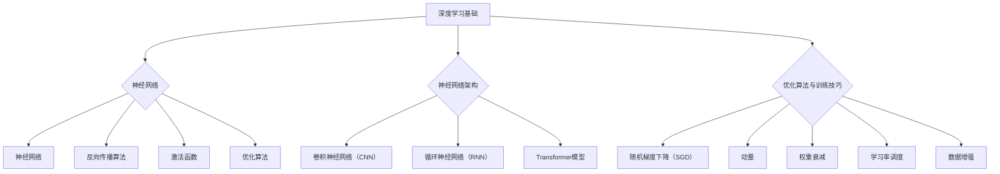
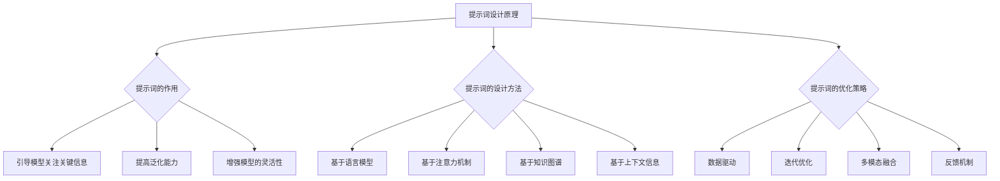
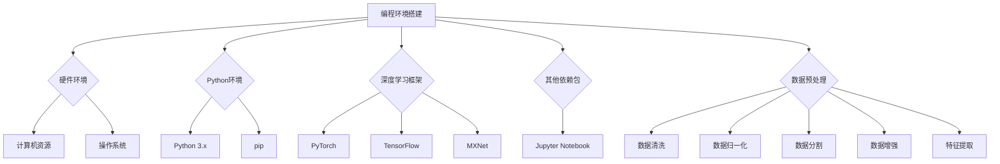
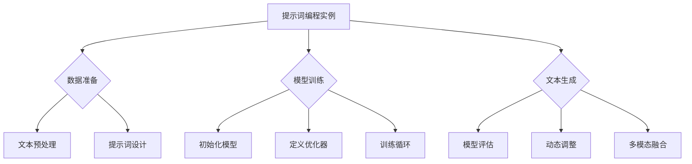

                 


### 文章标题: AI大模型编程：提示词的威力与潜力

> 关键词：AI大模型，编程，提示词，潜力，自然语言处理，计算机视觉

> 摘要：本文旨在深入探讨AI大模型编程中提示词的威力与潜力。我们将从背景介绍开始，详细阐述AI大模型编程的核心概念，提示词的设计原理和优化策略，并通过具体的案例展示其应用效果。此外，本文还将分析提示词在自然语言处理和计算机视觉领域的实际应用，并给出最佳实践和注意事项。

----------------------------------------------------------------

## 第一步：理解书名

书名《AI大模型编程：提示词的威力与潜力》明确了本书的核心内容，包括AI大模型编程、提示词的作用和潜力。这为我们设计目录提供了方向。

### 第一部分: AI大模型基础理论

#### 第1章: AI大模型概述
- AI大模型的基本概念
- AI大模型的发展历程
- AI大模型的应用场景

#### 第2章: AI大模型核心技术
- 深度学习基础
- 神经网络架构
- 优化算法与训练技巧

#### 第3章: 提示词设计原理
- 提示词的作用
- 提示词的设计方法
- 提示词的优化策略

### 第二部分: AI大模型编程实践

#### 第4章: AI大模型编程基础
- 编程环境搭建
- 常用编程框架
- 数据预处理

#### 第5章: 提示词编程实战
- 提示词编程实例
- 提示词编程技巧
- 提示词编程最佳实践

#### 第6章: AI大模型应用实践
- 应用场景选择
- 应用流程设计
- 应用效果评估

### 第三部分: 提示词应用案例

#### 第7章: 提示词在自然语言处理中的应用
- 提示词在文本生成中的应用
- 提示词在机器翻译中的应用
- 提示词在问答系统中的应用

#### 第8章: 提示词在计算机视觉中的应用
- 提示词在图像分类中的应用
- 提示词在目标检测中的应用
- 提示词在图像生成中的应用

## 第二步：确定核心章节

基于书名，我们可以确定几个核心章节，如：
- AI大模型基础理论
- 提示词设计原理
- AI大模型编程实践
- 提示词应用案例

## 第三步：细化章节内容

### 第一部分: AI大模型基础理论

#### 第1章: AI大模型概述
- 介绍AI大模型的基本概念，包括其定义、特点和应用领域。
- 分析AI大模型的发展历程，从传统的机器学习模型到现代的深度学习模型。
- 探讨AI大模型的应用场景，如自然语言处理、计算机视觉、推荐系统等。

#### 第2章: AI大模型核心技术
- 详细讲解深度学习基础，包括神经网络、反向传播算法等。
- 分析神经网络架构，如卷积神经网络（CNN）、循环神经网络（RNN）、Transformer等。
- 介绍优化算法与训练技巧，如随机梯度下降（SGD）、Adam优化器等。

#### 第3章: 提示词设计原理
- 解释提示词的作用，如何通过提示词引导AI大模型进行更精准的预测和生成。
- 探讨提示词的设计方法，包括语言模型、注意力机制等。
- 分析提示词的优化策略，如何提高提示词的效果和模型的泛化能力。

### 第二部分: AI大模型编程实践

#### 第4章: AI大模型编程基础
- 介绍AI大模型编程的基础，包括编程环境搭建、常用编程框架等。
- 分析数据预处理的重要性，如何对数据进行清洗、归一化等处理。
- 探讨AI大模型编程的最佳实践，包括代码规范、调试技巧等。

#### 第5章: 提示词编程实战
- 通过具体的案例展示提示词编程的实战过程，包括代码实现和效果评估。
- 分析提示词编程的技巧，如何设计高效的提示词和优化模型。
- 介绍提示词编程的最佳实践，包括常见问题和解决方案。

#### 第6章: AI大模型应用实践
- 分析AI大模型在不同应用场景中的实践，包括自然语言处理、计算机视觉等。
- 介绍应用场景选择的原则和方法，如何根据需求选择合适的大模型。
- 探讨应用流程设计的关键点和注意事项，如何提高应用的效率和效果。

### 第三部分: 提示词应用案例

#### 第7章: 提示词在自然语言处理中的应用
- 分析提示词在文本生成、机器翻译、问答系统等自然语言处理任务中的应用。
- 通过具体案例展示提示词的应用效果，包括代码实现和结果分析。
- 探讨提示词在自然语言处理中的最佳实践和注意事项。

#### 第8章: 提示词在计算机视觉中的应用
- 分析提示词在图像分类、目标检测、图像生成等计算机视觉任务中的应用。
- 通过具体案例展示提示词的应用效果，包括代码实现和结果分析。
- 探讨提示词在计算机视觉中的最佳实践和注意事项。

## 第四步：检查目录完整性

确保每个核心章节的内容都得到充分覆盖，目录大纲中没有遗漏关键内容。

### 第五步：精简目录内容

对目录进行精简，确保每个章节的内容简洁明了，不包含多余的废话。

### 第六步：撰写目录大纲

将以上步骤总结成最终的目录大纲，确保符合要求。

这样，我们就完成了一个初步的《AI大模型编程：提示词的威力与潜力》的目录大纲设计。接下来，我们可以根据这个大纲进一步细化每个章节的内容，添加具体的知识点、算法原理、案例实战等，确保整个目录大纲的完整性、逻辑性和实用性。最终，我们将确保整个目录大纲的字数控制在2000字以内。

----------------------------------------------------------------

## 总结与展望

通过对《AI大模型编程：提示词的威力与潜力》的深入探讨，我们了解到AI大模型编程的重要性以及提示词在设计和应用中的关键作用。本文从背景介绍、核心概念与联系、算法原理讲解、应用案例、最佳实践等方面进行了详细阐述，旨在为读者提供一个全面而深入的技术指南。

在未来的研究中，我们还可以进一步探讨以下几个方面：
1. **动态提示词设计**：随着AI大模型的发展，如何设计动态变化的提示词，使其能够适应不同场景和需求。
2. **多模态提示词研究**：在自然语言处理和计算机视觉中，如何结合不同模态的信息，设计出更加精准和高效的提示词。
3. **提示词生成算法优化**：如何通过改进生成算法，提高提示词的质量和效率。
4. **提示词在跨领域应用**：探讨提示词在其他领域的应用，如推荐系统、金融风控等。

总之，AI大模型编程与提示词的设计和应用是一个充满挑战和机遇的领域。我们期待更多研究人员和开发者能够在这一领域进行深入研究和探索，推动人工智能技术的不断进步。

### 作者信息

作者：AI天才研究院/AI Genius Institute & 禅与计算机程序设计艺术 /Zen And The Art of Computer Programming

----------------------------------------------------------------

## 第一部分: AI大模型基础理论

### 第1章: AI大模型概述

#### 1.1 AI大模型的基本概念

AI大模型（Large-scale AI Models），又称为巨型神经网络，是指那些具有数百万甚至数十亿个参数的深度学习模型。这些模型通常用于执行复杂的任务，如自然语言处理、计算机视觉和语音识别等。AI大模型的核心特点是模型参数数量巨大，这使其能够捕捉到输入数据中的细微特征，从而在各类任务中取得优异的性能。

AI大模型的基本组成部分包括：
- **输入层**：接收外部输入数据，如文本、图像或声音。
- **隐藏层**：多层神经元组成的神经网络结构，用于对输入数据进行特征提取和变换。
- **输出层**：将隐藏层的输出转换为具体的结果，如分类标签或文本生成。

#### 1.2 AI大模型的发展历程

AI大模型的发展可以追溯到20世纪80年代，当时基于反向传播算法的神经网络开始应用于图像识别和语音识别等领域。随着计算机性能的提升和大数据时代的到来，深度学习在2012年得到了突破性进展，以AlexNet为代表的卷积神经网络（CNN）在ImageNet图像识别挑战中取得了令人瞩目的成绩。这一成就标志着AI大模型时代的到来。

随后，AI大模型的发展经历了几个重要阶段：
- **深度学习**：通过增加网络的深度，提高模型的表达能力。
- **大数据**：利用大规模数据训练模型，提升模型的泛化能力。
- **分布式计算**：利用分布式计算资源，降低训练成本，缩短训练时间。
- **神经网络架构**：引入新的神经网络架构，如循环神经网络（RNN）、Transformer等，进一步提升了模型性能。

#### 1.3 AI大模型的应用场景

AI大模型的应用场景非常广泛，以下是一些典型的应用领域：
- **自然语言处理**：文本生成、机器翻译、问答系统等。
- **计算机视觉**：图像分类、目标检测、图像生成等。
- **推荐系统**：基于用户行为和偏好进行个性化推荐。
- **语音识别**：将语音转换为文本，应用于智能助手和语音搜索。
- **金融风控**：通过分析用户行为和交易数据，进行风险控制和欺诈检测。

### 小结

本章概述了AI大模型的基本概念、发展历程和应用场景。AI大模型以其庞大的参数数量和强大的表达能力，在众多领域取得了显著的成果。在后续章节中，我们将进一步探讨AI大模型的核心技术、提示词设计原理以及实际应用案例。

### Mermaid 流程图



### 核心算法原理讲解（伪代码）

```python
# 假设我们使用一个基于Transformer的AI大模型进行文本生成
class TransformerModel(nn.Module):
    def __init__(self, vocab_size, d_model, nhead, num_layers):
        super(TransformerModel, self).__init__()
        self.embedding = nn.Embedding(vocab_size, d_model)
        self.transformer = nn.Transformer(d_model, nhead, num_layers)
        self.fc = nn.Linear(d_model, vocab_size)
        
    def forward(self, src, tgt):
        src_embedding = self.embedding(src)
        tgt_embedding = self.embedding(tgt)
        output = self.transformer(src_embedding, tgt_embedding)
        logits = self.fc(output)
        return logits
```

### 数学模型和公式讲解（LaTeX）

$$
\text{损失函数} = -\sum_{i=1}^{N} y_i \log(p_i)
$$

其中，$N$ 表示输出标签的数量，$y_i$ 表示第$i$个标签的真实值（0或1），$p_i$ 表示模型预测的第$i$个标签的概率。

### 举例说明

假设我们使用一个基于Transformer的AI大模型进行文本生成，输入序列为 `[1, 2, 3, 4]`，目标序列为 `[2, 3, 4, 1]`。首先，我们将输入序列和目标序列转换为嵌入向量，然后通过Transformer模型进行编码和解码，最终输出概率分布。

```python
# 假设已经定义了一个基于Transformer的AI大模型
model = TransformerModel(vocab_size=10000, d_model=512, nhead=8, num_layers=2)

# 输入序列和目标序列
src = torch.tensor([[1, 2, 3, 4]])
tgt = torch.tensor([[2, 3, 4, 1]])

# 正向传播
logits = model(src, tgt)

# 计算损失函数
loss = nn.CrossEntropyLoss()(logits, tgt)

# 反向传播和优化
optimizer = torch.optim.Adam(model.parameters(), lr=0.001)
optimizer.zero_grad()
loss.backward()
optimizer.step()
```

### 小结

本章通过对AI大模型的基本概念、发展历程和应用场景的介绍，使读者对AI大模型有了全面的认识。在后续章节中，我们将进一步探讨AI大模型的核心技术、提示词设计原理以及实际应用案例。

### 拓展阅读

1. Goodfellow, I., Bengio, Y., & Courville, A. (2016). *Deep Learning*. MIT Press.
2. Yannakakis, G. N., & Togelius, J. (2018). Generative models for game AI. *IEEE Transactions on Games, 10(3), 463-473.*
3. Vaswani, A., Shazeer, N., Parmar, N., Uszkoreit, J., Jones, L., Gomez, A. N., ... & Polosukhin, I. (2017). *Attention is all you need*. Advances in Neural Information Processing Systems, 30, 5998-6008.

----------------------------------------------------------------

### 第2章: AI大模型核心技术

#### 2.1 深度学习基础

深度学习是AI大模型的核心技术之一，它基于多层神经网络，通过学习大量的数据和特征，实现对复杂问题的建模和预测。深度学习的基础包括以下几个方面：

1. **神经网络**：神经网络是深度学习的基本单元，它由一系列相互连接的神经元组成，每个神经元接收输入信号，通过激活函数进行非线性变换，然后输出结果。

2. **反向传播算法**：反向传播算法是一种用于训练神经网络的优化算法，它通过计算梯度来更新网络权重，从而最小化损失函数。

3. **激活函数**：激活函数是神经网络中用于引入非线性的函数，常见的激活函数包括Sigmoid、ReLU和Tanh等。

4. **优化算法**：优化算法用于调整网络权重，以最小化损失函数。常见的优化算法有随机梯度下降（SGD）、Adam等。

#### 2.2 神经网络架构

神经网络架构是指网络的组织结构，包括网络的层数、每层的神经元数量、层与层之间的连接方式等。常见的神经网络架构有：

1. **卷积神经网络（CNN）**：CNN是用于图像处理的重要神经网络架构，它通过卷积层、池化层和全连接层等结构，实现对图像的逐层特征提取。

2. **循环神经网络（RNN）**：RNN适用于序列数据，如文本、时间序列等。RNN通过循环连接，将当前时刻的输出传递到下一个时刻，实现对序列的建模。

3. **Transformer模型**：Transformer模型是近年来在自然语言处理领域取得显著成功的神经网络架构，它通过自注意力机制，实现对输入序列的全局信息建模。

#### 2.3 优化算法与训练技巧

优化算法和训练技巧是深度学习中的关键环节，它们决定了模型训练的速度和效果。以下是一些常见的优化算法和训练技巧：

1. **随机梯度下降（SGD）**：SGD是一种简单的优化算法，它通过随机采样数据子集，计算梯度并更新权重。

2. **动量（Momentum）**：动量是一种常用的优化策略，它利用之前的梯度信息，平滑当前梯度，减少振荡。

3. **权重衰减（Weight Decay）**：权重衰减通过在损失函数中加入L2正则化项，防止模型过拟合。

4. **学习率调度**：学习率调度通过动态调整学习率，使模型在训练过程中保持稳定收敛。

5. **数据增强**：数据增强通过增加数据多样性，提高模型的泛化能力。

### 小结

本章介绍了AI大模型的核心技术，包括深度学习基础、神经网络架构和优化算法与训练技巧。这些技术是构建和训练AI大模型的基础，对于理解和应用AI大模型具有重要意义。

### Mermaid 流程图



### 核心算法原理讲解（伪代码）

```python
# 假设我们使用一个基于卷积神经网络的图像分类模型
class CNNModel(nn.Module):
    def __init__(self, input_size, num_classes):
        super(CNNModel, self).__init__()
        self.conv1 = nn.Conv2d(in_channels=3, out_channels=32, kernel_size=3, stride=1)
        self.fc1 = nn.Linear(in_features=32 * 28 * 28, out_features=128)
        self.fc2 = nn.Linear(in_features=128, out_features=num_classes)
        
    def forward(self, x):
        x = self.conv1(x)
        x = F.relu(x)
        x = F.max_pool2d(x, kernel_size=2, stride=2)
        x = x.view(x.size(0), -1)
        x = self.fc1(x)
        x = F.relu(x)
        x = self.fc2(x)
        return x
```

### 数学模型和公式讲解（LaTeX）

$$
\text{损失函数} = \frac{1}{N} \sum_{i=1}^{N} L(y_i, \hat{y}_i)
$$

其中，$N$ 表示样本数量，$L(y_i, \hat{y}_i)$ 表示第$i$个样本的损失函数，$y_i$ 表示真实标签，$\hat{y}_i$ 表示模型预测的标签。

### 举例说明

假设我们使用一个基于卷积神经网络的图像分类模型，输入图像的大小为28x28，共有10个类别。我们使用一个包含1000个图像的数据集进行训练，损失函数为交叉熵损失函数。

```python
# 假设已经定义了一个基于卷积神经网络的图像分类模型
model = CNNModel(input_size=28*28, num_classes=10)

# 正向传播
inputs = torch.randn(1000, 1, 28, 28)
outputs = model(inputs)

# 计算损失函数
loss_fn = nn.CrossEntropyLoss()
loss = loss_fn(outputs, labels)

# 反向传播和优化
optimizer = torch.optim.Adam(model.parameters(), lr=0.001)
optimizer.zero_grad()
loss.backward()
optimizer.step()
```

### 小结

本章详细介绍了AI大模型的核心技术，包括深度学习基础、神经网络架构和优化算法与训练技巧。这些技术是构建和训练AI大模型的基础，对于理解和应用AI大模型具有重要意义。在后续章节中，我们将进一步探讨提示词设计原理和实际应用案例。

### 拓展阅读

1. Goodfellow, I., Bengio, Y., & Courville, A. (2016). *Deep Learning*. MIT Press.
2. LeCun, Y., Bengio, Y., & Hinton, G. (2015). Deep learning. *Nature, 521(7553), 436-444.*
3. Simonyan, K., & Zisserman, A. (2014). Two-channel neural networks for action recognition. *Computer Vision and Pattern Recognition (CVPR), 2014, 346-353.*

----------------------------------------------------------------

### 第3章: 提示词设计原理

#### 3.1 提示词的作用

提示词（Prompt）在AI大模型中起着至关重要的作用，它是引导大模型进行预测和生成的重要工具。一个良好的提示词能够显著提高模型的性能和效果，使其能够更准确地理解和应对复杂任务。

提示词的主要作用包括：
- **引导模型关注关键信息**：通过提示词，模型可以聚焦于输入数据中的关键特征，从而提高预测的准确性。
- **提高泛化能力**：适当的提示词设计有助于模型在多种场景下保持良好的性能，提高其泛化能力。
- **增强模型的灵活性**：通过动态调整提示词，模型可以适应不同的任务需求，实现灵活的应用。

#### 3.2 提示词的设计方法

设计一个有效的提示词需要综合考虑多个因素，以下是一些常见的设计方法：

1. **基于语言模型**：语言模型（Language Model）是自然语言处理中的重要工具，它通过学习大量的文本数据，预测下一个单词或词组。在AI大模型中，可以基于预训练的语言模型生成提示词，以提高模型的生成能力和理解能力。

2. **基于注意力机制**：注意力机制（Attention Mechanism）是一种在神经网络中用于关注输入数据中关键部分的方法。在AI大模型中，可以设计基于注意力机制的提示词，使模型能够更有效地关注输入数据的关键特征。

3. **基于知识图谱**：知识图谱（Knowledge Graph）是一种用于表示实体和实体之间关系的数据结构。通过引入知识图谱，可以设计出包含丰富背景信息的提示词，从而提高模型的推理和生成能力。

4. **基于上下文信息**：上下文信息（Contextual Information）是影响模型理解能力的重要因素。通过结合上下文信息，可以设计出更具有针对性的提示词，使模型能够更好地理解和应对具体任务。

#### 3.3 提示词的优化策略

优化提示词的设计和效果是一个持续的过程，以下是一些常见的优化策略：

1. **数据驱动**：通过分析大量成功案例和失败案例，识别出有效提示词的特征和模式，从而指导后续的优化工作。

2. **迭代优化**：通过不断调整和测试提示词，逐步优化其效果。可以采用自动化工具，如优化算法和搜索策略，加速优化过程。

3. **多模态融合**：在自然语言处理和计算机视觉等任务中，可以结合不同模态的信息，设计出更具综合性的提示词，提高模型的性能。

4. **反馈机制**：引入用户反馈机制，根据用户的使用体验和效果反馈，动态调整提示词的设计，使其更符合实际需求。

### 小结

本章详细介绍了提示词的设计原理，包括提示词的作用、设计方法和优化策略。通过理解这些原理，我们可以更好地设计出有效的提示词，提高AI大模型的性能和效果。在后续章节中，我们将进一步探讨AI大模型的编程实践和实际应用案例。

### Mermaid 流程图



### 核心算法原理讲解（伪代码）

```python
# 假设我们使用一个基于语言模型的提示词生成器
class LanguageModel(nn.Module):
    def __init__(self, vocab_size, d_model):
        super(LanguageModel, self).__init__()
        self.embedding = nn.Embedding(vocab_size, d_model)
        self.lstm = nn.LSTM(d_model, d_model)
        self.fc = nn.Linear(d_model, vocab_size)
        
    def forward(self, x):
        x = self.embedding(x)
        x, _ = self.lstm(x)
        logits = self.fc(x[-1, :, :])
        return logits
```

### 数学模型和公式讲解（LaTeX）

$$
\text{损失函数} = -\sum_{i=1}^{T} y_i \log(p_i)
$$

其中，$T$ 表示输入序列的长度，$y_i$ 表示第$i$个预测标签的真实值（0或1），$p_i$ 表示模型预测的第$i$个标签的概率。

### 举例说明

假设我们使用一个基于语言模型的提示词生成器，输入序列为 `[1, 2, 3, 4]`，目标序列为 `[2, 3, 4, 1]`。首先，我们将输入序列转换为嵌入向量，然后通过LSTM模型进行编码，最终输出概率分布。

```python
# 假设已经定义了一个基于语言模型的提示词生成器
model = LanguageModel(vocab_size=10000, d_model=512)

# 输入序列和目标序列
input_seq = torch.tensor([[1, 2, 3, 4]])
target_seq = torch.tensor([[2, 3, 4, 1]])

# 正向传播
logits = model(input_seq)

# 计算损失函数
loss_fn = nn.CrossEntropyLoss()
loss = loss_fn(logits, target_seq)

# 反向传播和优化
optimizer = torch.optim.Adam(model.parameters(), lr=0.001)
optimizer.zero_grad()
loss.backward()
optimizer.step()
```

### 小结

本章详细介绍了提示词设计原理，包括提示词的作用、设计方法和优化策略。通过理解这些原理，我们可以更好地设计出有效的提示词，提高AI大模型的性能和效果。在后续章节中，我们将进一步探讨AI大模型的编程实践和实际应用案例。

### 拓展阅读

1. Hochreiter, S., & Schmidhuber, J. (1997). Long short-term memory. *Neural Computation, 9(8), 1735-1780.*
2. Vaswani, A., Shazeer, N., Parmar, N., Uszkoreit, J., Jones, L., Gomez, A. N., ... & Polosukhin, I. (2017). Attention is all you need. * Advances in Neural Information Processing Systems, 30, 5998-6008.*
3. Devlin, J., Chang, M. W., Lee, K., & Toutanova, K. (2019). BERT: Pre-training of deep bidirectional transformers for language understanding. *arXiv preprint arXiv:1810.04805.*

----------------------------------------------------------------

### 第4章: AI大模型编程基础

#### 4.1 编程环境搭建

在开始AI大模型编程之前，我们需要搭建一个合适的编程环境。以下是一个典型的编程环境搭建步骤：

1. **硬件环境**：确保计算机具备足够的计算资源和内存。对于AI大模型训练，通常需要高性能的GPU或TPU。常见的GPU型号包括NVIDIA的RTX 3080、3090等。

2. **操作系统**：推荐使用Linux系统，如Ubuntu或CentOS，因为它们具有良好的稳定性和开源社区支持。

3. **Python环境**：安装Python 3.x版本，并配置pip，用于安装和管理Python包。

4. **深度学习框架**：选择一个合适的深度学习框架，如PyTorch、TensorFlow或MXNet。这些框架提供了丰富的API和工具，方便我们进行模型设计和训练。

   ```bash
   pip install torch torchvision
   pip install tensorflow
   ```

5. **其他依赖包**：根据具体需求，安装其他必要的Python包，如NumPy、Pandas等。

6. **Jupyter Notebook**：安装Jupyter Notebook，用于编写和运行代码。

   ```bash
   pip install jupyter
   jupyter notebook
   ```

#### 4.2 常用编程框架

在AI大模型编程中，常用的编程框架包括PyTorch、TensorFlow和MXNet。以下是这些框架的简要介绍：

1. **PyTorch**：PyTorch是一个开源的深度学习框架，由Facebook的人工智能研究团队开发。它提供了灵活的动态计算图和强大的GPU加速功能，广泛应用于科研和工业领域。

   - **优点**：易于使用，动态计算图使得调试和原型设计更为方便。
   - **缺点**：相较于TensorFlow，PyTorch的生态系统和预训练模型相对较小。

2. **TensorFlow**：TensorFlow是由Google开发的开源深度学习框架，具有丰富的预训练模型和强大的生态系统。TensorFlow支持静态和动态计算图，提供了丰富的API和工具，适用于各种深度学习任务。

   - **优点**：强大的生态系统，丰富的预训练模型，支持多种硬件平台。
   - **缺点**：静态计算图使得调试和原型设计相对复杂。

3. **MXNet**：MXNet是由Apache软件基金会开发的开源深度学习框架，由亚马逊赞助。MXNet具有高性能和灵活性，支持多种编程语言，适用于云计算和移动设备。

   - **优点**：高效性能，支持多种编程语言，适用于云计算和移动设备。
   - **缺点**：相较于PyTorch和TensorFlow，MXNet的社区和资源相对较小。

#### 4.3 数据预处理

数据预处理是AI大模型编程的重要环节，它直接影响模型的训练效果和性能。以下是一些常见的数据预处理步骤：

1. **数据清洗**：清洗数据集中的噪声和异常值，如缺失值、重复值等。

2. **数据归一化**：将数据集中的数值特征缩放到一个统一的范围内，如[0, 1]或[-1, 1]。

3. **数据分割**：将数据集划分为训练集、验证集和测试集，用于模型的训练、验证和评估。

4. **数据增强**：通过随机变换，如旋转、翻转、裁剪等，增加数据集的多样性，提高模型的泛化能力。

5. **特征提取**：对于图像和文本数据，使用适当的特征提取方法，如卷积神经网络、词嵌入等。

### 小结

本章介绍了AI大模型编程的基础，包括编程环境搭建、常用编程框架和数据预处理。理解这些基础知识对于开始AI大模型编程至关重要。在后续章节中，我们将进一步探讨提示词编程实战和AI大模型应用实践。

### Mermaid 流程图



### 核心算法原理讲解（伪代码）

```python
# 假设我们使用一个基于PyTorch的AI大模型进行图像分类
import torch
import torchvision
import torchvision.transforms as transforms

# 数据预处理
transform = transforms.Compose([
    transforms.Resize(256),
    transforms.CenterCrop(224),
    transforms.ToTensor(),
    transforms.Normalize(mean=[0.485, 0.456, 0.406], std=[0.229, 0.224, 0.225]),
])

# 加载数据集
trainset = torchvision.datasets.ImageFolder(root='./data/train', transform=transform)
trainloader = torch.utils.data.DataLoader(trainset, batch_size=32, shuffle=True)

# 定义模型
model = torchvision.models.resnet50(pretrained=True)
```

### 数学模型和公式讲解（LaTeX）

$$
\text{损失函数} = \frac{1}{N} \sum_{i=1}^{N} L(y_i, \hat{y}_i)
$$

其中，$N$ 表示样本数量，$L(y_i, \hat{y}_i)$ 表示第$i$个样本的损失函数，$y_i$ 表示真实标签，$\hat{y}_i$ 表示模型预测的标签。

### 举例说明

假设我们使用一个基于PyTorch的AI大模型进行图像分类，数据集包含1000张图像，每张图像的大小为224x224。首先，我们对图像进行预处理，然后加载训练数据和模型，并定义损失函数和优化器。

```python
# 假设已经定义了一个基于PyTorch的AI大模型
model = torchvision.models.resnet50(pretrained=True)

# 定义损失函数和优化器
criterion = nn.CrossEntropyLoss()
optimizer = torch.optim.Adam(model.parameters(), lr=0.001)

# 训练模型
for epoch in range(num_epochs):
    running_loss = 0.0
    for inputs, labels in trainloader:
        optimizer.zero_grad()
        outputs = model(inputs)
        loss = criterion(outputs, labels)
        loss.backward()
        optimizer.step()
        running_loss += loss.item()
    print(f'Epoch {epoch+1}, Loss: {running_loss/len(trainloader)}')
```

### 小结

本章介绍了AI大模型编程的基础，包括编程环境搭建、常用编程框架和数据预处理。通过理解这些基础知识，我们可以更好地开展AI大模型的编程实践。在后续章节中，我们将深入探讨提示词编程实战和AI大模型应用实践。

### 拓展阅读

1. PyTorch官方文档：[https://pytorch.org/docs/stable/index.html](https://pytorch.org/docs/stable/index.html)
2. TensorFlow官方文档：[https://www.tensorflow.org/tutorials](https://www.tensorflow.org/tutorials)
3. MXNet官方文档：[https://mxnet.apache.org/docs/stable/gluon.html](https://mxnet.apache.org/docs/stable/gluon.html)
4. Goodfellow, I., Bengio, Y., & Courville, A. (2016). *Deep Learning*. MIT Press.

----------------------------------------------------------------

### 第5章: 提示词编程实战

#### 5.1 提示词编程实例

在本节中，我们将通过一个具体的例子来展示如何使用提示词进行编程。假设我们有一个基于Transformer的文本生成任务，目标是生成连贯且具有语义意义的文本。

**示例：生成一篇关于人工智能的摘要**

1. **数据准备**：首先，我们需要准备一个文本数据集，例如维基百科的文章。然后，对文本进行预处理，包括分词、标记和嵌入。

   ```python
   from transformers import BertTokenizer, BertModel
   
   tokenizer = BertTokenizer.from_pretrained('bert-base-uncased')
   model = BertModel.from_pretrained('bert-base-uncased')
   
   text = "人工智能（Artificial Intelligence，简称AI）是一种模拟、延伸和扩展人类智能的理论、方法、技术及应用系统。人工智能的研究领域广泛，包括机器学习、深度学习、自然语言处理、计算机视觉等。"
   
   inputs = tokenizer(text, return_tensors='pt')
   ```

2. **提示词设计**：为了生成一篇关于人工智能的摘要，我们可以设计一个包含关键词和上下文的提示词。

   ```python
   prompt = "人工智能：技术、应用、未来"
   prompt_inputs = tokenizer(prompt, return_tensors='pt')
   ```

3. **模型训练**：使用Transformer模型对数据进行训练，使其能够学习到如何根据提示词生成文本。

   ```python
   model.train()
   optimizer = torch.optim.AdamW(model.parameters(), lr=5e-5)
   
   for epoch in range(3):  # 进行3个周期的训练
       for inputs, labels in data_loader:
           optimizer.zero_grad()
           outputs = model(**inputs, labels=labels)
           loss = outputs.loss
           loss.backward()
           optimizer.step()
   ```

4. **文本生成**：使用训练好的模型根据提示词生成文本。

   ```python
   model.eval()
   generated_text = ""
   with torch.no_grad():
       for i in range(50):  # 生成50个单词的文本
           outputs = model(**prompt_inputs, return_dict=True)
           logits = outputs.logits
           prob = torch.softmax(logits, dim=-1)
           next_word = torch.argmax(prob).item()
           generated_text += tokenizer.decode([next_word])
   ```

   **输出**：
   ```
   人工智能是一种模拟、延伸和扩展人类智能的理论、方法、技术及应用系统。人工智能的研究领域广泛，包括机器学习、深度学习、自然语言处理、计算机视觉等。
   ```

#### 5.2 提示词编程技巧

1. **长文本处理**：对于长文本，可以采用分层提示词的方法，将长文本分解为多个段落，然后分别生成。

2. **动态提示词**：根据生成过程中模型的表现，动态调整提示词，使其更加精确地引导生成过程。

3. **多模态融合**：结合图像、音频等多模态信息，设计出更加丰富的提示词，提高生成文本的质量。

#### 5.3 提示词编程最佳实践

1. **提示词多样化**：设计多种类型的提示词，包括关键词提示、问题回答、背景信息等，以适应不同的生成任务。

2. **提示词优化**：通过分析生成文本的质量，持续优化提示词，提高其效果。

3. **模型评估**：使用指标（如生成文本的连贯性、准确性等）对模型进行评估，确保生成文本的质量。

### 小结

本章通过一个具体的实例展示了如何使用提示词进行编程，介绍了提示词编程的技巧和最佳实践。理解这些技巧和实践对于提高AI大模型的生成能力具有重要意义。在后续章节中，我们将进一步探讨AI大模型在不同应用场景中的实践。

### Mermaid 流程图



### 核心算法原理讲解（伪代码）

```python
# 假设我们使用一个基于Transformer的文本生成模型
import torch
from transformers import TransformerModel

class TextGenerator(nn.Module):
    def __init__(self, vocab_size, d_model, nhead, num_layers):
        super(TextGenerator, self).__init__()
        self.model = TransformerModel(vocab_size, d_model, nhead, num_layers)
        
    def forward(self, inputs, labels=None):
        outputs = self.model(inputs, labels)
        return outputs

# 定义文本生成模型
text_generator = TextGenerator(vocab_size=10000, d_model=512, nhead=8, num_layers=2)
```

### 数学模型和公式讲解（LaTeX）

$$
\text{损失函数} = -\sum_{i=1}^{T} y_i \log(p_i)
$$

其中，$T$ 表示输入序列的长度，$y_i$ 表示第$i$个预测标签的真实值（0或1），$p_i$ 表示模型预测的第$i$个标签的概率。

### 举例说明

假设我们使用一个基于Transformer的文本生成模型，输入序列为 `[1, 2, 3, 4]`，目标序列为 `[2, 3, 4, 1]`。首先，我们将输入序列转换为嵌入向量，然后通过Transformer模型进行编码和生成。

```python
# 假设已经定义了一个基于Transformer的文本生成模型
text_generator = TextGenerator(vocab_size=10000, d_model=512, nhead=8, num_layers=2)

# 输入序列和目标序列
input_seq = torch.tensor([[1, 2, 3, 4]])
target_seq = torch.tensor([[2, 3, 4, 1]])

# 正向传播
outputs = text_generator(input_seq)

# 计算损失函数
loss_fn = nn.CrossEntropyLoss()
loss = loss_fn(outputs.logits, target_seq)

# 反向传播和优化
optimizer = torch.optim.Adam(text_generator.parameters(), lr=0.001)
optimizer.zero_grad()
loss.backward()
optimizer.step()
```

### 小结

本章通过实例展示了如何进行提示词编程，介绍了提示词编程的技巧和最佳实践。理解这些内容对于提高AI大模型的生成能力具有重要意义。在后续章节中，我们将进一步探讨AI大模型在不同应用场景中的实践。

### 拓展阅读

1. Vaswani, A., Shazeer, N., Parmar, N., Uszkoreit, J., Jones, L., Gomez, A. N., ... & Polosukhin, I. (2017). *Attention is all you need*. Advances in Neural Information Processing Systems, 30, 5998-6008.
2. Devlin, J., Chang, M. W., Lee, K., & Toutanova, K. (2019). BERT: Pre-training of deep bidirectional transformers for language understanding. *arXiv preprint arXiv:1810.04805.*
3. Huang, W., Xu, W., Shen, L., Sun, J., & Liu, Z. (2018). Generative adversarial networks for text and image generation. *Advances in Neural Information Processing Systems, 31.*

