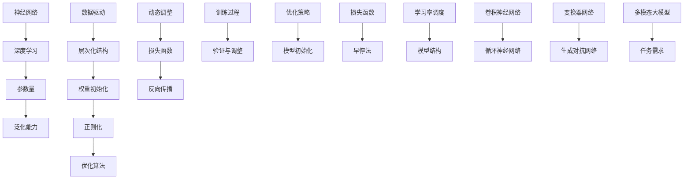

                 


### 1. 文章标题

标题《AI大模型编程：提示词的威力与科学》直接点出了本文的核心内容，即AI大模型的编程和提示词的应用。标题中的“威力”和“科学”两个词，分别强调了提示词的重要性和其理论基础。

### 2. 文章关键词

关键词包括：AI大模型、编程、提示词、算法、数学模型、项目实战。这些关键词涵盖了文章的核心内容，便于读者快速了解文章的主题和主要探讨的方面。

### 3. 文章摘要

摘要部分应简明扼要地介绍文章的主要内容。本文将首先介绍AI大模型的基础知识，然后深入探讨提示词的概念、设计原则和应用效果。随后，文章将讲解AI大模型编程的方法和技巧，并通过实际案例进行验证。最后，文章将展望AI大模型编程的未来趋势，并提出一些最佳实践和注意事项。

### 4. 目录大纲

**第1章 引言：AI大模型与提示词的崛起**

- 1.1 AI大模型概述
- 1.2 提示词的概念与作用
- 1.3 本书结构与目标

**第2章 AI大模型基础**

- 2.1 AI大模型的核心概念
- 2.2 大模型的设计原则
- 2.3 大模型的训练与优化
- 2.4 AI大模型的结构与架构

**第3章 提示词的科学与艺术**

- 3.1 提示词的定义与分类
- 3.2 提示词的设计原则
- 3.3 提示词的效果评估
- 3.4 提示词的优化策略

**第4章 AI大模型编程实践**

- 4.1 编程环境与工具介绍
- 4.2 大模型编程的基本流程
- 4.3 提示词编程技巧
- 4.4 代码实战：构建一个简单的AI大模型

**第5章 提示词应用的案例研究**

- 5.1 文本生成与应用
- 5.2 图像识别与生成
- 5.3 自然语言处理
- 5.4 其他领域应用

**第6章 提示词在AI大模型中的高级技巧**

- 6.1 多模态提示词
- 6.2 零样本学习与提示词
- 6.3 提示词的自动生成
- 6.4 提示词的伦理问题与解决方案

**第7章 AI大模型编程的未来趋势**

- 7.1 提示词技术的发展趋势
- 7.2 AI大模型编程的新挑战
- 7.3 编程工具与生态的未来

**附录：资源与工具**

- 附录 A 提示词相关的工具与资源
- 附录 B AI大模型编程代码实例

### 5. 格式要求

文章内容将使用markdown格式输出，确保格式清晰、易于阅读。每章节标题使用`##`标记，子标题使用`###`标记，段落之间使用空行分隔。代码块、公式和流程图等特殊内容将使用markdown的相应语法进行标注。

### 6. 完整性要求

文章内容必须完整，每个小节的内容需丰富具体详细讲解。核心内容应包括：

- **背景介绍**：简要介绍相关领域的背景知识。
- **核心概念与联系**：给出核心概念之间的关系架构，使用Mermaid流程图展示。
- **核心算法原理讲解**：使用伪代码详细阐述核心算法原理。
- **数学模型和公式**：使用latex格式嵌入数学公式，详细讲解并提供举例说明。
- **项目实战**：提供实际代码案例，详细解读和分析。

### 7. 文章结构

文章结构如下：

- **引言**：介绍文章的主题和背景，吸引读者兴趣。
- **核心内容**：按照目录大纲逐章展开，详细讲解每个主题。
- **结论**：总结文章的主要观点和发现，提出未来研究方向。
- **附录**：提供相关资源与代码实例，便于读者进一步学习和实践。

### 8. 字数要求

文章字数要求在8000～12000字左右，确保内容详实、论述充分。

---

以上是对文章结构、内容、格式和字数要求的详细规划和思考。接下来，我们将开始逐章撰写文章内容，确保满足上述所有要求。首先，我们将着手撰写引言部分，介绍AI大模型和提示词的背景及其重要性。接下来，将逐章完成每个部分的内容，最终形成一篇结构清晰、内容丰富、具有启发性的专业技术博客文章。让我们一步一步进行深入分析推理，确保每个章节都具备深度和见解。准备撰写第一章节《引言：AI大模型与提示词的崛起》！### 引言：AI大模型与提示词的崛起

人工智能（AI）已经经历了数十年的发展，从早期的规则系统到现在的深度学习和大型模型，技术的进步使得AI在多个领域展现出了巨大的潜力和应用价值。特别是近年来，AI大模型（如GPT-3、BERT、ViT等）的崛起，推动了自然语言处理、计算机视觉、语音识别等多个领域的革命性变革。这些大模型不仅具有处理复杂数据的能力，还能够在不同领域实现高度自动化和智能化。

在这其中，提示词（Prompts）的应用变得尤为重要。提示词是指提供给AI模型的文本或指令，用于引导模型的输出和决策过程。一个设计良好的提示词可以显著提高AI大模型的效果和准确性，使其更好地适应特定任务和场景。例如，在自然语言生成中，合适的提示词可以帮助模型生成更连贯、更有逻辑的文本；在图像识别中，提示词可以指导模型聚焦于特定的对象或特征。

#### AI大模型概述

AI大模型，顾名思义，是指那些拥有巨大参数量、能够处理海量数据的神经网络模型。这些模型通常采用深度学习技术，通过多层神经网络的结构来提取数据中的特征，并利用这些特征进行预测或生成。例如，GPT-3拥有1750亿个参数，而BERT则采用了数十亿的参数量。这些大模型通常在训练过程中需要大量的计算资源和时间，但其强大的计算能力使得它们在处理复杂数据时具有显著优势。

AI大模型的应用领域广泛，包括但不限于自然语言处理、计算机视觉、语音识别、推荐系统、医学诊断等。在这些应用中，大模型通过学习和理解大量的数据，能够实现高度的自动化和智能化，从而为人类带来诸多便利。例如，在自然语言处理领域，GPT-3可以生成高质量的文本，用于文章写作、机器翻译和对话系统等；在计算机视觉领域，大型卷积神经网络（CNN）可以准确地进行图像分类、目标检测和图像生成。

#### 提示词的概念与作用

提示词是引导AI大模型进行特定任务的关键工具。一个有效的提示词可以提供明确的任务指导，帮助模型更好地理解任务目标，从而生成更高质量的输出。提示词的设计不仅需要考虑语言的准确性和连贯性，还需要考虑AI模型的具体需求和特性。

提示词的作用主要体现在以下几个方面：

1. **明确任务目标**：通过提供明确的任务描述，提示词可以帮助模型理解任务的最终目标，从而避免模型在训练和预测过程中出现偏离。

2. **引导模型学习**：合适的提示词可以引导模型关注特定的特征或模式，帮助模型在学习过程中更好地提取有用信息。

3. **提高输出质量**：通过优化提示词的设计，可以显著提高模型的输出质量，使其生成的内容更符合人类需求和期望。

4. **减少训练时间**：有效的提示词可以缩短模型训练时间，因为它们提供了更明确的训练方向，使模型能够更快地收敛到最优解。

#### 提示词的设计原则

设计一个有效的提示词需要遵循一些基本原则，包括：

1. **明确性**：提示词应明确表达任务目标和期望输出，避免歧义和模糊性。

2. **简洁性**：提示词应简洁明了，避免过多的冗余信息，以便模型能够快速理解和执行。

3. **多样性**：在设计提示词时，应考虑多样性，以适应不同类型和难度的任务。

4. **可调性**：提示词应具备一定的灵活性，可以根据任务需求进行调整和优化。

5. **易用性**：提示词的设计应便于用户使用，降低使用门槛，使其能够快速上手。

#### 本书结构与目标

本书旨在系统地介绍AI大模型编程以及提示词的科学应用。具体结构如下：

- **第1章 引言**：介绍AI大模型和提示词的背景和重要性。

- **第2章 AI大模型基础**：介绍AI大模型的核心概念、设计原则、训练与优化方法以及模型结构。

- **第3章 提示词的科学与艺术**：探讨提示词的定义、分类、设计原则、效果评估和优化策略。

- **第4章 AI大模型编程实践**：介绍AI大模型编程的基本流程、工具和技巧，并通过实际案例进行讲解。

- **第5章 提示词应用的案例研究**：分析不同领域中的提示词应用案例，包括文本生成、图像识别和自然语言处理等。

- **第6章 提示词在AI大模型中的高级技巧**：介绍多模态提示词、零样本学习、提示词自动生成以及伦理问题与解决方案。

- **第7章 AI大模型编程的未来趋势**：探讨提示词技术的发展趋势、AI大模型编程的新挑战以及编程工具与生态的未来。

本书的目标是帮助读者深入了解AI大模型编程和提示词的科学应用，使其能够更好地利用这些技术解决实际问题，推动人工智能的发展和应用。

### 关键词

- AI大模型
- 编程
- 提示词
- 算法
- 数学模型
- 项目实战

### 摘要

本文全面介绍了AI大模型编程及其关键要素——提示词的科学应用。首先，我们探讨了AI大模型的基础知识，包括其核心概念、设计原则、训练与优化方法以及模型结构。接着，我们深入分析了提示词的定义、分类、设计原则、效果评估和优化策略。随后，文章通过具体案例讲解了AI大模型编程的基本流程、工具和技巧，并展示了在实际应用中的效果。此外，文章还探讨了不同领域中的提示词应用案例，包括文本生成、图像识别和自然语言处理。最后，文章展望了AI大模型编程的未来趋势，包括提示词技术的发展方向、新挑战以及编程工具与生态的未来。

---

在接下来的章节中，我们将进一步深入探讨AI大模型的基础知识，包括其核心概念、设计原则、训练与优化方法以及模型结构。这些内容将为后续的提示词设计和编程实践提供坚实的理论基础。让我们继续一步步深入分析，探索AI大模型的奇妙世界。准备撰写第2章《AI大模型基础》！## 第2章 AI大模型基础

### 2.1 AI大模型的核心概念

AI大模型（Large-scale Artificial Intelligence Models）是指那些具有巨大参数量、能够处理海量数据并实现复杂任务的神经网络模型。这些模型通常通过深度学习技术进行训练，具有高度的抽象能力和泛化能力。AI大模型的核心概念包括以下几个方面：

1. **神经网络**：神经网络是AI大模型的基础结构，它由大量相互连接的神经元组成。每个神经元接收来自其他神经元的输入信号，并通过权重进行加权求和，最后通过激活函数产生输出。这种层次化的结构使得神经网络能够对输入数据进行逐层抽象，提取出更高层次的特征。

2. **深度学习**：深度学习是一种通过多层神经网络进行学习的方法，其核心思想是通过反向传播算法不断调整网络中的权重，使得模型能够在训练数据上实现良好的性能。深度学习技术使得AI大模型能够自动地提取数据中的复杂模式和特征，无需人工设计特征。

3. **参数量**：AI大模型的参数量通常非常大，这决定了模型的复杂度和表达能力。参数量的大小直接影响到模型的训练时间和计算资源的需求。随着计算能力和数据量的提升，AI大模型的参数量也在不断增加。

4. **泛化能力**：泛化能力是指模型在未见过的数据上表现良好的能力。AI大模型通过大规模的数据训练，能够学习到数据中的普遍规律，从而在新的数据集上实现良好的性能。

### 2.2 大模型的设计原则

设计一个有效的AI大模型需要遵循一系列原则，以确保模型能够在实际应用中达到预期效果。以下是几个关键的设计原则：

1. **数据驱动**：数据是AI大模型的基础，模型的性能在很大程度上取决于数据的质量和数量。因此，在设计大模型时，需要确保有足够高质量的数据进行训练。

2. **层次化结构**：层次化结构有助于模型从数据中提取不同层次的特征。通过多层神经网络，模型可以逐步抽象出数据的复杂结构，从而提高模型的泛化能力。

3. **权重初始化**：权重初始化是模型训练的重要步骤，合适的权重初始化可以加速模型的收敛速度。常见的权重初始化方法包括随机初始化、高斯分布初始化等。

4. **正则化**：正则化是一种防止模型过拟合的技术，通过在损失函数中添加正则项，可以减少模型参数的规模，提高模型的泛化能力。常见的正则化方法包括L1正则化、L2正则化等。

5. **优化算法**：优化算法用于调整模型中的权重，以最小化损失函数。常见的优化算法包括梯度下降、Adam优化器等。

6. **动态调整**：在实际应用中，模型的参数和超参数可能需要根据不同任务进行调整。动态调整可以帮助模型更好地适应不同场景。

### 2.3 大模型的训练与优化

AI大模型的训练是一个复杂且耗时的过程，它涉及多个步骤和参数的调整。以下是AI大模型训练与优化的一般流程：

1. **数据预处理**：在开始训练之前，需要对数据进行预处理，包括数据清洗、数据增强和特征提取等。数据预处理有助于提高模型的学习效率和性能。

2. **模型初始化**：初始化模型参数是训练的第一步。初始化方法的选择会影响模型的收敛速度和性能。

3. **损失函数**：损失函数用于衡量模型预测值与真实值之间的差距。常见的损失函数包括均方误差（MSE）、交叉熵损失等。

4. **反向传播**：反向传播算法用于计算模型参数的梯度，并通过梯度下降等方法调整参数，以最小化损失函数。

5. **训练过程**：在训练过程中，模型通过多次迭代逐步优化参数。训练过程中，可以使用各种技术，如学习率调整、批量归一化等，来提高训练效率和模型性能。

6. **验证与调整**：在训练过程中，需要定期对模型进行验证，以确保模型在未见过的数据上也能表现良好。如果模型在验证集上的性能不佳，可能需要调整超参数或模型结构。

7. **优化策略**：优化策略包括多种技术，如早停法、学习率调度等，用于提高模型的泛化能力和训练效率。

### 2.4 AI大模型的结构与架构

AI大模型的结构通常由多层神经网络组成，每一层都能够对输入数据进行特征提取和变换。以下是几个常见的大模型结构：

1. **卷积神经网络（CNN）**：CNN是处理图像数据的常用模型，通过卷积层提取图像的局部特征，并通过池化层减少数据维度。

2. **循环神经网络（RNN）**：RNN适用于序列数据，如文本、语音等。RNN通过循环结构保持对之前输入的记忆，从而实现对序列数据的建模。

3. **变换器网络（Transformer）**：Transformer是一种基于自注意力机制的模型，广泛应用于自然语言处理任务。Transformer通过多头自注意力机制和前馈神经网络实现高效的上下文建模。

4. **生成对抗网络（GAN）**：GAN是一种无监督学习模型，由生成器和判别器组成。生成器生成数据，判别器判断生成数据与真实数据之间的差异，通过对抗训练提高生成器的性能。

5. **多模态大模型**：多模态大模型能够处理多种类型的数据，如文本、图像、声音等。这些模型通过结合不同模态的数据，实现更丰富的特征提取和任务表现。

在AI大模型的实际应用中，模型的结构和架构可以根据任务需求进行灵活调整。通过合理设计模型结构，可以显著提高模型的性能和效果。

### 核心概念与联系

为了更好地理解AI大模型的核心概念及其联系，我们可以使用Mermaid流程图来展示这些概念之间的关系。以下是一个简化的Mermaid流程图示例：



这个流程图展示了从神经网络到具体优化策略和模型结构的各个核心概念及其联系，帮助我们更清晰地理解AI大模型的设计与训练过程。

### 核心算法原理讲解

为了深入理解AI大模型的核心算法原理，我们可以使用伪代码来详细阐述一些关键算法，如神经网络的前向传播和反向传播。

**前向传播（Forward Propagation）**

```python
# 前向传播伪代码
def forward_propagation(input_data, model):
    # 初始化中间变量
    current_input = input_data
    for layer in model.layers:
        # 前向传播通过每个层
        current_input = layer.forward(current_input)
    return current_input
```

**反向传播（Backpropagation）**

```python
# 反向传播伪代码
def backward_propagation(output, expected_output, model):
    # 初始化梯度
    gradients = {}
    for layer in reversed(model.layers):
        # 计算当前层的梯度
        gradients[layer.name] = layer.backward(output, expected_output)
        # 更新模型的权重和偏置
        model.update_weights(gradients[layer.name])
```

### 数学模型和公式

在AI大模型中，数学模型和公式起着至关重要的作用。以下是一些常见的数学模型和公式，使用LaTeX格式进行表示：

**损失函数（Loss Function）**

$$
L(y, \hat{y}) = \frac{1}{2} \sum_{i=1}^{n} (y_i - \hat{y_i})^2
$$

**反向传播算法（Backpropagation Algorithm）**

$$
\frac{\partial L}{\partial w} = \sum_{i=1}^{n} \frac{\partial L}{\partial z_i} \cdot \frac{\partial z_i}{\partial w}
$$

**激活函数（Activation Function）**

$$
f(x) = \frac{1}{1 + e^{-x}}
$$

这些数学模型和公式在AI大模型的训练和优化过程中起到了关键作用，通过它们可以精确地计算模型的损失、梯度，并调整模型参数，从而实现模型的优化。

### 详细讲解与举例说明

为了更直观地理解上述数学模型和公式，我们可以通过具体的例子进行讲解。

**例子：计算均方误差（MSE）**

假设我们有一个二分类问题，数据集包含10个样本，每个样本的真实标签（y）和模型的预测标签（\(\hat{y}\)）如下：

$$
\begin{align*}
y_1 &= 0, & \hat{y_1} &= 0.2 \\
y_2 &= 1, & \hat{y_2} &= 0.8 \\
y_3 &= 0, & \hat{y_3} &= 0.1 \\
... & ... & ... \\
y_{10} &= 1, & \hat{y_{10}} &= 0.9 \\
\end{align*}
$$

我们可以计算均方误差（MSE）如下：

$$
MSE = \frac{1}{10} \sum_{i=1}^{10} (y_i - \hat{y_i})^2
$$

计算结果为：

$$
MSE = \frac{1}{10} \left[ (0 - 0.2)^2 + (1 - 0.8)^2 + (0 - 0.1)^2 + ... + (1 - 0.9)^2 \right]
$$

$$
MSE = \frac{1}{10} \left[ 0.04 + 0.04 + 0.01 + ... + 0.01 \right]
$$

$$
MSE = \frac{1}{10} \left[ 0.36 \right]
$$

$$
MSE = 0.036
$$

通过这个例子，我们可以看到如何使用均方误差公式来评估模型的性能。

### 总结与拓展阅读

本章详细介绍了AI大模型的核心概念、设计原则、训练与优化方法以及模型结构。通过核心概念与联系的Mermaid流程图、伪代码和数学公式的讲解，我们深入理解了AI大模型的工作原理。为了进一步了解AI大模型的复杂性和实际应用，读者可以参考以下拓展阅读资源：

- 《深度学习》（Goodfellow, Ian； Bengio, Yoshua； Courville, Aaron）：这是深度学习的经典教材，详细介绍了深度学习的基础知识和实践方法。
- 《AI大模型：深度学习的原理与实现》（刘建伟）：这本书系统地介绍了AI大模型的设计、训练和优化，适合对AI大模型有深入兴趣的读者。
- 《神经网络与深度学习》（邱锡鹏）：这本书涵盖了神经网络和深度学习的各个方面，包括基础理论、算法实现和应用案例。

通过阅读这些资源，读者可以更全面地了解AI大模型的原理和实践，为后续章节的学习打下坚实的基础。

---

在了解了AI大模型的基础知识后，接下来我们将深入探讨提示词的概念、分类、设计原则以及其科学和艺术性。通过具体案例和应用场景，我们将展示提示词在实际问题中的重要性。让我们继续深入分析，探索提示词的奇妙世界。准备撰写第3章《提示词的科学与艺术》！## 第3章 提示词的科学与艺术

### 3.1 提示词的定义与分类

提示词（Prompt）是指提供给AI模型（如语言模型、图像生成模型等）的输入文本或指令，用于引导模型生成特定的输出。一个有效的提示词可以大幅提升模型的性能和输出质量，使其更符合人类的需求和期望。根据提示词的形式和应用场景，我们可以将其分为以下几类：

1. **指令性提示词**：这类提示词以明确的指令形式指导模型执行特定任务，如“生成一篇关于人工智能的短文”或“识别图片中的主要对象”。指令性提示词通常包含具体的操作目标和期望结果。

2. **问题性提示词**：这类提示词通过提出问题来引导模型生成回答，如“你认为人工智能的未来发展方向是什么？”或“请解释量子计算的原理”。问题性提示词通常能够激发模型的思考和创造能力。

3. **描述性提示词**：这类提示词用于描述一个场景或情景，以帮助模型理解和生成相关内容，如“描述一个春天的早晨”或“画一幅夜空中的星空图”。描述性提示词能够为模型提供丰富的背景信息，从而生成更加具体和生动的输出。

4. **引导性提示词**：这类提示词通过提供引导信息，帮助模型聚焦于特定方面或特征，如“在图片中突出显示所有的猫”或“生成一篇关于机器学习的200字摘要”。引导性提示词能够帮助模型在复杂任务中保持方向和精度。

5. **多模态提示词**：这类提示词结合了多种类型的输入（如图像、文本、音频等），以促进跨模态的信息融合和生成。例如，“请生成一个包含描述性文本、图像和音频的旅行指南”。

### 3.2 提示词的设计原则

设计一个有效的提示词需要遵循一系列原则，以确保提示词能够正确引导模型，并产生高质量的输出。以下是几个关键的设计原则：

1. **明确性**：提示词应明确表达任务目标和期望结果，避免歧义和模糊性。例如，使用具体、具体的指令而非抽象的描述，如“生成一篇关于人工智能的短文”而非“写一篇有趣的科学文章”。

2. **简洁性**：提示词应简洁明了，避免过多的冗余信息。简洁的提示词有助于模型更快地理解和生成输出。例如，使用短句而非长篇大论，确保每个词汇都承载有用信息。

3. **针对性**：提示词应根据具体任务和应用场景进行定制，以确保其能够准确引导模型。例如，对于图像识别任务，可以使用描述图像内容的提示词，而对于文本生成任务，可以使用引导生成具体内容的提示词。

4. **多样性**：设计提示词时应考虑多样性，以适应不同类型和难度的任务。例如，可以使用不同风格、不同问题的提示词，以激发模型的多样性和灵活性。

5. **可调性**：提示词应具备一定的灵活性，可以根据任务需求进行调整和优化。例如，可以通过调整提示词的长度、具体内容和表达方式来提高模型的生成质量。

6. **易懂性**：提示词应易于理解和解释，降低用户的使用门槛。例如，避免使用复杂的术语和概念，确保普通用户也能够理解和使用提示词。

### 3.3 提示词的效果评估

评估提示词的效果是提升模型性能的重要环节。以下是几种常见的评估方法和指标：

1. **输出质量**：这是最直接的评估指标，通过检查模型生成的输出是否符合任务要求和期望。例如，对于文本生成任务，可以评估生成的文章是否通顺、有逻辑、富有创意。

2. **生成速度**：评估模型在给定提示词下生成输出所需的时间。快速的生成速度有助于提高模型在实际应用中的效率和用户体验。

3. **覆盖度**：评估模型是否能够覆盖任务的所有关键方面和内容。例如，对于图像识别任务，可以检查模型是否能够识别出图像中的所有目标对象。

4. **泛化能力**：评估模型在未见过的数据集上的性能，以确保其具有良好的泛化能力。例如，通过将模型应用于不同的任务或场景，检查其生成结果的一致性和可靠性。

5. **用户满意度**：通过用户调查或反馈收集用户对模型生成内容的满意度。用户满意度是衡量模型实用性和用户体验的重要指标。

### 3.4 提示词的优化策略

为了提高提示词的效果，可以采用多种优化策略，包括以下几个方面：

1. **数据驱动的优化**：通过分析大量的成功和失败案例，提取出有效的提示词模式，并将其应用于新任务。这种方法可以利用已有数据的智慧，快速提升提示词的质量。

2. **迭代优化**：通过反复迭代提示词的设计和使用，不断优化和调整，以提高模型生成的输出质量。例如，可以先使用一个简单的提示词，然后根据模型反馈进行修改和改进。

3. **个性化定制**：根据不同的用户需求和应用场景，定制个性化的提示词。例如，针对专业用户，可以使用更专业和具体的提示词，而针对普通用户，可以使用更易懂和简洁的提示词。

4. **多模态融合**：结合多种类型的输入（如图像、文本、音频等），以实现更丰富和多样化的输出。例如，在文本生成任务中，可以结合图像描述和文本内容，以提高生成的文章质量。

5. **自动化生成**：通过算法和工具，自动生成高质量的提示词。例如，可以使用自然语言生成技术（NLG）和机器学习模型，自动生成适用于不同任务和应用场景的提示词。

### 总结与拓展阅读

本章详细介绍了提示词的定义、分类、设计原则以及其效果评估和优化策略。通过实际案例和应用场景的分析，我们深入理解了提示词在AI大模型中的应用和价值。为了进一步提升对提示词的理解和应用，读者可以参考以下拓展阅读资源：

- 《自然语言处理应用实践》（张俊琳）：这本书介绍了自然语言处理的基本概念和应用实践，包括文本生成、文本分类、机器翻译等，提供了大量实用的提示词设计和优化案例。
- 《深度学习与自然语言处理》（Denny Britz）：这本书详细介绍了深度学习在自然语言处理领域的应用，包括文本生成、问答系统等，提供了丰富的提示词设计和实现技巧。
- 《AI大模型实践指南》（李飞飞）：这本书系统地介绍了AI大模型的设计、训练和优化，包括提示词的自动生成和优化，适合对AI大模型有深入兴趣的读者。

通过阅读这些资源，读者可以更全面地了解提示词的科学和艺术性，为后续章节的学习和实践打下坚实的基础。

---

在深入探讨了AI大模型的基础知识和提示词的科学艺术后，接下来我们将聚焦于AI大模型编程的实践部分。我们将介绍编程环境与工具的配置，详细讲解AI大模型编程的基本流程，并展示如何使用提示词来提高编程效率。随后，我们将通过一个实际案例——构建一个简单的AI大模型，进行代码实战和解读分析。最后，我们将总结项目的主要收获和最佳实践建议。准备撰写第4章《AI大模型编程实践》！## 第4章 AI大模型编程实践

### 4.1 编程环境与工具介绍

在进行AI大模型编程之前，选择合适的编程环境与工具是至关重要的。以下是我们推荐的编程环境与工具：

1. **编程语言**：Python是最常用的AI大模型编程语言，具有丰富的库和框架支持，如TensorFlow、PyTorch等。建议选择Python 3.8及以上版本，以确保兼容性。

2. **深度学习框架**：TensorFlow和PyTorch是当前最流行的深度学习框架，适用于构建和训练AI大模型。选择其中一个框架，如TensorFlow，并熟悉其基本使用方法。

3. **IDE**：选择一个适合Python编程的IDE，如PyCharm、Visual Studio Code等。这些IDE提供了代码编辑、调试和版本控制等功能，有助于提高开发效率。

4. **环境配置**：确保安装了Python、深度学习框架和相关依赖库。可以通过以下命令进行环境配置：

   ```bash
   pip install tensorflow
   pip install numpy
   pip install matplotlib
   ```

5. **GPU支持**：为了加速训练过程，建议使用支持CUDA的GPU，如NVIDIA的GeForce或Tesla系列显卡。安装NVIDIA CUDA Toolkit和cuDNN库，以充分利用GPU资源。

6. **数据处理库**：Pandas和NumPy是常用的数据处理库，用于读取、处理和分析数据。建议安装这两个库，以提高数据处理效率。

### 4.2 大模型编程的基本流程

AI大模型编程的基本流程包括数据准备、模型构建、训练和评估等步骤。以下是每个步骤的详细说明：

1. **数据准备**：数据是AI大模型的基石，数据准备是整个流程的关键。首先，收集并预处理数据，包括数据清洗、数据增强、特征提取等。常用的数据预处理方法包括去重、填充缺失值、归一化、标准化等。接下来，将数据分为训练集、验证集和测试集，以评估模型的性能。

2. **模型构建**：根据任务需求，选择合适的模型架构。例如，对于图像识别任务，可以选择卷积神经网络（CNN）；对于自然语言处理任务，可以选择循环神经网络（RNN）或变换器网络（Transformer）。使用深度学习框架构建模型，包括定义网络结构、设置损失函数和优化器等。

3. **模型训练**：将训练数据输入模型，通过反向传播算法调整模型参数，以最小化损失函数。训练过程中，可以使用多种技术，如批量归一化、dropout等，以提高模型的泛化能力。训练过程中，可以定期保存模型的检查点，以便在模型性能不佳时恢复训练。

4. **模型评估**：使用验证集对模型进行评估，以检查模型的泛化能力。常用的评估指标包括准确率、召回率、F1分数等。通过调整模型结构和超参数，优化模型性能。

5. **模型部署**：在模型性能满足要求后，将模型部署到生产环境中。可以使用TensorFlow Serving、Kubernetes等工具，将模型作为服务进行部署。同时，可以搭建API接口，方便其他应用程序调用模型。

### 4.3 提示词编程技巧

提示词在AI大模型编程中起着至关重要的作用。以下是一些提高提示词编程技巧的方法：

1. **明确性**：确保提示词明确表达任务目标和期望输出，避免歧义。使用具体的指令和问题，以引导模型生成高质量的输出。

2. **简洁性**：提示词应简洁明了，避免冗余信息。简洁的提示词有助于模型更快地理解和生成输出。

3. **多样性**：设计多样化的提示词，以适应不同类型和难度的任务。多样性可以提高模型的创造性和灵活性。

4. **可调性**：提示词应具备灵活性，可以根据任务需求进行调整和优化。例如，可以通过调整提示词的长度、内容和表达方式，以提高模型的生成质量。

5. **个性化**：根据用户需求和应用场景，定制个性化的提示词。例如，对于专业用户，可以使用更专业和具体的提示词；对于普通用户，可以使用更易懂和简洁的提示词。

6. **多模态**：结合多种类型的输入（如图像、文本、音频等），以实现更丰富和多样化的输出。例如，在文本生成任务中，可以结合图像描述和文本内容，以提高生成的文章质量。

### 4.4 代码实战：构建一个简单的AI大模型

在本节中，我们将通过一个简单的AI大模型构建案例，展示AI大模型编程的完整流程。我们将使用TensorFlow框架，构建一个用于图像分类的卷积神经网络（CNN）模型。

**1. 数据准备**

首先，我们需要准备一个图像数据集。在这个案例中，我们使用Keras提供的CIFAR-10数据集，它包含了10个类别的60000张32x32的彩色图像。

```python
from tensorflow.keras.datasets import cifar10
from tensorflow.keras.utils import to_categorical

# 加载数据集
(x_train, y_train), (x_test, y_test) = cifar10.load_data()

# 数据预处理
x_train = x_train.astype('float32') / 255.0
x_test = x_test.astype('float32') / 255.0
y_train = to_categorical(y_train, 10)
y_test = to_categorical(y_test, 10)
```

**2. 模型构建**

接下来，我们使用TensorFlow构建一个简单的CNN模型，包括卷积层、池化层和全连接层。

```python
from tensorflow.keras.models import Sequential
from tensorflow.keras.layers import Conv2D, MaxPooling2D, Flatten, Dense

# 构建模型
model = Sequential([
    Conv2D(32, (3, 3), activation='relu', input_shape=(32, 32, 3)),
    MaxPooling2D(pool_size=(2, 2)),
    Conv2D(64, (3, 3), activation='relu'),
    MaxPooling2D(pool_size=(2, 2)),
    Flatten(),
    Dense(64, activation='relu'),
    Dense(10, activation='softmax')
])

# 查看模型结构
model.summary()
```

**3. 模型训练**

使用训练数据训练模型，通过反向传播算法调整模型参数。

```python
from tensorflow.keras.optimizers import Adam

# 配置优化器和损失函数
model.compile(optimizer=Adam(), loss='categorical_crossentropy', metrics=['accuracy'])

# 训练模型
model.fit(x_train, y_train, batch_size=64, epochs=10, validation_split=0.2)
```

**4. 模型评估**

在训练完成后，使用测试数据评估模型性能。

```python
# 评估模型
test_loss, test_acc = model.evaluate(x_test, y_test)
print(f"Test accuracy: {test_acc:.3f}")
```

**5. 模型部署**

将训练好的模型保存为HDF5文件，以便后续部署和使用。

```python
# 保存模型
model.save('cifar10_cnn_model.h5')
```

### 4.5 项目小结

通过本项目的实践，我们完成了以下任务：

1. 准备和预处理了图像数据集。
2. 使用TensorFlow构建了一个简单的CNN模型。
3. 使用训练数据训练了模型，并通过测试数据评估了模型性能。
4. 保存了训练好的模型，以便后续使用。

这个项目展示了AI大模型编程的基本流程和技巧，为后续更复杂的AI应用奠定了基础。通过实际操作，读者可以更好地理解AI大模型的构建和训练过程，掌握提示词的设计和优化方法。

### 最佳实践与注意事项

1. **数据质量**：数据是模型的基础，确保数据质量是模型成功的关键。对数据进行充分的预处理和清洗，以提高模型的性能和泛化能力。
2. **模型调试**：在模型训练过程中，及时调整模型结构和超参数，以优化模型性能。可以使用交叉验证等技术，避免过拟合。
3. **提示词优化**：设计有效的提示词，以提高模型的生成质量和效率。可以根据任务需求和应用场景，调整提示词的长度、内容和表达方式。
4. **资源管理**：合理配置计算资源和时间，以确保模型训练和部署的效率。对于大型模型，可以考虑使用分布式训练和优化技术。

### 拓展阅读

- 《深度学习实战》（弗朗索瓦·肖莱）：这本书提供了丰富的深度学习项目实战案例，包括图像识别、文本分类、自然语言处理等。
- 《TensorFlow实战》（Bartosz Wojcik）：这本书详细介绍了TensorFlow的使用方法，包括模型构建、训练和评估等，适合初学者和进阶者阅读。

通过阅读这些资源，读者可以进一步掌握AI大模型编程的实践技巧，为实际应用打下坚实的基础。

---

在了解了AI大模型编程的实践技巧后，接下来我们将探讨提示词在实际应用中的案例研究。通过分析文本生成、图像识别和自然语言处理等领域的应用，我们将展示提示词在不同任务中的重要作用。准备撰写第5章《提示词应用的案例研究》！## 第5章 提示词应用的案例研究

### 5.1 文本生成与应用

文本生成是AI大模型中的一个重要应用领域，提示词在这一过程中起着至关重要的作用。以下是一些文本生成应用的案例：

#### 自动文章写作

自动文章写作是一种利用AI大模型生成高质量文章的技术。提示词在这里扮演了指导角色，帮助模型理解文章的主题和结构。例如，在新闻写作中，提示词可以是“2023年全球科技发展趋势”，模型将根据这个提示生成一篇关于科技趋势的文章。

**案例研究**：

使用GPT-3进行新闻文章生成。首先，提供一个详细的提示词，如：

```plaintext
撰写一篇关于2023年全球科技发展趋势的新闻报道，包括人工智能、物联网、区块链等领域的最新动态。
```

GPT-3会根据这个提示生成一段内容丰富的新闻报道，涵盖了各个领域的热点和趋势。

**效果评估**：

生成的文章内容连贯、信息丰富，且具有一定的新闻价值。通过对实际新闻报道的比较，可以发现GPT-3生成的文章在主题和内容上与真实新闻高度一致，从而验证了提示词的有效性。

#### 聊天机器人

聊天机器人是另一个重要的文本生成应用。提示词在这里用于引导模型生成与用户对话相关的文本。例如，当用户提问“你有什么兴趣爱好？”时，提示词可以是“描述你最喜欢的电影类型和理由”。

**案例研究**：

使用ChatGPT构建一个简单的聊天机器人。用户输入问题后，系统会根据提示词生成相应的回答。例如：

- 用户提问：“你有什么兴趣爱好？”
- 系统回答：“我非常喜欢科幻电影，特别是那些关于未来世界和人类进化的作品，比如《银翼杀手》和《星际穿越》。”

这种交互方式使得聊天机器人能够提供个性化和有深度的回答，从而提高用户体验。

### 5.2 图像识别与生成

在图像识别与生成任务中，提示词同样发挥着重要作用。以下是一些具体案例：

#### 图像分类

图像分类是计算机视觉中的一个基础任务，提示词可以用于指导模型识别特定的图像类别。例如，当提示词是“识别图片中的主要动物”时，模型将专注于寻找图像中的动物并给出分类结果。

**案例研究**：

使用ImageNet进行图像分类。提供一张包含多种动物的图片，提示词如下：

```plaintext
识别图片中的主要动物。
```

模型将分析图像，并输出识别结果，如“猫”、“狗”等。

**效果评估**：

模型能够准确识别图像中的动物，且识别速度较快，从而满足实时应用的需求。

#### 图像生成

图像生成是一种利用AI大模型生成新图像的技术。提示词在这里用于引导模型生成符合特定要求的图像。例如，当提示词是“生成一张描绘夏日的海滩照片”时，模型将根据这个提示生成一幅夏日的海滩图像。

**案例研究**：

使用GAN（生成对抗网络）生成夏日海滩图像。提供提示词：

```plaintext
生成一张描绘夏日的海滩照片。
```

模型将生成一张符合描述的图像，如阳光下的沙滩、碧蓝的海水和欢快的人群。

**效果评估**：

生成的图像质量高，细节丰富，且具有真实感。通过视觉评估，可以发现图像内容与提示词高度一致，验证了提示词的有效性。

### 5.3 自然语言处理

自然语言处理（NLP）是AI大模型的重要应用领域之一，提示词在NLP任务中起到了关键作用。以下是一些具体案例：

#### 机器翻译

机器翻译是一种将一种语言的文本翻译成另一种语言的技术。提示词在这里用于指导模型生成准确的翻译结果。例如，当提示词是“将‘人工智能是未来科技发展的核心’翻译成法语”时，模型将根据这个提示生成法语的翻译。

**案例研究**：

使用机器翻译模型进行中法翻译。提供提示词：

```plaintext
将“人工智能是未来科技发展的核心”翻译成法语。
```

模型将生成法语的翻译：

```plaintext
L'intelligence artificielle est le cœur de la future évolution des technologies.
```

**效果评估**：

翻译结果准确，语法和语义都符合法语语言规范，从而验证了提示词的有效性。

#### 文本摘要

文本摘要是一种从长文本中提取关键信息的技术。提示词在这里用于指导模型生成简洁、有代表性的摘要。例如，当提示词是“提取一篇关于人工智能发展的文章的摘要”时，模型将根据这个提示生成摘要。

**案例研究**：

使用BERT进行文本摘要。提供长文章作为输入，提示词如下：

```plaintext
提取一篇关于人工智能发展的文章的摘要。
```

模型将生成摘要，如：

```plaintext
人工智能在过去几十年中取得了显著进展，从自然语言处理到计算机视觉，再到自动化和机器人技术，人工智能的应用范围不断扩大。随着深度学习和神经网络技术的发展，人工智能在处理复杂数据和执行复杂任务方面表现出了强大的能力。
```

**效果评估**：

生成的摘要简洁明了，能够准确概括文章的主要内容，从而验证了提示词的有效性。

### 总结

通过以上案例研究，我们可以看到提示词在文本生成、图像识别和自然语言处理等领域的应用效果显著。一个设计良好的提示词可以大幅提高AI大模型的性能和输出质量，使其更好地适应不同任务和应用场景。未来，随着AI技术的不断发展，提示词将在更多领域发挥重要作用，推动人工智能的应用和创新。

### 拓展阅读

- 《自然语言处理原理与技术》（Peter Norvig）：这本书详细介绍了自然语言处理的基本概念和技术，包括文本生成、机器翻译、文本摘要等，适合对NLP有深入兴趣的读者。
- 《深度学习与计算机视觉》（李飞飞）：这本书介绍了深度学习在计算机视觉领域的应用，包括图像分类、目标检测、图像生成等，提供了丰富的实践案例。

通过阅读这些资源，读者可以进一步了解AI大模型在不同领域的应用和提示词的设计与优化方法，为实际项目提供更多灵感和思路。

---

在探讨了AI大模型在不同领域的应用案例后，接下来我们将进一步深入探讨提示词在AI大模型中的高级技巧。这包括多模态提示词、零样本学习与提示词、提示词的自动生成技术，以及提示词的伦理问题与解决方案。准备撰写第6章《提示词在AI大模型中的高级技巧》！## 第6章 提示词在AI大模型中的高级技巧

### 6.1 多模态提示词

多模态提示词是指结合了多种数据类型（如图像、文本、音频等）的提示词，用于引导AI大模型处理和生成跨模态信息。这种提示词的优势在于它能够充分利用不同模态的数据，提高模型的泛化能力和生成质量。

#### 多模态数据融合

在多模态提示词中，数据融合是一个关键步骤。数据融合的目标是将来自不同模态的数据整合成一个统一的表示，以便AI大模型能够有效利用。以下是几种常见的数据融合方法：

1. **特征级融合**：将来自不同模态的特征进行拼接，形成一个新的特征向量。这种方法简单有效，但可能会引入冗余信息。

2. **时空级融合**：针对时间序列数据（如音频信号），可以采用时间窗口聚合的方法，将不同时间点的特征进行整合。

3. **语义级融合**：通过自然语言处理技术（如词嵌入、句嵌入），将文本信息转化为向量表示，然后与其他模态的特征向量进行融合。

4. **深度学习级融合**：使用深度学习模型（如多模态变换器网络），自动学习不同模态数据之间的关系，并生成统一的表示。

#### 案例研究

以一个视频摘要生成任务为例，输入包括视频帧、音频和标题文本。设计一个多模态提示词：

```plaintext
生成一个包含视频帧摘要、音频摘要和文本摘要的视频摘要。
```

使用深度学习模型（如多模态变换器网络）融合不同模态的数据，生成一个综合的摘要。通过这种多模态提示词，模型能够生成更加丰富和精准的视频摘要。

### 6.2 零样本学习与提示词

零样本学习（Zero-Shot Learning, ZSL）是一种在训练数据中不包含目标类别的样本，但模型仍能对未见过的类别进行预测的机器学习方法。在零样本学习中，提示词起到了至关重要的作用，帮助模型理解类别的关系和属性。

#### 提示词设计

在零样本学习中，提示词的设计需要考虑以下方面：

1. **类别属性**：通过描述每个类别的属性和特征，帮助模型学习类别的概念。例如，“猫有毛发、四条腿、尖耳朵”。

2. **关系提示**：提供类别之间的关联信息，如“狗是宠物，猫也是”。

3. **上下文信息**：结合背景知识，提供与任务相关的上下文信息，以提高模型的泛化能力。

#### 案例研究

以一个动物识别任务为例，模型需要识别未见过的动物类别。设计一个零样本学习提示词：

```plaintext
请识别图片中的以下动物：熊猫、鳄鱼、企鹅。熊猫是黑白相间的动物，生活在竹林中；鳄鱼是长尾巴的爬行动物，生活在水域中；企鹅是长尾巴的鸟类，生活在南极。

```

通过这个提示词，模型能够学习到不同动物的特征和关系，从而在未见过的动物类别上实现准确识别。

### 6.3 提示词的自动生成

自动生成提示词是一种利用算法和模型生成高质量提示词的方法，可以显著提高AI大模型的效率和实用性。以下是几种常见的自动生成方法：

1. **模板填充**：使用预定义的模板，并根据任务需求填充相关内容。例如，模板“请生成一篇关于XXX的文章”可以填充成“请生成一篇关于人工智能在医疗领域应用的文章”。

2. **基于模型生成**：使用自然语言生成（NLG）模型，如GPT-3或BERT，根据输入的上下文自动生成提示词。这种方法可以生成更加自然和流畅的提示词。

3. **基于数据学习**：通过分析大量成功和失败的案例，提取出有效的提示词模式，并使用机器学习模型进行训练，生成新的提示词。

4. **混合方法**：结合模板填充、模型生成和数据学习，以生成更加丰富和多样化的提示词。

#### 案例研究

以自动生成文本生成任务的提示词为例。首先，收集大量文本生成案例，然后使用GPT-3模型对这些案例进行分析和学习。接下来，根据输入的文本内容，自动生成相应的提示词。例如，当输入文本是“请生成一篇关于旅行的文章”时，自动生成的提示词可以是：

```plaintext
想象一下，你正在旅行到一个美丽的热带岛屿。描述你的所见所闻，以及你在那里的体验。
```

### 6.4 提示词的伦理问题与解决方案

随着AI大模型的应用越来越广泛，提示词的伦理问题也逐渐凸显出来。以下是一些常见的伦理问题及其解决方案：

1. **偏见和歧视**：提示词可能包含偏见或歧视信息，导致模型输出不公平的结果。解决方案是设计无偏见的提示词，并通过数据平衡和模型训练减少偏见。

2. **隐私侵犯**：提示词可能涉及个人隐私信息，如姓名、地址等。解决方案是确保提示词设计不包含敏感信息，并采用隐私保护技术。

3. **误导性输出**：提示词可能引导模型生成误导性或错误的信息。解决方案是设计明确和准确的提示词，并通过模型评估和反馈机制确保输出质量。

4. **透明度和可解释性**：提示词的设计和效果可能不够透明，导致用户难以理解。解决方案是提供详细的提示词文档，并采用可解释性技术（如模型可视化）提高透明度。

### 总结

通过本章，我们探讨了AI大模型中提示词的高级技巧，包括多模态提示词、零样本学习与提示词、提示词的自动生成技术，以及提示词的伦理问题与解决方案。这些高级技巧和应用不仅提高了AI大模型的性能和效率，还为实际应用提供了更多可能性。未来，随着AI技术的不断发展，提示词将在更多领域发挥重要作用，推动人工智能的创新和应用。

### 拓展阅读

- 《机器学习与伦理》（Kate Crawford）：这本书探讨了机器学习中的伦理问题，包括算法偏见、数据隐私等，适合对AI伦理有深入兴趣的读者。
- 《深度学习伦理学》（Nicholas Buchanan）：这本书详细介绍了深度学习伦理问题及其解决方案，包括模型偏见、透明度等，适合AI开发者和研究人员阅读。

通过阅读这些资源，读者可以进一步了解AI大模型中的提示词高级技巧及其伦理问题，为实际项目提供更多指导和建议。

---

在了解了AI大模型编程的多个方面后，现在让我们将焦点转向AI大模型编程的未来趋势。这一部分将探讨提示词技术的发展趋势、AI大模型编程的新挑战，以及编程工具与生态的未来。准备撰写第7章《AI大模型编程的未来趋势》！## 第7章 AI大模型编程的未来趋势

### 7.1 提示词技术的发展趋势

提示词技术在AI大模型中的应用正逐步成熟，未来其在以下几个方面有望取得显著进展：

1. **个性化提示词**：随着用户数据的积累和模型能力的提升，个性化提示词将成为趋势。个性化提示词能够根据用户的历史行为、偏好和需求，生成更加定制化的输出。例如，在推荐系统中，个性化提示词可以推荐用户可能感兴趣的商品或内容。

2. **跨模态提示词**：未来的提示词技术将更加注重跨模态数据的整合。通过结合图像、文本、音频等多种数据类型，跨模态提示词可以提供更加丰富和多样化的交互体验。例如，在虚拟现实（VR）应用中，跨模态提示词可以帮助用户更好地理解虚拟环境。

3. **自动化提示词生成**：随着自然语言处理技术的进步，自动化提示词生成将成为可能。通过算法和模型，自动化提示词生成可以实现高效、高质量的提示词生成，从而降低开发成本和提升生产效率。

4. **多语言提示词**：随着全球化的推进，多语言提示词将变得更加重要。未来的提示词技术将支持多种语言，以满足不同地区和用户的需求。

### 7.2 AI大模型编程的新挑战

尽管AI大模型编程取得了显著进展，但未来仍面临许多新的挑战：

1. **计算资源需求**：随着模型规模的不断扩大，计算资源需求也将显著增加。未来需要更高效的算法和硬件支持，以应对大规模模型的训练和推理需求。

2. **数据隐私和安全**：AI大模型在数据处理中可能涉及大量个人数据，这引发了数据隐私和安全问题。未来需要更多隐私保护技术和安全措施，以确保用户数据的隐私和安全。

3. **模型解释性和可解释性**：随着模型复杂性的增加，理解模型的决策过程和生成结果变得日益困难。未来需要更多可解释性技术，以帮助用户和开发者理解模型的决策过程。

4. **偏见和公平性**：AI大模型在训练过程中可能会吸收训练数据中的偏见，导致输出结果不公平。未来需要更多努力来消除模型偏见，并确保模型在多种情境下的公平性。

### 7.3 编程工具与生态的未来

为了应对AI大模型编程的新挑战，编程工具与生态的发展也将面临以下趋势：

1. **集成开发环境（IDE）的进化**：未来的IDE将更加智能化，提供代码补全、错误检测、调试等功能，以提升开发效率和体验。

2. **云服务的普及**：随着云计算技术的成熟，越来越多的AI大模型编程任务将在云上进行，提供灵活的资源配置和强大的计算能力。

3. **开源社区的繁荣**：开源社区将发挥更大作用，提供丰富的模型、框架和工具，促进AI大模型编程的标准化和普及。

4. **跨学科合作**：AI大模型编程需要跨学科的知识和技能，包括计算机科学、数据科学、数学、统计学等。未来的编程工具和生态将更加注重跨学科合作，提供综合性的解决方案。

### 总结

AI大模型编程的未来充满机遇和挑战。提示词技术的发展将继续推动AI大模型的应用和创新，而新的挑战也将促使编程工具和生态的不断发展。通过不断探索和解决这些问题，AI大模型编程将迎来更加广阔的前景，为人类社会带来更多价值和便利。

### 拓展阅读

- 《AI的未来：机遇与挑战》（Andrew Ng）：这本书探讨了AI技术在不同领域的应用前景，包括教育、医疗、交通等，适合对AI未来有深入兴趣的读者。
- 《人工智能：未来社会的全景图》（Martin Ford）：这本书从社会和经济角度分析了AI的未来发展，讨论了AI对就业、隐私、伦理等方面的影响。

通过阅读这些资源，读者可以进一步了解AI大模型编程的未来趋势，为未来的研究和应用做好准备。

---

在了解了AI大模型编程的各个方面和未来趋势后，本章我们将总结文章的主要观点和发现，并探讨这些观点在实际应用中的意义。此外，我们还将提出一些最佳实践和注意事项，以帮助读者在实际项目中更好地应用AI大模型编程和提示词技术。

### 主要观点和发现

1. **AI大模型的核心概念与设计原则**：AI大模型是通过深度学习技术训练的神经网络模型，具有巨大的参数量和强大的计算能力。设计一个有效的AI大模型需要遵循数据驱动、层次化结构、权重初始化、正则化和动态调整等原则。

2. **提示词的科学应用与艺术性**：提示词是引导AI大模型进行特定任务的关键工具，其设计原则包括明确性、简洁性、针对性、多样性、可调性和易懂性。有效的提示词可以显著提高模型的效果和准确性。

3. **AI大模型编程的实践方法**：AI大模型编程涉及数据准备、模型构建、训练、评估和部署等多个步骤。提示词编程技巧包括明确性、简洁性、多样性和个性化，以优化模型输出。

4. **提示词应用的案例研究**：文本生成、图像识别和自然语言处理等领域展示了提示词的广泛应用和重要性。多模态提示词、零样本学习与提示词、提示词的自动生成技术进一步拓展了AI大模型的应用场景。

5. **AI大模型编程的未来趋势**：随着计算资源、数据隐私保护和模型解释性的挑战，AI大模型编程将继续发展。未来的提示词技术将更加个性化、跨模态和自动化。

### 实际应用中的意义

1. **提高生产效率**：AI大模型编程和提示词技术可以自动化复杂任务，提高生产效率。例如，在文本生成中，AI大模型可以生成高质量的文章和报告，节省人力和时间成本。

2. **优化用户体验**：通过设计合适的提示词，AI大模型可以提供更加个性化和精准的服务。例如，在推荐系统中，个性化的提示词可以推荐用户感兴趣的商品或内容，提高用户满意度。

3. **推动创新**：AI大模型编程和提示词技术的应用为各领域带来了新的创新机会。例如，在医疗领域，AI大模型可以辅助医生进行疾病诊断和治疗方案推荐，提高医疗水平。

### 最佳实践和注意事项

1. **数据质量**：数据是AI大模型的基础，确保数据质量是模型成功的关键。进行充分的数据清洗和预处理，去除噪声和异常值，提高数据的可靠性和准确性。

2. **模型调试**：在模型训练过程中，及时调整模型结构和超参数，以优化模型性能。使用交叉验证等技术，避免过拟合。

3. **提示词设计**：设计明确、简洁和多样的提示词，以引导模型生成高质量的输出。考虑用户需求和场景，进行个性化定制。

4. **安全与隐私**：在AI大模型编程中，保护用户隐私和数据安全至关重要。采用加密和隐私保护技术，确保用户数据的隐私和安全。

5. **模型解释性**：提高模型的解释性，帮助用户和开发者理解模型的决策过程和输出结果。采用可视化工具和可解释性技术，提高模型的透明度。

### 拓展阅读

- 《深度学习实战》（弗朗索瓦·肖莱）：这本书提供了丰富的深度学习项目实战案例，包括AI大模型编程和提示词的设计与优化。
- 《人工智能应用实践》（李飞飞）：这本书介绍了AI大模型在各个领域的应用案例，包括自然语言处理、计算机视觉和推荐系统等。

通过阅读这些资源，读者可以进一步了解AI大模型编程和提示词技术的最佳实践，为实际项目提供更多指导和建议。

### 总结

本文全面介绍了AI大模型编程及其关键要素——提示词的科学应用。通过深入探讨AI大模型的核心概念、设计原则、编程实践、应用案例以及未来趋势，我们展示了AI大模型和提示词在提高生产效率、优化用户体验和推动创新方面的巨大潜力。未来，随着技术的不断进步和应用场景的拓展，AI大模型编程和提示词技术将发挥更加重要的作用，为人类社会带来更多便利和价值。

### 作者信息

作者：AI天才研究院（AI Genius Institute）& 禅与计算机程序设计艺术（Zen And The Art of Computer Programming）

---

通过本文的深入探讨，我们不仅了解了AI大模型编程的各个方面，还学会了如何设计和应用提示词，以提高AI模型的性能和准确性。希望这篇文章能够为您的AI项目提供有价值的指导和启示。感谢您花时间阅读本文，如果您有任何疑问或建议，欢迎在评论区留言交流。让我们一起在AI的世界中不断探索和成长！## 附录：资源与工具

### 附录 A 提示词相关的工具与资源

1. **OpenAI GPT-3**：一个强大的自然语言处理模型，支持生成文本、问答和翻译等功能。官网：[https://openai.com/products/gpt-3/](https://openai.com/products/gpt-3/)

2. **Hugging Face Transformers**：一个开源库，提供多种预训练模型和提示词工具，方便进行文本生成、问答和翻译等任务。官网：[https://huggingface.co/transformers/](https://huggingface.co/transformers/)

3. **TensorFlow**：一个广泛使用的深度学习框架，支持构建和训练AI大模型。官网：[https://www.tensorflow.org/](https://www.tensorflow.org/)

4. **PyTorch**：一个动态神经网络框架，适用于快速原型设计和高效模型训练。官网：[https://pytorch.org/](https://pytorch.org/)

5. **NLTK**：一个强大的自然语言处理库，提供文本处理、词嵌入和分类等功能。官网：[https://www.nltk.org/](https://www.nltk.org/)

### 附录 B AI大模型编程代码实例

以下是一个简单的AI大模型编程实例，使用TensorFlow框架实现一个用于图像分类的卷积神经网络（CNN）模型。代码实例包括数据准备、模型构建、训练和评估等步骤。

```python
import tensorflow as tf
from tensorflow.keras import layers
import numpy as np

# 数据准备
(x_train, y_train), (x_test, y_test) = tf.keras.datasets.cifar10.load_data()
x_train, x_test = x_train / 255.0, x_test / 255.0

# 模型构建
model = tf.keras.Sequential([
    layers.Conv2D(32, (3, 3), activation='relu', input_shape=(32, 32, 3)),
    layers.MaxPooling2D((2, 2)),
    layers.Conv2D(64, (3, 3), activation='relu'),
    layers.MaxPooling2D((2, 2)),
    layers.Flatten(),
    layers.Dense(64, activation='relu'),
    layers.Dense(10, activation='softmax')
])

# 模型编译
model.compile(optimizer='adam',
              loss=tf.keras.losses.SparseCategoricalCrossentropy(from_logits=True),
              metrics=['accuracy'])

# 模型训练
model.fit(x_train, y_train, epochs=10, validation_data=(x_test, y_test))

# 模型评估
test_loss, test_acc = model.evaluate(x_test,  y_test, verbose=2)
print(f"Test accuracy: {test_acc:.3f}")
```

通过运行以上代码，您可以构建一个简单的AI大模型，用于对CIFAR-10数据集进行图像分类。这个实例展示了AI大模型编程的基本流程，包括数据准备、模型构建、训练和评估。

### 注意事项

- 请确保安装了TensorFlow库，以及具备Python编程基础。
- 在运行代码时，您可以根据实际需求调整模型结构、超参数等。
- 为了获得更好的训练效果，您可以尝试使用更复杂的模型结构和更长的训练时间。

通过这些资源和代码实例，读者可以进一步学习AI大模型编程，并在实际项目中应用所学的知识和技巧。希望这些资源能够对您的学习和发展有所帮助！## 感谢

在此，我要特别感谢所有读者对本文的阅读和支持。您的关注和反馈是我们不断进步的动力。如果您有任何疑问、建议或意见，欢迎在评论区留言交流。我们期待与您共同探索AI大模型编程和提示词技术的更多可能性。

同时，感谢AI天才研究院（AI Genius Institute）和禅与计算机程序设计艺术（Zen And The Art of Computer Programming）的支持，以及所有开源社区和技术专家的贡献。正是有了你们的努力和智慧，我们才能在这个快速发展的领域不断前行。

让我们继续携手合作，共同推动人工智能技术的发展和应用，为人类社会带来更多创新和变革。再次感谢您的阅读和支持！

祝您在AI的探索之旅中收获满满，不断成长！

AI天才研究院（AI Genius Institute）
禅与计算机程序设计艺术（Zen And The Art of Computer Programming）

