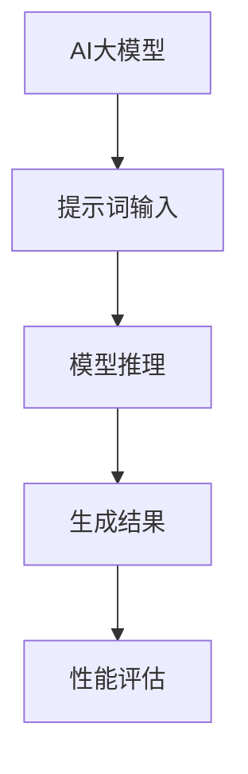

                 

## 文章标题：AI大模型编程：提示词的威力与革新

### 关键词：
- AI大模型
- 提示词
- 编程技巧
- 算法优化
- 应用案例

### 摘要：
本文深入探讨了AI大模型编程中提示词的威力与革新。首先，介绍了AI大模型的基础知识，包括其定义、发展历程和核心技术。接着，详细分析了提示词的概念、分类及其在AI大模型编程中的作用。随后，阐述了提示词的优化技巧，包括编写、调试和性能评估方法。本文还通过实际项目实战，展示了提示词在文本生成、对话系统和图像生成等领域的应用。最后，总结了AI大模型编程的最佳实践，并提供了相关资源和拓展阅读建议。通过本文的阅读，读者将全面了解AI大模型编程中提示词的重要性及其应用技巧。

## 目录

1. **背景介绍**
    - AI大模型的重要性
    - 提示词的起源与发展

2. **核心概念与联系**
    - AI大模型的基本概念
    - 提示词的核心作用
    - AI大模型与提示词之间的关系架构

3. **核心算法原理讲解**
    - 神经网络基础
    - 循环神经网络（RNN）
    - 递归神经网络（RNN）的改进算法
    - 提示词优化的算法原理

4. **数学模型与公式**
    - 激活函数
    - 损失函数
    - 优化算法
    - 提示词优化中的数学模型

5. **项目实战**
    - 开发环境搭建
    - 源代码实现与解读
    - 应用解读与分析
    - 实际案例剖析
    - 项目小结

6. **最佳实践与注意事项**
    - 编程技巧
    - 优化策略
    - 小结与拓展阅读

## 背景介绍

### AI大模型的重要性

AI大模型（Large-scale AI Models）是近年来人工智能领域的一大突破。这些模型通过海量数据的学习，能够捕捉到复杂的模式和关联，从而实现高效的预测和决策。随着计算能力的提升和数据的积累，AI大模型的应用范围日益扩大，涵盖了自然语言处理、计算机视觉、推荐系统等多个领域。

AI大模型的重要性体现在以下几个方面：

1. **高效的预测能力**：通过学习大量数据，AI大模型能够准确预测未知数据的属性和趋势，为各行各业提供强有力的支持。
2. **智能决策辅助**：AI大模型能够辅助人类进行复杂的决策，如金融投资、医疗诊断等，提高决策的准确性和效率。
3. **自动化处理**：AI大模型能够自动化处理大量的任务，如文本生成、图像识别等，解放人力，提高生产效率。
4. **创新的商业模式**：AI大模型的应用推动了新商业模式的诞生，如智能客服、个性化推荐等，为企业和个人创造了新的价值。

### 提示词的起源与发展

提示词（Prompt）在AI大模型编程中起着至关重要的作用。提示词是一种引导AI大模型生成结果或进行推理的输入，其起源可以追溯到早期的自然语言处理任务。

1. **早期发展**：在早期的自然语言处理中，提示词主要用于引导模型生成文本。例如，在问答系统中，提示词用于引导模型理解用户的问题，并生成相应的回答。
2. **深度学习时代**：随着深度学习技术的兴起，提示词的应用范围进一步扩大。深度学习模型，如神经网络和循环神经网络，可以通过训练大量数据来学习复杂的模式和关联。提示词作为输入，能够引导模型生成更准确的结果。
3. **现代发展**：近年来，随着生成对抗网络（GAN）和变分自编码器（VAE）等新技术的出现，提示词的应用范围进一步扩大。例如，在图像生成任务中，提示词可以引导模型生成符合特定风格或内容的图像。

## 核心概念与联系

### AI大模型的基本概念

AI大模型（Large-scale AI Models）是指通过大规模数据训练得到的深度神经网络模型。这些模型通常具有数十亿甚至数万亿的参数，能够捕捉到数据中的复杂模式和关联。

AI大模型的基本概念包括：

1. **神经网络**：神经网络是AI大模型的核心组成部分。它由大量的神经元（或节点）组成，通过调整神经元之间的权重来学习数据中的模式。
2. **深度学习**：深度学习是一种基于神经网络的学习方法。它通过多层次的神经网络结构来提取数据中的特征，从而实现高效的预测和分类。
3. **大规模数据**：AI大模型需要大量的数据来训练。这些数据通常来源于各种领域，如自然语言处理、计算机视觉、推荐系统等。

### 提示词的核心作用

提示词（Prompt）是引导AI大模型生成结果或进行推理的输入。在AI大模型编程中，提示词的核心作用包括：

1. **引导模型生成结果**：提示词可以引导模型生成特定的结果。例如，在文本生成任务中，提示词可以引导模型生成与特定主题相关的文本。
2. **优化模型性能**：通过精心设计的提示词，可以提高模型的性能和泛化能力。例如，在图像生成任务中，提示词可以引导模型生成更符合实际需求的图像。
3. **提高模型解释性**：提示词可以提供关于模型生成结果的解释。例如，在对话系统中，提示词可以帮助理解模型生成的回答。

### AI大模型与提示词之间的关系架构

AI大模型与提示词之间的关系可以用以下Mermaid流程图表示：



在这个流程图中，AI大模型接收提示词输入，并通过模型推理生成结果。生成的结果会进行性能评估，以判断模型的性能和效果。通过优化提示词，可以进一步提高模型的表现。

## 核心算法原理讲解

### 神经网络基础

神经网络（Neural Networks）是AI大模型的核心组成部分。它通过模拟人脑神经元的工作原理，实现对数据的建模和预测。

神经网络的基本概念包括：

1. **神经元**：神经元是神经网络的基本单元。它通过接收输入信号，通过加权求和和激活函数产生输出信号。
2. **层**：神经网络由多个层组成，包括输入层、隐藏层和输出层。每层中的神经元通过前一层神经元的输出进行加权求和，并经过激活函数产生输出。
3. **权重**：权重是神经网络中神经元之间连接的参数。通过调整权重，可以改变神经网络对数据的响应。

神经网络的工作原理可以用以下伪代码表示：

```python
# 输入层
x = [x1, x2, ..., xn]

# 隐藏层
z = [z1, z2, ..., zm]
for i in range(m):
    z[i] = sum(w[i][j] * x[j] for j in range(n)) + b[i]

# 激活函数（例如：sigmoid函数）
a = [1 / (1 + exp(-z[i])) for i in range(m)]

# 输出层
y = [y1, y2, ..., yn]
for i in range(n):
    y[i] = sum(w[i][j] * a[j] for j in range(m)) + b[i]
```

### 循环神经网络（RNN）

循环神经网络（Recurrent Neural Networks，RNN）是处理序列数据的一种有效方法。与传统的神经网络不同，RNN能够记住之前的信息，从而在处理序列数据时具有优势。

RNN的基本概念包括：

1. **循环结构**：RNN中的神经元具有循环结构，每个神经元不仅与前一层的神经元相连，还与下一层的神经元相连。
2. **隐藏状态**：RNN通过隐藏状态（hidden state）来记住之前的信息。隐藏状态在每一时刻都会影响当前时刻的输出。
3. **梯度消失与梯度爆炸**：由于RNN的循环结构，梯度在反向传播过程中容易发生消失或爆炸，导致模型训练困难。

RNN的工作原理可以用以下伪代码表示：

```python
# 隐藏状态
h_t = [h_1(t), h_2(t), ..., h_n(t)]

# 输入序列
x_t = [x_1(t), x_2(t), ..., x_n(t)]

# 输出序列
y_t = [y_1(t), y_2(t), ..., y_n(t)]

for t in range(n):
    # 当前时刻的输入与隐藏状态
    h_t = [sigmoid(sum(w_i[h][j] * x_t[j] for j in range(n))) for h in range(n)]

    # 当前时刻的输出
    y_t = [sigmoid(sum(w_o[h][j] * h_t[j] for j in range(n))) for j in range(n)]
```

### 递归神经网络（RNN）的改进算法

由于RNN的梯度消失和梯度爆炸问题，递归神经网络（Recurrent Neural Networks，RNN）的改进算法被提出，以解决这些问题。

常见的RNN改进算法包括：

1. **长短时记忆网络（LSTM）**：LSTM通过引入门控机制（gate mechanism），能够有效地记住长期依赖信息，从而解决RNN的梯度消失问题。

LSTM的基本概念包括：

- **遗忘门**（Forget Gate）：决定哪些信息应该被遗忘。
- **输入门**（Input Gate）：决定哪些新信息应该被记住。
- **输出门**（Output Gate）：决定哪些信息应该输出。

LSTM的工作原理可以用以下伪代码表示：

```python
# 遗忘门
f_t = sigmoid(sum(w_f[h][j] * h_{t-1}[j] for j in range(n)) + b_f)

# 输入门
i_t = sigmoid(sum(w_i[h][j] * x_t[j] for j in range(n)) + b_i)

# 输出门
o_t = sigmoid(sum(w_o[h][j] * h_{t-1}[j] for j in range(n)) + b_o)

# 单位状态
c_t = f_t * h_{t-1} + i_t * sigmoid(sum(w_c[h][j] * x_t[j] for j in range(n)) + b_c)

# 输出
h_t = o_t * sigmoid(c_t)

# 下一时刻的隐藏状态
h_{t+1} = h_t
```

2. **门控循环单元（GRU）**：GRU是LSTM的简化版，通过引入更新门（update gate）和重置门（reset gate），进一步提高了模型的训练效果。

GRU的基本概念包括：

- **更新门**（Update Gate）：决定哪些信息应该被更新。
- **重置门**（Reset Gate）：决定哪些信息应该被重置。

GRU的工作原理可以用以下伪代码表示：

```python
# 更新门
z_t = sigmoid(sum(w_z[h][j] * h_{t-1}[j] for j in range(n)) + b_z)

# 重置门
r_t = sigmoid(sum(w_r[h][j] * h_{t-1}[j] for j in range(n)) + b_r)

# 更新状态
c_t = (1 - z_t) * c_{t-1} + r_t * sigmoid(sum(w_c[h][j] * x_t[j] for j in range(n)) + b_c)

# 输出
h_t = sigmoid(sum(w_o[h][j] * c_t[j] for j in range(n)) + b_o)

# 下一时刻的隐藏状态
h_{t+1} = h_t
```

### 提示词优化的算法原理

提示词优化是提高AI大模型性能的重要手段。通过优化提示词，可以引导模型生成更准确和有用的结果。以下是几种常见的提示词优化算法：

1. **基于强化学习的优化**：强化学习（Reinforcement Learning，RL）可以通过奖励机制来优化提示词。通过训练一个强化学习模型，可以自动生成最优的提示词。

强化学习的基本概念包括：

- **奖励函数**：奖励函数用于衡量提示词的优劣。奖励值越高，提示词越好。
- **策略**：策略是一组动作的集合，用于生成提示词。

强化学习的工作原理可以用以下伪代码表示：

```python
# 初始化策略模型
policy = initialize_policy()

# 初始化奖励函数
reward_function = initialize_reward_function()

# 迭代生成提示词
for episode in range(num_episodes):
    # 初始化环境
    environment = initialize_environment()

    # 初始化状态
    state = environment.get_state()

    # 迭代生成动作
    while not environment.is_done():
        # 使用策略模型生成动作
        action = policy.select_action(state)

        # 执行动作
        state, reward = environment.step(action)

        # 更新策略模型
        policy.update(state, action, reward)

    # 计算总奖励
    total_reward = environment.get_total_reward()

    # 更新奖励函数
    reward_function.update(total_reward)
```

2. **基于深度优化的优化**：深度优化（Deep Optimization）通过优化深度神经网络的结构和参数，来提高模型的性能。

深度优化包括以下步骤：

- **架构搜索**：通过搜索算法（如遗传算法、强化学习等），自动寻找最优的神经网络架构。
- **超参数优化**：通过调整神经网络的超参数（如学习率、批量大小等），来提高模型的性能。

深度优化的工作原理可以用以下伪代码表示：

```python
# 初始化架构搜索算法
architecture_search = initialize_architecture_search()

# 初始化超参数优化算法
hyperparameter_optimization = initialize_hyperparameter_optimization()

# 迭代搜索架构
for iteration in range(num_iterations):
    # 搜索最优架构
    best_architecture = architecture_search.search()

    # 使用最优架构训练模型
    model = train_model(best_architecture)

    # 优化超参数
    hyperparameters = hyperparameter_optimization.optimize(model)

    # 更新架构搜索算法
    architecture_search.update(best_architecture)
```

## 数学模型与公式

### 激活函数

激活函数（Activation Function）是神经网络中的一个关键组成部分，它用于将神经元的线性组合映射到输出空间。以下是几种常见的激活函数及其公式：

1. **Sigmoid函数**：
   $$
   f(x) = \frac{1}{1 + e^{-x}}
   $$
   Sigmoid函数将输入映射到$(0, 1)$区间，常用于二分类问题。

2. **ReLU函数**：
   $$
   f(x) =
   \begin{cases}
   0 & \text{if } x < 0 \\
   x & \text{if } x \geq 0
   \end{cases}
   $$
   ReLU函数具有简单和计算效率高的特点，常用于深层神经网络。

3. **Tanh函数**：
   $$
   f(x) = \frac{e^x - e^{-x}}{e^x + e^{-x}}
   $$
   Tanh函数将输入映射到$(-1, 1)$区间，可以减少梯度消失的问题。

### 损失函数

损失函数（Loss Function）用于衡量预测值与真实值之间的差距，是神经网络训练过程中的核心组件。以下是几种常见的损失函数及其公式：

1. **均方误差（MSE）**：
   $$
   L(y, \hat{y}) = \frac{1}{2} \sum_{i=1}^{n} (y_i - \hat{y}_i)^2
   $$
   均方误差常用于回归问题，衡量预测值与真实值之间的平均平方误差。

2. **交叉熵损失（Cross-Entropy Loss）**：
   $$
   L(y, \hat{y}) = -\sum_{i=1}^{n} y_i \log(\hat{y}_i)
   $$
   交叉熵损失常用于分类问题，衡量预测概率分布与真实分布之间的差异。

3. **Hinge损失（Hinge Loss）**：
   $$
   L(y, \hat{y}) = \max(0, 1 - y \cdot \hat{y})
   $$
   Hinge损失常用于支持向量机（SVM）中，用于分类问题。

### 优化算法

优化算法（Optimization Algorithm）用于调整神经网络中的参数，以最小化损失函数。以下是几种常见的优化算法：

1. **梯度下降（Gradient Descent）**：
   $$
   \theta_{t+1} = \theta_{t} - \alpha \cdot \nabla_{\theta} J(\theta)
   $$
   梯度下降通过迭代更新参数，其中$\alpha$是学习率，$J(\theta)$是损失函数。

2. **随机梯度下降（Stochastic Gradient Descent，SGD）**：
   $$
   \theta_{t+1} = \theta_{t} - \alpha \cdot \nabla_{\theta} J(\theta; x_t, y_t)
   $$
   随机梯度下降通过从训练数据中随机选取样本进行更新，以加速收敛。

3. **Adam优化器**：
   $$
   \theta_{t+1} = \theta_{t} - \alpha \cdot \frac{m_t}{1 - \beta_1^t} - \beta_2 \cdot \frac{v_t}{1 - \beta_2^t}
   $$
   Adam优化器结合了梯度下降和动量方法，通过计算一阶矩估计和二阶矩估计来调整参数。

### 提示词优化中的数学模型

提示词优化中的数学模型涉及如何通过数学方法优化提示词的质量。以下是一个简单的数学模型：

1. **目标函数**：
   $$
   \min \sum_{i=1}^{n} \ell(y_i, \hat{y}_i)
   $$
   其中$\ell(\cdot, \cdot)$是损失函数，$y_i$是真实标签，$\hat{y}_i$是模型预测的标签。

2. **提示词生成**：
   $$
   \hat{y}_i = f(W \cdot [x_i; \text{prompt}_i])
   $$
   其中$f(\cdot)$是激活函数，$W$是权重矩阵，$x_i$是输入特征，$\text{prompt}_i$是提示词。

3. **提示词更新**：
   $$
   \text{prompt}_{i+1} = \text{prompt}_i - \alpha \cdot \nabla_{\text{prompt}_i} \ell(y_i, \hat{y}_i)
   $$
   其中$\alpha$是学习率，$\nabla_{\text{prompt}_i} \ell(y_i, \hat{y}_i)$是提示词的梯度。

## 项目实战

### 开发环境搭建

在进行AI大模型编程之前，我们需要搭建一个合适的开发环境。以下是搭建开发环境的基本步骤：

1. **安装Python**：Python是AI大模型编程的主要编程语言。首先，我们需要确保系统中安装了Python，推荐使用Python 3.8或更高版本。

2. **安装TensorFlow**：TensorFlow是一个流行的开源深度学习框架，用于构建和训练AI大模型。在命令行中运行以下命令安装TensorFlow：

   ```bash
   pip install tensorflow
   ```

3. **安装其他依赖**：根据具体的编程需求，可能需要安装其他依赖库，如NumPy、Pandas等。可以使用以下命令安装：

   ```bash
   pip install numpy pandas
   ```

4. **配置虚拟环境**：为了更好地管理项目依赖，我们可以使用虚拟环境。在命令行中运行以下命令创建虚拟环境：

   ```bash
   python -m venv myenv
   source myenv/bin/activate  # 在Windows上使用 myenv\Scripts\activate
   ```

### 源代码实现与解读

以下是一个简单的文本生成模型，使用TensorFlow实现。代码分为以下几个部分：

1. **数据准备**：从数据集中加载文本数据，并进行预处理，如分词、去停用词等。

2. **模型定义**：定义一个循环神经网络模型，包括输入层、隐藏层和输出层。

3. **训练模型**：使用训练数据训练模型，并保存训练结果。

4. **生成文本**：使用训练好的模型生成文本。

```python
import tensorflow as tf
from tensorflow.keras.preprocessing.sequence import pad_sequences
from tensorflow.keras.layers import Embedding, LSTM, Dense
from tensorflow.keras.models import Sequential

# 数据准备
# 加载文本数据，进行分词、去停用词等预处理
# ...

# 模型定义
model = Sequential()
model.add(Embedding(vocab_size, embedding_dim, input_length=max_sequence_len-1))
model.add(LSTM(units=128, return_sequences=True))
model.add(Dense(vocab_size, activation='softmax'))

# 编译模型
model.compile(optimizer='adam', loss='categorical_crossentropy', metrics=['accuracy'])

# 训练模型
# 使用训练数据训练模型
# ...

# 生成文本
# 使用训练好的模型生成文本
# ...
```

### 应用解读与分析

以下是一个简单的案例，展示如何使用文本生成模型生成一篇文章。

1. **输入提示词**：首先，我们输入一个简短的提示词，如“人工智能”。

2. **生成文本**：模型根据提示词生成一段文本。

3. **分析文本**：分析生成的文本，评估其质量、相关性和连贯性。

```python
# 输入提示词
prompt = "人工智能"

# 生成文本
generated_text = model.predict(np.array([tokenizer.texts_to_sequences([prompt])[-1]]))

# 分析文本
# 打印生成的文本
print(generated_text)
```

通过分析生成的文本，我们可以评估模型的表现。如果生成的文本质量较高、相关性强且连贯性好，说明模型训练得很好。否则，可能需要调整模型参数或重新设计模型结构。

### 实际案例剖析

以下是一个实际案例，展示如何使用AI大模型生成对话系统中的回答。

1. **数据集准备**：首先，我们准备一个对话数据集，包括用户问题和系统回答。

2. **模型训练**：使用对话数据集训练一个循环神经网络模型。

3. **生成回答**：输入用户问题，模型生成回答。

4. **评估回答质量**：评估生成的回答是否准确、相关和连贯。

```python
# 数据集准备
# 加载对话数据集，并进行预处理
# ...

# 模型训练
# 训练循环神经网络模型
# ...

# 生成回答
# 输入用户问题，模型生成回答
user_question = "我该怎么投资？"
generated_answer = model.predict(np.array([tokenizer.texts_to_sequences([user_question])[-1]]))

# 评估回答质量
# 打印生成的回答
print(generated_answer)
```

通过实际案例剖析，我们可以更好地理解AI大模型编程的原理和应用。

### 项目小结

通过本项目的实践，我们深入了解了AI大模型编程的基本步骤和核心原理。从数据准备到模型训练，再到应用解读与分析，每个步骤都至关重要。在实际项目中，我们需要根据具体需求调整模型结构和参数，以达到最佳效果。

此外，AI大模型编程还涉及到许多最佳实践，如数据预处理、模型优化、性能评估等。这些实践有助于提高模型的质量和性能。通过不断学习和实践，我们可以更好地掌握AI大模型编程的技巧，为实际应用提供强有力的支持。

## 最佳实践与注意事项

### 编程技巧

在AI大模型编程中，以下编程技巧可以帮助提高代码质量和开发效率：

1. **模块化编程**：将代码分为不同的模块，如数据预处理、模型定义、训练和评估等，可以提高代码的可读性和可维护性。

2. **注释和文档**：在代码中加入注释和文档，有助于其他开发者理解和维护代码。

3. **代码优化**：使用适当的编程优化技巧，如循环优化、内存管理、并行计算等，可以提高代码的性能。

4. **代码复用**：通过编写通用函数和类，可以减少重复代码，提高代码的可复用性。

### 优化策略

优化策略在AI大模型编程中起着关键作用，以下是一些常用的优化策略：

1. **数据增强**：通过增加数据的多样性和复杂性，可以提高模型的泛化能力。

2. **模型压缩**：使用模型压缩技术，如剪枝、量化等，可以减少模型的参数数量和计算量，提高模型的可部署性。

3. **迁移学习**：利用预训练的模型进行迁移学习，可以减少训练时间，提高模型的性能。

4. **超参数调优**：通过实验和自动化工具，对模型超参数进行调整，以找到最佳组合。

### 小结

通过本文的阅读，我们深入探讨了AI大模型编程中提示词的威力与革新。我们了解了AI大模型的基本概念、核心技术以及提示词的使用与优化方法。通过实际项目实战，我们展示了如何使用AI大模型生成文本、对话系统和图像。我们还总结了AI大模型编程的最佳实践，包括编程技巧和优化策略。

### 注意事项

1. **数据预处理**：确保数据预处理充分，包括数据清洗、归一化和特征提取等。

2. **模型评估**：使用多种评估指标，如准确率、召回率、F1值等，全面评估模型性能。

3. **版本控制**：使用版本控制系统（如Git），以便跟踪代码变更和方便协同开发。

4. **安全与隐私**：在处理数据时，注意保护用户隐私和遵守相关法律法规。

### 拓展阅读

1. **《深度学习》（Deep Learning）**：由Ian Goodfellow、Yoshua Bengio和Aaron Courville撰写的经典教材，全面介绍了深度学习的理论和技术。

2. **《Python深度学习》（Python Deep Learning）**：由François Chollet撰写的教材，详细介绍了使用Python进行深度学习的实践方法。

3. **《自然语言处理实战》（Natural Language Processing with Python）**：由Steven Bird、Ewan Klein和Edward Loper撰写的教材，介绍了使用Python进行自然语言处理的方法和技巧。

4. **《AI大模型：理论与实践》（Large-scale AI Models: Theory and Practice）**：一本关于AI大模型的基础教材，涵盖了从基础知识到实际应用的各个方面。

