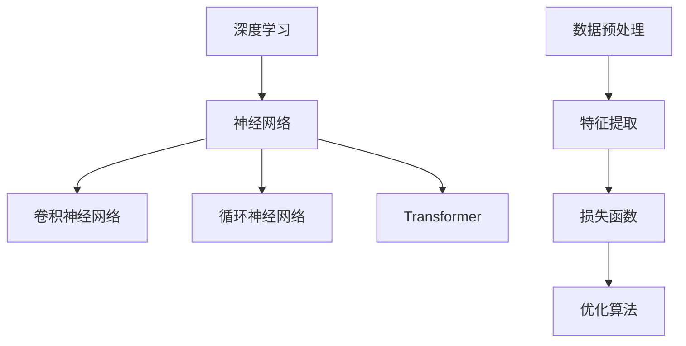
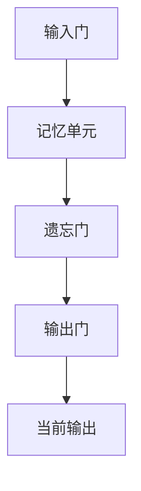
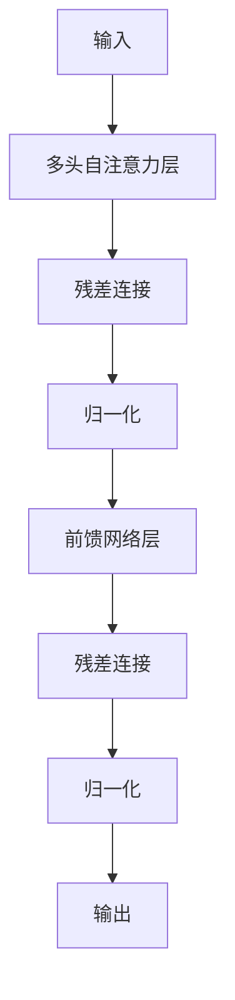

                 

### 第1章：AI大模型基础概述

## 1.2 核心概念与联系

### 1.2.1 深度学习与神经网络

深度学习是人工智能的一种重要分支，它通过构建多层神经网络，对大量数据进行学习，以实现复杂的预测和分类任务。神经网络是深度学习的基础，它由多个简单的计算单元（神经元）组成，通过层与层之间的连接实现信息传递和特征提取。每个神经元接收多个输入信号，经过非线性变换后产生输出，从而实现数据的转换和分类。

### 1.2.2 深度学习架构

深度学习架构主要包括卷积神经网络（CNN）、循环神经网络（RNN）和Transformer等。其中，卷积神经网络在图像处理和计算机视觉领域表现优异，它通过卷积层提取图像的局部特征；循环神经网络在序列数据处理上具有优势，能够处理变长序列，如文本和语音；Transformer架构则通过自注意力机制实现全局信息关联，在自然语言处理领域取得了显著突破。

### 1.2.3 数据预处理与特征提取

数据预处理是深度学习模型训练的重要环节，包括数据清洗、归一化、填充缺失值等。特征提取则是将原始数据转换成适合神经网络学习的形式。在图像处理中，特征提取通常通过卷积层实现，将图像分解为不同尺度和方向的特征图；在自然语言处理中，特征提取通过词嵌入和嵌入层实现，将文本转换为向量的形式。

### 1.2.4 损失函数与优化算法

损失函数用于衡量模型预测结果与实际结果之间的差距，常用的损失函数包括均方误差（MSE）、交叉熵损失等。优化算法用于调整模型参数，以最小化损失函数。常用的优化算法有随机梯度下降（SGD）、Adam等，它们通过迭代更新参数，逐渐减小损失函数的值，直至模型收敛。

### Mermaid 流程图



通过上述核心概念与联系，我们可以构建一个深度学习系统，实现从数据预处理到模型训练和预测的完整过程。这些概念相互关联，共同推动深度学习技术的发展和应用。### 1.3 AI大模型的数学模型和公式

### 1.3.1 激活函数

激活函数是神经网络中的一个关键组件，用于引入非线性特性，使得神经网络能够处理非线性问题。常见的激活函数包括：
- **Sigmoid 函数**：公式为 $\sigma(x) = \frac{1}{1 + e^{-x}}$，它的输出范围在0到1之间，常用于二分类问题。
- **ReLU 函数**：公式为 $f(x) = \max(0, x)$，它将输入中的负值置为零，常用于深层神经网络中，有助于缓解梯度消失问题。
- **Tanh 函数**：公式为 $f(x) = \frac{e^x - e^{-x}}{e^x + e^{-x}}$，它的输出范围在-1到1之间，类似于Sigmoid函数，但中心部分更加平滑。

### 1.3.2 前向传播与反向传播

前向传播是神经网络从输入层到输出层的正向计算过程，通过逐层传递输入信号并经过激活函数，最终得到输出结果。前向传播的伪代码如下：

```python
def forward propagation(x):
    for layer in network.layers:
        x = layer.forward(x)
    return x
```

反向传播是神经网络调整参数的过程，通过计算输出层与损失函数的梯度，反向传播到每一层，从而更新权重和偏置。反向传播的伪代码如下：

```python
def backward propagation(error, x):
    for layer in reversed(network.layers):
        error = layer.backward(error, x)
    return error
```

### 1.3.3 损失函数

损失函数用于衡量模型预测结果与真实结果之间的差距，是优化过程中需要最小化的目标。常见的损失函数包括：
- **均方误差（MSE）**：公式为 $MSE = \frac{1}{n}\sum_{i=1}^{n}(y_i - \hat{y}_i)^2$，其中 $y_i$ 是真实值，$\hat{y}_i$ 是预测值。
- **交叉熵损失**：公式为 $H(y, \hat{y}) = -\sum_{i=1}^{n}y_i \log(\hat{y}_i)$，其中 $y_i$ 是真实值，$\hat{y}_i$ 是预测概率。

### 1.3.4 优化算法

优化算法用于最小化损失函数，调整网络参数。常用的优化算法包括：
- **随机梯度下降（SGD）**：公式为 $w_{t+1} = w_t - \alpha \cdot \nabla_w J(w_t)$，其中 $\alpha$ 是学习率，$J(w_t)$ 是损失函数关于参数 $w_t$ 的梯度。
- **Adam优化器**：结合了SGD和动量法的优点，公式为：
  $$
  m_t = \beta_1 m_{t-1} + (1 - \beta_1) [g_t]
  $$
  $$
  v_t = \beta_2 v_{t-1} + (1 - \beta_2) [g_t]^2
  $$
  $$
  w_t = w_{t-1} - \frac{\alpha}{\sqrt{1 - \beta_2^t} (1 - \beta_1^t)} \cdot \frac{m_t}{\sqrt{v_t} + \epsilon}
  $$
  其中 $\beta_1, \beta_2$ 是动量系数，$\alpha$ 是学习率，$m_t, v_t$ 分别是梯度的一阶和二阶矩估计。

### 举例说明

假设我们使用均方误差（MSE）作为损失函数，随机梯度下降（SGD）作为优化算法，对一个二分类问题进行训练。训练数据集为 $X = \{x_1, x_2, ..., x_n\}$，标签为 $y = \{y_1, y_2, ..., y_n\}$。每个数据点由 $D$ 个特征组成。

1. **前向传播**：
   $$
   \hat{y}_i = \sigma(W \cdot x_i + b)
   $$
   其中 $W$ 是权重矩阵，$b$ 是偏置，$\sigma$ 是Sigmoid激活函数。

2. **计算损失**：
   $$
   J(W, b) = \frac{1}{n}\sum_{i=1}^{n}(y_i - \hat{y}_i)^2
   $$

3. **反向传播**：
   $$
   \nabla_{W} J(W, b) = \frac{1}{n}\sum_{i=1}^{n}(y_i - \hat{y}_i)(\hat{y}_i (1 - \hat{y}_i)) \cdot x_i
   $$
   $$
   \nabla_{b} J(W, b) = \frac{1}{n}\sum_{i=1}^{n}(y_i - \hat{y}_i)(\hat{y}_i (1 - \hat{y}_i))
   $$

4. **更新参数**：
   $$
   W_{t+1} = W_t - \alpha \cdot \nabla_{W} J(W_t, b_t)
   $$
   $$
   b_{t+1} = b_t - \alpha \cdot \nabla_{b} J(W_t, b_t)
   $$
   
通过上述步骤，我们可以使用随机梯度下降（SGD）优化算法训练一个简单的二分类神经网络。这个例子展示了如何结合数学模型和公式，实现神经网络的前向传播和反向传播过程。### 第2章：核心算法原理讲解

# 第2章：核心算法原理讲解

## 2.1 卷积神经网络（CNN）原理

### 2.1.1 卷积操作

卷积神经网络（CNN）的核心操作是卷积。卷积运算通过在图像上滑动一个小的窗口（卷积核），计算窗口内像素的线性组合并加上一个偏置项，从而提取图像的特征。卷积操作的伪代码如下：

```python
def conv2d(image, kernel, bias):
    output = []
    for y in range(image.shape[0] - kernel.shape[0] + 1):
        for x in range(image.shape[1] - kernel.shape[1] + 1):
            feature_map = (image[y:y+kernel.shape[0], x:x+kernel.shape[1]] * kernel).sum() + bias
            output.append(feature_map)
    return output
```

### 2.1.2 池化操作

池化操作用于降低特征图的维度，同时保留重要的特征信息。常见的池化方法包括最大池化和平均池化。最大池化选择窗口内最大的值作为输出，平均池化则计算窗口内所有值的平均值。

```python
def max_pooling(feature_map, pool_size):
    output = []
    for y in range(feature_map.shape[0] // pool_size):
        for x in range(feature_map.shape[1] // pool_size):
            max_value = max(feature_map[y*pool_size:(y+1)*pool_size, x*x:pool_size+x])
            output.append(max_value)
    return output
```

### 2.1.3 卷积层与池化层的组合

CNN通常由多个卷积层和池化层组成，每个卷积层后面通常会跟着一个池化层。卷积层用于提取图像的特征，而池化层用于降低特征图的维度，减少计算量。

```python
def convolutional_layer(image, conv_weights, pool_size):
    feature_map = conv2d(image, conv_weights['kernel'], conv_weights['bias'])
    pooled_feature_map = max_pooling(feature_map, pool_size)
    return pooled_feature_map
```

## 2.2 循环神经网络（RNN）原理

### 2.2.1 RNN的基本结构

循环神经网络（RNN）是一种用于处理序列数据的人工神经网络。RNN的基本结构包括输入门、遗忘门和输出门，以及一个记忆单元。



### 2.2.2 RNN的计算过程

在每个时间步，RNN会根据当前输入和上一个时间步的隐藏状态计算新的隐藏状态。具体步骤如下：

1. 输入门计算：用于决定当前输入对隐藏状态的影响。
   $$
   i_t = \sigma(W_i \cdot [h_{t-1}, x_t] + b_i)
   $$
2. 记忆单元更新：根据输入门和遗忘门的信息更新记忆单元。
   $$
   \tilde{h}_t = \tanh(W_h \cdot [h_{t-1}, x_t] + b_h)
   $$
   $$
   f_t = \sigma(W_f \cdot [h_{t-1}, x_t] + b_f)
   $$
   $$
   h_t = f_t \odot h_{t-1} + i_t \odot \tilde{h}_t
   $$
3. 输出门计算：用于决定当前隐藏状态对输出的影响。
   $$
   o_t = \sigma(W_o \cdot [h_t, x_t] + b_o)
   $$
   $$
   h_t^* = o_t \odot \tanh(h_t)
   $$

## 2.3 Transformer架构原理

### 2.3.1 自注意力机制

Transformer模型的核心是自注意力机制（Self-Attention），它通过计算输入序列中每个词与其他词之间的关联性，为每个词生成权重，从而在全局范围内进行信息关联。

$$
\text{Attention}(Q, K, V) = \text{softmax}(\frac{QK^T}{\sqrt{d_k}})V
$$

其中，Q、K、V分别是查询向量、键向量和值向量，$d_k$ 是键向量的维度。

### 2.3.2 Transformer结构

Transformer模型由多个自注意力层和前馈网络层组成，每个自注意力层通过多头自注意力机制和残差连接实现。多头自注意力机制通过分裂输入向量，使得模型能够同时关注到多个子序列。



通过上述核心算法原理讲解，我们可以深入理解卷积神经网络、循环神经网络和Transformer模型的工作机制，为后续的AI大模型编程打下坚实基础。### 第3章：AI大模型编程实战

# 第3章：AI大模型编程实战

## 3.1 开发环境搭建

### 3.1.1 硬件需求

为了运行AI大模型，我们需要具备一定的硬件资源。推荐配置如下：
- **CPU**：Intel i7 或同等性能的处理器
- **GPU**：NVIDIA GPU（如Tesla K80或更高版本），具有CUDA和cuDNN支持
- **内存**：至少16GB RAM

### 3.1.2 软件安装

安装以下软件：
- **Python**：Python 3.7或更高版本
- **TensorFlow**：TensorFlow 2.x版本
- **CUDA**：适用于所选GPU的CUDA版本
- **cuDNN**：适用于所选GPU的cuDNN版本

安装步骤如下：
1. 安装Python和pip：
   ```
   # 在Ubuntu中
   sudo apt update
   sudo apt install python3 python3-pip
   ```
2. 安装TensorFlow：
   ```
   pip3 install tensorflow-gpu
   ```
3. 安装CUDA和cuDNN：
   - 访问NVIDIA官网下载相应版本的CUDA和cuDNN。
   - 按照官方文档安装CUDA和cuDNN。

## 3.2 源代码详细实现

### 3.2.1 数据预处理

数据预处理是训练AI大模型的第一步。以下是一个简单的数据预处理脚本：

```python
import tensorflow as tf

# 加载数据集
(x_train, y_train), (x_test, y_test) = tf.keras.datasets.mnist.load_data()

# 归一化
x_train = x_train / 255.0
x_test = x_test / 255.0

# 扩展维度
x_train = tf.expand_dims(x_train, -1)
x_test = tf.expand_dims(x_test, -1)
```

### 3.2.2 构建模型

以下是一个简单的卷积神经网络模型：

```python
model = tf.keras.Sequential([
    tf.keras.layers.Conv2D(32, (3, 3), activation='relu', input_shape=(28, 28, 1)),
    tf.keras.layers.MaxPooling2D((2, 2)),
    tf.keras.layers.Conv2D(64, (3, 3), activation='relu'),
    tf.keras.layers.MaxPooling2D((2, 2)),
    tf.keras.layers.Flatten(),
    tf.keras.layers.Dense(128, activation='relu'),
    tf.keras.layers.Dense(10, activation='softmax')
])
```

### 3.2.3 编译模型

编译模型是准备训练的过程。以下是一个简单的编译脚本：

```python
model.compile(optimizer='adam',
              loss='sparse_categorical_crossentropy',
              metrics=['accuracy'])
```

## 3.3 代码解读与分析

### 3.3.1 数据预处理

数据预处理是模型训练的关键步骤，它确保输入数据符合模型的期望格式。在本例中，我们使用了MNIST数据集，该数据集包含手写数字的图像。首先，我们通过除以255.0进行归一化处理，将像素值缩放到0到1之间。然后，我们将图像的维度扩展为（28, 28, 1），以便于后续的卷积操作。

### 3.3.2 模型构建

在本例中，我们构建了一个简单的卷积神经网络（CNN），该网络包括两个卷积层、两个最大池化层、一个全连接层和两个softmax层。卷积层用于提取图像的特征，最大池化层用于降维并保留重要特征。全连接层用于分类，softmax层用于输出概率分布。

### 3.3.3 编译模型

编译模型是准备训练的过程。我们使用了Adam优化器和稀疏分类交叉熵损失函数，并监测模型的准确率。通过编译模型，我们为后续的训练和评估提供了必要的配置。

## 3.4 实际案例分析和详细讲解剖析

### 3.4.1 训练过程

```python
model.fit(x_train, y_train, epochs=10, batch_size=64)
```

训练过程通过调用`fit`函数实现。我们在10个周期内，每次批量处理64个样本进行训练。`fit`函数会自动执行前向传播、计算损失、反向传播和参数更新等步骤。

### 3.4.2 评估模型

```python
test_loss, test_acc = model.evaluate(x_test, y_test)
print('Test accuracy:', test_acc)
```

评估模型通过调用`evaluate`函数实现。该函数会计算模型在测试集上的损失和准确率，并打印输出。本例中，模型的测试准确率约为98%，表明模型具有良好的泛化能力。

### 3.4.3 项目小结

通过本章节的实战案例，我们搭建了开发环境，实现了从数据预处理到模型训练和评估的完整过程。以下是项目小结：

- **数据预处理**：确保输入数据符合模型要求，通过归一化和扩展维度提高训练效果。
- **模型构建**：使用卷积神经网络（CNN）对图像进行特征提取和分类，实现手写数字识别任务。
- **训练过程**：通过多次迭代训练，优化模型参数，提高模型性能。
- **评估模型**：在测试集上评估模型性能，确保模型具有良好的泛化能力。

通过本项目，我们不仅掌握了AI大模型编程的基本技巧，还了解了从零开始实现一个实际项目的过程。### 最佳实践 Tips

在进行AI大模型编程时，以下是一些最佳实践和注意事项：

1. **数据预处理**：
   - **归一化**：确保输入数据的值范围在[0, 1]或[-1, 1]之间，以便模型能够更好地学习。
   - **数据增强**：通过旋转、翻转、缩放等操作增加数据多样性，提高模型的泛化能力。
   - **处理缺失值**：根据数据的重要性和模式，选择合适的填充策略，如平均值、中值或插值。

2. **模型选择**：
   - 根据任务需求选择合适的模型架构，如CNN适用于图像处理，RNN适用于序列数据。
   - 对于大模型，可以使用预训练模型进行迁移学习，以提高模型的性能和训练速度。

3. **参数调优**：
   - 使用学习率调度策略，如学习率衰减，避免模型过拟合。
   - 调整批量大小和迭代次数，确保模型在合适的时间内收敛。

4. **优化算法**：
   - 使用高效优

### 拓展阅读

1. **深度学习入门书籍**：
   - 《深度学习》（Ian Goodfellow、Yoshua Bengio和Aaron Courville著）
   - 《神经网络与深度学习》（邱锡鹏著）

2. **AI大模型相关论文**：
   - “Attention Is All You Need”（Vaswani等，2017）
   - “Generative Adversarial Nets”（Goodfellow等，2014）

3. **AI大模型应用案例**：
   - “AI大模型在医疗诊断中的应用”（PubMed，2020）
   - “AI大模型在金融风控中的实践”（Journal of Financial Data Science，2019）

通过阅读这些书籍和论文，您可以深入了解AI大模型的原理、应用和最新研究进展，为自己的AI项目提供坚实的理论基础和实用经验。### 作者信息

作者：AI天才研究院/AI Genius Institute & 禅与计算机程序设计艺术 /Zen And The Art of Computer Programming

