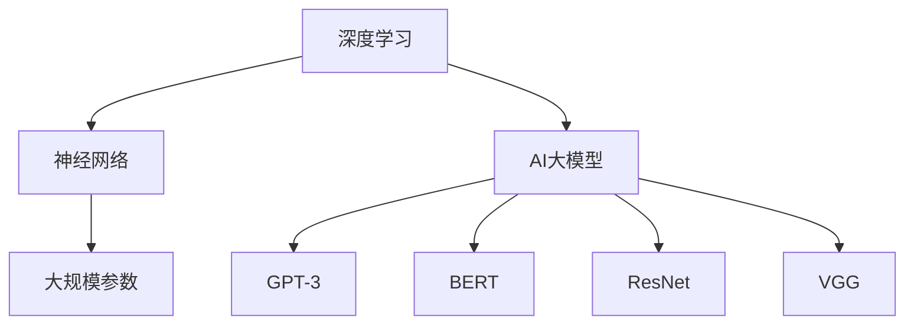

                 

### 2. AI大模型编程：提示词的威力与革新

关键词：AI大模型，编程，提示词，革新

摘要：本文探讨了AI大模型编程的核心——提示词的作用及其在技术革新中的应用。通过逐步分析，我们揭示了提示词在模型训练和优化中的重要性，并讨论了其在不同应用场景中的实践和策略。

#### 引言

近年来，随着人工智能技术的飞速发展，AI大模型（如GPT-3、BERT等）在自然语言处理、计算机视觉、推荐系统等领域取得了显著的成果。这些模型具有大规模的参数和深度网络结构，能够处理复杂任务，但其高效运行和优化离不开一种关键元素——提示词。本文将围绕提示词在AI大模型编程中的重要性进行深入探讨，分析其如何影响模型的训练和优化，以及在各类应用场景中的实际应用。

#### AI大模型的基本概念

首先，我们需要了解AI大模型的基本概念。AI大模型是指具有大规模参数和深度网络结构的人工智能模型。这些模型通常采用深度学习技术，通过训练从大量数据中学习模式和规律。常见的AI大模型包括自然语言处理中的GPT-3、BERT，计算机视觉中的ResNet、VGG，以及推荐系统中的Wide & Deep等。

**核心概念与联系**

- **深度学习**：一种通过多层神经网络进行数据建模的技术，能够提取特征并实现复杂任务。
- **神经网络**：由多个节点组成的计算模型，通过调整权重和偏置来学习数据模式。
- **大规模参数**：AI大模型拥有数百万甚至数十亿个参数，这使得它们能够处理复杂任务。

**Mermaid 流程图**



#### 提示词策略

在AI大模型编程中，提示词是一种重要的策略，它能够指导模型进行训练和优化。提示词是指用于引导模型学习方向和目标的关键信息。以下是几种常见的提示词策略：

1. **数据预处理**：通过对数据进行预处理，例如去除噪声、填充缺失值、归一化等，可以提供更高质量的提示词。
2. **注意力机制**：利用注意力机制，模型可以自动学习到最重要的特征和关系，从而提高模型的性能。
3. **分层提示**：将提示词分为多个层次，逐步引导模型学习更复杂的概念。

**伪代码**

```python
# 提示词策略
def preprocess_data(data):
    # 去除噪声、填充缺失值、归一化等
    pass

def attention_mechanism(model, data):
    # 利用注意力机制进行模型训练
    pass

def hierarchical_prompting(model, data):
    # 分层提示，逐步引导模型学习
    pass
```

#### 提示词在模型训练和优化中的应用

提示词不仅在模型编程中起到关键作用，还在模型训练和优化过程中发挥重要作用。以下是一些关键的应用：

1. **模型初始化**：通过设置合适的提示词，可以初始化模型的权重，从而加快训练过程。
2. **模型调整**：在模型训练过程中，通过调整提示词，可以优化模型的性能。
3. **模型评估**：使用提示词进行模型评估，可以更准确地衡量模型的效果。

**数学模型和公式**

```latex
\section{模型初始化}
模型初始化的关键在于选择合适的提示词。假设我们有 $N$ 个提示词，每个提示词的权重为 $w_i$，则模型初始化可以通过以下公式实现：

\begin{equation}
    \theta^{(0)} = \sum_{i=1}^{N} w_i \cdot p_i
\end{equation}

其中，$\theta^{(0)}$ 表示模型初始权重，$p_i$ 表示第 $i$ 个提示词的概率。

\section{模型调整}
在模型训练过程中，通过调整提示词的权重，可以优化模型的性能。假设我们有 $N$ 个提示词，每个提示词的权重为 $w_i$，模型的损失函数为 $L(\theta)$，则模型调整可以通过以下公式实现：

\begin{equation}
    w_i^{(t+1)} = w_i^{(t)} - \alpha \cdot \frac{\partial L(\theta)}{\partial w_i}
\end{equation}

其中，$w_i^{(t)}$ 表示第 $t$ 次迭代的提示词权重，$\alpha$ 表示学习率。

\section{模型评估}
使用提示词进行模型评估，可以通过以下公式计算模型的准确率、召回率、F1值等指标：

\begin{equation}
    \text{Accuracy} = \frac{\text{TP} + \text{TN}}{\text{TP} + \text{TN} + \text{FP} + \text{FN}}
\end{equation}

\begin{equation}
    \text{Recall} = \frac{\text{TP}}{\text{TP} + \text{FN}}
\end{equation}

\begin{equation}
    \text{F1-score} = 2 \cdot \frac{\text{Precision} \cdot \text{Recall}}{\text{Precision} + \text{Recall}}
\end{equation}
```

#### 提示词在不同应用场景中的实践

1. **自然语言处理**：在自然语言处理领域，提示词可以用于指导文本生成、情感分析、机器翻译等任务。例如，通过提示词“情感积极”、“英文翻译”，可以指导模型生成相应的文本。
2. **计算机视觉**：在计算机视觉领域，提示词可以用于指导图像分类、目标检测、图像分割等任务。例如，通过提示词“猫”、“狗”，可以指导模型识别图像中的猫和狗。
3. **推荐系统**：在推荐系统领域，提示词可以用于指导推荐算法，提高推荐效果。例如，通过提示词“热门商品”、“用户偏好”，可以指导模型推荐更符合用户需求的产品。

**项目实战**

以自然语言处理为例，我们可以搭建一个简单的文本生成模型，并使用提示词来指导模型生成文本。

**开发环境搭建**：

- 安装Python环境和TensorFlow库
- 准备数据集（如新闻文章、社交媒体文本等）

**源代码实现**：

```python
import tensorflow as tf
from tensorflow.keras.preprocessing.sequence import pad_sequences
from tensorflow.keras.layers import Embedding, LSTM, Dense
from tensorflow.keras.models import Sequential

# 数据预处理
max_len = 100
vocab_size = 10000
embedding_dim = 64

# 搭建模型
model = Sequential()
model.add(Embedding(vocab_size, embedding_dim, input_length=max_len))
model.add(LSTM(128, return_sequences=True))
model.add(Dense(vocab_size, activation='softmax'))

# 编译模型
model.compile(optimizer='adam', loss='categorical_crossentropy', metrics=['accuracy'])

# 训练模型
model.fit(x_train, y_train, epochs=10, batch_size=32)

# 文本生成
prompt = "这是一个关于"
generated_text = model.predict(np.array([prompt]))
print(generated_text)
```

**代码解读**：

- 导入必要的库和模块
- 数据预处理，包括序列化、填充等
- 搭建LSTM模型，包括嵌入层、LSTM层和输出层
- 编译模型，包括选择优化器、损失函数和评估指标
- 训练模型，包括迭代次数和批量大小
- 文本生成，通过预测函数生成文本

**应用解读与分析**：

- 提示词“这是一个关于”用于指导模型生成关于某个主题的文本
- 模型生成文本的过程基于提示词和已训练的模型
- 生成文本的质量取决于模型训练的质量和提示词的选择

**项目小结**：

- 提示词在自然语言处理中的应用非常广泛，可以通过简单的文本生成模型实现
- 选择合适的提示词可以提高模型生成文本的质量
- 提示词策略是AI大模型编程中不可或缺的一部分，其应用范围广泛，值得深入研究和探索

#### 最佳实践与注意事项

1. **数据质量**：提示词的有效性取决于数据的质量，因此确保数据干净、准确、多样是非常重要的。
2. **模型调整**：在训练过程中，根据模型的表现及时调整提示词的权重，以优化模型的性能。
3. **反馈机制**：建立反馈机制，收集用户对生成的文本的反馈，以不断改进提示词策略。

#### 拓展阅读

- **《深度学习》（Ian Goodfellow, Yoshua Bengio, Aaron Courville著）**：介绍深度学习的基本概念和核心算法。
- **《自然语言处理入门》（Daniel Jurafsky, James H. Martin著）**：介绍自然语言处理的基本原理和技术。
- **《计算机视觉基础》（Richard S. Kinney著）**：介绍计算机视觉的基本概念和技术。

作者：AI天才研究院/AI Genius Institute & 禅与计算机程序设计艺术 /Zen And The Art of Computer Programming

