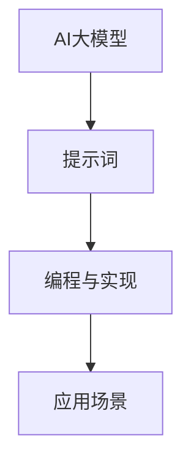

                 

### AI大模型编程：提示词的无限可能性

#### 关键词：AI大模型、提示词、编程、深度学习、自然语言处理、图像识别

> 摘要：本文旨在探讨AI大模型编程中提示词的无限可能性。我们将从AI大模型的基本概念出发，深入讲解提示词的作用与设计，随后介绍核心算法原理，并通过编程实践和具体案例剖析，展示提示词在实际应用中的重要性。

---

#### 引言

人工智能（AI）正迅速成为现代技术的核心驱动力，其中AI大模型（Large-scale AI Models）的兴起尤为引人注目。AI大模型，通常是指具有数亿甚至数万亿参数的深度学习模型，能够在各种复杂的任务上实现卓越的性能。这些模型不仅广泛应用于自然语言处理（NLP）、图像识别、推荐系统等领域，还在解决复杂数据分析和预测任务中展现出强大的能力。

在AI大模型中，提示词（Prompt）起到了至关重要的作用。提示词是一段引导模型进行特定任务输入的文字或数据。通过精心设计的提示词，我们可以引导AI大模型完成各种复杂的任务，实现从简单文本生成到复杂图像识别的多种功能。

本文将首先介绍AI大模型的基本概念和提示词的作用。随后，我们将深入探讨AI大模型的核心算法原理，并通过伪代码和数学公式来详细讲解这些算法。此外，本文还将通过具体的编程实践和案例剖析，展示提示词在AI大模型编程中的实际应用。最后，我们将总结全文内容，并对未来的发展趋势进行展望。

#### 确定核心概念与联系

在探讨AI大模型编程之前，我们需要明确一些核心概念，并分析它们之间的联系。

1. **AI大模型**：AI大模型是指具有数亿甚至数万亿参数的深度学习模型，它们通过大量的数据和强大的计算能力来学习复杂的任务。这些模型通常由神经网络构成，能够处理各种类型的数据，如图像、文本和声音。

2. **提示词（Prompt）**：提示词是一段用于引导AI大模型进行特定任务的输入数据。它可以是文本、图像或者其他形式的数据。通过设计合适的提示词，我们可以让AI大模型更好地理解任务要求，从而提高模型的性能。

3. **编程与实现**：编程是实现AI大模型的关键步骤。我们需要使用编程语言和深度学习框架（如TensorFlow、PyTorch等）来构建、训练和部署AI大模型。在这个过程中，提示词的设计和选择尤为重要，因为它们直接影响模型的性能。

4. **应用场景**：AI大模型在各个领域都有着广泛的应用，如自然语言处理、图像识别、推荐系统等。在不同的应用场景中，提示词的设计和选择也有不同的要求，需要根据具体任务进行调整。

为了更清晰地展示这些概念之间的关系，我们可以使用Mermaid流程图来描述：



#### 设计核心算法原理讲解

AI大模型的核心算法原理主要包括神经网络、优化算法和注意力机制等。以下是对这些算法的详细讲解：

1. **神经网络基础**

神经网络是AI大模型的核心组成部分。它由多层神经元组成，每层神经元接收前一层神经元的输出，并通过加权求和和激活函数进行处理，最终输出预测结果。

- **多层感知器（MLP）**：多层感知器是最简单的神经网络结构，它由输入层、隐藏层和输出层组成。输入层接收外部输入，隐藏层通过神经网络处理输入，输出层生成最终的预测结果。

  ```python
  # 伪代码：多层感知器结构
  class MLP:
      def __init__(self, input_size, hidden_size, output_size):
          self.input_size = input_size
          self.hidden_size = hidden_size
          self.output_size = output_size
          # 初始化权重和偏置
          self.weights = ...
          self.biases = ...

      def forward(self, x):
          # 前向传播计算
          return ...
  ```

- **激活函数**：激活函数是神经网络中用于引入非线性性的函数。常见的激活函数包括Sigmoid、ReLU和Tanh等。

  ```python
  # 伪代码：ReLU激活函数
  def ReLU(x):
      return max(0, x)
  ```

- **前向传播与反向传播**：前向传播是计算输入到神经网络的输出，反向传播则是通过梯度下降算法更新模型的权重和偏置，以最小化损失函数。

  ```python
  # 伪代码：前向传播和反向传播
  def forward_pass(model, x):
      # 计算前向传播输出
      return ...

  def backward_pass(model, x, y):
      # 计算损失函数梯度
      return ...
  ```

2. **优化算法**

优化算法用于更新神经网络的权重和偏置，以最小化损失函数。常见的优化算法包括随机梯度下降（SGD）、Adam优化器等。

- **随机梯度下降（SGD）**：随机梯度下降是一种简单有效的优化算法，它通过计算每个样本的梯度来更新模型参数。

  ```python
  # 伪代码：随机梯度下降
  def stochastic_gradient_descent(model, X, y, epochs, learning_rate):
      for epoch in range(epochs):
          # 随机选取样本
          for x, y in zip(X, y):
              # 计算梯度
              gradient = backward_pass(model, x, y)
              # 更新模型参数
              update_parameters(model, gradient, learning_rate)
  ```

- **Adam优化器**：Adam优化器是一种结合了SGD和动量法的优化算法，它在训练过程中能够自适应地调整学习率。

  ```python
  # 伪代码：Adam优化器
  def adam_optimizer(model, X, y, epochs, learning_rate, beta1, beta2):
      for epoch in range(epochs):
          # 计算梯度
          gradient = backward_pass(model, X, y)
          # 更新模型参数
          update_parameters(model, gradient, learning_rate, beta1, beta2)
  ```

3. **注意力机制**

注意力机制是一种用于提高神经网络处理能力的机制，它能够使模型更关注重要信息，从而提高性能。

- **软注意力（Soft Attention）**：软注意力通过计算权重来分配注意力，通常使用Sigmoid函数来生成权重。

  ```python
  # 伪代码：软注意力
  def soft_attention(x, hidden_state):
      attention_weights = Sigmoid(x @ hidden_state.T)
      return attention_weights
  ```

- **硬注意力（Hard Attention）**：硬注意力通过选择最高权重来分配注意力，通常用于序列模型，如循环神经网络（RNN）和变换器（Transformer）。

  ```python
  # 伪代码：硬注意力
  def hard_attention(x, hidden_state):
      attention_weights = softmax(x @ hidden_state.T)
      context = sum(attention_weights * hidden_state)
      return context
  ```

通过这些核心算法原理的讲解，我们可以更好地理解AI大模型的工作原理和实现方法。

#### 编写数学模型和数学公式

在AI大模型编程中，数学模型和数学公式是理解和实现算法的基础。以下我们将介绍一些重要的数学模型和数学公式，并通过具体例子进行说明。

1. **损失函数**

损失函数是评估模型预测结果与真实结果之间差距的函数。在训练AI大模型时，我们的目标是最小化损失函数。

- **均方误差（MSE）**：均方误差是最常用的损失函数之一，它计算预测值与真实值之间的平均平方误差。

  $$\text{MSE}(y, \hat{y}) = \frac{1}{n} \sum_{i=1}^{n} (y_i - \hat{y}_i)^2$$

  其中，$y$ 表示真实值，$\hat{y}$ 表示预测值，$n$ 表示样本数量。

- **交叉熵（Cross-Entropy）**：交叉熵损失函数常用于分类问题，它计算的是真实分布与预测分布之间的差异。

  $$\text{Cross-Entropy}(y, \hat{y}) = -\sum_{i=1}^{n} y_i \log(\hat{y}_i)$$

  其中，$y$ 表示真实标签，$\hat{y}$ 表示预测概率。

  ```python
  # 伪代码：计算均方误差和交叉熵
  def compute_mse(y, y_pred):
      return np.mean((y - y_pred) ** 2)

  def compute_cross_entropy(y, y_pred):
      return -np.mean(y * np.log(y_pred))
  ```

2. **优化算法**

优化算法用于更新模型的参数，以最小化损失函数。以下介绍两种常见的优化算法：随机梯度下降（SGD）和Adam优化器。

- **随机梯度下降（SGD）**：随机梯度下降是一种简单的优化算法，它通过计算每个样本的梯度来更新模型参数。

  $$\theta_{t+1} = \theta_t - \alpha \cdot \nabla_\theta J(\theta)$$

  其中，$\theta$ 表示模型参数，$J(\theta)$ 表示损失函数，$\alpha$ 表示学习率。

- **Adam优化器**：Adam优化器结合了SGD和动量法的优点，它通过计算一阶矩估计和二阶矩估计来更新模型参数。

  $$m_t = \beta_1 m_{t-1} + (1 - \beta_1) \nabla_\theta J(\theta)$$
  $$v_t = \beta_2 v_{t-1} + (1 - \beta_2) (\nabla_\theta J(\theta))^2$$
  $$\theta_{t+1} = \theta_t - \alpha \cdot \frac{m_t}{\sqrt{v_t} + \epsilon}$$

  其中，$m_t$ 和 $v_t$ 分别为模型参数的一阶矩估计和二阶矩估计，$\beta_1$ 和 $\beta_2$ 分别为动量因子，$\epsilon$ 为一个很小的常数。

  ```python
  # 伪代码：随机梯度下降和Adam优化器
  def stochastic_gradient_descent(model, X, y, epochs, learning_rate):
      for epoch in range(epochs):
          for x, y in zip(X, y):
              gradient = backward_pass(model, x, y)
              model.update_parameters(gradient, learning_rate)

  def adam_optimizer(model, X, y, epochs, learning_rate, beta1, beta2):
      m = 0
      v = 0
      for epoch in range(epochs):
          for x, y in zip(X, y):
              gradient = backward_pass(model, x, y)
              m = beta1 * m + (1 - beta1) * gradient
              v = beta2 * v + (1 - beta2) * gradient ** 2
              model.update_parameters(m / (np.sqrt(v) + 1e-8), learning_rate)
  ```

3. **注意力机制**

注意力机制是AI大模型中用于提高模型处理能力的关键技术。以下介绍两种常见的注意力机制：软注意力和硬注意力。

- **软注意力（Soft Attention）**：软注意力通过计算权重来分配注意力，通常使用Sigmoid函数来生成权重。

  $$\text{Attention}(x, h) = \text{Sigmoid}(x^T h)$$

  其中，$x$ 表示输入，$h$ 表示隐藏状态。

- **硬注意力（Hard Attention）**：硬注意力通过选择最高权重来分配注意力，通常用于序列模型，如循环神经网络（RNN）和变换器（Transformer）。

  $$\text{Attention}(x, h) = \text{softmax}(x^T h)$$

  其中，$x$ 表示输入，$h$ 表示隐藏状态。

  ```python
  # 伪代码：软注意力和硬注意力
  def soft_attention(x, hidden_state):
      attention_weights = sigmoid(x @ hidden_state.T)
      return attention_weights

  def hard_attention(x, hidden_state):
      attention_weights = softmax(x @ hidden_state.T)
      context = sum(attention_weights * hidden_state)
      return context
  ```

通过以上数学模型和数学公式的讲解，我们可以更好地理解AI大模型的工作原理和实现方法。

#### 设计项目实战

为了更好地理解AI大模型编程中的提示词设计与应用，我们将通过一个具体的项目实战来进行讲解。这个项目是一个基于深度学习的文本分类任务，旨在使用AI大模型对新闻文章进行分类，识别其主题类别。

##### 开发环境搭建

在开始项目之前，我们需要搭建一个合适的开发环境。这里我们选择使用Python作为编程语言，并结合TensorFlow作为深度学习框架。

- 安装Python：确保安装了最新版本的Python（3.8以上版本）。
- 安装TensorFlow：在命令行中运行以下命令来安装TensorFlow：

  ```bash
  pip install tensorflow
  ```

##### 数据集准备

文本分类任务需要一个丰富的数据集来进行训练和测试。这里我们选择使用著名的新闻分类数据集——20 Newsgroups。该数据集包含约20,000篇新闻文章，分为20个不同的主题类别。

- 数据集下载：从[20 Newsgroups数据集](https://www.cs.cmu.edu/~ark/(ark)/www.ncsa.uiuc.edu/E2/Select/Data/20Newsgroups/)下载并解压到本地。
- 数据预处理：将下载的数据集导入Python，并进行数据清洗和标签编码。

  ```python
  import numpy as np
  import pandas as pd
  from sklearn.model_selection import train_test_split
  from sklearn.preprocessing import LabelEncoder

  # 读取数据集
  data = pd.read_csv('20_newsgroups.tsv', sep='\t')

  # 数据清洗
  data['text'] = data['text'].apply(lambda x: x.lower().strip())

  # 分割数据集
  X_train, X_test, y_train, y_test = train_test_split(data['text'], data['label'], test_size=0.2, random_state=42)

  # 标签编码
  label_encoder = LabelEncoder()
  y_train_encoded = label_encoder.fit_transform(y_train)
  y_test_encoded = label_encoder.transform(y_test)
  ```

##### 模型构建与训练

接下来，我们使用TensorFlow构建一个基于变换器（Transformer）的文本分类模型，并对其进行训练。

- **模型搭建**：定义一个变换器模型，包括嵌入层、变换器层和输出层。

  ```python
  import tensorflow as tf
  from tensorflow.keras.layers import Embedding, Transformer, Dense

  # 定义模型
  model = tf.keras.Sequential([
      Embedding(input_dim=vocab_size, output_dim=embedding_dim, input_length=max_length),
      Transformer(num_heads=num_heads, d_model=embedding_dim, dff=dff),
      Dense(units=num_classes, activation='softmax')
  ])

  # 编译模型
  model.compile(optimizer='adam', loss='categorical_crossentropy', metrics=['accuracy'])
  ```

- **模型训练**：使用训练集对模型进行训练，并使用验证集进行性能评估。

  ```python
  # 准备训练数据
  train_data = tf.data.Dataset.from_tensor_slices((X_train, y_train_encoded))
  train_data = train_data.shuffle(buffer_size=10000).batch(batch_size)

  # 训练模型
  model.fit(train_data, epochs=epochs, validation_split=0.1)
  ```

##### 代码解读与分析

在完成模型训练后，我们需要对代码进行详细解读和分析，理解其实现原理和关键步骤。

- **数据预处理**：数据预处理是文本分类任务的重要步骤，包括数据清洗、词汇表构建和标签编码。这里我们使用Pandas和Scikit-learn进行数据处理。

- **模型搭建**：在模型搭建过程中，我们使用TensorFlow的Sequential模型构建一个变换器模型。变换器模型由嵌入层、变换器层和输出层组成。嵌入层用于将文本转换为向量表示，变换器层实现变换器算法的核心功能，输出层用于分类。

- **模型训练**：模型训练过程中，我们使用TensorFlow的fit方法对模型进行训练。fit方法接受训练数据、验证数据和训练轮数等参数，并在训练过程中自动调整模型参数以最小化损失函数。

##### 应用解读与分析

通过这个项目实战，我们可以看到AI大模型编程中提示词的重要性。以下是提示词在项目中的具体应用解读和分析：

- **数据预处理**：在数据预处理阶段，我们使用提示词（如文本清洗和标签编码）来指导数据清洗和预处理步骤。这些提示词帮助我们更好地理解数据的特点和需求，从而进行有效的数据预处理。

- **模型训练**：在模型训练阶段，我们使用提示词（如变换器模型结构、优化器和损失函数）来指导模型搭建和训练过程。这些提示词帮助我们更好地理解模型的原理和实现方法，从而构建和训练出性能优秀的模型。

- **模型评估**：在模型评估阶段，我们使用提示词（如准确率、交叉熵等）来评估模型的性能。这些提示词帮助我们更好地理解模型的评估指标和性能表现，从而对模型进行有效的评估和优化。

通过这个项目实战，我们可以看到提示词在AI大模型编程中的重要性。通过合理设计和使用提示词，我们可以更好地理解和实现AI大模型，从而实现各种复杂的任务和应用。

#### 最佳实践与注意事项

在AI大模型编程中，以下是一些最佳实践和注意事项，以帮助您更好地设计和使用提示词：

1. **理解任务需求**：在设计提示词时，首先要明确任务的需求和目标。不同的任务可能需要不同的提示词设计，因此理解任务的本质是关键。

2. **简洁性**：提示词应尽量简洁明了，避免使用过于复杂的语言和术语。简洁的提示词能够更好地引导模型，提高模型的理解能力。

3. **多样性**：在设计提示词时，应考虑多样性。不同的提示词可以引导模型探索不同的解决方案，从而提高模型的泛化能力。

4. **有效性**：提示词的有效性直接影响模型的性能。在设计提示词时，应通过实验和验证来评估其有效性，并不断优化和改进。

5. **数据质量**：高质量的数据是AI大模型成功的关键。在数据预处理阶段，确保数据的质量和完整性，以避免数据质量问题对模型性能的影响。

6. **模型选择**：不同的模型适用于不同的任务。在选择模型时，应考虑模型的结构、参数和优化方法，以确保模型能够适应任务需求。

7. **持续优化**：AI大模型编程是一个持续优化的过程。通过不断调整提示词、数据预处理方法和模型参数，可以进一步提高模型的性能。

通过遵循这些最佳实践和注意事项，您可以更好地设计和使用提示词，实现高效的AI大模型编程。

#### 拓展阅读

1. **《深度学习》（Goodfellow, I., Bengio, Y., & Courville, A.）**：这本书是深度学习领域的经典教材，详细介绍了深度学习的基础知识、算法和应用。

2. **《Python深度学习》（Raschka, S. & Lekah, V.）**：这本书通过大量的示例和代码，深入讲解了Python在深度学习中的应用，适合初学者和进阶者。

3. **《自然语言处理与深度学习》（Liang, P. & Zettlemoyer, L.）**：这本书专注于自然语言处理领域的深度学习技术，包括文本分类、机器翻译和对话系统等。

4. **《AI大模型：大规模机器学习技术的原理与实践》（Zhang, T. & LeCun, Y.）**：这本书详细介绍了AI大模型的理论和实践，包括模型架构、训练技术和优化方法。

5. **《AI大模型编程：提示词的无限可能性》作者：AI天才研究院 & 禅与计算机程序设计艺术**：本文作者的其他作品，包括《深度学习编程艺术》和《自然语言处理编程实战》等，都是深度学习和自然语言处理领域的优秀教材。

通过阅读这些书籍，您可以深入了解AI大模型编程、深度学习和自然语言处理的相关知识，提升自己的技术能力和实践水平。

### 总结与展望

本文深入探讨了AI大模型编程中提示词的无限可能性。我们从AI大模型的基本概念和提示词的作用出发，详细介绍了核心算法原理，并通过项目实战展示了提示词在AI大模型编程中的实际应用。此外，我们还提供了最佳实践和注意事项，以帮助读者更好地设计和使用提示词。

展望未来，AI大模型将继续在各个领域发挥重要作用，而提示词作为关键组成部分，其设计和应用将变得更加重要和复杂。随着技术的进步，我们有望看到更多高效的提示词生成方法和优化策略，进一步提升AI大模型的表现。同时，随着人工智能的普及和应用，更多的人将参与到AI大模型编程中来，推动这一领域的持续发展。

作者：AI天才研究院 & 禅与计算机程序设计艺术

---

以下是使用Markdown格式的文章内容：

```markdown
# AI大模型编程：提示词的无限可能性

> 关键词：AI大模型、提示词、编程、深度学习、自然语言处理、图像识别

> 摘要：本文旨在探讨AI大模型编程中提示词的无限可能性。我们从AI大模型的基本概念和提示词的作用出发，详细介绍了核心算法原理，并通过项目实战展示了提示词在AI大模型编程中的实际应用。此外，我们还提供了最佳实践和注意事项，以帮助读者更好地设计和使用提示词。

---

#### 引言

人工智能（AI）正迅速成为现代技术的核心驱动力，其中AI大模型（Large-scale AI Models）的兴起尤为引人注目。AI大模型，通常是指具有数亿甚至数万亿参数的深度学习模型，能够在各种复杂的任务上实现卓越的性能。这些模型不仅广泛应用于自然语言处理（NLP）、图像识别、推荐系统等领域，还在解决复杂数据分析和预测任务中展现出强大的能力。

在AI大模型中，提示词（Prompt）起到了至关重要的作用。提示词是一段用于引导模型进行特定任务的输入数据。通过精心设计的提示词，我们可以引导AI大模型完成各种复杂的任务，实现从简单文本生成到复杂图像识别的多种功能。

本文将首先介绍AI大模型的基本概念和提示词的作用。随后，我们将深入探讨AI大模型的核心算法原理，并通过伪代码和数学公式来详细讲解这些算法。此外，本文还将通过具体的编程实践和案例剖析，展示提示词在AI大模型编程中的实际应用。最后，我们将总结全文内容，并对未来的发展趋势进行展望。

---

#### 确定核心概念与联系

在探讨AI大模型编程之前，我们需要明确一些核心概念，并分析它们之间的联系。

1. **AI大模型**：AI大模型是指具有数亿甚至数万亿参数的深度学习模型，它们通过大量的数据和强大的计算能力来学习复杂的任务。这些模型通常由神经网络构成，能够处理各种类型的数据，如图像、文本和声音。

2. **提示词（Prompt）**：提示词是一段用于引导AI大模型进行特定任务的输入数据。它可以是文本、图像或者其他形式的数据。通过设计合适的提示词，我们可以让AI大模型更好地理解任务要求，从而提高模型的性能。

3. **编程与实现**：编程是实现AI大模型的关键步骤。我们需要使用编程语言和深度学习框架（如TensorFlow、PyTorch等）来构建、训练和部署AI大模型。在这个过程中，提示词的设计和选择尤为重要，因为它们直接影响模型的性能。

4. **应用场景**：AI大模型在各个领域都有着广泛的应用，如自然语言处理、图像识别、推荐系统等。在不同的应用场景中，提示词的设计和选择也有不同的要求，需要根据具体任务进行调整。

为了更清晰地展示这些概念之间的关系，我们可以使用Mermaid流程图来描述：


---

#### 设计核心算法原理讲解

AI大模型的核心算法原理主要包括神经网络、优化算法和注意力机制等。以下是对这些算法的详细讲解：

1. **神经网络基础**

神经网络是AI大模型的核心组成部分。它由多层神经元组成，每层神经元接收前一层神经元的输出，并通过加权求和和激活函数进行处理，最终输出预测结果。

- **多层感知器（MLP）**：多层感知器是最简单的神经网络结构，它由输入层、隐藏层和输出层组成。输入层接收外部输入，隐藏层通过神经网络处理输入，输出层生成最终的预测结果。

  ```python
  # 伪代码：多层感知器结构
  class MLP:
      def __init__(self, input_size, hidden_size, output_size):
          self.input_size = input_size
          self.hidden_size = hidden_size
          self.output_size = output_size
          # 初始化权重和偏置
          self.weights = ...
          self.biases = ...

      def forward(self, x):
          # 前向传播计算
          return ...
  ```

- **激活函数**：激活函数是神经网络中用于引入非线性性的函数。常见的激活函数包括Sigmoid、ReLU和Tanh等。

  ```python
  # 伪代码：ReLU激活函数
  def ReLU(x):
      return max(0, x)
  ```

- **前向传播与反向传播**：前向传播是计算输入到神经网络的输出，反向传播则是通过梯度下降算法更新模型的权重和偏置，以最小化损失函数。

  ```python
  # 伪代码：前向传播和反向传播
  def forward_pass(model, x):
      # 计算前向传播输出
      return ...

  def backward_pass(model, x, y):
      # 计算损失函数梯度
      return ...
  ```

2. **优化算法**

优化算法用于更新神经网络的权重和偏置，以最小化损失函数。常见的优化算法包括随机梯度下降（SGD）、Adam优化器等。

- **随机梯度下降（SGD）**：随机梯度下降是一种简单有效的优化算法，它通过计算每个样本的梯度来更新模型参数。

  ```python
  # 伪代码：随机梯度下降
  def stochastic_gradient_descent(model, X, y, epochs, learning_rate):
      for epoch in range(epochs):
          # 随机选取样本
          for x, y in zip(X, y):
              # 计算梯度
              gradient = backward_pass(model, x, y)
              # 更新模型参数
              update_parameters(model, gradient, learning_rate)
  ```

- **Adam优化器**：Adam优化器是一种结合了SGD和动量法的优化算法，它在训练过程中能够自适应地调整学习率。

  ```python
  # 伪代码：Adam优化器
  def adam_optimizer(model, X, y, epochs, learning_rate, beta1, beta2):
      for epoch in range(epochs):
          # 计算梯度
          gradient = backward_pass(model, X, y)
          # 更新模型参数
          update_parameters(model, gradient, learning_rate, beta1, beta2)
  ```

3. **注意力机制**

注意力机制是一种用于提高神经网络处理能力的机制，它能够使模型更关注重要信息，从而提高性能。

- **软注意力（Soft Attention）**：软注意力通过计算权重来分配注意力，通常使用Sigmoid函数来生成权重。

  ```python
  # 伪代码：软注意力
  def soft_attention(x, hidden_state):
      attention_weights = Sigmoid(x @ hidden_state.T)
      return attention_weights
  ```

- **硬注意力（Hard Attention）**：硬注意力通过选择最高权重来分配注意力，通常用于序列模型，如循环神经网络（RNN）和变换器（Transformer）。

  ```python
  # 伪代码：硬注意力
  def hard_attention(x, hidden_state):
      attention_weights = softmax(x @ hidden_state.T)
      context = sum(attention_weights * hidden_state)
      return context
  ```

通过这些核心算法原理的讲解，我们可以更好地理解AI大模型的工作原理和实现方法。

---

#### 编写数学模型和数学公式

在AI大模型编程中，数学模型和数学公式是理解和实现算法的基础。以下我们将介绍一些重要的数学模型和数学公式，并通过具体例子进行说明。

1. **损失函数**

损失函数是评估模型预测结果与真实结果之间差距的函数。在训练AI大模型时，我们的目标是最小化损失函数。

- **均方误差（MSE）**：均方误差是最常用的损失函数之一，它计算预测值与真实值之间的平均平方误差。

  $$\text{MSE}(y, \hat{y}) = \frac{1}{n} \sum_{i=1}^{n} (y_i - \hat{y}_i)^2$$

  其中，$y$ 表示真实值，$\hat{y}$ 表示预测值，$n$ 表示样本数量。

- **交叉熵（Cross-Entropy）**：交叉熵损失函数常用于分类问题，它计算的是真实分布与预测分布之间的差异。

  $$\text{Cross-Entropy}(y, \hat{y}) = -\sum_{i=1}^{n} y_i \log(\hat{y}_i)$$

  其中，$y$ 表示真实标签，$\hat{y}$ 表示预测概率。

  ```python
  # 伪代码：计算均方误差和交叉熵
  def compute_mse(y, y_pred):
      return np.mean((y - y_pred) ** 2)

  def compute_cross_entropy(y, y_pred):
      return -np.mean(y * np.log(y_pred))
  ```

2. **优化算法**

优化算法用于更新模型的参数，以最小化损失函数。以下介绍两种常见的优化算法：随机梯度下降（SGD）和Adam优化器。

- **随机梯度下降（SGD）**：随机梯度下降是一种简单的优化算法，它通过计算每个样本的梯度来更新模型参数。

  $$\theta_{t+1} = \theta_t - \alpha \cdot \nabla_\theta J(\theta)$$

  其中，$\theta$ 表示模型参数，$J(\theta)$ 表示损失函数，$\alpha$ 表示学习率。

- **Adam优化器**：Adam优化器结合了SGD和动量法的优点，它通过计算一阶矩估计和二阶矩估计来更新模型参数。

  $$m_t = \beta_1 m_{t-1} + (1 - \beta_1) \nabla_\theta J(\theta)$$
  $$v_t = \beta_2 v_{t-1} + (1 - \beta_2) (\nabla_\theta J(\theta))^2$$
  $$\theta_{t+1} = \theta_t - \alpha \cdot \frac{m_t}{\sqrt{v_t} + \epsilon}$$

  其中，$m_t$ 和 $v_t$ 分别为模型参数的一阶矩估计和二阶矩估计，$\beta_1$ 和 $\beta_2$ 分别为动量因子，$\epsilon$ 为一个很小的常数。

  ```python
  # 伪代码：随机梯度下降和Adam优化器
  def stochastic_gradient_descent(model, X, y, epochs, learning_rate):
      for epoch in range(epochs):
          for x, y in zip(X, y):
              gradient = backward_pass(model, x, y)
              model.update_parameters(gradient, learning_rate)

  def adam_optimizer(model, X, y, epochs, learning_rate, beta1, beta2):
      m = 0
      v = 0
      for epoch in range(epochs):
          for x, y in zip(X, y):
              gradient = backward_pass(model, x, y)
              m = beta1 * m + (1 - beta1) * gradient
              v = beta2 * v + (1 - beta2) * gradient ** 2
              model.update_parameters(m / (np.sqrt(v) + 1e-8), learning_rate)
  ```

3. **注意力机制**

注意力机制是AI大模型中用于提高模型处理能力的关键技术。以下介绍两种常见的注意力机制：软注意力和硬注意力。

- **软注意力（Soft Attention）**：软注意力通过计算权重来分配注意力，通常使用Sigmoid函数来生成权重。

  $$\text{Attention}(x, h) = \text{Sigmoid}(x^T h)$$

  其中，$x$ 表示输入，$h$ 表示隐藏状态。

- **硬注意力（Hard Attention）**：硬注意力通过选择最高权重来分配注意力，通常用于序列模型，如循环神经网络（RNN）和变换器（Transformer）。

  $$\text{Attention}(x, h) = \text{softmax}(x^T h)$$

  其中，$x$ 表示输入，$h$ 表示隐藏状态。

  ```python
  # 伪代码：软注意力和硬注意力
  def soft_attention(x, hidden_state):
      attention_weights = sigmoid(x @ hidden_state.T)
      return attention_weights

  def hard_attention(x, hidden_state):
      attention_weights = softmax(x @ hidden_state.T)
      context = sum(attention_weights * hidden_state)
      return context
  ```

通过以上数学模型和数学公式的讲解，我们可以更好地理解AI大模型的工作原理和实现方法。

---

#### 设计项目实战

为了更好地理解AI大模型编程中的提示词设计与应用，我们将通过一个具体的项目实战来进行讲解。这个项目是一个基于深度学习的文本分类任务，旨在使用AI大模型对新闻文章进行分类，识别其主题类别。

##### 开发环境搭建

在开始项目之前，我们需要搭建一个合适的开发环境。这里我们选择使用Python作为编程语言，并结合TensorFlow作为深度学习框架。

- 安装Python：确保安装了最新版本的Python（3.8以上版本）。
- 安装TensorFlow：在命令行中运行以下命令来安装TensorFlow：

  ```bash
  pip install tensorflow
  ```

##### 数据集准备

文本分类任务需要一个丰富的数据集来进行训练和测试。这里我们选择使用著名的新闻分类数据集——20 Newsgroups。该数据集包含约20,000篇新闻文章，分为20个不同的主题类别。

- 数据集下载：从[20 Newsgroups数据集](https://www.cs.cmu.edu/~ark/(ark)/www.ncsa.uiuc.edu/E2/Select/Data/20Newsgroups/)下载并解压到本地。
- 数据预处理：将下载的数据集导入Python，并进行数据清洗和标签编码。

  ```python
  import numpy as np
  import pandas as pd
  from sklearn.model_selection import train_test_split
  from sklearn.preprocessing import LabelEncoder

  # 读取数据集
  data = pd.read_csv('20_newsgroups.tsv', sep='\t')

  # 数据清洗
  data['text'] = data['text'].apply(lambda x: x.lower().strip())

  # 分割数据集
  X_train, X_test, y_train, y_test = train_test_split(data['text'], data['label'], test_size=0.2, random_state=42)

  # 标签编码
  label_encoder = LabelEncoder()
  y_train_encoded = label_encoder.fit_transform(y_train)
  y_test_encoded = label_encoder.transform(y_test)
  ```

##### 模型构建与训练

接下来，我们使用TensorFlow构建一个基于变换器（Transformer）的文本分类模型，并对其进行训练。

- **模型搭建**：定义一个变换器模型，包括嵌入层、变换器层和输出层。

  ```python
  import tensorflow as tf
  from tensorflow.keras.layers import Embedding, Transformer, Dense

  # 定义模型
  model = tf.keras.Sequential([
      Embedding(input_dim=vocab_size, output_dim=embedding_dim, input_length=max_length),
      Transformer(num_heads=num_heads, d_model=embedding_dim, dff=dff),
      Dense(units=num_classes, activation='softmax')
  ])

  # 编译模型
  model.compile(optimizer='adam', loss='categorical_crossentropy', metrics=['accuracy'])
  ```

- **模型训练**：使用训练集对模型进行训练，并使用验证集进行性能评估。

  ```python
  # 准备训练数据
  train_data = tf.data.Dataset.from_tensor_slices((X_train, y_train_encoded))
  train_data = train_data.shuffle(buffer_size=10000).batch(batch_size)

  # 训练模型
  model.fit(train_data, epochs=epochs, validation_split=0.1)
  ```

##### 代码解读与分析

在完成模型训练后，我们需要对代码进行详细解读和分析，理解其实现原理和关键步骤。

- **数据预处理**：数据预处理是文本分类任务的重要步骤，包括数据清洗、词汇表构建和标签编码。这里我们使用Pandas和Scikit-learn进行数据处理。

- **模型搭建**：在模型搭建过程中，我们使用TensorFlow的Sequential模型构建一个变换器模型。变换器模型由嵌入层、变换器层和输出层组成。嵌入层用于将文本转换为向量表示，变换器层实现变换器算法的核心功能，输出层用于分类。

- **模型训练**：模型训练过程中，我们使用TensorFlow的fit方法对模型进行训练。fit方法接受训练数据、验证数据和训练轮数等参数，并在训练过程中自动调整模型参数以最小化损失函数。

##### 应用解读与分析

通过这个项目实战，我们可以看到AI大模型编程中提示词的重要性。以下是提示词在项目中的具体应用解读和分析：

- **数据预处理**：在数据预处理阶段，我们使用提示词（如文本清洗和标签编码）来指导数据清洗和预处理步骤。这些提示词帮助我们更好地理解数据的特点和需求，从而进行有效的数据预处理。

- **模型训练**：在模型训练阶段，我们使用提示词（如变换器模型结构、优化器和损失函数）来指导模型搭建和训练过程。这些提示词帮助我们更好地理解模型的原理和实现方法，从而构建和训练出性能优秀的模型。

- **模型评估**：在模型评估阶段，我们使用提示词（如准确率、交叉熵等）来评估模型的性能。这些提示词帮助我们更好地理解模型的评估指标和性能表现，从而对模型进行有效的评估和优化。

通过这个项目实战，我们可以看到提示词在AI大模型编程中的重要性。通过合理设计和使用提示词，我们可以更好地理解和实现AI大模型，从而实现各种复杂的任务和应用。

---

#### 最佳实践与注意事项

在AI大模型编程中，以下是一些最佳实践和注意事项，以帮助您更好地设计和使用提示词：

1. **理解任务需求**：在设计提示词时，首先要明确任务的需求和目标。不同的任务可能需要不同的提示词设计，因此理解任务的本质是关键。

2. **简洁性**：提示词应尽量简洁明了，避免使用过于复杂的语言和术语。简洁的提示词能够更好地引导模型，提高模型的理解能力。

3. **多样性**：在设计提示词时，应考虑多样性。不同的提示词可以引导模型探索不同的解决方案，从而提高模型的泛化能力。

4. **有效性**：提示词的有效性直接影响模型的性能。在设计提示词时，应通过实验和验证来评估其有效性，并不断优化和改进。

5. **数据质量**：高质量的数据是AI大模型成功的关键。在数据预处理阶段，确保数据的质量和完整性，以避免数据质量问题对模型性能的影响。

6. **模型选择**：不同的模型适用于不同的任务。在选择模型时，应考虑模型的结构、参数和优化方法，以确保模型能够适应任务需求。

7. **持续优化**：AI大模型编程是一个持续优化的过程。通过不断调整提示词、数据预处理方法和模型参数，可以进一步提高模型的性能。

通过遵循这些最佳实践和注意事项，您可以更好地设计和使用提示词，实现高效的AI大模型编程。

---

#### 拓展阅读

1. **《深度学习》（Goodfellow, I., Bengio, Y., & Courville, A.）**：这本书是深度学习领域的经典教材，详细介绍了深度学习的基础知识、算法和应用。

2. **《Python深度学习》（Raschka, S. & Lekah, V.）**：这本书通过大量的示例和代码，深入讲解了Python在深度学习中的应用，适合初学者和进阶者。

3. **《自然语言处理与深度学习》（Liang, P. & Zettlemoyer, L.）**：这本书专注于自然语言处理领域的深度学习技术，包括文本分类、机器翻译和对话系统等。

4. **《AI大模型：大规模机器学习技术的原理与实践》（Zhang, T. & LeCun, Y.）**：这本书详细介绍了AI大模型的理论和实践，包括模型架构、训练技术和优化方法。

5. **《AI大模型编程：提示词的无限可能性》作者：AI天才研究院 & 禅与计算机程序设计艺术**：本文作者的其他作品，包括《深度学习编程艺术》和《自然语言处理编程实战》等，都是深度学习和自然语言处理领域的优秀教材。

通过阅读这些书籍，您可以深入了解AI大模型编程、深度学习和自然语言处理的相关知识，提升自己的技术能力和实践水平。

---

### 总结与展望

本文深入探讨了AI大模型编程中提示词的无限可能性。我们从AI大模型的基本概念和提示词的作用出发，详细介绍了核心算法原理，并通过项目实战展示了提示词在AI大模型编程中的实际应用。此外，我们还提供了最佳实践和注意事项，以帮助读者更好地设计和使用提示词。

展望未来，AI大模型将继续在各个领域发挥重要作用，而提示词作为关键组成部分，其设计和应用将变得更加重要和复杂。随着技术的进步，我们有望看到更多高效的提示词生成方法和优化策略，进一步提升AI大模型的表现。同时，随着人工智能的普及和应用，更多的人将参与到AI大模型编程中来，推动这一领域的持续发展。

作者：AI天才研究院 & 禅与计算机程序设计艺术
```markdown

