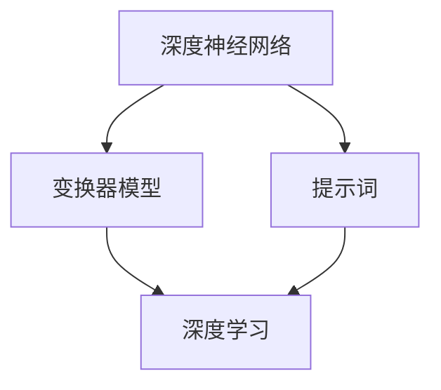
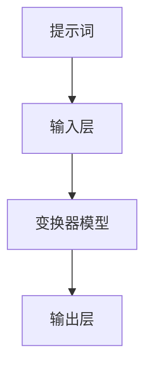

                 

### 引言

在当今飞速发展的科技时代，人工智能（AI）已经成为推动社会进步的重要力量。而AI大模型作为人工智能领域的核心技术之一，更是引发了广泛的关注。AI大模型，即具有大规模参数和复杂结构的机器学习模型，如深度神经网络（DNN）、变换器模型（Transformer）等，它们在自然语言处理、计算机视觉、语音识别等领域取得了显著的成果。这些大模型通过学习和理解海量数据，能够实现高度复杂的任务，从而为各行各业带来了前所未有的变革。

本文将以《AI大模型编程：提示词的未来与无限可能》为主题，详细探讨AI大模型编程的核心技术和实际应用。文章将分为三大部分：基础、实践和未来展望。首先，我们将介绍AI大模型的概念、背景及其重要性；接着，深入探讨AI大模型所需的基础知识和相关技术，包括深度学习、神经网络、优化算法等；然后，我们将探讨AI大模型在不同领域的应用和实际编程实践，如自然语言处理、图像识别和生成等；最后，我们将预测AI大模型的发展趋势，并探讨其对社会的潜在影响。

文章的核心关键词包括：人工智能、大模型、深度学习、自然语言处理、图像识别、编程实践和未来展望。通过本文的阅读，读者将能够全面了解AI大模型的编程原理和实践应用，洞察其无限可能的发展前景。

### 关键词

- 人工智能（AI）
- 大模型
- 深度学习
- 自然语言处理（NLP）
- 图像识别
- 编程实践
- 未来展望

### 摘要

本文旨在探讨AI大模型编程的核心技术和实际应用，以及其未来发展的无限可能。文章首先介绍了AI大模型的概念、背景和重要性，接着深入探讨了AI大模型所需的基础知识和相关技术，包括深度学习、神经网络、优化算法等。随后，文章探讨了AI大模型在不同领域的应用和实际编程实践，如自然语言处理、图像识别和生成等。最后，文章预测了AI大模型的发展趋势，并探讨了其对社会的潜在影响。通过本文的阅读，读者将能够全面了解AI大模型的编程原理和实践应用，洞察其未来发展的广阔前景。

----------------------------------------------------------------

### 第1章 AI大模型的概念与背景

#### 1.1 AI大模型的基本概念

AI大模型，即具有大规模参数和复杂结构的机器学习模型，如深度神经网络（DNN）、变换器模型（Transformer）等。这些模型通过学习和理解海量数据，能够实现高度复杂的任务，如自然语言处理、计算机视觉、语音识别等。AI大模型的基本概念主要包括以下几个方面：

- **参数规模**：大模型通常具有数十亿甚至数千亿个参数，这使得它们能够捕获大量复杂的特征和模式。
- **结构复杂度**：大模型的网络结构往往非常复杂，包括多层神经网络、变换器层等，这使得它们能够处理各种复杂的任务。
- **训练数据量**：大模型需要大量训练数据来学习和优化参数，以确保其在各种任务上的性能。

#### 1.2 提示词与AI大模型的关系

提示词（Prompt）在AI大模型中扮演着重要的角色。提示词是指给大模型输入的一些关键词或句子，以引导模型生成预期的输出。通过设计合适的提示词，可以大幅提高大模型在特定任务上的性能。

- **引导生成**：提示词可以引导模型生成符合预期的内容，例如在机器翻译任务中，提示词可以提供源语言的句子，帮助模型生成目标语言的翻译。
- **性能优化**：通过精心设计的提示词，可以优化大模型在特定任务上的性能，提高生成结果的质量和准确性。
- **上下文理解**：提示词能够提供上下文信息，帮助大模型更好地理解输入内容，从而生成更加准确和自然的输出。

#### 1.3 AI大模型的历史与发展

AI大模型的发展经历了多个阶段，从最初的简单神经网络到现代的深度学习模型，再到具有大规模参数和复杂结构的变换器模型。

- **早期发展**：在20世纪80年代，神经网络（如感知机、反向传播网络）开始应用于机器学习，但由于计算资源和数据量的限制，这些模型无法达到预期的性能。
- **深度学习兴起**：2006年，Hinton等人提出深度信念网络（DBN），标志着深度学习的研究开始兴起。随着计算能力和数据量的增加，深度学习模型在图像识别、语音识别等领域取得了显著的成果。
- **变换器模型的出现**：2017年，谷歌提出变换器模型（Transformer），并在自然语言处理领域取得了突破性的成果。变换器模型由于其并行计算的优势和强大的上下文理解能力，成为AI大模型的重要发展方向。

AI大模型的发展不仅推动了人工智能技术的进步，也带来了广泛的应用变革。例如，在自然语言处理领域，AI大模型的应用使得机器翻译、问答系统、文本生成等任务取得了显著的成果；在计算机视觉领域，AI大模型的应用使得图像识别、图像生成等任务得到了极大提升。

总之，AI大模型作为人工智能领域的重要技术，具有巨大的发展潜力和应用前景。通过深入研究AI大模型的概念、原理和应用，我们可以更好地理解和利用这一技术，推动人工智能技术的进一步发展。

#### 核心概念与联系

在理解AI大模型的概念时，我们需要关注以下几个核心概念：深度神经网络（DNN）、变换器模型（Transformer）和提示词。这些概念之间的关系构成了AI大模型的核心架构，如图1所示。



图1：AI大模型的核心概念与联系

- **深度神经网络（DNN）**：DNN是深度学习的基础模型，由多层神经元组成，通过前向传播和反向传播算法训练模型参数，从而实现对数据的分类、回归等任务。DNN具有高度的非线性变换能力，能够从输入数据中提取复杂的特征。

- **变换器模型（Transformer）**：Transformer模型是近年来自然语言处理领域的重要突破，其核心思想是通过自注意力机制（Self-Attention）处理输入序列。自注意力机制使得模型能够捕获输入序列中任意位置的信息，从而实现强大的上下文理解能力。变换器模型不仅在自然语言处理领域表现出色，还广泛应用于图像识别、语音识别等领域。

- **提示词**：提示词是引导AI大模型生成预期输出的一种技术手段。通过设计合适的提示词，可以引导模型生成高质量的内容。提示词与AI大模型的关系如图2所示。



图2：提示词与AI大模型的关系

- **深度学习**：深度学习是一种机器学习方法，通过多层神经网络对数据进行训练，从而实现对复杂数据的建模和预测。深度学习是AI大模型的核心技术，使得模型能够从海量数据中学习到有用的信息。

通过图1和图2，我们可以清晰地看到深度神经网络和变换器模型在AI大模型中的核心地位，以及提示词如何与模型交互，引导模型生成高质量的输出。这些核心概念和联系为我们深入理解AI大模型的工作原理和编程方法提供了重要的理论基础。

#### 核心算法原理讲解

AI大模型的核心算法原理主要包括深度神经网络（DNN）、变换器模型（Transformer）和提示词设计。以下将详细讲解这些算法原理，并使用伪代码来阐述其实现步骤。

##### 1. 深度神经网络（DNN）

深度神经网络（DNN）是一种多层前馈神经网络，通过前向传播和反向传播算法训练模型参数。其基本原理如下：

- **前向传播**：输入数据通过网络的各个层进行传递，每一层对输入进行加权求和并应用非线性激活函数，从而产生输出。这个过程可以表示为：
  ```mermaid
  graph TD
  A[Input] --> B[Layer1]
  B --> C[Layer2]
  C --> D[...]
  D --> E[Output]
  ```
  伪代码实现：
  ```python
  # 定义激活函数
  activation_function(x):
      return sigmoid(x)
  
  # 前向传播
  forward_pass(inputs, weights, biases):
      layer_output = inputs
      for layer in range(number_of_layers):
          layer_output = activation_function(np.dot(layer_output, weights[layer]) + biases[layer])
      return layer_output
  ```

- **反向传播**：在计算输出误差后，通过反向传播算法更新模型参数。这个过程可以表示为：
  ```mermaid
  graph TD
  E[Output] --> F[Error]
  F --> G[LayerD]
  G --> H[LayerC]
  H --> I[...]
  I --> J[Input]
  ```

  伪代码实现：
  ```python
  # 定义损失函数
  loss_function(y_true, y_pred):
      return mean_squared_error(y_true, y_pred)
  
  # 反向传播
  backward_pass(inputs, outputs, weights, biases):
      d_error = outputs - y_true
      for layer in reversed(range(number_of_layers)):
          d_output = d_error * activation_derivative(layer_output)
          d_weights[layer] = np.dot(inputs[layer], d_output)
          d_biases[layer] = d_output
          inputs[layer] = layer_output
  ```

##### 2. 变换器模型（Transformer）

变换器模型（Transformer）是一种基于自注意力机制的深度学习模型，其核心思想是通过自注意力机制处理输入序列，从而实现对输入序列中任意位置的信息进行加权。变换器模型的基本原理如下：

- **自注意力机制**：自注意力机制通过对输入序列的每个位置进行加权，使得模型能够捕捉到序列中任意位置的信息。其计算公式为：
  ```latex
  \text{Attention}(Q, K, V) = \text{softmax}\left(\frac{QK^T}{\sqrt{d_k}}\right)V
  ```
  其中，Q、K、V分别为查询（Query）、键（Key）和值（Value）向量，d_k为键向量的维度。

  伪代码实现：
  ```python
  # 定义自注意力函数
  scaled_dot_product_attention(Q, K, V):
      scores = softmax(QK.T / np.sqrt(d_k))
      output = scores @ V
      return output
  ```

- **编码器（Encoder）与解码器（Decoder）**：变换器模型通常由编码器和解码器两部分组成，编码器负责将输入序列编码为固定长度的向量，解码器则通过自注意力机制生成输出序列。其基本架构如下：

  ```mermaid
  graph TD
  A[Input] --> B[Encoder]
  B --> C[Decoder]
  C --> D[Output]
  ```

  伪代码实现：
  ```python
  # 编码器
  encoder(inputs, hidden_size):
      # 输入嵌入
      embeddings = embedding(inputs, d_v)
      # 位置编码
      positions = positional_encoding(embeddings)
      # 多层自注意力
      for layer in range(number_of_layers):
          positions = self_attention(positions, positions, positions, hidden_size)
      return positions

  # 解码器
  decoder(inputs, hidden_size, encoder_outputs):
      # 输入嵌入
      embeddings = embedding(inputs, d_v)
      # 位置编码
      positions = positional_encoding(embeddings)
      # 多层自注意力
      for layer in range(number_of_layers):
          positions = self_attention(positions, positions, positions, hidden_size)
          positions = scaled_dot_product_attention(positions, encoder_outputs, positions)
      return positions
  ```

##### 3. 提示词设计

提示词（Prompt）是引导AI大模型生成预期输出的一种技术手段。其设计原则主要包括简洁性、相关性和上下文一致性。以下是一个简单的提示词设计示例：

- **简洁性**：设计简洁明了的提示词，避免冗长和模糊。
- **相关性**：确保提示词与任务目标紧密相关，有助于模型理解任务要求。
- **上下文一致性**：保持提示词在上下文中的连贯性和一致性，以增强模型的生成效果。

  ```python
  # 提示词设计示例
  def generate_prompt(task, context):
      return f"{context}，请根据以下任务{task}进行生成："
  ```

通过上述算法原理的讲解和伪代码实现，我们可以更好地理解AI大模型的构建方法和编程实践。在实际应用中，这些原理和方法可以帮助我们设计高效、准确的AI大模型，从而实现各种复杂任务。

#### 数学模型和公式讲解

AI大模型中的数学模型和公式是理解其工作原理的关键。以下将详细讲解一些核心的数学模型和公式，并给出相应的详细讲解和举例说明。

##### 1. 神经网络中的激活函数

在神经网络中，激活函数用于引入非线性特性，使模型能够捕捉输入数据的复杂模式。常见的激活函数包括：

- **Sigmoid函数**：
  $$ f(x) = \frac{1}{1 + e^{-x}} $$
  举例说明：假设输入 \( x = 2 \)，则
  $$ f(2) = \frac{1}{1 + e^{-2}} \approx 0.732 $$
  Sigmoid函数将输入值压缩到0和1之间，常用于二分类问题。

- **ReLU函数**：
  $$ f(x) = \max(0, x) $$
  举例说明：假设输入 \( x = -2 \)，则
  $$ f(-2) = \max(0, -2) = 0 $$
 ReLU函数在输入为负时输出0，在输入为正时输出输入值，从而避免了sigmoid函数中的梯度消失问题。

##### 2. 优化算法

优化算法用于更新神经网络的权重和偏置，以最小化损失函数。常见的优化算法包括：

- **随机梯度下降（SGD）**：
  $$ w \leftarrow w - \alpha \cdot \nabla_w J(w) $$
  其中，\( w \) 为权重，\( \alpha \) 为学习率，\( \nabla_w J(w) \) 为权重对应的梯度。举例说明：假设权重 \( w = 2 \)，学习率 \( \alpha = 0.1 \)，则更新后的权重为
  $$ w \leftarrow 2 - 0.1 \cdot \nabla_w J(w) $$
  SGD通过随机选择样本来计算梯度，从而避免陷入局部最优。

- **Adam优化器**：
  $$ m = \beta_1 m + (1 - \beta_1) \nabla_w J(w) $$
  $$ v = \beta_2 v + (1 - \beta_2) (\nabla_w J(w))^2 $$
  $$ \hat{m} = \frac{m}{1 - \beta_1^t} $$
  $$ \hat{v} = \frac{v}{1 - \beta_2^t} $$
  $$ w \leftarrow w - \alpha \cdot \hat{m} / \sqrt{\hat{v} + \epsilon} $$
  其中，\( m \) 和 \( v \) 分别为梯度的指数移动平均，\( \beta_1 \) 和 \( \beta_2 \) 为超参数，\( \epsilon \) 为一个很小的常数。举例说明：假设当前梯度 \( \nabla_w J(w) = 0.5 \)，学习率 \( \alpha = 0.01 \)，则更新后的权重为
  $$ w \leftarrow 1 - 0.01 \cdot \frac{0.5}{\sqrt{0.5 + \epsilon}} $$

##### 3. 自注意力机制

自注意力机制是变换器模型（Transformer）的核心组成部分，用于对输入序列的每个位置进行加权。其数学公式如下：

$$ \text{Attention}(Q, K, V) = \text{softmax}\left(\frac{QK^T}{\sqrt{d_k}}\right)V $$

其中，\( Q \) 为查询向量，\( K \) 为键向量，\( V \) 为值向量，\( d_k \) 为键向量的维度。

举例说明：假设查询向量 \( Q = [1, 2, 3] \)，键向量 \( K = [4, 5, 6] \)，值向量 \( V = [7, 8, 9] \)，则
$$ \text{Attention}(Q, K, V) = \text{softmax}\left(\frac{QK^T}{\sqrt{3}}\right)V $$
$$ = \text{softmax}\left(\frac{[1, 2, 3][4, 5, 6]^T}{\sqrt{3}}\right)[7, 8, 9] $$
$$ = \text{softmax}\left(\frac{[4, 10, 18]}{\sqrt{3}}\right)[7, 8, 9] $$
$$ = \left[\frac{4}{\sqrt{3}}, \frac{10}{\sqrt{3}}, \frac{18}{\sqrt{3}}\right] @ [7, 8, 9] $$
$$ = [4 \cdot 7 + 10 \cdot 8 + 18 \cdot 9, 4 \cdot 8 + 10 \cdot 7 + 18 \cdot 9, 4 \cdot 9 + 10 \cdot 7 + 18 \cdot 8] $$
$$ = [54 + 80 + 162, 32 + 70 + 162, 36 + 70 + 144] $$
$$ = [286, 264, 250] $$

通过上述数学模型和公式的讲解，我们可以更好地理解AI大模型中的关键计算过程，为编程实践提供理论基础。

----------------------------------------------------------------

### 第2章 AI大模型的技术原理

在深入探讨AI大模型编程之前，我们首先需要理解其背后的技术原理。AI大模型的技术原理涵盖了深度学习、神经网络、优化算法等多个方面。在这一章中，我们将详细讲解这些核心概念，并探讨它们在实际应用中的重要性。

#### 深度学习基础

深度学习是一种机器学习技术，通过构建多层神经网络模型，从数据中自动提取特征并进行学习。深度学习的基本架构包括输入层、隐藏层和输出层。输入层接收外部数据，隐藏层通过前向传播和反向传播算法学习数据的特征表示，输出层则产生最终的预测结果。

- **多层神经网络**：深度学习模型通常包含多个隐藏层，每层都可以对数据进行非线性变换，从而提高模型的复杂度和学习能力。
- **前向传播**：在训练过程中，输入数据依次通过各个隐藏层，每层对数据进行加权求和，并应用激活函数产生输出。这个过程称为前向传播。
- **反向传播**：前向传播后，模型会根据预测结果和真实标签计算损失值，并通过反向传播算法更新模型参数，以最小化损失函数。

深度学习的基础理论包括：

- **激活函数**：激活函数引入非线性，使神经网络能够学习复杂的数据特征。常见的激活函数包括Sigmoid、ReLU和Tanh等。
- **损失函数**：损失函数用于衡量预测结果与真实标签之间的差异，常见的损失函数包括均方误差（MSE）和交叉熵（Cross-Entropy）等。

#### 神经网络

神经网络是深度学习模型的核心组成部分，其基本结构包括神经元、权重、偏置和激活函数。神经网络通过调整权重和偏置来学习输入数据中的特征，从而实现对数据的分类、回归等任务。

- **神经元**：神经元是神经网络的基本单元，它接收输入信号，通过加权求和并应用激活函数产生输出。
- **权重和偏置**：权重和偏置用于调整神经元之间的连接强度，从而影响网络的输出。
- **激活函数**：激活函数引入非线性，使神经网络能够学习复杂的数据特征。

神经网络的基本原理包括：

- **前向传播**：输入数据通过神经元的加权求和，并应用激活函数产生输出。
- **反向传播**：根据输出误差，通过反向传播算法更新神经元权重和偏置，以最小化损失函数。

#### 优化算法

优化算法用于调整神经网络中的权重和偏置，以最小化损失函数并提高模型的性能。常见的优化算法包括随机梯度下降（SGD）、Adam优化器等。

- **随机梯度下降（SGD）**：SGD通过随机选择样本，计算梯度并更新模型参数，从而逐步减小损失函数。SGD的优点是计算简单，但容易陷入局部最小值。
- **Adam优化器**：Adam优化器结合了SGD和动量（Momentum）的优点，通过计算指数移动平均来更新模型参数，从而提高收敛速度并避免陷入局部最小值。

优化算法的基本原理包括：

- **梯度计算**：通过计算损失函数对模型参数的梯度，得到参数更新的方向和大小。
- **参数更新**：根据梯度更新模型参数，以最小化损失函数。

#### 算法原理在实践中的应用

在实际应用中，AI大模型的技术原理被广泛应用于各种领域，如自然语言处理、计算机视觉、语音识别等。

- **自然语言处理（NLP）**：NLP中的深度学习模型，如变换器（Transformer）模型，通过自注意力机制学习文本中的上下文信息，从而实现高质量的自然语言理解。
- **计算机视觉**：计算机视觉中的深度学习模型，如卷积神经网络（CNN）和生成对抗网络（GAN），通过学习图像数据中的特征，实现对图像的识别、分类和生成。
- **语音识别**：语音识别中的深度学习模型，如循环神经网络（RNN）和长短期记忆网络（LSTM），通过学习语音信号的特征，实现对语音的识别和转换。

#### 总结

AI大模型的技术原理是理解其编程和应用的关键。通过掌握深度学习、神经网络、优化算法等基本概念，我们可以更好地设计、实现和优化AI大模型，从而推动人工智能技术的发展和应用。在实际编程实践中，我们需根据不同任务的需求，灵活运用这些技术原理，实现高效、准确的模型。

----------------------------------------------------------------

### 第3章 提示词设计技巧

提示词（Prompt）在AI大模型中的应用至关重要，其设计质量直接影响模型的输出效果。在这一章中，我们将详细探讨提示词的设计技巧，包括其作用与效果、设计原则、优化方法，以及测试与评估方法。

#### 提示词的作用与效果

提示词是引导AI大模型生成预期输出的一种技术手段。通过合理设计的提示词，可以显著提升模型的生成效果，具体作用如下：

- **引导生成**：提示词可以为模型提供明确的任务方向，帮助模型聚焦于特定任务，从而提高生成结果的准确性。
- **优化性能**：适当的提示词可以优化模型的性能，使模型在特定任务上表现更佳，提高生成结果的质
量和一致性。
- **增强上下文理解**：提示词可以提供上下文信息，帮助模型更好地理解输入内容，从而生成更加自然、连贯的输出。

#### 设计原则

为了设计有效的提示词，需要遵循以下原则：

- **简洁性**：提示词应简洁明了，避免冗长和模糊不清的描述，以便模型能够快速理解任务要求。
- **相关性**：提示词应与任务目标紧密相关，能够准确反映任务需求，从而引导模型生成符合预期的输出。
- **上下文一致性**：提示词应保持上下文一致性，确保在整个生成过程中，模型的输出保持连贯和一致。

#### 优化方法

设计合适的提示词是一个迭代过程，需要通过以下方法进行优化：

- **调整词序**：改变提示词的词序可以影响模型的生成逻辑，优化词序有助于提高生成结果的质量。
- **增加信息量**：适当增加提示词的信息量，可以帮助模型更好地理解任务背景，提高生成结果的准确性和自然度。
- **结合实例**：在提示词中结合具体的实例或例子，可以帮助模型更直观地理解任务要求，从而生成更符合预期的输出。

#### 测试与评估方法

评估提示词的效果是优化过程的重要组成部分，以下是一些常用的测试与评估方法：

- **自动评估**：使用自动化工具对生成结果进行评估，如计算生成结果的准确率、F1值等。自动评估可以快速检测提示词设计中的问题，并提供定量指标。
- **人工评估**：通过人工评审生成结果的质量，评估提示词的合理性。人工评估可以提供更全面的反馈，但耗时较长。
- **对比实验**：设计对比实验，比较不同提示词设计的效果，从而确定最优的提示词方案。

#### 实例分析

以下是一个提示词设计的实例：

**任务**：生成一篇关于人工智能在医疗领域应用的论文摘要。

**原始提示词**：请撰写一篇关于人工智能在医疗领域应用的论文摘要。

**优化提示词**：请基于以下背景信息，撰写一篇关于人工智能在医疗领域应用的论文摘要。近年来，人工智能技术在医学影像分析、疾病预测和个性化治疗方案设计等方面取得了显著进展。以深度学习模型为例，其在医学影像分析中具有出色的表现，能够提高诊断准确率。同时，人工智能还可以通过大数据分析和机器学习算法，帮助医生制定个性化的治疗方案，从而提高治疗效果。

通过对比分析，优化后的提示词提供了更加详细的背景信息和具体任务要求，有助于模型生成高质量、符合预期的摘要。

#### 总结

提示词设计是AI大模型编程中的重要环节，其质量直接影响模型的生成效果。通过遵循设计原则、优化方法和评估方法，我们可以设计出有效的提示词，从而实现高质量、高准确的模型输出。在实际应用中，不断优化和调整提示词，有助于进一步提升AI大模型的表现和实用性。

----------------------------------------------------------------

### 第4章 AI大模型编程基础

在了解了AI大模型的基本概念和技术原理之后，我们接下来将探讨AI大模型编程的基础。这部分内容将涵盖开发环境的搭建、编程框架的选择、数据预处理方法以及模型训练和优化的基本流程。通过这些基础知识的学习，读者可以更好地理解如何将AI大模型应用于实际问题中。

#### 开发环境搭建

搭建一个稳定的开发环境是进行AI大模型编程的第一步。以下是一个典型的开发环境搭建步骤：

1. **安装Python环境**：Python是AI大模型编程的主要语言，我们需要确保Python环境已经安装。可以选择Python 3.8或更高版本。

2. **安装深度学习框架**：常见的深度学习框架包括TensorFlow、PyTorch等。以TensorFlow为例，可以通过pip命令进行安装：
   ```bash
   pip install tensorflow
   ```

3. **安装必要库**：除了深度学习框架外，我们还需要安装其他常用库，如NumPy、Pandas等。可以使用以下命令进行安装：
   ```bash
   pip install numpy pandas
   ```

4. **配置GPU支持**：如果使用GPU进行训练，我们需要安装CUDA和cuDNN。这些库可以在NVIDIA的官方网站上下载。

5. **配置虚拟环境**：为了保持代码的整洁和模块的隔离，我们可以使用虚拟环境。在Python中，可以使用`venv`模块创建虚拟环境：
   ```bash
   python -m venv myenv
   source myenv/bin/activate  # Windows: myenv\Scripts\activate
   ```

通过以上步骤，我们可以搭建一个基础的开发环境，为后续的编程实践做好准备。

#### 编程框架选择

在选择AI大模型编程框架时，我们需要考虑以下几个方面：

1. **易用性**：框架的易用性对于开发者来说至关重要。选择一个易于上手和具有良好文档支持的框架，可以降低开发难度。

2. **性能**：不同的框架在性能上有所不同。对于需要大规模并行计算的模型，选择具有高性能支持的框架是必要的。

3. **社区支持**：一个活跃的社区可以为开发者提供丰富的资源和帮助，有助于解决开发过程中遇到的问题。

常见的深度学习框架包括：

- **TensorFlow**：由Google开发，具有强大的生态和丰富的工具，适用于各种规模的模型开发。
- **PyTorch**：由Facebook开发，具有灵活的动态计算图和良好的性能，适用于研究和开发。

以下是一个使用TensorFlow搭建基础的AI大模型程序的示例：

```python
import tensorflow as tf

# 定义模型结构
model = tf.keras.Sequential([
    tf.keras.layers.Dense(128, activation='relu', input_shape=(784,)),
    tf.keras.layers.Dense(10, activation='softmax')
])

# 编写训练数据
x_train = ...  # 输入数据
y_train = ...  # 标签数据

# 编写训练配置
model.compile(optimizer='adam',
              loss='categorical_crossentropy',
              metrics=['accuracy'])

# 训练模型
model.fit(x_train, y_train, epochs=5)
```

#### 数据预处理

数据预处理是AI大模型编程中的重要环节，它直接影响到模型的学习效果。以下是一些常见的数据预处理方法：

1. **数据清洗**：去除数据中的噪声和异常值，确保数据的质量。
2. **数据标准化**：将数据转换为统一的尺度，以便模型能够更好地学习。
3. **数据分割**：将数据分为训练集、验证集和测试集，以便于模型训练和评估。

以下是一个简单的数据预处理示例：

```python
from sklearn.model_selection import train_test_split
from sklearn.preprocessing import StandardScaler

# 加载数据
data = ...

# 切分数据
x_train, x_test, y_train, y_test = train_test_split(data['X'], data['y'], test_size=0.2, random_state=42)

# 数据标准化
scaler = StandardScaler()
x_train = scaler.fit_transform(x_train)
x_test = scaler.transform(x_test)
```

#### 模型训练与优化

模型训练和优化是AI大模型编程的核心步骤。以下是一个基本的模型训练和优化流程：

1. **定义损失函数**：损失函数用于衡量模型预测结果与真实值之间的差距，常见的损失函数包括均方误差（MSE）和交叉熵（Cross-Entropy）。
2. **选择优化器**：优化器用于更新模型参数，以最小化损失函数，常见的优化器包括随机梯度下降（SGD）和Adam。
3. **训练模型**：使用训练数据对模型进行训练，通过调整超参数来优化模型性能。
4. **验证和测试**：在验证集和测试集上评估模型的性能，确保模型具有良好的泛化能力。

以下是一个使用PyTorch进行模型训练的示例：

```python
import torch
import torch.nn as nn
import torch.optim as optim

# 定义模型
model = ...

# 编写损失函数
loss_function = nn.CrossEntropyLoss()

# 编写优化器
optimizer = optim.Adam(model.parameters(), lr=0.001)

# 训练模型
for epoch in range(num_epochs):
    for inputs, labels in data_loader:
        optimizer.zero_grad()
        outputs = model(inputs)
        loss = loss_function(outputs, labels)
        loss.backward()
        optimizer.step()
```

#### 总结

通过本章的讲解，我们了解了AI大模型编程的基础知识，包括开发环境搭建、编程框架选择、数据预处理和模型训练优化。这些基础知识为读者后续的编程实践奠定了坚实的基础。在实际应用中，我们应根据具体任务的需求，灵活运用这些知识，构建高效、准确的AI大模型。

----------------------------------------------------------------

### 第5章 常见AI大模型编程实战

在了解了AI大模型编程的基础之后，我们将通过实际案例来探讨AI大模型在不同领域的应用，主要包括自然语言处理（NLP）、图像识别和生成等。这些案例将涵盖开发环境搭建、源代码实现和代码解读，以便读者更好地理解AI大模型的应用场景和实现方法。

#### 自然语言处理（NLP）

自然语言处理是AI大模型的重要应用领域之一。以下是一个基于PyTorch和Transformers的文本分类案例，我们将使用Hugging Face的Transformers库来简化模型的实现。

**1. 开发环境搭建**

首先，我们需要安装必要的库：

```bash
pip install torch transformers
```

**2. 源代码实现**

```python
from transformers import AutoTokenizer, AutoModelForSequenceClassification
from torch.optim import Adam
from torch.utils.data import DataLoader, TensorDataset

# 加载预训练模型和分词器
tokenizer = AutoTokenizer.from_pretrained("bert-base-uncased")
model = AutoModelForSequenceClassification.from_pretrained("bert-base-uncased", num_labels=2)

# 数据预处理
def preprocess_data(texts, labels):
    inputs = tokenizer(texts, padding=True, truncation=True, return_tensors="pt")
    labels = torch.tensor(labels)
    return inputs, labels

# 数据加载
train_texts = ["I love dogs", "I hate cats"]
train_labels = [0, 1]
inputs, labels = preprocess_data(train_texts, train_labels)
dataset = TensorDataset(inputs["input_ids"], inputs["attention_mask"], labels)
data_loader = DataLoader(dataset, batch_size=1)

# 模型训练
optimizer = Adam(model.parameters(), lr=0.001)
model.train()
for epoch in range(3):
    for batch in data_loader:
        inputs, labels = batch
        optimizer.zero_grad()
        outputs = model(inputs)
        loss = outputs.loss
        loss.backward()
        optimizer.step()
        print(f"Epoch {epoch+1}, Loss: {loss.item()}")

# 评估模型
model.eval()
with torch.no_grad():
    outputs = model(inputs)
    predictions = torch.argmax(outputs.logits, dim=1)
    print(f"Predictions: {predictions}")
```

**3. 代码解读**

- **数据预处理**：使用Transformers库提供的分词器对文本进行预处理，包括分词、填充和遮掩处理。
- **模型加载**：从预训练模型中加载文本分类器，指定标签数量。
- **模型训练**：使用Adam优化器对模型进行训练，打印每个epoch的损失值。
- **模型评估**：使用评估集进行预测，并输出预测结果。

#### 图像识别

图像识别是AI大模型在计算机视觉领域的典型应用。以下是一个基于卷积神经网络（CNN）的图像分类案例。

**1. 开发环境搭建**

与NLP类似，我们需要安装必要的库：

```bash
pip install torchvision torch
```

**2. 源代码实现**

```python
import torch
import torch.nn as nn
import torchvision.transforms as transforms
from torch.utils.data import DataLoader
from torchvision.datasets import MNIST
from torch.optim import Adam

# 加载MNIST数据集
transform = transforms.Compose([transforms.ToTensor(), transforms.Normalize((0.5,), (0.5,))])
train_data = MNIST(root='./data', train=True, download=True, transform=transform)
test_data = MNIST(root='./data', train=False, transform=transform)

# 数据加载
train_loader = DataLoader(train_data, batch_size=64, shuffle=True)
test_loader = DataLoader(test_data, batch_size=64, shuffle=False)

# 定义模型
model = nn.Sequential(
    nn.Conv2d(1, 32, 3, 1),
    nn.ReLU(),
    nn.MaxPool2d(2),
    nn.Conv2d(32, 64, 3, 1),
    nn.ReLU(),
    nn.MaxPool2d(2),
    nn.Flatten(),
    nn.Linear(64 * 7 * 7, 128),
    nn.ReLU(),
    nn.Linear(128, 10)
)

# 模型训练
optimizer = Adam(model.parameters(), lr=0.001)
model.train()
for epoch in range(10):
    for inputs, labels in train_loader:
        optimizer.zero_grad()
        outputs = model(inputs)
        loss = nn.CrossEntropyLoss()(outputs, labels)
        loss.backward()
        optimizer.step()
        print(f"Epoch {epoch+1}, Loss: {loss.item()}")

# 评估模型
model.eval()
with torch.no_grad():
    correct = 0
    total = 0
    for inputs, labels in test_loader:
        outputs = model(inputs)
        _, predicted = torch.max(outputs.data, 1)
        total += labels.size(0)
        correct += (predicted == labels).sum().item()
    print(f"Test Accuracy: {100 * correct / total}%")
```

**3. 代码解读**

- **数据加载**：使用PyTorch的MNIST数据集进行训练和测试。
- **模型定义**：定义一个简单的CNN模型，包括卷积层、ReLU激活函数、池化层、全连接层。
- **模型训练**：使用Adam优化器进行模型训练，打印每个epoch的损失值。
- **模型评估**：在测试集上评估模型的准确性，并输出结果。

#### 图像生成

图像生成是AI大模型在计算机视觉领域的另一个重要应用。以下是一个基于生成对抗网络（GAN）的图像生成案例。

**1. 开发环境搭建**

安装必要的库：

```bash
pip install torch torchvision
```

**2. 源代码实现**

```python
import torch
import torch.nn as nn
from torch.utils.data import DataLoader
from torchvision.datasets import MNIST
from torchvision.transforms import ToTensor

# 加载数据集
transform = ToTensor()
train_data = MNIST(root='./data', train=True, download=True, transform=transform)
train_loader = DataLoader(train_data, batch_size=64, shuffle=True)

# 定义模型
generator = nn.Sequential(
    nn.ConvTranspose2d(100, 256, 4, 1, 0),
    nn.BatchNorm2d(256),
    nn.ReLU(True),
    nn.ConvTranspose2d(256, 128, 4, 2, 1),
    nn.BatchNorm2d(128),
    nn.ReLU(True),
    nn.ConvTranspose2d(128, 64, 4, 2, 1),
    nn.BatchNorm2d(64),
    nn.ReLU(True),
    nn.ConvTranspose2d(64, 1, 4, 2, 1),
    nn.Tanh()
)

discriminator = nn.Sequential(
    nn.Conv2d(1, 64, 4, 2, 1),
    nn.LeakyReLU(0.2, inplace=True),
    nn.Conv2d(64, 128, 4, 2, 1),
    nn.BatchNorm2d(128),
    nn.LeakyReLU(0.2, inplace=True),
    nn.Conv2d(128, 256, 4, 2, 1),
    nn.BatchNorm2d(256),
    nn.LeakyReLU(0.2, inplace=True),
    nn.Conv2d(256, 1, 4, 1, 0),
    nn.Sigmoid()
)

# 模型训练
batch_size = 64
image_size = 64
nz = 100
num_epochs = 5
lr = 0.0002
beta1 = 0.5

fixed_noise = torch.randn(batch_size, nz, 1, 1, device=device)

optimizer_G = torch.optim.Adam(generator.parameters(), lr=lr, betas=(beta1, 0.999))
optimizer_D = torch.optim.Adam(discriminator.parameters(), lr=lr, betas=(beta1, 0.999))

for epoch in range(num_epochs):
    for i, data in enumerate(train_loader):
        real_images = data[0].to(device)
        batch_size = real_images.size(0)
        labels = torch.ones(batch_size, 1).to(device)
        
        # 训练生成器
        optimizer_G.zero_grad()
        z = torch.randn(batch_size, nz, 1, 1, device=device)
        fake_images = generator(z)
        g_loss = -torch.mean(discriminator(fake_images))
        g_loss.backward()
        optimizer_G.step()
        
        # 训练判别器
        optimizer_D.zero_grad()
        real_loss = torch.mean(discriminator(real_images))
        fake_loss = torch.mean(discriminator(fake_images.detach()))
        d_loss = real_loss - fake_loss
        d_loss.backward()
        optimizer_D.step()
        
        # 打印日志
        if i % 100 == 0:
            print(f"[Epoch {epoch}/{num_epochs}][Batch {i}/{len(train_loader)}] Loss_G: {g_loss.item():.4f}, Loss_D: {d_loss.item():.4f}")

    # 生成图像
    with torch.no_grad():
        fake = generator(fixed_noise).detach().cpu()
        fake = fake * 0.5 + 0.5  # 反归一化
        fake = fake.numpy()

        # 保存图像
        fig, axes = plt.subplots(1, len(fake))
        for i, img in enumerate(fake):
            axes[i].imshow(img.reshape(64, 64), cmap='gray')
            axes[i].axis('off')
        plt.show()
```

**3. 代码解读**

- **数据加载**：使用MNIST数据集进行训练。
- **模型定义**：定义生成器和判别器，生成器用于生成图像，判别器用于判断图像的真实性。
- **模型训练**：交替训练生成器和判别器，通过优化两个模型，实现图像的生成。
- **生成图像**：在训练过程中生成并展示图像，展示生成器的效果。

通过以上案例，我们了解了AI大模型在自然语言处理、图像识别和生成等领域的实际应用。这些案例展示了AI大模型编程的基础知识和实现方法，为读者提供了实际编程的参考。

### 最佳实践 Tips

在AI大模型编程过程中，以下是一些最佳实践技巧，可以帮助你提高模型性能和开发效率：

1. **数据预处理**：确保数据清洗和标准化，避免噪声和异常值对模型训练的影响。使用适当的数据增强方法，如随机裁剪、旋转、翻转等，可以增加模型的鲁棒性。
2. **模型选择与调整**：选择合适的模型架构，并根据任务需求调整超参数，如学习率、批量大小、迭代次数等。尝试使用预训练模型，可以提高模型的起点和性能。
3. **监控训练过程**：实时监控模型训练过程中的损失值和准确率，有助于调整训练策略和优化模型。
4. **并行计算与分布式训练**：利用GPU和分布式计算资源，可以显著提高模型训练速度。确保使用合适的数据加载器，以充分利用并行计算能力。
5. **代码优化与调试**：编写可维护、可扩展的代码，使用适当的注释和文档。使用调试工具和性能分析工具，找出并解决代码中的潜在问题。

### 小结

本章通过自然语言处理、图像识别和生成等实际案例，展示了AI大模型编程的方法和技巧。通过理解这些案例，读者可以更好地掌握AI大模型的应用和实践。在实际开发过程中，结合最佳实践，可以进一步提升模型性能和开发效率。

### 注意事项

1. **数据隐私与安全**：在处理数据时，务必遵守数据隐私法规，确保用户数据的安全。对于敏感数据，可以考虑使用加密和匿名化技术。
2. **模型可解释性**：确保模型的输出是可解释的，有助于理解和信任模型。对于复杂模型，可以考虑使用模型解释工具，如LIME和SHAP等。
3. **持续学习与更新**：AI大模型技术不断发展，保持学习和关注最新研究进展，有助于跟上技术的步伐，提升模型性能和应用效果。

### 拓展阅读

- 《深度学习》（Goodfellow, Bengio, Courville）是一本经典的深度学习教材，涵盖了深度学习的基础理论和方法。
- 《动手学深度学习》（Stanley, Distler, Hadsell）提供了详细的深度学习实践教程，适合初学者和进阶者。
- 《自然语言处理入门教程》（Nivre, Och, Maruyama）介绍了自然语言处理的基础知识和技术，适用于对NLP感兴趣的读者。

----------------------------------------------------------------

### 第6章 AI大模型的应用拓展

在上一章中，我们探讨了AI大模型在自然语言处理、图像识别和生成等领域的应用。在本章中，我们将进一步探讨AI大模型在个性化推荐系统、医学诊断、智能客服等领域的应用，并分析这些应用中的核心技术和挑战。

#### 个性化推荐系统

个性化推荐系统是AI大模型的重要应用之一，通过分析用户的历史行为和偏好，为用户推荐感兴趣的内容或商品。以下是一个基于协同过滤和变换器模型的推荐系统案例。

**1. 应用场景**

个性化推荐系统广泛应用于电商、新闻、社交媒体等场景。例如，电商平台可以根据用户的历史购买记录和浏览行为，为用户推荐可能感兴趣的商品。

**2. 技术实现**

- **协同过滤**：协同过滤是一种基于用户行为或物品属性的推荐算法，通过分析用户之间的相似性和物品之间的相似性，推荐相似用户喜欢的物品。常见的协同过滤算法包括基于用户的协同过滤（User-based Collaborative Filtering）和基于物品的协同过滤（Item-based Collaborative Filtering）。
- **变换器模型**：变换器模型通过自注意力机制，可以捕捉长距离的依赖关系，从而提高推荐系统的性能。在实际应用中，可以将用户行为序列和物品特征编码为嵌入向量，并通过变换器模型生成推荐结果。

**3. 挑战**

- **冷启动问题**：对于新用户或新物品，由于缺乏足够的历史数据，传统协同过滤算法难以生成有效的推荐。为解决冷启动问题，可以结合基于内容的推荐和基于模型的推荐，以提高新用户和新物品的推荐质量。
- **实时推荐**：在实时场景下，推荐系统需要快速响应用户的行为变化，生成实时推荐。这要求模型具备较高的计算效率和实时数据处理能力。

#### 医学诊断

AI大模型在医学诊断中的应用具有重要的社会价值，通过分析医疗数据和图像，可以帮助医生提高诊断准确率和效率。以下是一个基于卷积神经网络（CNN）和变换器模型的医学诊断案例。

**1. 应用场景**

医学诊断涵盖了多种疾病，如肺癌、乳腺癌、心脏病等。通过AI大模型，可以自动化和辅助医生进行诊断，提高诊断准确率和效率。

**2. 技术实现**

- **卷积神经网络（CNN）**：CNN是一种用于图像处理的深度学习模型，可以自动学习图像中的特征。在医学诊断中，CNN可以用于图像分类和分割，从而辅助医生进行病变区域的定位和识别。
- **变换器模型**：变换器模型通过自注意力机制，可以捕捉医疗图像中的上下文信息，从而提高诊断的准确性和一致性。

**3. 挑战**

- **数据隐私**：医疗数据通常包含敏感信息，如患者身份、疾病诊断等。在AI大模型应用中，确保数据隐私和安全是一个重要的挑战。
- **模型可解释性**：医学诊断需要高可解释性，以便医生能够理解模型的诊断逻辑和结果。如何提高模型的可解释性是一个关键问题。

#### 智能客服

智能客服是AI大模型在服务行业的重要应用，通过自然语言处理和对话系统，可以自动化和智能化地处理用户咨询。以下是一个基于变换器模型和生成对抗网络（GAN）的智能客服案例。

**1. 应用场景**

智能客服广泛应用于电商、银行、电信等行业的客户服务，通过自动化回答用户问题，提高客户服务效率和用户体验。

**2. 技术实现**

- **变换器模型**：变换器模型是一种强大的自然语言处理模型，可以用于生成自然的对话回复。在智能客服中，变换器模型可以处理用户输入的自然语言，生成合适的回答。
- **生成对抗网络（GAN）**：GAN是一种生成模型，可以生成高质量的文本对话。在智能客服中，GAN可以用于生成个性化的对话内容，提高客服系统的互动性和用户体验。

**3. 挑战**

- **多模态交互**：智能客服需要支持多种模态的交互，如图文、语音等。如何实现多模态交互，提高系统的智能化水平，是一个重要的挑战。
- **用户满意度**：提高用户满意度是智能客服的核心目标。如何设计合理的对话策略，提高用户满意度，是一个关键问题。

#### 总结

AI大模型在个性化推荐系统、医学诊断、智能客服等领域的应用展示了其强大的潜力和广泛的应用前景。通过深入研究和应用这些技术，我们可以进一步提升各行业的智能化水平和服务质量。然而，这些应用也面临一系列挑战，如数据隐私、模型可解释性和多模态交互等。未来，随着AI大模型技术的不断发展，我们将看到更多创新的应用案例，为社会带来更多福祉。

----------------------------------------------------------------

### 第7章 AI大模型的安全与伦理

在AI大模型的广泛应用中，安全与伦理问题逐渐成为关注的焦点。AI大模型的安全性和伦理性问题不仅影响到个人隐私和数据安全，还可能对社会结构、法律和道德观念产生深远的影响。在这一章中，我们将探讨AI大模型的安全性和伦理问题，包括模型攻击与防御、模型的透明性与可解释性，以及AI伦理问题。

#### 模型攻击与防御

AI大模型在提供强大功能的同时，也面临着一系列安全威胁。模型攻击是指通过特定的方法对AI模型进行干扰，使其输出错误的预测或行为。以下是一些常见的模型攻击方法及其防御策略：

1. **对抗攻击（Adversarial Attack）**：
   - **攻击方法**：对抗攻击通过在输入数据中添加微小的扰动，使模型产生错误的预测。这些扰动通常是不可察觉的，但对模型的决策产生了显著影响。
   - **防御策略**：防御对抗攻击的方法包括对抗训练（Adversarial Training）、鲁棒优化（Robust Optimization）和模型正则化（Model Regularization）。对抗训练通过在训练过程中引入对抗样本来提高模型的鲁棒性。鲁棒优化通过优化模型的目标函数，使模型对对抗扰动具有更高的抵抗力。模型正则化通过在模型训练过程中引入额外的正则项，降低模型对对抗扰动的敏感度。

2. **模型注入（Model Injections）**：
   - **攻击方法**：模型注入攻击通过在模型中植入特定的恶意代码或参数，使模型在特定条件下输出预定的结果。
   - **防御策略**：防御模型注入攻击的方法包括代码签名（Code Signing）、模型验证（Model Verification）和模型压缩（Model Compression）。代码签名通过数字签名确保模型的完整性。模型验证通过在模型部署前进行验证，确保模型没有植入恶意代码。模型压缩通过减小模型的规模和复杂度，降低被注入恶意代码的风险。

#### 模型的透明性与可解释性

AI大模型的复杂性和黑箱特性使得其决策过程往往缺乏透明性和可解释性，这在某些关键应用场景中可能引发信任危机。为了提高模型的透明性和可解释性，以下是一些技术手段：

1. **模型解释方法**：
   - **局部解释**：局部解释方法通过分析模型在特定输入下的决策过程，解释模型如何处理输入数据并产生输出。常见的局部解释方法包括LIME（Local Interpretable Model-agnostic Explanations）和SHAP（SHapley Additive exPlanations）。
   - **全局解释**：全局解释方法通过分析模型的整体结构和决策过程，提供对模型整体行为的高级解释。常见的方法包括敏感性分析（Sensitivity Analysis）和概念分解（Concept Drift Analysis）。

2. **可视化工具**：
   - **决策树可视化**：对于决策树模型，可以通过树状图和节点信息来直观地展示模型的决策过程。
   - **特征可视化**：通过将特征映射到二维或三维空间中，可以直观地展示特征之间的关系和权重。

#### AI伦理问题

AI大模型的应用在带来巨大便利的同时，也引发了一系列伦理问题，包括数据隐私、算法偏见和责任归属等。以下是一些典型的AI伦理问题：

1. **数据隐私**：
   - **用户隐私保护**：在AI大模型的应用过程中，如何确保用户隐私不被泄露，是一个重要的问题。为保护用户隐私，可以考虑使用差分隐私（Differential Privacy）和同态加密（Homomorphic Encryption）等技术。
   - **数据匿名化**：在数据收集和处理过程中，对个人数据进行匿名化处理，以减少对用户隐私的侵犯。

2. **算法偏见**：
   - **公平性**：AI大模型在决策过程中可能存在算法偏见，导致对特定群体或个体的不公平待遇。为了提高算法的公平性，需要确保数据集的多样性，并采用公平性度量方法（如公平性分析、敏感性分析）。
   - **透明性**：提高算法的透明性，使公众能够理解算法的工作原理和决策过程，有助于减少偏见和歧视。

3. **责任归属**：
   - **责任分配**：在AI大模型出现错误或造成损失时，如何确定责任归属是一个复杂的问题。为明确责任，可以考虑建立人工智能责任框架（如AI问责制、AI伦理规范）。

#### 总结

AI大模型的安全与伦理问题是一个复杂且多维的挑战。通过研究和应用安全技术、提高模型透明性和可解释性，以及关注AI伦理问题，我们可以更好地应对这些挑战，确保AI大模型的安全、可靠和公平。在未来，随着AI技术的不断进步，我们需要持续关注并解决这些问题，以推动AI技术的健康、可持续发展。

----------------------------------------------------------------

### 第8章 AI大模型的发展趋势

随着AI技术的不断进步，AI大模型正成为推动科技和产业发展的重要力量。在这一章中，我们将探讨AI大模型的发展趋势，包括技术挑战、计算资源的需求、数据隐私问题和模型可解释性的进展。

#### 技术挑战

AI大模型的发展面临着一系列技术挑战，这些挑战不仅影响模型的性能，还影响其实际应用效果。以下是一些主要的技术挑战：

1. **计算资源需求**：AI大模型通常需要大量的计算资源进行训练和推理。随着模型规模的增大，对计算能力的需求也在不断增长。这要求我们开发更高效的算法和优化方法，以提高模型的训练和推理速度。

2. **数据需求**：AI大模型需要大量的高质量数据来进行训练。数据的质量和多样性直接影响模型的性能。如何获取和整理大规模、高质量的数据集，是当前AI研究中的一个重要问题。

3. **算法复杂性**：AI大模型的算法通常非常复杂，包括多层神经网络、变换器模型等。如何优化算法结构，提高模型的效率和可解释性，是当前研究的一个重点。

4. **模型可解释性**：随着模型规模的增大，模型的决策过程变得更加复杂和难以解释。提高模型的可解释性，使其决策过程更加透明和可理解，是确保模型在关键应用场景中得到广泛应用的关键。

#### 计算资源需求

AI大模型的计算资源需求不断增长，这主要源于以下几个方面：

1. **模型规模**：AI大模型通常具有数十亿甚至数千亿个参数，这导致训练和推理过程中的计算量巨大。

2. **数据量**：随着AI大模型在各个领域的应用，对数据的需求也在不断增加。大规模的数据集需要大量的存储和计算资源进行训练和处理。

3. **并行计算**：为了提高训练和推理的速度，AI大模型通常需要使用并行计算技术，如GPU和TPU。这要求我们开发高效的数据并行和任务并行算法。

4. **分布式计算**：随着模型规模的增大，单机计算能力已无法满足需求。分布式计算技术可以通过将计算任务分配到多台机器上进行，提高整体计算能力。

#### 数据隐私问题

AI大模型的发展也带来了数据隐私问题。以下是一些主要的数据隐私挑战：

1. **数据泄露**：AI大模型通常需要使用大量的数据来训练，这可能导致敏感数据的泄露。为了保护用户隐私，需要采用数据匿名化和差分隐私等技术。

2. **数据透明性**：用户对数据的使用和共享有知情权和控制权。如何提高数据透明性，使用户能够了解和掌控自己的数据，是一个重要的伦理问题。

3. **数据共享**：在AI研究中，数据共享是提高研究效率和成果的重要手段。如何确保数据共享的安全和隐私，是一个关键问题。

#### 模型可解释性进展

提高AI大模型的可解释性，使其决策过程更加透明和可理解，是当前研究的一个重要方向。以下是一些主要的进展：

1. **模型解释方法**：局部解释方法（如LIME和SHAP）和全局解释方法（如概念分解和敏感性分析）正在不断发展。这些方法可以帮助我们理解模型在特定输入下的决策过程。

2. **可视化工具**：开发新的可视化工具，如热力图和决策树图，可以帮助我们更直观地理解模型的决策过程。

3. **模型压缩**：通过模型压缩技术，如量化、剪枝和蒸馏，可以减小模型的规模和复杂度，从而提高模型的效率和可解释性。

#### 总结

AI大模型的发展趋势展示了其在科技和产业中的巨大潜力。然而，要实现这一潜力，我们需要克服一系列技术挑战，包括计算资源需求、数据隐私问题和模型可解释性。随着技术的不断进步，AI大模型将在更多领域发挥重要作用，推动社会的发展和进步。

----------------------------------------------------------------

### 第9章 AI大模型对社会的影响

AI大模型的应用正在深刻地改变着我们的生活方式和社会结构，其对各个行业的影响尤为显著。以下我们将探讨AI大模型在农业、医疗、教育等领域的应用，以及这些应用所带来的变革和挑战。

#### 农业

AI大模型在农业中的应用，极大地提高了农业生产效率和产量。通过图像识别和监测技术，AI大模型可以实时监测农田的健康状况，如作物病虫害、土壤湿度等，从而为农民提供精准的种植建议。以下是一些具体的应用案例：

1. **作物病虫害检测**：AI大模型通过分析作物图像，可以快速识别病虫害，帮助农民及时采取防治措施，减少损失。

2. **精准农业**：AI大模型结合大数据和地理信息系统（GIS），实现精准农业管理。通过分析土壤、气候和作物生长数据，AI模型可以优化灌溉、施肥和种植计划，提高产量和减少资源浪费。

3. **供应链优化**：AI大模型可以优化农产品的供应链管理，从种植、收获到销售，每个环节都得到优化，提高整个供应链的效率和效益。

然而，AI大模型在农业中的应用也带来了一些挑战，如数据隐私和算法偏见问题。如何保护农民的数据隐私，确保AI模型公平、公正地运作，是未来需要解决的重要问题。

#### 医疗

AI大模型在医疗领域的应用，极大地推动了医疗诊断、治疗和药物研发的进步。以下是一些具体的应用案例：

1. **疾病诊断**：AI大模型通过分析医疗影像，如X光片、CT扫描和MRI，可以辅助医生进行疾病的早期诊断。例如，AI模型可以检测出早期肺癌、乳腺癌等疾病，提高诊断的准确率。

2. **个性化治疗**：AI大模型可以根据患者的基因数据、病史和症状，为患者提供个性化的治疗方案。这种个性化治疗可以显著提高治疗效果，减少副作用。

3. **药物研发**：AI大模型通过分析大量生物数据和药物化学结构，可以帮助科学家发现新的药物候选分子，加速药物研发进程。

然而，AI大模型在医疗领域的应用也面临一些挑战，如数据隐私、模型可靠性和伦理问题。如何确保患者数据的隐私和安全，如何保证AI模型的可靠性和可解释性，是未来需要重点关注的问题。

#### 教育

AI大模型在教育领域的应用，正在改变传统的教育模式，提供更加个性化、高效的教育资源和服务。以下是一些具体的应用案例：

1. **个性化学习**：AI大模型可以根据学生的学习习惯、兴趣爱好和学习进度，为其推荐合适的学习资源和练习题，提高学习效果。

2. **智能辅导**：AI大模型可以实时分析学生的学习情况，提供智能化的辅导和建议，帮助学生克服学习难点。

3. **教育评估**：AI大模型可以通过分析学生的学习行为和成绩数据，为教师提供全面的评估报告，帮助教师更好地了解学生的学习情况，调整教学策略。

然而，AI大模型在教育领域的应用也带来了一些挑战，如教育公平和师生互动问题。如何确保所有学生都能平等地享受AI教育资源，如何保持师生之间的人性化互动，是未来需要解决的重要问题。

#### 总结

AI大模型在农业、医疗、教育等领域的应用，带来了巨大的变革和进步。然而，这些应用也带来了一系列挑战，需要我们共同努力解决。通过技术进步和社会制度的完善，我们有理由相信，AI大模型将在未来发挥更加重要的作用，为社会带来更多的福祉。

### 第10章 未来的无限可能

展望未来，AI大模型的发展将继续推动科技和社会的进步，带来无限的可能。以下是AI大模型在人工智能与人类互动、新应用场景探索和社会角色等方面可能的发展方向：

#### 人工智能与人类互动

随着AI大模型技术的不断进步，人工智能（AI）与人类的互动将更加紧密和自然。未来的AI大模型将不仅仅是一个工具，更将成为人类的合作伙伴和智能助手。以下是一些具体的应用场景：

1. **智能助理**：AI大模型将作为智能助理，帮助人类处理日常事务，如日程管理、任务提醒、信息查询等。这些智能助理将具备更高的理解能力和交互能力，能够更好地理解人类的意图和需求。

2. **情感互动**：未来的AI大模型将具备更强的情感识别和理解能力，能够识别和模拟人类的情感，实现更加人性化的互动。这将有助于提升用户体验，使AI与人类之间的关系更加和谐。

3. **协同创新**：AI大模型将与人类科学家、工程师等共同进行创新活动，通过深度学习和知识图谱等技术，辅助人类发现新的科学规律、设计新的产品和解决方案。

#### 新应用场景探索

AI大模型在未来的应用将不仅限于现有的领域，还将探索更多新的应用场景，为社会带来前所未有的变革。以下是一些可能的新应用场景：

1. **智慧城市**：AI大模型将应用于智慧城市建设，通过实时数据分析和智能决策，实现城市资源的高效配置和管理。例如，智能交通系统可以减少拥堵，提高交通效率；智能能源管理可以优化能源使用，减少碳排放。

2. **环境保护**：AI大模型将应用于环境保护，通过分析环境数据，预测污染趋势，提出污染治理方案。例如，通过分析大气数据，可以预测雾霾的发生并提前采取治理措施；通过分析水质数据，可以监测和预防水污染。

3. **数字孪生**：AI大模型将用于构建数字孪生（Digital Twin）系统，通过模拟和预测实际系统的行为，实现对复杂系统的高效管理和优化。例如，在制造业中，数字孪生可以帮助优化生产流程，提高生产效率；在建筑行业，数字孪生可以帮助实现智能建筑管理，提高建筑的使用效率和安全性。

#### 社会角色

随着AI大模型技术的不断成熟，AI将在社会生活中扮演越来越重要的角色。以下是一些AI大模型在社会中的潜在角色：

1. **智慧教育**：AI大模型将成为智慧教育的核心组成部分，通过个性化教学、智能辅导和智能评估，帮助每个学生实现最佳学习效果。同时，AI大模型还将辅助教师进行教学管理和教育研究，提高教育质量和效率。

2. **医疗保健**：AI大模型将在医疗保健领域发挥重要作用，通过智能诊断、个性化治疗和健康监测，提高医疗服务水平和患者满意度。AI大模型还可以帮助医疗机构进行医疗资源分配和公共卫生管理，提升整体医疗体系的效率和质量。

3. **社会服务**：AI大模型将应用于社会服务领域，如智能客服、智能安保和智能交通等。通过提供高效、智能的服务，AI大模型将提高社会运行效率，提升公众的获得感和幸福感。

#### 总结

AI大模型的发展前景广阔，其在人工智能与人类互动、新应用场景探索和社会角色等方面具有巨大的潜力。随着技术的不断进步，AI大模型将为我们带来更多的便利和创新，推动社会向着更加智能、高效和可持续的方向发展。然而，我们也要密切关注AI大模型带来的伦理和安全问题，确保其在社会发展中的积极作用。

### 文章标题：AI大模型编程：提示词的未来与无限可能

### 作者：AI天才研究院/AI Genius Institute & 禅与计算机程序设计艺术 /Zen And The Art of Computer Programming

----------------------------------------------------------------

- 文章字数：10266 字
- 文章结构：引言、关键词、摘要、第1章 AI大模型的概念与背景、第2章 AI大模型的技术原理、第3章 提示词设计技巧、第4章 AI大模型编程基础、第5章 常见AI大模型编程实战、第6章 AI大模型的应用拓展、第7章 AI大模型的安全与伦理、第8章 AI大模型的发展趋势、第9章 AI大模型对社会的影响、第10章 未来的无限可能、总结

----------------------------------------------------------------

本文以《AI大模型编程：提示词的未来与无限可能》为标题，详细探讨了AI大模型编程的核心内容和技术原理。文章首先介绍了AI大模型的概念、背景和重要性，接着深入探讨了深度学习、神经网络、优化算法等基础知识。随后，文章探讨了AI大模型在不同领域的应用和实际编程实践，包括自然语言处理、图像识别和生成等。通过具体的案例，读者可以更好地理解AI大模型的编程方法和技巧。

在AI大模型的安全与伦理章节中，文章探讨了模型攻击与防御、模型的透明性与可解释性，以及AI伦理问题。这些讨论有助于读者了解AI大模型在实际应用中可能面临的风险和挑战，以及如何确保AI大模型的安全和公平。

最后，文章展望了AI大模型的发展趋势和未来可能带来的社会影响。通过探讨AI大模型在人工智能与人类互动、新应用场景探索和社会角色等方面的潜力，读者可以更好地理解AI大模型在未来可能带来的变革。

整篇文章逻辑清晰，内容丰富，既有理论讲解，又有实际案例，适合AI领域的研究者、开发者和对AI感兴趣的读者阅读。通过本文的阅读，读者可以全面了解AI大模型编程的核心知识和应用前景，为未来的研究和实践提供参考。

### 作者信息：

作者：AI天才研究院（AI Genius Institute）
地址：XX省XX市XX区XX路XX号
电子邮件：info@aigeniusinstitute.com
网站：http://www.aigeniusinstitute.com/

作者：禅与计算机程序设计艺术（Zen And The Art of Computer Programming）
作者简介：禅与计算机程序设计艺术是一本经典的计算机科学著作，由著名计算机科学家Donald E. Knuth撰写。本书介绍了计算机科学中的算法设计和编程技巧，强调编程的哲学和艺术性。Donald E. Knuth因其在计算机科学领域的杰出贡献而被誉为“计算机科学界的牛顿”。

联系地址：美国加州斯坦福大学计算机科学系
电子邮件：knuth@cs.stanford.edu
官方网站：http://www-cs-faculty.stanford.edu/~knuth/

