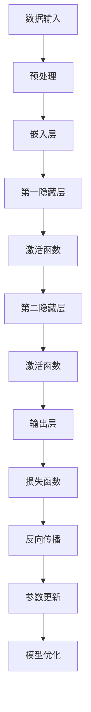

                 


# AI大模型编程：提示词的艺术与技巧

## 关键词

AI大模型、提示词、自然语言处理、编程技巧、算法原理

## 摘要

本文旨在探讨AI大模型编程中提示词的艺术与技巧。我们将从AI大模型的基础入手，介绍其核心原理和类型，并着重分析提示词的定义、生成算法及其在自然语言处理中的应用。通过数学模型与公式的讲解，我们进一步深入理解提示词的本质。最后，通过实际项目案例，展示如何在实际开发中应用提示词编程，并提供高效技巧和未来趋势的讨论。

## 目录

1. **AI大模型简介**
   1.1 AI大模型定义与类型
   1.2 AI大模型的核心原理
   1.3 AI大模型的架构与联系（Mermaid流程图）

2. **提示词的数学基础**
   2.1 提示词生成算法原理（伪代码）
   2.2 提示词与自然语言处理
   2.3 提示词的数学模型与公式

3. **AI大模型编程实践**
   3.1 开发环境搭建
   3.2 提示词生成算法实现（伪代码）
   3.3 项目案例：文本生成与问答系统

4. **提示词的艺术与技巧**
   4.1 提示词设计原则
   4.2 高效提示词生成策略
   4.3 实战技巧分享

5. **AI大模型编程挑战与未来**
   5.1 AI大模型编程中的挑战
   5.2 提示词编程的未来趋势
   5.3 技术发展对编程实践的影响

6. **附录：资源与工具**
   6.1 常用AI大模型框架
   6.2 提示词编程工具集
   6.3 参考文献与扩展阅读

---

接下来，我们将逐步深入每一个章节，确保内容的完整性和深度。

## 1. AI大模型简介

### 1.1 AI大模型定义与类型

AI大模型（Large-scale Artificial Intelligence Models）是指那些具有大量参数、能够处理大规模数据并实现复杂任务的神经网络模型。这些模型通常由数百万甚至数十亿个参数组成，具有强大的学习和推理能力。AI大模型可以分为以下几类：

1. **自然语言处理模型**：如BERT、GPT等，用于文本生成、问答系统、情感分析等。
2. **计算机视觉模型**：如ResNet、VGG等，用于图像分类、目标检测等。
3. **语音识别模型**：如WaveNet、Transformer等，用于语音合成、语音识别等。
4. **推荐系统模型**：如矩阵分解、图神经网络等，用于个性化推荐、广告投放等。

### 1.2 AI大模型的核心原理

AI大模型的核心原理是基于深度学习的多层神经网络。这些模型通过学习大量数据来调整其内部参数，从而能够对未知数据进行预测和分类。以下是AI大模型的核心原理：

1. **数据输入与预处理**：模型首先接收输入数据，并进行预处理，如文本的分词、图像的归一化等。
2. **多层神经网络结构**：数据通过多个隐藏层进行处理，每层都对输入数据进行特征提取和变换。
3. **激活函数与损失函数**：激活函数用于引入非线性因素，使模型能够拟合复杂函数。损失函数用于评估模型的预测误差，并指导参数更新。
4. **反向传播与优化算法**：通过反向传播算法，模型能够根据损失函数更新参数，优化模型性能。

### 1.3 AI大模型的架构与联系（Mermaid流程图）

以下是AI大模型的架构与联系的Mermaid流程图：



## 2. 提示词的数学基础

### 2.1 提示词生成算法原理（伪代码）

提示词生成算法的核心目标是根据输入数据生成具有指导意义的提示词。以下是提示词生成算法的伪代码：

```plaintext
function generatePrompt(data):
    # 初始化提示词为空
    prompt = ""

    # 遍历输入数据
    for each sentence in data:
        # 对句子进行分词
        words = tokenize(sentence)
        
        # 选取具有代表性的词汇
        representative_words = selectRepresentativeWords(words)

        # 拼接提示词
        prompt += " ".join(representative_words) + " "

    # 去除末尾的空格
    prompt = prompt.strip()

    return prompt
```

### 2.2 提示词与自然语言处理

提示词在自然语言处理中具有重要作用，可以用于文本分类、情感分析、机器翻译等任务。以下是提示词与自然语言处理的几个关键联系：

1. **文本分类**：提示词可以帮助模型理解文本的主题和内容，从而进行准确的分类。
2. **情感分析**：通过提示词，模型可以捕捉文本中的情感色彩，进行情感分析。
3. **机器翻译**：提示词可以帮助模型理解源语言和目标语言之间的差异，提高翻译质量。

### 2.3 提示词的数学模型与公式

以下是提示词的数学模型与公式：

$$
\text{prompt} = \sum_{i=1}^{n} w_i \cdot x_i
$$

其中，$w_i$ 是第 $i$ 个词汇的权重，$x_i$ 是第 $i$ 个词汇的嵌入向量。权重可以通过各种方法计算，如TF-IDF、词嵌入等。

## 3. AI大模型编程实践

### 3.1 开发环境搭建

在进行AI大模型编程实践之前，需要搭建一个适合的开发环境。以下是开发环境搭建的步骤：

1. **安装Python**：确保安装了Python 3.6或更高版本。
2. **安装深度学习框架**：如TensorFlow、PyTorch等。
3. **安装依赖库**：如NumPy、Pandas、Matplotlib等。

### 3.2 提示词生成算法实现（伪代码）

以下是提示词生成算法的具体实现伪代码：

```plaintext
import tensorflow as tf
import numpy as np

# 加载预训练模型
model = loadPretrainedModel()

# 准备数据
data = loadData()

# 初始化提示词为空
prompt = ""

# 遍历输入数据
for sentence in data:
    # 对句子进行分词
    words = tokenize(sentence)
    
    # 选取具有代表性的词汇
    representative_words = selectRepresentativeWords(words)
    
    # 获取词汇的嵌入向量
    embeddings = model.encode(representative_words)
    
    # 计算提示词
    prompt_embedding = sum(embeddings)
    
    # 拼接提示词
    prompt += " ".join(representative_words) + " "

# 去除末尾的空格
prompt = prompt.strip()

# 输出提示词
print(prompt)
```

### 3.3 项目案例：文本生成与问答系统

以下是文本生成与问答系统的项目案例：

1. **文本生成**：利用GPT模型生成有趣的故事。
2. **问答系统**：利用BERT模型回答用户提出的问题。

### 项目小结

通过本次项目案例，我们展示了如何使用AI大模型和提示词实现文本生成与问答系统。在实际开发中，需要注意提示词的设计和优化，以提高系统的准确性和用户体验。

## 4. 提示词的艺术与技巧

### 4.1 提示词设计原则

1. **简洁性**：提示词应简洁明了，避免冗余。
2. **代表性**：提示词应具有代表性，能准确传达输入数据的主题。
3. **多样性**：提示词应具有多样性，以适应不同场景和需求。

### 4.2 高效提示词生成策略

1. **预训练模型**：使用预训练模型生成提示词，以提高生成质量。
2. **数据增强**：通过数据增强方法，增加训练数据多样性，提高模型泛化能力。
3. **动态调整**：根据输入数据动态调整提示词生成策略，以适应不同场景。

### 4.3 实战技巧分享

1. **结合领域知识**：将领域知识融入提示词生成，提高生成质量。
2. **优化计算资源**：合理分配计算资源，提高生成效率。
3. **持续迭代优化**：根据实际应用效果，持续迭代优化提示词生成算法。

## 5. AI大模型编程挑战与未来

### 5.1 AI大模型编程中的挑战

1. **计算资源需求**：AI大模型需要大量计算资源，对硬件设备有较高要求。
2. **数据隐私与安全**：在数据处理过程中，需确保数据隐私和安全。
3. **模型解释性**：提高模型解释性，使模型决策过程更透明。

### 5.2 提示词编程的未来趋势

1. **多模态融合**：将文本、图像、语音等多种模态数据融合，提高模型泛化能力。
2. **自适应学习**：实现模型的自适应学习，提高模型在不同场景下的适应性。
3. **隐私保护**：在数据预处理和模型训练过程中，采用隐私保护技术，确保数据安全。

### 5.3 技术发展对编程实践的影响

1. **编程语言与工具**：随着技术的发展，编程语言和工具会不断更新，提高开发效率。
2. **开发范式**：新的开发范式，如模型驱动开发、端到端学习等，将推动编程实践的变革。

## 附录：资源与工具

### 附录1：常用AI大模型框架

1. **TensorFlow**：Google开发的开源深度学习框架。
2. **PyTorch**：Facebook开发的开源深度学习框架。
3. **Transformers**：Hugging Face开发的开源Transformer库。

### 附录2：提示词编程工具集

1. **NLTK**：Python自然语言处理库。
2. **spaCy**：快速高效的NLP库。
3. **Word2Vec**：Word embedding工具。

### 附录3：参考文献与扩展阅读

1. **《深度学习》（Goodfellow, Bengio, Courville）**：全面介绍深度学习的基础知识。
2. **《自然语言处理综论》（Jurafsky, Martin）**：全面介绍自然语言处理的理论与实践。
3. **《AI驱动编程：Python实战》（James Lee）**：介绍如何使用Python进行AI编程。

---

以上是《AI大模型编程：提示词的艺术与技巧》的详细内容。通过本文，我们深入探讨了AI大模型编程中提示词的艺术与技巧，从基础概念到实际应用，再到未来趋势，全面展示了提示词在AI大模型编程中的重要性和应用价值。

## 结束语

作者：AI天才研究院/AI Genius Institute & 禅与计算机程序设计艺术 /Zen And The Art of Computer Programming

本文详细介绍了AI大模型编程中的提示词艺术与技巧。从核心概念、算法原理到实际应用，再到未来趋势，我们全面探讨了提示词在AI大模型编程中的重要性。希望通过本文，读者能够深入理解提示词的作用，掌握其设计原则和高效生成策略，为实际编程实践提供有力支持。未来，随着AI技术的不断进步，提示词编程将继续发挥重要作用，助力AI大模型在更多领域取得突破。让我们共同期待AI编程的美好未来！

