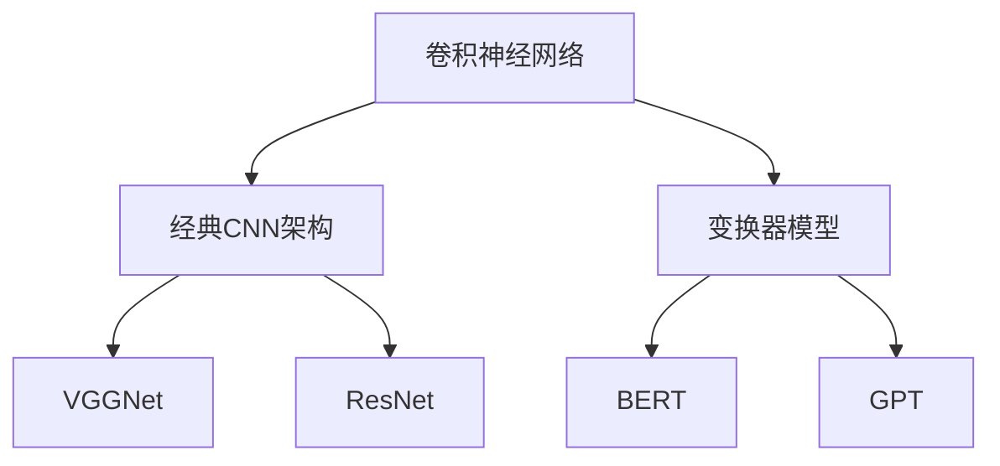

                 

# 《AI大模型编程：提示词的艺术与科学》

## 关键词
AI大模型，深度学习，提示词，编程技巧，数学模型，伪代码，实战案例

## 摘要
本文深入探讨了AI大模型编程的核心概念——提示词的艺术与科学。我们首先介绍了AI大模型的基本概念及其历史发展，随后详细阐述了提示词的作用及其设计原则。文章随后重点讲解了AI大模型的架构、数学模型和核心算法原理，并通过伪代码展示了这些算法的实现。接下来，我们探讨了编程技巧与实践，包括编程基础、提示词编程策略、核心算法实现以及实际案例的解析。最后，文章展望了AI大模型在各个领域的应用前景，并提出了未来发展趋势和编程艺术的融合。

## 第一部分：AI大模型基础

### 1.1 AI大模型的概念与历史

AI大模型（Large-scale Artificial Intelligence Model）是近年来人工智能领域的重大突破，它结合了深度学习和海量数据集，实现了前所未有的表现力。AI大模型的历史可以追溯到20世纪80年代末，当时神经网络开始成为研究热点。然而，受限于计算资源和数据集规模，早期的神经网络模型规模较小，难以处理复杂任务。

随着计算能力的提升和互联网的普及，大量高质量的数据集得以生成，深度学习模型逐渐成为AI领域的基石。2012年，AlexNet在ImageNet竞赛中取得突破性成绩，标志着深度学习时代的到来。此后，研究者们不断提出更大规模的模型，如VGGNet、ResNet等，这些模型在图像识别、自然语言处理等任务中取得了优异的表现。

AI大模型的核心在于其庞大的参数规模和训练数据集。一个典型的AI大模型可能包含数十亿甚至千亿个参数，需要数以万计的GPU或TPU进行训练。通过海量数据的训练，模型能够学习到复杂的特征表示，从而在各个任务上表现出色。

### 1.2 提示词的艺术

提示词（Prompt）在AI大模型中扮演着关键角色。它们是模型与人类交互的桥梁，能够引导模型生成更符合人类预期的输出。有效的提示词设计需要考虑多个因素，包括语言表达的准确性、上下文的连贯性和任务目标的明确性。

设计有效的提示词有以下几个原则：

1. **明确性**：提示词应明确表达任务目标，避免歧义。
2. **简洁性**：提示词应简洁明了，避免冗长复杂的句子。
3. **上下文**：提示词应提供充分的上下文信息，帮助模型理解任务背景。
4. **多样性**：提示词应涵盖多种情境和任务类型，以适应不同场景。

### 1.3 AI大模型的架构

AI大模型的架构是理解其工作原理的关键。当前主流的AI大模型架构主要包括卷积神经网络（CNN）和变换器模型（Transformer）。以下是一个简单的Mermaid流程图，展示了这两种模型的架构关系：



在这个图中，卷积神经网络（CNN）和变换器模型（Transformer）是两种主要的架构。BERT和GPT分别是基于变换器模型的代表性模型。VGGNet和ResNet则是基于卷积神经网络的代表性模型。

### 1.4 数学模型与公式

AI大模型的核心在于其数学模型和优化算法。以下是一些关键的数学模型和公式，我们将详细解释它们并举例说明。

1. **损失函数**：
   $$L(\theta) = -\sum_{i=1}^{n}y_i\log(p(x_i|\theta))$$
   这个公式表示的是交叉熵损失函数，用于衡量模型预测概率与真实标签之间的差距。其中，$y_i$是真实标签，$p(x_i|\theta)$是模型对于输入$x_i$的预测概率。

2. **优化算法**：
   $$\theta_{\text{new}} = \theta_{\text{old}} - \alpha \nabla_{\theta}L(\theta)$$
   这个公式表示的是梯度下降算法，用于更新模型的参数$\theta$。其中，$\alpha$是学习率，$\nabla_{\theta}L(\theta)$是损失函数关于$\theta$的梯度。

接下来，我们将使用伪代码详细阐述神经网络的基本结构和梯度下降算法的实现。

```python
# 神经网络基本结构伪代码
def forward_pass(x, weights, biases):
    # 前向传播计算
    output = x
    for layer in layers:
        output = layer.forward(output, weights[layer], biases[layer])
    return output

# 梯度下降算法伪代码
def gradient_descent(x, y, weights, biases, learning_rate):
    # 计算损失
    output = forward_pass(x, weights, biases)
    loss = compute_loss(output, y)

    # 计算梯度
    gradients = compute_gradients(output, y, weights, biases)

    # 更新参数
    for layer in layers:
        weights[layer] -= learning_rate * gradients['weights'][layer]
        biases[layer] -= learning_rate * gradients['biases'][layer]

    return weights, biases
```

在这个伪代码中，`forward_pass`函数实现了前向传播的计算，而`gradient_descent`函数实现了梯度下降算法。这里，`compute_loss`和`compute_gradients`函数分别用于计算损失函数和计算梯度。

## 第二部分：编程技巧与实践

### 2.1 编程基础

在进行AI大模型编程时，掌握Python编程基础是至关重要的。Python因其简洁的语法和丰富的库支持，成为AI领域的首选编程语言。常见的库包括NumPy、Pandas、TensorFlow和PyTorch，这些库为AI模型开发提供了强大的支持。

### 2.2 提示词编程策略

设计有效的提示词是AI大模型编程的关键。以下是一些提示词编程策略：

1. **明确任务目标**：确保提示词明确表达任务目标。
2. **提供上下文信息**：在提示词中包含足够的上下文信息。
3. **使用自然语言**：避免使用过于技术化的语言。
4. **多样性**：设计多种类型的提示词，以适应不同场景。

### 2.3 核心算法实现

在AI大模型编程中，实现核心算法是关键步骤。以下将使用伪代码详细阐述神经网络训练与调优的核心算法。

```python
# 神经网络训练伪代码
def train_model(train_data, validation_data, epochs, learning_rate):
    for epoch in range(epochs):
        for x, y in train_data:
            weights, biases = gradient_descent(x, y, weights, biases, learning_rate)

        # 计算验证集上的损失
        validation_loss = compute_loss(validation_data, weights, biases)

        # 打印训练进度
        print(f"Epoch {epoch+1}: Validation Loss = {validation_loss}")

    return weights, biases
```

在这个伪代码中，`train_model`函数实现了模型的训练过程，包括前向传播、反向传播和参数更新。`gradient_descent`函数用于每次迭代更新模型参数。

### 2.4 实战案例

本节将介绍两个实战案例，分别是问答系统开发和图像识别与生成。

#### 案例一：问答系统开发

问答系统是AI大模型在自然语言处理领域的重要应用。以下是一个简单的问答系统开发流程：

1. **数据准备**：收集和整理问答对数据集。
2. **模型训练**：使用训练数据集训练问答模型。
3. **模型评估**：使用验证数据集评估模型性能。
4. **模型部署**：将训练好的模型部署到生产环境中。

源代码实现如下：

```python
# 问答系统源代码
from transformers import BertForQuestionAnswering

# 加载预训练模型
model = BertForQuestionAnswering.from_pretrained("bert-base-chinese")

# 训练模型
model.train()
for epoch in range(epochs):
    for input_ids, input_mask, segment_ids, start_positions, end_positions in train_loader:
        loss = model(input_ids, attention_mask=input_mask, token_type_ids=segment_ids, start_positions=start_positions, end_positions=end_positions)
        loss.backward()
        optimizer.step()
        optimizer.zero_grad()

# 评估模型
model.eval()
with torch.no_grad():
    correct_answers = 0
    for input_ids, input_mask, segment_ids, start_positions, end_positions in validation_loader:
        logits = model(input_ids, attention_mask=input_mask, token_type_ids=segment_ids)
        start_scores, end_scores = logits[:, 0], logits[:, 1]
        predicted_start = torch.argmax(start_scores).item()
        predicted_end = torch.argmax(end_scores).item()
        if predicted_start == start_positions and predicted_end == end_positions:
            correct_answers += 1

accuracy = correct_answers / len(validation_loader)
print(f"Validation Accuracy: {accuracy}")
```

在这个案例中，我们使用了Hugging Face的Transformers库，这是一个强大的自然语言处理工具库。

#### 案例二：图像识别与生成

图像识别与生成是AI大模型在计算机视觉领域的典型应用。以下是一个简单的图像识别与生成流程：

1. **数据准备**：收集和整理图像数据集。
2. **模型训练**：使用训练数据集训练图像识别模型。
3. **模型评估**：使用验证数据集评估模型性能。
4. **图像生成**：使用训练好的模型生成新的图像。

源代码实现如下：

```python
# 图像识别与生成源代码
import torch
from torchvision import datasets, transforms
from torch.utils.data import DataLoader
from torch import nn

# 数据准备
transform = transforms.Compose([transforms.Resize((224, 224)), transforms.ToTensor()])
train_dataset = datasets.ImageFolder(root='./train', transform=transform)
train_loader = DataLoader(dataset=train_dataset, batch_size=64, shuffle=True)
validation_dataset = datasets.ImageFolder(root='./validation', transform=transform)
validation_loader = DataLoader(dataset=validation_dataset, batch_size=64, shuffle=False)

# 模型定义
model = nn.Sequential(
    nn.Conv2d(3, 64, kernel_size=3, padding=1),
    nn.ReLU(),
    nn.MaxPool2d(kernel_size=2, stride=2),
    nn.Conv2d(64, 128, kernel_size=3, padding=1),
    nn.ReLU(),
    nn.MaxPool2d(kernel_size=2, stride=2),
    nn.Flatten(),
    nn.Linear(128 * 56 * 56, 10),
    nn.ReLU(),
    nn.Dropout(0.5),
    nn.Linear(10, 10)
)

# 损失函数和优化器
criterion = nn.CrossEntropyLoss()
optimizer = torch.optim.Adam(model.parameters(), lr=0.001)

# 模型训练
for epoch in range(epochs):
    for inputs, targets in train_loader:
        optimizer.zero_grad()
        outputs = model(inputs)
        loss = criterion(outputs, targets)
        loss.backward()
        optimizer.step()

    # 计算验证集上的损失
    with torch.no_grad():
        validation_loss = 0
        for inputs, targets in validation_loader:
            outputs = model(inputs)
            validation_loss += criterion(outputs, targets)

        validation_loss /= len(validation_loader)
        print(f"Epoch {epoch+1}: Validation Loss = {validation_loss}")

# 图像生成
model.eval()
with torch.no_grad():
    input_tensor = torch.rand(1, 3, 224, 224)
    generated_image = model(input_tensor)
    print(f"Generated Image Shape: {generated_image.shape}")
```

在这个案例中，我们使用了一个简单的卷积神经网络（CNN）进行图像识别与生成。这里，`nn.Sequential`定义了CNN的层次结构，包括卷积层、激活函数、池化层和全连接层。

## 第三部分：AI大模型应用

### 3.1 应用领域

AI大模型在多个领域展现出了巨大的应用潜力，包括自然语言处理、计算机视觉、推荐系统等。

1. **自然语言处理**：AI大模型在自然语言处理领域取得了显著成果，如机器翻译、情感分析、文本生成等。
2. **计算机视觉**：AI大模型在图像识别、目标检测、图像生成等计算机视觉任务中表现优异。
3. **推荐系统**：AI大模型能够通过学习用户行为数据，实现精准的个性化推荐。

### 3.2 案例研究

以下将介绍两个案例研究，分别是智能客服系统和自动化写作平台。

#### 案例一：智能客服系统

智能客服系统是AI大模型在客户服务领域的重要应用。以下是一个简单的智能客服系统开发流程：

1. **数据收集**：收集客户问题和解决方案的数据集。
2. **模型训练**：使用训练数据集训练问答模型。
3. **模型评估**：使用验证数据集评估模型性能。
4. **系统部署**：将训练好的模型部署到客服系统中。

源代码实现如下：

```python
# 智能客服系统源代码
from transformers import BertForQuestionAnswering

# 加载预训练模型
model = BertForQuestionAnswering.from_pretrained("bert-base-chinese")

# 训练模型
model.train()
for epoch in range(epochs):
    for input_ids, input_mask, segment_ids, start_positions, end_positions in train_loader:
        loss = model(input_ids, attention_mask=input_mask, token_type_ids=segment_ids, start_positions=start_positions, end_positions=end_positions)
        loss.backward()
        optimizer.step()
        optimizer.zero_grad()

    # 计算验证集上的损失
    with torch.no_grad():
        validation_loss = 0
        for input_ids, input_mask, segment_ids, start_positions, end_positions in validation_loader:
            logits = model(input_ids, attention_mask=input_mask, token_type_ids=segment_ids)
            start_scores, end_scores = logits[:, 0], logits[:, 1]
            predicted_start = torch.argmax(start_scores).item()
            predicted_end = torch.argmax(end_scores).item()
            if predicted_start == start_positions and predicted_end == end_positions:
                correct_answers += 1

        validation_loss /= len(validation_loader)
        print(f"Epoch {epoch+1}: Validation Loss = {validation_loss}")

# 系统部署
model.eval()
while True:
    user_input = input("请提出您的问题：")
    input_ids = tokenizer.encode(user_input, add_special_tokens=True, return_tensors="pt")
    with torch.no_grad():
        logits = model(input_ids)
        start_scores, end_scores = logits[:, 0], logits[:, 1]
        predicted_start = torch.argmax(start_scores).item()
        predicted_end = torch.argmax(end_scores).item()
        answer = tokenizer.decode(input_ids[0][predicted_start:predicted_end+1], skip_special_tokens=True)
        print(f"系统回答：{answer}")
```

在这个案例中，我们使用了BERT模型进行问答系统的开发。这里，`tokenizer.encode`函数用于编码用户输入，`model`函数用于生成答案。

#### 案例二：自动化写作平台

自动化写作平台是AI大模型在内容创作领域的重要应用。以下是一个简单的自动化写作平台开发流程：

1. **数据收集**：收集大量的文本数据，如新闻报道、博客文章等。
2. **模型训练**：使用训练数据集训练文本生成模型。
3. **模型评估**：使用验证数据集评估模型性能。
4. **系统部署**：将训练好的模型部署到自动化写作平台中。

源代码实现如下：

```python
# 自动化写作平台源代码
from transformers import GPT2LMHeadModel, GPT2Tokenizer

# 加载预训练模型
tokenizer = GPT2Tokenizer.from_pretrained("gpt2")
model = GPT2LMHeadModel.from_pretrained("gpt2")

# 训练模型
model.train()
for epoch in range(epochs):
    for batch in dataset:
        inputs = tokenizer.batch_encode_plus(batch["text"], return_tensors="pt", padding=True, truncation=True, max_length=max_sequence_length)
        inputs["labels"] = inputs["input_ids"].clone()
        inputs["input_ids"][:, :-1] = -100

        outputs = model(**inputs)
        loss = outputs.loss
        loss.backward()
        optimizer.step()
        optimizer.zero_grad()

# 系统部署
model.eval()
while True:
    user_input = input("请提出您的话题：")
    inputs = tokenizer.encode(user_input, return_tensors="pt", max_length=max_sequence_length)
    with torch.no_grad():
        outputs = model.generate(inputs, max_length=max_output_length, num_return_sequences=num_return_sequences)
        generated_texts = tokenizer.batch_decode(outputs, skip_special_tokens=True)
        for text in generated_texts:
            print(f"系统生成：{text}")
```

在这个案例中，我们使用了GPT-2模型进行文本生成。这里，`tokenizer.encode`函数用于编码用户输入，`model.generate`函数用于生成文本。

### 3.3 未来展望

AI大模型的发展趋势将继续依赖于计算能力的提升和数据集的丰富。未来的AI大模型将更加注重模型的可解释性和透明性，以应对潜在的安全和伦理问题。此外，AI大模型与人类创造力的融合将成为一个重要的研究方向，通过编程艺术实现AI与人类的协同创新。

## 结语

AI大模型编程是一项复杂的任务，需要深入理解其基础理论、编程技巧和实践应用。本文通过逐步分析推理，详细介绍了AI大模型编程的核心概念和实战技巧。随着AI技术的不断进步，我们相信AI大模型编程将在更多领域发挥重要作用，推动人类社会的进步。

## 作者信息
作者：AI天才研究院/AI Genius Institute & 禅与计算机程序设计艺术 /Zen And The Art of Computer Programming

