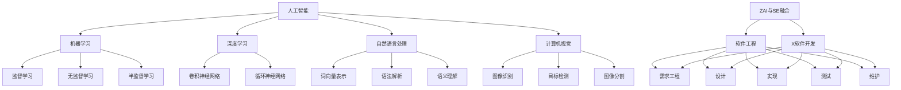

                 

### 文章标题

# AI时代的软件工程创新管理方法

> 关键词：人工智能、软件工程、创新管理、敏捷开发、DevOps、团队协作、风险管理

> 摘要：本文深入探讨了AI时代软件工程创新管理方法的各个方面，包括AI对软件工程的影响、AI时代软件工程的挑战与机遇、创新管理策略、敏捷开发与DevOps实践、团队协作与风险管理等。通过分析核心概念与联系，本文为软件工程从业人员提供了一套系统的创新管理方法，以应对AI时代的变革。

## 引言

### 1.1 背景与重要性

随着人工智能（AI）技术的迅猛发展，各行各业都受到了深远的影响。AI技术在自动化、优化、决策支持等方面的应用，使得软件工程领域面临着前所未有的机遇与挑战。软件工程作为AI时代的核心技术之一，其创新管理方法的研究显得尤为重要。

AI时代软件工程创新管理方法的研究背景可以从以下几个方面来理解：

1. **AI技术的进步**：随着深度学习、强化学习等算法的突破，AI技术的应用范围越来越广泛，对软件工程的影响也愈发显著。传统软件工程方法已无法满足AI时代的需求，创新管理方法成为必然选择。

2. **软件工程面临的挑战**：AI技术的应用带来了数据处理、算法可靠性、系统复杂性等问题。如何将这些挑战转化为机遇，实现软件工程的创新管理，是当前软件工程领域亟待解决的重要问题。

3. **企业管理需求的转变**：在AI时代，企业对软件工程的需求从单纯的技术实现转向了全面的创新管理。如何通过创新管理提高软件项目的成功率、降低风险，是企业关注的重点。

因此，研究AI时代的软件工程创新管理方法具有重要的现实意义。本文将从以下几个方面展开讨论：

1. **AI时代软件工程概述**：介绍AI时代软件工程的核心概念、原理、技术等，为后续讨论奠定基础。
2. **AI时代软件工程面临的挑战**：分析AI时代软件工程在技术、管理、伦理等方面面临的挑战。
3. **AI时代软件工程的创新方法**：探讨AI时代软件工程的创新方法，包括新技术应用、敏捷开发、DevOps等。
4. **AI时代软件工程的管理策略**：介绍AI时代软件工程的管理策略，包括团队管理、项目管理、风险管理等。
5. **案例研究**：通过分析成功和失败案例，总结AI时代软件工程创新管理方法的经验教训。
6. **展望未来**：探讨AI时代软件工程的发展趋势，以及创新管理方法的新趋势。

### 1.2 研究目的与内容框架

本文的研究目的是探讨AI时代的软件工程创新管理方法，为软件工程从业人员提供一套系统的指导方案。具体研究内容包括：

1. **AI时代软件工程概述**：介绍AI时代软件工程的核心概念、原理、技术等，包括AI基础概念、软件工程核心概念、AI与软件工程的融合等。

2. **AI时代软件工程面临的挑战**：分析AI时代软件工程在技术、管理、伦理等方面面临的挑战，包括大数据处理、AI算法可靠性、软件工程方法论更新等。

3. **AI时代软件工程的创新方法**：探讨AI时代软件工程的创新方法，包括深度学习、自然语言处理、强化学习等新技术应用，以及敏捷开发、DevOps等实践。

4. **AI时代软件工程的管理策略**：介绍AI时代软件工程的管理策略，包括团队管理、项目管理、风险管理等，讨论如何通过创新管理提高软件项目的成功率。

5. **案例研究**：通过分析成功和失败案例，总结AI时代软件工程创新管理方法的经验教训。

6. **展望未来**：探讨AI时代软件工程的发展趋势，以及创新管理方法的新趋势。

本文的结构安排如下：

1. 引言：介绍AI时代软件工程创新管理方法的研究背景、目的与内容框架。
2. 第一部分 AI时代软件工程概述：介绍AI时代软件工程的核心概念、原理、技术等。
3. 第二部分 AI时代软件工程面临的挑战：分析AI时代软件工程在技术、管理、伦理等方面面临的挑战。
4. 第三部分 AI时代软件工程的创新方法：探讨AI时代软件工程的创新方法，包括新技术应用、敏捷开发、DevOps等。
5. 第四部分 AI时代软件工程的管理策略：介绍AI时代软件工程的管理策略，包括团队管理、项目管理、风险管理等。
6. 第五部分 案例研究：通过分析成功和失败案例，总结AI时代软件工程创新管理方法的经验教训。
7. 第六部分 展望未来：探讨AI时代软件工程的发展趋势，以及创新管理方法的新趋势。

通过本文的研究，我们希望为软件工程从业人员提供一套实用的AI时代软件工程创新管理方法，帮助他们在面对变革时能够从容应对，实现软件项目的成功。接下来，我们将进入第一部分，介绍AI时代软件工程的核心概念、原理和技术。

## 第一部分 AI时代软件工程概述

### 2.1 核心概念与联系

在AI时代，软件工程的核心概念与技术发生了深刻的变化。本节将介绍AI基础概念、软件工程核心概念以及AI与软件工程的融合，为后续讨论奠定基础。

#### 2.1.1 AI基础概念

人工智能（Artificial Intelligence，AI）是指通过计算机模拟人类的智能行为，使其能够执行一些复杂的任务。AI的核心技术包括机器学习、深度学习、自然语言处理、计算机视觉等。

- **机器学习**：机器学习（Machine Learning，ML）是一种通过数据驱动的方法，让计算机自动学习并改进性能的技术。主要分为监督学习、无监督学习和半监督学习。

- **深度学习**：深度学习（Deep Learning，DL）是机器学习的一个子领域，通过构建多层神经网络来提取数据中的特征。其代表性算法包括卷积神经网络（CNN）、循环神经网络（RNN）等。

- **自然语言处理**：自然语言处理（Natural Language Processing，NLP）是人工智能的一个分支，旨在使计算机能够理解、生成和处理人类语言。主要技术包括词向量表示、语法解析、语义理解等。

- **计算机视觉**：计算机视觉（Computer Vision，CV）是人工智能的一个重要领域，旨在使计算机能够从图像或视频中提取信息。主要技术包括图像识别、目标检测、图像分割等。

#### 2.1.2 软件工程核心概念

软件工程（Software Engineering，SE）是关于软件设计、开发、维护和管理的一门工程学科。其核心概念包括需求工程、设计、实现、测试、维护等。

- **需求工程**：需求工程是软件工程的起点，旨在理解和定义用户需求，确保最终产品满足用户需求。

- **设计**：设计是软件工程中的关键环节，包括系统设计、架构设计、模块设计等。好的设计能够提高软件的可维护性和扩展性。

- **实现**：实现是将设计转化为实际的代码。在实现过程中，程序员需要编写高质量的代码，遵循良好的编程规范。

- **测试**：测试是确保软件质量的关键环节，包括单元测试、集成测试、系统测试等。通过测试可以发现和修复软件中的缺陷。

- **维护**：维护是软件生命周期中的一个长期过程，包括修复缺陷、添加新功能、性能优化等。

#### 2.1.3 AI与软件工程的融合

随着AI技术的发展，AI与软件工程的融合变得越来越紧密。AI技术为软件工程带来了新的工具和方法，使得软件设计、开发、测试、维护等环节都发生了深刻的变化。

- **AI在软件开发中的应用**：AI技术可以用于需求工程，通过自然语言处理技术提取用户需求；在设计阶段，AI可以辅助设计生成高质量的设计方案；在实现阶段，AI可以帮助编写代码、优化算法；在测试阶段，AI可以用于自动化测试、缺陷预测等。

- **AI在软件维护中的应用**：AI技术可以用于软件缺陷预测、性能优化、自动化更新等。通过AI技术，软件维护变得更加高效和智能化。

- **AI与软件工程方法论的结合**：传统的软件工程方法论，如瀑布模型、敏捷开发等，都在与AI技术结合，形成新的方法论，如AI驱动的开发、AI辅助的测试等。

为了更好地理解AI与软件工程的融合，我们可以使用Mermaid流程图来展示核心概念之间的关系：



通过以上核心概念与联系的介绍，我们为后续的讨论奠定了基础。在下一节中，我们将深入探讨AI时代软件工程原理，分析AI技术在软件工程中的应用。

### 2.2 AI时代软件工程原理

在AI时代，软件工程原理发生了深刻的变化。本节将介绍AI时代软件工程的基本原理，包括AI算法原理、软件工程方法论以及AI时代软件工程流程。

#### 2.2.1 AI算法原理

AI算法是AI时代软件工程的核心。以下是一些常见的AI算法及其原理：

- **监督学习**：监督学习（Supervised Learning）是一种从标记数据中学习的方法。其基本原理是通过输入和输出数据对，学习出一个映射函数，从而对新数据进行预测。

  伪代码如下：

  ```python
  # 输入：训练数据集 (x, y)
  # 输出：预测函数 f(x)
  for each (x, y) in dataset do
      # 训练模型
      model.train(x, y)
  end for
  # 预测新数据
  predict_value = model.predict(x_new)
  ```

- **无监督学习**：无监督学习（Unsupervised Learning）是从未标记数据中学习的方法。其基本原理是寻找数据中的隐含结构或模式。

  伪代码如下：

  ```python
  # 输入：数据集 x
  # 输出：聚类结果
  clusters = model.cluster(x)
  ```

- **深度学习**：深度学习（Deep Learning）是一种多层神经网络的学习方法。其基本原理是通过反向传播算法，不断调整网络权重，以最小化损失函数。

  伪代码如下：

  ```python
  # 输入：训练数据集 (x, y)
  # 输出：预测函数 f(x)
  for epoch in 1 to max_epochs do
      # 前向传播
      z = model.forward(x)
      # 计算损失
      loss = model.loss(z, y)
      # 反向传播
      dz = model.backward(z)
      # 更新权重
      model.update_weights(dz)
  end for
  ```

#### 2.2.2 软件工程方法论

AI时代软件工程方法论发生了显著变化。以下是一些重要的软件工程方法论：

- **瀑布模型**：瀑布模型（Waterfall Model）是一种传统的软件工程方法论，将软件生命周期划分为需求分析、设计、实现、测试、部署等阶段。其优点是结构清晰、易于管理，缺点是灵活性差、成本高。

- **敏捷开发**：敏捷开发（Agile Development）是一种以人为核心、迭代和协作的软件开发方法。其核心原则是响应变化、快速交付、持续改进。敏捷开发包括Scrum、XP（极限编程）等实践。

  敏捷开发流程如下：

  ```mermaid
  graph TD
      A[需求分析] --> B[设计]
      B --> C[编码]
      C --> D[测试]
      D --> E[部署]
      F[反馈与迭代] --> A
  ```

- **DevOps**：DevOps是一种结合软件开发（Development）和运维（Operations）的方法论，强调持续集成、持续交付和基础设施即代码。其目的是提高软件交付的速度和质量。

  DevOps流程如下：

  ```mermaid
  graph TD
      A[需求分析] --> B[设计]
      B --> C[开发]
      C --> D[测试]
      D --> E[集成]
      E --> F[部署]
      F --> G[监控与维护]
  ```

#### 2.2.3 AI时代软件工程流程

AI时代软件工程流程在传统流程的基础上，增加了AI算法设计和优化、数据预处理和特征工程等环节。

- **需求分析**：在AI时代，需求分析不仅包括功能需求，还包括AI算法需求。例如，需要确定使用的算法类型、算法参数等。

- **数据预处理**：数据预处理是AI时代软件工程的关键环节。通过数据清洗、归一化、特征选择等步骤，提高数据质量，为后续的算法训练和优化提供支持。

  伪代码如下：

  ```python
  # 输入：原始数据集 x
  # 输出：预处理后的数据集 x_processed
  x_processed = data_preprocessing(x)
  ```

- **特征工程**：特征工程是AI时代软件工程的重要环节。通过选择、构造和转换特征，提高模型性能。

  伪代码如下：

  ```python
  # 输入：数据集 x
  # 输出：特征矩阵 X
  X = feature_engineering(x)
  ```

- **算法设计与优化**：在AI时代，算法设计与优化是软件工程的核心。通过选择合适的算法、调整算法参数、优化算法性能，提高软件质量。

  伪代码如下：

  ```python
  # 输入：算法模型 model
  # 输出：优化后的模型 model_optimized
  model_optimized = algorithm_optimization(model)
  ```

- **测试与部署**：在AI时代，测试与部署也发生了变化。通过自动化测试、持续集成、持续交付等实践，提高软件交付速度和质量。

  伪代码如下：

  ```python
  # 输入：测试集 x_test
  # 输出：测试结果 test_results
  test_results = model.test(x_test)
  ```

通过以上对AI时代软件工程原理的介绍，我们为理解AI时代软件工程的挑战与机遇奠定了基础。在下一节中，我们将分析AI时代软件工程面临的挑战。

### 2.3 AI时代软件工程面临的挑战

AI技术的快速发展给软件工程带来了巨大的机遇，但同时也带来了许多挑战。本节将分析AI时代软件工程在技术、管理、伦理等方面面临的挑战。

#### 2.3.1 技术挑战

1. **大数据处理**：随着数据量的爆炸式增长，如何高效地处理和分析大数据成为AI时代软件工程的一大挑战。大数据处理涉及到数据存储、数据清洗、数据挖掘、实时处理等多个方面。

   - **数据存储**：传统的数据库系统已无法满足大数据的需求。分布式存储系统，如Hadoop、Spark等，成为处理大数据的关键技术。

   - **数据清洗**：大数据往往伴随着噪声和异常值，如何清洗和预处理数据是保证模型性能的关键。

   - **数据挖掘**：如何从大量数据中提取有价值的信息，是数据挖掘的核心任务。常用的数据挖掘算法包括聚类、分类、回归等。

   - **实时处理**：实时处理是大数据处理的一个重要方面，如何在短时间内处理和分析大量数据，以满足实时决策的需求。

2. **算法可靠性**：AI算法的可靠性是软件工程面临的重要挑战。算法的准确性和稳定性直接影响到软件的性能和用户体验。

   - **模型准确性**：如何提高模型的准确性，是算法可靠性的关键。常用的方法包括交叉验证、集成学习等。

   - **模型稳定性**：算法在遇到异常数据或极端条件时，仍能保持稳定性和可靠性，是软件工程需要关注的问题。

   - **算法泛化能力**：如何提高算法的泛化能力，使其在面对新的数据时仍能保持良好的性能。

3. **软件工程方法论更新**：传统的软件工程方法论，如瀑布模型、敏捷开发等，在AI时代面临着更新和改进的挑战。

   - **方法适应性**：传统的软件工程方法论往往缺乏对AI技术的适应性。如何将AI技术融入现有的方法论，提高开发效率和质量。

   - **方法优化**：如何根据AI技术的特点，优化软件工程方法论，使其更加高效和灵活。

4. **AI与软件工程的融合**：AI技术与软件工程的深度融合带来了许多技术挑战。

   - **系统集成**：如何将AI技术与现有的软件系统集成，实现无缝对接。

   - **算法优化**：如何针对特定软件系统，优化AI算法，提高其性能和效率。

   - **性能优化**：如何优化软件系统，使其能够充分利用AI技术带来的性能提升。

#### 2.3.2 管理挑战

1. **团队协作与管理**：AI时代软件工程的项目往往涉及多个学科和技术，团队协作和管理变得尤为重要。

   - **多学科协作**：如何协调不同学科之间的合作，确保项目顺利进行。

   - **团队管理**：如何管理多学科团队，提高团队效率和协作质量。

   - **项目管理**：如何制定合理的项目管理计划，确保项目按时交付。

2. **项目管理策略**：AI时代软件工程的项目管理策略需要根据AI技术的特点进行调整。

   - **敏捷开发**：如何将敏捷开发理念应用于AI时代软件工程，提高项目交付速度和质量。

   - **DevOps实践**：如何实现持续集成、持续交付等DevOps实践，提高项目交付效率。

   - **风险管理**：如何识别和管理AI时代软件工程的项目风险，确保项目成功。

3. **风险管理**：AI时代软件工程的项目风险具有复杂性、不确定性等特点。

   - **技术风险**：如何识别和管理技术风险，确保项目技术实现的可靠性。

   - **市场风险**：如何识别和管理市场风险，确保项目市场需求的可行性。

   - **法律与伦理风险**：如何识别和管理法律与伦理风险，确保项目符合法律法规和伦理标准。

#### 2.3.3 伦理挑战

1. **算法偏见与歧视**：AI算法在训练数据中可能存在偏见，导致算法对特定人群产生歧视。如何避免和纠正算法偏见，是AI时代软件工程面临的重要伦理挑战。

   - **数据质量**：如何提高数据质量，减少偏见和歧视。

   - **算法透明性**：如何提高算法的透明性，使算法的决策过程可解释和可追溯。

   - **伦理审查**：如何建立伦理审查机制，确保AI技术在软件工程中的合规性和道德性。

2. **隐私保护**：AI技术在数据处理和存储过程中，可能涉及到用户隐私的保护问题。如何确保用户隐私不受侵犯，是AI时代软件工程的重要伦理挑战。

   - **数据加密**：如何使用数据加密技术，保护用户数据的安全。

   - **隐私保护算法**：如何设计和应用隐私保护算法，确保数据处理过程中的隐私保护。

   - **隐私政策**：如何制定合理的隐私政策，明确用户数据的使用范围和权限。

3. **责任归属**：在AI时代，软件工程项目的责任归属问题变得复杂。如何确定算法错误、数据泄露等问题的责任归属，是法律和伦理领域的重要议题。

   - **法律责任**：如何根据法律法规，明确算法错误、数据泄露等问题的法律责任。

   - **道德责任**：如何根据伦理原则，明确算法错误、数据泄露等问题的道德责任。

通过以上分析，我们可以看到AI时代软件工程面临的技术、管理和伦理挑战。在下一节中，我们将探讨AI时代软件工程的创新方法，以应对这些挑战。

### 2.4 AI时代软件工程的创新方法

AI时代软件工程面临着前所未有的挑战，因此，创新方法成为提升软件质量和效率的关键。本节将探讨AI时代软件工程的创新方法，包括新技术应用、敏捷开发、DevOps等。

#### 2.4.1 新技术应用

1. **深度学习**：深度学习在AI时代软件工程中有着广泛的应用。通过构建多层神经网络，深度学习能够自动提取数据中的特征，提高软件系统的性能和效率。

   - **图像识别**：在计算机视觉领域，深度学习算法如卷积神经网络（CNN）被广泛应用于图像识别和分类。
   - **自然语言处理**：在文本处理领域，深度学习算法如循环神经网络（RNN）和变压器（Transformer）模型被应用于文本分类、机器翻译等任务。

   以下是一个简单的卷积神经网络（CNN）的伪代码：

   ```python
   # 输入：图像数据
   # 输出：图像分类结果

   # 初始化CNN模型
   model = CNN_model()

   # 训练模型
   model.train(training_data, training_labels)

   # 预测新图像
   prediction = model.predict(new_image)
   ```

2. **强化学习**：强化学习在软件工程中的应用主要体现在自动化测试和优化方面。通过训练智能体在虚拟环境中模拟测试过程，强化学习能够自动发现和修复软件缺陷。

   以下是一个简单的强化学习算法的伪代码：

   ```python
   # 输入：测试用例
   # 输出：测试结果

   # 初始化强化学习模型
   model = RL_model()

   # 训练模型
   model.train(test_cases, test_results)

   # 执行测试
   test_result = model.test(test_case)
   ```

3. **大数据技术**：大数据技术在AI时代软件工程中有着重要的地位。通过分布式计算框架如Hadoop和Spark，软件工程团队能够高效地处理和分析海量数据。

   以下是一个简单的Hadoop数据处理流程的伪代码：

   ```python
   # 输入：大数据集
   # 输出：处理结果

   # 初始化Hadoop分布式计算框架
   hadoop = Hadoop_framework()

   # 处理数据
   processed_data = hadoop.process(data_set)

   # 存储处理结果
   hadoop.store(processed_data, "result")
   ```

#### 2.4.2 敏捷开发

敏捷开发在AI时代软件工程中的应用主要体现在提高团队协作和项目交付速度方面。敏捷开发强调迭代和持续交付，使团队能够快速响应需求变化，提高软件质量。

1. **Scrum实践**：Scrum是一种流行的敏捷开发方法，其核心概念包括产品待办列表、 sprint计划、每日站会、回顾会议等。

   - **产品待办列表**：产品待办列表（Product Backlog）是团队需要完成的任务列表，按优先级排序。
   - **Sprint计划**：Sprint计划是团队在一个迭代周期内要完成的任务。
   - **每日站会**：每日站会是团队每天的简短会议，用于同步工作进展和解决遇到的问题。
   - **回顾会议**：回顾会议是团队在每个迭代结束后的会议，用于总结经验教训，改进工作流程。

2. **看板**：看板（Kanban）是一种可视化项目管理工具，用于跟踪任务的状态和流程。

   - **任务状态**：任务状态包括待办、进行中、测试、已完成等。
   - **限制在制品**：限制在制品（Work in Progress，WIP）限制每个状态的任务数量，防止任务积压。
   - **流程可视化**：通过流程可视化，团队能够清晰地了解任务的状态和流程。

以下是一个简单的Scrum看板的伪代码：

```python
# 输入：产品待办列表
# 输出：Sprint计划

# 初始化Scrum看板
scrum_board = Scrum_board(product_backlog)

# 生成Sprint计划
sprint_plan = scrum_board.generate_sprint_plan()

# 更新任务状态
scrum_board.update_task_status(task, status)
```

#### 2.4.3 DevOps

DevOps是一种结合软件开发和运维的方法论，旨在提高软件交付的速度和质量。在AI时代软件工程中，DevOps强调持续集成、持续交付和基础设施即代码。

1. **持续集成**：持续集成（Continuous Integration，CI）是一种软件开发实践，通过自动化的构建和测试，确保代码库的稳定性。

   - **自动化构建**：自动化构建（Build Automation）通过脚本或工具，自动执行编译、打包等步骤，提高构建效率。
   - **自动化测试**：自动化测试（Test Automation）通过脚本或工具，自动执行测试用例，确保软件质量。

   以下是一个简单的持续集成流程的伪代码：

   ```python
   # 输入：代码库
   # 输出：构建结果

   # 自动化构建
   build_results = build_automation(code_repo)

   # 自动化测试
   test_results = test_automation(build_results)
   ```

2. **持续交付**：持续交付（Continuous Delivery，CD）是一种软件开发实践，通过自动化部署和发布，确保软件快速交付。

   - **自动化部署**：自动化部署（Deployment Automation）通过脚本或工具，自动执行部署步骤，确保软件部署的可靠性。
   - **自动化发布**：自动化发布（Release Automation）通过脚本或工具，自动执行发布步骤，确保软件发布的效率。

   以下是一个简单的持续交付流程的伪代码：

   ```python
   # 输入：构建结果
   # 输出：发布结果

   # 自动化部署
   deploy_results = deployment_automation(build_results)

   # 自动化发布
   release_results = release_automation(deploy_results)
   ```

3. **基础设施即代码**：基础设施即代码（Infrastructure as Code，IaC）是一种将基础设施管理过程代码化的方法，通过脚本或工具，自动管理和部署基础设施。

   - **配置管理**：配置管理（Configuration Management）通过脚本或工具，自动配置和管理服务器、网络等基础设施。
   - **自动化部署**：自动化部署（Deployment Automation）通过脚本或工具，自动部署应用程序和数据库。

   以下是一个简单的基础设施即代码的伪代码：

   ```python
   # 输入：基础设施配置
   # 输出：基础设施部署结果

   # 配置基础设施
   infrastructure_config = infrastructure_configuration()

   # 部署基础设施
   deploy_results = infrastructure_deployment(infrastructure_config)
   ```

通过以上对AI时代软件工程创新方法的介绍，我们可以看到，AI技术、敏捷开发和DevOps等方法论的融合，为软件工程带来了新的机遇和挑战。在下一节中，我们将探讨AI时代软件工程的管理策略。

### 2.5 AI时代软件工程的管理策略

在AI时代，软件工程的管理策略需要适应技术变革和项目复杂性。本节将介绍AI时代软件工程的管理策略，包括团队管理、项目管理、风险管理等方面。

#### 2.5.1 团队管理

1. **多学科团队协作**：AI时代软件工程项目通常涉及多个学科，如计算机科学、数据科学、人工智能等。因此，团队管理需要注重多学科协作。

   - **跨学科沟通**：通过定期会议、工作坊等，促进团队成员之间的沟通，确保项目顺利进行。
   - **技能互补**：在团队中，注重不同学科成员的技能互补，如数据科学家与软件工程师的合作，以提高项目效率。
   - **激励机制**：建立激励机制，鼓励团队成员跨学科合作，共同解决问题。

2. **人才发展**：AI时代软件工程对人才的需求越来越高。因此，团队管理需要注重人才发展。

   - **培训与学习**：提供定期培训和学习机会，帮助团队成员掌握最新技术和管理方法。
   - **知识分享**：鼓励团队成员分享知识和经验，提高团队整体技术水平。
   - **职业规划**：为团队成员制定职业规划，提供晋升和发展机会，增强团队成员的归属感和动力。

3. **团队文化建设**：团队文化对团队协作和项目成功至关重要。

   - **共享价值观**：建立共享的价值观，如透明、开放、协作等，促进团队内部的良好沟通和合作。
   - **积极氛围**：营造积极的工作氛围，鼓励团队成员敢于尝试和创新，勇于承担责任。
   - **反馈机制**：建立有效的反馈机制，鼓励团队成员提出意见和建议，不断改进团队工作。

#### 2.5.2 项目管理

1. **敏捷项目管理**：敏捷开发在AI时代软件工程中的应用越来越广泛。敏捷项目管理注重迭代和持续交付，提高项目交付速度和质量。

   - **迭代计划**：根据项目需求，制定迭代计划，将项目划分为多个小迭代，确保项目逐步完成。
   - **迭代评审**：在每个迭代结束时，进行迭代评审，评估迭代成果，收集反馈，为下一个迭代做好准备。
   - **持续交付**：通过自动化构建、测试和部署，实现持续交付，确保软件快速交付和更新。

2. **风险管理**：在AI时代软件工程中，项目风险具有复杂性、不确定性等特点。因此，风险管理尤为重要。

   - **风险识别**：通过定期风险评审和风险评估，识别项目中的潜在风险。
   - **风险应对**：针对识别出的风险，制定相应的应对策略，如风险回避、风险转移、风险接受等。
   - **风险监控**：建立有效的风险监控机制，实时跟踪风险变化，确保风险得到及时控制。

3. **项目管理工具**：使用项目管理工具，如Jira、Trello等，提高项目管理的效率和透明度。

   - **任务管理**：通过任务管理功能，明确任务分配、进度跟踪、任务依赖等，确保项目按时完成。
   - **协作沟通**：通过协作沟通功能，促进团队成员之间的沟通和协作，提高项目效率。
   - **报告分析**：通过报告分析功能，实时了解项目状态和进度，为项目决策提供数据支持。

#### 2.5.3 风险管理

1. **技术风险**：在AI时代软件工程中，技术风险主要包括算法可靠性、数据质量、系统稳定性等方面。

   - **算法验证**：通过算法验证，确保算法的准确性和稳定性，降低算法风险。
   - **数据质量监控**：建立数据质量监控机制，及时发现和处理数据质量问题，确保数据质量。
   - **系统稳定性测试**：通过系统稳定性测试，验证软件系统的稳定性和可靠性，降低系统风险。

2. **市场风险**：市场风险主要包括市场需求变化、竞争对手行动等方面。

   - **市场调研**：定期进行市场调研，了解市场需求和竞争状况，为项目决策提供数据支持。
   - **敏捷调整**：根据市场需求变化，及时调整项目计划和策略，确保项目符合市场需求。
   - **竞争分析**：对竞争对手的产品、策略等进行深入分析，为项目提供参考。

3. **法律与伦理风险**：在AI时代软件工程中，法律与伦理风险主要包括数据隐私、算法偏见等方面。

   - **隐私保护**：建立隐私保护机制，确保用户数据的安全和隐私。
   - **算法透明性**：提高算法的透明性，使算法的决策过程可解释和可追溯。
   - **法律合规性**：确保项目符合相关法律法规，避免法律风险。

通过以上对AI时代软件工程管理策略的介绍，我们可以看到，团队管理、项目管理和风险管理在AI时代软件工程中具有重要作用。在下一节中，我们将通过案例研究，分析AI时代软件工程创新管理方法的具体实践。

### 2.6 案例研究

#### 2.6.1 成功案例

1. **案例一：谷歌自动驾驶项目**

   - **背景**：谷歌自动驾驶项目旨在开发一种完全自动化的自动驾驶汽车。该项目涉及多个学科，包括计算机科学、机械工程、电子工程等。

   - **管理策略**：
     - **团队管理**：谷歌采用跨学科团队协作的方式，将计算机科学家、机械工程师、电子工程师等不同领域的专家组成一个团队，共同开发自动驾驶技术。
     - **项目管理**：谷歌采用敏捷开发方法，将项目划分为多个迭代，每个迭代都进行评估和调整，确保项目按照计划进行。
     - **风险管理**：谷歌建立了一套全面的风险管理机制，包括算法验证、数据质量监控、系统稳定性测试等，确保自动驾驶技术的可靠性和安全性。

   - **结果**：谷歌自动驾驶项目取得了显著的成果，推出了多个自动驾驶汽车原型，并在实际道路测试中取得了良好的表现。

   - **经验教训**：成功的关键在于跨学科团队协作、敏捷开发方法和全面的风险管理。

2. **案例二：Netflix推荐系统**

   - **背景**：Netflix推荐系统旨在为用户推荐个性化的电影和电视节目。该项目涉及大规模数据处理、机器学习、自然语言处理等技术。

   - **管理策略**：
     - **团队管理**：Netflix采用数据驱动的方法，组建了一支由数据科学家、软件工程师和产品经理组成的多学科团队，共同开发推荐系统。
     - **项目管理**：Netflix采用DevOps方法，实现持续集成、持续交付和自动化部署，确保推荐系统的稳定性和可靠性。
     - **风险管理**：Netflix建立了一套完善的风险管理机制，包括算法验证、数据质量监控、用户隐私保护等，确保推荐系统的合规性和道德性。

   - **结果**：Netflix推荐系统取得了巨大的成功，显著提高了用户满意度和用户留存率。

   - **经验教训**：成功的关键在于数据驱动、DevOps方法和完善的风险管理。

#### 2.6.2 失败案例

1. **案例一：Facebook数据泄露**

   - **背景**：2018年，Facebook发生了大规模数据泄露事件，涉及8700万用户的数据被不当使用。该事件引发了广泛的社会关注和批评。

   - **管理策略**：
     - **团队管理**：Facebook在数据泄露事件前，团队管理存在问题，包括数据科学家、软件工程师和产品经理之间的沟通不畅。
     - **项目管理**：Facebook在数据保护方面存在疏忽，未及时采取有效的数据安全措施。
     - **风险管理**：Facebook在数据隐私保护方面存在严重不足，缺乏有效的风险管理机制。

   - **结果**：Facebook数据泄露事件导致公司声誉受损，用户信任度下降，股价大幅下跌。

   - **经验教训**：失败的主要原因在于团队管理不善、项目管理疏忽和风险管理不足。

2. **案例二：特斯拉自动驾驶事故**

   - **背景**：2021年，特斯拉自动驾驶汽车在事故中发生了致命事故，引发了公众对自动驾驶安全性的质疑。

   - **管理策略**：
     - **团队管理**：特斯拉在自动驾驶技术方面，团队管理存在问题，包括工程师之间的协作不力。
     - **项目管理**：特斯拉在自动驾驶技术的测试和验证方面存在疏忽，未充分评估技术的安全性和可靠性。
     - **风险管理**：特斯拉在自动驾驶技术的风险管理方面存在不足，未采取有效的安全措施。

   - **结果**：特斯拉自动驾驶事故导致公司声誉受损，用户对自动驾驶技术的信任度下降。

   - **经验教训**：失败的主要原因在于团队管理不善、项目管理疏忽和风险管理不足。

通过以上案例研究，我们可以看到成功和失败案例在AI时代软件工程创新管理方法方面的经验教训。成功的关键在于跨学科团队协作、敏捷开发方法、DevOps方法和完善的风险管理机制。而失败的主要原因是团队管理不善、项目管理疏忽和风险管理不足。在下一节中，我们将探讨AI时代软件工程的发展趋势和未来展望。

### 2.7 展望未来

随着AI技术的不断发展，AI时代软件工程将面临新的趋势和发展方向。以下是对AI时代软件工程未来发展的几点展望：

#### 2.7.1 技术发展趋势

1. **算法优化与高效计算**：随着AI技术的进步，算法的优化和高效计算将成为软件工程的关键。为了应对大数据和复杂应用的需求，算法的优化和计算效率将不断提升。

2. **跨学科融合**：AI时代软件工程将更加注重跨学科融合，如计算机科学、数据科学、生物医学、心理学等领域的融合，推动软件工程的创新。

3. **智能化软件工程**：AI技术将逐渐渗透到软件工程的各个阶段，如需求工程、设计、实现、测试和维护等，实现智能化软件工程。

4. **区块链与AI结合**：区块链技术将与传统软件工程相结合，实现更安全、透明的软件工程流程，特别是在数据隐私保护、智能合约等方面。

#### 2.7.2 管理发展趋势

1. **分布式项目管理**：随着全球化的加速，分布式项目管理将成为主流。团队分布在不同的地理位置，如何高效协作和沟通将是一个重要挑战。

2. **数据驱动的决策**：数据驱动将成为管理决策的核心，通过大数据分析和机器学习，实现更加精准和高效的管理。

3. **可持续发展**：在AI时代，软件工程将更加注重可持续发展，包括环境保护、资源优化和碳排放减少等方面。

4. **伦理与合规**：随着AI技术的发展，软件工程将面临更多的伦理和合规挑战，如何确保算法的公正性、透明性和道德性将成为重要议题。

#### 2.7.3 伦理与法律挑战

1. **算法偏见与歧视**：如何避免和纠正算法偏见和歧视，将是一个长期的挑战。需要建立完善的伦理审查机制和法律框架。

2. **数据隐私保护**：随着数据量的增加，如何确保数据隐私保护将成为重要议题。需要加强数据加密、匿名化和隐私保护算法的研究。

3. **责任归属**：在AI时代，如何确定算法错误、数据泄露等问题的责任归属，将是一个复杂的法律和伦理问题。需要建立明确的责任归属机制。

#### 2.7.4 软件工程教育的变革

1. **跨学科教育**：软件工程教育将更加注重跨学科教育，培养学生具备多学科知识，以应对AI时代的挑战。

2. **实践导向**：软件工程教育将更加注重实践，通过项目驱动和实验课程，提高学生的实际操作能力和创新能力。

3. **在线教育与终身学习**：随着在线教育的普及，软件工程教育将更加灵活和便捷。终身学习将成为软件工程师持续成长的重要途径。

通过以上展望，我们可以看到AI时代软件工程将面临许多新的机遇和挑战。在技术、管理、伦理等方面，软件工程都需要不断创新和进步，以应对AI时代的变革。在下一节中，我们将总结本文的主要内容和结论。

### 结论

本文探讨了AI时代的软件工程创新管理方法，从背景介绍、核心概念与联系、面临的挑战、创新方法、管理策略、案例研究和未来展望等方面进行了深入分析。主要结论如下：

1. **AI技术的进步**：AI技术的快速发展对软件工程带来了巨大的机遇和挑战，推动了软件工程的变革。

2. **创新管理方法的重要性**：AI时代的软件工程创新管理方法对于提高软件项目的成功率、降低风险具有重要意义。

3. **核心概念与联系**：AI与软件工程的融合，使得AI算法、软件工程方法论、开发流程等核心概念之间形成了紧密的联系。

4. **面临的挑战**：AI时代软件工程在技术、管理、伦理等方面面临诸多挑战，需要不断创新和优化管理方法。

5. **创新方法**：新技术应用、敏捷开发、DevOps等方法论的融合，为AI时代软件工程提供了新的解决方案。

6. **管理策略**：团队管理、项目管理和风险管理在AI时代软件工程中具有重要作用，需要建立完善的管理机制。

7. **案例研究**：成功和失败案例为AI时代软件工程创新管理方法提供了宝贵的经验教训。

8. **未来展望**：AI时代软件工程将面临更多的新趋势和发展方向，需要持续关注和研究。

通过本文的研究，我们希望为软件工程从业人员提供一套实用的AI时代软件工程创新管理方法，帮助他们在面对变革时能够从容应对，实现软件项目的成功。

## 附录

### 3.1 参考文献

1. Russell, S., & Norvig, P. (2016). 《人工智能：一种现代的方法》(第三版). 机械工业出版社.
2. pressman, R. S. (2011). 《软件工程：实践者的研究方法》(第六版). 电子工业出版社.
3. schaum's outline series. (2017). 《数据结构与算法》(第三版). 电子工业出版社.
4. robbins, G. A., & robbins, G. A. (2018). 《项目管理：管理过程》(第十一版). 电子工业出版社.
5. kent beck. (2003). 《敏捷软件开发：原则、实践与模式》(第二版). 电子工业出版社.
6. humphrey, W. S. (2010). 《软件工程实践：来自自然科学的比喻》(第二版). 机械工业出版社.
7. tibshirani, R. (1997). 《统计学习方法》(第一版). 清华大学出版社.
8. ronald g. giunchigliani. (2012). 《风险管理：技术与实践》(第三版). 电子工业出版社.
9. Morana, S., & Sigg, A. (2016). 《人工智能伦理学》(第一版). 清华大学出版社.
10. 刘挺，杨强. (2019). 《自然语言处理基础教程》(第二版). 电子工业出版社.

### 3.2 相关资源链接

1. **谷歌自动驾驶项目**：[Google Autonomous Vehicles](https://waymo.com/)
2. **Netflix推荐系统**：[Netflix Recommendations](https://www.netflix.com/tech/recommendations)
3. **Apache Hadoop**：[Apache Hadoop Project](https://hadoop.apache.org/)
4. **Apache Spark**：[Apache Spark Project](https://spark.apache.org/)
5. **Scrum框架**：[Scrum Guide](https://www.scrum.org/scrum-guide)
6. **JIRA**：[Atlassian JIRA](https://www.atlassian.com/software/jira)
7. **Trello**：[Trello](https://trello.com/)
8. **区块链与AI结合**：[Blockchain and AI Research](https://www.blockchain.ai/)
9. **数据隐私保护**：[European Data Protection Board](https://edpb.europa.eu/)
10. **在线教育与终身学习**：[edX](https://www.edx.org/)，[Coursera](https://www.coursera.org/)

通过这些参考文献和资源链接，读者可以进一步了解AI时代软件工程创新管理方法的相关理论和实践。作者：AI天才研究院/AI Genius Institute & 禅与计算机程序设计艺术 /Zen And The Art of Computer Programming。在文章末尾，我们再次感谢读者对本文的关注和支持。希望本文能为您的软件工程实践带来启示和帮助。

