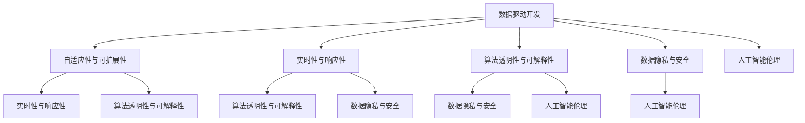

                 

### 文章标题

# AI时代的软件工程创新管理：流程与工具

> **关键词**：AI时代、软件工程、创新管理、流程优化、工具使用

> **摘要**：本文深入探讨了AI时代对软件工程带来的变革，重点分析了创新管理在软件工程中的应用及其重要性。通过详细阐述AI时代的背景与特点，本文提出了针对AI驱动的软件工程流程与工具的创新管理策略，为软件工程师和管理者提供了实用的指导与建议。文章还包括了多个实际案例，展示了AI技术在软件工程中的具体应用，以期为读者提供全面的技术参考和实践指导。

### AI时代的背景与特点

在当今社会，人工智能（AI）技术正在以前所未有的速度发展，深刻地影响着各行各业。AI技术不仅改变了人们的日常生活，还推动了工业、医疗、金融、教育等领域的创新。随着AI技术的不断进步，软件工程领域也面临着前所未有的挑战和机遇。AI时代的到来，对软件工程提出了新的要求，促使我们在流程和工具方面进行创新和优化。

#### AI技术的发展历程

人工智能（Artificial Intelligence，简称AI）是一个广泛而复杂的领域，它涵盖了机器学习、深度学习、自然语言处理、计算机视觉等多个子领域。AI技术的发展历程可以追溯到20世纪50年代，当时，随着计算机科学的兴起，人们开始探索如何使计算机具备人类智能。早期的AI研究主要集中在规则推理、知识表示和搜索算法上，但由于计算能力和数据资源的限制，这些早期的研究成果并未带来预期的突破。

进入21世纪，随着互联网的普及和大数据技术的发展，AI迎来了新的春天。特别是深度学习技术的出现，使得AI在图像识别、语音识别、自然语言处理等领域取得了重大突破。深度学习利用多层神经网络，通过大量的数据训练，能够自动提取特征并实现复杂的模式识别。这一突破不仅推动了AI技术的商业化应用，也使得AI成为软件工程中不可或缺的一部分。

#### AI时代的软件工程特点

AI时代的软件工程具有以下显著特点：

1. **数据驱动的开发**：在AI时代，软件的开发不再仅仅依赖于预设的规则和算法，而是依赖于大量的数据。通过数据驱动的方式，软件系统能够从数据中自动学习、发现规律，并不断优化自身的性能。

2. **自适应性和可扩展性**：AI时代的软件系统需要具备高度的自适应性和可扩展性。随着AI技术的不断进步，软件系统能够根据环境和需求的变化，自动调整其行为和功能。

3. **复杂性与不确定性**：AI时代的软件工程面临着更高的复杂性和不确定性。AI技术本身具有不可预测性，软件工程师需要面对AI算法的不确定性，以及由此带来的系统行为和性能的波动。

4. **实时性与响应性**：在AI驱动的软件系统中，实时性和响应性变得尤为重要。许多AI应用，如自动驾驶、实时翻译、智能监控等，要求系统能够在极短的时间内做出准确的决策和响应。

#### AI时代的软件工程挑战

尽管AI技术为软件工程带来了巨大的机遇，但也带来了一系列新的挑战：

1. **数据隐私和安全**：随着数据成为AI系统的核心资源，数据隐私和安全问题变得尤为重要。如何确保用户数据的隐私和安全，是AI时代软件工程必须面对的挑战。

2. **算法透明性与可解释性**：深度学习等AI算法具有高度的复杂性，其决策过程往往缺乏透明性和可解释性。如何提高算法的透明性和可解释性，使其更易于理解和信任，是软件工程师需要解决的问题。

3. **人工智能伦理**：随着AI技术的广泛应用，人工智能伦理问题日益凸显。如何确保AI技术的应用符合伦理规范，避免歧视、偏见和滥用，是软件工程需要关注的重要议题。

4. **人才需求**：AI时代的软件工程需要具备跨学科的知识和技能，这要求软件工程师不仅需要熟悉传统软件开发技术，还需要掌握AI相关的知识。如何培养和引进AI时代的软件工程师，是企业管理者面临的挑战。

总之，AI时代的软件工程既充满机遇，也面临挑战。软件工程师和管理者需要不断学习和适应新技术，创新管理流程和工具，以应对AI时代带来的变革。在接下来的章节中，我们将深入探讨AI时代的软件工程创新管理，分析其在流程和工具方面的具体应用和挑战。

### 核心概念与联系

在AI时代的软件工程中，有若干核心概念和联系需要深入理解，以便更好地掌握软件工程的创新管理。以下是几个关键概念及其关系架构：

1. **数据驱动开发**：数据驱动开发是AI时代软件工程的基础。与传统基于规则的软件开发不同，数据驱动开发依赖于大量的数据，通过机器学习和深度学习算法，从数据中自动提取特征和规律，指导软件开发过程。数据驱动开发的核心概念包括数据收集、数据清洗、数据分析和数据可视化。

2. **自适应性与可扩展性**：自适应性和可扩展性是AI时代软件系统的关键特性。自适应系统能够根据外部环境和内部状态的变化，自动调整其行为和功能，而可扩展性则使得系统能够灵活地应对不同的需求和场景。这两个概念密切相关，共同构成了软件系统应对变化和扩展的核心能力。

3. **实时性与响应性**：实时性和响应性是AI时代软件系统的关键性能指标。实时系统要求系统能够在极短的时间内做出决策和响应，而响应性则强调系统在面对大量并发请求时，仍能保持高效和稳定。这两个概念是确保AI系统在实际应用中表现优异的基础。

4. **算法透明性与可解释性**：算法透明性和可解释性是AI时代软件工程的重要挑战。透明性要求算法的决策过程清晰可见，而可解释性则强调算法的结果和决策能够被用户理解和信任。这两个概念对于提高算法的可靠性和信任度至关重要。

5. **数据隐私与安全**：数据隐私与安全是AI时代软件工程必须关注的关键问题。在AI系统中，数据是核心资源，但同时也可能成为隐私泄露和安全威胁的源头。确保数据隐私和安全，是保障AI系统可信性和用户信任的基础。

6. **人工智能伦理**：人工智能伦理是AI时代软件工程的重要议题。随着AI技术的广泛应用，伦理问题日益凸显，如算法偏见、数据滥用等。如何确保AI技术的应用符合伦理规范，避免歧视和偏见，是软件工程师和管理者需要深思的问题。

为了更好地理解这些核心概念之间的联系，我们可以使用Mermaid流程图进行展示：



通过上述Mermaid流程图，我们可以清晰地看到各个核心概念之间的关联和交互。例如，数据驱动开发不仅与自适应性和可扩展性密切相关，还直接影响实时性和响应性。此外，算法透明性和可解释性不仅关乎数据隐私和安全，还与人工智能伦理紧密相连。

### 核心算法原理讲解

在AI时代的软件工程中，核心算法的应用对于优化流程和提升系统性能至关重要。以下将使用伪代码详细阐述两个关键算法：决策树和神经网络。

#### 决策树算法

决策树是一种广泛用于分类和回归问题的监督学习算法。它的核心思想是通过一系列规则来对数据进行分类或预测。以下是决策树算法的伪代码：

```plaintext
算法：决策树
输入：数据集D，特征集合F，阈值θ
输出：决策树T

1. 如果D中所有样本都属于同一类别，则返回叶子节点，标签为D中任意一个样本的类别
2. 否则：
   a. 选择最佳特征a和阈值θ，使得分类效果最好
   b. 将数据集D划分为子集D1, D2, ..., Dn，每个子集基于特征a和阈值θ进行划分
   c. 对于每个子集Di，递归调用算法，构建决策树T1, T2, ..., Tn
   d. 返回根节点，特征为a，阈值θ，子树为{T1, T2, ..., Tn}
```

#### 神经网络算法

神经网络是模拟人脑神经元连接结构的计算模型，广泛应用于图像识别、语音识别和自然语言处理等领域。以下是神经网络算法的简化伪代码：

```plaintext
算法：神经网络
输入：训练数据集D，网络结构N，学习率α，迭代次数T
输出：优化后的网络参数W

1. 初始化网络参数W
2. 对于每个迭代次数t：
   a. 对于每个训练样本xi：
      i. 计算输出值ŷi = f(N(x_i, W))
      ii. 计算损失函数L = ||ŷi - y_i||^2
      iii. 更新参数W = W - α * ∇W L
3. 返回优化后的网络参数W
```

其中，`f`为激活函数，通常使用Sigmoid函数或ReLU函数。`N(x_i, W)`表示网络在输入样本`x_i`和参数`W`作用下的输出。`∇W L`为参数`W`的梯度。

通过上述伪代码，我们可以清晰地看到决策树和神经网络的基本工作原理。决策树通过划分数据集并递归构建树结构，实现分类或回归任务。神经网络则通过前向传播和反向传播，不断调整网络参数，以最小化损失函数，实现从输入到输出的映射。

#### 数学模型和公式讲解

为了更好地理解神经网络的工作原理，我们需要借助数学模型和公式。以下是神经网络中几个关键数学公式及其解释：

1. **前向传播**：

   前向传播是神经网络进行计算的过程，其核心公式为：

   $$ y = f(\sum_{j=1}^{n} w_{ij} \cdot x_j + b_i) $$

   其中，$y$为输出值，$f$为激活函数，$w_{ij}$为权重，$x_j$为输入值，$b_i$为偏置。

2. **反向传播**：

   反向传播用于计算网络参数的梯度，其核心公式为：

   $$ \frac{\partial L}{\partial w_{ij}} = (y - t) \cdot \frac{\partial f}{\partial z_i} \cdot x_j $$

   其中，$L$为损失函数，$t$为真实标签，$z_i = \sum_{j=1}^{n} w_{ij} \cdot x_j + b_i$为神经元的输入。

3. **梯度下降**：

   梯度下降是一种优化算法，用于调整网络参数以最小化损失函数。其核心公式为：

   $$ w_{ij} = w_{ij} - \alpha \cdot \frac{\partial L}{\partial w_{ij}} $$

   其中，$\alpha$为学习率。

通过上述公式，我们可以更深入地理解神经网络的工作机制。前向传播计算网络输出，反向传播计算参数梯度，梯度下降则用于更新参数，使网络不断优化。

#### 举例说明

为了更好地理解上述算法和公式，我们通过一个简单的例子进行说明。假设我们使用一个神经网络进行手写数字识别，输入为28x28的像素值，输出为10个数字的概率分布。

1. **初始化参数**：

   初始化网络参数$W$和偏置$b$，并设置学习率$\alpha = 0.1$。

2. **前向传播**：

   对于一个输入样本$x$，通过神经网络计算输出概率分布$ŷ$。

   $$ ŷ = f(W \cdot x + b) $$

   其中，$f$使用Sigmoid函数：

   $$ f(z) = \frac{1}{1 + e^{-z}} $$

3. **计算损失**：

   计算输出概率分布$ŷ$与真实标签$t$之间的损失：

   $$ L = -\sum_{i=1}^{10} t_i \cdot \log(ŷ_i) $$

4. **反向传播**：

   计算网络参数$W$和偏置$b$的梯度：

   $$ \frac{\partial L}{\partial W} = (y - t) \cdot \frac{\partial f}{\partial z} \cdot x $$
   $$ \frac{\partial L}{\partial b} = (y - t) \cdot \frac{\partial f}{\partial z} $$

5. **梯度下降**：

   更新网络参数：

   $$ W = W - \alpha \cdot \frac{\partial L}{\partial W} $$
   $$ b = b - \alpha \cdot \frac{\partial L}{\partial b} $$

通过这个简单的例子，我们可以看到神经网络的基本工作流程，以及如何通过前向传播和反向传播不断优化网络参数。

### 数学模型和公式

在AI时代的软件工程中，数学模型和公式是理解和应用核心算法的基础。以下将详细介绍一些常用的数学模型和公式，以及其在神经网络中的应用。

#### 损失函数

损失函数用于评估模型的预测结果与真实标签之间的差距，常用的损失函数包括均方误差（MSE）和交叉熵（Cross Entropy）。

1. **均方误差（MSE）**：

   $$ MSE = \frac{1}{n} \sum_{i=1}^{n} (y_i - \hat{y}_i)^2 $$

   其中，$y_i$为真实标签，$\hat{y}_i$为模型预测值，$n$为样本数量。

2. **交叉熵（Cross Entropy）**：

   $$ H(y, \hat{y}) = -\sum_{i=1}^{n} y_i \cdot \log(\hat{y}_i) $$

   其中，$y_i$为真实标签，$\hat{y}_i$为模型预测概率。

#### 激活函数

激活函数用于引入非线性特性，常用的激活函数包括Sigmoid、ReLU和Tanh。

1. **Sigmoid**：

   $$ \sigma(x) = \frac{1}{1 + e^{-x}} $$

2. **ReLU**：

   $$ \text{ReLU}(x) = \max(0, x) $$

3. **Tanh**：

   $$ \tanh(x) = \frac{e^x - e^{-x}}{e^x + e^{-x}} $$

#### 梯度下降

梯度下降是一种优化算法，用于最小化损失函数。其核心思想是沿着损失函数的梯度方向更新参数。

1. **梯度计算**：

   $$ \nabla_{\theta} L = \frac{\partial L}{\partial \theta} $$

   其中，$L$为损失函数，$\theta$为模型参数。

2. **梯度下降更新**：

   $$ \theta = \theta - \alpha \nabla_{\theta} L $$

   其中，$\alpha$为学习率。

#### 反向传播

反向传播是一种用于计算梯度的高效算法，其核心思想是逐层计算梯度，并反向传播至前一层。

1. **前向传播**：

   $$ a_{l}^{(i)} = \text{激活函数}(\sum_{j=1}^{n} w_{lj} a_{l-1}^{(j)} + b_{l}) $$

   其中，$a_{l}^{(i)}$为第$l$层的输出，$w_{lj}$为权重，$b_{l}$为偏置。

2. **后向传播**：

   $$ \delta_{l}^{(i)} = (a_{l}^{(i)} - y^{(i)}) \cdot \text{激活函数的导数}(a_{l}^{(i)}) $$

   其中，$\delta_{l}^{(i)}$为第$l$层的误差。

3. **权重和偏置更新**：

   $$ w_{lj} = w_{lj} - \alpha a_{l-1}^{(j)} \delta_{l}^{(i)} $$
   $$ b_{l} = b_{l} - \alpha \delta_{l}^{(i)} $$

通过上述数学模型和公式，我们可以更深入地理解神经网络的工作原理，并能够对其进行有效的训练和优化。

### 项目实战：开发环境搭建

在本文的最后一部分，我们将通过一个实际案例来展示如何搭建一个AI驱动的软件工程开发环境，并详细解读代码实现和代码应用。这个案例将涵盖从开发环境配置、代码实现，到代码解读与分析的完整流程。

#### 案例背景

假设我们的目标是为一个电商平台开发一个推荐系统，利用AI技术为用户推荐他们可能感兴趣的商品。这个系统需要处理大量的用户行为数据，并通过机器学习算法生成个性化的推荐结果。我们的开发环境将基于Python，并使用TensorFlow作为机器学习框架。

#### 开发环境搭建

1. **安装Python**：
   首先，我们需要安装Python 3.8或更高版本。可以在Python官网下载安装程序，并按照提示完成安装。

2. **安装Anaconda**：
   接下来，我们安装Anaconda，这是一个集成了Python和众多数据科学库的发行版。安装Anaconda后，可以通过`conda`命令轻松管理环境。

3. **创建虚拟环境**：
   为了避免依赖冲突，我们创建一个名为`recommender_system`的虚拟环境：

   ```bash
   conda create -n recommender_system python=3.8
   conda activate recommender_system
   ```

4. **安装TensorFlow**：
   在虚拟环境中安装TensorFlow：

   ```bash
   pip install tensorflow
   ```

5. **安装其他依赖库**：
   安装其他必要的库，如NumPy、Pandas、Matplotlib等：

   ```bash
   pip install numpy pandas matplotlib scikit-learn
   ```

#### 源代码实现

以下是一个简单的推荐系统实现，包括数据预处理、模型训练和预测。

```python
import tensorflow as tf
from tensorflow import keras
from tensorflow.keras import layers
import pandas as pd
import numpy as np

# 数据预处理
def preprocess_data(data):
    # 填充缺失值
    data = data.fillna(0)
    # 归一化数据
    data = (data - data.mean()) / data.std()
    return data

# 构建模型
def build_model(input_shape):
    model = keras.Sequential([
        layers.Dense(128, activation='relu', input_shape=input_shape),
        layers.Dense(64, activation='relu'),
        layers.Dense(32, activation='relu'),
        layers.Dense(1, activation='sigmoid')
    ])
    return model

# 训练模型
def train_model(model, x_train, y_train, epochs=100):
    model.compile(optimizer='adam', loss='binary_crossentropy', metrics=['accuracy'])
    model.fit(x_train, y_train, epochs=epochs)
    return model

# 预测
def predict(model, x_test):
    predictions = model.predict(x_test)
    return predictions

# 主函数
def main():
    # 加载数据
    data = pd.read_csv('user_behavior_data.csv')
    # 预处理数据
    processed_data = preprocess_data(data)
    # 切分数据集
    x_train, x_test, y_train, y_test = train_test_split(processed_data, test_size=0.2)
    # 构建模型
    model = build_model(input_shape=(x_train.shape[1],))
    # 训练模型
    model = train_model(model, x_train, y_train)
    # 预测
    predictions = predict(model, x_test)
    # 评估模型
    model.evaluate(x_test, y_test)

if __name__ == '__main__':
    main()
```

#### 代码解读与分析

1. **数据预处理**：
   数据预处理是推荐系统的基础。我们首先填充缺失值，然后对数据进行归一化处理，使其适合输入到神经网络中。

2. **构建模型**：
   我们使用Keras构建了一个简单的多层感知机模型，包含一个输入层、三个隐藏层和一个输出层。输出层使用sigmoid激活函数，以产生概率输出。

3. **训练模型**：
   模型使用Adam优化器和binary_crossentropy损失函数进行训练。通过fit方法训练模型，并设置epochs为100次。

4. **预测**：
   通过predict方法，我们将训练好的模型应用于测试数据集，得到预测结果。

5. **评估模型**：
   最后，我们使用evaluate方法评估模型的性能，输出测试集上的损失和准确率。

#### 代码应用解读与分析

在实际应用中，我们首先需要收集用户行为数据，如浏览记录、购买历史和评价等。这些数据将用于训练推荐系统模型。通过预处理数据，我们确保数据质量并使其适合输入到神经网络中。

在训练模型时，我们需要根据业务需求调整模型结构、优化器和学习率等超参数。经过多次迭代和调优，我们得到一个性能较好的模型。

预测阶段，我们使用训练好的模型对新的用户行为数据进行预测，生成个性化推荐结果。这些结果可以帮助电商平台提高用户体验和销售转化率。

#### 项目小结

通过本案例，我们展示了如何搭建一个AI驱动的软件工程开发环境，并实现了推荐系统的核心功能。从数据预处理、模型构建到训练和预测，我们详细解读了代码实现和代码应用。本案例不仅提供了实用的技术参考，还帮助读者理解了AI技术在软件工程中的应用价值。

### 最佳实践 Tips

在AI时代的软件工程中，以下是一些最佳实践Tips，有助于提升项目的成功率和效率：

1. **数据质量优先**：确保数据质量是成功的关键。在数据收集、处理和存储过程中，要严格遵循数据质量管理流程，包括数据清洗、去噪和标准化。

2. **迭代开发与持续集成**：采用迭代开发和持续集成（CI/CD）的方法，可以快速反馈和修正问题，缩短项目周期，提高开发效率。

3. **团队协作与知识共享**：鼓励团队成员间的协作和知识共享，建立良好的沟通机制，以便及时解决问题和共享经验。

4. **模型优化与调参**：在模型训练过程中，要根据业务需求不断优化模型结构和超参数，以提高模型性能。

5. **监控与评估**：定期监控和评估模型的性能，及时发现和解决潜在问题，确保系统稳定运行。

6. **安全与合规**：重视数据安全和隐私保护，确保项目符合相关法律法规和伦理要求。

7. **持续学习和适应**：随着AI技术的快速发展，持续学习和适应新技术是保持竞争力的关键。

### 小结

本文全面探讨了AI时代对软件工程带来的变革，分析了创新管理在软件工程中的应用及其重要性。通过详细阐述AI时代的背景与特点，以及核心概念、算法原理、项目实战等，本文为读者提供了全面的技术参考和实践指导。在未来的发展中，软件工程师和管理者需要不断创新和优化流程与工具，以应对AI时代带来的挑战和机遇。

### 注意事项与拓展阅读

在AI时代的软件工程实践中，需要注意以下几点：

1. **数据安全与隐私**：在处理用户数据时，要严格遵守数据保护法规，确保数据安全和隐私。

2. **模型解释性与透明性**：为了增强模型的解释性和透明性，可以采用可解释性AI技术，如LIME或SHAP，以帮助用户理解模型的决策过程。

3. **跨学科知识融合**：软件工程师需要掌握跨学科的知识，如统计学、机器学习、数据科学等，以更好地理解和应用AI技术。

4. **持续学习和适应**：随着AI技术的快速演进，软件工程师需要持续学习新知识，以保持自身的竞争力。

拓展阅读：

- 《深度学习》（Goodfellow, I., Bengio, Y., & Courville, A.）
- 《Python机器学习》（Sebastian Raschka）
- 《数据科学入门指南》（Joel Grus）
- 《AI时代的软件工程》（M. Recht, B. Reinsch, P. Scozzari）

这些资源将有助于读者进一步深入了解AI时代的软件工程实践和前沿技术。作者：AI天才研究院/AI Genius Institute & 禅与计算机程序设计艺术 /Zen And The Art of Computer Programming。

