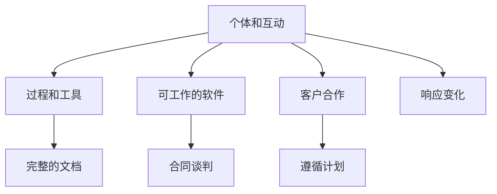

                 

# 《AI时代的软件项目管理敏捷转型策略》

## 引言

### 软件项目管理概述

软件项目管理是指通过计划、组织、协调和控制资源，以实现预定的目标。它涉及到团队协作、任务分配、进度跟踪、风险管理等多个方面。传统的软件项目管理方法，如瀑布模型，强调严格的计划和控制，但在面对快速变化的需求和复杂的开发环境时，往往显得力不从心。

### AI技术的发展及其影响

人工智能（AI）技术的发展正在深刻改变软件开发的方式。AI可以帮助自动化一些重复性高、复杂度低的工作，提高开发效率。同时，AI的应用场景越来越广泛，软件项目的要求也越来越高，这就要求软件项目管理方法也要不断更新和改进。

### 敏捷转型的必要性

敏捷转型是应对AI时代挑战的一种有效手段。敏捷方法强调快速响应变化、持续交付价值，更符合AI时代软件开发的特点。敏捷转型不仅有助于提升项目成功率，还可以提高团队协作效率和客户满意度。

## 第一部分：敏捷方法论

### 第1章：敏捷基础

#### 核心概念与联系

敏捷开发基于一系列核心价值和原则，包括：

- **个体和互动** > 过程和工具
- **可工作的软件** > 完整的文档
- **客户合作** > 合同谈判
- **响应变化** > 遵循计划

这些原则通过Mermaid流程图可以表示为：



#### 敏捷原则

- **及时反馈**：通过定期的迭代和反馈，确保项目方向正确，及时调整。
- **持续交付**：持续交付高质量的软件，以满足用户需求。
- **协作**：团队成员之间要密切协作，共同解决问题。
- **透明性**：项目进展、风险和问题应该是透明的，以便所有相关方都能了解。

### 第2章：敏捷团队的组织结构

敏捷团队通常由多个角色组成，包括：

- **产品负责人**：代表用户利益，定义产品需求和优先级。
- **Scrum Master**：负责确保团队遵循敏捷原则和实践，消除团队工作中遇到的障碍。
- **开发团队**：负责实现产品需求。

敏捷团队的组织结构鼓励扁平化管理，减少层级，提高沟通效率。

### 第3章：敏捷开发流程

敏捷开发通常采用迭代和增量方法，包括以下主要阶段：

- **需求收集**：与产品负责人和用户合作，明确项目需求和目标。
- **迭代规划**：确定本次迭代要实现的功能和目标。
- **迭代开发**：团队成员分工合作，开发并测试软件。
- **迭代回顾**：总结本次迭代的经验和教训，为下一次迭代做准备。

## 第二部分：Scrum框架在AI项目管理中的应用

### 第4章：Scrum框架概述

Scrum是一种流行的敏捷开发方法，它通过以下角色和仪式，确保项目的顺利进行：

- **产品待办列表**：列出所有待完成的任务和需求。
- **冲刺计划会议**：规划下一个冲刺（通常为2-4周）的工作。
- **每日站立会议**：团队成员每日聚集，讨论进展和问题。
- **冲刺评审会议**：展示已完成的工作，收集反馈。
- **冲刺回顾会议**：总结本次冲刺的经验，为下一次冲刺做准备。

### 第5章：Kanban在AI项目管理中的应用

Kanban是一种可视化的工作流管理方法，它通过以下概念，帮助团队提高工作效率：

- **看板板**：用于展示工作流程的看板。
- **工作项**：待办事项、进行中、测试、完成等状态。
- **限制工作项数量**：通过限制在流程中的工作项数量，防止工作积压。

## 第三部分：敏捷工具与技术

### 第6章：敏捷工具与技术概述

敏捷工具包括各种软件和服务，用于支持敏捷实践。常见工具包括：

- **JIRA**：用于任务管理、项目跟踪和敏捷开发。
- **Trello**：用于任务看板管理。
- **Confluence**：用于文档协作和管理。

### 第7章：AI项目中的敏捷工具应用

在AI项目中，选择合适的敏捷工具至关重要。以下是一些常见工具的应用：

- **JIRA**：用于管理产品待办列表、迭代规划和任务跟踪。
- **Trello**：用于展示工作流，帮助团队可视化任务进展。
- **TensorBoard**：用于可视化AI模型的训练过程。

## 第四部分：敏捷转型策略

### 第8章：敏捷转型策略概述

敏捷转型需要遵循一系列步骤，包括：

- **评估当前状态**：了解团队和组织的现状，确定转型方向。
- **制定转型计划**：明确转型的目标和步骤，制定详细的计划。
- **培训与指导**：为团队成员提供敏捷培训和指导。
- **持续改进**：通过迭代和反馈，不断优化转型过程。

### 第9章：AI时代的敏捷组织建设

敏捷组织建设需要关注以下几个方面：

- **文化变革**：鼓励团队协作、快速反馈和持续学习。
- **领导力**：领导者需要支持和推动敏捷实践。
- **激励机制**：建立与敏捷实践相符的激励机制，鼓励团队成员积极参与。

## 第五部分：敏捷项目管理实战

### 第10章：敏捷项目管理实战案例

#### 案例背景介绍

本案例以一家AI初创公司开发一款智能客服系统为例，介绍敏捷项目管理的实际应用。

#### 核心算法原理讲解

智能客服系统的核心算法包括自然语言处理（NLP）和机器学习。以下为NLP的伪代码示例：

```python
def process_text(text):
    tokens = tokenize(text)
    cleaned_tokens = clean_tokens(tokens)
    tagged_tokens = pos_tag(cleaned_tokens)
    parsed_sentence = parse_sentence(tagged_tokens)
    return parsed_sentence
```

#### 数学模型和数学公式 & 详细讲解 & 举例说明

在机器学习中，常用到线性回归模型。线性回归的数学公式如下：

$$ y = wx + b $$

其中，$y$ 是目标变量，$w$ 是权重，$x$ 是特征，$b$ 是偏置。

举例：预测房价，$y$ 是房价，$x$ 是房屋面积，$w$ 和 $b$ 是模型参数。

#### 项目实战

1. **开发环境搭建**：使用Python和TensorFlow搭建开发环境。
2. **源代码详细实现和代码解读**：实现NLP和机器学习算法，并分析代码实现细节。
3. **代码解读与分析**：分析代码中的关键部分，如数据处理、模型训练和评估。
4. **实际案例分析和详细讲解剖析**：分析项目中的成功经验和挑战，并进行详细讲解。

#### 项目小结

通过敏捷项目管理，公司成功开发了智能客服系统，实现了快速迭代和持续交付。项目小结包括：

- **成功经验**：敏捷实践提高了团队协作效率和项目质量。
- **挑战**：在敏捷转型过程中，遇到了一些文化和管理上的挑战。
- **改进措施**：提出改进措施，为未来项目提供参考。

## 结论

AI时代的软件项目管理需要敏捷转型，以应对快速变化的需求和复杂的技术挑战。通过本文的介绍，读者可以了解到敏捷方法论、Scrum框架、Kanban方法、敏捷工具以及敏捷转型策略，为实际项目中的应用提供指导。

### 作者信息

作者：AI天才研究院/AI Genius Institute & 禅与计算机程序设计艺术 /Zen And The Art of Computer Programming

