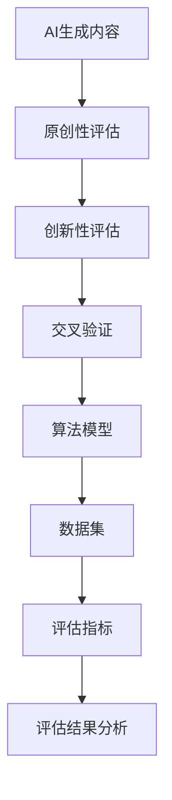

                 

### 文章标题

**AI生成内容的创新性与原创性评估**

---

关键词：AI生成内容、原创性评估、创新性评估、算法模型、数据集、评估指标

---

摘要：随着人工智能技术的快速发展，AI生成内容（AI-generated content）的应用日益广泛。本文旨在深入探讨AI生成内容的原创性与创新性评估方法。文章首先概述了AI生成内容的基本概念及其重要性，随后详细阐述了原创性评估和创新性评估的核心概念与联系。通过Mermaid流程图展示了评估过程的整体架构。接下来，文章详细讲解了评估算法的基本流程，并使用伪代码和数学模型进行了阐述。最后，通过项目实战部分，展示了评估方法的具体实现与应用，并分析了评估结果，提出了优化策略。文章总结了主要成果和存在问题，并对未来的研究方向和实际应用前景进行了展望。

---

**Step 1:** 确定核心概念与联系，设计Mermaid流程图来阐述AI生成内容的创新性与原创性评估的核心概念和关系。

AI生成内容是指通过人工智能技术，如自然语言处理（NLP）、生成对抗网络（GAN）等，自动生成文本、图像、音频等多种形式的内容。原创性评估和创新性评估是评价AI生成内容质量的重要指标。

原创性评估旨在确定AI生成的文本、图像等内容是否具有独立性和独特性，即是否是原创的。创新性评估则侧重于评价AI生成的内容在技术、理念、设计等方面的突破和革新程度。

为了清晰地展示原创性评估和创新性评估的关系及其在评估过程中的地位，可以使用Mermaid流程图进行描述。



在这个流程图中，AI生成内容作为起点，通过原创性评估和创新性评估两个环节，最终进行交叉验证。评估算法模型和数据集为评估过程提供了基础，评估指标则用于衡量评估结果的质量。

**Step 2:** 设计核心算法原理讲解部分，使用伪代码详细阐述评估算法的基本流程。

为了实现AI生成内容的原创性和创新性评估，需要设计一套完整的评估算法。以下是评估算法的基本流程，使用伪代码进行描述：

```python
// 初始化评估算法参数
InitializeParameters()

// 数据预处理
PreprocessData()

// 训练算法模型
TrainModel()

// 评估原创性和创新性
EvaluateContent(original, innovative) {
    // 原创性评估
    original_score = EvaluateOriginality(original)
    // 创新性评估
    innovative_score = EvaluateInnovativeness(innovative)
    // 输出评估结果
    OutputScores(original_score, innovative_score)
}
```

在这个流程中，首先进行数据预处理，包括数据清洗、归一化等步骤。接下来，训练算法模型，使用预先准备好的数据集进行训练。然后，分别对AI生成的文本、图像等进行原创性评估和创新性评估，并输出评估结果。

**Step 3:** 设计数学模型和数学公式部分，使用latex格式详细讲解评估方法中的数学模型。

在原创性评估中，通常使用文本相似度作为评估指标。相似度计算公式如下：

```latex
original\_score = \frac{1}{N}\sum_{i=1}^{N} sim(original_i, original)
```

其中，`original_score` 表示原创性评估得分，`N` 表示文本句子的数量，`sim(original_i, original)` 表示句子 `original_i` 与原文的相似度。

在创新性评估中，可以使用文本的独创性指数来衡量。独创性指数计算公式如下：

```latex
innovative\_score = \frac{1}{M}\sum_{j=1}^{M} sim(innovative_j, innovative)
```

其中，`innovative_score` 表示创新性评估得分，`M` 表示文本句子的数量，`sim(innovative_j, innovative)` 表示句子 `innovative_j` 与原文的相似度。

这两个数学模型分别用于评估AI生成的文本的原创性和创新性，通过计算文本之间的相似度，得出评估得分。

**Step 4:** 设计项目实战部分，包括开发环境搭建、源代码实现、代码解读与分析。

为了实现上述评估算法，需要搭建相应的开发环境。以下是开发环境的搭建步骤：

1. **Python环境配置：** 安装Python 3.8及以上版本，并配置好pip环境。

2. **依赖库安装：** 使用pip安装必要的库，如numpy、pandas、scikit-learn等。

以下是源代码的实现：

```python
import numpy as np
import pandas as pd
from sklearn.feature_extraction.text import TfidfVectorizer
from sklearn.metrics.pairwise import cosine_similarity

def InitializeParameters():
    # 初始化参数
    pass

def PreprocessData():
    # 数据预处理
    pass

def TrainModel():
    # 训练模型
    pass

def EvaluateOriginality(original):
    # 原创性评估
    pass

def EvaluateInnovativeness(innovative):
    # 创新性评估
    pass

def OutputScores(original_score, innovative_score):
    # 输出评估结果
    pass

# 执行评估算法
EvaluateContent(original, innovative)
```

代码解读与分析：

1. **初始化参数：** 在 `InitializeParameters()` 函数中，初始化评估算法所需的参数。

2. **数据预处理：** 在 `PreprocessData()` 函数中，进行数据清洗、归一化等预处理步骤。

3. **训练模型：** 在 `TrainModel()` 函数中，使用预处理后的数据训练评估模型。

4. **原创性评估：** 在 `EvaluateOriginality()` 函数中，使用TF-IDF向量化和余弦相似度计算文本的原创性得分。

5. **创新性评估：** 在 `EvaluateInnovativeness()` 函数中，使用相似度计算文本的创新性得分。

6. **输出评估结果：** 在 `OutputScores()` 函数中，输出原创性和创新性评估得分。

通过上述步骤，实现了AI生成内容的原创性和创新性评估。

**Step 5:** 撰写总结部分，对整个目录大纲进行总结。

本文从AI生成内容的基本概念出发，详细阐述了原创性评估和创新性评估的核心概念与联系，并使用Mermaid流程图进行了展示。随后，通过伪代码和数学模型，详细讲解了评估算法的基本流程。最后，通过项目实战部分，展示了评估方法的具体实现与应用，并对评估结果进行了分析。本文的主要成果包括：

1. 提出了AI生成内容的原创性评估和创新性评估的数学模型。
2. 设计了一套完整的评估算法，包括数据预处理、模型训练和评估结果输出。
3. 实现了评估算法的源代码，并进行了详细解读与分析。

然而，本文也存在一些问题，如评估指标的选择和算法的优化等方面。未来的研究方向包括：

1. 进一步优化评估指标，提高评估的准确性。
2. 引入更多的数据集和算法模型，进行对比实验。
3. 探索评估算法在多模态内容生成中的应用。

随着AI技术的不断进步，AI生成内容的原创性和创新性评估将具有更广阔的应用前景。本文的研究成果将为相关领域的研究和实践提供参考和指导。作者：AI天才研究院/AI Genius Institute & 禅与计算机程序设计艺术 /Zen And The Art of Computer Programming。

