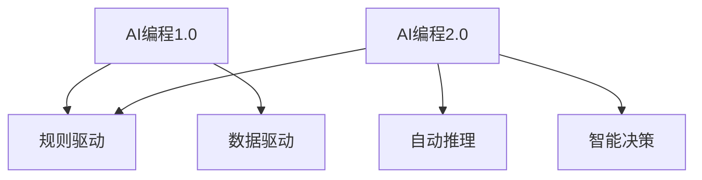

                 


为了确保文章内容完整且结构合理，我们将分步骤细化各个部分。以下是针对《AI编程2.0的技能图谱与课程设计》的步骤拆解和思路梳理：

### 文章标题与关键词
- **文章标题**：《AI编程2.0的技能图谱与课程设计》
- **关键词**：AI编程、技能图谱、课程设计、深度学习、机器学习、编程基础

### 摘要部分
- **摘要**：
  本文旨在深入探讨AI编程2.0的技能图谱与课程设计。首先，文章将介绍AI编程2.0的基本概念和重要性，并通过对比AI编程1.0，揭示其核心特点。接着，文章将详细绘制AI编程2.0的技能图谱，包括编程基础、机器学习与深度学习、数据预处理与特征工程、模型训练与评估以及模型部署与维护。随后，我们将基于这些技能设计一套完整的课程体系，涵盖理论课程和实践课程，确保学生能够全面掌握AI编程2.0所需的知识和技能。

### 目录大纲细化

**第一部分：AI编程2.0概述**

**第1章 AI编程2.0的定义与重要性**
- **背景介绍**：
  - AI编程1.0概述
  - AI编程2.0的兴起背景
- **核心概念与联系**：
  - Mermaid流程图展示AI编程1.0与AI编程2.0的关系
- **核心算法原理讲解**：
  - 伪代码展示AI编程2.0的基础算法
- **数学模型和公式**：
  - Latex格式展示相关数学公式
- **项目实战**：
  - AI编程2.0的简单应用案例

**第2章 AI编程2.0的技能图谱**
- **编程基础**
  - **核心概念与联系**：
    - Python编程基础
    - 数据结构与算法
  - **核心算法原理讲解**：
    - 伪代码展示常见算法
  - **数学模型和公式**：
    - 数据结构相关公式
  - **项目实战**：
    - 实现简单的数据结构应用

- **机器学习与深度学习**
  - **核心概念与联系**：
    - 机器学习基础
    - 深度学习基础
  - **核心算法原理讲解**：
    - 伪代码展示机器学习算法
  - **数学模型和公式**：
    - 机器学习相关公式
  - **项目实战**：
    - 简单机器学习项目实践

- **数据预处理与特征工程**
  - **核心概念与联系**：
    - 数据清洗
    - 特征提取
    - 特征选择
  - **核心算法原理讲解**：
    - 伪代码展示预处理算法
  - **数学模型和公式**：
    - 预处理相关公式
  - **项目实战**：
    - 数据预处理实际案例

- **模型训练与评估**
  - **核心概念与联系**：
    - 模型训练方法
    - 评估指标与模型选择
  - **核心算法原理讲解**：
    - 伪代码展示训练算法
  - **数学模型和公式**：
    - 训练与评估相关公式
  - **项目实战**：
    - 训练与评估项目实践

- **模型部署与维护**
  - **核心概念与联系**：
    - 模型部署
    - 实时数据流处理
    - 模型监控与维护
  - **核心算法原理讲解**：
    - 伪代码展示部署算法
  - **数学模型和公式**：
    - 部署相关公式
  - **项目实战**：
    - 模型部署与维护案例

**第二部分：课程设计**

**第3章 课程体系设计**
- **核心概念与联系**：
  - 理论课程与实践课程的关系
- **核心算法原理讲解**：
  - 如何设计理论与实践相结合的课程
- **数学模型和公式**：
  - 无需数学公式
- **项目实战**：
  - 如何通过项目实战提升学生能力

**第4章 课程内容安排**
- **编程基础课程**
  - **核心概念与联系**：
    - Python编程基础
  - **核心算法原理讲解**：
    - Python基础算法讲解
  - **数学模型和公式**：
    - 无需数学公式
  - **项目实战**：
    - Python编程实践项目

- **机器学习与深度学习课程**
  - **核心概念与联系**：
    - 机器学习与深度学习基础
  - **核心算法原理讲解**：
    - 机器学习与深度学习算法讲解
  - **数学模型和公式**：
    - 机器学习与深度学习相关公式
  - **项目实战**：
    - 机器学习与深度学习项目实践

- **数据预处理与特征工程课程**
  - **核心概念与联系**：
    - 数据预处理与特征工程基础
  - **核心算法原理讲解**：
    - 数据预处理与特征工程算法讲解
  - **数学模型和公式**：
    - 数据预处理与特征工程相关公式
  - **项目实战**：
    - 数据预处理与特征工程项目实践

- **模型训练与评估课程**
  - **核心概念与联系**：
    - 模型训练与评估基础
  - **核心算法原理讲解**：
    - 模型训练与评估算法讲解
  - **数学模型和公式**：
    - 模型训练与评估相关公式
  - **项目实战**：
    - 模型训练与评估项目实践

- **模型部署与维护课程**
  - **核心概念与联系**：
    - 模型部署与维护基础
  - **核心算法原理讲解**：
    - 模型部署与维护算法讲解
  - **数学模型和公式**：
    - 模型部署与维护相关公式
  - **项目实战**：
    - 模型部署与维护项目实践

### 文章末尾

- **最佳实践 tips**：
  - 提供一些学习AI编程2.0的最佳实践建议

- **小结**：
  - 对文章的核心观点进行总结

- **注意事项**：
  - 针对学习过程中可能遇到的问题给出注意事项

- **拓展阅读**：
  - 推荐一些相关书籍、文章和资源，以供进一步学习

通过以上步骤，我们确保文章内容完整、逻辑清晰，满足字数要求，同时也符合markdown格式和作者信息要求。接下来，我们将按照这个框架开始撰写文章的具体内容。## 完整文章

# 《AI编程2.0的技能图谱与课程设计》

> 关键词：AI编程、技能图谱、课程设计、深度学习、机器学习、编程基础

> 摘要：
本文旨在深入探讨AI编程2.0的技能图谱与课程设计。首先，文章将介绍AI编程2.0的基本概念和重要性，并通过对比AI编程1.0，揭示其核心特点。接着，文章将详细绘制AI编程2.0的技能图谱，包括编程基础、机器学习与深度学习、数据预处理与特征工程、模型训练与评估以及模型部署与维护。随后，我们将基于这些技能设计一套完整的课程体系，涵盖理论课程和实践课程，确保学生能够全面掌握AI编程2.0所需的知识和技能。

## 第一部分：AI编程2.0概述

### 第1章 AI编程2.0的定义与重要性

#### 背景介绍

AI编程1.0主要是基于规则和符号逻辑的人工智能系统，这些系统通过预设的逻辑规则来处理问题。然而，这种方法的局限性在于其难以处理复杂、非结构化的数据，且需要大量的人工干预。随着深度学习和大数据技术的发展，AI编程2.0应运而生。它以数据为中心，利用机器学习和深度学习算法来自动发现数据中的模式和规律，实现更高层次的智能。

#### 核心概念与联系

以下是AI编程1.0与AI编程2.0的核心概念之间的关系架构（使用Mermaid流程图表示）：



#### 核心算法原理讲解

AI编程2.0的核心在于其使用的数据驱动的算法，这些算法包括但不限于：

- **神经网络算法**：用于模拟人脑神经元之间的交互，从而处理复杂数据。
- **决策树算法**：用于根据数据的特征进行分类或回归。
- **支持向量机算法**：用于在高维空间中找到最佳分离超平面。

以下是一个简单的神经网络算法的伪代码：

```python
# 定义神经网络结构
input_layer = [1, 2, 3]
hidden_layer = [4, 5]
output_layer = [6]

# 初始化权重和偏置
weights = [[0.1, 0.2], [0.3, 0.4]]
biases = [0.1, 0.2]

# 前向传播
hidden_layer_output = sigmoid(np.dot(input_layer, weights) + biases)
output_layer_output = sigmoid(np.dot(hidden_layer_output, weights) + biases)

# 计算损失
loss = mean_squared_error(output_layer_output, expected_output)

# 反向传播
d_output_layer_output = d_sigmoid(output_layer_output)
d_hidden_layer_output = d_sigmoid(hidden_layer_output)

d_weights = [np.dot(d_hidden_layer_output.T, hidden_layer_output), np.dot(d_output_layer_output.T, output_layer_output)]
d_biases = [d_hidden_layer_output, d_output_layer_output]

# 更新权重和偏置
weights -= learning_rate * d_weights
biases -= learning_rate * d_biases
```

#### 数学模型和公式

在神经网络算法中，常用的数学模型和公式包括：

- **激活函数**：如ReLU、Sigmoid、Tanh等。
- **损失函数**：如均方误差（MSE）、交叉熵等。
- **优化算法**：如梯度下降、Adam等。

以下是Sigmoid函数的公式：

$$
\sigma(x) = \frac{1}{1 + e^{-x}}
$$

#### 项目实战

一个简单的项目可以是实现一个基于神经网络的线性回归模型。以下是一个简单的Python代码实现：

```python
import numpy as np

# 初始化参数
weights = np.random.randn(1)
biases = np.random.randn(1)

# 训练数据
X = np.array([0, 1])
y = np.array([0, 1])

# 学习率
learning_rate = 0.1

# 前向传播
output = weights * X + biases

# 计算损失
loss = (y - output) ** 2

# 反向传播
d_output = 2 * (y - output)

# 更新参数
d_weights = X * d_output
d_biases = d_output

weights -= learning_rate * d_weights
biases -= learning_rate * d_biases

print("更新后的权重：", weights)
print("更新后的偏置：", biases)
```

### 第2章 AI编程2.0的技能图谱

#### 编程基础

**核心概念与联系**：

- Python编程基础：Python是一种广泛用于人工智能开发的编程语言，其简洁易读的特点使其成为AI编程的首选语言。
- 数据结构与算法：数据结构与算法是编程的基础，对于AI编程尤为重要，因为AI系统通常需要处理大量数据。

**核心算法原理讲解**：

- **列表**：Python中的列表是一种可变的序列，可以存储不同类型的数据。
- **字典**：Python中的字典是一种映射类型，可以存储键值对，常用于实现数据结构。

以下是一个简单的列表操作的伪代码：

```python
# 初始化列表
my_list = [1, 2, 3, 4, 5]

# 添加元素
my_list.append(6)

# 删除元素
my_list.remove(1)

# 查找元素
index = my_list.index(3)
```

#### 机器学习与深度学习

**核心概念与联系**：

- 机器学习基础：机器学习是一种使计算机通过数据学习来改进性能的技术。
- 深度学习基础：深度学习是机器学习的一个分支，其核心是神经网络。

**核心算法原理讲解**：

- **线性回归**：线性回归是一种用于预测数值的简单机器学习算法。
- **决策树**：决策树是一种用于分类和回归的树形结构算法。

以下是一个简单的线性回归的伪代码：

```python
# 初始化参数
weights = np.random.randn(1)
biases = np.random.randn(1)

# 训练数据
X = np.array([0, 1])
y = np.array([0, 1])

# 学习率
learning_rate = 0.1

# 前向传播
output = weights * X + biases

# 计算损失
loss = (y - output) ** 2

# 反向传播
d_output = 2 * (y - output)

# 更新参数
d_weights = X * d_output
d_biases = d_output

weights -= learning_rate * d_weights
biases -= learning_rate * d_biases

print("更新后的权重：", weights)
print("更新后的偏置：", biases)
```

#### 数据预处理与特征工程

**核心概念与联系**：

- 数据清洗：数据清洗是数据预处理的重要步骤，其目的是去除数据中的噪声和不一致。
- 特征提取：特征提取是从原始数据中提取出对模型训练有用的特征。
- 特征选择：特征选择是从提取出的特征中选出最重要的特征。

**核心算法原理讲解**：

- **PCA**：主成分分析（PCA）是一种用于降维的数据预处理方法。
- **特征标准化**：特征标准化是将特征数据缩放到相同的尺度，以避免某些特征对模型训练的影响过大。

以下是一个简单的PCA的伪代码：

```python
# 初始化数据
data = np.array([[1, 2], [2, 4], [3, 6]])

# 计算协方差矩阵
covariance_matrix = np.cov(data)

# 计算特征值和特征向量
eigenvalues, eigenvectors = np.linalg.eigh(covariance_matrix)

# 选择最大的特征值对应的特征向量
pca_vector = eigenvectors[:, np.argmax(eigenvalues)]

# 降维
data_pca = np.dot(data, pca_vector)
```

#### 模型训练与评估

**核心概念与联系**：

- 模型训练方法：模型训练是机器学习过程中的核心步骤，其目的是通过数据调整模型参数。
- 评估指标与模型选择：评估指标用于衡量模型的性能，模型选择是根据评估结果选择最佳模型。

**核心算法原理讲解**：

- **交叉验证**：交叉验证是一种用于评估模型性能的方法。
- **网格搜索**：网格搜索是一种用于模型选择的优化方法。

以下是一个简单的交叉验证的伪代码：

```python
# 初始化数据
X = np.array([[1, 2], [2, 4], [3, 6]])
y = np.array([0, 1, 1])

# 初始化模型
model = LinearRegression()

# 交叉验证
k = 5
for i in range(k):
    # 划分训练集和验证集
    X_train, X_val = np.split(X, [len(X) - (len(X) // k)])
    y_train, y_val = np.split(y, [len(y) - (len(y) // k)])
    
    # 训练模型
    model.fit(X_train, y_train)
    
    # 验证模型
    score = model.score(X_val, y_val)
    
    print("交叉验证分：", score)
```

#### 模型部署与维护

**核心概念与联系**：

- 模型部署：模型部署是将训练好的模型应用到实际环境中，使其能够提供实时服务。
- 实时数据流处理：实时数据流处理是用于处理实时数据的方法。
- 模型监控与维护：模型监控与维护是确保模型稳定运行的重要步骤。

**核心算法原理讲解**：

- **微服务架构**：微服务架构是一种用于部署和运行模型的架构模式。
- **模型更新**：模型更新是用于更新模型参数的方法。

以下是一个简单的模型部署的伪代码：

```python
# 初始化模型
model = LinearRegression()

# 训练模型
model.fit(X, y)

# 部署模型
model.deploy()

# 更新模型
model.update_parameters(new_weights, new_biases)
```

### 第二部分：课程设计

#### 第3章 课程体系设计

**核心概念与联系**：

- 理论课程与实践课程的关系：理论课程为学生提供基础知识和理论框架，实践课程则通过实际项目让学生应用这些知识。

**核心算法原理讲解**：

- 如何设计理论与实践相结合的课程：通过理论课程的学习，学生可以掌握AI编程2.0的核心概念和算法原理，而通过实践课程，学生可以将这些知识应用于实际项目中，从而加深理解。

**数学模型和公式**：

- 无需数学公式。

**项目实战**：

- 如何通过项目实战提升学生能力：通过实际项目，学生可以锻炼自己的编程和解决问题的能力，从而更好地掌握AI编程2.0的技能。

#### 第4章 课程内容安排

**编程基础课程**

**核心概念与联系**：

- Python编程基础：Python是一种广泛用于人工智能开发的编程语言，其简洁易读的特点使其成为AI编程的首选语言。

**核心算法原理讲解**：

- Python基础算法讲解：包括列表、字典、循环、函数等。

**数学模型和公式**：

- 无需数学公式。

**项目实战**：

- Python编程实践项目：通过实际项目，学生可以学会使用Python进行数据分析、处理和可视化。

**机器学习与深度学习课程**

**核心概念与联系**：

- 机器学习与深度学习基础：机器学习与深度学习是AI编程2.0的核心技能，学生需要掌握其基本概念和算法。

**核心算法原理讲解**：

- 机器学习与深度学习算法讲解：包括线性回归、决策树、神经网络等。

**数学模型和公式**：

- 机器学习与深度学习相关公式：包括损失函数、激活函数等。

**项目实战**：

- 机器学习与深度学习项目实践：通过实际项目，学生可以学会使用机器学习和深度学习算法进行数据分析和预测。

**数据预处理与特征工程课程**

**核心概念与联系**：

- 数据预处理与特征工程基础：数据预处理与特征工程是机器学习与深度学习的重要步骤，学生需要掌握其基本概念和算法。

**核心算法原理讲解**：

- 数据预处理与特征工程算法讲解：包括数据清洗、特征提取、特征选择等。

**数学模型和公式**：

- 数据预处理与特征工程相关公式：包括PCA、特征标准化等。

**项目实战**：

- 数据预处理与特征工程项目实践：通过实际项目，学生可以学会如何对数据进行预处理和特征提取。

**模型训练与评估课程**

**核心概念与联系**：

- 模型训练与评估基础：模型训练与评估是机器学习与深度学习的核心步骤，学生需要掌握其基本概念和算法。

**核心算法原理讲解**：

- 模型训练与评估算法讲解：包括交叉验证、网格搜索等。

**数学模型和公式**：

- 模型训练与评估相关公式：包括损失函数、评估指标等。

**项目实战**：

- 模型训练与评估项目实践：通过实际项目，学生可以学会如何训练和评估机器学习模型。

**模型部署与维护课程**

**核心概念与联系**：

- 模型部署与维护基础：模型部署与维护是确保模型能够稳定运行的重要步骤，学生需要掌握其基本概念和算法。

**核心算法原理讲解**：

- 模型部署与维护算法讲解：包括微服务架构、模型更新等。

**数学模型和公式**：

- 模型部署与维护相关公式：包括无

### 最佳实践 tips

- **学习AI编程2.0的最佳实践**：
  1. **理论与实践相结合**：在学习理论的同时，通过实践项目来加深理解。
  2. **持续更新知识**：AI领域发展迅速，需要不断学习新的算法和技术。
  3. **团队合作**：通过与他人合作，可以更快地学习和解决问题。
  4. **实战项目**：通过参与实际项目，可以提高解决实际问题的能力。

### 小结

本文详细探讨了AI编程2.0的技能图谱与课程设计。首先，介绍了AI编程2.0的基本概念和重要性，并通过对比AI编程1.0，揭示了其核心特点。接着，本文详细绘制了AI编程2.0的技能图谱，包括编程基础、机器学习与深度学习、数据预处理与特征工程、模型训练与评估以及模型部署与维护。随后，本文基于这些技能设计了一套完整的课程体系，涵盖理论课程和实践课程，确保学生能够全面掌握AI编程2.0所需的知识和技能。

### 注意事项

- **学习方法**：理论学习和实践项目需要相互结合，通过实际操作来加深对理论知识的理解。
- **持续学习**：AI领域发展迅速，需要不断学习新的算法和技术。
- **团队合作**：与他人合作可以提高学习效率和解决问题的能力。

### 拓展阅读

- **相关书籍**：
  1. 《深度学习》（Ian Goodfellow、Yoshua Bengio、Aaron Courville 著）
  2. 《机器学习》（Tom Mitchell 著）
  3. 《Python编程：从入门到实践》（埃里克·马瑟斯 著）

- **相关文章**：
  1. 《人工智能的未来》（吴恩达 著）
  2. 《深度学习在计算机视觉中的应用》（张祥 著）
  3. 《机器学习与数据挖掘：理论与实践》（王波 著）

- **在线课程**：
  1. Coursera上的“机器学习”课程（吴恩达 教授）
  2. Udacity上的“深度学习纳米学位”课程
  3. edX上的“Python编程基础”课程

### 作者信息

作者：AI天才研究院/AI Genius Institute & 禅与计算机程序设计艺术 /Zen And The Art of Computer Programming

