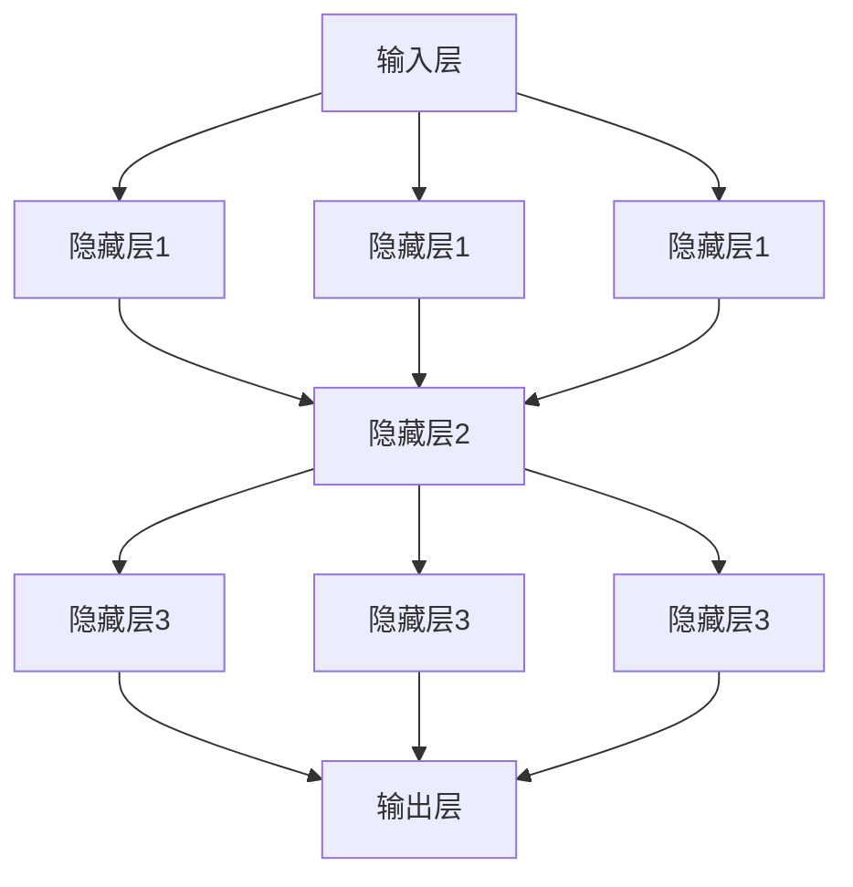
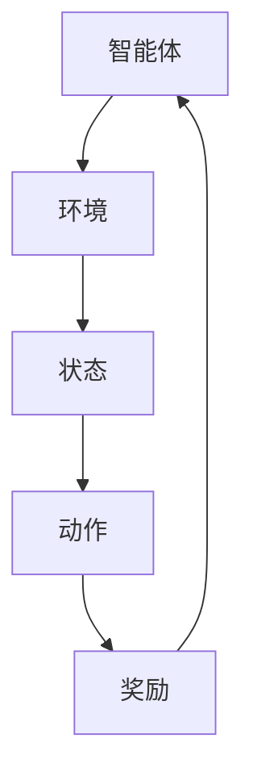
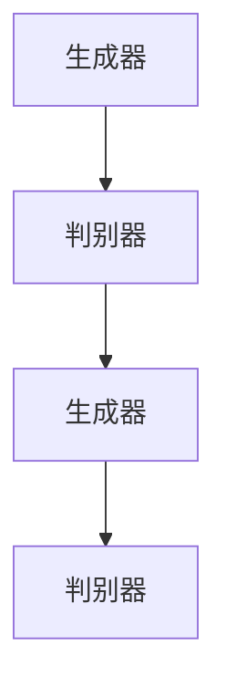
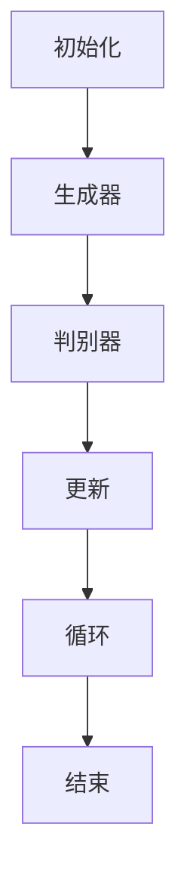

                 

### 文章标题：AI编程2.0的技能评估与认证体系

#### 关键词：
- AI编程2.0
- 技能评估
- 认证体系
- 技术标准
- 职业发展

#### 摘要：
本文将深入探讨AI编程2.0的技能评估与认证体系。通过分析AI编程2.0的背景与核心技术，我们构建了一个详细的能力评估模型。随后，本文将介绍现有的认证体系，包括认证标准、流程和考试形式。最后，通过实际项目实战，展示如何将理论应用于实践，并总结最佳实践与注意事项。本文旨在为AI编程从业人员提供一个全面的技能提升指南。

---

## 第一部分：AI编程2.0基础理论

### 第1章 AI编程2.0概述

#### 1.1 AI编程2.0的背景和意义

AI编程2.0，是继传统AI编程之后的一次重要变革。它不仅延续了深度学习、强化学习等传统AI技术的优势，更在算法效率、数据处理能力和智能化程度上有了质的飞跃。AI编程2.0的出现，标志着人工智能技术进入了新的发展阶段。

这一阶段的背景可以从以下几个方面来理解：

1. **计算能力的提升**：随着硬件技术的发展，尤其是GPU、TPU等专用硬件的普及，为AI编程2.0提供了强大的计算支持。
2. **大数据的普及**：大数据时代的到来，为AI算法提供了丰富的训练数据，使得AI模型能够更加精准地预测和决策。
3. **算法的创新**：深度学习、生成对抗网络（GAN）等新算法的出现，使得AI模型在图像识别、自然语言处理等领域取得了突破性进展。
4. **应用需求的增长**：随着人工智能技术的不断成熟，越来越多的行业开始将AI技术应用于实际业务中，如自动驾驶、智能医疗、智能制造等，推动了AI编程2.0的快速发展。

#### 1.2 AI编程2.0与传统AI编程的区别

AI编程2.0与传统AI编程在多个方面存在显著差异：

1. **技术层面**：
   - **算法复杂度**：AI编程2.0涉及更复杂的算法，如深度学习、图神经网络等，对编程技能要求更高。
   - **数据处理能力**：AI编程2.0能够处理更大规模的数据，对数据清洗、预处理的要求更高。
   - **智能化程度**：AI编程2.0强调模型的自适应和自主学习能力，使编程更具智能化。

2. **应用层面**：
   - **应用场景**：AI编程2.0的应用场景更加广泛，如自动驾驶、智能医疗、智能家居等，对编程人员提出了更多样的需求。
   - **系统集成**：AI编程2.0更注重系统的整体集成和优化，要求编程人员具备更全面的技术视野。

3. **发展前景**：
   - **技术创新**：AI编程2.0的发展前景广阔，随着技术的不断演进，将涌现出更多的创新应用。
   - **市场潜力**：随着AI技术的普及，AI编程2.0的市场需求将持续增长，为编程人员提供了广阔的职业发展空间。

#### 1.3 AI编程2.0的关键技术

AI编程2.0的关键技术主要包括以下几个方面：

1. **深度学习**：
   - **核心概念**：深度学习是一种基于多层神经网络的学习方法，通过逐层抽象和特征提取，实现复杂函数的建模。
   - **工作原理**：
     ```mermaid
     graph TD
     A[输入层] --> B[隐藏层1]
     B --> C[隐藏层2]
     C --> D[隐藏层3]
     D --> E[输出层]
     ```
   - **应用领域**：图像识别、自然语言处理、推荐系统等。

2. **强化学习**：
   - **核心概念**：强化学习是一种通过与环境互动，不断调整策略以最大化奖励的学习方法。
   - **工作原理**：
     ```mermaid
     graph TD
     A[智能体] --> B[环境]
     B --> C[状态]
     C --> D[动作]
     D --> E[奖励]
     E --> A
     ```
   - **应用领域**：自动驾驶、游戏AI、智能机器人等。

3. **生成对抗网络（GAN）**：
   - **核心概念**：GAN由生成器和判别器组成，生成器生成数据，判别器判断生成数据与真实数据之间的差异。
   - **工作原理**：
     ```mermaid
     graph TD
     A[生成器] --> B[判别器]
     B --> C[生成器]
     C --> D[判别器]
     ```
   - **应用领域**：图像生成、图像修复、数据增强等。

### 第2章 AI编程2.0核心算法

#### 2.1 深度学习基础

##### 2.1.1 神经网络结构

神经网络是深度学习的基础，由多个神经元（节点）组成，分为输入层、隐藏层和输出层。

- **输入层**：接收外部输入数据。
- **隐藏层**：对输入数据进行特征提取和变换。
- **输出层**：输出模型的预测结果。

神经网络的工作原理如下：



##### 2.1.2 深度学习优化算法

深度学习优化算法主要目的是通过调整网络参数，使模型输出更加接近真实值。常见的优化算法有：

- **随机梯度下降（SGD）**：
  ```mermaid
  graph TD
  A[损失函数] --> B[梯度计算]
  B --> C[参数更新]
  C --> D[迭代优化]
  ```
- **Adam优化器**：
  ```mermaid
  graph TD
  A[前一时刻梯度] --> B[前一时刻梯度平方]
  A --> C[当前梯度]
  C --> D[当前梯度平方]
  D --> E[一阶矩估计]
  D --> F[二阶矩估计]
  F --> G[步长计算]
  G --> H[参数更新]
  ```

#### 2.2 强化学习

##### 2.2.1 强化学习原理

强化学习通过智能体（Agent）与环境（Environment）的互动，学习最优策略（Policy）。

- **状态（State）**：智能体当前所处的环境描述。
- **动作（Action）**：智能体可以采取的行为。
- **奖励（Reward）**：动作带来的即时反馈。
- **策略（Policy）**：智能体根据当前状态选择动作的规则。

强化学习的工作原理如下：



##### 2.2.2 Q学习算法

Q学习算法是一种基于值函数的强化学习算法，通过学习状态-动作值函数（Q值），选择最优动作。

- **Q值**：表示在特定状态下采取特定动作的预期奖励。
- **更新公式**：
  $$ Q(s, a) \leftarrow Q(s, a) + \alpha [r + \gamma \max_{a'} Q(s', a') - Q(s, a)] $$

其中，$s$ 表示状态，$a$ 表示动作，$r$ 表示奖励，$\alpha$ 表示学习率，$\gamma$ 表示折扣因子。

```mermaid
graph TD
A[状态s] --> B[动作a]
B --> C[奖励r]
C --> D[下一状态s']
D --> E[动作a']
E --> F[Q(s',a')]
F --> G[更新Q(s,a)]
```

#### 2.3 生成对抗网络（GAN）

##### 2.3.1 GAN的核心概念

生成对抗网络（GAN）由生成器（Generator）和判别器（Discriminator）组成，两者相互对抗，共同提高。

- **生成器**：生成逼真的数据样本。
- **判别器**：判断数据样本是真实数据还是生成器生成的数据。

GAN的工作原理如下：



##### 2.3.2 GAN的训练过程

GAN的训练过程可以分为以下几个步骤：

1. **初始化生成器和判别器**。
2. **生成器生成假数据**。
3. **判别器判断数据**。
4. **根据损失函数更新模型参数**。



## 第二部分：AI编程2.0实战应用

### 第3章 AI编程2.0项目实战

#### 3.1 AI编程2.0应用场景

AI编程2.0的应用场景非常广泛，以下是几个典型的应用领域：

1. **自动驾驶**：
   - **项目简介**：自动驾驶系统通过感知环境、做出决策，实现车辆自主驾驶。
   - **核心技术**：深度学习、强化学习、计算机视觉。

2. **智能医疗**：
   - **项目简介**：利用AI技术进行疾病诊断、药物研发、患者管理。
   - **核心技术**：深度学习、自然语言处理、基因测序。

3. **智能金融**：
   - **项目简介**：利用AI技术进行风险管理、欺诈检测、投资决策。
   - **核心技术**：深度学习、强化学习、数据挖掘。

4. **智能教育**：
   - **项目简介**：利用AI技术进行个性化教学、学习效果评估。
   - **核心技术**：深度学习、自然语言处理、推荐系统。

#### 3.2 实战项目详解

在本章节，我们将详细讲解两个AI编程2.0项目：构建智能推荐系统和开发自然语言处理应用。

##### 3.2.1 项目A：构建智能推荐系统

**项目简介**：智能推荐系统通过分析用户行为和偏好，为用户推荐感兴趣的内容。

**核心技术**：深度学习、协同过滤、内容推荐。

**开发环境搭建**：
- **硬件环境**：GPU加速的计算机或服务器。
- **软件环境**：Python、TensorFlow或PyTorch。

**源代码实现**：
```python
# 假设我们使用协同过滤算法实现推荐系统
import numpy as np
from sklearn.metrics.pairwise import cosine_similarity

# 用户-物品评分矩阵
user_item_matrix = np.array([[5, 3, 0, 2], [0, 2, 4, 5], [3, 2, 1, 0], [4, 0, 3, 1]])

# 计算用户之间的相似度
user_similarity = cosine_similarity(user_item_matrix)

# 为用户推荐物品
def recommend_items(user_id, num_recommendations=5):
    # 计算用户与其他用户的相似度
    user_similarity_score = user_similarity[user_id]
    # 获取相似度最高的用户集合
    top_similar_users = np.argsort(user_similarity_score)[::-1][1:num_recommendations+1]
    # 计算推荐物品的评分
    recommended_items = np.sum(user_item_matrix[top_similar_users], axis=0)
    # 返回推荐物品的索引和评分
    return np.argsort(recommended_items)[::-1]

# 测试推荐系统
user_id = 0
recommended_items = recommend_items(user_id)
print("Recommended Items for User", user_id, ":", recommended_items)
```

**代码解读与分析**：
- 用户-物品评分矩阵存储了用户对物品的评分。
- 使用余弦相似度计算用户之间的相似度。
- 为特定用户推荐相似度最高的物品。

##### 3.2.2 项目B：开发自然语言处理应用

**项目简介**：自然语言处理（NLP）应用通过理解和生成自然语言，实现人与机器的交互。

**核心技术**：深度学习、自然语言生成、语义理解。

**开发环境搭建**：
- **硬件环境**：GPU加速的计算机或服务器。
- **软件环境**：Python、TensorFlow或PyTorch。

**源代码实现**：
```python
# 假设我们使用BERT模型实现语义理解
import tensorflow as tf
from transformers import BertTokenizer, TFBertModel

# 加载预训练模型
tokenizer = BertTokenizer.from_pretrained('bert-base-uncased')
model = TFBertModel.from_pretrained('bert-base-uncased')

# 输入文本
input_text = "I love programming."

# 将文本编码为模型可处理的格式
input_ids = tokenizer.encode(input_text, return_tensors='tf')

# 进行预测
outputs = model(input_ids)

# 提取文本的语义表示
text_embeddings = outputs.last_hidden_state[:, 0, :]

# 打印文本的语义表示
print(text_embeddings.numpy())
```

**代码解读与分析**：
- 使用BERT模型对输入文本进行编码。
- 使用预训练模型进行预测，提取文本的语义表示。

通过以上两个项目的实战，我们可以看到AI编程2.0在实际应用中的强大能力。在接下来的章节中，我们将深入探讨AI编程2.0的技能评估与认证体系，为从业人员提供进一步提升的指南。

### 第三部分：AI编程2.0技能评估与认证

#### 第4章 AI编程2.0技能评估方法

##### 4.1 技能评估框架

AI编程2.0的技能评估需要从多个维度进行，确保全面、客观、公正。以下是评估框架的几个关键方面：

1. **基础知识评估**：
   - 理论知识：包括深度学习、强化学习、GAN等基础理论。
   - 编程能力：评估编程基础，如Python、TensorFlow或PyTorch的使用。

2. **实践能力评估**：
   - 项目经验：通过实际项目的完成情况，评估编程人员的实践能力。
   - 解决问题能力：评估在复杂环境中解决实际问题的能力。

3. **创新能力评估**：
   - 算法创新：评估在算法设计上的创新能力，如提出新的算法优化方法。
   - 应用创新：评估在应用场景上的创新能力，如将AI技术应用于新的领域。

##### 4.2 技能评估工具

为了实现有效的技能评估，需要借助一系列工具和方法：

1. **在线测试平台**：提供在线编程测试，评估编程能力和理论知识。
2. **项目评审系统**：通过项目报告、源代码和答辩，评估实践能力和创新能力。
3. **数据集与模型库**：提供丰富的数据集和预训练模型，方便评估者在实践中验证自己的能力。

##### 4.3 技能评估流程

技能评估的流程可以分为以下几个步骤：

1. **报名与注册**：评估者通过在线平台进行报名和注册。
2. **在线测试**：评估者在规定时间内完成在线编程测试。
3. **项目提交**：评估者提交实际完成的项目，包括项目报告和源代码。
4. **项目评审**：专家团队对项目进行评审，评估实践能力和创新能力。
5. **答辩**：评估者进行现场答辩，展示自己的技能和能力。
6. **成绩公布**：根据评估结果，公布评估成绩和认证等级。

#### 第5章 AI编程2.0认证体系

##### 5.1 认证标准与等级

AI编程2.0认证体系根据评估结果，设定了多个认证等级，以反映评估者的技能水平：

1. **初级认证**：具备基本的AI编程能力，能够完成简单的项目。
2. **中级认证**：具备较强的AI编程能力，能够在复杂场景中应用AI技术。
3. **高级认证**：具备高级AI编程能力，具备创新能力和解决复杂问题的能力。

##### 5.2 认证流程与考试

AI编程2.0认证的流程如下：

1. **报名与注册**：评估者通过在线平台进行报名和注册。
2. **在线测试**：评估者通过在线编程测试，测试基础知识。
3. **项目评审**：评估者提交实际完成的项目，专家团队进行评审。
4. **答辩**：评估者进行现场答辩，展示自己的技能和能力。
5. **成绩公布**：根据评估结果，公布评估成绩和认证等级。

##### 5.3 认证后的职业发展

获得AI编程2.0认证后，评估者将在职业发展上获得以下优势：

1. **职业认可**：认证作为评估者技能水平的证明，有助于在求职和职场中脱颖而出。
2. **晋升机会**：具备高级认证的评估者，有更大的机会获得晋升和更高的职位。
3. **薪资提升**：高等级认证有助于提升评估者的薪资水平。

### 最佳实践 tips

1. **持续学习**：AI技术发展迅速，持续学习是提升技能的关键。
2. **实践为主**：理论知识是基础，但实际项目经验更为重要。
3. **参与社区**：参与技术社区，与他人交流经验，拓宽视野。

### 小结

AI编程2.0的技能评估与认证体系为从业人员提供了一个全面的提升路径。通过理论学习和实践项目，评估者可以不断提升自己的技能水平，获得认证，并在职场中脱颖而出。展望未来，随着AI技术的不断发展，AI编程2.0将成为人工智能领域的重要方向，为从业者提供广阔的职业发展空间。

### 拓展阅读

- 《深度学习》（Goodfellow, Bengio, Courville著）：全面介绍深度学习的理论基础和实战技巧。
- 《强化学习》（Sutton, Barto著）：系统讲解强化学习的原理和应用。
- 《自然语言处理与深度学习》（祖iquan Wang著）：深入探讨自然语言处理的核心技术和深度学习方法。

### 附录

#### 附录A：AI编程2.0常用工具与资源

- **编程工具**：
  - Python：Python是一种广泛使用的编程语言，适合AI编程。
  - TensorFlow：TensorFlow是谷歌开源的深度学习框架。
  - PyTorch：PyTorch是Facebook开源的深度学习框架。

- **在线资源**：
  - Coursera、edX：提供丰富的AI编程课程。
  - GitHub：代码托管平台，可供学习借鉴的优秀项目。

#### 附录B：AI编程2.0参考书目与文献

- 《深度学习》（Goodfellow, Bengio, Courville著）
- 《强化学习》（Sutton, Barto著）
- 《自然语言处理与深度学习》（祖iquan Wang著）
- 《人工智能：一种现代的方法》（Stuart Russell, Peter Norvig著）

### 作者信息

作者：AI天才研究院/AI Genius Institute & 禅与计算机程序设计艺术 /Zen And The Art of Computer Programming

---

本文通过详细的章节内容，全面阐述了AI编程2.0的技能评估与认证体系。从背景介绍、核心概念、实战应用到认证流程，每一部分都进行了深入讲解。希望通过本文，读者能够对AI编程2.0有一个更全面的理解，并在实际工作中不断提升自己的技能水平。

