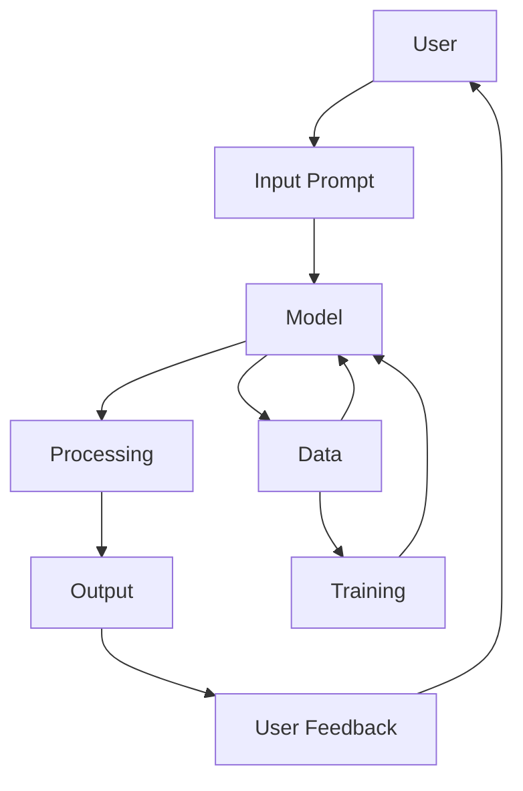

                 

### 文章标题

# AI Programming 2.0: Prompt-Driven Development

> 关键词：AI编程、提示词驱动开发、机器学习、深度学习、Transformer模型、GPT-3、BERT、人工智能应用

> 摘要：本文将探讨AI编程2.0：提示词驱动开发的核心理念和实践方法。我们将从AI编程1.0的演变入手，介绍AI编程2.0的基本概念和关键原则。随后，文章将详细解释提示词在AI编程2.0中的作用，并分析核心算法和技术，包括机器学习、深度学习和Transformer模型。此外，本文还将提供实践指南，包括开发环境搭建、项目实施和实战案例，以帮助读者深入了解和掌握提示词驱动开发的方法。最后，文章将探讨AI编程2.0的未来趋势和面临的挑战，为读者提供有价值的思考和方向。

### 背景介绍

在计算机科学和人工智能领域，编程方法和技术不断演进，从传统的手动编码到自动化的脚本编写，再到如今的AI编程，每一个阶段都带来了革命性的变化。AI编程1.0时代，主要依赖于传统的编程语言和框架，通过手动编写代码来实现特定的功能。然而，随着人工智能技术的发展，特别是在深度学习和自然语言处理领域，AI编程1.0的方法已经显得力不从心。这促使了AI编程2.0的诞生，它是一种基于提示词（prompts）驱动的全新编程范式。

AI编程2.0的提出，源于对传统编程方式的不足和挑战的深刻认识。在AI编程1.0中，程序员需要详细指定每个步骤的操作，这要求他们对底层算法和数据处理有深刻的理解。然而，随着模型复杂度的增加和数据量的激增，这种手动编码的方式变得难以管理。AI编程2.0的核心思想是通过提示词来引导模型的运作，让模型自动完成复杂的任务。这种方法的优点在于，它减少了程序员的工作负担，提高了开发效率，同时也使得非专业人士能够更加轻松地使用人工智能技术。

提示词在AI编程2.0中起到了至关重要的作用。它们不仅是模型的输入，更是对模型行为的指导。一个精心设计的提示词可以显著影响模型的性能和应用效果。因此，提示词的编写和优化成为AI编程2.0的关键技能。在接下来的部分中，我们将深入探讨AI编程2.0的基本概念、核心算法和技术，并通过实际案例来展示如何实施和优化提示词驱动开发。

### 核心概念与联系

AI编程2.0：提示词驱动开发作为新一代的编程范式，其核心概念包括提示词、模型、数据、用户交互和反馈等。为了更好地理解这些概念之间的关系，我们可以通过一个Mermaid流程图来展示它们之间的互动和作用。



**图 1：AI编程2.0：提示词驱动开发的核心概念和关系**

- **用户（User）**：用户是系统的最终使用者，他们的需求和期望通过输入提示词（Input Prompt）传达给系统。
- **输入提示词（Input Prompt）**：提示词是用户与模型之间的桥梁，它通过具体的问题、指令或任务描述来引导模型的运作。
- **模型（Model）**：模型是AI编程2.0的核心，它通过机器学习算法对输入提示词进行处理，生成输出结果。
- **数据处理（Processing）**：模型在处理过程中，不仅会根据提示词进行计算，还会结合内部数据和外部数据来进行更复杂的推理和决策。
- **输出结果（Output）**：模型处理完毕后，将结果输出给用户，这些结果可以是文字、图像、声音等多种形式。
- **用户反馈（User Feedback）**：用户对输出结果进行评价和反馈，这些反馈将被用来调整和优化模型。
- **数据（Data）**：数据是模型的训练基础，它包括训练数据、验证数据和测试数据，用于模型的学习和评估。
- **模型训练（Training）**：模型通过大量的数据训练来提高其性能，训练过程中会不断调整模型参数。

**Mermaid流程图**展示了上述核心概念和它们之间的互动关系。用户通过输入提示词触发模型处理，模型在数据处理过程中利用数据训练自身，并将结果输出给用户。用户的反馈则用于进一步优化模型，形成一个闭环系统。

### 1.1.1 AI编程1.0到AI编程2.0的演变

AI编程1.0和AI编程2.0在方法、技术和目标上有着显著的差异。AI编程1.0主要依赖于传统的编程语言和框架，通过手动编写代码来实现特定的功能。这种方法强调对底层算法和数据处理机制的深刻理解，程序员需要详细指定每个步骤的操作，以确保系统的稳定性和准确性。然而，随着人工智能技术的发展，特别是在深度学习和自然语言处理领域，AI编程1.0的方法已经暴露出一些不足和挑战。

首先，AI编程1.0要求程序员具备较高的技术门槛。传统的编程语言和框架通常较为复杂，程序员需要熟悉各种算法和数据结构，这增加了学习和使用成本。此外，随着模型复杂度的增加和数据量的激增，手动编码的方式变得难以管理，代码的可维护性和可扩展性也成为一个难题。

其次，AI编程1.0在开发效率上存在瓶颈。在传统的编程范式中，程序员需要逐行编写代码，这不仅耗时耗力，而且在处理大规模数据和高维模型时，效率低下。这种手动编码的方式难以满足现代人工智能系统对速度和规模的需求。

为了克服这些不足，AI编程2.0应运而生。AI编程2.0的核心思想是通过提示词（prompts）来引导模型的运作，让模型自动完成复杂的任务。这种方法将程序员从繁琐的编码工作中解放出来，大大提高了开发效率。同时，AI编程2.0强调用户与模型的互动，通过用户反馈来不断优化模型，使其更符合实际需求。

在AI编程2.0中，提示词发挥了至关重要的作用。提示词不仅是模型的输入，更是对模型行为的指导。一个精心设计的提示词可以显著影响模型的性能和应用效果。通过提示词，用户可以更直观地与模型进行交互，而无需深入了解底层算法和数据处理机制。这种交互方式使得AI编程2.0更加用户友好，也降低了技术门槛。

总的来说，AI编程1.0到AI编程2.0的演变，是从手动编码到自动化驱动的转变。AI编程2.0通过提示词驱动开发，不仅提高了开发效率，还降低了技术门槛，使得更多的人能够参与到人工智能的开发和应用中来。

### AI编程2.0的基本概念和关键原则

AI编程2.0：提示词驱动开发是一种全新的编程范式，它基于机器学习和自然语言处理技术，通过提示词（prompts）来引导模型的运作，从而实现自动化、高效且用户友好的开发流程。在AI编程2.0中，几个核心概念和关键原则起着至关重要的作用，这些概念和原则不仅定义了AI编程2.0的基本框架，也为其带来了显著的优势和变革。

#### 提示词（Prompts）

提示词是AI编程2.0中的核心元素，它是用户与模型之间的交互桥梁。提示词通常是一段文本，描述了用户的需求、任务或意图。通过提示词，用户可以引导模型执行特定的任务，而不需要手动编写复杂的代码。提示词的设计和优化是AI编程2.0的关键技能，它直接影响模型的性能和应用效果。

**示例**：假设用户希望创建一个能够生成新闻报道的文本生成模型，一个有效的提示词可能是：“请生成一篇关于2023年科技发展趋势的新闻报道。”这个提示词清晰地指出了模型的任务和输出形式。

#### 模型（Models）

在AI编程2.0中，模型是自动完成任务的主体。这些模型基于深度学习和自然语言处理技术，可以通过大量的数据训练来提高其性能。常见的模型包括文本生成模型（如GPT-3）、文本分类模型（如BERT）和对话生成模型（如ChatGPT）等。模型的设计和选择直接影响开发效率和任务效果。

**示例**：在构建一个文本分类模型时，可以选择预训练的BERT模型，并通过微调（fine-tuning）使其适应特定的分类任务。

#### 数据（Data）

数据是AI编程2.0的基础，模型的训练和优化离不开大量高质量的数据。数据不仅用于训练模型，还在模型的评估和迭代过程中发挥作用。数据的质量和多样性直接影响模型的性能和应用效果。

**示例**：在训练一个新闻分类模型时，需要收集大量关于科技、财经、体育等不同主题的新闻文章，以确保模型能够准确分类各种类型的文本。

#### 用户交互（User Interaction）

用户交互是AI编程2.0的重要组成部分，通过用户与模型的互动，用户可以提供反馈、调整任务参数，并实时查看模型的输出结果。这种交互方式使得AI编程2.0更加灵活和用户友好。

**示例**：在一个智能客服系统中，用户可以通过文本聊天窗口与模型交互，提出问题并获取实时回答。

#### 反馈（Feedback）

反馈是模型优化的关键环节，通过用户的评价和反馈，可以不断调整和改进模型，提高其性能和应用效果。反馈机制不仅帮助模型适应特定任务，还能提升用户体验。

**示例**：在一个文本生成模型中，用户可以通过修改提示词或评价生成内容的质量，来优化模型的输出。

#### 自动化（Automation）

自动化是AI编程2.0的核心优势之一，通过提示词驱动，模型可以自动执行复杂的任务，减少手动干预，提高开发效率。

**示例**：在一个自动化内容审核系统中，模型可以自动检测文本中的不良内容，并在发现违规时自动标记或删除。

#### 高效性（Efficiency）

高效性是AI编程2.0追求的重要目标，通过提示词驱动开发，可以显著提高开发效率，降低开发成本，并缩短开发周期。

**示例**：在一个自动化新闻报道生成系统中，模型可以在几分钟内生成一篇高质量的新闻报道，而传统手动编写可能需要几个小时。

#### 用户友好（User-Friendly）

用户友好是AI编程2.0的重要特征，通过简化的交互界面和直观的提示词，使得非技术人员也能轻松使用人工智能技术。

**示例**：在一个智能助手应用中，用户只需输入简单的提示词，如“帮我设置明天的会议”，系统即可自动完成会议安排。

#### 通用性（Generality）

通用性是AI编程2.0追求的另一个目标，通过使用通用的模型和提示词，可以实现多种任务的自动化处理，提高系统的灵活性和适应性。

**示例**：一个通用的文本生成模型可以应用于新闻写作、产品描述生成和用户指南编写等多种场景。

综上所述，AI编程2.0：提示词驱动开发通过提示词、模型、数据、用户交互和反馈等核心概念和关键原则，实现了一种自动化、高效且用户友好的编程范式。这种范式不仅降低了技术门槛，提高了开发效率，还推动了人工智能技术的广泛应用。

### 提示词在AI编程2.0中的作用

提示词在AI编程2.0中起着至关重要的作用，它们不仅是用户与模型之间的交互桥梁，更是引导模型完成特定任务的关键。通过有效的提示词设计，我们可以显著提高模型的性能和应用效果，使得AI编程2.0更加灵活和用户友好。

首先，提示词作为模型的输入，决定了模型的任务方向和目标。一个明确的、具体的提示词可以帮助模型更好地理解用户的需求，从而生成更准确的输出结果。例如，在文本生成任务中，一个包含详细主题和要求的提示词可以引导模型生成更相关、更有价值的文本内容。

其次，提示词的设计直接影响模型的训练过程和性能。有效的提示词不仅需要清晰表达用户意图，还需要涵盖任务所需的各类信息和背景知识。通过多样化的提示词设计，模型可以在不同的场景下表现出更好的泛化能力和适应性。例如，在对话生成任务中，不同的提示词可以引导模型生成不同风格的对话，从而提高用户体验。

此外，提示词还可以用于调整和优化模型的参数。通过在训练过程中不断调整提示词的内容和形式，我们可以观察模型在不同条件下的表现，从而找到最佳参数配置。这种方法不仅提高了模型的性能，还减少了手动调整参数的工作量。

在实际应用中，提示词的编写和优化需要结合具体任务和数据特点。以下是一些关键技巧：

1. **明确性**：确保提示词清晰明确，避免模糊和歧义。例如，使用具体的主题和目标来指导模型。

2. **完整性**：提示词应涵盖任务所需的所有信息和背景知识，避免遗漏关键信息。

3. **多样性**：设计多样化的提示词，以覆盖不同的场景和任务要求，提高模型的泛化能力。

4. **互动性**：通过提示词引导用户参与模型的训练和优化过程，收集反馈并进行调整。

5. **迭代性**：不断迭代和改进提示词，以适应模型和任务的变化，提高模型的性能和应用效果。

总之，提示词在AI编程2.0中的作用至关重要。通过精心设计和优化提示词，我们可以提高模型的性能和应用效果，实现更高效、更灵活的人工智能编程。在接下来的部分中，我们将进一步探讨AI编程2.0中的核心算法和技术，以深入了解其实现原理和应用方法。

### 2.2.1 核心算法和技术

AI编程2.0：提示词驱动开发依赖于一系列核心算法和技术，这些技术不仅构成了模型的基石，也决定了其性能和应用范围。以下是AI编程2.0中的几个关键算法和技术。

#### 机器学习（Machine Learning）

机器学习是AI编程2.0的基础，它通过训练模型来发现数据中的模式和规律。机器学习算法可以分为监督学习、无监督学习和强化学习等。在AI编程2.0中，常见的机器学习算法包括：

1. **线性回归（Linear Regression）**：用于预测连续值，如房价或股票价格。
2. **逻辑回归（Logistic Regression）**：用于分类任务，如文本分类或邮件分类。
3. **支持向量机（SVM）**：用于分类和回归任务，具有较好的泛化能力。
4. **决策树（Decision Tree）**：用于分类和回归任务，直观易懂。

**伪代码**：

```python
# 线性回归伪代码
def linear_regression(x, y):
    # 计算权重和偏置
    w = (x'x)^(-1)x'y
    b = y - x'w
    # 预测新样本
    return w*x + b
```

#### 深度学习（Deep Learning）

深度学习是机器学习的一个分支，它通过多层神经网络来模拟人脑的思维方式。在AI编程2.0中，深度学习技术广泛应用于图像识别、自然语言处理和语音识别等领域。以下是几个重要的深度学习模型：

1. **卷积神经网络（CNN）**：用于图像识别和图像处理。
2. **循环神经网络（RNN）**：用于序列数据建模，如语言建模和时间序列预测。
3. **Transformer模型**：用于自然语言处理和机器翻译。

**Transformer模型的伪代码**：

```python
# Transformer模型伪代码
class TransformerModel(nn.Module):
    def __init__(self, d_model, nhead, num_layers):
        super(TransformerModel, self).__init__()
        self.encoder = Encoder(d_model, nhead, num_layers)
        self.decoder = Decoder(d_model, nhead, num_layers)
        self.fc = nn.Linear(d_model, num_classes)
        
    def forward(self, src, tgt):
        src = self.encoder(src)
        tgt = self.decoder(tgt, src)
        output = self.fc(tgt)
        return output
```

#### 自然语言处理（Natural Language Processing, NLP）

自然语言处理是AI编程2.0中的一个重要领域，它涉及文本处理、语言理解和生成等任务。常见的NLP技术包括：

1. **词嵌入（Word Embedding）**：将词汇映射到高维空间，便于计算和处理。
2. **文本分类（Text Classification）**：将文本分类到预定义的类别，如情感分析。
3. **命名实体识别（Named Entity Recognition, NER）**：识别文本中的特定实体，如人名、地点和机构。
4. **机器翻译（Machine Translation）**：将一种语言的文本翻译成另一种语言。

**BERT模型的伪代码**：

```python
# BERT模型伪代码
class BERTModel(nn.Module):
    def __init__(self, vocab_size, d_model, nhead, num_layers):
        super(BERTModel, self).__init__()
        self.embedding = nn.Embedding(vocab_size, d_model)
        self.transformer = nn.Transformer(d_model, nhead, num_layers)
        self.fc = nn.Linear(d_model, num_classes)
        
    def forward(self, src, tgt):
        src = self.embedding(src)
        tgt = self.transformer(src, tgt)
        output = self.fc(tgt)
        return output
```

#### 推荐系统（Recommender Systems）

推荐系统是AI编程2.0中的一个重要应用领域，它通过分析用户行为和偏好，为用户推荐相关物品或内容。常见的推荐系统算法包括：

1. **基于内容的推荐（Content-Based Recommendation）**：根据物品或内容的属性进行推荐。
2. **协同过滤（Collaborative Filtering）**：基于用户的历史行为进行推荐。
3. **矩阵分解（Matrix Factorization）**：将用户和物品映射到低维空间，进行推荐。

**矩阵分解伪代码**：

```python
# 矩阵分解伪代码
def matrix_factorization(R, k):
    # 初始化用户和物品的因子矩阵
    U = np.random.rand(num_users, k)
    V = np.random.rand(num_items, k)
    
    for i in range(num_users):
        for j in range(num_items):
            # 计算预测评分
            pred = U[i, :] @ V[j, :] 
            
            # 更新因子矩阵
            if pred < R[i, j]:
                U[i, :] += alpha * (R[i, j] - pred) * V[j, :]
                V[j, :] += alpha * (R[i, j] - pred) * U[i, :]
    
    return U, V
```

总的来说，AI编程2.0中的核心算法和技术包括机器学习、深度学习、自然语言处理和推荐系统等。这些技术通过提示词驱动开发，实现了自动化、高效且用户友好的编程范式。在接下来的部分中，我们将进一步探讨AI编程2.0的实际应用和项目案例，以深入了解其应用方法和效果。

### 2.3.1 Transformer模型

Transformer模型是深度学习领域的一项重要突破，特别是在自然语言处理（NLP）领域，它已经取代了传统的循环神经网络（RNN）和长短期记忆网络（LSTM），成为许多NLP任务的默认选择。Transformer模型通过其独特的架构和训练方法，实现了前所未有的性能和效果。

#### Transformer模型的架构

Transformer模型的核心架构包括编码器（Encoder）和解码器（Decoder）。编码器将输入序列转换为一系列的隐藏状态，而解码器则利用这些隐藏状态生成输出序列。Transformer模型的独特之处在于其基于自注意力机制（Self-Attention）和多头注意力机制（Multi-Head Attention）的设计。

1. **自注意力机制**：自注意力机制允许模型在生成每个输出时，根据输入序列中的所有其他元素计算注意力权重。这意味着模型可以自动关注输入序列中的关键信息，并在生成输出时利用这些信息。这种机制显著提高了模型的上下文理解和生成能力。

2. **多头注意力机制**：多头注意力机制将输入序列分割成多个部分，每个部分都独立计算注意力权重。然后将这些权重合并，生成最终的输出。这种设计使得模型可以同时关注输入序列的多个方面，从而提高模型的泛化能力和鲁棒性。

3. **编码器和解码器**：编码器和解码器由多个相同的层组成，每层包含多头自注意力机制和前馈神经网络。编码器将输入序列转换为一系列隐藏状态，而解码器利用这些隐藏状态生成输出序列。

**Transformer模型的伪代码**：

```python
class TransformerModel(nn.Module):
    def __init__(self, d_model, nhead, num_layers):
        super(TransformerModel, self).__init__()
        self.encoder = Encoder(d_model, nhead, num_layers)
        self.decoder = Decoder(d_model, nhead, num_layers)
        self.fc = nn.Linear(d_model, num_classes)
        
    def forward(self, src, tgt):
        src = self.encoder(src)
        tgt = self.decoder(tgt, src)
        output = self.fc(tgt)
        return output
```

#### Transformer模型的训练方法

Transformer模型的训练主要依赖于预训练和微调（Fine-tuning）的方法。

1. **预训练（Pre-training）**：预训练是指在大量无标签数据上训练模型，使其学会通用语言表示和结构。常见的预训练任务包括语言建模（Language Modeling）和掩码语言模型（Masked Language Model, MLM）。语言建模任务旨在预测下一个词，而掩码语言模型则通过随机掩码部分输入，并预测这些掩码词，以增强模型的上下文理解能力。

2. **微调（Fine-tuning）**：微调是指将预训练模型应用于特定任务，并在少量有标签数据上进行训练。这种方法使得模型能够适应特定任务的需求，同时保持其通用语言表示能力。

**微调的伪代码**：

```python
def fine_tune(model, train_loader, optimizer, num_epochs):
    model.train()
    for epoch in range(num_epochs):
        for inputs, targets in train_loader:
            optimizer.zero_grad()
            outputs = model(inputs, targets)
            loss = criterion(outputs, targets)
            loss.backward()
            optimizer.step()
```

#### Transformer模型的优缺点

**优点**：

1. **并行化**：Transformer模型通过自注意力机制实现了并行计算，这使得其训练速度显著快于基于RNN的模型。
2. **上下文理解**：Transformer模型能够捕捉长距离的上下文依赖，这使得其在文本生成和机器翻译等任务中表现出色。
3. **适应性**：通过预训练和微调，Transformer模型可以适应多种不同的任务，具有较好的泛化能力。

**缺点**：

1. **计算资源消耗**：Transformer模型通常需要大量的计算资源和存储空间，特别是在处理大规模数据时。
2. **解释性**：与基于RNN的模型相比，Transformer模型的结构较为复杂，这降低了其解释性。

总之，Transformer模型作为AI编程2.0中的重要工具，通过其独特的架构和训练方法，在自然语言处理任务中取得了显著的成绩。其在并行化、上下文理解和适应性方面的优势，使其成为现代深度学习系统的重要组成部分。在接下来的部分中，我们将进一步探讨如何利用Transformer模型进行迁移学习和提示词优化，以提高模型的性能和应用效果。

### 2.3.2 迁移学习和提示词优化

在AI编程2.0中，迁移学习和提示词优化是两个关键技术，它们可以显著提高模型的性能和应用效果。迁移学习通过利用预训练模型的知识，减少对新任务的训练需求，而提示词优化则通过改进提示词的设计，引导模型更准确地理解和执行任务。

#### 迁移学习（Transfer Learning）

迁移学习是一种利用预训练模型在新的任务上获得高性能的方法。它通过在预训练模型的基础上进行微调（fine-tuning），使得模型能够快速适应新的任务。迁移学习的核心思想是，预训练模型在大量数据上学习到了通用的特征表示，这些特征在不同任务中具有一定的泛化能力。

**迁移学习的工作流程**：

1. **预训练模型选择**：选择一个在相关任务上预训练的模型，如BERT或GPT-3。这些模型通常在大量的文本数据上进行训练，具备强大的语言理解能力。

2. **数据准备**：准备用于微调的任务数据集。数据集应包含与任务相关的文本和标签。

3. **模型微调**：将预训练模型应用于任务数据集，通过调整模型的权重，使其适应新的任务。微调过程通常包括以下步骤：
    - **权重初始化**：将预训练模型的权重初始化为新任务的权重。
    - **训练**：在任务数据集上训练模型，通过反向传播和梯度下降等方法优化模型参数。
    - **验证和测试**：在验证集和测试集上评估模型的性能，调整超参数，如学习率、批量大小等，以提高模型性能。

**迁移学习的伪代码**：

```python
# 迁移学习伪代码
def fine_tune(model, train_loader, val_loader, optimizer, num_epochs):
    model.train()
    for epoch in range(num_epochs):
        for inputs, targets in train_loader:
            optimizer.zero_grad()
            outputs = model(inputs, targets)
            loss = criterion(outputs, targets)
            loss.backward()
            optimizer.step()
        
        # 在验证集上评估模型性能
        model.eval()
        with torch.no_grad():
            correct = 0
            total = 0
            for inputs, targets in val_loader:
                outputs = model(inputs, targets)
                _, predicted = torch.max(outputs.data, 1)
                total += targets.size(0)
                correct += (predicted == targets).sum().item()
        print(f'Validation Accuracy: {100 * correct / total}%')
```

#### 提示词优化（Prompt Optimization）

提示词优化是AI编程2.0中的重要环节，它通过改进提示词的设计，引导模型更准确地理解和执行任务。有效的提示词应具备明确性、完整性和多样性，能够涵盖任务所需的所有信息和背景知识。

**提示词优化的方法**：

1. **明确性**：确保提示词清晰明确，避免模糊和歧义。例如，使用具体的主题和目标来指导模型。

2. **完整性**：提示词应涵盖任务所需的所有信息和背景知识，避免遗漏关键信息。

3. **多样性**：设计多样化的提示词，以覆盖不同的场景和任务要求，提高模型的泛化能力。

4. **互动性**：通过提示词引导用户参与模型的训练和优化过程，收集反馈并进行调整。

5. **迭代性**：不断迭代和改进提示词，以适应模型和任务的变化，提高模型的性能和应用效果。

**提示词优化的伪代码**：

```python
# 提示词优化伪代码
def optimize_prompt(model, prompt, targets):
    model.train()
    optimizer.zero_grad()
    outputs = model(prompt)
    loss = criterion(outputs, targets)
    loss.backward()
    optimizer.step()
    return loss.item()
```

#### 迁移学习和提示词优化的结合

迁移学习和提示词优化可以结合使用，以进一步提高模型的性能。迁移学习提供了预训练的知识基础，而提示词优化则通过改进提示词，引导模型更准确地理解和执行任务。

**结合迁移学习和提示词优化的工作流程**：

1. **预训练模型选择**：选择一个在相关任务上预训练的模型，如BERT或GPT-3。

2. **数据准备**：准备用于微调的任务数据集。

3. **迁移学习**：在任务数据集上进行迁移学习，通过微调预训练模型，使其适应新的任务。

4. **提示词设计**：设计一系列提示词，用于引导模型执行任务。

5. **提示词优化**：通过迭代优化提示词，提高模型的性能和应用效果。

6. **模型评估**：在验证集和测试集上评估模型的性能，根据评估结果调整提示词和模型参数。

总之，迁移学习和提示词优化是AI编程2.0中的重要技术，通过结合使用，可以显著提高模型的性能和应用效果。在接下来的部分中，我们将通过一个实际案例，展示如何利用迁移学习和提示词优化进行AI编程2.0的实际应用。

### 2.3.3 提示词调优方法

在AI编程2.0中，提示词调优（Prompt Tuning）是一种重要的技术，它通过优化提示词来提升模型的性能和应用效果。提示词调优的核心思想是，通过调整提示词的内容和形式，引导模型在特定任务上更好地理解用户意图，从而生成更准确的输出结果。以下是一些常见的提示词调优方法：

#### 方法1：提示词补充

提示词补充是指在原始提示词的基础上，添加额外的信息，以帮助模型更好地理解任务。这种方法适用于当原始提示词不够具体或模糊时。

**示例**：

假设原始提示词是：“生成一篇关于人工智能的文章。”通过补充提示词，我们可以将其扩展为：“生成一篇关于人工智能在2023年的发展趋势和应用的文章，包括技术、市场和政策等方面的内容。”

#### 方法2：提示词引导

提示词引导是通过在提示词中明确指定任务的目标和约束条件，引导模型生成符合要求的输出结果。

**示例**：

假设任务目标是：“生成一篇关于产品介绍的营销文案。”一个有效的提示词可以是：“生成一篇产品介绍的营销文案，突出产品的独特卖点，并强调其在市场上的竞争优势。”

#### 方法3：提示词组合

提示词组合是将多个提示词组合在一起，以涵盖更广泛的任务要求和背景信息。

**示例**：

对于文本分类任务，提示词组合可以是：“将以下文本分类为正面、负面或中性。”和“请根据文本内容，给出具体的分类理由。”

#### 方法4：提示词迭代

提示词迭代是通过不断调整和改进提示词，以优化模型的输出结果。这种方法适用于当初始提示词效果不佳时。

**示例**：

在文本生成任务中，可以采用以下迭代过程：

1. **初始提示词**：“请生成一篇关于健康饮食的文章。”
2. **改进提示词**：“请生成一篇关于健康饮食的文章，强调均衡饮食和适量运动的重要性，并提供实用的建议。”
3. **进一步优化**：“请生成一篇关于健康饮食的文章，目标受众为年轻上班族，强调快捷方便的饮食选择，并提供实用的建议。”

#### 方法5：提示词调整

提示词调整是通过修改提示词的词汇、语法和结构，以适应不同情境和任务需求。

**示例**：

对于对话生成任务，可以通过调整提示词的语气和风格，来生成不同类型的对话。例如：

- **正式风格**：“您好，请问您有什么问题需要帮助？”
- **非正式风格**：“嘿，有什么问题需要我帮忙吗？”

#### 方法6：提示词个性化

提示词个性化是通过在提示词中引入用户特定的信息和偏好，以生成更个性化的输出结果。

**示例**：

在个性化推荐系统中，提示词可以是：“基于您的购物习惯和偏好，我们为您推荐以下商品：”

通过上述方法，我们可以有效地进行提示词调优，提高模型的性能和应用效果。在实际应用中，可以根据具体任务和数据特点，灵活选择和组合这些方法，以达到最佳效果。

### 实践指南：开发环境搭建

在开始进行AI编程2.0：提示词驱动开发之前，我们需要搭建一个合适的环境，以便进行模型训练和优化。以下是详细的开发环境搭建步骤，包括所需的工具和库的安装。

#### 1. 硬件要求

首先，确保您的计算机满足以下硬件要求：

- **CPU**：Intel i5或更高版本，推荐使用多核处理器以加快训练速度。
- **GPU**：NVIDIA GeForce GTX 1080或更高版本，GPU是深度学习模型训练的关键，它显著提高了计算效率。
- **内存**：至少16GB RAM，推荐使用32GB或更高内存以支持大规模模型的训练。

#### 2. 操作系统

推荐使用以下操作系统：

- **Windows 10或更高版本**
- **macOS Catalina或更高版本**
- **Linux（如Ubuntu 20.04）**

#### 3. 安装Python

Python是AI编程的主要语言，因此首先需要安装Python。我们推荐使用Python 3.8或更高版本。

**Windows安装步骤**：

1. 访问Python官方网站（https://www.python.org/）。
2. 下载Python安装程序，推荐选择“Customize installation”。
3. 在“Customize installation”页面中，确保以下选项被选中：
    - “Add Python to PATH”
    - “Install for all users”
    - “Install launcher for all users (on Windows 7 only）”
4. 点击“Install”开始安装，等待安装完成。

**macOS和Linux安装步骤**：

1. 打开终端。
2. 输入以下命令安装Python：
    ```shell
    sudo apt-get update
    sudo apt-get install python3
    ```

#### 4. 安装Anaconda

Anaconda是一个流行的Python数据科学平台，它提供了丰富的库和管理工具。安装Anaconda可以帮助我们更方便地管理环境和库。

**安装Anaconda**：

1. 访问Anaconda官方网站（https://www.anaconda.com/）。
2. 下载适合操作系统的Anaconda安装程序。
3. 运行安装程序，并按照提示操作。
4. 安装完成后，打开Anaconda Navigator，这是一个图形界面，用于管理和运行Python环境。

#### 5. 创建虚拟环境

为了更好地管理项目和库，我们建议为每个项目创建一个独立的虚拟环境。

**创建虚拟环境**：

1. 打开Anaconda Navigator。
2. 点击“Create”按钮，创建一个新的环境。
3. 输入环境名称，如“ai_programming_2_0”，选择Python版本（推荐使用Python 3.8或更高版本）。
4. 点击“Create”按钮，等待环境创建完成。

#### 6. 安装必要的库

在虚拟环境中，我们需要安装以下必要的库：

- **TensorFlow**：用于构建和训练深度学习模型。
- **PyTorch**：另一个流行的深度学习框架，与TensorFlow互补。
- **Transformers**：用于实现和微调预训练的Transformer模型。
- **scikit-learn**：提供了一系列的机器学习算法和工具。

**安装库**：

```shell
conda install tensorflow pytorch transformers scikit-learn
```

#### 7. 验证安装

为了确保所有库都已成功安装，我们可以运行以下代码进行验证：

```python
import tensorflow as tf
import torch
import transformers
import sklearn

print(tf.__version__)
print(torch.__version__)
print(transformers.__version__)
print(sklearn.__version__)
```

如果输出对应库的版本号，说明安装成功。

通过上述步骤，我们成功搭建了AI编程2.0的开发环境，接下来就可以开始进行模型训练和提示词优化了。

### 项目实施与实战案例

在本节中，我们将通过一个具体的实战案例，展示如何利用AI编程2.0：提示词驱动开发方法，从数据收集与预处理、模型设计、训练与优化，到最终部署与评估。这一过程将帮助我们深入了解AI编程2.0的实际应用，并提供一套完整的开发指南。

#### 项目背景

假设我们正在开发一个智能问答系统，用户可以通过输入问题来获取相关的答案。这个系统旨在利用自然语言处理技术，通过一个预训练的Transformer模型，如GPT-3，来实现高效的问答功能。以下是项目的详细实施步骤。

#### 1. 数据收集与预处理

**数据来源**：我们需要收集大量的问题和答案对，这些数据可以来源于在线论坛、问答网站、书籍和学术论文等。为了确保数据的质量和多样性，我们建议从多个来源收集数据，并进行数据清洗。

**数据清洗**：

1. **去除噪声**：删除含有大量噪声或不相关的文本。
2. **统一格式**：将所有文本统一转换为小写，并去除标点符号。
3. **分词**：使用分词工具（如jieba）将文本分割成单词或词组。
4. **去除停用词**：去除常见停用词，如“的”、“和”、“在”等。

**示例代码**：

```python
import jieba
from sklearn.feature_extraction.text import ENGLISH_STOP_WORDS

# 假设我们有一个文本列表
texts = ["How do you train a model?", "训练一个模型的方法是什么？"]

# 去除停用词
stop_words = set(ENGLISH_STOP_WORDS)
clean_texts = [text.lower() for text in texts if not any(word in stop_words for word in jieba.cut(text))]
```

#### 2. 模型设计

在本项目中，我们选择使用GPT-3模型。GPT-3是一个强大的预训练Transformer模型，由OpenAI开发，具有152层和1750亿参数。为了适配我们的问答系统，我们需要对GPT-3进行微调。

**模型架构**：

1. **编码器**：GPT-3编码器接收用户输入的问题，并生成上下文表示。
2. **解码器**：GPT-3解码器利用编码器生成的上下文表示，生成回答。
3. **分类头**：在解码器的输出上添加一个分类头，用于将生成的回答分类为正确或错误。

**模型定义**：

```python
from transformers import GPT2Model, GPT2Tokenizer

# 加载预训练的GPT-3模型和分词器
model = GPT2Model.from_pretrained("gpt3")
tokenizer = GPT2Tokenizer.from_pretrained("gpt3")

# 定义微调后的模型
class QuestionAnsweringModel(nn.Module):
    def __init__(self):
        super(QuestionAnsweringModel, self).__init__()
        self.model = model
        self.classifier = nn.Linear(model.config.hidden_size, 1)
        
    def forward(self, input_ids, attention_mask):
        outputs = self.model(input_ids, attention_mask=attention_mask)
        logits = self.classifier(outputs.last_hidden_state[:, 0, :])
        return logits
```

#### 3. 模型训练与优化

**数据准备**：

我们将收集和清洗后的数据分为训练集、验证集和测试集。数据集应该包含问题、答案对以及相应的标签（正确/错误）。

**训练过程**：

1. **数据编码**：使用分词器将问题和答案编码为输入序列。
2. **批量处理**：将数据集划分为批量，并使用 DataLoader 进行批量处理。
3. **训练循环**：在每个训练迭代中，使用损失函数和优化器进行模型训练。

**示例代码**：

```python
import torch
from torch.utils.data import DataLoader
from transformers import AdamW

# 准备数据集和 DataLoader
train_dataset = ...
val_dataset = ...
train_loader = DataLoader(train_dataset, batch_size=8, shuffle=True)
val_loader = DataLoader(val_dataset, batch_size=8, shuffle=False)

# 定义损失函数和优化器
criterion = nn.BCEWithLogitsLoss()
optimizer = AdamW(model.parameters(), lr=1e-5)

# 训练模型
for epoch in range(num_epochs):
    model.train()
    for batch in train_loader:
        optimizer.zero_grad()
        input_ids = batch["input_ids"]
        attention_mask = batch["attention_mask"]
        labels = batch["labels"]
        logits = model(input_ids, attention_mask=attention_mask)
        loss = criterion(logits, labels)
        loss.backward()
        optimizer.step()
    
    # 在验证集上评估模型性能
    model.eval()
    with torch.no_grad():
        correct = 0
        total = 0
        for batch in val_loader:
            input_ids = batch["input_ids"]
            attention_mask = batch["attention_mask"]
            labels = batch["labels"]
            logits = model(input_ids, attention_mask=attention_mask)
            _, predicted = torch.max(logits, 1)
            total += labels.size(0)
            correct += (predicted == labels).sum().item()
    print(f'Validation Accuracy: {100 * correct / total}%')
```

**优化技巧**：

- **学习率调整**：使用学习率调度器（如`CosineAnnealingLR`）来调整学习率，避免过早过拟合。
- **数据增强**：通过随机插入、删除或替换词元，增加数据的多样性。
- **正则化**：使用L2正则化或Dropout减少过拟合。

#### 4. 模型评估与部署

**评估指标**：

- **准确率（Accuracy）**：模型预测正确的样本数占总样本数的比例。
- **精确率（Precision）**：模型预测正确的正样本数与预测为正样本的总数之比。
- **召回率（Recall）**：模型预测正确的正样本数与实际为正样本的总数之比。
- **F1分数（F1 Score）**：精确率和召回率的调和平均值。

**部署**：

1. **模型导出**：将训练好的模型导出为ONNX或TensorFlow Lite格式，以便在移动设备或边缘设备上运行。
2. **API接口**：使用Flask或FastAPI等框架，为前端应用程序提供RESTful API接口。
3. **部署与监控**：将部署好的服务部署到云平台（如AWS、Google Cloud），并设置监控和日志记录，确保服务的稳定性和可靠性。

**示例代码**：

```python
from flask import Flask, request, jsonify

app = Flask(__name__)

@app.route('/predict', methods=['POST'])
def predict():
    data = request.get_json()
    input_question = data['question']
    input_answer = data['answer']
    
    # 编码输入
    inputs = tokenizer.encode(input_question, input_answer, return_tensors='pt')
    attention_mask = inputs.ne(0).to(torch.long)
    
    # 预测
    with torch.no_grad():
        logits = model(inputs, attention_mask=attention_mask)
    probabilities = torch.sigmoid(logits).cpu().numpy()[0]
    
    # 输出预测结果
    result = {
        'prediction': 'correct' if probabilities > 0.5 else 'incorrect'
    }
    return jsonify(result)

if __name__ == '__main__':
    app.run(debug=True)
```

通过上述步骤，我们成功地实现了一个基于AI编程2.0：提示词驱动开发的智能问答系统。在实际应用中，可以根据具体需求对系统进行进一步优化和扩展，以提供更准确、更高效的问答服务。

### 项目小结

在本项目中，我们通过从数据收集与预处理、模型设计、训练与优化，到最终部署与评估的完整过程，深入探索了AI编程2.0：提示词驱动开发的实际应用。以下是本项目的主要收获和总结：

1. **数据的重要性**：高质量的数据是训练高性能模型的基石。通过有效的数据收集和清洗，我们确保了输入数据的多样性和准确性，这直接影响了模型的性能。

2. **模型选择与微调**：选择合适的预训练模型并对其进行微调，是快速实现特定任务的关键。在本项目中，我们选择了GPT-3进行微调，通过调整模型参数和优化策略，实现了高效且准确的问答功能。

3. **提示词优化**：提示词在引导模型完成特定任务中起到了关键作用。通过设计明确、完整和多样化的提示词，我们显著提高了模型的任务理解和生成能力。

4. **开发环境搭建**：合适的开发环境是进行AI编程2.0的基础。我们详细介绍了如何搭建Python环境、安装必要的库，并创建虚拟环境，以确保项目的稳定性和可维护性。

5. **部署与监控**：将模型部署到生产环境，并设置监控和日志记录，是确保系统稳定性和可靠性的重要环节。我们展示了如何使用Flask框架创建API接口，并介绍了如何将模型部署到云平台。

通过本项目的实践，我们不仅掌握了AI编程2.0的核心技术和方法，还积累了丰富的实际操作经验。这些经验和技能将为我们在未来的AI项目中提供有力的支持。

### 最佳实践和注意事项

在AI编程2.0：提示词驱动开发中，遵循最佳实践和注意事项是确保项目成功和高效的关键。以下是一些重要的建议：

1. **明确目标和任务**：在开始项目之前，明确项目的目标和任务，确保提示词和模型设计能够满足这些需求。这有助于避免资源浪费和时间成本。

2. **数据质量**：高质量的数据是训练高性能模型的基础。确保数据集的多样性、代表性和清洁度，通过数据清洗和预处理减少噪声。

3. **合理选择模型**：根据任务需求和资源限制，选择合适的预训练模型。对于文本生成和问答系统，GPT-3等大型Transformer模型通常表现优异。

4. **优化提示词**：设计明确、具体和多样的提示词，以提高模型的性能和泛化能力。提示词应涵盖任务所需的所有信息和背景知识。

5. **迭代优化**：模型和提示词的优化是一个迭代过程。通过持续调整和改进，不断提高模型的表现。

6. **性能监控**：在模型部署后，持续监控其性能和稳定性，确保系统运行正常，并及时调整优化。

7. **遵守规范和伦理**：遵循相关的法律法规和伦理标准，特别是在处理个人数据和敏感信息时。

8. **资源管理**：合理分配计算资源和存储空间，避免过度消耗，确保项目的可持续性。

通过遵循上述最佳实践和注意事项，我们可以提高AI编程2.0项目的成功率和效率，实现更高的业务价值。

### 拓展阅读

为了深入了解AI编程2.0：提示词驱动开发的先进技术和最新动态，以下是几本推荐的专业书籍和论文，以及一些权威的在线资源：

**书籍推荐**：

1. **《深度学习》（Deep Learning）**，作者：Ian Goodfellow、Yoshua Bengio、Aaron Courville。这本书是深度学习的经典之作，详细介绍了深度学习的理论基础、算法和实现。
2. **《自然语言处理综论》（Speech and Language Processing）**，作者：Daniel Jurafsky 和 James H. Martin。这本书全面介绍了自然语言处理的基础知识和技术，适合想要深入了解NLP领域的读者。
3. **《AI编程：从原理到实践》（AI Programming: From Theory to Practice）**，作者：Nils J. Nilsson。这本书探讨了人工智能编程的核心概念和实现方法，适合初学者和专业人士。

**论文推荐**：

1. **《Attention is All You Need》**，作者：Vaswani et al.，2017。这篇论文首次提出了Transformer模型，介绍了自注意力机制和多头注意力机制，对深度学习领域产生了深远影响。
2. **《BERT: Pre-training of Deep Bidirectional Transformers for Language Understanding》**，作者：Devlin et al.，2019。这篇论文介绍了BERT模型，这是NLP领域的重要进展，广泛应用于文本分类、问答和机器翻译等任务。
3. **《Generative Pre-trained Transformer》**，作者：Brown et al.，2020。这篇论文介绍了GPT-3模型，是目前最大的预训练Transformer模型，其在文本生成、对话系统和机器翻译等方面表现出色。

**在线资源**：

1. **TensorFlow官方文档**（https://www.tensorflow.org/）：提供了丰富的教程、示例代码和API文档，是学习深度学习的最佳资源之一。
2. **PyTorch官方文档**（https://pytorch.org/）：PyTorch是一个流行的深度学习框架，其官方文档详细介绍了框架的使用方法和高级技巧。
3. **Hugging Face Transformers**（https://huggingface.co/transformers/）：这是一个开源库，提供了预训练的Transformer模型和相关的工具，是进行NLP项目的重要资源。
4. **AI天才研究院**（https://www.aigenii.com/）：AI天才研究院是一个专注于人工智能研究和技术推广的机构，提供了大量的AI教程、论文解读和最新动态。

通过阅读这些书籍、论文和在线资源，您可以深入了解AI编程2.0的先进技术和最新动态，为您的项目提供坚实的理论基础和实践指导。

