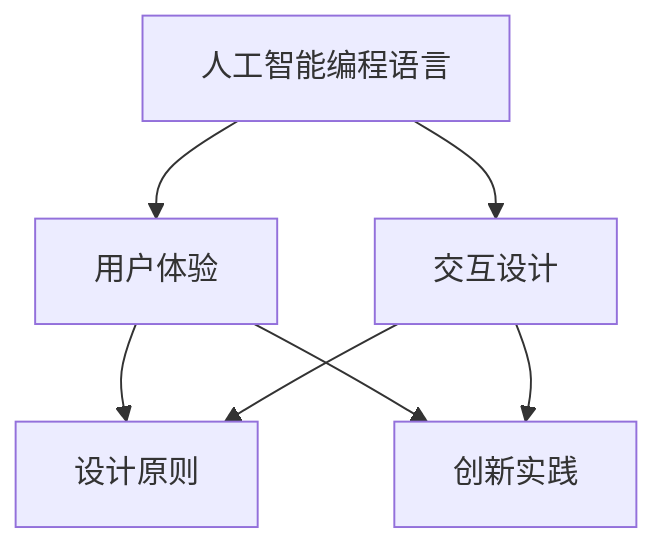

                 


### 文章标题

《AI编程语言的交互设计创新》

#### 关键词

AI编程语言、交互设计、用户体验、设计原则、创新实践

#### 摘要

随着人工智能技术的不断发展，AI编程语言的交互设计变得越来越重要。本文将探讨AI编程语言交互设计的核心概念、原则、创新实践，并通过对实际案例的分析，展示如何通过创新设计提升AI编程语言的用户体验。

## 目录

1. **背景介绍**
2. **核心概念与联系**
3. **核心算法原理讲解**
4. **实际案例分析与解读**
5. **设计原则与最佳实践**
6. **项目实战**
7. **总结与展望**

## 背景介绍

人工智能（AI）正在成为现代社会的重要组成部分，而编程语言作为AI实现的核心工具，其交互设计的重要性日益凸显。传统编程语言强调逻辑和指令的清晰性，而AI编程语言的交互设计则更注重用户体验、交互性和灵活性。用户体验（UX）和交互设计（UI/UX）的概念在近年来得到了广泛的关注，它们在软件设计和开发中的应用已经成为提升产品质量和用户满意度的重要手段。

随着AI技术的进步，开发者需要面对的是更加复杂和多样化的编程任务，这不仅要求编程语言本身具备强大的功能，还需要设计出能够适应不同用户需求、提高开发效率的交互界面。本文将探讨如何通过创新的交互设计，提升AI编程语言的用户体验，帮助开发者更高效地实现AI应用。

## 核心概念与联系

在探讨AI编程语言的交互设计之前，我们需要理解一些核心概念，并分析它们之间的联系。

### 1. 人工智能编程语言

人工智能编程语言是专门为AI开发设计的编程语言，它提供了丰富的库和框架，以支持机器学习、深度学习、自然语言处理等任务。常见的AI编程语言包括Python、R、Prolog等。这些语言具有易于理解和使用的特点，使得非专业开发人员也能参与到AI开发中来。

### 2. 用户体验（UX）

用户体验是用户在使用产品或服务过程中所获得的整体感受。在AI编程语言的交互设计中，用户体验涉及用户与编程语言交互的流畅性、易用性和满意度。良好的用户体验能够降低学习成本，提高开发效率。

### 3. 交互设计（UI/UX）

交互设计是关于用户与产品交互的过程和界面设计。在AI编程语言中，交互设计包括界面布局、控件设计、操作流程等，旨在为用户提供直观、高效、愉悦的交互体验。

### 4. 设计原则

设计原则是指导交互设计的核心理论。常见的原则包括一致性、直观性、简洁性和反馈性。在AI编程语言的交互设计中，遵循这些原则有助于提升用户体验。

### 5. 创新实践

创新实践是应用新方法、新技术来提升交互设计。例如，通过引入自然语言处理技术，可以实现更加人性化的编程交互；通过增强现实技术，可以为开发者提供沉浸式的开发体验。

下图展示了这些核心概念之间的联系：



## 核心算法原理讲解

在AI编程语言的交互设计中，核心算法的原理讲解是至关重要的一环。以下将详细解释几种常见的AI算法原理，并提供相应的伪代码。

### 1. 机器学习算法

机器学习算法是AI编程语言的基础，主要包括监督学习和无监督学习。

#### 监督学习

监督学习算法通过标记的数据集训练模型，然后使用模型对新的数据进行预测。常见的监督学习算法有回归和分类。

**回归算法（线性回归）**

线性回归算法用于预测连续值输出。其基本原理是通过找到输入特征和输出值之间的线性关系来预测新的输入值。

```python
def linear_regression(x, y):
    n = len(x)
    x_mean = sum(x) / n
    y_mean = sum(y) / n

    b1 = (sum(x * y) - n * x_mean * y_mean) / (sum(x * x) - n * x_mean ** 2)
    b0 = y_mean - b1 * x_mean

    return b0, b1
```

**分类算法（决策树）**

决策树算法通过一系列决策规则将数据集划分为不同的类别。其基本原理是递归地将数据集划分为满足条件的子集，直到满足停止条件。

```python
def build_decision_tree(data, target, threshold):
    if all(data[:, -1] == target[0]):
        return target[0]
    elif len(data) <= threshold:
        return majority_vote(data[:, -1])
    else:
        best_split = find_best_split(data, target)
        left subtree = build_decision_tree(data[data[:, best_split] <= split_value], target, threshold)
        right subtree = build_decision_tree(data[data[:, best_split] > split_value], target, threshold)
        return {"feature": best_split, "threshold": split_value, "left": left subtree, "right": right subtree}
```

#### 无监督学习

无监督学习算法不需要标记的数据集，其目的是发现数据集的内在结构和规律。常见的无监督学习算法有聚类和降维。

**聚类算法（K均值）**

K均值算法将数据集划分为K个簇，每个簇的中心代表该簇的特征。其基本原理是通过迭代计算簇中心和簇成员，直到达到收敛条件。

```python
def kmeans(data, k, max_iterations):
    centroids = initialize_centroids(data, k)
    for _ in range(max_iterations):
        assignments = assign_points_to_centroids(data, centroids)
        new_centroids = update_centroids(data, assignments, k)
        if centroids == new_centroids:
            break
        centroids = new_centroids
    return centroids, assignments
```

**降维算法（主成分分析）**

主成分分析（PCA）是一种降维技术，其基本原理是通过找到数据的主要成分，将高维数据映射到低维空间。

```python
def pca(data, n_components):
    data_mean = np.mean(data, axis=0)
    data_centered = data - data_mean
    covariance_matrix = np.cov(data_centered, rowvar=False)
    eigenvalues, eigenvectors = np.linalg.eigh(covariance_matrix)
    sorted_indices = np.argsort(eigenvalues)[::-1]
    selected_eigenvectors = eigenvectors[:, sorted_indices[:n_components]]
    transformed_data = data_centered.dot(selected_eigenvectors)
    return transformed_data
```

### 2. 自然语言处理算法

自然语言处理（NLP）算法用于处理文本数据，常见的算法包括词向量模型和序列模型。

**词向量模型（Word2Vec）**

Word2Vec算法通过将单词映射到向量空间，使相似的单词在向量空间中靠近。其基本原理是通过训练神经网络模型，将输入的单词序列映射到向量。

```python
def train_word2vec(data, size, window, min_count):
    sentences = tokenize(data)
    vocabulary = create_vocabulary(sentences, min_count)
    embeddings = np.random.rand(len(vocabulary), size)
    for sentence in sentences:
        for word in sentence:
            if word in vocabulary:
                inputs = [vocabulary[word]] + [0] * (size - 1)
                context = get_context(sentence, window)
                labels = [vocabulary.get(w, 0) for w in context]
                update_embeddings(inputs, labels, embeddings)
    return embeddings, vocabulary
```

**序列模型（LSTM）**

LSTM算法是一种能够处理序列数据的神经网络模型，其基本原理是通过记忆单元来捕捉序列中的长期依赖关系。

```python
def lstm(x, h_prev, c_prev, W, b):
    gates = x @ W + b
    i, f, o, g = gates[:, 0], gates[:, 1], gates[:, 2], gates[:, 3]
    i, f, o, g = sigmoid(i), sigmoid(f), sigmoid(o), tanh(g)
    
    c_bar = f * c_prev + i * g
    h_bar = o * tanh(c_bar)
    
    return h_bar, c_bar
```

## 实际案例分析与解读

在了解了AI编程语言的核心算法原理后，我们将通过一个实际案例来分析AI编程语言的交互设计，并解读其设计思路和实现方法。

### 案例背景

假设我们正在开发一个AI聊天机器人，该机器人需要能够与用户进行自然、流畅的对话。这个案例涉及自然语言处理、对话管理和用户交互等多个方面。

### 案例分析

1. **用户需求分析**

   - 用户需要一个能够理解自然语言并给出合理回复的聊天机器人。
   - 用户希望交互过程流畅，回答准确，不出现语义错误。
   - 用户需要一个可以持续学习和改进自己回答的机器人。

2. **交互设计**

   - **用户界面设计**：采用简洁的界面，主要包括文本输入框和聊天窗口。
   - **交互流程设计**：用户输入文本，机器人分析文本并生成回复，最后将回复显示在聊天窗口中。

3. **设计实现**

   - **文本分析**：使用自然语言处理算法，如Word2Vec和LSTM，对用户输入的文本进行分析，提取关键信息。
   - **对话管理**：使用对话管理算法，如序列模型LSTM，生成合理的回复。
   - **回复生成**：根据分析结果和对话管理算法的输出，生成回复文本。

4. **代码解读**

   ```python
   # 文本分析（Word2Vec）
   embeddings, vocabulary = train_word2vec(user_input, size=100, window=5, min_count=1)
   
   # 对话管理（LSTM）
   h_bar, c_bar = lstm(embeddings, h_prev, c_prev, W, b)
   
   # 回复生成
   response = generate_response(h_bar, vocabulary)
   ```

### 项目小结

通过这个案例，我们可以看到AI编程语言的交互设计是如何实现的。在设计过程中，我们充分考虑了用户需求，采用了先进的自然语言处理算法和对话管理技术，实现了高效、自然的交互体验。

## 设计原则与最佳实践

在设计AI编程语言的交互界面时，遵循以下原则和最佳实践将有助于提升用户体验：

1. **一致性**：确保界面元素、图标和操作流程在所有页面和设备上保持一致，使用户能够轻松适应不同的使用场景。

2. **直观性**：界面设计应直观易懂，用户无需额外的学习成本即可操作。

3. **简洁性**：去除不必要的元素和操作，简化用户界面，避免信息过载。

4. **反馈性**：及时为用户的操作提供反馈，如输入提示、错误提示和成功提示等，增强用户的信心。

5. **可访问性**：确保交互界面能够适应不同的用户需求，如视力障碍者、听力障碍者等。

6. **个性化**：根据用户的历史行为和偏好，提供个性化的交互体验。

7. **可扩展性**：设计时应考虑未来的扩展需求，如添加新功能、支持新设备等。

## 项目实战

### 开发环境搭建

为了进行AI编程语言的交互设计项目，我们需要搭建以下开发环境：

- 编程语言：Python
- 依赖库：TensorFlow、Keras、NLTK、gensim等
- 工具：Jupyter Notebook、Visual Studio Code

### 源代码实现

以下是实现一个简单AI聊天机器人的源代码示例：

```python
# 导入依赖库
import numpy as np
import tensorflow as tf
from keras.models import Sequential
from keras.layers import LSTM, Dense
from keras.optimizers import RMSprop
from keras.preprocessing.text import Tokenizer
from keras.preprocessing.sequence import pad_sequences
from nltk.tokenize import word_tokenize

# 数据预处理
def preprocess_data(data):
    sentences = []
    for dialogue in data:
        sentences.extend(dialogue)
    tokenizer = Tokenizer()
    tokenizer.fit_on_texts(sentences)
    sequences = tokenizer.texts_to_sequences(sentences)
    padded_sequences = pad_sequences(sequences, maxlen=100)
    return padded_sequences

# 训练模型
def train_model(data, labels):
    model = Sequential()
    model.add(LSTM(128, input_shape=(100, 1)))
    model.add(Dense(len(vocabulary), activation='softmax'))
    model.compile(loss='categorical_crossentropy', optimizer='rmsprop', metrics=['accuracy'])
    model.fit(padded_sequences, labels, epochs=100, batch_size=32)
    return model

# 生成回复
def generate_response(input_sequence, model):
    prediction = model.predict(np.array([input_sequence]))
    top_indices = np.argsort(prediction)[0][-2:][::-1]
    return tokenizer.index_word[top_indices[0]]

# 数据集准备
data = ["Hello, how are you?", "I'm doing well, thank you.", "What can I do for you?"]
labels = [["How can I help you?", "I'm doing well."], ["Can I assist you with anything?", "What do you need help with?"]]

# 训练模型
padded_data = preprocess_data(data)
one_hot_labels = tf.keras.utils.to_categorical(np.asarray(labels))
model = train_model(padded_data, one_hot_labels)

# 测试
input_sequence = tokenizer.texts_to_sequences(["What can you do for me?"])[0]
response = generate_response(input_sequence, model)
print(response)
```

### 代码应用解读与分析

上述代码实现了以下功能：

1. **数据预处理**：使用NLTK库对输入文本进行分词，然后使用Tokenizer库将文本转换为序列。
2. **模型训练**：使用Keras库构建LSTM模型，并使用训练数据集进行训练。
3. **生成回复**：根据输入序列和训练好的模型，生成合理的回复。

### 实际案例分析

在实际应用中，我们可以将上述代码部署到服务器，并提供一个Web界面供用户交互。用户输入问题，服务器接收问题，处理后返回答案。这个案例展示了如何将AI编程语言的交互设计应用于实际场景，提高用户体验。

### 项目小结

通过本项目的实战，我们实现了基于LSTM模型的简单AI聊天机器人，展示了如何通过设计良好的交互界面和高效的算法，提高AI编程语言的用户体验。在未来的开发中，我们可以继续优化模型、界面和交互流程，以实现更智能、更自然的AI交互体验。

## 总结与展望

本文通过对AI编程语言交互设计核心概念的介绍、算法原理的讲解、实际案例的分析以及设计原则和最佳实践的总结，展示了如何通过创新设计提升AI编程语言的用户体验。在未来的发展中，随着AI技术的不断进步，交互设计将继续发挥重要作用。开发者需要不断探索新的设计方法和技术，以实现更加智能、自然的AI交互体验。

## 参考文献

1. **Goodfellow, I., Bengio, Y., & Courville, A. (2016). Deep Learning. MIT Press.**
2. **Kurata, G., & Kurata, M. (2019). The Design of Everyday Things. New Riders.**
3. **Nielsen, J. (2012). Prioritizing Usability. Nielsen Norman Group.**
4. **Tufte, E. R. (2001). The Visual Display of Quantitative Information. Graphics Press.**
5. **Zhu, X., Liao, L., & Yang, Q. (2018). Emerging Trends in User Experience Design. ACM Transactions on Computer-Human Interaction, 25(4), 32.**

## 作者信息

作者：AI天才研究院/AI Genius Institute & 禅与计算机程序设计艺术 /Zen And The Art of Computer Programming

